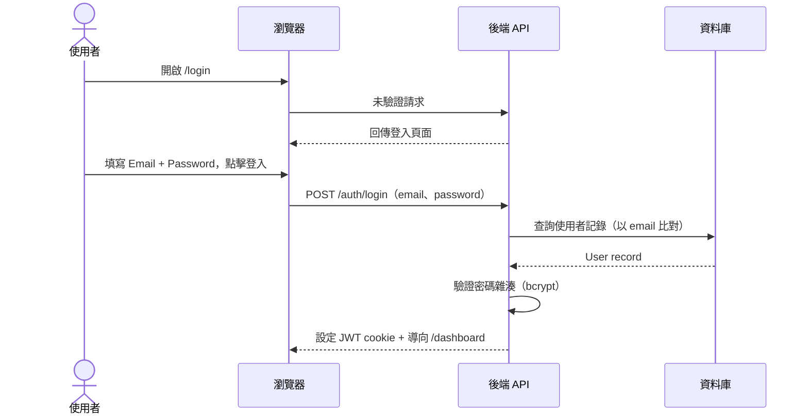
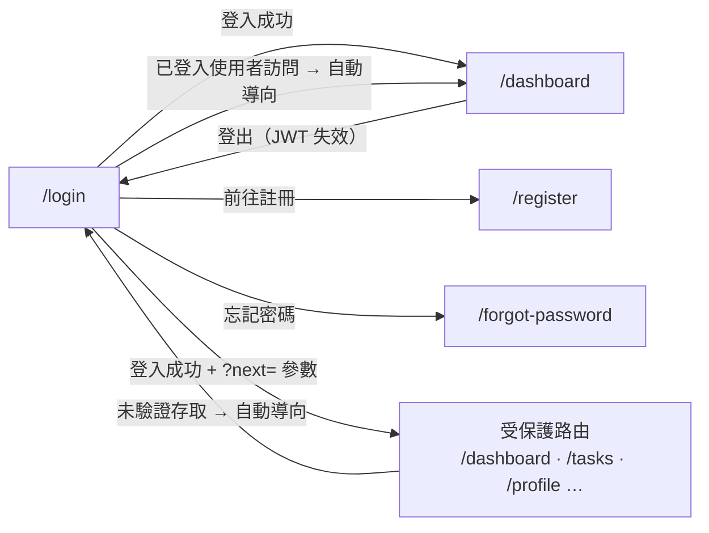

# 功能規格：登入 — Email / Password + 頁面 UI

**功能分支**：`001-login-email-password`
**建立日期**：2026-04-05
**版本**：1.0.0
**狀態**：Clarified
**需求來源**：IA v7 Spec 清單 #001 — 登入 — Email/Password + 頁面 UI

## Process Flow

| 步驟 | 角色 | 動作 | 系統回應 |
|------|------|------|---------|
| 1 | 使用者 | 開啟 `/login` | 回傳登入頁面（含 Google SSO 按鈕、Email/Password 表單、連結） |
| 2 | 使用者 | 填寫 Email / Password 並送出 | 後端驗證 bcrypt 密碼雜湊 |
| 3 | 後端 | 驗證通過 | 查詢使用者記錄 |
| 4 | 後端 | 驗證通過 | 簽發 JWT，導向 `/dashboard` |
| E1 | 使用者 | Email / Password 錯誤 | 停留 `/login` 並顯示錯誤訊息（不揭露哪個欄位錯誤） |
| E2 | 後端 | JWT 過期 | 導向 `/login`，不靜默更新 |

---

## 使用者情境與測試 *(必填)*

### User Story 1 — Email / Password 登入（優先級：P1）

使用者在 `/login` 頁面填寫 Email 與 Password 並送出，系統驗證後簽發 JWT，導向 `/dashboard`。登入頁面需完整呈現所有必要 UI 元件，並支援響應式與多語言。

**此優先級原因**：Email / Password 是不依賴第三方服務的基礎登入方式，是整個系統的唯一驗證入口。

**獨立測試方式**：進入 `/login`，使用正確的 Email / Password 登入，驗證導向 `/dashboard` 且 session token 已設定。再以錯誤憑證測試，確認錯誤訊息顯示且不揭露欄位資訊。

**驗收情境**：

1. **Given** 未登入使用者在 `/login`，**When** 填寫正確的 Email / Password 並送出，**Then** 導向 `/dashboard` 且 session token 已儲存。
2. **Given** 未登入使用者在 `/login`，**When** 填寫錯誤的 Email 或 Password，**Then** 停留在 `/login` 並顯示明確的錯誤訊息，訊息不揭露哪個欄位錯誤。
3. **Given** 已登入使用者，**When** 導向 `/login`，**Then** 自動導向 `/dashboard`。
4. **Given** 使用者在 `/login`，**When** 頁面載入，**Then** 頁面包含：「以 Google 登入」按鈕、Email 輸入欄、Password 輸入欄、登入按鈕、「前往註冊」連結（→ `/register`）、「忘記密碼」連結（→ `/forgot-password`）。
5. **Given** 使用者在 `/login`，**When** 切換語言，**Then** 頁面所有文字立即切換為對應語言（zh-TW / en），不需重新載入頁面。
6. **Given** 使用者在寬度 375px / 768px / 1440px 的裝置上，**When** 開啟 `/login`，**Then** 頁面所有元件均正確渲染，無版型破版。

---

### User Story 2 — 登出（優先級：P2）

已登入使用者可在應用程式任意頁面點擊登出，JWT 立即失效，導向 `/login`。

**此優先級原因**：登出是基本安全需求，在實驗室多人共用環境中尤為重要。

**獨立測試方式**：登入後點擊登出按鈕，驗證導向 `/login`，並以舊 JWT 發送 API 請求確認回傳 HTTP 401。

**驗收情境**：

1. **Given** 已登入使用者，**When** 點擊「登出」按鈕，**Then** JWT 失效、客戶端 session 清除，並導向 `/login`。
2. **Given** 已登出使用者，**When** 直接存取 `/dashboard`，**Then** 被導向 `/login`。
3. **Given** 已登出使用者，**When** 使用瀏覽器返回按鈕進入快取的受保護頁面，**Then** 頁面不顯示已登入內容（重新驗證或顯示登入頁）。

---

### User Story 3 — 受保護路由強制驗證（優先級：P3）

任何未登入使用者嘗試存取受保護頁面，系統導向 `/login`，並在登入成功後返回原始目標頁面。

**此優先級原因**：路由保護是安全需求，但可在登入流程穩定後實作。

**獨立測試方式**：在無 session 狀態下直接導向 `/dashboard`，驗證被導向 `/login?next=/dashboard`；登入後確認返回 `/dashboard`。

**驗收情境**：

1. **Given** 未登入使用者，**When** 直接導向 `/dashboard`，**Then** 被導向 `/login`。
2. **Given** 從 `/task-list` 被導向 `/login` 的使用者，**When** 成功登入，**Then** 返回 `/task-list`。

---

### 邊界情況

- Email / Password 帳號忘記密碼時？→ 點擊登入頁「忘記密碼」連結，前往 `/forgot-password` 自助申請重設（詳見 spec 004）。
- JWT 在工作階段中途過期時？→ 導向 `/login`，不進行靜默更新（silent refresh），使用者必須重新驗證。
- 已登入使用者再次訪問 `/login` 時？→ 自動導向 `/dashboard`，不顯示登入表單。
- 相同 Email 同時存在 Google 帳號與 Email/Password 帳號時？→ 視為同一帳號靜默合併（詳見 spec 002）。
- `?next=` 參數的目標路徑合法性驗證？→ `?next=` 參數必須驗證為系統內部路由（相對路徑或同 origin），防止 open redirect 攻擊；非法 next 值忽略，改導向 `/dashboard`。

---

## 需求規格 *(必填)*

### 功能需求

- **FR-001**：系統必須提供含「以 Google 登入」按鈕、Email / Password 表單、「前往註冊」連結與「忘記密碼」連結的 `/login` 頁面。
- **FR-002**：系統必須對 Email / Password 登入實作 bcrypt 密碼雜湊驗證。
- **FR-003**：系統必須在 Email / Password 驗證成功後簽發 JWT session token。
- **FR-004**：系統必須將已登入使用者訪問 `/login` 時自動導向 `/dashboard`。
- **FR-006**：系統必須保護所有非公開路由，將未驗證存取導向 `/login`（可帶 `?next=` 參數保留原始路徑）。
- **FR-007**：登入頁面必須具備響應式設計，支援 375px、768px、1440px 視窗寬度。
- **FR-008**：登入頁面必須支援 zh-TW / en 語言切換，與應用程式其他頁面一致；語言切換立即生效，不需重新載入頁面。
- **FR-009**：系統必須在所有已登入頁面提供可存取的登出操作（按鈕或連結）。
- **FR-010**：登出時，系統必須使 JWT 失效並清除所有客戶端 session 儲存。
- **FR-011**：JWT 過期時，系統必須將使用者導向 `/login`，不支援靜默更新 token。
- **FR-012**：登入失敗時，錯誤訊息不得揭露哪個欄位（Email 或 Password）錯誤。

### User Flow & Navigation

| From | Trigger | To |
|------|---------|-----|
| `/login` | Email/Password 登入成功 | `/dashboard` |
| `/login` | 已登入使用者訪問 | `/dashboard`（自動導向）|
| `/login` | 登入成功 + `?next=` 參數 | 原始目標路由 |
| `/login` | 點擊「前往註冊」| `/register`（spec 003）|
| `/login` | 點擊「忘記密碼」| `/forgot-password`（spec 004）|
| 任意已登入頁面 | 點擊登出 | `/login` |
| 任意受保護路由 | 未驗證存取 | `/login?next=[原始路徑]` |

**Entry points**：`/login` 是系統唯一的未驗證入口（含 `/register`、`/forgot-password` 的導覽連結）。
**Exit points**：所有受保護路由均可透過登出按鈕返回 `/login`。

### 關鍵實體

- **User（使用者）**：代表已驗證身份。關鍵屬性：`id`、`email`、`name`、`hashed_password`（Email/Password 帳號）、`role`（系統角色：`user` | `super_admin`）、`created_at`。任務角色（`project_leader` | `reviewer` | `annotator`）儲存於 `task_membership` 表，不在 JWT 中。
- **Session / JWT**：成功驗證後簽發的短效存取 token。包含 `user_id`、`role`、`exp`。過期後系統導向 `/login`，不進行靜默更新。

---

## 規格相依性 *(本功能依賴其他規格，或被其他規格依賴時填寫)*

### 上游（本規格依賴的規格）

| 規格編號 | 功能 | 本規格需要的內容 |
|---------|------|----------------|
| — | — | — |

### 下游（依賴本規格的規格）

| 規格編號 | 功能 | 依賴本規格的內容 |
|---------|------|----------------|
| 002 | Login — Google SSO | `/login` 頁面結構（Google SSO 按鈕位置）、User model、帳號靜默合併邏輯（相同 email 視為同一帳號） |
| 003 | Register — Email / Password | User model（`hashed_password`、`role` 欄位）、登入頁面連結（「前往登入」→ `/login`） |
| 004 | Forgot / Reset Password | User model（`email` 欄位）、`/login` 頁面連結（「忘記密碼」入口） |
| 005 | Profile Settings | 已驗證 session（JWT）、User model（`name`、`email` 可編輯欄位）、登出行為 |

---

## 成功標準 *(必填)*

- **SC-001**：使用者可在 30 秒內完成完整登入流程（填寫表單 → 送出 → 儀表板）。
- **SC-002**：API 回應與前端 bundle 中不暴露任何使用者憑證或 token。
- **SC-003**：登入頁面在視窗寬度 375px、768px、1440px 下均正確渲染，無版型破版。
- **SC-004**：對任何受保護路由的未驗證請求回傳 HTTP 401 或導向 `/login`。
- **SC-005**：登出後，已失效的 JWT 被所有受保護 API 端點拒絕（回傳 HTTP 401）。
- **SC-006**：登入頁面正確顯示 zh-TW 與 en 兩種語言；語言切換立即生效，不需重新載入頁面。
- **SC-007**：執行資料庫 migration 後，全新部署環境中存在一個預設 `super_admin` 帳號（bootstrap seed）。此需求的功能規格定義於 `specs/admin/006-user-management/spec.md` FR-008。

---

## Changelog

| 版本 | 日期 | 變更摘要 |
|------|------|---------|
| 1.0.0 | 2026-04-05 | Initial spec |
