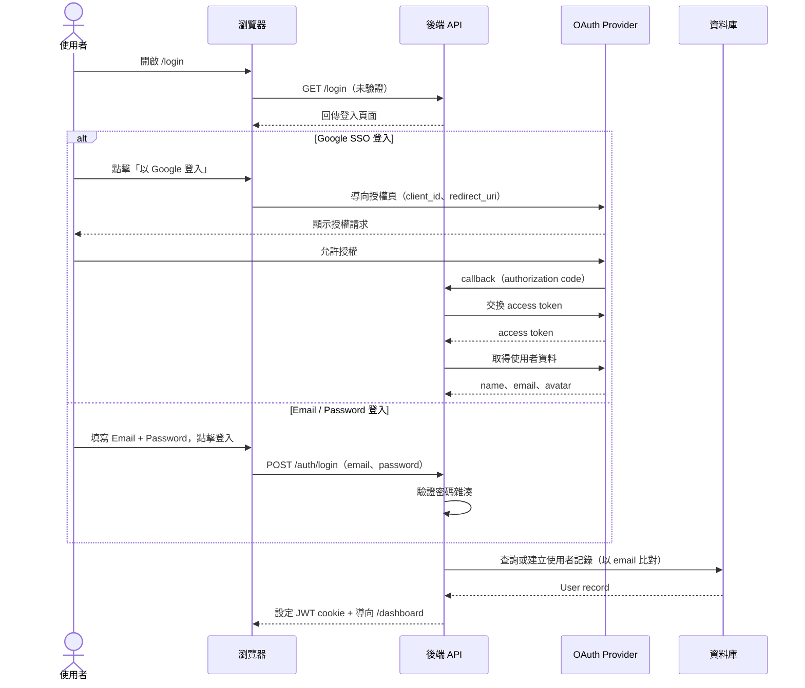
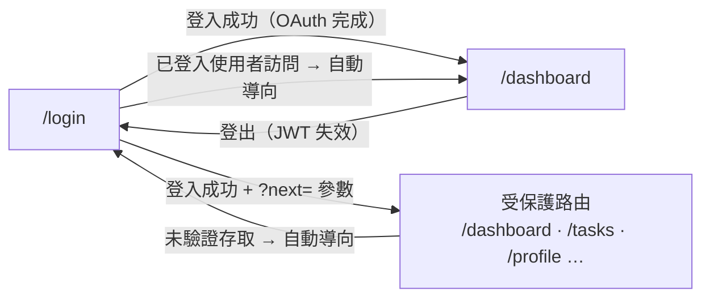

# 功能規格：SSO 登入

**功能分支**：`001-sso-login`
**建立日期**：2026-03-25
**狀態**：Clarified
**需求來源**：「先做一個簡單的登入畫面，需要串接 Google SSO 與 Email / Password 登入」

## Process Flow

OAuth 登入涉及四個系統角色，以下為完整業務流程：

| 步驟 | 角色 | 動作 | 系統回應 |
|------|------|------|---------|
| 1 | 使用者 | 開啟 `/login` | 回傳登入頁面 |
| 2a | 使用者 | 點擊「以 Google 登入」 | 導向 Google 授權頁 |
| 2b | 使用者 | 填寫 Email / Password 並送出 | 後端驗證密碼雜湊 |
| 3 | OAuth Provider / 後端 | 驗證完成 | 查詢或建立 User 記錄 |
| 4 | 後端 | 簽發 JWT | 導向 `/dashboard` |
| E1 | 使用者 | 取消 Google 授權 | 停留 `/login` 並顯示錯誤 |
| E2 | 使用者 | Email / Password 錯誤 | 停留 `/login` 並顯示錯誤訊息 |
| E3 | 後端 | JWT 過期 | 導向 `/login`，不靜默更新 |

---

## 使用者情境與測試 *(必填)*

### User Story 1 — 登入（Google SSO 或 Email / Password）（優先級：P1）

使用者（研究生或工讀生）進入 Label Suite 入口，看到簡潔的登入頁面。
可選擇點擊「以 Google 登入」完成 OAuth 流程，或直接填寫 Email / Password 送出，
系統完成身份驗證並導向儀表板。

**此優先級原因**：身份驗證是所有功能的入口，沒有登入就無法使用任何功能。Google SSO 提供便利性；Email / Password 提供不依賴 Google 帳號的備用方案。

**獨立測試方式**：進入 `/login`，分別測試 Google SSO 路徑與 Email / Password 路徑，驗證兩者均可導向 `/dashboard` 並存有有效 session token。

**驗收情境**：

1. **Given** 未登入使用者在 `/login`，**When** 點擊「以 Google 登入」並完成 Google OAuth，**Then** 導向 `/dashboard` 且 session token 已儲存。
2. **Given** 未登入使用者在 `/login`，**When** 填寫正確的 Email / Password 並送出，**Then** 導向 `/dashboard` 且 session token 已儲存。
3. **Given** 未登入使用者在 `/login`，**When** 填寫錯誤的 Email 或 Password，**Then** 停留在 `/login` 並顯示明確的錯誤訊息（不揭露哪個欄位錯誤）。
4. **Given** 使用者取消或拒絕 Google OAuth 授權，**When** 被導回，**Then** 停留在 `/login` 並顯示明確的錯誤訊息。
5. **Given** 已登入使用者，**When** 導向 `/login`，**Then** 自動導向 `/dashboard`。

---

### User Story 2 — 首次使用者帳號建立（優先級：P2）

從未登入過的使用者透過 Google SSO 完成身份驗證，或透過 `/register` 頁面自行建立 Email / Password 帳號。
系統自動使用 Google 個人資料（姓名、Email、頭像）或 Email / Password 自填資料建立新帳號，預設 `role = null`（無角色）。
使用者登入後進入待指派提示頁，無法存取任何功能模組，直到 Super Admin 在使用者管理頁指派系統角色為止。

**此優先級原因**：流暢的首次使用體驗很重要，但核心登入流程（P1）必須先完成。自行登入後等待指派的設計讓 Super Admin 保有控制誰能使用平台的權力，同時不需預先建立帳號。

**獨立測試方式**：以新的 Google 帳號登入，或透過 `/register` 建立新帳號後登入，驗證資料庫中建立了 `role = null` 的使用者記錄，且該使用者只能看到待指派提示頁。

**驗收情境**：

1. **Given** 首次使用者完成 Google OAuth，**When** callback 處理完成，**Then** 建立包含 Google 個人資料的 `name`、`email`、`avatar_url` 使用者記錄，且 `role = null`。
2. **Given** `role = null` 的已登入使用者，**When** 嘗試存取任何功能頁面，**Then** 導向待指派提示頁，顯示「您的帳號尚未被指派角色，請聯絡管理員」。
3. **Given** 回訪使用者（email 已存在），**When** 再次以 Google 登入，**Then** 不建立重複帳號，回傳既有帳號的 session。
4. **Given** 使用者已透過 `/register` 自行建立 Email / Password 帳號，**When** 使用者首次以正確密碼登入，**Then** 回傳既有帳號的 session（`role = null`）。

---

### User Story 3 — 受保護路由強制驗證（優先級：P3）

任何未登入使用者嘗試存取受保護頁面（如 `/dashboard`、`/tasks`），
系統導向 `/login`，並在登入成功後返回原始目標頁面。

**此優先級原因**：路由保護是安全需求，但可在登入流程確認可用後再實作。

**獨立測試方式**：在無 session 狀態下直接導向 `/dashboard`，驗證被導向 `/login?next=/dashboard`。

**驗收情境**：

1. **Given** 未登入使用者，**When** 直接導向 `/dashboard`，**Then** 被導向 `/login`。
2. **Given** 從 `/tasks` 被導向 `/login` 的使用者，**When** 成功登入，**Then** 返回 `/tasks`。

---

### User Story 4 — 登出（優先級：P2）

已登入使用者可以在應用程式任何頁面登出。
登出後，session 失效並導向 `/login`。
登出後存取受保護路由需重新驗證。

**此優先級原因**：登出是基本的安全需求，在多人共用機器的實驗室環境中尤為重要。

**獨立測試方式**：登入後點擊登出按鈕，驗證導向 `/login`，並確認舊的 session token 不再被接受。

**驗收情境**：

1. **Given** 已登入使用者，**When** 點擊「登出」按鈕，**Then** JWT 失效並導向 `/login`。
2. **Given** 已登出使用者，**When** 直接存取 `/dashboard`，**Then** 被導向 `/login`。
3. **Given** 已登出使用者，**When** 使用瀏覽器返回按鈕進入快取的受保護頁面，**Then** 頁面不顯示已登入內容（重新驗證或顯示登入頁）。

---

### 邊界情況

- Google OAuth 暫時無法使用時？→ 在登入頁顯示友善的錯誤訊息，提示使用 Email / Password 替代登入。
- Email / Password 帳號忘記密碼時？→ 由 Super Admin 在使用者管理頁重設密碼（系統不實作自助重設流程，避免 SMTP 依賴）。
- 相同 Email 同時存在 Google 帳號與 Email/Password 帳號時？→ 靜默合併：視為同一帳號（以 email 比對），兩種登入方式均可進入同一使用者記錄，不需使用者確認。
- JWT 在工作階段中途過期時？→ 導向 `/login`，不進行靜默更新（silent refresh），使用者必須重新驗證。

## 需求規格 *(必填)*

### 功能需求

- **FR-001**：系統必須提供含「以 Google 登入」按鈕與 Email / Password 表單的 `/login` 頁面。
- **FR-002**：系統必須對 Google 實作 OAuth 2.0 授權碼流程；並對 Email / Password 實作密碼雜湊驗證（bcrypt）。
- **FR-003**：系統必須在成功驗證後簽發 JWT session token。
- **FR-004**：系統必須在首次 Google SSO 登入時，使用身份提供者個人資料自動建立使用者記錄，預設 `role = null`。
- **FR-005**：系統必須將 `role = null` 的已登入使用者導向待指派提示頁（`/pending`），而非 `/dashboard`。
- **FR-006**：系統必須將已有角色的已登入使用者從 `/login` 導向 `/dashboard`。
- **FR-007**：系統必須保護所有非登入路由，將未驗證存取導向 `/login`。
- **FR-008**：登入頁面必須具備響應式設計，支援行動裝置瀏覽器。
- **FR-009**：OAuth 客戶端憑證必須儲存於環境變數，絕不硬編碼。
- **FR-010**：系統必須在所有已登入頁面提供可存取的登出操作（按鈕或連結）。
- **FR-011**：登出時，系統必須使 JWT 失效並清除所有客戶端 session 儲存。
- **FR-012**：資料庫 migration seed 必須建立一個預設 super_admin 帳號，確保首次部署時有 super_admin 可指派其他使用者的角色。
- **FR-013**：JWT 過期時，系統必須將使用者導向 `/login`，不支援靜默更新 token。
- **FR-014**：當使用者以某個身份提供者登入，且 email 已對應另一個身份提供者的帳號時，系統必須靜默合併兩個 provider 至既有帳號，不需使用者確認。
- **FR-015**：登入頁面必須支援 zh-TW / en 語言切換，與應用程式其他頁面一致。

### User Flow & Navigation

| From | Trigger | To |
|------|---------|-----|
| `/login` | OAuth 登入成功 | `/dashboard` |
| `/login` | 已登入使用者訪問 | `/dashboard`（自動導向）|
| `/login` | 登入成功 + `?next=` 參數 | 原始目標路由 |
| 任意已登入頁面 | 點擊登出 | `/login` |
| 任意受保護路由 | 未驗證存取 | `/login?next=[原始路徑]` |

**Entry points**：`/login` 是系統唯一的未驗證入口。
**Exit points**：所有受保護路由均可透過登出按鈕返回 `/login`。

### 關鍵實體

- **User（使用者）**：代表已驗證身份。關鍵屬性：`id`、`email`、`name`、`avatar_url`、`provider`（google | email）、`provider_id`（Google 帳號 ID，Email/Password 帳號為 null）、`hashed_password`（Email/Password 帳號用，Google 帳號為 null）、`role`（系統角色：null | annotator | super_admin）、`created_at`。
  - 首次登入（Google SSO 或 Email / Password 自行註冊）預設 `role = null`；由 Super Admin 在使用者管理頁指派 `annotator` 系統角色後才有功能存取權。`project_leader` 和 `reviewer` 為任務角色，儲存於 `task_membership` 表，不在 JWT 中。
- **TaskMembership（任務成員）**：紀錄使用者在特定任務中的角色。關鍵屬性：`task_id`、`user_id`、`task_role`（project_leader | reviewer | annotator）。建立任務時自動為任務建立者新增 `task_role = project_leader` 的記錄。
- **Session / JWT**：OAuth callback 成功後簽發的短效存取 token。包含 `user_id`、`role`、`exp`。過期後系統導向 `/login`，不進行靜默更新。

## 成功標準 *(必填)*

- **SC-001**：使用者可在 30 秒內完成完整登入流程（點擊 → OAuth → 儀表板）。
- **SC-002**：API 回應與前端 bundle 中不暴露任何使用者憑證或 token。
- **SC-003**：登入頁面在視窗寬度 375px、768px、1440px 下均正確渲染。
- **SC-004**：對任何受保護路由的未驗證請求回傳 HTTP 401 或導向 `/login`。
- **SC-005**：首次登入建立唯一一筆使用者記錄；重複登入不建立重複記錄。
- **SC-006**：登出後，已失效的 JWT 被所有受保護 API 端點拒絕（回傳 HTTP 401）。
- **SC-007**：登入頁面正確顯示 zh-TW 與 en 兩種語言；語言切換立即生效，不需重新載入頁面。
- **SC-008**：執行資料庫 migration 後，全新部署環境中存在一個預設 super_admin 帳號。
- **SC-009**：使用者以 Google 登入後，再以相同 email 的 Email / Password 登入，最終只有一筆使用者記錄並連結兩個 provider。
