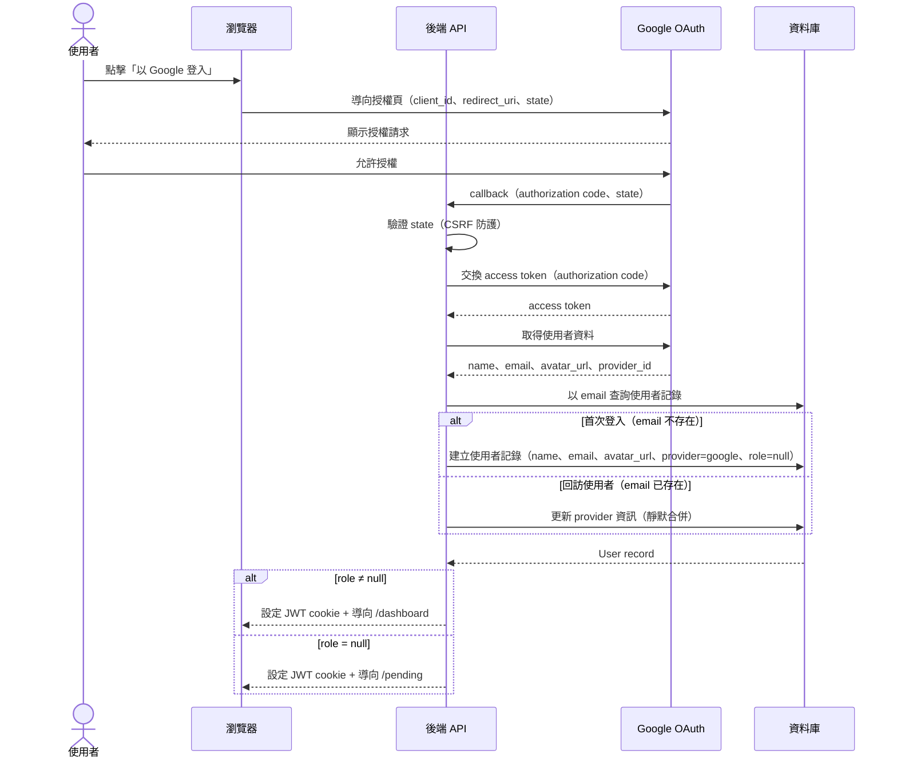
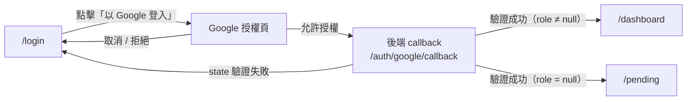

# 功能規格：登入 — Google SSO 整合

**功能分支**：`002-login-google-sso`
**建立日期**：2026-04-05
**狀態**：Clarified
**需求來源**：IA v7 Spec 清單 #002 — 登入 — Google SSO 整合

## Process Flow

OAuth 登入涉及四個系統角色，以下為完整業務流程：

| 步驟 | 角色 | 動作 | 系統回應 |
|------|------|------|---------|
| 1 | 使用者 | 點擊「以 Google 登入」 | 導向 Google 授權頁 |
| 2 | 使用者 | 允許授權 | Google 導回後端 callback |
| 3 | 後端 | 驗證 state、交換 token、取得使用者資料 | 查詢或建立使用者記錄 |
| 4a | 後端 | `role ≠ null` | 簽發 JWT，導向 `/dashboard` |
| 4b | 後端 | `role = null` | 簽發 JWT，導向 `/pending` |
| E1 | 使用者 | 取消或拒絕 Google 授權 | 導回 `/login` 並顯示錯誤訊息 |
| E2 | 後端 | state 驗證失敗（CSRF） | 導回 `/login` 並顯示錯誤訊息 |

---

## 使用者情境與測試 *(必填)*

### User Story 1 — Google SSO 登入（優先級：P1）

使用者在 `/login` 頁面點擊「以 Google 登入」，完成 Google OAuth 授權流程，系統簽發 JWT 並依角色導向 `/dashboard`（有角色）或 `/pending`（無角色）。

**此優先級原因**：Google SSO 提供便捷的單點登入體驗，是實驗室環境最常見的登入方式。

**獨立測試方式**：在 `/login` 點擊「以 Google 登入」，完成 Google 授權，驗證導向 `/dashboard` 或 `/pending` 且 session token 已設定。

**驗收情境**：

1. **Given** 未登入使用者在 `/login`，**When** 點擊「以 Google 登入」並完成 Google OAuth 授權，**Then** 導向 `/dashboard` 且 JWT session token 已設定（使用者 `role ≠ null`）。
2. **Given** 未登入使用者在 `/login`，**When** 點擊「以 Google 登入」並完成 Google OAuth 授權，**Then** 導向 `/pending` 且 JWT session token 已設定（首次登入，`role = null`）。
3. **Given** 使用者取消或拒絕 Google OAuth 授權，**When** 被導回 callback，**Then** 停留在 `/login` 並顯示明確的錯誤訊息。
4. **Given** 已登入使用者，**When** 導向 `/login`，**Then** 自動導向 `/dashboard`（不重新觸發 OAuth 流程）。

---

### User Story 2 — 首次登入自動建立帳號（優先級：P2）

從未登入過的使用者透過 Google SSO 完成授權，系統自動以 Google 個人資料（姓名、Email、頭像）建立新帳號，預設 `role = null`，導向 `/pending` 等待 Super Admin 指派角色。

**此優先級原因**：自動建帳號是 SSO 流程的核心環節，確保使用者無需手動填寫資料即可加入系統。

**獨立測試方式**：以從未登入過的 Google 帳號完成 OAuth 授權，驗證資料庫建立了包含 Google 個人資料且 `role = null` 的使用者記錄，且被導向 `/pending`。

**驗收情境**：

1. **Given** 首次使用者完成 Google OAuth 授權，**When** callback 處理完成，**Then** 建立包含 `name`、`email`、`avatar_url`、`provider = google`、`provider_id`（Google UID）且 `role = null` 的使用者記錄。
2. **Given** 回訪使用者（email 已存在），**When** 再次以 Google 登入，**Then** 不建立重複帳號，回傳既有帳號的 session。
3. **Given** `role = null` 的已登入使用者，**When** 嘗試存取任何功能頁面，**Then** 導向 `/pending`，顯示「您的帳號尚未被指派角色，請聯絡管理員」。

---

### User Story 3 — Provider 靜默合併（優先級：P3）

使用者以 Google 帳號登入，而系統中已存在相同 email 的 Email / Password 帳號，系統靜默合併兩個 provider 至同一使用者記錄，不需使用者確認，兩種登入方式均可進入同一帳號。

**此優先級原因**：防止同一使用者建立重複帳號，保持資料一致性。實作難度低，但對使用者體驗影響大。

**獨立測試方式**：先以 Email / Password 建立帳號（spec 003），再以相同 email 的 Google 帳號登入，驗證資料庫中只有一筆使用者記錄且同時連結兩個 provider。

**驗收情境**：

1. **Given** 已存在 Email / Password 帳號的使用者，**When** 以相同 email 的 Google 帳號登入，**Then** 不建立新帳號，既有帳號新增 `provider = google` 與 `provider_id` 資訊，兩種登入方式均可進入同一帳號。
2. **Given** 已合併 provider 的使用者，**When** 分別以 Google SSO 和 Email / Password 登入，**Then** 兩者均導向相同的 `/dashboard`，顯示相同的使用者資料。

---

### 邊界情況

- Google OAuth 暫時無法使用時？→ 在登入頁顯示友善的錯誤訊息，提示使用 Email / Password 替代登入（spec 001）。
- state 參數驗證失敗（CSRF 攻擊）時？→ 拒絕 callback 並導回 `/login` 顯示錯誤，不建立 session。
- Google 回傳的 email 為空時？→ 拒絕登入並顯示錯誤訊息「無法取得 Google 帳號 Email，請使用 Email / Password 登入」。

---

## 需求規格 *(必填)*

### 功能需求

- **FR-001**：系統必須對 Google 實作 OAuth 2.0 授權碼流程（Authorization Code Flow），包含 state 參數的 CSRF 防護。
- **FR-002**：OAuth 客戶端憑證（`GOOGLE_CLIENT_ID`、`GOOGLE_CLIENT_SECRET`）必須儲存於環境變數，絕不硬編碼於程式碼或版本控制中。
- **FR-003**：系統必須在 OAuth callback 成功後，使用 Google 個人資料（`name`、`email`、`avatar_url`、`provider_id`）自動建立或更新使用者記錄。
- **FR-004**：首次 Google SSO 登入時，使用者記錄預設 `role = null`；後續登入不修改既有 `role`。
- **FR-005**：系統必須將 `role = null` 的已登入使用者導向 `/pending`，而非 `/dashboard`。
- **FR-006**：系統必須將已有角色的已登入使用者從 `/login` 自動導向 `/dashboard`。
- **FR-007**：當 Google SSO 的 email 與系統中既有的 Email / Password 帳號相符時，系統必須靜默合併兩個 provider 至既有帳號，不需使用者確認。
- **FR-008**：使用者取消或拒絕 Google OAuth 授權時，系統必須導回 `/login` 並顯示明確的錯誤訊息。

### User Flow & Navigation

| From | Trigger | To |
|------|---------|-----|
| `/login` | 點擊「以 Google 登入」 | Google 授權頁 |
| Google 授權頁 | 使用者允許授權 | `/auth/google/callback`（後端） |
| Google 授權頁 | 使用者取消 / 拒絕 | `/login`（含錯誤訊息） |
| `/auth/google/callback` | 驗證成功（`role ≠ null`）| `/dashboard` |
| `/auth/google/callback` | 驗證成功（`role = null`）| `/pending` |
| `/auth/google/callback` | state 驗證失敗 | `/login`（含錯誤訊息） |

**Entry points**：`/login` 頁面的「以 Google 登入」按鈕（UI 由 spec 001 提供）。
**Exit points**：OAuth 流程結束後導向 `/dashboard` 或 `/pending`；失敗時返回 `/login`。

### 關鍵實體

- **User（使用者）**：關鍵屬性：`id`、`email`、`name`、`avatar_url`、`providers`（已連結的登入方式陣列，例如 `["google"]`、`["email"]`、`["google", "email"]`）、`provider_id`（Google UID；僅 Email/Password 帳號為 `null`）、`hashed_password`（Email/Password 帳號用；純 Google 帳號為 `null`，合併後有值）、`role`（`null` | `annotator` | `super_admin`）、`created_at`。`providers` 以應用層邏輯維護，非資料庫單值欄位。
- **OAuthState**：防 CSRF 用的一次性隨機 state 值，儲存於 server-side session，callback 時驗證後即失效。
- **Session / JWT**：OAuth callback 成功後簽發的短效存取 token。包含 `user_id`、`role`、`exp`。過期後導向 `/login`，不進行靜默更新。

---

## 成功標準 *(必填)*

- **SC-001**：使用者可在 30 秒內完成完整 Google SSO 登入流程（點擊 → Google 授權 → 儀表板）。
- **SC-002**：OAuth 客戶端憑證與 access token 不暴露於 API 回應或前端 bundle 中。
- **SC-003**：首次 Google SSO 登入建立唯一一筆使用者記錄，包含完整 Google 個人資料。
- **SC-004**：回訪使用者以相同 Google 帳號再次登入，不建立重複使用者記錄。
- **SC-005**：取消或拒絕 Google OAuth 授權後，`/login` 頁面顯示明確的錯誤訊息。
- **SC-006**：使用者以 Google 登入後，再以相同 email 的 Email / Password 登入，最終只有一筆使用者記錄並連結兩個 provider。
