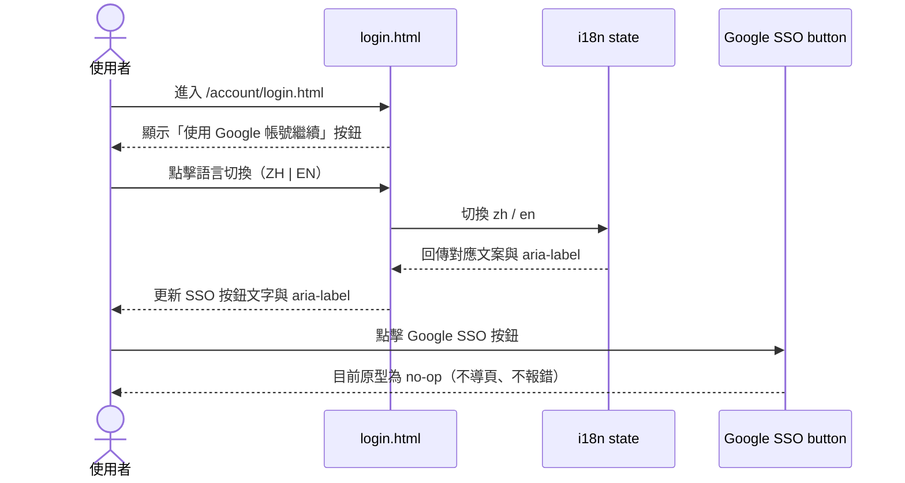
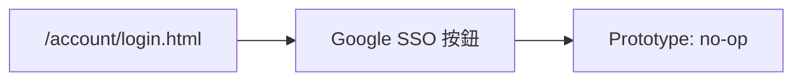

# 功能規格：Login — Google SSO 入口與整合預留

**功能分支**：`002-login-google-sso`
**建立日期**：2026-04-05
**版本**：1.1.0
**狀態**：Clarified
**需求來源**：最新原型 [`design/prototype/pages/account/login.html`](../../../design/prototype/pages/account/login.html)

## 規格常數

- `MOBILE_BP = 767px`
- `RWD_VIEWPORTS = 375px / 768px / 1440px`

## Process Flow

| 步驟 | 角色 | 動作 | 系統回應 |
|------|------|------|---------|
| 1 | 使用者 | 開啟 `/account/login.html` | 顯示 Google SSO 按鈕（含 Google icon） |
| 2 | 使用者 | 切換語言 | SSO 按鈕文字與 `aria-label` 即時切換 |
| 3 | 使用者 | 點擊 Google SSO 按鈕 | 目前原型不觸發 OAuth 流程（no-op） |

---

## 使用者情境與測試 *(必填)*

### User Story 1 — Google SSO 入口可見且可互動（優先級：P1）

登入頁必須提供清楚的 Google SSO 入口，讓使用者知道可用第三方登入。

**此優先級原因**：SSO 入口是本規格最小可交付範圍，缺少入口會中斷後續整合。

**獨立測試方式**：進入登入頁後檢查按鈕存在、文案正確、可點擊且無錯誤。

**驗收情境**：

1. **Given** 使用者在 `/account/login.html`，**When** 頁面載入，**Then** 顯示 Google SSO 按鈕與圖示。
2. **Given** 使用者在登入頁，**When** 點擊 Google SSO 按鈕，**Then** 按鈕可正常觸發 click 事件且頁面不報錯。
3. **Given** 使用者在登入頁，**When** 檢查無障礙屬性，**Then** Google SSO 按鈕具有對應語言的 `aria-label`。

---

### User Story 2 — SSO 入口 i18n 同步（優先級：P1）

SSO 入口文字與可存取屬性需隨語言切換即時更新。

**此優先級原因**：SSO 與 Email 登入並列，必須遵循相同 i18n 標準。

**獨立測試方式**：切換 `zh` / `en`，檢查按鈕文字與 `aria-label` 是否同步更新。

**驗收情境**：

1. **Given** 預設語言為 `zh`，**When** 切換為 `en`，**Then** SSO 按鈕文字更新為 `Continue with Google`。
2. **Given** 語言為 `en`，**When** 切回 `zh`，**Then** SSO 按鈕文字更新為 `使用 Google 帳號繼續`。
3. **Given** 任一語言切換後，**When** 檢查按鈕，**Then** `aria-label` 與當前語言一致。

---

### User Story 3 — OAuth 正式整合預留（優先級：P2）

目前原型不執行 OAuth，規格需保留後續串接入口契約。

**此優先級原因**：避免前端原型與後端 OAuth 整合時出現斷層。

**獨立測試方式**：驗證現況為 no-op，同時保留整合前後行為說明。

**驗收情境**：

1. **Given** 目前為 prototype，**When** 點擊 SSO 按鈕，**Then** 不導頁、不呼叫 OAuth callback。
2. **Given** 後續整合階段，**When** 將 no-op 替換為真實流程，**Then** 保持按鈕位置、文案與可存取屬性不變。

---

### 邊界情況

- 使用者快速連點 SSO 按鈕？→ 原型仍維持 no-op，不應造成 JS 錯誤。
- 語言切換時按鈕正被點擊？→ 以最後一次語言狀態更新文案與 `aria-label`。
- 目前是否已有 `/auth/google/callback` 串接？→ 尚未，需在實作階段補齊。

---

## 需求規格 *(必填)*

### 功能需求

- **FR-001**：登入頁必須提供 Google SSO 按鈕，並與 Email/Password 表單同頁呈現。
- **FR-002**：Google SSO 按鈕必須包含可辨識的 Google 品牌圖示與文字標籤。
- **FR-003**：Google SSO 按鈕文字必須支援 `zh` / `en` 即時切換。
- **FR-004**：Google SSO 按鈕 `aria-label` 必須隨語言切換同步更新。
- **FR-005**：原型模式下，Google SSO 按鈕 click 行為必須為 no-op，且不得造成前端錯誤。
- **FR-006**：本規格必須保留後續 OAuth 2.0 Authorization Code Flow 的整合入口，不變更既有按鈕 ID 與語意。

### User Flow & Navigation

| From | Trigger | To |
|------|---------|-----|
| `/account/login.html` | 點擊 Google SSO 按鈕 | Prototype no-op（停留原頁） |

**Entry points**：`/account/login.html` 的 Google SSO 按鈕。
**Exit points**：目前原型無導頁（未串接 OAuth）。

### 關鍵實體

- **GoogleSsoEntryState**：SSO 入口狀態。關鍵欄位：`visible`、`label`、`ariaLabel`、`clickHandler`。
- **LanguageState**：語言狀態。關鍵欄位：`lang`（`zh` / `en`）。
- **OAuthIntegrationState**：整合狀態。關鍵欄位：`mode`（`prototype_noop` / `oauth_enabled`）。

---

## 規格相依性 *(本功能依賴其他規格，或被其他規格依賴時填寫)*

### 上游（本規格依賴的規格）

| 規格編號 | 功能 | 本規格需要的內容 |
|---------|------|----------------|
| 001 | Login — Email / Password + 頁面 UI | `/account/login.html` 頁面框架、i18n 狀態管理、語言切換控制 |

### 下游（依賴本規格的規格）

| 規格編號 | 功能 | 依賴本規格的內容 |
|---------|------|----------------|
| 005 | Profile Settings | 後續 OAuth 整合後的 provider 顯示來源 |

---

## 成功標準 *(必填)*

- **SC-001**：登入頁固定顯示 Google SSO 入口，無遺漏或跑版。
- **SC-002**：`zh` / `en` 切換後，SSO 文案與 `aria-label` 在 1 秒內同步更新。
- **SC-003**：點擊 SSO 按鈕在 prototype 模式不導頁且不拋出錯誤。
- **SC-004**：SSO 入口在桌機與手機版皆可正常點擊與閱讀。

---

## Changelog

| 版本 | 日期 | 變更摘要 |
|------|------|---------|
| 1.1.0 | 2026-04-15 | 參照 dashboard 規格寫法重整章節；對齊 login 原型現況（Google SSO 入口與 no-op 行為） |
| 1.0.0 | 2026-04-05 | Initial spec |
