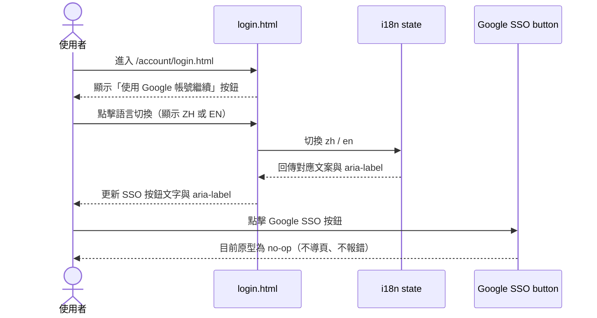
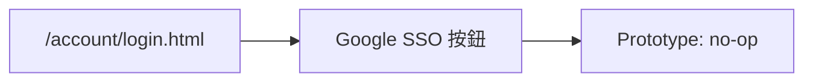

# 功能規格：Login — Google SSO 入口與整合預留

**功能分支**:`feat/account/002-login-google-sso`
**建立日期**:2026-04-05
**版本**:1.2.2
**狀態**:Clarified
**需求來源**:最新原型 [design/prototype/pages/account/login.html](../../../design/prototype/pages/account/login.html)

## 輸入與生成規則

**輸入描述**：登入頁需提供 Google SSO 入口，現階段與 Email / Password 登入並列呈現，並保留後續 OAuth 正式整合的入口契約。

**產生規格時必須遵守**：

1. 先確認此規格範圍僅涵蓋 Google SSO 按鈕入口、i18n、可存取屬性、原型 no-op 行為與後續整合預留；真實 OAuth redirect、callback、token exchange、account linking 與 session 建立不在本版範圍內。
2. 若新增或改動 Google SSO 的 OAuth 流程、callback route、provider profile mapping、錯誤狀態或帳號綁定行為，必須另行更新對應 auth / profile 規格，並同步檢查下游規格。
3. 若需求描述缺少 OAuth 模式、callback 行為、錯誤處理、語言行為或 provider 資料欄位，需以待釐清標記記錄具體問題，不得自行假設。
4. 規格應描述使用者可觀察行為與驗收條件，不描述 OAuth client 實作、token 儲存方式或後端框架。
5. 本規格若與最新 login prototype 不一致，必須明確記錄差異並更新 changelog。

**已釐清事項**：

- 本版 Google SSO 按鈕為原型入口：可點擊但不導頁、不呼叫 OAuth callback、不建立登入狀態。
- Google SSO 的按鈕位置、文字、圖示與 `aria-label` 需與 `001` 登入頁框架保持一致。
- 後續正式 OAuth 整合可替換 click 行為，但不得破壞既有入口語意、i18n 與可存取屬性。

## 規格常數

- `MOBILE_BP = 767px`
- `RWD_VIEWPORTS = 375px / 768px / 1440px`

## 流程圖

```mermaid
sequenceDiagram
    actor 使用者
    participant login as login.html
    participant i18n as i18n state
    participant ssoBtn as Google SSO button

    使用者->>login: 進入 /account/login.html
    login-->>使用者: 顯示「使用 Google 帳號繼續」按鈕

    使用者->>login: 點擊語言切換（顯示 ZH 或 EN）
    login->>i18n: 切換 zh / en
    i18n-->>login: 回傳對應文案與 aria-label
    login-->>使用者: 更新 SSO 按鈕文字與 aria-label

    使用者->>ssoBtn: 點擊 Google SSO 按鈕
    ssoBtn-->>使用者: 目前原型為 no-op（不導頁、不報錯）
```

| 步驟 | 角色 | 動作 | 系統回應 |
|------|------|------|---------|
| 1 | 使用者 | 開啟 `/account/login.html` | 顯示 Google SSO 按鈕（含 Google icon） |
| 2 | 使用者 | 切換語言 | SSO 按鈕文字與 `aria-label` 即時切換 |
| 3 | 使用者 | 點擊 Google SSO 按鈕 | 目前原型不觸發 OAuth 流程（no-op） |

---

## 使用者情境與測試 *(必填)*

### 使用者故事 1 — Google SSO 入口可見且可互動（優先級：P1）

登入頁必須提供清楚的 Google SSO 入口，讓使用者知道可用第三方登入。

**此優先級原因**：SSO 入口是本規格最小可交付範圍，缺少入口會中斷後續整合。

**獨立測試方式**：進入登入頁後檢查按鈕存在、文案正確、可點擊且無錯誤。

**驗收情境**：

1. **Given** 使用者在 `/account/login.html`，**When** 頁面載入，**Then** 顯示 Google SSO 按鈕與圖示。
2. **Given** 使用者在登入頁，**When** 點擊 Google SSO 按鈕，**Then** 按鈕可正常觸發 click 事件且頁面不報錯。
3. **Given** 使用者在登入頁，**When** 檢查無障礙屬性，**Then** Google SSO 按鈕具有對應語言的 `aria-label`。

---

### 使用者故事 2 — SSO 入口 i18n 同步（優先級：P1）

SSO 入口文字與可存取屬性需隨語言切換即時更新。

**此優先級原因**：SSO 與 Email 登入並列，必須遵循相同 i18n 標準。

**獨立測試方式**：切換 `zh` / `en`，檢查按鈕文字與 `aria-label` 是否同步更新。

**驗收情境**：

1. **Given** 預設語言為 `zh`，**When** 切換為 `en`，**Then** SSO 按鈕文字更新為 `Continue with Google`。
2. **Given** 語言為 `en`，**When** 切回 `zh`，**Then** SSO 按鈕文字更新為 `使用 Google 帳號繼續`。
3. **Given** 任一語言切換後，**When** 檢查按鈕，**Then** `aria-label` 與當前語言一致。
4. **Given** 使用者在 login 頁切換語言，**When** 導向其他 account 頁面再返回 login，**Then** SSO 按鈕語言必須維持一致。

---

### 使用者故事 3 — OAuth 正式整合預留（優先級：P2）

目前原型不執行 OAuth，規格需保留後續串接入口契約。

**此優先級原因**：避免前端原型與後端 OAuth 整合時出現斷層。

**獨立測試方式**：驗證現況為 no-op，同時保留整合前後行為說明。

**驗收情境**：

1. **Given** 目前為 prototype，**When** 點擊 SSO 按鈕，**Then** 不導頁、不呼叫 OAuth callback。
2. **Given** 後續整合階段，**When** 將 no-op 替換為真實流程，**Then** 保持按鈕位置、文案與可存取屬性不變。

---

### 邊界情況

- 使用者快速連點 SSO 按鈕？→ 原型仍維持 no-op，不應造成 JS 錯誤。
- 語言切換時按鈕正被點擊？→ 以最後一次語言狀態更新文案與 `aria-label`。
- 目前是否已有 `/auth/google/callback` 串接？→ 尚未，需在實作階段補齊。

---

## 需求規格 *(必填)*

### 功能需求

- **FR-001**：登入頁必須提供 Google SSO 按鈕，並與 Email/Password 表單同頁呈現。
- **FR-002**：Google SSO 按鈕必須包含可辨識的 Google 品牌圖示與文字標籤。
- **FR-003**：Google SSO 按鈕文字必須支援 `zh` / `en` 即時切換。
- **FR-004**：Google SSO 按鈕 `aria-label` 必須隨語言切換同步更新。
- **FR-004A**：SSO 所在頁的語言狀態必須跨頁持久化，返回 login 頁時不得回到預設語言。
- **FR-005**：原型模式下，Google SSO 按鈕 click 行為必須為 no-op，且不得造成前端錯誤。
- **FR-006**：本規格必須保留後續 OAuth 2.0 Authorization Code Flow 的整合入口，不變更既有按鈕 ID 與語意。

### 使用者流程與導頁

```mermaid
flowchart LR
    login["/account/login.html"]
    sso["Google SSO 按鈕"]
    noop["Prototype: no-op"]

    login --> sso
    sso --> noop
```

| From | Trigger | To |
|------|---------|-----|
| `/account/login.html` | 點擊 Google SSO 按鈕 | Prototype no-op（停留原頁） |

**Entry points**：`/account/login.html` 的 Google SSO 按鈕。
**Exit points**：目前原型無導頁（未串接 OAuth）。

### 關鍵實體

- **GoogleSsoEntryState**：SSO 入口狀態。關鍵欄位：`visible`、`label`、`ariaLabel`、`clickHandler`。
- **LanguageState**：語言狀態。關鍵欄位：`lang`（`zh` / `en`）、`storage_key = labelsuite.lang`。
- **OAuthIntegrationState**：整合狀態。關鍵欄位：`mode`（`prototype_noop` / `oauth_enabled`）。

---

## 規格相依性 *(本功能依賴其他規格，或被其他規格依賴時填寫)*

### 上游（本規格依賴的規格）

| 規格編號 | 功能 | 本規格需要的內容 |
|---------|------|----------------|
| 001 | Login — Email / Password + 頁面 UI | `/account/login.html` 頁面框架、i18n 狀態管理、語言切換控制 |
| 008 | Shared Sidebar Navbar | 全站語言持久化契約（跨頁維持同語系） |

### 下游（依賴本規格的規格）

| 規格編號 | 功能 | 依賴本規格的內容 |
|---------|------|----------------|
| 005 | Profile Settings | 後續 OAuth 整合後的 provider 顯示來源 |

---

## 成功標準 *(必填)*

- **SC-001**：登入頁固定顯示 Google SSO 入口，無遺漏或跑版。
- **SC-002**：`zh` / `en` 切換後，SSO 文案與 `aria-label` 在 1 秒內同步更新。
- **SC-002A**：切換語言後跨頁導覽再返回 login，SSO 入口語言需維持一致。
- **SC-003**：點擊 SSO 按鈕在 prototype 模式不導頁且不拋出錯誤。
- **SC-004**：SSO 入口在桌機與手機版皆可正常點擊與閱讀。

---

## 審查與驗收清單

### 內容品質

- [x] 規格聚焦 Google SSO 入口的使用者可觀察行為，未引入 OAuth token、callback 或 session 實作細節。
- [x] 所有必填章節已完成，且真實 OAuth 流程已明確排除於本版範圍。
- [x] 無未解決的待釐清標記殘留。
- [x] 需求、驗收情境與成功標準皆可測試。

### Label Suite 合規性

- [x] 功能分支格式符合 `feat/[module]/NNN-feature`。
- [x] 本規格不新增跨 feature import 或架構耦合需求。
- [x] 本規格不涉及 task type 邏輯，因此不影響 config-driven task architecture。
- [x] 本規格不回傳或顯示 test-set answer / ground-truth 資料。
- [x] Prototype source of truth 已列於需求來源，prototype no-op 行為已於已釐清事項中說明。
- [x] 上下游規格相依性已列出，需變更登入頁框架、語言契約或 provider 顯示來源時可追蹤影響範圍。

### 執行狀態

- [x] 輸入描述已解析。
- [x] 角色、互動、資料狀態與限制已萃取。
- [x] 模糊點已釐清或明確排除於本版範圍。
- [x] 使用者情境已定義。
- [x] 功能需求已定義。
- [x] 關鍵實體已定義。
- [x] Review checklist 已通過。

---

## Changelog

| 版本 | 日期 | 變更摘要 |
|------|------|---------|
| 1.2.2 | 2026-05-21 | 補充輸入與產生規則、已釐清事項、審查清單與執行狀態；同步功能分支格式 |
| 1.2.1 | 2026-04-16 | 新增跨頁語言持久化規範：返回 login 頁時 SSO 文案/aria 必須維持同語系 |
| 1.2.0 | 2026-04-15 | 語言切換按鈕描述改為單一語言代碼顯示（`ZH` / `EN`），移除 `ZH \| EN` 寫法 |
| 1.1.0 | 2026-04-15 | 參照 dashboard 規格寫法重整章節；對齊 login 原型現況（Google SSO 入口與 no-op 行為） |
| 1.0.0 | 2026-04-05 | Initial spec |
