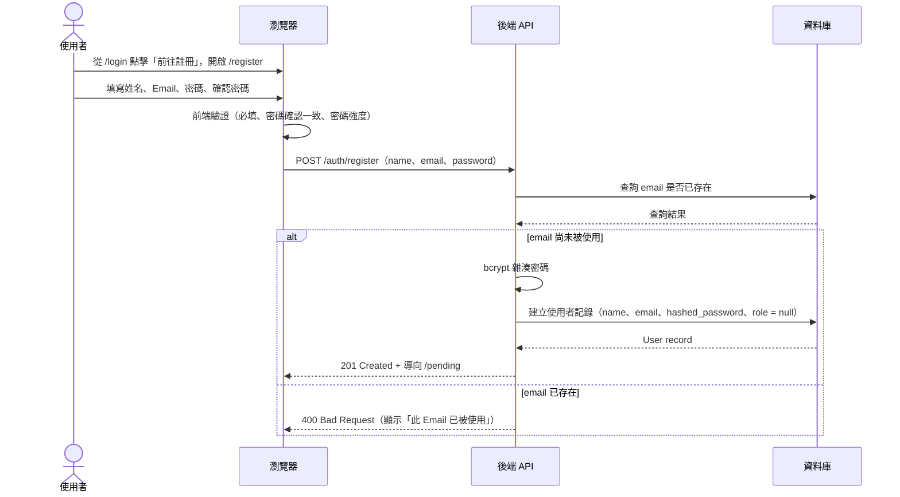
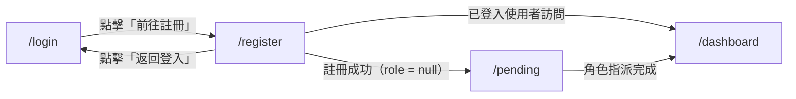

# 功能規格：自行註冊（Email / Password）

**功能分支**：`003-register-email-password`
**建立日期**：2026-04-05
**狀態**：Clarified
**需求來源**：IA v7 Spec 清單 #003 — 自行註冊（Email/Password）

## Process Flow

| 步驟 | 角色 | 動作 | 系統回應 |
|------|------|------|---------|
| 1 | 使用者 | 從 `/login` 點擊「前往註冊」 | 開啟 `/register` 頁面 |
| 2 | 使用者 | 填寫表單並送出 | 前端先驗證欄位 |
| 3 | 後端 | 驗證 email 唯一性 | 查詢資料庫 |
| 4a | 後端 | email 未被使用 | bcrypt 雜湊密碼，建立帳號，導向 `/pending` |
| 4b | 後端 | email 已存在 | 回傳錯誤，停留 `/register` |
| E1 | 使用者 | 點擊「取消 / 返回登入」 | 導回 `/login` |

---

## 使用者情境與測試 *(必填)*

### User Story 1 — 填寫表單建立帳號（優先級：P1）

使用者從登入頁進入 `/register`，填寫姓名、Email、密碼，送出後系統建立帳號（`role = null`）並導向 `/pending` 等待 Super Admin 指派角色。

**此優先級原因**：自行註冊是使用者加入系統的入口之一，沒有這個功能，只能依賴 Super Admin 預先建帳號。

**獨立測試方式**：以新的 Email 填寫表單送出，驗證資料庫建立 `role = null` 的使用者記錄，且頁面導向 `/pending`。

**驗收情境**：

1. **Given** 未登入使用者在 `/register`，**When** 填寫有效的姓名、Email、密碼（≥ 8 字元）並送出，**Then** 建立 `role = null` 的使用者記錄並導向 `/pending`。
2. **Given** 已在 `/pending` 的新使用者，**When** 以剛建立的帳號登入（spec 001），**Then** 成功登入並停留在 `/pending`（因 `role = null`）。
3. **Given** 使用者在 `/register`，**When** 點擊「取消」或「返回登入」，**Then** 導回 `/login`，不建立任何記錄。
4. **Given** 已登入使用者，**When** 直接訪問 `/register`，**Then** 自動導向 `/dashboard`。

---

### User Story 2 — 表單驗證（優先級：P2）

系統在前端與後端雙重驗證表單內容，確保資料完整性與安全性，並提供清楚的錯誤提示。

**此優先級原因**：有效的表單驗證可防止無效資料進入資料庫，提升使用者體驗。

**獨立測試方式**：分別提交空欄位、不一致密碼、密碼過短、已存在 Email，驗證各情境均顯示對應錯誤訊息且不建立帳號。

**驗收情境**：

1. **Given** 使用者在 `/register`，**When** 未填寫任一必填欄位即送出，**Then** 前端顯示對應欄位的必填錯誤提示，不送出請求。
2. **Given** 使用者在 `/register`，**When** 密碼與確認密碼不一致，**Then** 前端顯示「密碼不一致」錯誤，不送出請求。
3. **Given** 使用者在 `/register`，**When** 密碼少於 8 個字元，**Then** 前端顯示「密碼至少需 8 個字元」錯誤，不送出請求。
4. **Given** 使用者在 `/register`，**When** 填寫系統中已存在的 Email 並送出，**Then** 後端回傳錯誤，頁面顯示「此 Email 已被使用」，不建立新帳號。

---

### 邊界情況

- 使用者以已存在的 Email 嘗試自行註冊時？→ 顯示「此 Email 已被使用」；若該 Email 對應 Google SSO 帳號，同樣顯示相同訊息（不揭露登入方式）。
- 使用者在 `/register` 完成後，再次以同一 Email 的 Google 帳號登入時？→ 靜默合併（詳見 spec 002）。
- 未登入使用者直接訪問 `/register` 時？→ 正常顯示註冊頁面（無需從 `/login` 進入）。

---

## 需求規格 *(必填)*

### 功能需求

- **FR-001**：系統必須提供含姓名、Email、密碼、確認密碼欄位，以及「送出」按鈕與「返回登入」連結的 `/register` 頁面。
- **FR-002**：前端必須在送出前驗證：所有欄位必填、密碼與確認密碼一致、密碼長度 ≥ 8 字元。
- **FR-003**：後端必須驗證 Email 唯一性；若 Email 已存在，回傳 400 並顯示「此 Email 已被使用」。
- **FR-004**：密碼必須以 bcrypt 雜湊後儲存，絕不以明文存入資料庫。
- **FR-005**：新建帳號預設 `role = null`；Super Admin 在 `user-management` 指派系統角色後才有功能存取權。
- **FR-006**：註冊成功後導向 `/pending`，顯示「您的帳號尚未被指派角色，請聯絡管理員」。
- **FR-007**：點擊「返回登入」導回 `/login`，不建立任何使用者記錄。
- **FR-008**：已登入使用者訪問 `/register` 時，自動導向 `/dashboard`。
- **FR-009**：`/register` 頁面必須具備響應式設計，支援 375px、768px、1440px 視窗寬度。
- **FR-010**：`/register` 頁面必須支援 zh-TW / en 語言切換，與應用程式其他頁面一致。

### User Flow & Navigation

| From | Trigger | To |
|------|---------|-----|
| `/login` | 點擊「前往註冊」 | `/register` |
| `/register` | 送出成功（`role = null`）| `/pending` |
| `/register` | 點擊「返回登入」 | `/login` |
| `/register` | 已登入使用者訪問 | `/dashboard`（自動導向）|

**Entry points**：`/login` → 「前往註冊」連結；未登入時可直接訪問 `/register`。
**Exit points**：成功 → `/pending`；取消 → `/login`。

### 關鍵實體

- **User（使用者）**：關鍵屬性：`id`、`email`、`name`、`hashed_password`、`provider = email`、`provider_id = null`、`avatar_url = null`、`role = null`、`created_at`。

---

## 成功標準 *(必填)*

- **SC-001**：使用者可在 60 秒內完成完整註冊流程（填表 → 送出 → `/pending`）。
- **SC-002**：密碼絕不以明文儲存；資料庫中只存 bcrypt hash。
- **SC-003**：以重複 Email 註冊時，頁面顯示明確錯誤訊息，且不建立新帳號。
- **SC-004**：成功註冊建立唯一一筆 `role = null` 的使用者記錄。
- **SC-005**：`/register` 頁面在視窗寬度 375px、768px、1440px 下均正確渲染。
- **SC-006**：`/register` 頁面正確顯示 zh-TW 與 en 兩種語言；語言切換立即生效，不需重新載入頁面。
