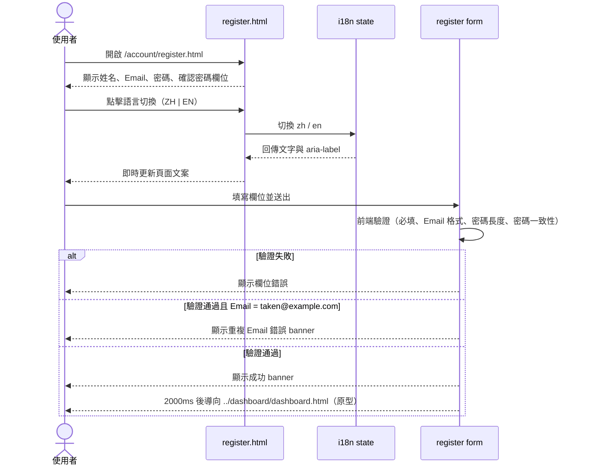
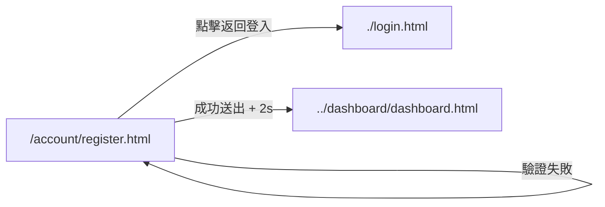

# 功能規格：Register — Email / Password

**功能分支**：`003-register-email-password`
**建立日期**：2026-04-05
**版本**：1.1.0
**狀態**：Clarified
**需求來源**：最新原型 [`design/prototype/pages/account/register.html`](../../../design/prototype/pages/account/register.html)

## 規格常數

- `MOBILE_BP = 767px`
- `RWD_VIEWPORTS = 375px / 768px / 1440px`
- `PASSWORD_MIN_LENGTH = 8`

## Process Flow

| 步驟 | 角色 | 動作 | 系統回應 |
|------|------|------|---------|
| 1 | 使用者 | 開啟 `/account/register.html` | 顯示註冊表單與「返回登入」連結 |
| 2 | 使用者 | 切換語言 | 表單文案、按鈕文案、`aria-label` 即時切換 |
| 3 | 使用者 | 點擊密碼眼睛按鈕 | 切換密碼/確認密碼顯示狀態 |
| 4 | 使用者 | 送出表單 | 先執行前端驗證 |
| 5 | 系統 | Email 為 `taken@example.com` | 顯示重複 Email 錯誤 banner |
| 6 | 系統 | 驗證通過且 Email 非重複 | 顯示成功訊息並於 2 秒後導向 `../dashboard/dashboard.html` |

---

## 使用者情境與測試 *(必填)*

### User Story 1 — 註冊頁完整呈現（優先級：P1）

註冊頁必須提供完整欄位與清楚導流，支援使用者完成建帳。

**此優先級原因**：註冊頁是首次使用者入口，元件缺漏會直接阻斷流程。

**獨立測試方式**：開啟頁面後逐項確認表單欄位、按鈕、連結皆存在。

**驗收情境**：

1. **Given** 使用者進入註冊頁，**When** 頁面載入，**Then** 顯示姓名、Email、密碼、確認密碼欄位。
2. **Given** 使用者在註冊頁，**When** 檢視底部導流，**Then** 顯示「返回登入」連結並導向 `./login.html`。
3. **Given** 使用者在註冊頁，**When** 檢視互動元件，**Then** 顯示可切換的密碼顯示按鈕與送出按鈕。

---

### User Story 2 — 前端驗證與錯誤提示（優先級：P1）

送出前必須完成欄位驗證，錯誤需顯示於對應欄位。

**此優先級原因**：前端驗證是避免無效資料送出的第一道品質關卡。

**獨立測試方式**：依序測試空值、Email 格式錯誤、密碼過短、密碼不一致。

**驗收情境**：

1. **Given** 任一欄位為空，**When** 送出表單，**Then** 顯示對應欄位必填錯誤。
2. **Given** Email 格式不合法，**When** 送出表單，**Then** 顯示 Email 格式錯誤。
3. **Given** 密碼長度小於 `PASSWORD_MIN_LENGTH`，**When** 送出表單，**Then** 顯示密碼長度錯誤。
4. **Given** 密碼與確認密碼不一致，**When** 送出表單，**Then** 顯示「密碼不一致」錯誤。
5. **Given** 欄位曾報錯，**When** 使用者重新輸入，**Then** 該欄位錯誤需即時清除。

---

### User Story 3 — 註冊送出結果（優先級：P1）

原型需呈現兩種送出結果：重複 Email 失敗與成功導頁。

**此優先級原因**：成功與失敗回饋是註冊流程可用性的核心。

**獨立測試方式**：以 `taken@example.com` 測試失敗，再用其他合法 Email 測試成功。

**驗收情境**：

1. **Given** Email 為 `taken@example.com`，**When** 驗證通過後送出，**Then** 顯示重複 Email 錯誤 banner 並停留在原頁。
2. **Given** Email 非 `taken@example.com` 且欄位合法，**When** 送出，**Then** 顯示成功 banner。
3. **Given** 註冊成功，**When** 顯示成功訊息後，**Then** 於約 `2000ms` 導向 `../dashboard/dashboard.html`（原型行為）。

---

### User Story 4 — i18n 與可存取屬性同步（優先級：P2）

註冊頁所有核心文案與 `aria-label` 需支援即時語言切換。

**此優先級原因**：帳號頁面必須維持一致的雙語體驗與可存取標準。

**獨立測試方式**：切換 `zh` / `en`，檢查欄位標籤、按鈕文字、連結與可存取屬性。

**驗收情境**：

1. **Given** 預設 `zh`，**When** 切換為 `en`，**Then** 頁面標題、欄位標籤、按鈕文字、連結文字同步更新。
2. **Given** 語言切換後，**When** 檢查密碼顯示按鈕，**Then** `aria-label` 與當前語言一致。
3. **Given** 語言切換事件發生，**When** 頁面有既有錯誤狀態，**Then** 欄位錯誤與 banner 會清除。

---

### User Story 5 — 響應式版面（優先級：P2）

註冊頁於手機、平板、桌機均須可讀且可操作。

**此優先級原因**：註冊流程常在不同裝置啟動，RWD 問題會直接影響轉換率。

**獨立測試方式**：以 `RWD_VIEWPORTS` 驗證導覽列與卡片排版。

**驗收情境**：

1. **Given** `<= MOBILE_BP`，**When** 開啟註冊頁，**Then** 導覽列高度為 56px、左右內距為 16px。
2. **Given** `<= MOBILE_BP`，**When** 檢視卡片，**Then** 卡片內距與內容密度符合手機版設定，無擠壓。
3. **Given** 任一 `RWD_VIEWPORTS`，**When** 操作完整流程，**Then** 無水平捲軸、無元件重疊、無按鈕被遮擋。

---

### 邊界情況

- Email 前後有空白字元？→ 送出前會 `trim()` 後再驗證。
- 成功送出後是否可再編輯欄位？→ 成功後輸入欄位會被 disabled，等待導頁。
- 目前原型是否已串接真實 `/auth/register` API？→ 尚未；僅模擬前端驗證與結果。

---

## 需求規格 *(必填)*

### 功能需求

- **FR-001**：系統必須提供 `/account/register.html` 註冊頁，包含姓名、Email、密碼、確認密碼欄位。
- **FR-002**：頁面必須提供「返回登入」連結並導向 `./login.html`。
- **FR-003**：頁面必須支援 `zh` / `en` 語言切換且不需重整頁面。
- **FR-004**：語言切換時必須同步更新文字節點與可存取屬性（含 `document.title`、`aria-label`）。
- **FR-005**：送出前必須驗證姓名、Email、密碼、確認密碼皆為必填。
- **FR-006**：Email 必須驗證格式合法（含基本 `@` 與網域格式）。
- **FR-007**：密碼長度必須至少 `PASSWORD_MIN_LENGTH`。
- **FR-008**：確認密碼必須與密碼完全一致。
- **FR-009**：密碼與確認密碼欄位必須提供顯示/隱藏切換，且 `aria-label` 需同步。
- **FR-010**：驗證失敗時必須顯示對應欄位錯誤，不送出成功流程。
- **FR-011**：原型模式下，Email 為 `taken@example.com` 時必須顯示重複 Email 錯誤 banner。
- **FR-012**：原型模式下，註冊成功時必須顯示成功 banner 並於約 `2000ms` 導向 `../dashboard/dashboard.html`。
- **FR-013**：頁面必須具備響應式設計，至少支援 `RWD_VIEWPORTS`。
- **FR-013A**：在 `<= MOBILE_BP` 時導覽列需切換為 56px 高與 16px 左右內距。

### User Flow & Navigation

| From | Trigger | To |
|------|---------|-----|
| `/account/register.html` | 點擊「返回登入」 | `./login.html` |
| `/account/register.html` | 驗證失敗或重複 Email | 停留原頁 |
| `/account/register.html` | 註冊成功（原型） | `../dashboard/dashboard.html` |

**Entry points**：`/account/register.html`。
**Exit points**：`./login.html`、`../dashboard/dashboard.html`。

### 關鍵實體

- **RegisterFormState**：註冊表單狀態。關鍵欄位：`name`、`email`、`password`、`confirmPassword`、`errors`、`isSubmitting`。
- **RegisterBannerState**：提示訊息狀態。關鍵欄位：`errorVisible`、`successVisible`、`message`。
- **LanguageState**：語言狀態。關鍵欄位：`lang`（`zh` / `en`）。
- **PrototypeRegisterResult**：原型結果。關鍵欄位：`emailTaken`（`email === taken@example.com`）、`redirectDelayMs = 2000`。

---

## 規格相依性 *(本功能依賴其他規格，或被其他規格依賴時填寫)*

### 上游（本規格依賴的規格）

| 規格編號 | 功能 | 本規格需要的內容 |
|---------|------|----------------|
| 001 | Login — Email / Password + 頁面 UI | 從登入頁導流至註冊頁的入口連結與 i18n 一致性 |

### 下游（依賴本規格的規格）

| 規格編號 | 功能 | 依賴本規格的內容 |
|---------|------|----------------|
| 002 | Login — Google SSO | Email 重複與帳號合併情境說明（規格層） |
| 012 | Dashboard | 註冊成功後的導頁目標（原型） |

---

## 成功標準 *(必填)*

- **SC-001**：註冊頁在首屏完整顯示核心欄位與導流連結。
- **SC-002**：所有欄位驗證規則正確觸發，錯誤提示顯示於對應欄位。
- **SC-003**：`taken@example.com` 可穩定觸發重複 Email 錯誤 banner。
- **SC-004**：成功送出後顯示成功訊息，並於約 2 秒導向 `../dashboard/dashboard.html`。
- **SC-005**：`zh` / `en` 切換可在 1 秒內同步更新文案與 `aria-label`。
- **SC-006**：在 `RWD_VIEWPORTS` 下無破版、無遮擋、無水平捲軸。

---

## Changelog

| 版本 | 日期 | 變更摘要 |
|------|------|---------|
| 1.1.0 | 2026-04-15 | 參照 dashboard 規格寫法重整章節；對齊 register 原型（前端驗證、重複 Email 模擬、成功後 2 秒導頁） |
| 1.0.0 | 2026-04-05 | Initial spec |
