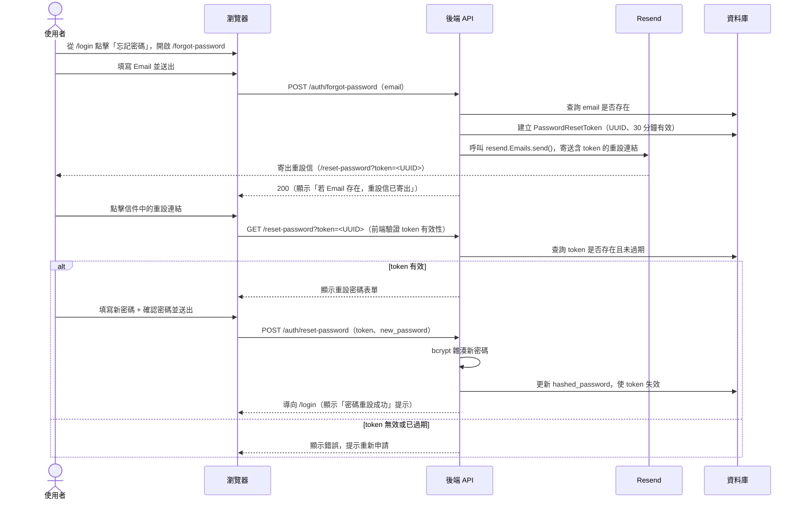
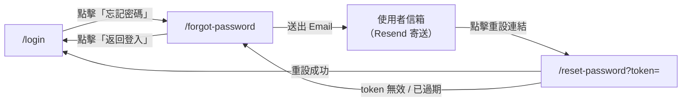

# 功能規格：忘記密碼 / 重設密碼（Resend）

**功能分支**：`004-forgot-reset-password`
**建立日期**：2026-04-05
**狀態**：Clarified
**需求來源**：IA v7 Spec 清單 #004 — 忘記密碼 / 重設密碼（Resend）；ADR-013

## Process Flow

| 步驟 | 角色 | 動作 | 系統回應 |
|------|------|------|---------|
| 1 | 使用者 | 在 `/forgot-password` 填寫 Email 送出 | 生成 token，透過 Resend 寄送重設信 |
| 2 | 系統 | 無論 Email 是否存在 | 回傳相同提示（不揭露 Email 是否存在） |
| 3 | 使用者 | 點擊信件中的連結 | 後端驗證 token 有效性 |
| 4a | 後端 | token 有效 | 顯示重設密碼表單 |
| 4b | 後端 | token 無效或已過期 | 顯示錯誤並提示重新申請 |
| 5 | 使用者 | 填寫新密碼送出 | 更新密碼雜湊，token 失效，導向 `/login` |

---

## 使用者情境與測試 *(必填)*

### User Story 1 — 申請密碼重設（優先級：P1）

使用者在 `/forgot-password` 頁面填寫 Email，系統透過 Resend 寄送含有效期 token 的重設連結，頁面顯示通用提示（不揭露 Email 是否存在）。

**此優先級原因**：讓使用者可自助重設密碼，避免每次忘記密碼都需要聯絡 Super Admin。

**獨立測試方式**：填寫已存在的 Email 送出，驗證收到重設信且資料庫建立 30 分鐘有效的 token；再填寫不存在的 Email，驗證顯示相同提示且不寄信。

**驗收情境**：

1. **Given** 使用者在 `/forgot-password`，**When** 填寫系統中已存在的 Email 並送出，**Then** 資料庫建立 30 分鐘有效的 `PasswordResetToken`，Resend 寄出重設信，頁面顯示「若此 Email 已註冊，重設連結已寄出，請查收信箱」。
2. **Given** 使用者在 `/forgot-password`，**When** 填寫系統中不存在的 Email 並送出，**Then** 不建立 token，不寄信，頁面顯示與情境 1 相同的提示（不揭露 Email 是否存在）。
3. **Given** 使用者在 `/forgot-password`，**When** 填寫空白 Email 並送出，**Then** 前端顯示必填錯誤，不送出請求。

---

### User Story 2 — 完成密碼重設（優先級：P2）

使用者點擊信件中的重設連結，進入 `/reset-password` 頁面，填寫新密碼後系統更新密碼雜湊並使 token 失效，導向 `/login`。（與 P1 Story 1 共同構成完整忘記密碼流程）

**此優先級原因**：密碼重設表單依賴 Story 1 寄出的 token，需在 Story 1 穩定後接續實作；兩者合併構成完整流程。

**獨立測試方式**：以有效 token 開啟 `/reset-password`，填寫新密碼送出，驗證密碼已更新且能以新密碼登入；再以舊 token 重試，確認回傳錯誤。

**驗收情境**：

1. **Given** 使用者透過有效的重設連結開啟 `/reset-password`，**When** 填寫符合強度的新密碼並送出，**Then** 密碼更新（bcrypt 雜湊）、token 失效，導向 `/login` 並顯示「密碼重設成功，請重新登入」。
2. **Given** 使用者以有效 token 重設密碼成功後，**When** 再次使用同一連結，**Then** 顯示「此連結已使用，請重新申請」，導向 `/forgot-password`。
3. **Given** 使用者透過已過期（> 30 分鐘）的重設連結開啟 `/reset-password`，**Then** 顯示「此連結已過期，請重新申請」，提供「重新申請」按鈕導向 `/forgot-password`。
4. **Given** 使用者在 `/reset-password`，**When** 新密碼與確認密碼不一致，**Then** 前端顯示「密碼不一致」，不送出請求。

---

### 邊界情況

- Resend API 暫時無法使用時？→ 後端記錄錯誤，頁面顯示「寄信暫時失敗，請稍後再試」，token 已建立可保留等待重試。
- 使用者在 token 尚未過期前再次申請重設時？→ 舊 token 失效，建立新 token 重新寄信。
- Google SSO 使用者（無 `hashed_password`）申請密碼重設時？→ 寄出重設信（成功）。Google SSO 使用者完成密碼重設後，系統直接新增 `hashed_password` 至既有帳號，不走 OAuth 流程；該帳號此後同時支援 Google SSO 與 Email/Password 登入（靜默合併，同 spec 002）。
- 已登入使用者訪問 `/forgot-password` 時？→ 自動導向 `/dashboard`，與 `/login`、`/register` 行為一致。
- 使用者直接訪問 `/reset-password` 不帶 token 參數時？→ 視同 token 無效，顯示錯誤訊息並提示重新申請，導向 `/forgot-password`。

---

## 需求規格 *(必填)*

### 功能需求

- **FR-001**：系統必須提供含 Email 輸入欄與「送出」按鈕的 `/forgot-password` 頁面，以及「返回登入」連結。
- **FR-002**：`POST /auth/forgot-password` 必須生成 UUID PasswordResetToken，有效期 30 分鐘，儲存於資料庫。
- **FR-003**：系統必須透過 Resend SDK（`RESEND_API_KEY` 環境變數）寄送含重設連結（`/reset-password?token=<UUID>`）的 Email。
- **FR-004**：無論 Email 是否存在，`/forgot-password` 回應必須顯示相同提示，不揭露 Email 是否已註冊。
- **FR-005**：`/reset-password` 必須在頁面載入時驗證 token 有效性（存在且未過期）；無效 token 立即顯示錯誤。
- **FR-006**：`POST /auth/reset-password` 必須驗證 token、以 bcrypt 雜湊新密碼後更新，並使該 token 立即失效（單次使用）。
- **FR-007**：密碼重設成功後導向 `/login` 並顯示成功提示。
- **FR-008**：使用者再次申請重設時，舊 token 必須失效，建立新 token。
- **FR-009**：`/forgot-password` 與 `/reset-password` 頁面均須支援響應式設計與 zh-TW / en 語言切換。

### User Flow & Navigation

| From | Trigger | To |
|------|---------|-----|
| `/login` | 點擊「忘記密碼」 | `/forgot-password` |
| `/forgot-password` | 送出 Email | 停留（顯示通用提示） |
| 信件連結 | 點擊 | `/reset-password?token=<UUID>` |
| `/reset-password` | 重設成功 | `/login` |
| `/reset-password` | token 無效 / 已過期 | `/forgot-password` |
| `/forgot-password` | 點擊「返回登入」 | `/login` |

**Entry points**：`/login` → 「忘記密碼」連結；未登入時可直接訪問 `/forgot-password`。
**Exit points**：重設成功 → `/login`；token 失效 → `/forgot-password`。

### 關鍵實體

- **PasswordResetToken**：關鍵屬性：`id`（UUID）、`user_id`、`expires_at`（建立時間 + 30 分鐘）、`used_at`（使用後記錄，`null` 表示未使用）、`created_at`。token 使用後或過期後均視為無效。

---

## 成功標準 *(必填)*

- **SC-001**：使用者從申請重設到完成密碼更新，整個流程可在 5 分鐘內完成。
- **SC-002**：`/forgot-password` 回應不揭露 Email 是否已存在於系統中。
- **SC-003**：重設 token 為單次使用；使用後再次使用同一連結回傳明確錯誤。
- **SC-004**：超過 30 分鐘的 token 驗證回傳失效錯誤，並提示重新申請。
- **SC-005**：密碼重設成功後，使用者可以新密碼登入，舊密碼無效。
- **SC-006**：`RESEND_API_KEY` 不暴露於 API 回應或前端 bundle 中。
