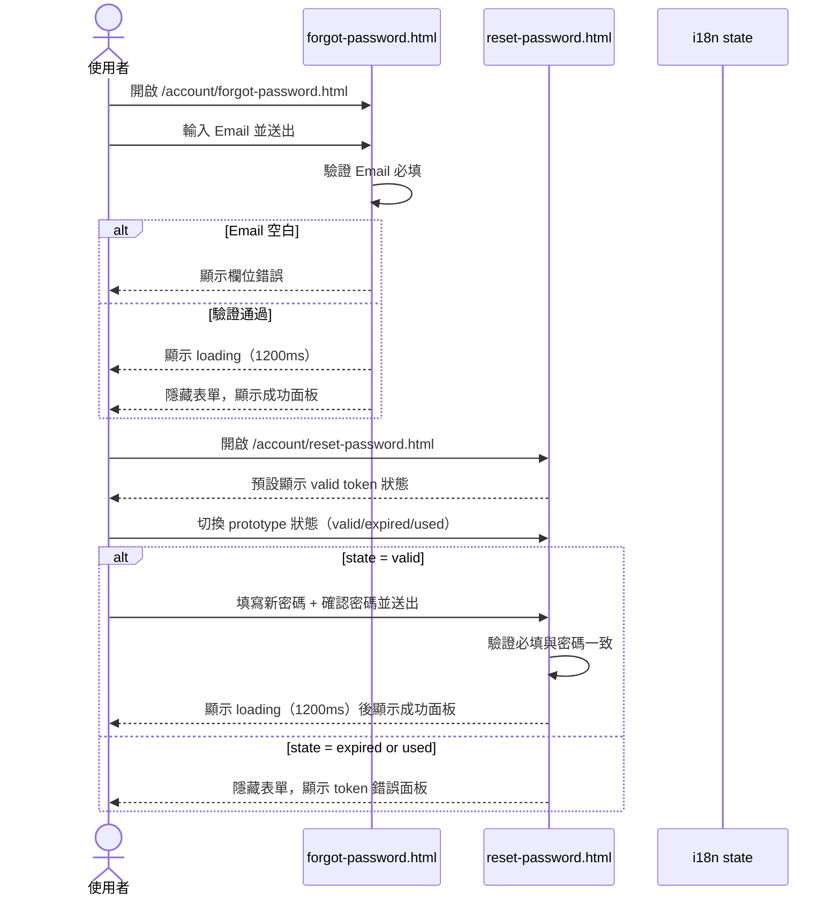
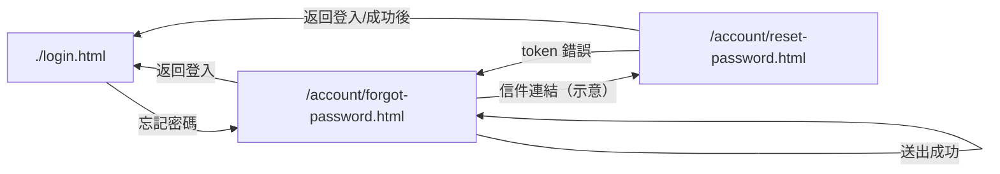

# 功能規格：Forgot / Reset Password（Prototype）

**功能分支**：`004-forgot-reset-password`
**建立日期**：2026-04-05
**版本**：1.1.0
**狀態**：Clarified
**需求來源**：最新原型 [`design/prototype/pages/account/forgot-password.html`](../../../design/prototype/pages/account/forgot-password.html) / [`design/prototype/pages/account/reset-password.html`](../../../design/prototype/pages/account/reset-password.html)

## 規格常數

- `MOBILE_BP = 767px`
- `RWD_VIEWPORTS = 375px / 768px / 1440px`
- `RESET_TOKEN_STATES = valid / expired / used`

## Process Flow

| 步驟 | 角色 | 動作 | 系統回應 |
|------|------|------|---------|
| 1 | 使用者 | 開啟 `/account/forgot-password.html` | 顯示 Email 欄位與送出按鈕 |
| 2 | 使用者 | 送出 forgot 表單 | Email 為空顯示錯誤；非空則 1200ms 後顯示成功面板 |
| 3 | 使用者 | 開啟 `/account/reset-password.html` | 預設 `valid token` 狀態 |
| 4 | 使用者 | 切換 `expired` 或 `used` | 顯示 token 錯誤面板（隱藏表單） |
| 5 | 使用者 | 在 `valid` 狀態送出 reset 表單 | 驗證通過後 1200ms 顯示成功面板 |

---

## 使用者情境與測試 *(必填)*

### User Story 1 — Forgot Password 表單（優先級：P1）

使用者可在 forgot 頁面輸入 Email 申請重設，並得到通用成功提示。

**此優先級原因**：forgot 頁是重設流程入口，沒有入口就無法進入後續步驟。

**獨立測試方式**：測試空 Email 與非空 Email 兩種提交結果。

**驗收情境**：

1. **Given** 使用者在 forgot 頁，**When** Email 為空送出，**Then** 顯示 `Email is required` / `請輸入電子郵件` 錯誤。
2. **Given** 使用者在 forgot 頁，**When** Email 非空送出，**Then** 送出按鈕進入 loading 狀態。
3. **Given** forgot 送出完成，**When** 約 `1200ms` 後，**Then** 隱藏表單並顯示成功面板與返回登入連結。

---

### User Story 2 — Reset Password（valid token）（優先級：P1）

在 valid token 狀態下，使用者可完成新密碼重設並看到成功結果。

**此優先級原因**：valid token 是 reset 流程核心主路徑。

**獨立測試方式**：在 valid 狀態測試空值、密碼不一致、成功送出。

**驗收情境**：

1. **Given** reset 頁為 `valid` 狀態，**When** 新密碼為空，**Then** 顯示新密碼必填錯誤。
2. **Given** reset 頁為 `valid` 狀態，**When** 確認密碼為空或與新密碼不一致，**Then** 顯示對應欄位錯誤。
3. **Given** reset 頁為 `valid` 狀態且表單合法，**When** 送出，**Then** 顯示 loading 並於約 `1200ms` 後顯示成功面板。

---

### User Story 3 — Reset Password（expired / used token）（優先級：P1）

reset 頁需能展示 token 失效與已使用兩種錯誤狀態。

**此優先級原因**：錯誤 token 狀態是重設流程常見分支，需可清楚驗證。

**獨立測試方式**：透過 prototype 狀態切換按鈕分別切至 `expired` 與 `used`。

**驗收情境**：

1. **Given** reset 頁狀態切為 `expired`，**When** 畫面更新，**Then** 隱藏表單並顯示「連結已過期」錯誤面板。
2. **Given** reset 頁狀態切為 `used`，**When** 畫面更新，**Then** 隱藏表單並顯示「連結已使用」錯誤面板。
3. **Given** token 錯誤面板顯示中，**When** 點擊「重新申請」，**Then** 導向 `./forgot-password.html`。

---

### User Story 4 — i18n 與可存取屬性（優先級：P2）

forgot/reset 兩頁的文案與可存取屬性需支援即時語言切換。

**此優先級原因**：帳號流程頁面需維持一致雙語體驗與可存取性。

**獨立測試方式**：在不同狀態切換語言，檢查標題、欄位、按鈕、錯誤/成功文案與 `aria-label`。

**驗收情境**：

1. **Given** forgot 或 reset 頁，**When** 切換語言，**Then** 頁面標題、欄位標籤、按鈕文案即時更新。
2. **Given** reset 頁為 token 錯誤狀態，**When** 切換語言，**Then** token 錯誤訊息與 CTA 文案同步更新。
3. **Given** reset 頁有密碼顯示按鈕，**When** 切換語言或切換顯示狀態，**Then** `aria-label` 必須一致。

---

### User Story 5 — 響應式版面（優先級：P2）

forgot/reset 頁在手機與桌機均需可讀可操作。

**此優先級原因**：密碼找回常在行動裝置發生，RWD 問題會直接阻斷流程。

**獨立測試方式**：以 `RWD_VIEWPORTS` 驗證導覽列、卡片、成功/錯誤面板與操作按鈕。

**驗收情境**：

1. **Given** `<= MOBILE_BP`，**When** 開啟 forgot/reset 頁，**Then** 導覽列為 56px 且內距為 16px。
2. **Given** `<= MOBILE_BP`，**When** 顯示成功或 token 錯誤面板，**Then** 無文字截斷與按鈕遮擋。
3. **Given** 任一 `RWD_VIEWPORTS`，**When** 完成流程操作，**Then** 無水平捲軸與排版破版。

---

### 邊界情況

- forgot/reset 是否已串真實 API 與 token 驗證？→ 尚未；目前為前端互動原型。
- reset 頁不透過 URL token 直接判斷狀態？→ 目前使用頁面內 prototype 切換按鈕控制狀態。
- forgot 成功提示是否揭露 Email 是否存在？→ 不揭露；固定顯示通用成功文案。

---

## 需求規格 *(必填)*

### 功能需求

- **FR-001**：系統必須提供 `/account/forgot-password.html`，包含 Email 欄位、送出按鈕、返回登入連結。
- **FR-002**：forgot 表單送出前必須驗證 Email 必填；空值顯示欄位錯誤。
- **FR-003**：forgot 表單驗證通過後必須進入 loading，並於約 `1200ms` 顯示成功面板。
- **FR-004**：forgot 成功面板文案必須為不揭露帳號存在性的通用提示。
- **FR-005**：系統必須提供 `/account/reset-password.html`，包含新密碼、確認密碼欄位與送出按鈕。
- **FR-006**：reset 頁必須支援 `RESET_TOKEN_STATES` 三種 prototype 狀態切換。
- **FR-007**：reset 在 `valid` 狀態下，送出前必須驗證新密碼與確認密碼必填且一致。
- **FR-008**：reset 在 `valid` 狀態送出成功後，必須於約 `1200ms` 顯示成功面板。
- **FR-009**：reset 在 `expired` / `used` 狀態時，必須隱藏表單並顯示 token 錯誤面板。
- **FR-010**：token 錯誤面板中的「重新申請」連結必須導向 `./forgot-password.html`。
- **FR-011**：forgot/reset 頁面必須支援 `zh` / `en` 即時切換，並同步更新 `document.title` 與 `aria-label`。
- **FR-012**：reset 的密碼顯示切換按鈕必須同步調整欄位 type 與 `aria-label`。
- **FR-013**：forgot/reset 頁面必須具備響應式設計，至少支援 `RWD_VIEWPORTS`。
- **FR-013A**：在 `<= MOBILE_BP` 時導覽列需改為 56px 並使用 16px 左右內距。

### User Flow & Navigation

| From | Trigger | To |
|------|---------|-----|
| `./login.html` | 點擊忘記密碼 | `/account/forgot-password.html` |
| `/account/forgot-password.html` | 成功送出 | 停留原頁（顯示成功面板） |
| `/account/forgot-password.html` | 點擊返回登入 | `./login.html` |
| `/account/reset-password.html` | token 錯誤面板點擊重新申請 | `./forgot-password.html` |
| `/account/reset-password.html` | 點擊返回登入 / 成功面板連結 | `./login.html` |

**Entry points**：`/account/forgot-password.html`、`/account/reset-password.html`。
**Exit points**：`./login.html`、`./forgot-password.html`。

### 關鍵實體

- **ForgotFormState**：forgot 表單狀態。關鍵欄位：`email`、`emailError`、`isSubmitting`、`successVisible`。
- **ResetFormState**：reset 表單狀態。關鍵欄位：`newPassword`、`confirmPassword`、`errors`、`isSubmitting`。
- **ResetPrototypeTokenState**：reset token 狀態。允許值：`valid`、`expired`、`used`。
- **LanguageState**：語言狀態。關鍵欄位：`lang`（`zh` / `en`）。

---

## 規格相依性 *(本功能依賴其他規格，或被其他規格依賴時填寫)*

### 上游（本規格依賴的規格）

| 規格編號 | 功能 | 本規格需要的內容 |
|---------|------|----------------|
| 001 | Login — Email / Password + 頁面 UI | 忘記密碼入口連結與語言切換一致性 |

### 下游（依賴本規格的規格）

| 規格編號 | 功能 | 依賴本規格的內容 |
|---------|------|----------------|
| 003 | Register — Email / Password | 密碼文案與驗證規則一致性 |

---

## 成功標準 *(必填)*

- **SC-001**：forgot 表單空值驗證正確觸發，非空送出後可顯示成功面板。
- **SC-002**：forgot 成功文案保持不揭露帳號存在性的通用訊息。
- **SC-003**：reset 在 `valid` 狀態可完成送出並顯示成功面板。
- **SC-004**：reset 在 `expired` / `used` 狀態可正確顯示對應 token 錯誤文案。
- **SC-005**：`zh` / `en` 切換可在 1 秒內更新主要文案與 `aria-label`。
- **SC-006**：在 `RWD_VIEWPORTS` 下無破版、無遮擋、無水平捲軸。

---

## Changelog

| 版本 | 日期 | 變更摘要 |
|------|------|---------|
| 1.1.0 | 2026-04-15 | 參照 dashboard 規格寫法重整章節；對齊 forgot/reset 原型（loading、success panel、token state 切換） |
| 1.0.0 | 2026-04-05 | Initial spec |
