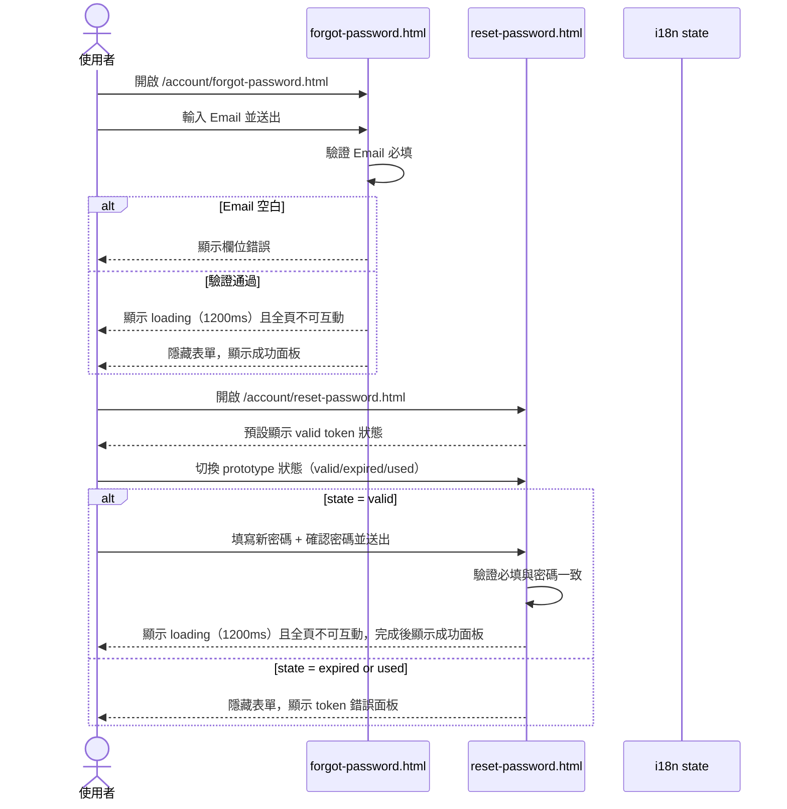
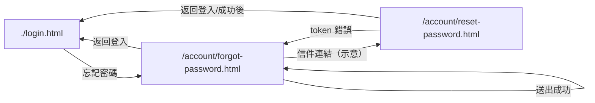

# 功能規格：Forgot / Reset Password（Prototype）
---
功能分支: feat/account/004-forgot-reset-password
建立日期: 2026-04-05
版本: 1.1.2
狀態: Clarified
---

# 功能規格：Forgot / Reset Password（Prototype）

**需求來源**: 最新原型 [design/prototype/pages/account/forgot-password.html](../../../design/prototype/pages/account/forgot-password.html) / [design/prototype/pages/account/reset-password.html](../../../design/prototype/pages/account/reset-password.html)

## 輸入與生成規則

**輸入描述**：本規格需定義 Forgot / Reset Password 的帳號流程、表單狀態、導頁、i18n、可存取屬性與 RWD 行為。

**產生規格時必須遵守**：

1. 先確認本規格範圍與需求來源一致：最新原型 [design/prototype/pages/account/forgot-password.html](../../../design/prototype/pages/account/forgot-password.html) / [design/prototype/pages/account/reset-password.html](../../../design/prototype/pages/account/reset-password.html)。
2. 若新增或改動角色權限、導頁、資料欄位、錯誤狀態、i18n、可存取屬性或響應式邊界，必須同步檢查使用者情境、功能需求、成功標準與規格相依性。
3. 若需求描述缺少角色、狀態、資料來源、權限、錯誤處理、導頁目標或量化門檻，需以待釐清標記記錄具體問題，不得自行假設。
4. 規格應描述使用者可觀察行為、業務規則與驗收條件；避免描述框架、檔案結構、API 實作或資料庫實作，除非該內容本身是已定義的產品契約。
5. 本規格若與 prototype、IA 或上游規格不一致，必須明確記錄差異、更新相依性，並新增 changelog。

**已釐清事項**：

- 本版以既有需求來源與本文件中的 流程圖、使用者情境、功能需求、成功標準 作為 scope baseline。
- 跨頁或跨模組共用行為需透過「規格相依性」追蹤，不在本文件中隱含建立未列出的依賴。
- 若後續新增實作層契約，需先確認是否構成行為變更；若是，必須依 SDD 流程更新 spec。
- 2026-05-22 釐清後，forgot/reset 送出後的 loading 期間必須全頁不可互動；若現有 prototype 僅停用送出按鈕，需同步更新 prototype 以符合本規格。

## Clarifications

### Session 2026-05-22

- Q: Forgot / Reset Password 在 `1200ms` loading 期間，頁面其他元件是否可互動？ → A: 全頁不可互動（包含語言切換、返回登入等連結）

## 規格常數

- `MOBILE_BP = 767px`
- `RWD_VIEWPORTS = 375px / 768px / 1440px`
- `RESET_TOKEN_STATES = valid / expired / used`

## 流程圖

```mermaid
sequenceDiagram
    actor 使用者
    participant forgot as forgot-password.html
    participant reset as reset-password.html
    participant i18n as i18n state

    使用者->>forgot: 開啟 /account/forgot-password.html
    使用者->>forgot: 輸入 Email 並送出
    forgot->>forgot: 驗證 Email 必填

    alt Email 空白
        forgot-->>使用者: 顯示欄位錯誤
    else 驗證通過
        forgot-->>使用者: 顯示 loading（1200ms）且全頁不可互動
        forgot-->>使用者: 隱藏表單，顯示成功面板
    end

    使用者->>reset: 開啟 /account/reset-password.html
    reset-->>使用者: 預設顯示 valid token 狀態
    使用者->>reset: 切換 prototype 狀態（valid/expired/used）

    alt state = valid
        使用者->>reset: 填寫新密碼 + 確認密碼並送出
        reset->>reset: 驗證必填與密碼一致
        reset-->>使用者: 顯示 loading（1200ms）且全頁不可互動，完成後顯示成功面板
    else state = expired or used
        reset-->>使用者: 隱藏表單，顯示 token 錯誤面板
    end
```

| 步驟 | 角色 | 動作 | 系統回應 |
|------|------|------|---------|
| 1 | 使用者 | 開啟 `/account/forgot-password.html` | 顯示 Email 欄位與送出按鈕 |
| 2 | 使用者 | 送出 forgot 表單 | Email 為空顯示錯誤；非空則全頁進入不可互動 loading，1200ms 後顯示成功面板 |
| 3 | 使用者 | 開啟 `/account/reset-password.html` | 預設 `valid token` 狀態 |
| 4 | 使用者 | 切換 `expired` 或 `used` | 顯示 token 錯誤面板（隱藏表單） |
| 5 | 使用者 | 在 `valid` 狀態送出 reset 表單 | 驗證通過後全頁進入不可互動 loading，1200ms 後顯示成功面板 |

---

## 使用者情境與測試 *(必填)*

### 使用者故事 1 — Forgot Password 表單（優先級：P1）

使用者可在 forgot 頁面輸入 Email 申請重設，並得到通用成功提示。

**此優先級原因**：forgot 頁是重設流程入口，沒有入口就無法進入後續步驟。

**獨立測試方式**：測試空 Email 與非空 Email 兩種提交結果。

**驗收情境**：

1. **Given** 使用者在 forgot 頁，**When** Email 為空送出，**Then** 顯示 `Email is required` / `請輸入電子郵件` 錯誤。
2. **Given** 使用者在 forgot 頁，**When** Email 非空送出，**Then** 頁面進入 loading 狀態且全頁不可互動。
3. **Given** forgot 送出完成，**When** 約 `1200ms` 後，**Then** 隱藏表單並顯示成功面板與返回登入連結。

---

### 使用者故事 2 — Reset Password（valid token）（優先級：P1）

在 valid token 狀態下，使用者可完成新密碼重設並看到成功結果。

**此優先級原因**：valid token 是 reset 流程核心主路徑。

**獨立測試方式**：在 valid 狀態測試空值、密碼不一致、成功送出。

**驗收情境**：

1. **Given** reset 頁為 `valid` 狀態，**When** 新密碼為空，**Then** 顯示新密碼必填錯誤。
2. **Given** reset 頁為 `valid` 狀態，**When** 確認密碼為空或與新密碼不一致，**Then** 顯示對應欄位錯誤。
3. **Given** reset 頁為 `valid` 狀態且表單合法，**When** 送出，**Then** 顯示 loading、全頁不可互動，並於約 `1200ms` 後顯示成功面板。

---

### 使用者故事 3 — Reset Password（expired / used token）（優先級：P1）

reset 頁需能展示 token 失效與已使用兩種錯誤狀態。

**此優先級原因**：錯誤 token 狀態是重設流程常見分支，需可清楚驗證。

**獨立測試方式**：透過 prototype 狀態切換按鈕分別切至 `expired` 與 `used`。

**驗收情境**：

1. **Given** reset 頁狀態切為 `expired`，**When** 畫面更新，**Then** 隱藏表單並顯示「連結已過期」錯誤面板。
2. **Given** reset 頁狀態切為 `used`，**When** 畫面更新，**Then** 隱藏表單並顯示「連結已使用」錯誤面板。
3. **Given** token 錯誤面板顯示中，**When** 點擊「重新申請」，**Then** 導向 `./forgot-password.html`。

---

### 使用者故事 4 — i18n 與可存取屬性（優先級：P2）

forgot/reset 兩頁的文案與可存取屬性需支援即時語言切換。

**此優先級原因**：帳號流程頁面需維持一致雙語體驗與可存取性。

**獨立測試方式**：在不同狀態切換語言，檢查標題、欄位、按鈕、錯誤/成功文案與 `aria-label`。

**驗收情境**：

1. **Given** forgot 或 reset 頁，**When** 切換語言，**Then** 頁面標題、欄位標籤、按鈕文案即時更新。
2. **Given** reset 頁為 token 錯誤狀態，**When** 切換語言，**Then** token 錯誤訊息與 CTA 文案同步更新。
3. **Given** reset 頁有密碼顯示按鈕，**When** 切換語言或切換顯示狀態，**Then** `aria-label` 必須一致。
4. **Given** 使用者在 forgot/reset 任一頁切換語言，**When** 導向 login 或互相切頁，**Then** 目標頁語系需維持一致。

---

### 使用者故事 5 — 響應式版面（優先級：P2）

forgot/reset 頁在手機與桌機均需可讀可操作。

**此優先級原因**：密碼找回常在行動裝置發生，RWD 問題會直接阻斷流程。

**獨立測試方式**：以 `RWD_VIEWPORTS` 驗證導覽列、卡片、成功/錯誤面板與操作按鈕。

**驗收情境**：

1. **Given** `<= MOBILE_BP`，**When** 開啟 forgot/reset 頁，**Then** 導覽列為 56px 且內距為 16px。
2. **Given** `<= MOBILE_BP`，**When** 顯示成功或 token 錯誤面板，**Then** 無文字截斷與按鈕遮擋。
3. **Given** 任一 `RWD_VIEWPORTS`，**When** 完成流程操作，**Then** 無水平捲軸與排版破版。

---

### 邊界情況

- forgot/reset 是否已串真實 API 與 token 驗證？→ 尚未；目前為前端互動原型。
- reset 頁不透過 URL token 直接判斷狀態？→ 目前使用頁面內 prototype 切換按鈕控制狀態。
- forgot 成功提示是否揭露 Email 是否存在？→ 不揭露；固定顯示通用成功文案。

---

## 需求規格 *(必填)*

### 功能需求

- **FR-001**：系統必須提供 `/account/forgot-password.html`，包含 Email 欄位、送出按鈕、返回登入連結。
- **FR-002**：forgot 表單送出前必須驗證 Email 必填；空值顯示欄位錯誤。
- **FR-003**：forgot 表單驗證通過後必須進入 loading，loading 期間全頁不可互動，並於約 `1200ms` 顯示成功面板。
- **FR-004**：forgot 成功面板文案必須為不揭露帳號存在性的通用提示。
- **FR-005**：系統必須提供 `/account/reset-password.html`，包含新密碼、確認密碼欄位與送出按鈕。
- **FR-006**：reset 頁必須支援 `RESET_TOKEN_STATES` 三種 prototype 狀態切換。
- **FR-007**：reset 在 `valid` 狀態下，送出前必須驗證新密碼與確認密碼必填且一致。
- **FR-008**：reset 在 `valid` 狀態送出成功後，必須進入 loading，loading 期間全頁不可互動，並於約 `1200ms` 顯示成功面板。
- **FR-009**：reset 在 `expired` / `used` 狀態時，必須隱藏表單並顯示 token 錯誤面板。
- **FR-010**：token 錯誤面板中的「重新申請」連結必須導向 `./forgot-password.html`。
- **FR-011**：forgot/reset 頁面必須支援 `zh` / `en` 即時切換，並同步更新 `document.title` 與 `aria-label`。
- **FR-011A**：語言狀態必須跨頁持久化；forgot/reset 與 login 間導頁後需沿用同語系。
- **FR-012**：reset 的密碼顯示切換按鈕必須同步調整欄位 type 與 `aria-label`。
- **FR-013**：forgot/reset 頁面必須具備響應式設計，至少支援 `RWD_VIEWPORTS`。
- **FR-013A**：在 `<= MOBILE_BP` 時導覽列需改為 56px 並使用 16px 左右內距。

### 使用者流程與導頁

```mermaid
flowchart LR
    login["./login.html"]
    forgot["/account/forgot-password.html"]
    reset["/account/reset-password.html"]

    login -->|忘記密碼| forgot
    forgot -->|送出成功| forgot
    forgot -->|返回登入| login
    forgot -->|信件連結（示意）| reset
    reset -->|token 錯誤| forgot
    reset -->|返回登入/成功後| login
```

| From | Trigger | To |
|------|---------|-----|
| `./login.html` | 點擊忘記密碼 | `/account/forgot-password.html` |
| `/account/forgot-password.html` | 成功送出 | 停留原頁（顯示成功面板） |
| `/account/forgot-password.html` | 點擊返回登入 | `./login.html` |
| `/account/reset-password.html` | token 錯誤面板點擊重新申請 | `./forgot-password.html` |
| `/account/reset-password.html` | 點擊返回登入 / 成功面板連結 | `./login.html` |

**Entry points**：`/account/forgot-password.html`、`/account/reset-password.html`。
**Exit points**：`./login.html`、`./forgot-password.html`。

### 關鍵實體

- **ForgotFormState**：forgot 表單狀態。關鍵欄位：`email`、`emailError`、`isSubmitting`、`isPageInteractionDisabled`、`successVisible`。
- **ResetFormState**：reset 表單狀態。關鍵欄位：`newPassword`、`confirmPassword`、`errors`、`isSubmitting`、`isPageInteractionDisabled`。
- **ResetPrototypeTokenState**：reset token 狀態。允許值：`valid`、`expired`、`used`。
- **LanguageState**：語言狀態。關鍵欄位：`lang`（`zh` / `en`）、`storage_key = labelsuite.lang`。

---

## 規格相依性 *(本功能依賴其他規格，或被其他規格依賴時填寫)*

### 上游（本規格依賴的規格）

| 規格編號 | 功能 | 本規格需要的內容 |
|---------|------|----------------|
| 001 | Login — Email / Password + 頁面 UI | 忘記密碼入口連結與語言切換一致性 |
| 008 | Shared Sidebar Navbar | 全站語言持久化契約（跨頁維持同語系） |

### 下游（依賴本規格的規格）

| 規格編號 | 功能 | 依賴本規格的內容 |
|---------|------|----------------|
| 003 | Register — Email / Password | 密碼文案與驗證規則一致性 |

---

## 成功標準 *(必填)*

- **SC-001**：forgot 表單空值驗證正確觸發，非空送出後可顯示成功面板。
- **SC-002**：forgot 成功文案保持不揭露帳號存在性的通用訊息。
- **SC-003**：reset 在 `valid` 狀態可完成送出並顯示成功面板。
- **SC-004**：reset 在 `expired` / `used` 狀態可正確顯示對應 token 錯誤文案。
- **SC-005**：`zh` / `en` 切換可在 1 秒內更新主要文案與 `aria-label`。
- **SC-005A**：切換語言後由 forgot/reset 導向 login 或互相切頁時，語系需維持一致。
- **SC-006**：forgot/reset 送出後的 `1200ms` loading 期間，全頁互動元素不可被操作。
- **SC-007**：在 `RWD_VIEWPORTS` 下無破版、無遮擋、無水平捲軸。

---

## 審查與驗收清單

### 內容品質

- [x] 規格聚焦使用者可觀察行為、業務規則與驗收條件。
- [x] 所有必填章節已完成；不適用的內容已明確排除或未納入本版範圍。
- [x] 無未解決的待釐清標記殘留。
- [x] 需求、驗收情境與成功標準皆可測試。

### Label Suite 合規性

- [x] 功能分支格式符合 `feat/[module]/NNN-feature`。
- [x] 已檢查本規格未要求跨 feature import；跨模組共用行為需透過 shared contract 或規格相依性追蹤。
- [x] 本規格不新增 task type 邏輯；若後續接觸任務行為，需回到 config-driven task architecture 檢查。
- [x] 已檢查 annotator-facing API / UI 不得暴露 test-set answer、ground-truth 或等價特權資料。
- [x] Prototype / IA / 上游規格 source of truth 已列於需求來源或規格相依性。
- [x] 上下游規格相依性已列出；若本規格改版，需檢查 downstream 影響。

### 執行狀態

- [x] 輸入描述已解析。
- [x] 角色、互動、資料狀態與限制已萃取。
- [x] 模糊點已釐清或明確排除於本版範圍。
- [x] 使用者情境已定義。
- [x] 功能需求已定義。
- [x] 關鍵實體或狀態模型已定義。
- [x] Review checklist 已通過。

---

## Changelog

| 版本 | 日期 | 變更摘要 |
|------|------|---------|
| 1.1.3 | 2026-05-22 | 釐清 forgot/reset 送出後 loading 期間全頁不可互動，並同步更新流程、FR、狀態模型與成功標準 |
| 1.1.2 | 2026-05-21 | 補充輸入與產生規則、已釐清事項、審查清單與執行狀態；同步功能分支格式 |
| 1.1.1 | 2026-04-16 | 新增跨頁語言持久化規範：forgot/reset 與 login 導頁後必須維持同語系 |
| 1.1.0 | 2026-04-15 | 參照 dashboard 規格寫法重整章節；對齊 forgot/reset 原型（loading、success panel、token state 切換） |
| 1.0.0 | 2026-04-05 | Initial spec |
