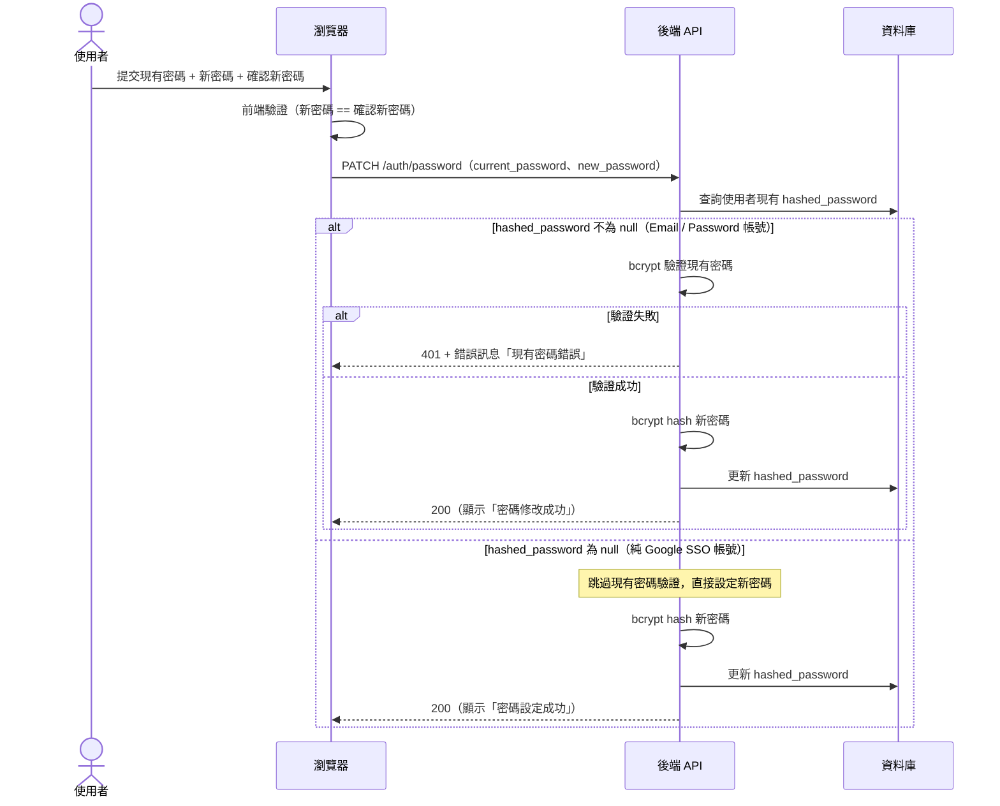
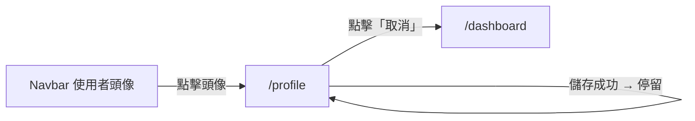

# 功能規格：個人設定（資料編輯 + 修改密碼）

**功能分支**：`005-profile-settings`
**建立日期**：2026-04-05
**狀態**：Clarified
**需求來源**：IA v7 Spec 清單 #005 — 個人設定（資料編輯 + 修改密碼）

## Process Flow

### 修改密碼流程

| 步驟 | 角色 | 動作 | 系統回應 |
|------|------|------|---------|
| 1 | 使用者 | 提交現有密碼 + 新密碼 + 確認新密碼 | 前端驗證新密碼與確認新密碼是否一致 |
| 2 | 後端 | 查詢使用者 `hashed_password` | 判斷帳號類型 |
| 3a | 後端 | Email / Password 帳號 — bcrypt 驗證現有密碼失敗 | 回傳 401 + 錯誤訊息，不更新密碼 |
| 3b | 後端 | Email / Password 帳號 — bcrypt 驗證現有密碼成功 | bcrypt hash 新密碼 → 更新 DB → 回傳 200 |
| 3c | 後端 | 純 Google SSO 帳號（`hashed_password = null`） | 跳過現有密碼驗證，直接 bcrypt hash 新密碼 → 更新 DB → 回傳 200 |

---

## 使用者情境與測試 *(必填)*

### User Story 1 — 修改個人資料（優先級：P1）

已登入使用者在 `/profile` 頁面修改姓名或聯絡方式，送出後系統更新資料庫並顯示儲存成功提示。

**此優先級原因**：使用者需要能維護自己的基本資料，是基本的帳號功能。

**獨立測試方式**：登入後進入 `/profile`，修改姓名並送出，驗證資料庫更新且頁面顯示成功提示。

**驗收情境**：

1. **Given** 已登入使用者在 `/profile`，**When** 修改姓名並送出，**Then** 資料庫更新 `name`，頁面顯示「儲存成功」提示，表單顯示新值。
2. **Given** 已登入使用者在 `/profile`，**When** 修改聯絡方式並送出，**Then** 資料庫更新聯絡資訊，頁面顯示「儲存成功」提示。
3. **Given** 已登入使用者在 `/profile`，**When** 清空姓名欄位並送出，**Then** 前端顯示必填錯誤，不送出請求。

---

### User Story 2 — 修改密碼（優先級：P2）

已登入使用者在 `/profile` 修改密碼，需先輸入現有密碼驗證身份，再填寫新密碼與確認密碼。Google SSO 帳號（無既有密碼）可直接設定密碼。

**此優先級原因**：密碼管理是帳號安全的基本需求；與忘記密碼（spec 004）互補，一個是登入後自主修改，另一個是登入前緊急重設。

**獨立測試方式**：登入後進入 `/profile`，填寫正確的現有密碼與新密碼送出，驗證以新密碼可登入、舊密碼無效。

**驗收情境**：

1. **Given** Email / Password 帳號的已登入使用者，**When** 填寫正確的現有密碼與符合強度的新密碼送出，**Then** 密碼以 bcrypt 雜湊更新，頁面顯示「密碼修改成功」。
2. **Given** Email / Password 帳號的已登入使用者，**When** 填寫錯誤的現有密碼，**Then** 顯示「現有密碼錯誤」，不更新密碼。
3. **Given** 已登入使用者，**When** 新密碼與確認密碼不一致，**Then** 前端顯示「密碼不一致」，不送出請求。
4. **Given** Google SSO 帳號的已登入使用者（無 `hashed_password`），**When** 在密碼修改區塊設定新密碼，**Then** 密碼設定成功，帳號同時支援 Email / Password 登入（靜默合併，同 spec 002）。

---

### User Story 3 — 查看角色（優先級：P3）

已登入使用者在 `/profile` 查看自己的系統角色，以及目前有成員資格的任務與對應任務角色。

**此優先級原因**：讓使用者了解自己的系統與任務角色，有助於理解可存取的功能範圍。

**獨立測試方式**：登入後進入 `/profile`，確認系統角色與任務角色資訊均正確顯示且無法編輯。

**驗收情境**：

1. **Given** 已登入使用者在 `/profile`，**When** 查看角色區塊，**Then** 顯示目前系統角色（`annotator` 或 `super_admin`），此欄位唯讀；若系統角色為 `null`，顯示「尚未指派系統角色」。
2. **Given** 擁有任務角色的已登入使用者，**When** 查看角色區塊，**Then** 顯示所有有成員資格的任務名稱與對應任務角色（`project_leader` / `reviewer` / `annotator`）。

---

### 邊界情況

- Google SSO 帳號嘗試修改密碼時？→ 顯示設定新密碼的表單（無現有密碼欄），設定成功後帳號新增 Email / Password 登入能力。
- 使用者修改姓名後，Navbar 上的顯示名稱是否即時更新？→ 是，儲存成功後前端 `authStore` 同步更新，Navbar 即時反映新姓名。

---

## 需求規格 *(必填)*

### 功能需求

- **FR-001**：`/profile` 頁面必須提供姓名、聯絡方式的編輯欄位，以及儲存按鈕。
- **FR-002**：姓名為必填欄位；前端驗證不得為空。
- **FR-003**：個人資料儲存成功後，前端 `authStore` 必須同步更新，Navbar 顯示名稱即時反映。
- **FR-004**：`/profile` 必須提供修改密碼區塊，含現有密碼（Email / Password 帳號）、新密碼、確認密碼欄位。
- **FR-005**：修改密碼前，Email / Password 帳號必須先驗證現有密碼（bcrypt 比對）。
- **FR-006**：新密碼必須以 bcrypt 雜湊後儲存，長度 ≥ 8 字元。
- **FR-007**：Google SSO 帳號（無 `hashed_password`）在修改密碼區塊不顯示「現有密碼」欄位，可直接設定新密碼。
- **FR-008**：`/profile` 必須提供角色資訊區塊，顯示系統角色（唯讀）及所有任務角色（任務名稱 + 任務角色）。
- **FR-009**：只有已登入使用者可存取 `/profile`；未登入存取導向 `/login`。

### User Flow & Navigation

| From | Trigger | To |
|------|---------|-----|
| Navbar 使用者頭像 | 點擊 | `/profile` |
| `/profile` | 儲存成功 | 停留在 `/profile` |
| `/profile` | 點擊「取消」或 Navbar Logo | `/dashboard` |

**Entry points**：Navbar 使用者頭像點擊。
**Exit points**：取消 → `/dashboard`；其他操作停留在 `/profile`。

### 關鍵實體

- **User（使用者）**：可編輯欄位：`name`、`contact_info`（聯絡方式）、`hashed_password`。唯讀欄位：`email`、`role`。

---

## 成功標準 *(必填)*

- **SC-001**：個人資料修改成功後，Navbar 顯示名稱即時更新，不需重新載入頁面。
- **SC-002**：密碼修改後，舊密碼無法登入；新密碼可正常登入。
- **SC-003**：密碼欄位輸入內容不以明文顯示（password input type）。
- **SC-004**：角色資訊區塊正確顯示使用者的系統角色與所有任務角色。
