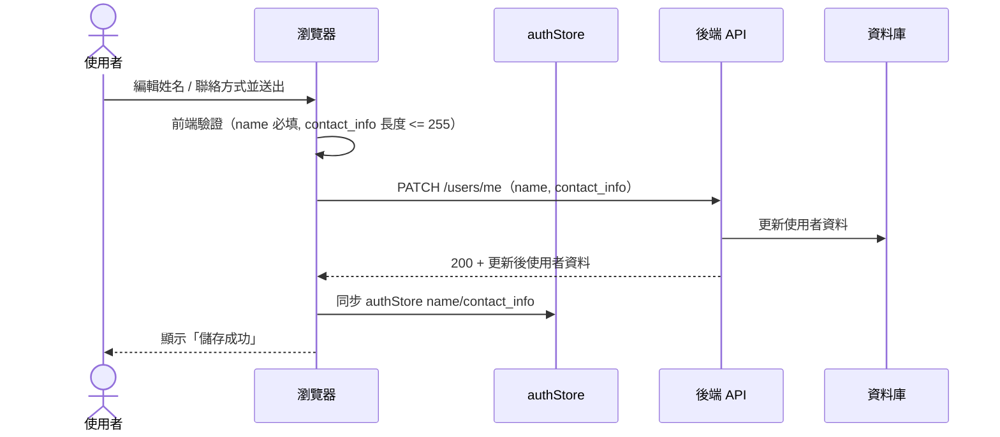
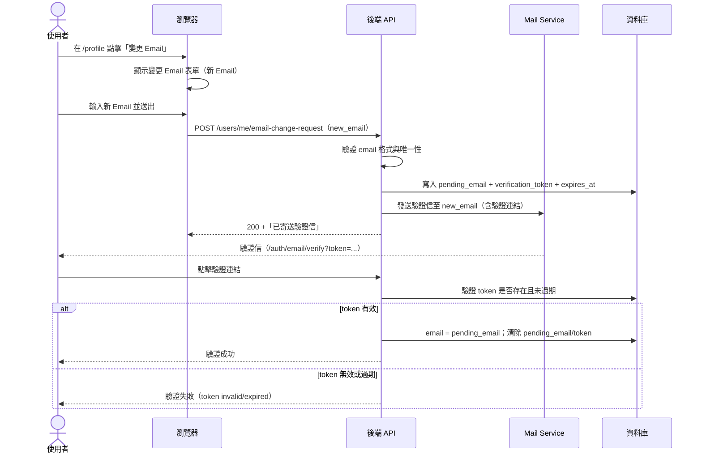
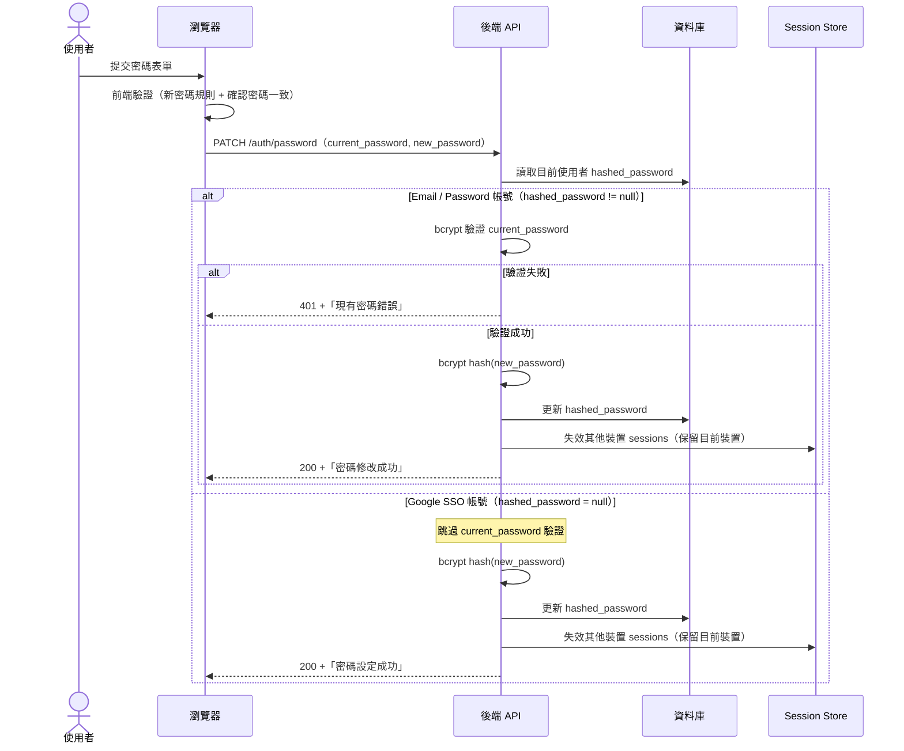
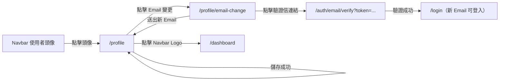

# 功能規格：Profile Settings — 個人設定（資料編輯 + 變更 Email + 修改密碼）

**功能分支**：`005-profile-settings`  
**建立日期**：2026-04-05  
**版本**：1.2.1  
**狀態**：Clarified  
**需求來源**：IA v7 Spec 清單 #005 — 個人設定（資料編輯 + 變更 Email + 修改密碼）

## 規格常數

- `PASSWORD_MIN_LENGTH = 8`
- `CONTACT_INFO_MAX_LENGTH = 255`
- `PASSWORD_RULE = 至少 1 個大寫英文字母 + 1 個小寫英文字母 + 1 個數字`
- `EMAIL_VERIFICATION_TOKEN_TTL_MINUTES = 30`
- `MOBILE_BP = 767px`
- `RWD_VIEWPORTS = 375px / 768px / 1440px`

## Process Flow

### 個人資料儲存流程

### 變更 Email 與驗證流程

### 修改密碼流程

| 步驟 | 角色 | 動作 | 系統回應 |
|------|------|------|---------|
| 1 | 使用者 | 編輯姓名或聯絡方式並送出 | 前端驗證後送出更新請求 |
| 2 | 系統 | 更新個人資料成功 | 回傳新資料並同步 `authStore`，Navbar 即時更新 |
| 3 | 使用者 | 點擊「變更 Email」並送出新 Email | 系統建立 email 變更請求並寄送驗證信至新 Email |
| 4 | 系統 | 新 Email 驗證連結被點擊且 token 有效 | 將 `email` 切換為新 Email，清除 pending 狀態 |
| 5 | 使用者 | 送出密碼變更 | 前端先驗證強度與確認密碼一致 |
| 6a | 系統 | Email / Password 帳號且現有密碼錯誤 | 回傳 401 + 錯誤訊息，不更新密碼 |
| 6b | 系統 | 密碼更新成功 | 寫入 bcrypt 雜湊，保留目前裝置 session，其他裝置失效 |
| 6c | 系統 | Google SSO 帳號設定密碼 | 不顯示現有密碼欄位，直接設定新密碼並套用相同 session 規則 |

---

## 使用者情境與測試 *(必填)*

### User Story 1 — 修改個人資料（優先級：P1）

已登入使用者在 `/profile` 修改姓名或聯絡方式，送出後系統更新資料並顯示成功提示。

**此優先級原因**：屬於基本帳號維護能力，必須優先可用。

**獨立測試方式**：登入後進入 `/profile`，修改姓名與聯絡方式，驗證 API 回寫成功、畫面顯示成功訊息，且 Navbar 名稱即時更新。

**驗收情境**：

1. **Given** 已登入使用者在 `/profile`，**When** 修改姓名並送出，**Then** 資料庫更新 `name`，表單顯示新值且頁面顯示「儲存成功」。
2. **Given** 已登入使用者在 `/profile`，**When** 修改聯絡方式並送出，**Then** 資料庫更新 `contact_info` 且頁面顯示「儲存成功」。
3. **Given** 已登入使用者在 `/profile`，**When** 清空姓名欄位送出，**Then** 前端顯示必填錯誤並阻止送出。

**個人資料區塊定義（需與原型一致）**：

- 欄位：`name`（必填）、`contact_info`（可空，單一自由文字）、`email`（遮罩顯示，含「變更」入口）
- 按鈕：`儲存`（主要）
- 回饋：儲存成功顯示 toast，不跳頁

**個人資料區塊行為規則**：

- `name` 為必填，空值不得送出請求。
- `contact_info` 長度上限 `CONTACT_INFO_MAX_LENGTH`，可為空字串。
- 更新成功後必須同步 `authStore`，Navbar 顯示名稱即時更新。

---

### User Story 2 — 變更 Email 與驗證（優先級：P1）

已登入使用者可在 `/profile` 點擊「變更」進入 Email 變更流程；系統需寄送驗證信至新 Email，驗證成功後才切換登入帳號 Email。

**此優先級原因**：Email 是登入主識別欄位，需確保帳號可用性與 Email 持有權驗證。

**獨立測試方式**：於 `/profile` 送出新 Email，確認驗證信成功寄送；分別測試驗證成功與 token 失效情境，驗證登入行為切換。

**驗收情境**：

1. **Given** 已登入使用者在 `/profile`，**When** 點擊 Email 欄位旁「變更」，**Then** 進入變更 Email 畫面並可輸入新 Email。
2. **Given** 已登入使用者送出合法且未被使用的新 Email，**When** 提交變更請求，**Then** 系統寄送驗證信至新 Email 並顯示「已寄送驗證信」。
3. **Given** 新 Email 尚未驗證，**When** 使用者嘗試以新 Email 登入，**Then** 登入失敗；舊 Email 仍可登入。
4. **Given** 使用者點擊未過期且有效的驗證連結，**When** 驗證通過，**Then** 系統將帳號主 Email 切換為新 Email。
5. **Given** Email 已切換完成，**When** 使用者登入，**Then** 僅新 Email 可登入，舊 Email 不可再用於登入。

**變更 Email 區塊定義（需與原型一致）**：

- 入口：`/profile` Email 列顯示遮罩 Email + `變更` 連結
- 變更頁：`/profile/email-change`，欄位 `new_email` + 按鈕 `下一步`
- 成功提示：送出後顯示「已寄送驗證信至 {new_email}，請前往信箱完成驗證」

**變更 Email 行為規則**：

- 新 Email 必須通過格式檢查，且不得與現有帳號重複。
- 變更請求建立後，不立即覆蓋 `email`，需先寫入 `pending_email` 並等待驗證成功。
- 驗證 token 有效期限為 `EMAIL_VERIFICATION_TOKEN_TTL_MINUTES`。
- 驗證成功後才更新 `email`，並清除 `pending_email` 與 token。

---

### User Story 3 — 修改密碼 / 設定密碼（優先級：P1）

已登入使用者可在 `/profile` 修改密碼；Google SSO 帳號（無既有密碼）可在同區塊直接設定新密碼。

**此優先級原因**：帳號安全核心功能，且需覆蓋 Email / Password 與 Google SSO 兩種帳號型態。

**獨立測試方式**：分別以 Email / Password 與 Google SSO 帳號執行流程，驗證欄位顯示差異、密碼更新結果與 session 失效策略。

**驗收情境**：

1. **Given** Email / Password 帳號已登入，**When** 輸入正確現有密碼與符合規則的新密碼送出，**Then** 密碼以 bcrypt 雜湊更新並顯示「密碼修改成功」。
2. **Given** Email / Password 帳號已登入，**When** 輸入錯誤現有密碼送出，**Then** 顯示「現有密碼錯誤」，不更新密碼。
3. **Given** 已登入使用者，**When** 新密碼與確認密碼不一致，**Then** 前端顯示「密碼不一致」，不送出請求。
4. **Given** Google SSO 帳號已登入且 `hashed_password = null`，**When** 設定符合規則的新密碼，**Then** 密碼設定成功，帳號新增 Email / Password 登入能力。
5. **Given** 任一帳號密碼更新成功，**When** 其他裝置帶舊 session token 呼叫 API，**Then** 請求被拒絕並需重新登入；目前裝置維持登入。

**密碼區塊定義（需與原型一致）**：

- Email / Password 帳號：`current_password`、`new_password`、`confirm_new_password`
- Google SSO 帳號：僅顯示 `new_password`、`confirm_new_password`，並顯示說明「設定密碼後即可同時使用 Email / Password 登入」
- 按鈕：`修改密碼`（或設定密碼）

**密碼區塊行為規則**：

- 新密碼需滿足 `PASSWORD_MIN_LENGTH` 與 `PASSWORD_RULE`。
- 驗證失敗回傳 401 時不啟用鎖定或節流機制。
- 成功更新後必須失效其他裝置 sessions，保留目前裝置 session。

---

### User Story 4 — 響應式版面（優先級：P2）

使用者在不同裝置寬度存取 `/profile` 時，頁面需維持可讀、可操作且不破版。

**此優先級原因**：個人設定常在行動裝置使用，RWD 問題會直接影響資料更新與密碼操作成功率。

**獨立測試方式**：以 `RWD_VIEWPORTS` 驗證 `/profile` 的兩個主要區塊、表單欄位、按鈕與錯誤訊息呈現。

**驗收情境**：

1. **Given** `<= MOBILE_BP`，**When** 開啟 `/profile`，**Then** 個人資料與密碼區塊改為單欄堆疊，且互動元件可完整點擊。
2. **Given** `<= MOBILE_BP`，**When** 顯示密碼錯誤訊息或儲存成功提示，**Then** 不發生文字截斷、按鈕遮擋或元件重疊。
3. **Given** 任一 `RWD_VIEWPORTS`，**When** 進行資料儲存與密碼修改流程，**Then** 頁面無水平捲軸且無排版破版。

---

### 邊界情況

- 新 Email 已被其他帳號使用？→ 拒絕請求並回傳「Email 已被使用」。
- 變更 Email 驗證連結逾期或無效？→ 顯示失敗訊息，使用者可重新發送驗證信。
- 新 Email 尚未驗證時可否登入？→ 不可，仍僅允許舊 Email 登入。
- 驗證成功後舊 Email 是否仍可登入？→ 不可，僅新 Email 可登入。
- Google SSO 帳號進入密碼區塊時？→ 不顯示現有密碼欄位，改為設定新密碼流程。
- 使用者姓名更新後 Navbar 是否即時反映？→ 是，透過 `authStore` 同步即時更新。
- `contact_info` 欄位可否為空？→ 可以，空字串合法；超過 `CONTACT_INFO_MAX_LENGTH` 視為驗證失敗。
- 現有密碼連續輸入錯誤是否鎖定？→ 不鎖定；每次皆回傳 401。
- 行動版（`<= MOBILE_BP`）時內容區或 Email 變更表單是否可能被擠壓或遮擋？→ 不可；需維持單欄可閱讀與可操作。

---

## 需求規格 *(必填)*

### 功能需求

- **FR-001**：`/profile` 必須提供個人資料區塊（姓名、聯絡方式、Email 顯示與變更入口）與儲存操作。
- **FR-002**：`name` 必須為必填欄位，空值不得送出。
- **FR-003**：`contact_info` 必須為單一自由文字欄位，可為空字串，長度上限 `CONTACT_INFO_MAX_LENGTH`。
- **FR-004**：個人資料更新成功後，前端必須同步更新 `authStore`，使 Navbar 顯示名稱即時反映。
- **FR-004A**：`/profile` 的 Email 區塊必須顯示遮罩後 Email 與「變更」入口。
- **FR-004B**：點擊「變更」後，系統必須進入 `/profile/email-change` 並提供 `new_email` 輸入與「下一步」按鈕。
- **FR-004C**：送出新 Email 後，系統必須建立 email 變更請求（`pending_email` + `verification_token` + `expires_at`）並寄送驗證信至新 Email。
- **FR-004D**：在 Email 驗證完成前，系統不得覆蓋既有 `email`，且登入仍使用舊 Email。
- **FR-004E**：使用者點擊有效驗證連結後，系統必須將 `email` 更新為 `pending_email` 並清除 pending/token。
- **FR-004F**：Email 驗證成功後，僅新 Email 可用於登入；舊 Email 不得再登入。
- **FR-004G**：驗證 token 失效或無效時，系統必須拒絕更新 Email 並提供重新寄送驗證信機制。
- **FR-005**：`/profile` 必須提供密碼修改區塊，依帳號類型顯示對應欄位。
- **FR-006**：Email / Password 帳號修改密碼前必須驗證 `current_password`（bcrypt 比對）。
- **FR-007**：新密碼必須以 bcrypt 雜湊儲存，並符合 `PASSWORD_MIN_LENGTH` 與 `PASSWORD_RULE`。
- **FR-008**：Google SSO 帳號（`hashed_password = null`）不得顯示「現有密碼」欄位，且可直接設定新密碼。
- **FR-009**：密碼驗證失敗時，系統必須回傳 401 與「現有密碼錯誤」，且不啟用鎖定或節流機制。
- **FR-010**：密碼更新成功後，必須保留目前裝置 session，並失效其他裝置既有 sessions。
- **FR-011**：僅已登入使用者可存取 `/profile`；未登入存取必須導向 `/login`。
- **FR-011A**：`/profile` 必須具備響應式設計，至少支援 `RWD_VIEWPORTS`。
- **FR-011B**：在 `<= MOBILE_BP` 時，兩個主要區塊（個人資料 / 密碼）必須單欄堆疊，避免欄位或按鈕被截斷。
- **FR-011C**：在任一 `RWD_VIEWPORTS` 下，頁面與 `/profile/email-change` 不得出現水平捲軸、文字重疊、按鈕遮擋或元件溢出容器。

### User Flow & Navigation

| From | Trigger | To |
|------|---------|-----|
| Navbar 使用者頭像 | 點擊 | `/profile` |
| `/profile` | 儲存成功 | 停留在 `/profile` |
| `/profile` | 點擊 Email「變更」 | `/profile/email-change` |
| `/profile/email-change` | 送出新 Email | 停留在 `/profile`（顯示已寄送驗證信） |
| 驗證信連結 | token 驗證成功 | `/login`（使用新 Email） |
| `/profile` | 點擊 Navbar Logo | `/dashboard` |

**Entry points**：Navbar 使用者頭像點擊。  
**Exit points**：Navbar Logo 返回 `/dashboard`；Email 驗證成功可進入 `/login` 以新 Email 登入；其餘成功操作留在 `/profile`。

---

### Wireframe 畫面總覽

> 本節定義 spec 005 `/profile` 頁面的 wireframe 範圍。  
> 單一檔案：`design/wireframes/pages/account/profile.pen`

#### 總計：6 張

| 畫面 | 畫面數 |
|------|:------:|
| Skeleton | 1 |
| Email / Password 帳號（完整密碼欄） | 1 |
| Google SSO 帳號（無現有密碼欄） | 1 |
| 密碼欄位錯誤狀態 | 1 |
| 變更 Email 表單 | 1 |
| 已寄送驗證信提示 | 1 |
| **合計** | **6** |

#### Profile 頁面 — 6 張

| ID | 畫面狀態 | Page 名稱 | 對應 US | 需繪製內容 | 導出導航 |
|----|---------|----------|---------|-----------|---------|
| P-0 | **Skeleton** | `P-0 Profile Skeleton` | US1、US3、US4 | Header 與兩區塊骨架（個人資料 / 密碼） | — |
| P-1 | **Email / Password 帳號** | `P-1 Profile Email 帳號` | US1、US2、US3、US4 | 個人資料區 + 三密碼欄位 + Email 變更入口 | 僅顯示「儲存」按鈕 |
| P-2 | **Google SSO 帳號** | `P-2 Profile Google SSO 帳號` | US2、US3 | 密碼區不顯示現有密碼欄，顯示設定說明；其餘同 P-1 | 僅顯示「儲存」按鈕 |
| P-3 | **密碼欄位錯誤** | `P-3 Profile 密碼錯誤` | US3 | 現有密碼欄位紅框與錯誤文案；新密碼欄位清空 | — |
| P-4 | **變更 Email 表單** | `P-4 Profile 變更 Email` | US2 | 新 Email 欄位 + 下一步按鈕（預設 disabled） | 送出後顯示寄信成功狀態 |
| P-5 | **已寄送驗證信** | `P-5 Profile Email 驗證信已寄送` | US2 | 提示文案（已寄送至新 Email）+ 重新寄送入口 | 返回 `/profile` |

#### 畫面 ID 彙整索引

檔案：`design/wireframes/pages/account/profile.pen`

| 畫面 ID | 畫面狀態 | Page 名稱（profile.pen 內） |
|--------|---------|----------------------------|
| P-0 | Skeleton | `P-0 Profile Skeleton` |
| P-1 | Email / Password 帳號 | `P-1 Profile Email 帳號` |
| P-2 | Google SSO 帳號 | `P-2 Profile Google SSO 帳號` |
| P-3 | 密碼欄位錯誤 | `P-3 Profile 密碼錯誤` |
| P-4 | 變更 Email 表單 | `P-4 Profile 變更 Email` |
| P-5 | 已寄送驗證信 | `P-5 Profile Email 驗證信已寄送` |

### 關鍵實體

- **User**：`name`、`contact_info`、`hashed_password`、`email`（可更新）
- **EmailChangeRequest**：`user_id`、`pending_email`、`verification_token`、`expires_at`、`verified_at`
- **Session**：多裝置登入 session 狀態（密碼更新後需失效其他裝置）

---

## 規格相依性 *(本功能依賴其他規格，或被其他規格依賴時填寫)*

### 上游（本規格依賴的規格）

| 規格編號 | 功能 | 本規格需要的內容 |
|---------|------|----------------|
| 001 | Login — Email / Password + 頁面 UI | `/profile` 需以已登入狀態存取；未登入導向 `/login` |
| 002 | Login — Google SSO | 需識別 Google SSO 帳號（`hashed_password = null`）以切換「設定密碼」流程 |
| 012 | Dashboard | Navbar 使用者頭像作為 `/profile` 入口|

### 下游（依賴本規格的規格）

| 規格編號 | 功能 | 依賴本規格的內容 |
|---------|------|----------------|
| 001 | Login — Email / Password + 頁面 UI | Email 驗證成功後帳號主識別 Email 切換規則（舊 Email 失效、新 Email 生效） |
| 004 | Forgot / Reset Password（Prototype） | 密碼規則與密碼文案一致性（新密碼驗證標準對齊） |

---

## 成功標準 *(必填)*

- **SC-001**：個人資料更新成功後，Navbar 名稱必須在同頁即時更新，無需重新整理。
- **SC-002**：密碼更新後，舊密碼登入失敗且新密碼登入成功。
- **SC-003**：密碼更新成功後，目前裝置維持登入；其他裝置在下一次 API 請求時被拒絕並要求重新登入。
- **SC-004**：所有密碼欄位皆以 `password input type` 呈現，不得明文顯示。
- **SC-005**：在 `RWD_VIEWPORTS` 下，`/profile` 無破版、無遮擋、無水平捲軸。
- **SC-006**：新 Email 驗證成功後，使用者可用新 Email 登入，舊 Email 登入必須失敗。
- **SC-007**：新 Email 未驗證或驗證 token 失效時，系統不得更新帳號主 Email。

---

## Changelog

| 版本 | 日期 | 變更摘要 |
|------|------|---------|
| 1.2.1 | 2026-04-16 | 移除「查看角色資訊」相關規劃（User Story、FR、SC、邊界情況與 wireframe 角色區塊描述） |
| 1.2.0 | 2026-04-16 | 新增「變更 Email」功能：新增變更入口、驗證信寄送流程、驗證成功後切換登入 Email 規則；同步更新 FR、Flow、Wireframe 與成功標準 |
| 1.1.2 | 2026-04-16 | Profile 個人資料區操作調整為僅保留「儲存」按鈕，移除「取消」相關流程與導頁描述 |
| 1.1.1 | 2026-04-16 | 新增「規格相依性」章節，補齊與 Login / Google SSO / Dashboard / Forgot-Reset 的上下游依賴關係 |
| 1.1.0 | 2026-04-16 | 參照 dashboard 規格寫法重整章節；補齊 clarify 決策（密碼強度、session 失效策略、contact_info 規則）與 RWD 規範（`MOBILE_BP`、`RWD_VIEWPORTS`） |
| 1.0.0 | 2026-04-05 | Initial spec |
