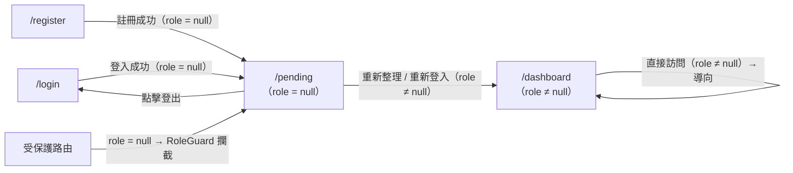

# 功能規格：Pending — 待指派角色提示頁

**功能分支**：`011-pending`
**建立日期**：2026-04-05
**狀態**：Draft
**需求來源**：IA v7 Spec 清單 #011 — Pending 待指派提示頁

---

## 使用者情境與測試 *(必填)*

### User Story 1 — 新使用者等待角色指派（優先級：P1）

新使用者完成 Google SSO 或 Email / Password 登入後，帳號 `role = null`，系統導向 `/pending`。使用者看到等待說明、自己的 Email，並可在此頁面執行登出。在管理員指派角色之前，使用者無法存取其他頁面。

**此優先級原因**：`/pending` 是所有新使用者完成驗證後的必經過渡頁面，必須在任何受保護功能上線前就緒，否則無角色使用者會停在無頁面可顯示的狀態。

**獨立測試方式**：使用 `role = null` 帳號登入，驗證系統導向 `/pending`，頁面顯示已登入使用者的 Email 與等待說明；直接輸入 `/dashboard` 網址，確認被導回 `/pending`。

**驗收情境**：

1. **Given** `role = null` 的已登入使用者，**When** 成功登入（Google SSO 或 Email / Password），**Then** 系統導向 `/pending`，頁面顯示「等待管理員指派角色」說明訊息與使用者 Email。
2. **Given** 在 `/pending` 的使用者，**When** 直接訪問 `/dashboard` 或其他受保護路由，**Then** 系統導回 `/pending`，不允許繼續。
3. **Given** 在 `/pending` 的使用者，**When** 點擊「登出」按鈕，**Then** JWT 失效、客戶端 session 清除，並導向 `/login`。

---

### User Story 2 — 管理員指派角色後自動重導向（優先級：P2）

Super Admin 或已有 `annotator` 系統角色的成員在 `user-management` 或 `annotator-list` 為等待中使用者指派角色後，該使用者下次重新整理或重新登入時，系統偵測到 `role ≠ null` 並自動導向 `/dashboard`。

**此優先級原因**：自動重導向提供良好的使用者體驗，但可在基本等待頁面上線後再補實作。使用者手動重新整理或重新登入也能達成同樣效果。

**獨立測試方式**：以 `role = null` 帳號登入後停在 `/pending`；另以 Super Admin 帳號指派角色；回到原帳號重新整理頁面，確認系統導向 `/dashboard`。

**驗收情境**：

1. **Given** 使用者停在 `/pending` 且管理員已指派角色，**When** 使用者重新整理頁面，**Then** 系統偵測 `role ≠ null` 並導向 `/dashboard`。
2. **Given** 使用者重新登入後 `role ≠ null`，**When** 登入成功，**Then** 系統跳過 `/pending` 直接導向 `/dashboard`。
3. **Given** 已擁有角色的使用者（`role ≠ null`），**When** 直接訪問 `/pending`，**Then** 系統自動導向 `/dashboard`，不顯示等待頁面。

---

### 邊界情況

- `role = null` 的使用者試圖直接導向 `/dashboard` 或任意受保護路由時？→ RoleGuard 攔截並導回 `/pending`。
- 使用者在 `/pending` 頁面上使用瀏覽器返回按鈕時？→ 若前一頁是受保護路由（例如剛才因無角色被導過來），不應返回至受保護頁面，保持停在 `/pending`。
- 使用者在 `/pending` 頁面長時間未操作導致 JWT 過期時？→ 下一次互動（例如點擊登出或重新整理）時，系統導向 `/login` 要求重新驗證。
- `/pending` 頁面在管理員指派角色後是否需要 Polling / WebSocket 即時通知？→ 不在本 spec 範圍內；P2 Story 以使用者主動重新整理為實作基準，即時通知為選配強化項。

---

## 需求規格 *(必填)*

### 功能需求

- **FR-001**：系統必須提供 `/pending` 頁面，顯示「等待管理員指派角色」的說明訊息（zh-TW / en 語系支援）。
- **FR-002**：`/pending` 頁面必須顯示當前已登入使用者的 Email。
- **FR-003**：`/pending` 頁面必須提供「登出」按鈕；點擊後 JWT 失效、session 清除，並導向 `/login`。
- **FR-004**：只有 `role = null` 的已登入使用者 MUST 被允許停留在 `/pending`，其他角色存取時系統導向 `/dashboard` — 由 RoleGuard 強制執行。
- **FR-005**：`role = null` 的已登入使用者存取任何受保護路由時，系統 MUST 導向 `/pending` — 由 RoleGuard 強制執行。
- **FR-006**：當使用者在 `/pending` 頁面重新整理且此時 `role ≠ null`（已被指派），系統 MUST 自動導向 `/dashboard`。
- **FR-007**：`/pending` 頁面必須支援響應式設計（375px、768px、1440px）。
- **FR-008**：`/pending` 頁面必須支援 zh-TW / en 語言切換，與應用程式其他頁面一致。

### User Flow & Navigation

| From | Trigger | To |
|------|---------|-----|
| `/login` | 登入成功（`role = null`）| `/pending` |
| `/register` | 註冊成功（`role = null`）| `/pending` |
| `/pending` | 點擊「登出」| `/login` |
| `/pending` | 重新整理且 `role ≠ null` | `/dashboard` |
| 任意受保護路由 | `role = null` → RoleGuard | `/pending` |
| `/pending` | 已有角色使用者直接訪問 | `/dashboard`（自動導向）|

**Entry points**：`/login`（登入成功後）、`/register`（註冊成功後）、任意受保護路由被 RoleGuard 攔截後。
**Exit points**：「登出」按鈕（→ `/login`）、角色指派完成後重新整理（→ `/dashboard`）。

### 關鍵實體

- **User（使用者）**：關鍵屬性 `id`、`email`、`role`（`null` 代表待指派）。`/pending` 頁面從 `authStore` 取得 `email` 與 `role` 顯示。
- **Session / JWT**：包含 `role` 欄位。頁面載入時前端讀取 JWT 中的 `role`；若 `role ≠ null` 則立即導向 `/dashboard`。登出時 JWT 必須失效並清除 session。

---

## 成功標準 *(必填)*

- **SC-001**：`role = null` 的已登入使用者在登入後一律導向 `/pending`，不得看到 `/dashboard` 或其他受保護頁面內容。
- **SC-002**：`/pending` 頁面正確顯示已登入使用者的 Email（不顯示錯誤 Email 或空值）。
- **SC-003**：點擊「登出」後，已失效的 JWT 被所有受保護 API 端點拒絕（回傳 HTTP 401）。
- **SC-004**：已擁有角色（`role ≠ null`）的使用者直接訪問 `/pending` 時，在 500ms 內被導向 `/dashboard`。
- **SC-005**：`/pending` 頁面在視窗寬度 375px、768px、1440px 下均正確渲染，無版型破版。
- **SC-006**：`/pending` 頁面正確顯示 zh-TW 與 en 兩種語言，語言切換立即生效，不需重新載入頁面。
