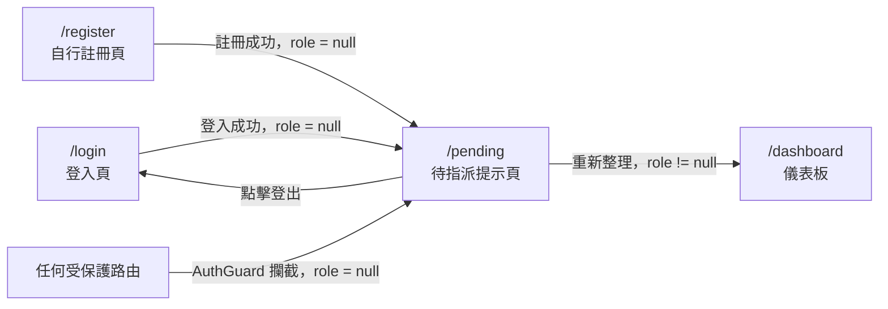

# 功能規格：待指派提示頁

**功能分支**：`042-pending-page`
**建立日期**：2026-04-08
**狀態**：Draft
**需求來源**：IA v7 Spec 清單 #042 — 待指派提示頁 `pending` | account 模組 | P1 基礎建設

## 使用者情境與測試 *(必填)*

### User Story 1 — 新使用者登入後看到待指派提示（優先級：P1）

使用者透過 Email/Password 登入或 Google SSO 登入，帳號的 `role = null`（尚未被指派系統角色），系統自動導向 `/pending` 頁面，顯示等待指派說明，並阻止使用者存取任何其他受保護頁面。

**此優先級原因**：這是整個 AuthGuard 流程的安全閥。若 `role = null` 的使用者能繞過此頁進入其他頁面，則所有 RoleGuard 保護的頁面都有可能被非預期存取。必須在所有其他功能之前確保此邏輯正確。

**獨立測試方式**：使用 `role = null` 的已登入帳號嘗試存取 `/dashboard`、`/task-list` 等需要角色的頁面，確認系統全部重導至 `/pending`，且 `/pending` 頁面正常顯示說明內容。

**驗收情境**：

1. **Given** 已登入且 `role = null` 的使用者，**When** 登入成功後，**Then** 系統自動導向 `/pending`，顯示帳號已建立、等待管理員指派角色的提示訊息。
2. **Given** 已登入且 `role = null` 的使用者，**When** 嘗試直接訪問 `/dashboard`，**Then** 系統攔截請求並重導至 `/pending`，不顯示任何儀表板內容。
3. **Given** 已登入且 `role = null` 的使用者，**When** 嘗試直接訪問任何需角色授權的路由（如 `/task-list`、`/annotator-list`），**Then** 系統統一重導至 `/pending`。

---

### User Story 2 — 自行註冊後看到待指派提示（優先級：P1）

使用者透過 `/register` 頁面完成 Email/Password 自行註冊，帳號建立後預設 `role = null`，系統自動導向 `/pending`，顯示等待指派說明。

**此優先級原因**：與 User Story 1 同等重要，涵蓋另一個進入 pending 狀態的入口（註冊流程）。

**獨立測試方式**：完成新帳號註冊後，確認系統導向 `/pending` 且頁面正常顯示說明文字。

**驗收情境**：

1. **Given** 使用者在 `/register` 填寫資料並送出，**When** 帳號建立成功（`role = null`），**Then** 系統自動導向 `/pending`，顯示等待指派說明。

---

### User Story 3 — 角色指派完成後自動離開待指派頁（優先級：P2）

管理員（Super Admin 或具 `annotator` 系統角色的成員）在 `user-management` 或 `annotator-list` 中完成角色指派後，待指派使用者重新整理頁面時系統角色已更新，應自動離開 `/pending` 並進入 `/dashboard`。

**此優先級原因**：依賴管理員操作，不阻擋 P1 MVP，但屬於完整流程必須的離開機制。

**獨立測試方式**：管理員指派角色後，以該使用者身份重新整理 `/pending` 頁面或重新登入，確認系統導向 `/dashboard`。

**驗收情境**：

1. **Given** 使用者位於 `/pending` 且 `role` 已由管理員更新為 `annotator` 或 `super_admin`，**When** 使用者重新整理頁面，**Then** 系統偵測 JWT 中 `role != null`，自動導向 `/dashboard`。
2. **Given** 使用者重新登入後 `role` 已有值，**When** 登入成功，**Then** 系統跳過 `/pending` 直接進入 `/dashboard`。

---

### 邊界情況

- 已有角色的使用者（`role != null`）手動訪問 `/pending` 時？→ 系統應重導至 `/dashboard`，不顯示 pending 頁內容。
- JWT token 過期而使用者仍在 `/pending` 頁面時？→ 應導向 `/login`。
- `/pending` 頁面本身不可包含任何通往其他受保護頁面的導覽連結（如 sidebar、navbar 主選單）。

---

## 需求規格 *(必填)*

### 功能需求

- **FR-001**：系統必須在 `role = null` 的已登入使用者嘗試訪問任何需角色授權頁面時，重導至 `/pending`。
- **FR-002**：`/pending` 頁面必須僅對 `role = null` 的已登入使用者開放；`role != null` 者訪問時必須重導至 `/dashboard`。
- **FR-003**：`/pending` 頁面必須顯示說明文字，告知使用者帳號已建立、正在等待管理員指派角色。
- **FR-004**：`/pending` 頁面必須提供登出功能，使用者可主動登出並返回 `/login`。
- **FR-005**：系統必須在使用者重新整理 `/pending` 頁面時重新檢查 JWT 中的 `role` 值；若 `role != null`，必須自動導向 `/dashboard`。
- **FR-006**：`/pending` 頁面必須隱藏主要 Navbar（含 sidebar 導覽連結），以防止 `role = null` 使用者存取受保護路由。

### User Flow & Navigation

| From | Trigger | To |
|------|---------|-----|
| `/login` | 登入成功且 `role = null` | `/pending` |
| `/register` | 註冊成功（`role = null`）| `/pending` |
| 任何受保護路由 | AuthGuard 偵測 `role = null` | `/pending` |
| `/pending` | 重新整理且 `role != null` | `/dashboard` |
| `/pending` | 點擊登出 | `/login` |

**Entry points**：`/login`（登入後跳轉）、`/register`（註冊後跳轉）、任何受保護路由（AuthGuard 攔截重導）。
**Exit points**：`/dashboard`（角色指派完成後重整）、`/login`（登出）。

---

## 成功標準 *(必填)*

- **SC-001**：`role = null` 的使用者無法透過任何方式（手動輸入 URL、前進/後退）存取 `/dashboard` 或其他受保護頁面。
- **SC-002**：管理員指派角色後，使用者重新整理 `/pending` 頁面可在 1 次請求內自動跳轉至 `/dashboard`，無需重新登入。
- **SC-003**：`/pending` 頁面說明文字清楚告知使用者帳號狀態與下一步，使用者無需詢問即可理解。
