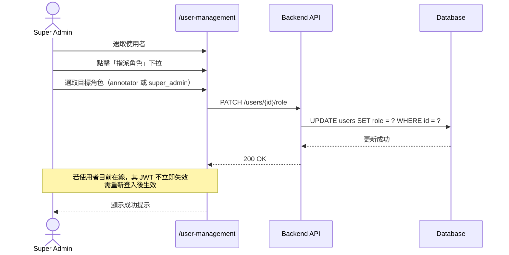
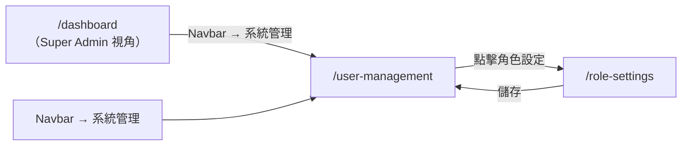

# 功能規格：使用者列表與管理

**功能分支**：`006-user-management`
**建立日期**：2026-04-05
**狀態**：Clarified
**需求來源**：IA v7 Spec 清單 #006 — 使用者列表與管理

## 流程說明

| 步驟 | 角色 | 動作 | 系統回應 |
|------|------|------|----------|
| 1 | Super Admin | 在 `/user-management` 選取使用者 | 顯示該使用者的角色操作選項 |
| 2 | Super Admin | 點擊「指派角色」下拉 | 展開角色選單（`annotator` / `super_admin`）|
| 3 | Super Admin | 選取目標角色 | 送出 PATCH 請求 |
| 4 | System | 更新 `users.role` 欄位 | 寫入資料庫 |
| 5 | System | 若使用者目前在線 | 現有 JWT 不立即失效，需重新登入後生效 |
| 6 | System | — | 顯示成功提示 |

---

## 使用者情境與測試 *(必填)*

### User Story 1 — 查看所有使用者並指派系統角色（優先級：P1）

Super Admin 在 `/user-management` 查看平台所有使用者帳號，並可將 `role = null`（待指派）或既有系統角色的帳號指派或變更為 `annotator` 或 `super_admin`。

**此優先級原因**：系統角色指派是整個平台的權限管控核心，沒有 Super Admin 指派角色，新使用者永遠停在 `/pending` 無法使用系統。

**獨立測試方式**：以 super_admin 登入進入 `/user-management`，對 `role = null` 的使用者指派 `annotator` 角色，驗證該使用者下次登入可進入 `/dashboard`。

**驗收情境**：

1. **Given** Super Admin 在 `/user-management`，**When** 頁面載入，**Then** 顯示所有平台使用者列表，包含姓名、Email、系統角色、帳號狀態、建立日期。
2. **Given** Super Admin 在 `/user-management`，**When** 對 `role = null` 的使用者選擇指派 `annotator`，**Then** 該使用者系統角色更新為 `annotator`，下次登入導向 `/dashboard`。
3. **Given** Super Admin 在 `/user-management`，**When** 對既有 `annotator` 升級為 `super_admin`，**Then** 系統角色更新，該使用者取得系統管理權限。
4. **Given** Super Admin 在 `/user-management`，**When** 搜尋關鍵字（姓名或 Email），**Then** 列表即時篩選顯示符合結果。

---

### User Story 2 — 停用 / 啟用帳號（優先級：P2）

Super Admin 可停用特定使用者帳號，停用後該帳號無法登入；可隨時重新啟用。

**此優先級原因**：帳號停用是基本的存取控制需求，讓 Super Admin 能在不刪除帳號的情況下暫停存取權。

**獨立測試方式**：停用一個已登入使用者的帳號，驗證該使用者下次請求回傳 401；重新啟用後可正常登入。

**驗收情境**：

1. **Given** Super Admin 在 `/user-management`，**When** 停用一個帳號，**Then** 該帳號狀態變為「已停用」，該使用者嘗試登入時回傳「帳號已停用」錯誤。
2. **Given** Super Admin 在 `/user-management`，**When** 重新啟用已停用帳號，**Then** 該帳號狀態恢復為「啟用」，使用者可正常登入。
3. **Given** Super Admin 在 `/user-management`，**When** 嘗試停用自己的帳號，**Then** 系統拒絕操作並顯示「無法停用自己的帳號」。

---

### User Story 3 — Super Admin 直接新增使用者帳號（優先級：P2）

Super Admin 可在 `/user-management` 直接新增使用者帳號（填寫姓名、Email、初始角色），適用於需要預先建立帳號的情境（例如為尚未自行註冊的研究員建立帳號）。

**此優先級原因**：使用者可透過 `/register` 自行加入，但 Super Admin 直接新增是備用方案，確保特殊情境下的彈性。

**獨立測試方式**：以 super_admin 身份在 `/user-management` 新增使用者，驗證資料庫建立對應帳號，且該使用者可以 Email / Password 登入。

**驗收情境**：

1. **Given** Super Admin 在 `/user-management`，**When** 點擊「新增使用者」並填寫姓名、Email、初始系統角色（`null` / `annotator` / `super_admin`）後送出，**Then** 系統建立對應帳號（無密碼，使用者首次登入需透過「忘記密碼」設定密碼）。
2. **Given** Super Admin 在 `/user-management`，**When** 新增帳號使用的 Email 已存在，**Then** 顯示「此 Email 已被使用」，不建立重複帳號。

---

### 邊界情況

- Super Admin 可以降級自己的角色嗎？→ 不允許；系統必須確保至少有一個 `super_admin` 存在，防止無人可管理的情況。
- 停用帳號時該使用者正在線上？→ 現有 session 在 JWT 過期前仍有效；JWT 過期後無法更新，等同強制登出。
- Super Admin 直接新增的帳號無初始密碼？→ 是；使用者首次登入需透過「忘記密碼」流程設定密碼（spec 004）。

---

## 需求規格 *(必填)*

### 功能需求

- **FR-001**：只有 `super_admin` 可存取 `/user-management`；其他已登入使用者（`role = annotator`）存取導向 `/dashboard`；`role = null` 的使用者導向 `/pending`。
- **FR-002**：頁面必須列出所有平台使用者，顯示：姓名、Email、系統角色（`null` / `annotator` / `super_admin`）、帳號狀態（啟用 / 停用）、建立日期。
- **FR-003**：Super Admin 必須能對任意使用者指派或變更系統角色（`null` → `annotator` → `super_admin`，雙向可變更）。
- **FR-004**：Super Admin 必須能停用或啟用任意使用者帳號，但不得停用自己的帳號。
- **FR-005**：系統必須確保至少存在一個 `super_admin`；若操作會導致 `super_admin` 數量為 0，系統拒絕並顯示錯誤。
- **FR-006**：頁面必須支援依姓名或 Email 的即時搜尋篩選。
- **FR-007**：空狀態（尚無任何使用者）顯示說明文字「尚未建立任何使用者帳號」，並提供「新增第一位使用者」引導按鈕（導向新增使用者表單）。
- **FR-008**：Super Admin 必須能直接新增使用者帳號（填寫姓名、Email、初始系統角色）；新帳號無初始密碼，使用者首次登入需透過忘記密碼流程設定密碼（spec 004）。Email 已存在時回傳錯誤，不建立重複帳號。
- **FR-009**：資料庫 migration seed 必須在全新部署環境中自動建立一個預設 `super_admin` 帳號（Email 與密碼透過環境變數設定），確保首次部署後即有管理員可登入管理平台（bootstrap 需求）。

### User Flow & Navigation

| From | Trigger | To |
|------|---------|-----|
| Navbar → 系統管理 | 點擊 | `/user-management` |
| `/user-management` | 點擊「角色設定」 | `/role-settings` |
| `/role-settings` | 儲存 | `/user-management` |

**Entry points**：Navbar → 系統管理（僅 `super_admin` 可見）。
**Exit points**：導向 `/role-settings`；其他操作停留在本頁。

### 關鍵實體

- **User（使用者）**：平台使用者帳號。關鍵屬性：
  - `id`：使用者唯一識別碼
  - `email`：登入 Email（唯一）
  - `name`：顯示名稱
  - `role`：系統角色（`null` | `annotator` | `super_admin`）
  - `is_active`：帳號啟用狀態（`true` | `false`）
  - `created_at`：帳號建立時間

---

## 成功標準 *(必填)*

- **SC-001**：非 `super_admin` 角色存取 `/user-management` 回傳 HTTP 403 或導向 `/dashboard`。
- **SC-002**：角色指派後，使用者下次登入的 JWT 中 `role` 欄位反映新角色。
- **SC-003**：停用帳號後，該帳號的所有新登入請求回傳「帳號已停用」錯誤。
- **SC-004**：系統在任何情況下均保有至少一個 `super_admin`。
