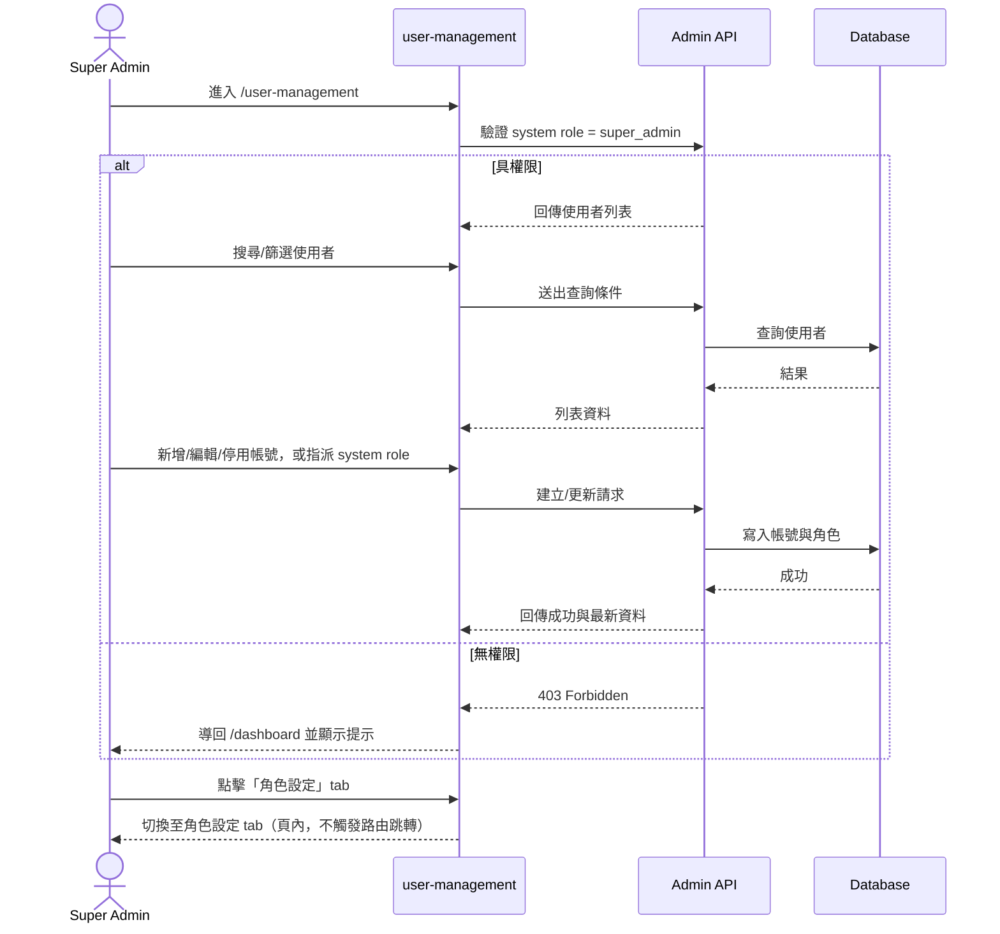
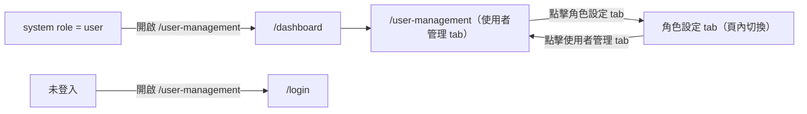

# 功能規格：User Management — 使用者列表與帳號管理

**功能分支**：`006-user-management`
**建立日期**：2026-04-16
**版本**：1.0.0
**狀態**：Draft
**需求來源**：IA v7 Spec 清單 #006 — 使用者列表與管理（`user-management`）

## 規格常數

- `SYSTEM_ROLES = user | super_admin`
- `PAGE_SIZE_DEFAULT = 20`
- `PAGE_SIZE_OPTIONS = 20 | 50 | 100`
- `MOBILE_BP = 767px`
- `RWD_VIEWPORTS = 375px / 768px / 1440px`
- `DEFAULT_SORT = created_at desc`

## Process Flow

| 步驟 | 角色 | 動作 | 系統回應 |
|------|------|------|---------|
| 1 | `super_admin` | 進入 `/user-management` | 驗證角色後載入全平台使用者列表 |
| 2 | `super_admin` | 搜尋/篩選使用者 | 更新列表結果與分頁 |
| 3 | `super_admin` | 新增或編輯帳號 | 儲存成功後刷新列表並顯示成功訊息 |
| 4 | `super_admin` | 停用帳號 | 帳號狀態更新為停用 |
| 5 | `super_admin` | 指派 `system role` | 僅可指派 `user` 或 `super_admin` |
| 6 | 非 `super_admin` | 直接嘗試開啟 `/user-management` | 拒絕存取並導回 `/dashboard` |
| 7 | `super_admin` | 點擊「角色設定」tab | 切換至角色設定 tab（頁內，不觸發路由跳轉） |

---

## 使用者情境與測試 *(必填)*

### User Story 1 — 檢視與搜尋平台使用者（優先級：P1）

Super Admin 可在 `/user-management` 查看全平台使用者，並以關鍵字與角色篩選快速定位目標帳號。

**此優先級原因**：系統管理模組的基礎入口，其他管理操作皆依賴清單可見性。  
**獨立測試方式**：以 `super_admin` 登入後開啟頁面，驗證列表、搜尋、篩選、分頁是否獨立可運作。

**驗收情境**：

1. **Given** 已登入且 `system role = super_admin`，**When** 進入 `/user-management`，**Then** 顯示全平台使用者列表（跨專案）。
2. **Given** 位於 `/user-management`，**When** 輸入關鍵字搜尋，**Then** 列表僅顯示符合條件的使用者。
3. **Given** 位於 `/user-management`，**When** 套用 system role 篩選，**Then** 列表只顯示指定角色（`user` 或 `super_admin`）。
4. **Given** 搜尋結果超過單頁數量，**When** 切換分頁，**Then** 顯示對應頁面資料且保留目前篩選條件。

**介面定義（需與 IA 導覽語意一致）**：

- 區塊 A：`使用者列表`
  - 必要元素：
    - 搜尋輸入框（姓名或 Email）
    - 角色篩選器（`user` / `super_admin`）
    - 狀態篩選器（啟用 / 停用）
    - 列表表格（姓名、Email、system role、狀態、建立時間、操作）
    - 分頁控制
- 區塊 B：`頁面操作`
  - 必要元素：
    - `新增使用者` CTA（位於搜尋篩選列同一排，靠右對齊）

**行為規則**：

- 列表資料範圍為全平台帳號，不受任務成員關係限制。
- 關鍵字搜尋採 `contains` 且不分大小寫，套用於 `name` 與 `email`。
- 分頁預設每頁 `PAGE_SIZE_DEFAULT`，並允許切換 `PAGE_SIZE_OPTIONS`。
- 列表預設排序為 `DEFAULT_SORT`。
- 任務角色（`project_leader` / `reviewer` / `annotator`）不得在本頁顯示為可編輯欄位。
- 語言切換時，欄位標題、按鈕與篩選器文字需即時更新。

---

### User Story 2 — 新增、編輯與停用帳號（優先級：P1）

Super Admin 可在使用者管理頁新增帳號、更新帳號基本資訊，並停用不再使用的帳號。

**此優先級原因**：帳號生命週期管理是平台運維核心能力。  
**獨立測試方式**：分別驗證新增、編輯、停用三個動作可獨立完成並反映在列表（手機版允許新增/編輯於 modal 或次頁流程）。

**驗收情境**：

1. **Given** `super_admin` 在 `/user-management`，**When** 建立新帳號並儲存，**Then** 新帳號出現在使用者列表中。
2. **Given** `super_admin` 在 `/user-management`，**When** 編輯既有帳號資料並儲存，**Then** 列表顯示更新後資訊。
3. **Given** `super_admin` 在 `/user-management`，**When** 停用帳號，**Then** 該帳號狀態顯示為停用且不可再登入。

**介面定義**：

- 新增/編輯表單必要欄位：
  - `name`
  - `email`
  - `system role`（`user` / `super_admin`）
  - `status`（啟用 / 停用）
- 操作按鈕：
  - `儲存`
  - `取消`

**行為規則**：

- `system role` 僅允許 `user` 或 `super_admin`。
- 帳號停用後應於列表中保留紀錄並標示停用狀態。
- 新增使用者成功後，系統需寄送「設定密碼」信給新帳號 Email。
- 停用使用者成功後，系統需立即撤銷該帳號所有 active session/token。
- 新增與編輯成功後，列表需立即反映最新結果（桌面/平板可同頁刷新或局部更新；手機版可透過 modal 或次頁完成後回到列表更新）。

---

### User Story 3 — 權限守門與跨頁導覽（優先級：P1）

只有 Super Admin 可進入使用者管理頁；非授權角色需被阻擋並導回安全入口頁。

**此優先級原因**：管理功能涉及平台級權限，需先確保授權正確性。  
**獨立測試方式**：以 `user` 與未登入狀態直接造訪 `/user-management`，驗證阻擋與導頁行為。

**驗收情境**：

1. **Given** `system role = user`，**When** 直接開啟 `/user-management`，**Then** 系統拒絕存取並導回 `/dashboard`。
2. **Given** 未登入狀態，**When** 開啟 `/user-management`，**Then** 系統導向 `/login`。
3. **Given** `system role = super_admin`，**When** 點擊「角色設定」tab，**Then** 成功切換至角色設定 tab（頁內，不觸發路由跳轉）。

**行為規則**：

- `/user-management` 路由需有角色守門，僅允許 `super_admin`。
- 無權限存取不得回傳可操作的管理資料。
- 「角色設定」tab 僅在 `super_admin` 可見且可點擊。

---

### 邊界情況

- 搜尋條件無結果時：顯示空狀態與清除篩選入口，不顯示錯誤頁。
- 新增使用者 Email 已存在時：拒絕儲存並顯示可理解錯誤訊息。
- 停用目前登入中的帳號時：需二次確認，避免誤操作。
- 最後一位 `super_admin` 角色被降級時：系統必須阻擋，避免平台失去管理者。
- 行動版下表格欄位過多時：需提供可讀方案（橫向捲動或卡片化），不得內容重疊。

---

## 需求規格 *(必填)*

### 功能需求

- **FR-001**：系統必須提供 `/user-management` 頁面供平台級使用者管理。
- **FR-002**：只有 `super_admin` 可以存取 `/user-management`。
- **FR-003**：系統必須顯示全平台使用者列表，包含姓名、Email、system role、帳號狀態。
- **FR-004**：系統必須支援依關鍵字搜尋使用者。
- **FR-004a**：關鍵字搜尋比對方式必須為 `contains` 且不分大小寫，並同時作用於 `name` 與 `email`。
- **FR-005**：系統必須支援依 system role 篩選（`user` / `super_admin`）。
- **FR-005a**：列表分頁必須預設 `PAGE_SIZE_DEFAULT`，並提供 `PAGE_SIZE_OPTIONS` 切換能力。
- **FR-005b**：列表預設排序必須為 `DEFAULT_SORT`。
- **FR-006**：系統必須支援新增使用者帳號。
- **FR-006a**：新增使用者成功後，系統必須寄送設定密碼信至該使用者 Email。
- **FR-007**：系統必須支援編輯既有使用者帳號資訊。
- **FR-008**：系統必須支援停用使用者帳號。
- **FR-008a**：停用使用者成功後，系統必須立即撤銷該帳號所有 active session/token。
- **FR-009**：本頁只可管理 system role（`user` / `super_admin`），不得指派任務角色。
- **FR-010**：頁面必須提供「使用者管理」與「角色設定」兩個 tab，預設停留於「使用者管理」tab；tab 切換為頁內行為，不觸發路由跳轉。
- **FR-011**：無權限角色存取本頁時，系統必須拒絕並導回安全頁（未登入→`/login`，一般使用者→`/dashboard`）。
- **FR-012**：頁面必須支援 `RWD_VIEWPORTS`，在 `<= MOBILE_BP` 時仍可完成查詢與帳號管理操作。

### User Flow & Navigation

| From | Trigger | To |
|------|---------|-----|
| `/dashboard` | 點擊「系統管理」 | `/user-management`（使用者管理 tab） |
| 使用者管理 tab | 點擊「角色設定」tab | 角色設定 tab（頁內，不跳轉路由） |
| 角色設定 tab | 點擊「使用者管理」tab | 使用者管理 tab（頁內，不跳轉路由） |
| 任何頁面 | `user` 直接造訪 `/user-management` | `/dashboard` |
| 任何頁面 | 未登入造訪 `/user-management` | `/login` |

**Entry points**：`/dashboard` 的「系統管理」導覽項。  
**Exit points**：Navbar 導覽至其他模組。

### 關鍵實體

- **PlatformUser**：平台使用者。關鍵欄位：`id`、`name`、`email`、`system_role`、`status`、`created_at`。
- **SystemRoleAssignment**：系統角色指派。允許值僅 `user`、`super_admin`。
- **UserStatus**：帳號狀態。允許值：`active`、`disabled`。

---

## 規格相依性 *(本功能依賴其他規格，或被其他規格依賴時填寫)*

### 上游（本規格依賴的規格）

| 規格編號 | 功能 | 本規格需要的內容 |
|---------|------|----------------|
| 001 | Login — Email / Password | 已登入狀態與路由守門基礎 |
| 008 | Shared Sidebar Navbar | Sidebar `系統管理` 導覽與 active 狀態規範 |

### 下游（依賴本規格的規格）

| 規格編號 | 功能 | 依賴本規格的內容 |
|---------|------|----------------|
| 007 | Role & Permission Settings | 由 `user-management` 進入 `role-settings` 的導覽與管理脈絡 |

---

## 成功標準 *(必填)*

- **SC-001**：`super_admin` 可成功進入 `/user-management` 並看到全平台使用者列表。
- **SC-002**：使用搜尋與篩選時，列表結果可在同頁正確更新。
- **SC-003**：新增、編輯、停用帳號後，列表可即時反映最新狀態（手機版允許新增/編輯經 modal 或次頁流程後返回列表反映）。
- **SC-004**：`user` 或未登入使用者無法存取管理內容，並被導向正確頁面。
- **SC-005**：頁面在 `RWD_VIEWPORTS` 下皆可完成核心操作且無版面重疊；其中 `<= MOBILE_BP` 需至少可完成搜尋、篩選、停用，新增/編輯可透過 modal 或次頁流程完成。
- **SC-006**：本頁不提供任務角色指派入口，符合 IA 的 system role / task role 邊界。

---

## Changelog

| 版本 | 日期 | 變更摘要 |
|------|------|---------|
| 1.0.2 | 2026-04-17 | Prototype 同步：`新增使用者` CTA 移至搜尋篩選列同列靠右 |
| 1.0.1 | 2026-04-17 | Clarify 決議回寫：搜尋規則（contains + case-insensitive）、分頁/排序契約、建立後寄送設定密碼信、停用後立即撤銷 session/token、手機版核心操作範圍 |
| 1.0.0 | 2026-04-16 | 初版建立：依 IA v7 新增 `user-management` 規格（列表、帳號管理、system role 管理、導覽與權限守門） |
