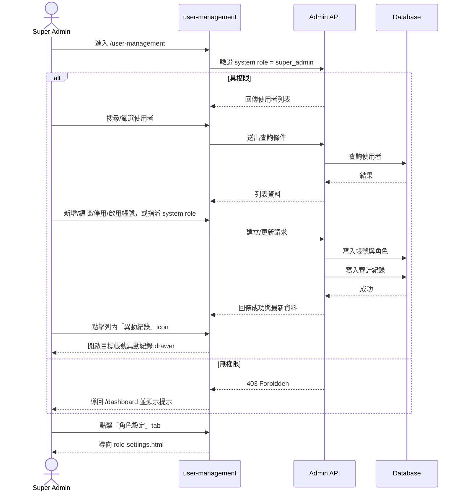
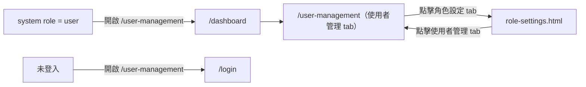

# 功能規格：User Management — 使用者列表與帳號管理

**需求來源**: IA v7 Spec 清單 #006 — 使用者列表與管理（`user-management`）

## 輸入與生成規則

**輸入描述**：本規格需定義 User Management 的系統管理流程、權限守門、列表/矩陣互動、審計與 RWD 行為。

**產生規格時必須遵守**：

1. 先確認本規格範圍與需求來源一致：IA v7 Spec 清單 #006 — 使用者列表與管理（user-management）。
2. 若新增或改動角色權限、導頁、資料欄位、錯誤狀態、i18n、可存取屬性或響應式邊界，必須同步檢查使用者情境、功能需求、成功標準與規格相依性。
3. 若需求描述缺少角色、狀態、資料來源、權限、錯誤處理、導頁目標或量化門檻，需以待釐清標記記錄具體問題，不得自行假設。
4. 規格應描述使用者可觀察行為、業務規則與驗收條件；避免描述框架、檔案結構、API 實作或資料庫實作，除非該內容本身是已定義的產品契約。
5. 本規格若與 prototype、IA 或上游規格不一致，必須明確記錄差異、更新相依性，並新增 changelog。

**已釐清事項**：

- 本版以既有需求來源與本文件中的 流程圖、使用者情境、功能需求、成功標準 作為 scope baseline。
- 跨頁或跨模組共用行為需透過「規格相依性」追蹤，不在本文件中隱含建立未列出的依賴。
- 若後續新增實作層契約，需先確認是否構成行為變更；若是，必須依 SDD 流程更新 spec。

## Clarifications

### Session 2026-05-22

- Q: 停用後的帳號是否需要支援重新啟用？ → A: 需要支援重新啟用；停用帳號在列表保留並顯示「啟用」操作，啟用後可再次登入。
- Q: 哪些 `super_admin` 帳號不可被停用或降級？ → A: 同時保護 seeder 超管與最後一位 active `super_admin`；兩者都不可被停用或降級。
- Q: 若 `super_admin` 停用目前登入中的自己，成功後應如何處理目前 session？ → A: 允許，但需二次確認；成功後立即撤銷目前 session/token 並導向 `/login`。
- Q: 使用者管理的帳號異動是否需要審計紀錄？ → A: 納入本版；新增、編輯、停用、啟用與 system role 變更都需保留審計紀錄。
- Q: 新增使用者成功後寄送「設定密碼」信，如果郵件寄送失敗，帳號建立應如何處理？ → A: 帳號不建立，顯示寄信失敗錯誤，請 Super Admin 稍後重試。

## 規格常數

- `SYSTEM_ROLES = user | super_admin`
- `PAGE_SIZE_DEFAULT = 20`
- `PAGE_SIZE_OPTIONS = 20 | 50 | 100`
- `MOBILE_BP = 767px`
- `RWD_VIEWPORTS = 375px / 768px / 1440px`
- `DEFAULT_SORT = created_at desc`

## 流程圖

```mermaid
sequenceDiagram
    actor SA as Super Admin
    participant UI as user-management
    participant API as Admin API
    participant DB as Database

    SA->>UI: 進入 /user-management
    UI->>API: 驗證 system role = super_admin
    alt 具權限
        API-->>UI: 回傳使用者列表
        SA->>UI: 搜尋/篩選使用者
        UI->>API: 送出查詢條件
        API->>DB: 查詢使用者
        DB-->>API: 結果
        API-->>UI: 列表資料
        SA->>UI: 新增/編輯/停用/啟用帳號，或指派 system role
        UI->>API: 建立/更新請求
        API->>DB: 寫入帳號與角色
        API->>DB: 寫入審計紀錄
        DB-->>API: 成功
        API-->>UI: 回傳成功與最新資料
        SA->>UI: 點擊列內「異動紀錄」icon
        UI-->>SA: 開啟目標帳號異動紀錄 drawer
    else 無權限
        API-->>UI: 403 Forbidden
        UI-->>SA: 導回 /dashboard 並顯示提示
    end

    SA->>UI: 點擊「角色設定」tab
    UI-->>SA: 導向 role-settings.html
```

| 步驟 | 角色 | 動作 | 系統回應 |
|------|------|------|---------|
| 1 | `super_admin` | 進入 `/user-management` | 驗證角色後載入全平台使用者列表 |
| 2 | `super_admin` | 搜尋/篩選使用者 | 更新列表結果與分頁 |
| 3 | `super_admin` | 新增或編輯帳號 | 儲存成功後刷新列表並顯示成功訊息 |
| 4 | `super_admin` | 停用或啟用帳號 | 帳號狀態更新為停用或啟用，並寫入審計紀錄 |
| 5 | `super_admin` | 指派 `system role` | 僅可指派 `user` 或 `super_admin` |
| 6 | `super_admin` | 點擊列內「異動紀錄」icon | 開啟該目標帳號的異動紀錄 drawer |
| 7 | 非 `super_admin` | 直接嘗試開啟 `/user-management` | 拒絕存取並導回 `/dashboard` |
| 8 | `super_admin` | 點擊「角色設定」tab | 導向 `role-settings.html` |

---

## 使用者情境與測試 *(必填)*

### 使用者故事 1 — 檢視與搜尋平台使用者（優先級：P1）

Super Admin 可在 `/user-management` 查看全平台使用者，並以關鍵字與角色篩選快速定位目標帳號。

**此優先級原因**：系統管理模組的基礎入口，其他管理操作皆依賴清單可見性。
**獨立測試方式**：以 `super_admin` 登入後開啟頁面，驗證列表、搜尋、篩選、分頁是否獨立可運作。

**驗收情境**：

1. **Given** 已登入且 `system role = super_admin`，**When** 進入 `/user-management`，**Then** 顯示全平台使用者列表（跨專案）。
2. **Given** 位於 `/user-management`，**When** 輸入關鍵字搜尋，**Then** 列表僅顯示符合條件的使用者。
3. **Given** 位於 `/user-management`，**When** 套用 system role 篩選，**Then** 列表只顯示指定角色（`user` 或 `super_admin`）。
4. **Given** 搜尋結果超過單頁數量，**When** 切換分頁，**Then** 顯示對應頁面資料且保留目前篩選條件。
5. **Given** 位於 `/user-management`，**When** 點擊任一列的「異動紀錄」icon，**Then** 以 drawer 顯示該目標帳號的異動紀錄。

**介面定義（需與 IA 導覽語意一致）**：

- 區塊 A：`使用者列表`
  - 必要元素：
    - 搜尋輸入框（姓名或 Email）
    - 角色篩選器（`user` / `super_admin`）
    - 狀態篩選器（啟用 / 停用）
    - 列表表格（姓名、Email、system role、狀態、建立時間、操作）
    - 分頁控制
    - 異動紀錄 drawer（由列內 icon 觸發）
- 區塊 B：`頁面操作`
  - 必要元素：
    - `新增使用者` CTA（位於搜尋篩選列同一排，靠右對齊）

**行為規則**：

- 列表資料範圍為全平台帳號，不受任務成員關係限制。
- 關鍵字搜尋採 `contains` 且不分大小寫，套用於 `name` 與 `email`。
- 分頁預設每頁 `PAGE_SIZE_DEFAULT`，並允許切換 `PAGE_SIZE_OPTIONS`。
- 列表預設排序為 `DEFAULT_SORT`。
- 任務角色（`project_leader` / `reviewer` / `annotator`）不得在本頁顯示為可編輯欄位。
- 語言切換時，欄位標題、按鈕與篩選器文字需即時更新。
- 點擊列內「異動紀錄」icon 時，需開啟該列目標使用者的異動紀錄 drawer；語言切換時 drawer 標題、空狀態、操作類型與操作者標籤需即時更新。

---

### 使用者故事 2 — 新增、編輯、停用與啟用帳號（優先級：P1）

Super Admin 可在使用者管理頁新增帳號、更新帳號基本資訊，並停用或重新啟用帳號。

**此優先級原因**：帳號生命週期管理是平台運維核心能力。
**獨立測試方式**：分別驗證新增、編輯、停用、啟用四個動作可獨立完成並反映在列表（手機版允許新增/編輯於 modal 或次頁流程）。

**驗收情境**：

1. **Given** `super_admin` 在 `/user-management`，**When** 建立新帳號並儲存，**Then** 新帳號出現在使用者列表中。
2. **Given** `super_admin` 在 `/user-management`，**When** 編輯既有帳號資料並儲存，**Then** 列表顯示更新後資訊。
3. **Given** `super_admin` 在 `/user-management`，**When** 停用帳號，**Then** 該帳號狀態顯示為停用且不可再登入。
4. **Given** `super_admin` 在 `/user-management` 且目標帳號為停用狀態，**When** 點擊啟用，**Then** 該帳號狀態顯示為啟用且可再次登入。
5. **Given** 目標帳號為 seeder 超管或最後一位 active `super_admin`，**When** `super_admin` 嘗試停用或降級該帳號，**Then** 系統拒絕操作並顯示保護規則錯誤。
6. **Given** 目標帳號為目前登入中的 `super_admin` 且不違反保護規則，**When** 二次確認後停用成功，**Then** 系統立即撤銷目前 session/token 並導向 `/login`。

**介面定義**：

- 新增/編輯表單必要欄位：
  - `name`
  - `email`
  - `system role`（`user` / `super_admin`）
  - `status`（啟用 / 停用）
- 表單操作按鈕：
  - `儲存`
  - `取消`
- 列表操作欄（`操作` 欄）按鈕順序（由左至右）：
  1. `停用` / `啟用`（依帳號目前狀態顯示其一）
  2. `編輯`
  3. `異動紀錄` icon（icon-only，需有可存取名稱 `查看異動紀錄` / `View change history`）
- 停用確認 modal 按鈕：
  - `取消`（關閉 modal，不執行停用）
  - `確認`（執行停用）
- 異動紀錄 drawer：
  - 觸發：列表操作欄第三個 icon-only button
  - 標題：`異動紀錄` / `Change History`
  - 副標：`目標帳號：{name}` / `Target: {name}`
  - 每筆紀錄必要元素：
    - `created_at`
    - 操作類型 badge（`新增` / `編輯` / `停用` / `啟用` / `角色變更`）
    - 操作者
    - 變更前後 diff（等寬文字、保留換行）
  - 空狀態：無紀錄時顯示 `尚無異動紀錄` / `No changes recorded`
  - 關閉方式：關閉按鈕、點擊 overlay、或 `Escape`

**行為規則**：

- `system role` 僅允許 `user` 或 `super_admin`。
- 帳號停用後應於列表中保留紀錄並標示停用狀態。
- 帳號重新啟用後應於列表中標示啟用狀態，並恢復登入資格。
- 新增使用者成功後，系統需寄送「設定密碼」信給新帳號 Email。
- 設定密碼信寄送失敗時，帳號不得建立，且需顯示可理解的寄信失敗錯誤。
- 停用使用者成功後，系統需立即撤銷該帳號所有 active session/token。
- 若停用目標為目前登入帳號，需二次確認；成功後撤銷目前 session/token 並導向 `/login`。
- seeder 超管不可被停用或降級。
- 任何導致平台沒有 active `super_admin` 的停用或降級操作皆必須被拒絕。
- 新增、編輯、停用、啟用與 system role 變更皆需保留審計紀錄（操作者、目標使用者、時間、操作類型、變更前後 diff）。
- 異動紀錄 drawer 僅顯示目前選定目標帳號的審計紀錄，不在使用者列表表格中展開完整 diff。
- 新增與編輯成功後，列表需立即反映最新結果（桌面/平板可同頁刷新或局部更新；手機版可透過 modal 或次頁完成後回到列表更新）。

---

### 使用者故事 3 — 權限守門與跨頁導覽（優先級：P1）

只有 Super Admin 可進入使用者管理頁；非授權角色需被阻擋並導回安全入口頁。

**此優先級原因**：管理功能涉及平台級權限，需先確保授權正確性。
**獨立測試方式**：以 `user` 與未登入狀態直接造訪 `/user-management`，驗證阻擋與導頁行為。

**驗收情境**：

1. **Given** `system role = user`，**When** 直接開啟 `/user-management`，**Then** 系統拒絕存取並導回 `/dashboard`。
2. **Given** 未登入狀態，**When** 開啟 `/user-management`，**Then** 系統導向 `/login`。
3. **Given** `system role = super_admin`，**When** 點擊「角色設定」tab，**Then** 成功導向 `role-settings.html`，且 L0 active 維持「系統管理」。

**行為規則**：

- `/user-management` 路由需有角色守門，僅允許 `super_admin`。
- 無權限存取不得回傳可操作的管理資料。
- 「角色設定」tab 僅在 `super_admin` 可見且可點擊，prototype 以 `<a href="role-settings.html">` 導向獨立頁。

---

### 邊界情況

- 搜尋條件無結果時：顯示空狀態與清除篩選入口，不顯示錯誤頁。
- 新增使用者 Email 已存在時：拒絕儲存並顯示可理解錯誤訊息。
- 新增使用者時設定密碼信寄送失敗：帳號不建立，顯示寄信失敗錯誤，並允許 Super Admin 稍後重試。
- 停用目前登入中的帳號時：需二次確認，避免誤操作。
- 停用目前登入中的帳號成功後：立即撤銷目前 session/token 並導向 `/login`。
- 最後一位 active `super_admin` 被停用或降級時：系統必須阻擋，避免平台失去管理者。
- seeder 超管被停用或降級時：系統必須阻擋，並顯示保護規則錯誤。
- 使用者沒有異動紀錄時：drawer 顯示空狀態，不顯示錯誤。
- 行動版下表格欄位過多時：需提供可讀方案（橫向捲動或卡片化），不得內容重疊。
- 行動版開啟異動紀錄時：drawer 需以下方 sheet 形式呈現，保留關閉方式與可讀的紀錄內容。

---

## 需求規格 *(必填)*

### 功能需求

- **FR-001**：系統必須提供 `/user-management` 頁面供平台級使用者管理。
- **FR-002**：只有 `super_admin` 可以存取 `/user-management`。
- **FR-003**：系統必須顯示全平台使用者列表，包含姓名、Email、system role、帳號狀態。
- **FR-004**：系統必須支援依關鍵字搜尋使用者。
- **FR-004a**：關鍵字搜尋比對方式必須為 `contains` 且不分大小寫，並同時作用於 `name` 與 `email`。
- **FR-005**：系統必須支援依 system role 篩選（`user` / `super_admin`）。
- **FR-005a**：列表分頁必須預設 `PAGE_SIZE_DEFAULT`，並提供 `PAGE_SIZE_OPTIONS` 切換能力。
- **FR-005b**：列表預設排序必須為 `DEFAULT_SORT`。
- **FR-006**：系統必須支援新增使用者帳號。
- **FR-006a**：新增使用者成功後，系統必須寄送設定密碼信至該使用者 Email。
- **FR-006b**：設定密碼信寄送失敗時，系統不得建立該使用者帳號，且必須顯示寄信失敗錯誤。
- **FR-007**：系統必須支援編輯既有使用者帳號資訊。
- **FR-008**：系統必須支援停用使用者帳號。
- **FR-008a**：停用使用者成功後，系統必須立即撤銷該帳號所有 active session/token。
- **FR-008b**：系統必須支援重新啟用停用中的使用者帳號。
- **FR-008c**：系統必須拒絕停用或降級 seeder 超管。
- **FR-008d**：系統必須拒絕任何會導致沒有 active `super_admin` 的停用或降級操作。
- **FR-009**：本頁只可管理 system role（`user` / `super_admin`），不得指派任務角色。
- **FR-010**：頁面必須提供「使用者管理」與「角色設定」兩個 admin tabs，預設停留於「使用者管理」tab；點擊「角色設定」必須導向 `role-settings.html`。
- **FR-011**：無權限角色存取本頁時，系統必須拒絕並導回安全頁（未登入→`/login`，一般使用者→`/dashboard`）。
- **FR-012**：頁面必須支援 `RWD_VIEWPORTS`，在 `<= MOBILE_BP` 時仍可完成查詢與帳號管理操作。
- **FR-013**：新增、編輯、停用、啟用與 system role 變更皆必須保留審計紀錄（操作者、目標使用者、時間、操作類型、變更前後 diff）。
- **FR-013a**：列表每列操作欄必須提供 `異動紀錄` icon-only button，並以可存取名稱標示其用途。
- **FR-013b**：點擊 `異動紀錄` icon 必須開啟該目標帳號的 drawer，顯示目標帳號名稱、紀錄時間、操作類型、操作者與變更前後 diff。
- **FR-013c**：異動紀錄 drawer 無資料時必須顯示空狀態；在 `<= MOBILE_BP` 時必須以下方 sheet 呈現且內容可讀。

### 使用者流程與導頁

```mermaid
flowchart LR
    dashboard["/dashboard"] --> um["/user-management（使用者管理 tab）"]
    um -->|點擊角色設定 tab| rs["role-settings.html"]
    rs -->|點擊使用者管理 tab| um
    userBlocked["system role = user"] -->|開啟 /user-management| dashboard
    guestBlocked["未登入"] -->|開啟 /user-management| login["/login"]
```

| From | Trigger | To |
|------|---------|-----|
| `/dashboard` | 點擊「系統管理」 | `/user-management`（使用者管理 tab） |
| `user-management.html` | 點擊「角色設定」tab | `role-settings.html` |
| `role-settings.html` | 點擊「使用者管理」tab | `user-management.html` |
| 任何頁面 | `user` 直接造訪 `/user-management` | `/dashboard` |
| 任何頁面 | 未登入造訪 `/user-management` | `/login` |

**Entry points**：`/dashboard` 的「系統管理」導覽項。
**Exit points**：Navbar 導覽至其他模組。

### 關鍵實體

- **PlatformUser**：平台使用者。關鍵欄位：`id`、`name`、`email`、`system_role`、`status`、`created_at`。
- **SystemRoleAssignment**：系統角色指派。允許值僅 `user`、`super_admin`。
- **UserStatus**：帳號狀態。允許值：`active`、`disabled`。
- **UserManagementAuditLog**：使用者管理異動紀錄。關鍵欄位：`actor_user_id`、`target_user_id`、`action_type`、`before`、`after`、`created_at`。

---

## 規格相依性 *(本功能依賴其他規格，或被其他規格依賴時填寫)*

### 上游（本規格依賴的規格）

| 規格編號 | 功能 | 本規格需要的內容 |
|---------|------|----------------|
| 001 | Login — Email / Password | 已登入狀態與路由守門基礎 |
| 008 | Shared Sidebar Navbar | Sidebar `系統管理` 導覽與 active 狀態規範 |

### 下游（依賴本規格的規格）

| 規格編號 | 功能 | 依賴本規格的內容 |
|---------|------|----------------|
| 007 | Role & Permission Settings | 由 `user-management.html` 進入 `role-settings.html` 的導覽與管理脈絡 |

---

## 成功標準 *(必填)*

- **SC-001**：`super_admin` 可成功進入 `/user-management` 並看到全平台使用者列表。
- **SC-002**：使用搜尋與篩選時，列表結果可在同頁正確更新。
- **SC-003**：新增、編輯、停用、啟用帳號後，列表可即時反映最新狀態（手機版允許新增/編輯經 modal 或次頁流程後返回列表反映）。
- **SC-004**：`user` 或未登入使用者無法存取管理內容，並被導向正確頁面。
- **SC-005**：頁面在 `RWD_VIEWPORTS` 下皆可完成核心操作且無版面重疊；其中 `<= MOBILE_BP` 需至少可完成搜尋、篩選、停用，新增/編輯可透過 modal 或次頁流程完成。
- **SC-006**：本頁不提供任務角色指派入口，符合 IA 的 system role / task role 邊界。
- **SC-007**：seeder 超管與最後一位 active `super_admin` 無法被停用或降級。
- **SC-008**：`super_admin` 停用目前登入中的自己且不違反保護規則時，二次確認後目前 session/token 立即失效並導向 `/login`。
- **SC-009**：每次帳號管理異動可查得審計紀錄（操作者、目標使用者、時間、操作類型、變更 diff）。
- **SC-010**：新增使用者時若設定密碼信寄送失敗，列表不新增該帳號，並顯示可理解的寄信失敗錯誤。
- **SC-011**：點擊任一使用者列的 `異動紀錄` icon 時，drawer 只顯示該目標帳號的紀錄，包含時間、操作類型、操作者與 diff；無紀錄時顯示空狀態。
- **SC-012**：異動紀錄 drawer 在 `RWD_VIEWPORTS` 下可開啟、關閉且內容不重疊；`<= MOBILE_BP` 時以下方 sheet 呈現。

---

## 審查與驗收清單

### 內容品質

- [x] 規格聚焦使用者可觀察行為、業務規則與驗收條件。
- [x] 所有必填章節已完成；不適用的內容已明確排除或未納入本版範圍。
- [x] 無未解決的待釐清標記殘留。
- [x] 需求、驗收情境與成功標準皆可測試。

### Label Suite 合規性

- [x] 功能分支格式符合 `feat/[module]/NNN-feature`。
- [x] 已檢查本規格未要求跨 feature import；跨模組共用行為需透過 shared contract 或規格相依性追蹤。
- [x] 本規格不新增 task type 邏輯；若後續接觸任務行為，需回到 config-driven task architecture 檢查。
- [x] 已檢查 annotator-facing API / UI 不得暴露 test-set answer、ground-truth 或等價特權資料。
- [x] Prototype / IA / 上游規格 source of truth 已列於需求來源或規格相依性。
- [x] 上下游規格相依性已列出；若本規格改版，需檢查 downstream 影響。

### 執行狀態

- [x] 輸入描述已解析。
- [x] 角色、互動、資料狀態與限制已萃取。
- [x] 模糊點已釐清或明確排除於本版範圍。
- [x] 使用者情境已定義。
- [x] 功能需求已定義。
- [x] 關鍵實體或狀態模型已定義。
- [x] Review checklist 已通過。

---

## Changelog

| 版本 | 日期 | 變更摘要 |
|------|------|---------|
| 1.0.8 | 2026-05-22 | Prototype 同步：補齊列內「異動紀錄」icon、目標帳號異動紀錄 drawer、空狀態、i18n 與行動版 bottom sheet 行為 |
| 1.0.7 | 2026-05-22 | `/speckit.clarify` 回寫 5 項決議：啟用帳號、seeder/最後 active super_admin 保護、自停用導頁、帳號管理審計、設定密碼信寄送失敗不建立帳號；狀態更新為 Clarified |
| 1.0.6 | 2026-05-21 | 補充輸入與產生規則、已釐清事項、審查清單與執行狀態；同步功能分支格式 |
| 1.0.5 | 2026-05-19 | 依最新 prototype 同步 admin tabs：`user-management.html` 點擊「角色設定」導向獨立 `role-settings.html`，不再描述為同頁 tab 切換 |
| 1.0.4 | 2026-04-27 | Prototype 同步：停用帳號 modal 確認按鈕文字改為「確認」／「Confirm」（移除動詞冗餘） |
| 1.0.3 | 2026-04-27 | Prototype 同步：操作欄按鈕順序調整為「停用／啟用」靠左、「編輯」靠右；修正主要按鈕 hover 時文字消失的視覺 bug |
| 1.0.2 | 2026-04-17 | Prototype 同步：`新增使用者` CTA 移至搜尋篩選列同列靠右 |
| 1.0.1 | 2026-04-17 | Clarify 決議回寫：搜尋規則（contains + case-insensitive）、分頁/排序契約、建立後寄送設定密碼信、停用後立即撤銷 session/token、手機版核心操作範圍 |
| 1.0.0 | 2026-04-16 | 初版建立：依 IA v7 新增 `user-management` 規格（列表、帳號管理、system role 管理、導覽與權限守門） |
