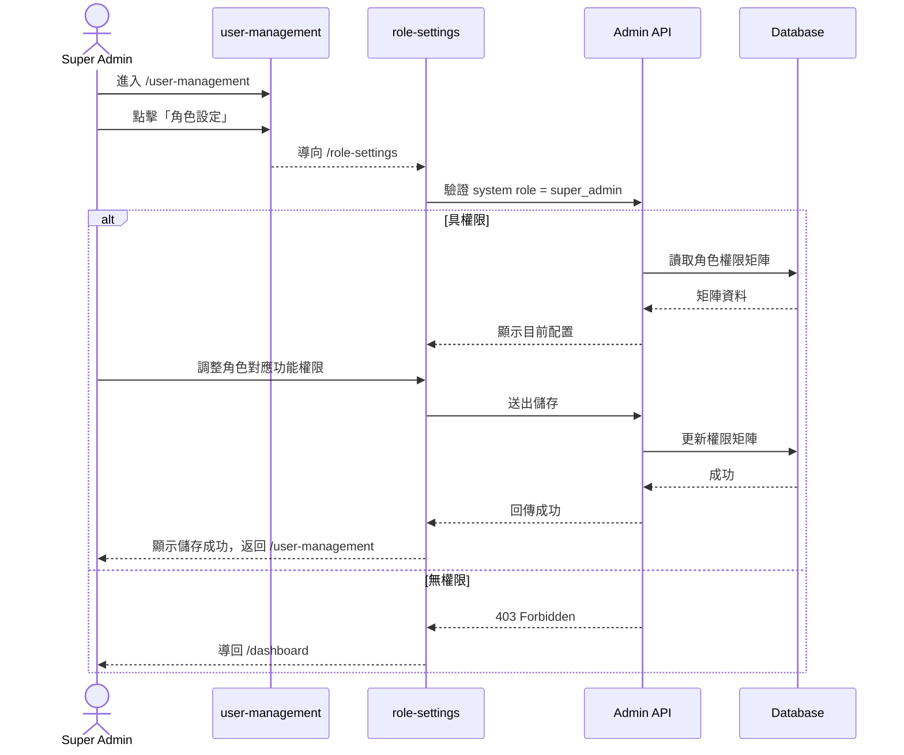
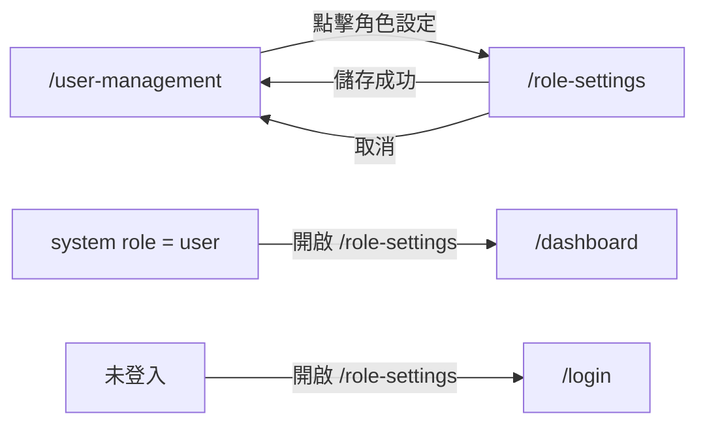

# 功能規格：Role & Permission Settings — 角色權限矩陣設定

**功能分支**：`007-role-settings`
**建立日期**：2026-04-16
**版本**：1.0.0
**狀態**：Draft
**需求來源**：IA v7 Spec 清單 #007 — 角色權限設定（`role-settings`）

## 規格常數

- `SYSTEM_ROLES = user | super_admin`
- `TASK_ROLES = project_leader | reviewer | annotator`
- `MOBILE_BP = 767px`
- `RWD_VIEWPORTS = 375px / 768px / 1440px`

## Process Flow

| 步驟 | 角色 | 動作 | 系統回應 |
|------|------|------|---------|
| 1 | `super_admin` | 從 `/user-management` 進入 `/role-settings` | 載入角色權限矩陣 |
| 2 | `super_admin` | 調整角色權限 | 驗證後更新權限配置 |
| 3 | `super_admin` | 儲存設定 | 顯示成功訊息並返回 `/user-management` |
| 4 | 非 `super_admin` | 嘗試存取 `/role-settings` | 拒絕存取並導回 `/dashboard` |

---

## 使用者情境與測試 *(必填)*

### User Story 1 — 檢視角色權限矩陣（優先級：P1）

Super Admin 可在角色設定頁看到完整角色矩陣，清楚區分 system role 與 task role 的職責邊界。

**此優先級原因**：權限矩陣是管理操作的基準，未可視化則無法安全維護。  
**獨立測試方式**：以 `super_admin` 進入 `/role-settings`，驗證矩陣內容包含 system/task 兩類角色。

**驗收情境**：

1. **Given** `system role = super_admin`，**When** 進入 `/role-settings`，**Then** 顯示角色權限矩陣。
2. **Given** 位於 `/role-settings`，**When** 檢視角色類別，**Then** 能區分 system role（`user` / `super_admin`）與 task role（`project_leader` / `reviewer` / `annotator`）。
3. **Given** 位於 `/role-settings`，**When** 切換語言，**Then** 權限項目標題與說明文字即時更新。

**介面定義（需與 IA 語意一致）**：

- 區塊 A：`角色權限矩陣`
  - 必要元素：
    - System Roles 區塊（`user`、`super_admin`）
    - Task Roles 區塊（`project_leader`、`reviewer`、`annotator`）
    - 權限項目清單（依模組/操作分類）
- 區塊 B：`頁面操作`
  - 必要元素：
    - `儲存` 按鈕
    - `取消` 按鈕
    - `返回使用者管理` 入口

**行為規則**：

- 頁面需明確標示 system role 與 task role 為兩層授權模型，不可混為同一層。
- 權限矩陣中的角色名稱需與 IA 命名一致。
- 變更前後需可辨識哪些權限被修改（例如 dirty state 提示）。

---

### User Story 2 — 維護角色權限配置（優先級：P1）

Super Admin 可調整角色權限後儲存，並讓新配置成為平台後續授權判斷基準。

**此優先級原因**：若無可維護的權限設定，系統無法隨組織需求調整。  
**獨立測試方式**：在矩陣中修改任一權限，儲存後重整頁面確認設定持久化。

**驗收情境**：

1. **Given** `super_admin` 在 `/role-settings`，**When** 調整角色權限並儲存，**Then** 顯示儲存成功且設定持久化。
2. **Given** 已修改但未儲存，**When** 點擊取消，**Then** 放棄修改並恢復最後一次已儲存狀態。
3. **Given** 權限配置儲存成功，**When** 返回 `/user-management`，**Then** 可正常繼續管理使用者。

**行為規則**：

- 儲存成功後需提供明確回饋（toast 或頁內訊息）。
- 取消操作不得覆蓋既有已儲存設定。
- 配置異常或儲存失敗時需顯示可理解錯誤，不可默默失敗。

---

### User Story 3 — 權限守門與安全邊界（優先級：P1）

只有 Super Admin 可維護角色設定；一般使用者不可查看或修改矩陣內容。

**此優先級原因**：權限矩陣屬最高風險管理配置，必須受到最嚴格角色控管。  
**獨立測試方式**：以 `user`、未登入狀態嘗試直連 `/role-settings`，驗證阻擋與導頁邏輯。

**驗收情境**：

1. **Given** `system role = user`，**When** 直接進入 `/role-settings`，**Then** 系統拒絕存取並導回 `/dashboard`。
2. **Given** 未登入，**When** 進入 `/role-settings`，**Then** 系統導向 `/login`。
3. **Given** `super_admin`，**When** 從 `/user-management` 進入 `/role-settings`，**Then** 顯示可編輯權限矩陣。

**行為規則**：

- `/role-settings` 必須有 RoleGuard，僅允許 `super_admin`。
- 無權限使用者不得讀取權限矩陣資料 API 回應。
- 頁面入口與保存操作都必須在服務端再次驗證角色，不能只靠前端控制。

---

### 邊界情況

- 權限矩陣載入失敗：顯示錯誤狀態與重試入口，不顯示不完整配置。
- 同時多人編輯矩陣：後儲存者需收到衝突提示或版本不一致提示，避免靜默覆蓋。
- 儲存內容不合法：拒絕儲存並指出哪個角色/權限組合有問題。
- 行動版矩陣欄位過多：需可橫向捲動或分段呈現，避免欄位截斷不可讀。

---

## 需求規格 *(必填)*

### 功能需求

- **FR-001**：系統必須提供 `/role-settings` 角色權限矩陣設定頁。
- **FR-002**：只有 `super_admin` 可以存取與編輯 `/role-settings`。
- **FR-003**：頁面必須顯示 system roles（`user`、`super_admin`）與 task roles（`project_leader`、`reviewer`、`annotator`）。
- **FR-004**：系統必須允許 `super_admin` 調整角色權限並儲存。
- **FR-005**：系統必須支援取消未儲存變更並回復已儲存版本。
- **FR-006**：`/role-settings` 必須可由 `/user-management` 進入，儲存成功後可返回 `/user-management`。
- **FR-007**：無權限存取 `/role-settings` 時，系統必須拒絕存取並導向安全頁（未登入→`/login`，一般使用者→`/dashboard`）。
- **FR-008**：系統必須在服務端驗證角色權限，避免僅前端控管。
- **FR-009**：頁面必須支援 `RWD_VIEWPORTS`，在 `<= MOBILE_BP` 時仍可檢視與編輯矩陣。

### User Flow & Navigation

| From | Trigger | To |
|------|---------|-----|
| `/user-management` | 點擊「角色設定」 | `/role-settings` |
| `/role-settings` | 儲存成功 | `/user-management` |
| `/role-settings` | 取消編輯 | `/user-management` |
| 任何頁面 | `user` 直接造訪 `/role-settings` | `/dashboard` |
| 任何頁面 | 未登入造訪 `/role-settings` | `/login` |

**Entry points**：`/user-management` 的「角色設定」入口。  
**Exit points**：`/user-management`。

### 關鍵實體

- **RolePermissionMatrix**：角色與功能權限對照表。核心維度：`role_type`（system/task）、`role_key`、`permission_key`、`allowed`。
- **SystemRole**：系統角色，允許值 `user`、`super_admin`。
- **TaskRole**：任務角色，允許值 `project_leader`、`reviewer`、`annotator`。

---

## 規格相依性 *(本功能依賴其他規格，或被其他規格依賴時填寫)*

### 上游（本規格依賴的規格）

| 規格編號 | 功能 | 本規格需要的內容 |
|---------|------|----------------|
| 001 | Login — Email / Password | 已登入狀態與路由守門基礎 |
| 006 | User Management | `user-management` 到 `role-settings` 的入口與返回脈絡 |

### 下游（依賴本規格的規格）

| 規格編號 | 功能 | 依賴本規格的內容 |
|---------|------|----------------|
| — | — | — |

---

## 成功標準 *(必填)*

- **SC-001**：`super_admin` 可從 `/user-management` 成功進入 `/role-settings` 並載入矩陣。
- **SC-002**：角色矩陣可清楚區分 system roles 與 task roles，命名與 IA 一致。
- **SC-003**：修改後儲存成功，重整頁面後仍維持最新設定。
- **SC-004**：取消未儲存變更後，矩陣回復至最後已儲存狀態。
- **SC-005**：`user` 與未登入使用者無法存取角色設定內容。
- **SC-006**：頁面在 `RWD_VIEWPORTS` 下可完成主要操作且無內容重疊。

---

## Changelog

| 版本 | 日期 | 變更摘要 |
|------|------|---------|
| 1.0.0 | 2026-04-16 | 初版建立：依 IA v7 新增 `role-settings` 規格（角色矩陣、儲存/取消、權限守門與導覽） |
