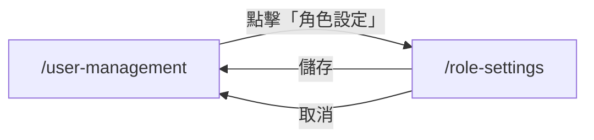

# 功能規格：角色權限設定

**功能分支**：`007-role-settings`
**建立日期**：2026-04-05
**狀態**：Clarified
**需求來源**：IA v7 Spec 清單 #007 — 角色權限設定

## 背景說明

此頁面管理的是頁面層級的存取清單（Page Access Control）；不影響 JWT 中的 `role` 欄位，也不影響 `task_membership` 的任務角色決策。兩者為獨立層次。

### 關鍵實體

- **RolePermission（角色權限）**：儲存每個角色對各頁面的存取設定。關鍵屬性：
  - `role`：角色識別（系統角色如 `user`、`super_admin`，或任務角色如 `project_leader`、`reviewer`、`annotator`）
  - `page`：頁面路由（如 `/task-list`、`/user-management`）
  - `allowed_actions`：允許的操作清單（陣列，如 `["read", "write", "delete"]`）

---

## 使用者情境與測試 *(必填)*

### User Story 1 — 查看各角色的功能存取範圍（優先級：P1）

Super Admin 在 `/role-settings` 查看平台所有角色（系統角色與任務角色）的功能存取範圍定義，了解各角色可操作的頁面與功能。

**此優先級原因**：角色權限的可視性是系統管理的基礎，Super Admin 需要能確認當前權限設定是否符合預期。

**獨立測試方式**：以 super_admin 登入進入 `/role-settings`，確認所有角色的權限範圍均正確顯示。

**驗收情境**：

1. **Given** Super Admin 在 `/role-settings`，**When** 頁面載入，**Then** 顯示系統角色（`user`、`super_admin`）與任務角色（`project_leader`、`reviewer`、`annotator`）的功能存取範圍。
2. **Given** Super Admin 在 `/role-settings`，**When** 查看任一角色，**Then** 清楚列出該角色可存取的頁面清單與可執行的操作。

---

### User Story 2 — 調整角色功能存取範圍（優先級：P2）

Super Admin 可在 `/role-settings` 調整各角色的功能存取範圍，儲存後立即生效。

**此優先級原因**：隨著系統演進，角色權限可能需要微調；提供管理介面比修改程式碼更安全且彈性。

**獨立測試方式**：調整某角色的存取範圍後儲存，驗證對應角色的使用者在下次請求時反映新的權限設定。

**驗收情境**：

1. **Given** Super Admin 在 `/role-settings`，**When** 修改某角色的存取範圍並儲存，**Then** 顯示「儲存成功」，設定立即生效。
2. **Given** Super Admin 在 `/role-settings`，**When** 點擊「取消」，**Then** 放棄未儲存的修改並返回 `/user-management`。

---

### 邊界情況

- Super Admin 移除自己角色的管理頁存取權限時？→ 系統拒絕並顯示「無法移除 super_admin 對系統管理模組的存取權」。
- 管理員修改角色設定後，已登入使用者的現有 JWT 不立即失效；新設定在使用者下次登入（取得新 JWT）後生效。

---

## 需求規格 *(必填)*

### 功能需求

- **FR-001**：只有 `super_admin` 可存取 `/role-settings`；其他角色存取導向 `/dashboard`。
- **FR-002**：頁面必須顯示所有角色的功能存取範圍，分為系統角色（`user`、`super_admin`）與任務角色（`project_leader`、`reviewer`、`annotator`）兩組。`role = null`（待指派狀態）無功能存取範圍，不列於設定項目中。
- **FR-003**：角色存取範圍儲存於 `role_permissions` 資料表（動態設定）；Super Admin 調整後立即生效，現有 JWT 不受影響直至過期，新請求依更新後的設定驗證。
- **FR-004**：系統必須防止 `super_admin` 失去對系統管理模組（`/user-management`、`/role-settings`）的存取權。

### User Flow & Navigation

| From | Trigger | To |
|------|---------|-----|
| `/user-management` | 點擊「角色設定」 | `/role-settings` |
| `/role-settings` | 儲存 / 取消 | `/user-management` |

**Entry points**：`/user-management` → 「角色設定」按鈕。
**Exit points**：儲存或取消均返回 `/user-management`。

---

## 成功標準 *(必填)*

- **SC-001**：非 `super_admin` 角色存取 `/role-settings` 回傳 HTTP 403 或導向 `/dashboard`。
- **SC-002**：角色存取範圍調整後立即生效，不需重新部署。
- **SC-003**：系統在任何情況下均保護 `super_admin` 對系統管理模組的存取權不被移除。
