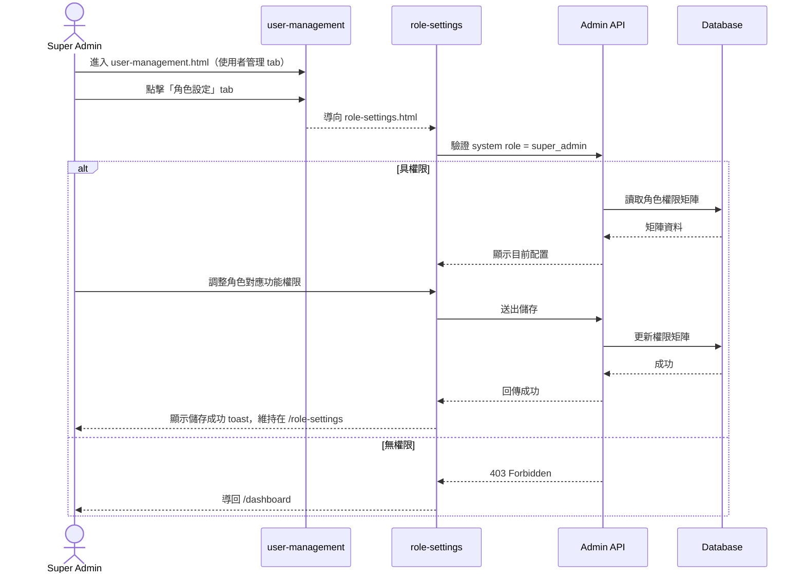
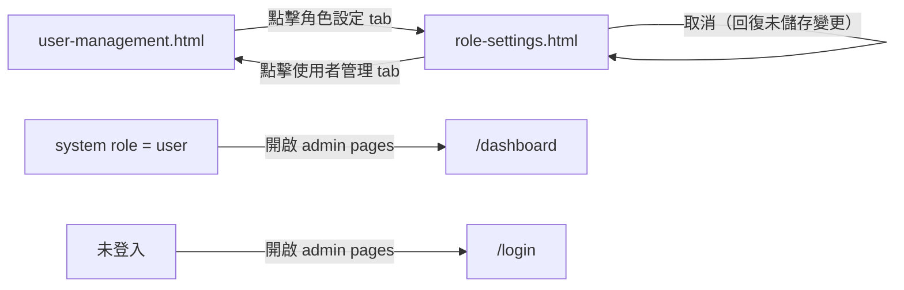

# 功能規格：Role & Permission Settings — 角色權限矩陣設定
---
功能分支: feat/admin/007-role-settings
建立日期: 2026-04-16
版本: 1.1.4
狀態: Draft
---

**需求來源**: IA v7 Spec 清單 #007 — 角色權限設定（`role-settings`）

## 輸入與生成規則

**輸入描述**：本規格需定義 Role & Permission Settings 的系統管理流程、權限守門、列表/矩陣互動、審計與 RWD 行為。

**產生規格時必須遵守**：

1. 先確認本規格範圍與需求來源一致：IA v7 Spec 清單 #007 — 角色權限設定（role-settings）。
2. 若新增或改動角色權限、導頁、資料欄位、錯誤狀態、i18n、可存取屬性或響應式邊界，必須同步檢查使用者情境、功能需求、成功標準與規格相依性。
3. 若需求描述缺少角色、狀態、資料來源、權限、錯誤處理、導頁目標或量化門檻，需以待釐清標記記錄具體問題，不得自行假設。
4. 規格應描述使用者可觀察行為、業務規則與驗收條件；避免描述框架、檔案結構、API 實作或資料庫實作，除非該內容本身是已定義的產品契約。
5. 本規格若與 prototype、IA 或上游規格不一致，必須明確記錄差異、更新相依性，並新增 changelog。

**已釐清事項**：

- 本版以既有需求來源與本文件中的 流程圖、使用者情境、功能需求、成功標準 作為 scope baseline。
- 跨頁或跨模組共用行為需透過「規格相依性」追蹤，不在本文件中隱含建立未列出的依賴。
- 若後續新增實作層契約，需先確認是否構成行為變更；若是，必須依 SDD 流程更新 spec。

## 釐清紀錄

### 2026-05-22 釐清會話

- 問：哪些 `super_admin` 權限不得被關閉？ → 答：`super_admin` 的所有 `admin.*` 權限必須保持啟用。
- 問：角色權限審計紀錄需保留多久？ → 答：至少保留 1 年。
- 問：同一使用者在同一任務具有多個 task role 時，權限如何判斷？ → 答：任務頁面使用權限聯集，但 annotation workspace 動作必須依選定的 active task role 判斷。
- 問：儲存失敗後，未儲存的矩陣修改如何處理？ → 答：一般儲存失敗保留未儲存修改；版本衝突需重新載入最新設定。
- 問：手機版編輯權限矩陣的主要互動模式為何？ → 答：依角色類型或模組分段呈現；手機版主要編輯流程不得依賴橫向捲動。

## 規格常數

- `SYSTEM_ROLES = user | super_admin`
- `TASK_ROLES = project_leader | reviewer | annotator`
- `PERMISSION_KEYS_SOURCE = backend_whitelist`
- `MOBILE_BP = 767px`
- `RWD_VIEWPORTS = 375px / 768px / 1440px`

## 流程圖

```mermaid
sequenceDiagram
    actor SA as Super Admin
    participant UM as user-management
    participant RS as role-settings
    participant API as Admin API
    participant DB as Database

    SA->>UM: 進入 user-management.html（使用者管理 tab）
    SA->>UM: 點擊「角色設定」tab
    UM-->>RS: 導向 role-settings.html
    RS->>API: 驗證 system role = super_admin

    alt 具權限
        API->>DB: 讀取角色權限矩陣
        DB-->>API: 矩陣資料
        API-->>RS: 顯示目前配置
        SA->>RS: 調整角色對應功能權限
        RS->>API: 送出儲存
        API->>DB: 更新權限矩陣
        DB-->>API: 成功
        API-->>RS: 回傳成功
        RS-->>SA: 顯示儲存成功 toast，維持在 /role-settings
    else 無權限
        API-->>RS: 403 Forbidden
        RS-->>SA: 導回 /dashboard
    end
```

| 步驟 | 角色 | 動作 | 系統回應 |
|------|------|------|---------|
| 1 | `super_admin` | 在 `user-management.html` 點擊「角色設定」tab | 導向 `role-settings.html`，載入角色權限矩陣 |
| 2 | `super_admin` | 調整角色權限 | 驗證後更新權限配置 |
| 3 | `super_admin` | 儲存設定 | 顯示儲存成功 toast，維持在角色設定 tab |
| 4 | 非 `super_admin` | 嘗試存取 `user-management.html` 或 `role-settings.html` | 拒絕存取並導回 `/dashboard` |

---

## 使用者情境與測試 *(必填)*

### 使用者故事 1 — 檢視角色權限矩陣（優先級：P1）

Super Admin 可在角色設定頁看到完整角色矩陣，清楚區分 system role 與 task role 的職責邊界。

**此優先級原因**：權限矩陣是管理操作的基準，未可視化則無法安全維護。
**獨立測試方式**：以 `super_admin` 進入 `/role-settings`，驗證矩陣內容包含 system/task 兩類角色。

**驗收情境**：

1. **Given** `system role = super_admin`，**When** 在 `user-management.html` 點擊「角色設定」tab，**Then** 導向 `role-settings.html` 並顯示角色權限矩陣。
2. **Given** 位於 `/role-settings`，**When** 檢視角色類別，**Then** 能區分 system role（`user` / `super_admin`）與 task role（`project_leader` / `reviewer` / `annotator`）。
3. **Given** 位於 `/role-settings`，**When** 切換語言，**Then** 權限項目標題與說明文字即時更新。

**介面定義（需與 IA 語意一致）**：

- 區塊 A：`角色權限矩陣`
  - 必要元素：
    - System Roles 區塊（`user`、`super_admin`）
    - Task Roles 區塊（`project_leader`、`reviewer`、`annotator`）
    - 權限項目清單（依模組/操作分類）
- 區塊 B：`頁面操作`
  - 必要元素：
    - `編輯` 按鈕（閱覽模式下顯示，點擊後進入編輯模式）
    - `操作紀錄` 按鈕（矩陣區塊右上角，位於 `編輯` 按鈕右側，任何模式下皆顯示，icon-only，點擊後開啟操作紀錄抽屜）
    - `儲存` 按鈕（編輯模式下顯示）
    - `取消` 按鈕（編輯模式下顯示）
- 區塊 C：`操作紀錄抽屜`
  - 必要元素：
    - 標題：`操作紀錄` / 副標題：`角色權限矩陣`
    - 每筆紀錄：操作時間、操作者名稱、變更前後 diff（`role · permission_key  OFF → ON` 格式）
    - 無紀錄時顯示空狀態提示
    - 關閉按鈕（回到主頁面，不影響矩陣狀態）
- 區塊 D：`版本衝突 Banner`
  - 觸發：儲存時偵測到版本衝突（API 回傳衝突錯誤）
  - 必要元素：
    - 錯誤圖示
    - 標題：`版本衝突：設定已被其他管理員修改`
    - 說明：`請重新載入最新設定後再進行編輯，以避免覆蓋他人變更`
    - `重新載入` 按鈕（重新載入最新矩陣資料，清除衝突狀態）
  - 預設為隱藏；版本衝突發生時顯示於頁面頂部
- 區塊 E：`取消確認對話框`
  - 觸發：編輯模式下有未儲存變更時，點擊「取消」按鈕
  - 必要元素：
    - 警告圖示
    - 標題：`有未儲存的變更`
    - 說明：`確定要放棄目前的修改？取消後所有變更將遺失。`
    - `繼續編輯` 按鈕（關閉對話框，保留 dirty state 繼續編輯）
    - `放棄變更` 按鈕（確認放棄，回到閱覽模式並恢復上次儲存狀態）
  - 無未儲存變更時直接取消，不顯示此對話框
- 區塊 F：`Toast 通知`
  - 觸發：儲存成功或一般儲存失敗
  - 必要元素：
    - 成功／錯誤圖示（依結果切換）
    - 主訊息（`角色權限設定已儲存` 或錯誤說明）
    - 副訊息（可選，補充說明）
    - 手動關閉按鈕
  - 顯示於頁面右下角；4 秒後自動消失，或使用者手動關閉
  - 儲存成功與版本衝突各觸發不同訊息文案

**行為規則**：

- 頁面預設為閱覽模式，權限矩陣不可直接修改；點擊「編輯」按鈕後進入編輯模式，方可調整權限。
- 儲存成功或點擊「取消」後，頁面回到閱覽模式。
- 頁面需明確標示 system role 與 task role 為兩層授權模型，不可混為同一層。
- 權限矩陣中的角色名稱需與 IA 命名一致。
- `permission_key` 清單由後端白名單定義，前端僅可渲染與提交白名單內項目。
- 點擊「取消」時若有未儲存變更，系統顯示確認對話框，詢問是否放棄修改；確認後才真正放棄並回到閱覽模式。

---

### 使用者故事 2 — 維護角色權限配置（優先級：P1）

Super Admin 可調整角色權限後儲存，並讓新配置成為平台後續授權判斷基準。

**此優先級原因**：若無可維護的權限設定，系統無法隨組織需求調整。
**獨立測試方式**：在矩陣中修改任一權限，儲存後重整頁面確認設定持久化。

**驗收情境**：

1. **Given** `super_admin` 在 `/role-settings` 並已點擊「編輯」進入編輯模式，**When** 調整角色權限並儲存，**Then** 顯示儲存成功、設定持久化，且頁面回到閱覽模式。
2. **Given** 已修改但未儲存，**When** 點擊取消，**Then** 放棄修改並恢復最後一次已儲存狀態。
3. **Given** 權限配置儲存成功，**When** 點擊「使用者管理」tab，**Then** 導向 `user-management.html` 並可正常管理使用者。

**行為規則**：

- 儲存成功後需提供明確回饋（toast 或頁內訊息）。
- 取消操作需回復最後一次已儲存狀態，且維持在 `/role-settings` 頁面。
- 儲存時需帶 `version` 或 `etag` 進行樂觀鎖；若版本不一致必須拒絕儲存並提示重新載入最新設定。
- 配置異常或儲存失敗時需顯示可理解錯誤，不可默默失敗。
- 一般儲存失敗需保留未儲存修改與 dirty state；版本衝突則需提示重新載入最新設定，不得沿用過期版本繼續儲存。

---

### 使用者故事 3 — 權限守門與安全邊界（優先級：P1）

只有 Super Admin 可維護角色設定；一般使用者不可查看或修改矩陣內容。

**此優先級原因**：權限矩陣屬最高風險管理配置，必須受到最嚴格角色控管。
**獨立測試方式**：以 `user`、未登入狀態嘗試直連 `/role-settings`，驗證阻擋與導頁邏輯。

**驗收情境**：

1. **Given** `system role = user`，**When** 直接開啟 `user-management.html` 或 `role-settings.html`，**Then** 系統拒絕存取並導回 `/dashboard`。
2. **Given** 未登入，**When** 開啟 `user-management.html` 或 `role-settings.html`，**Then** 系統導向 `/login`。
3. **Given** `super_admin`，**When** 點擊「角色設定」tab，**Then** 顯示可編輯權限矩陣。

**行為規則**：

- `user-management.html` 與 `role-settings.html` 必須都有 RoleGuard，僅允許 `super_admin`；兩頁同屬 admin 模組且 L0 active 皆為「系統管理」。
- 無權限使用者不得讀取權限矩陣資料 API 回應。
- 頁面入口與保存操作都必須在服務端再次驗證角色，不能只靠前端控制。
- `super_admin` 的所有 `admin.*` 權限必須保持啟用，不得在角色權限矩陣中關閉。
- 系統初次建立的超級管理員（seeder 建置帳號）永遠不可被移除（包含刪除、停用、降級）。

---

### 邊界情況

- 權限矩陣載入失敗：顯示錯誤狀態與重試入口，不顯示不完整配置。
- 同時多人編輯矩陣：採樂觀鎖（`version`/`etag`）；版本不一致必須拒絕儲存並提示重載，不可靜默覆蓋。
- 儲存內容不合法：拒絕儲存並指出哪個角色/權限組合有問題，且保留未儲存修改供使用者修正。
- 行動版矩陣欄位過多：需依角色類型或模組分段呈現，主要檢視與編輯流程不得依賴橫向捲動完成；若保留輔助橫向捲動，不得造成欄位截斷不可讀。

---

## 需求規格 *(必填)*

### 權限鍵白名單（V1）

> `permission_key` 由後端維護白名單（`PERMISSION_KEYS_SOURCE`），前端僅渲染與提交下列鍵值。

| 模組 | permission_key | 說明 |
|------|----------------|------|
| account | `account.profile.view` | 檢視個人設定頁 |
| account | `account.profile.edit` | 編輯個人資料與密碼 |
| dashboard | `dashboard.view` | 檢視儀表板 |
| task-management | `task.list.view` | 檢視任務列表 |
| task-management | `task.create` | 建立新任務 |
| task-management | `task.detail.view` | 檢視任務詳情 |
| task-management | `task.members.manage` | 管理任務成員與任務角色 |
| annotation | `annotation.workspace.annotate` | 以 annotator 模式執行標記 |
| annotation | `annotation.workspace.review` | 以 reviewer 模式執行審核 |
| dataset | `dataset.stats.view` | 檢視資料集統計 |
| dataset | `dataset.quality.view` | 檢視資料品質頁 |
| dataset | `dataset.export` | 下載/匯出資料結果 |
| admin | `admin.user_management.view` | 進入使用者管理頁 |
| admin | `admin.user_management.manage` | 新增/編輯/停用使用者、指派 system role |
| admin | `admin.role_settings.view` | 進入角色權限設定頁 |
| admin | `admin.role_settings.manage` | 編輯並儲存角色權限矩陣 |

### 角色 × 權限預設矩陣（V1）

#### 系統角色（平台層級）

| permission_key | `user` | `super_admin` |
|----------------|--------|---------------|
| `account.profile.view` | ✅ | ✅ |
| `account.profile.edit` | ✅ | ✅ |
| `dashboard.view` | ✅ | ✅ |
| `task.list.view` | ✅ | ✅ |
| `task.create` | ✅ | ✅ |
| `task.detail.view` | ⛔（需 task role） | ⛔（需 task role） |
| `task.members.manage` | ⛔（需 task role） | ⛔（需 task role） |
| `annotation.workspace.annotate` | ⛔（需 task role） | ⛔（需 task role） |
| `annotation.workspace.review` | ⛔（需 task role） | ⛔（需 task role） |
| `dataset.stats.view` | ⛔（需 task role） | ⛔（需 task role） |
| `dataset.quality.view` | ⛔（需 task role） | ⛔（需 task role） |
| `dataset.export` | ⛔（需 task role） | ⛔（需 task role） |
| `admin.user_management.view` | ❌ | ✅ |
| `admin.user_management.manage` | ❌ | ✅ |
| `admin.role_settings.view` | ❌ | ✅ |
| `admin.role_settings.manage` | ❌ | ✅ |

#### 任務角色（任務層級）

| permission_key | `project_leader` | `reviewer` | `annotator` |
|----------------|------------------|------------|-------------|
| `task.detail.view` | ✅ | ✅（唯讀） | ❌ |
| `task.members.manage` | ✅ | ❌ | ❌ |
| `annotation.workspace.annotate` | ❌ | ❌ | ✅ |
| `annotation.workspace.review` | ❌ | ✅ | ❌ |
| `dataset.stats.view` | ✅ | ✅ | ❌ |
| `dataset.quality.view` | ✅ | ✅ | ❌ |
| `dataset.export` | ✅ | ❌ | ❌ |

#### 授權判斷規則

- 平台頁面先檢查 system role；任務頁面再依 `task_membership(task_id, user_id, task_role)` 檢查 task role。
- system role 與 task role 為雙層模型，不可互相推導或繼承。
- 同一使用者可在同一任務同時具多個 task role；任務頁面權限以該任務下「可用權限聯集」判斷。
- 進入 annotation workspace 時必須選定 active task role；workspace 內的標記或審核動作僅依 active task role 判斷，不因其他 task role 的權限聯集而放寬（例如 active role 為 `reviewer` 時不可執行 annotator 動作）。

### 功能需求

- **FR-001**：系統必須提供 `/role-settings` 角色權限矩陣設定頁。
- **FR-002**：只有 `super_admin` 可以存取與編輯 `/role-settings`。
- **FR-003**：頁面必須顯示 system roles（`user`、`super_admin`）與 task roles（`project_leader`、`reviewer`、`annotator`）。
- **FR-003a**：`permission_key` 清單必須由後端白名單提供，前端不得接受白名單外權限鍵。
- **FR-003b**：系統必須提供並顯示本規格「權限鍵白名單（V1）」中的全部 `permission_key`。
- **FR-003c**：系統必須支援本規格「角色 × 權限預設矩陣（V1）」作為初始值與回歸測試基準。
- **FR-003d**：`/role-settings` 預設為閱覽模式，權限矩陣僅可讀取，不可直接編輯；`super_admin` 須點擊「編輯」按鈕才能進入編輯模式。
- **FR-004**：系統必須允許 `super_admin` 點擊「編輯」進入編輯模式後調整角色權限並儲存；儲存成功後自動回到閱覽模式。
- **FR-005**：系統必須支援取消未儲存變更並回復已儲存版本；有未儲存變更時，點擊「取消」須先彈出確認對話框，確認放棄後才回到閱覽模式。
- **FR-005a**：取消未儲存變更後，系統必須維持在 `/role-settings`（不自動導頁）。
- **FR-005b**：儲存必須使用 `version` 或 `etag` 樂觀鎖驗證；版本不一致時必須拒絕並提示衝突。
- **FR-006**：角色設定必須由 `role-settings.html` 承載；`user-management.html` 與 `role-settings.html` 以 admin tabs 互相連結。儲存成功後維持在 `role-settings.html`，使用者可透過點擊「使用者管理」tab 返回 `user-management.html`。
- **FR-007**：無權限存取 `user-management.html` 或 `role-settings.html` 時，系統必須拒絕存取並導向安全頁（未登入→`/login`，一般使用者→`/dashboard`）。
- **FR-008**：系統必須在服務端驗證角色權限，避免僅前端控管。
- **FR-008a**：系統必須保護 `super_admin` 的所有 `admin.*` 權限，這些權限不可被配置為關閉。
- **FR-008b**：系統初次建立的超級管理員（seeder 建置帳號）永遠不可被移除（刪除/停用/降級）。
- **FR-009**：頁面必須支援 `RWD_VIEWPORTS`；在 `<= MOBILE_BP` 時需依角色類型或模組分段呈現，使用者可完整檢視與編輯矩陣，且主要操作不依賴橫向捲動。
- **FR-010**：角色權限儲存後，系統必須保留審計資訊（操作者、時間、變更前後 diff），且審計紀錄至少保留 1 年。
- **FR-010a**：`/role-settings` 頁面必須提供「操作紀錄」入口按鈕；點擊後開啟右側抽屜，列出所有歷史變更紀錄（時間、操作者、diff）；抽屜可隨時關閉，不影響矩陣編輯狀態。

### 使用者流程與導頁

```mermaid
flowchart LR
    um["user-management.html"] -->|點擊角色設定 tab| rs["role-settings.html"]
    rs -->|點擊使用者管理 tab| um
    rs -->|取消（回復未儲存變更）| rs
    userBlocked["system role = user"] -->|開啟 admin pages| dashboard["/dashboard"]
    guestBlocked["未登入"] -->|開啟 admin pages| login["/login"]
```

| From | Trigger | To |
|------|---------|-----|
| `user-management.html` | 點擊「角色設定」tab | `role-settings.html` |
| `role-settings.html` | 儲存成功 | `role-settings.html`（顯示 toast，留在同頁） |
| `role-settings.html` | 點擊「使用者管理」tab | `user-management.html` |
| `role-settings.html` | 取消編輯（回復未儲存變更） | `role-settings.html`（維持在同頁） |
| 任何頁面 | `user` 直接造訪 `user-management.html` 或 `role-settings.html` | `/dashboard` |
| 任何頁面 | 未登入造訪 `user-management.html` 或 `role-settings.html` | `/login` |

**Entry points**：`user-management.html` 的「角色設定」tab。
**Exit points**：`user-management.html`（admin tab 導航）。

### 關鍵實體

- **RolePermissionMatrix**：角色與功能權限對照表。核心維度：`role_type`（system/task）、`role_key`、`permission_key`、`allowed`。
- **RolePermissionVersion**：權限矩陣版本控制欄位（`version` 或 `etag`），用於儲存衝突檢測。
- **SystemRole**：系統角色，允許值 `user`、`super_admin`。
- **TaskRole**：任務角色，允許值 `project_leader`、`reviewer`、`annotator`。

---

## 規格相依性 *(本功能依賴其他規格，或被其他規格依賴時填寫)*

### 上游（本規格依賴的規格）

| 規格編號 | 功能 | 本規格需要的內容 |
|---------|------|----------------|
| 001 | Login — Email / Password | 已登入狀態與路由守門基礎 |
| 006 | User Management | `user-management.html` 與 `role-settings.html` 的 admin tab 導航脈絡 |

### 下游（依賴本規格的規格）

| 規格編號 | 功能 | 依賴本規格的內容 |
|---------|------|----------------|
| — | — | — |

---

## 成功標準 *(必填)*

- **SC-001**：`super_admin` 可在 `user-management.html` 點擊「角色設定」tab，導向 `role-settings.html` 並成功載入矩陣。
- **SC-002**：角色矩陣可清楚區分 system roles 與 task roles，命名與 IA 一致。
- **SC-003**：修改後儲存成功，重整頁面後仍維持最新設定。
- **SC-004**：取消未儲存變更後，矩陣回復至最後已儲存狀態，且維持在 `role-settings.html`。
- **SC-005**：`user` 與未登入使用者無法存取角色設定內容。
- **SC-006**：頁面在 `RWD_VIEWPORTS` 下可完整檢視矩陣且無內容重疊；`<= MOBILE_BP` 以分段呈現完成主要檢視與編輯操作，不依賴橫向捲動。
- **SC-007**：多人同時編輯時，版本衝突儲存會被拒絕並提示重新載入，不發生靜默覆蓋。
- **SC-008**：系統初次建立的超級管理員（seeder 建置帳號）無法被刪除、停用或降級。
- **SC-009**：`permission_key` 白名單與角色矩陣可完整載入、儲存、重整後一致，且白名單外 key 會被拒絕。
- **SC-010**：每次儲存可查得審計資訊（操作者、時間、變更 diff），且至少 1 年內的紀錄可供追蹤；`/role-settings` 頁面的「操作紀錄」抽屜可正確列出歷史紀錄，每筆包含時間、操作者、diff。

---

## 審查與驗收清單

### 內容品質

- [x] 規格聚焦使用者可觀察行為、業務規則與驗收條件。
- [x] 所有必填章節已完成；不適用的內容已明確排除或未納入本版範圍。
- [x] 無未解決的待釐清標記殘留。
- [x] 需求、驗收情境與成功標準皆可測試。

### Label Suite 合規性

- [x] 功能分支格式符合 `feat/[module]/NNN-feature`。
- [x] 已檢查本規格未要求跨 feature import；跨模組共用行為需透過 shared contract 或規格相依性追蹤。
- [x] 本規格不新增 task type 邏輯；若後續接觸任務行為，需回到 config-driven task architecture 檢查。
- [x] 已檢查 annotator-facing API / UI 不得暴露 test-set answer、ground-truth 或等價特權資料。
- [x] Prototype / IA / 上游規格 source of truth 已列於需求來源或規格相依性。
- [x] 上下游規格相依性已列出；若本規格改版，需檢查 downstream 影響。

### 執行狀態

- [x] 輸入描述已解析。
- [x] 角色、互動、資料狀態與限制已萃取。
- [x] 模糊點已釐清或明確排除於本版範圍。
- [x] 使用者情境已定義。
- [x] 功能需求已定義。
- [x] 關鍵實體或狀態模型已定義。
- [x] Review checklist 已通過。

---

## Changelog

| 版本 | 日期 | 變更摘要 |
|------|------|---------|
| 1.1.11 | 2026-05-22 | Spec gap 補齊：新增區塊 D（版本衝突 Banner）、區塊 E（取消確認對話框）、區塊 F（Toast 通知）至使用者故事 1 介面定義 |
| 1.1.10 | 2026-05-22 | Prototype 同步：操作紀錄按鈕移至「編輯」右側；修正 drawer 關閉按鈕（icon-only × SVG）與 badge 樣式（補齊 .badge base CSS） |
| 1.1.9 | 2026-05-22 | Prototype 同步：操作紀錄按鈕從頁面頂部移至矩陣區塊右上角（與「編輯」並排），改為 icon-only 樣式，與 user-management 一致 |
| 1.1.8 | 2026-05-22 | Prototype 同步：新增操作紀錄右側抽屜（頁面頂部按鈕入口、時間/操作者/diff 格式、儲存時自動記錄）；新增 FR-010a、更新介面定義區塊 B/C 與 SC-010 |
| 1.1.7 | 2026-05-22 | Prototype 同步：移除頂部「有未儲存的變更」banner，改以點擊「取消」時彈出確認對話框；更新 FR-005 與行為規則 |
| 1.1.6 | 2026-05-22 | Prototype 同步：新增閱覽／編輯模式切換，預設閱覽模式，點擊「編輯」才可修改，儲存或取消後回到閱覽模式；新增 FR-003d、更新 FR-004/005、介面定義區塊 B 與驗收情境同步更新 |
| 1.1.5 | 2026-05-22 | Clarify 決議回寫：`super_admin` 的所有 `admin.*` 權限不可關閉、審計紀錄至少保留 1 年、多 task role 採權限聯集但 annotation workspace 依 active task role、儲存失敗保留未儲存修改、手機版矩陣改以分段呈現；釐清紀錄改為中文 |
| 1.1.4 | 2026-05-21 | 補充輸入與產生規則、已釐清事項、審查清單與執行狀態；同步功能分支格式 |
| 1.1.3 | 2026-05-19 | 依最新 prototype 同步 admin tabs：`role-settings.html` 為獨立頁，與 `user-management.html` 透過 tabs 互相導覽 |
| 1.1.2 | 2026-05-19 | Prototype 同步：移除矩陣圖例（圖例）UI 區塊；符號說明改由欄位 tooltip 或 header 承接，spec 行為面不受影響 |
| 1.1.1 | 2026-04-17 | Prototype 同步：儲存成功後維持在 `/role-settings`（不自動跳轉），改為手動返回 `/user-management` |
| 1.1.0 | 2026-04-17 | 補齊 IA 對應的可實作權限定義：新增 permission key 白名單（V1）、角色×權限預設矩陣（V1）、授權判斷規則、FR/SC 可驗收條款與審計要求 |
| 1.0.1 | 2026-04-17 | Clarify 決議回寫：permission key 後端白名單、樂觀鎖衝突處理、取消留在頁內、`super_admin` 關鍵權限保護、seeder 超管不可移除、手機版改為至少可檢視 |
| 1.0.0 | 2026-04-16 | 初版建立：依 IA v7 新增 `role-settings` 規格（角色矩陣、儲存/取消、權限守門與導覽） |
