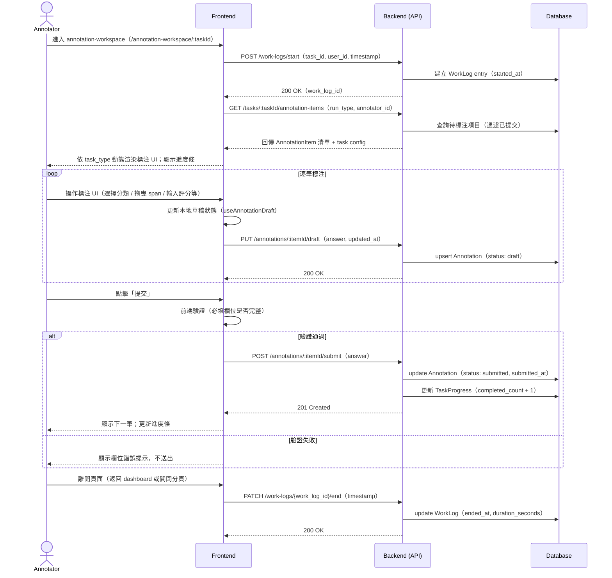
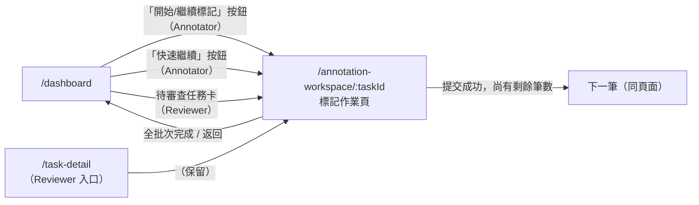

# 功能規格：標記作業頁（Annotation Workspace）

**功能分支**：`015-annotation-workspace`
**建立日期**：2026-04-05
**狀態**：Draft
**需求來源**：IA v7 Spec 清單 #026–031 — 標記作業（annotation-workspace，依任務類型拆分）

---

## Process Flow — 標記提交流程（含工時記錄）

| 步驟 | 角色 | 動作 | 系統回應 |
|------|------|------|---------|
| 1 | Annotator | 進入 `/annotation-workspace/:taskId` | 系統記錄 `work_log.started_at`，拉取待標注項目清單與 task config |
| 2 | System | 依 `task_type` 動態渲染標注 UI | 顯示第一筆待標注資料，右側呈現對應標注工具 |
| 3 | Annotator | 操作標注 UI 完成一筆資料 | 系統自動儲存草稿（`status: draft`）至後端 |
| 4 | Annotator | 點擊「提交」 | 前端驗證後送出；後端更新 `status: submitted`，進度條遞增 |
| 5 | Annotator | 離開頁面 | 系統記錄 `work_log.end_time`，計算本次工時 |

---

## 使用者情境與測試 *(必填)*

### User Story 1 — Annotator 完成一筆標注並提交（優先級：P1）

已登入且具有任務 `annotator` 角色的使用者進入 `annotation-workspace`，對一筆資料完成標注後提交，進度條遞增並自動移至下一筆待標注資料。

**此優先級原因**：這是整個平台最核心的操作流程，標注資料的產出直接取決於此 Story 能否正常運作。

**獨立測試方式**：建立一個 classification 任務並邀請標記員，以標記員帳號進入 workspace，完成標注後確認提交成功、進度條增加、自動跳至下一筆。

**驗收情境**：

1. **Given** 具有任務 `annotator` 角色的使用者在 `/annotation-workspace/:taskId`，**When** 頁面載入，**Then** 系統從 `/work-log/start` 記錄進入時間，頁面顯示當前筆待標注資料與對應 task_type 標注工具，進度條反映已完成數 / 總筆數。
2. **Given** Annotator 在標注界面完成選擇，**When** 點擊「提交」按鈕，**Then** 系統呼叫 `POST /annotations/:itemId/submit`，Annotation 狀態更新為 `submitted`，進度條遞增一筆，頁面自動顯示下一筆待標注資料。
3. **Given** Annotator 完成所有分配資料，**When** 提交最後一筆，**Then** 頁面顯示「本批次標注已全數完成」提示，並提供「返回儀表板」按鈕。

---

### User Story 2 — 系統依 task_type 動態渲染標注 UI（優先級：P1）

標注工具介面依據任務的 `task_type` config 動態渲染，不同任務類型呈現完全不同的標注元件，無任何任務類型邏輯硬編碼於前端。

**此優先級原因**：Generalization-First 原則的核心實踐。系統若無法依 config 動態渲染 UI，所有任務類型支援均失效。

**獨立測試方式**：分別建立 `classification`、`scoring`、`ner`、`sentence_pair`、`relation` 五種類型任務，以 Annotator 身份進入各任務的 workspace，確認每種任務渲染出對應的標注元件。

**驗收情境**：

1. **Given** 任務的 `task.type` 為 `classification`，**When** Annotator 進入 workspace，**Then** 右側標注工具區渲染分類選項按鈕（依 `annotation.labels` config 動態生成標籤清單；若 `allow_multiple: true` 則允許多選）。
2. **Given** 任務的 `task.type` 為 `ner`，**When** Annotator 進入 workspace，**Then** 左側顯示原始文字可選取 span，右側顯示依 `annotation.entity_types` config 生成的實體類型選色板；選取文字後自動彈出類型選擇選單。
3. **Given** 任務的 `task.type` 為 `scoring`，**When** Annotator 進入 workspace，**Then** 右側渲染依 `annotation.widget_type` config 決定的評分元件（`slider` / `radio` / `number_input`），範圍依 `min`、`max`、`step` config 設定。

---

### User Story 3 — Reviewer 審查標注結果（優先級：P2）

具有任務 `reviewer` 角色的使用者進入 `annotation-workspace` 審查模式，可查看標記員的標注答案，進行通過、退回或直接修改。

**此優先級原因**：審查功能是品質保證流程的關鍵環節，但不影響標注資料的基本產出，故為 P2。

**獨立測試方式**：以 reviewer 帳號進入 workspace，確認介面顯示標記員答案、通過 / 退回按鈕正常，且操作後狀態正確更新。

**驗收情境**：

1. **Given** 具有任務 `reviewer` 角色的使用者進入 workspace，**When** 頁面載入，**Then** 系統顯示審查模式介面：左側顯示待審查資料，右側同時顯示標記員的標注答案（唯讀）與 Reviewer 操作區（通過 / 退回 / 修改）。
2. **Given** Reviewer 在審查模式查看一筆標注，**When** 點擊「退回」並填寫退回原因，**Then** 系統更新 Annotation 狀態為 `rejected`，並通知對應標記員重新標注。
3. **Given** Reviewer 在審查模式查看一筆標注，**When** 直接修改標注答案並點擊「確認」，**Then** 系統以 Reviewer 身份建立新版本的 Annotation 紀錄，原始標記員答案保留於標記歷程（History）。

---

### 邊界情況

- **所有項目已完成：** 進入 workspace 時若無待標注項目，頁面顯示「本批次標注已全數完成」空狀態，不顯示標注工具，提供「返回儀表板」按鈕。
- **網路中斷時的草稿保存：** 若 API 呼叫失敗，前端將草稿保存至 `localStorage`，顯示「網路暫時中斷，草稿已儲存至本地，恢復連線後將自動同步」提示；恢復連線後自動重試 PUT draft 請求。
- **重複提交防護：** 提交按鈕在第一次點擊後立即 disable，後端同時以 `(item_id, annotator_id, run_type)` 唯一約束防止重複寫入，回傳 `409 Conflict` 時前端顯示「此項目已提交」並移往下一筆。
- **說明強制顯示：** 若 Project Leader 啟用「開始標記前強制顯示說明」，Annotator 每次進入任務時先看到說明 modal，確認後才進入標注界面。
- **Annotator 嘗試進入 task-detail：** 任務角色為 `annotator` 的使用者若直接訪問 `/task-detail`，RoleGuard 攔截並重導至 `/dashboard`。

---

## 需求規格 *(必填)*

### 功能需求

- **FR-001**：系統 MUST 依據任務的 `task.type` config 動態渲染右側標注工具；標注元件（分類按鈕、滑桿、NER span 選取器、關係三元組編輯器等）均從 config 讀取，不得在前端硬編碼任何任務類型判斷邏輯。
- **FR-002**：系統 MUST 在 Annotator 進入頁面時呼叫 `POST /work-logs/start`，在離開頁面時呼叫 `PATCH /work-logs/{work_log_id}/end`，記錄工時。
- **FR-003**：系統 MUST 於 Annotator 每次操作後（idle 逾 2 秒）自動呼叫 `PUT /annotations/:itemId/draft` 儲存草稿，Annotation `status` 設為 `draft`。
- **FR-004**：系統 MUST 在提交前進行前端驗證：classification / sentence_pair(cls) 必須已選擇至少一個標籤；scoring / sentence_pair(scoring) 必須已輸入評分；ner 允許零實體提交（空標注合法）；relation 至少需有一個完整 Triple（subject + relation + object）。
- **FR-005**：提交驗證通過後，系統 MUST 呼叫 `POST /annotations/:itemId/submit`，後端以 `(item_id, annotator_id, run_type)` 唯一約束防止重複提交，提交按鈕在請求進行中 MUST 設為 disabled。
- **FR-006**：頁面頂部 MUST 顯示進度條，即時反映「已提交筆數 / 本批次分配總筆數」。
- **FR-007**：系統 MUST 支援鍵盤快捷鍵操作：`Enter` 或 `Space` 提交當前筆；`←` / `→` 切換至上一筆 / 下一筆（僅限草稿狀態）；classification 任務中數字鍵 `1`–`9` 快速選擇對應標籤。
- **FR-008**：Reviewer 視角的 workspace MUST 顯示標記員的原始答案（唯讀呈現），並在右側提供「通過」、「退回（附原因）」、「直接修改」三種審查操作。
- **FR-009**：每筆資料的標記歷程（History）MUST 記錄所有版本（who、when、what），供 Reviewer 追溯。
- **FR-010**：只有任務角色為 `annotator` 或 `reviewer` 的使用者 MUST 能進入 `/annotation-workspace/:taskId`，透過 `useTaskRole(taskId)` hook 確認任務角色，無任務成員資格者重導至 `/dashboard`；`super_admin` 以 `reviewer` 相同視角（唯讀）進入。
- **FR-011**：若 Project Leader 在任務設定中啟用「開始標記前強制顯示說明」，系統 MUST 在 Annotator 進入 workspace 時先顯示說明 modal，點擊「確認」後才進入標注介面。

### User Flow & Navigation

| From | Trigger | To |
|------|---------|-----|
| `/dashboard`（Annotator） | 點擊「開始 / 繼續標記」 | `/annotation-workspace/:taskId` |
| `/dashboard`（Annotator） | 點擊「快速繼續」 | `/annotation-workspace/:taskId` |
| `/dashboard`（Reviewer） | 點擊待審查任務卡 | `/annotation-workspace/:taskId` |
| `/annotation-workspace/:taskId` | 全批次完成 / 點擊「返回儀表板」 | `/dashboard` |
| `/annotation-workspace/:taskId` | 提交當前筆（尚有剩餘） | 停留頁面，切換至下一筆 |

**Entry points**：`/dashboard`（Annotator 任務卡「開始 / 繼續標記」按鈕；Annotator 快速繼續按鈕；Reviewer 待審查任務列表卡）。
**Exit points**：全批次完成或主動離開 → `/dashboard`；中途關閉分頁 → 觸發 `work-log/end`（beforeunload event）。

### 關鍵實體

- **Annotation**：記錄單筆標注結果。欄位：`id`、`item_id`（資料項目 ID）、`task_id`、`annotator_id`、`run_type`（`dry_run` | `official_run`）、`answer`（JSON，依 task_type 結構不同）、`status`（`draft` | `submitted` | `rejected`）、`submitted_at`、`created_at`、`updated_at`。唯一約束：`(item_id, annotator_id, run_type)`。
- **AnnotationItem**：待標注的資料項目。欄位：`id`、`task_id`、`content`（依 task_type 不同，例如單句文字、句對、原始文字等）、`sequence_number`。
- **AnnotationHistory**：標記歷程版本紀錄。欄位：`id`、`annotation_id`、`editor_id`（標記員或 Reviewer）、`previous_answer`、`new_answer`、`changed_at`。
- **WorkLog**：工時紀錄。欄位：`id`、`task_id`、`user_id`、`run_type`、`started_at`、`ended_at`、`duration_seconds`。

---

## 成功標準 *(必填)*

- **SC-001**：五種 `task_type` 的標注 UI 均能依 config 正確渲染，無需修改前端程式碼即可支援新的標籤 / 實體類型組合。
- **SC-002**：每次進入與離開 workspace 均正確記錄工時，`WorkLog` 的 `duration_seconds` 與實際操作時間誤差在 5 秒以內。
- **SC-003**：草稿自動儲存在網路中斷時保留本地副本，恢復連線後成功同步，零資料遺失。
- **SC-004**：重複點擊「提交」不會造成重複寫入，後端 `(item_id, annotator_id, run_type)` 唯一約束完整保護。
- **SC-005**：鍵盤快捷鍵可正確觸發標注操作，不與瀏覽器預設快捷鍵衝突。
- **SC-006**：Reviewer 的修改操作會在 `AnnotationHistory` 留下完整版本紀錄，原始標記員答案不被覆蓋。
