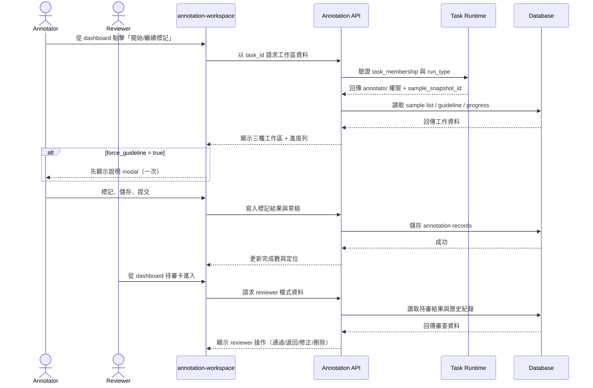
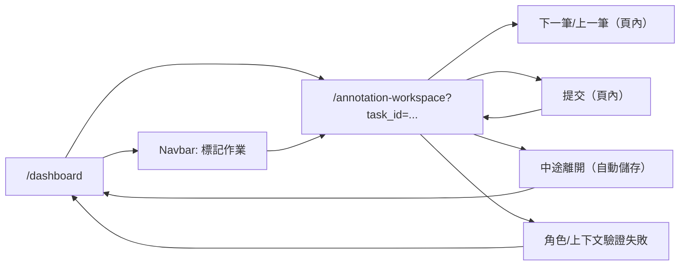

# 功能規格：Annotation Workspace — 標記作業（Annotator / Reviewer）

**功能分支**：`015-annotation-workspace`  
**建立日期**：2026-04-23  
**版本**：1.1.0  
**狀態**：Draft  
**需求來源**：IA v1.3.1（2026-04-23）標記任務模組規範（`annotation-workspace`）

## 規格常數

- `TASK_ROLES = annotator | reviewer`
- `RUN_TYPES = dry_run | official_run`
- `ANNOTATION_WORKSPACE_ROUTE = /annotation-workspace`
- `TASK_CONTEXT_REQUIRED = task_id + membership`
- `MISSING_CONTEXT_REDIRECT = /dashboard`
- `UNAUTHORIZED_ROLE_REDIRECT = /dashboard`
- `GUIDELINE_PANEL_TABS = guideline-files | history`
- `GUIDELINE_FORCE_MODAL_FLAG = force_guideline`
- `SAMPLE_SOURCE_CONTRACT = sample_snapshot_id`
- `SUBMIT_DEFAULT_ACTION = go-to-next-sample`
- `AUTOSAVE_TRIGGERS = on-sample-switch | on-leave | heartbeat`
- `AUTOSAVE_HEARTBEAT_INTERVAL_SECONDS = 30`
- `CONFLICT_RESOLUTION_POLICY = optimistic-lock-with-version-check`
- `MOBILE_BP = 767px`
- `RWD_VIEWPORTS = 375px / 768px / 1440px`

## Process Flow

| Step | Role | Action | System Response |
|------|------|--------|----------------|
| 1 | `annotator` / `reviewer` | 由 dashboard 或 navbar 進入 `annotation-workspace` | 驗證 task context 與角色 |
| 2 | 系統 | 載入工作區資料 | 依 `sample_snapshot_id` 回傳固定樣本、說明檔案與進度 |
| 3 | `annotator` | 進行逐筆標記、儲存、提交 | 更新完成數，提交後預設進入下一筆 |
| 4 | `reviewer` | 審查結果、通過/退回、必要時修正 | 產生審查結果與歷程 |
| 5 | 使用者 | 切換下一筆/上一筆 | 右欄「說明與檔案」持續可見，不可被清空 |
| 6 | 使用者 | 中途離開 | 自動儲存草稿 |

---

## 使用者情境與測試 *(必填)*

### User Story 1 — Annotator 完成 Dry Run / Official Run 標記（優先級：P1）

Annotator 可在同一工作區中，依任務當前 `run_type` 完成逐筆標記並提交結果。

**此優先級原因**：標記作業是核心產出流程。  
**獨立測試方式**：以 `annotator` 身分分別進入 Dry Run 與 Official Run 任務，驗證標記、儲存、提交與進度更新。

**驗收情境**：

1. **Given** `task_role = annotator` 且有合法 `task_id`，**When** 進入 `annotation-workspace`，**Then** 顯示工作區與當前階段（Dry Run / Official Run）。
2. **Given** 正在標記樣本，**When** 點擊儲存，**Then** 系統保存草稿且更新該筆狀態。
3. **Given** 已完成可提交條件，**When** 點擊提交，**Then** 系統記錄提交並預設導向下一筆（`SUBMIT_DEFAULT_ACTION`）。
4. **Given** 中途離開頁面，**When** 尚有未送出變更，**Then** 系統自動儲存草稿。

**介面定義（需與 IA 導覽語意一致）**：

- 區塊 A：`上方任務目標列（固定）`
  - 必要元素：任務目標、操作指引、已標記數量、總量、當前階段、微型進度視覺
- 區塊 B：`三欄工作區（Desktop）`
  - 左欄：樣本清單、目前定位、完成狀態
  - 中欄：樣本內容、`task_type` 動態標記控制項、儲存/提交操作
  - 右欄：`說明與檔案`（預設）與 `History`（次頁）
- 區塊 C：`Mobile 佈局`
  - 精簡任務目標列 + 主操作區
  - 說明與檔案使用底部抽屜（預設展開），`History` 以分頁切換

**行為規則**：

- `annotation-workspace` 只能讀取由 task-detail 發布時凍結的 `sample_snapshot_id`。
- Dry Run 與 Official Run 樣本切分不可在 workspace 端重算或覆寫。
- 右欄 `說明與檔案` 在翻筆（上一筆/下一筆）後必須持續可見。
- 若啟用 `force_guideline`，Annotator 每次進入任務先顯示一次說明 modal，但進入後右欄仍固定顯示說明內容。
- 提交後預設停留於 workspace 並載入下一筆；任務全部完成時才顯示返回 dashboard 的完成導引。

---

### User Story 2 — Reviewer 審查與追溯歷程（優先級：P1）

Reviewer 在同一工作區執行審查，能通過、退回、修正、刪除標記結果，並追溯每筆修改歷程。

**此優先級原因**：Dry Run 一致性與正式資料品質依賴 reviewer 決策。  
**獨立測試方式**：以 `reviewer` 身分進入待審任務，驗證審查操作與 History 追溯欄位。

**驗收情境**：

1. **Given** `task_role = reviewer`，**When** 進入工作區，**Then** 在 Dry Run 與 Official Run 都顯示 reviewer 可用操作（通過/退回/修正/刪除）。
2. **Given** reviewer 退回或修正某筆結果，**When** 儲存審查，**Then** 該筆歷程新增一筆可追溯紀錄（誰、何時、改成什麼）。
3. **Given** reviewer 在 Dry Run 審查，**When** 需要產生標準答案，**Then** 可使用多數決或手動確認流程完成該筆決策。

**介面定義（需與 IA 導覽語意一致）**：

- 區塊 A：`中欄審查操作區`
  - 必要元素：原標記結果、審查決策按鈕（通過/退回）、直接修正/刪除操作
- 區塊 B：`右欄 History`
  - 必要元素：操作者、時間、欄位差異、決策狀態
- 區塊 C：`右欄說明與檔案`
  - 必要元素：任務說明摘要、檔案列表、預覽/新分頁開啟能力

**行為規則**：

- Reviewer 可於 Dry Run 協助產出標準答案（多數決或手動確認）。
- Reviewer 操作必須留下完整審計資訊，供後續品質追溯。
- Reviewer 與 Annotator 共用相同樣本來源契約與導覽骨架，避免視圖不一致。
- Reviewer 在 Dry Run 與 Official Run 皆可執行修正/刪除，但必須填寫審計理由後才能送出。

---

### User Story 3 — 角色與任務上下文門禁（優先級：P1）

只有任務內 `annotator` / `reviewer` 可進入工作區；缺少 task context 或角色不符時必須導回安全入口。

**此優先級原因**：避免越權存取與錯誤任務上下文。  
**獨立測試方式**：模擬合法角色、非法角色、缺少 `task_id`、membership 不存在等案例，驗證導頁與提示。

**驗收情境**：

1. **Given** 使用者非當前任務 `annotator/reviewer`，**When** 嘗試進入工作區，**Then** 導回 `/dashboard` 並提示無權限。
2. **Given** 缺少 `task_id` 或 membership，**When** 開啟工作區路由，**Then** 一律導回 `/dashboard` 且不渲染工作內容。
3. **Given** `annotator` 嘗試直連 `task-detail`，**When** 驗證角色，**Then** 阻擋進入 task-detail 並維持 annotation-workspace 導向規則。

**行為規則**：

- 工作區 API 與 UI 需同時做角色驗證，避免僅前端門禁。
- 無效上下文不得回傳任何標記資料或 ground truth。
- 任務上下文恢復失敗時，一律導回 `dashboard`，避免多重 fallback 導致流程分歧。

---

### User Story 4 — 說明與檔案常駐 + 響應式體驗（優先級：P2）

使用者在 Desktop 與 Mobile 標記流程中都能持續查看說明內容，不因翻筆或版型切換遺失任務指引。

**此優先級原因**：降低標記偏差與操作中斷。  
**獨立測試方式**：在 `375px`、`768px`、`1440px` 驗證翻筆、切換 panel、切換階段時說明區持續可見。

**驗收情境**：

1. **Given** Desktop 三欄佈局，**When** 切換下一筆，**Then** 右欄說明不收起且內容不重置。
2. **Given** Mobile 底部抽屜模式，**When** 切換下一筆，**Then** 抽屜維持可見狀態並保留目前 tab。
3. **Given** 檔案為 PDF/圖片/Markdown，**When** 在右欄點擊檔案，**Then** 能預覽（圖片/Markdown）或新分頁開啟（PDF）。

**行為規則**：

- `說明與檔案` 為本模組強制常駐資訊，不能只在入場 modal 顯示。
- Mobile 必須保留主操作優先，並以抽屜承載輔助資訊，不可遮蔽核心標記區。

---

### Edge Cases

- 缺少 `sample_snapshot_id` 或快照引用失效時，工作區不得自行補抽樣，必須顯示錯誤並導回安全入口。
- 使用者同時在多分頁操作同任務同樣本時，必須使用版本號檢查；版本衝突時阻擋覆寫並提示手動合併。
- 自動儲存由 `AUTOSAVE_TRIGGERS` 觸發；其中 heartbeat 週期為 `AUTOSAVE_HEARTBEAT_INTERVAL_SECONDS` 秒。
- 自動儲存失敗時，需保留本地編輯狀態並提供明確重試操作。
- `run_type` 在工作中被任務管理端切換時，前端需刷新上下文並提示目前階段已變更。
- 說明檔案連結失效時，不影響標記主流程，但需顯示可追蹤錯誤訊息。

## Requirements *(必填)*

### Functional Requirements

- **FR-001**: 系統必須提供 `annotation-workspace` 作為 `annotator` 與 `reviewer` 的任務內工作頁。
- **FR-002**: 系統必須在進入工作區時驗證 `task_id` 與 `task_membership`。
- **FR-003**: 僅 `annotator` 或 `reviewer` 必須可存取工作區內容。
- **FR-004**: 當角色不符或上下文缺失時，系統必須導回 `UNAUTHORIZED_ROLE_REDIRECT`，且不得渲染樣本內容。
- **FR-005**: 工作區樣本來源必須鎖定為 `SAMPLE_SOURCE_CONTRACT`，不得在 workspace 端重算或覆寫切分。
- **FR-006**: 系統必須支援 `RUN_TYPES` 並在 UI 明確標示當前階段。
- **FR-007**: Annotator 模式必須支援逐筆標記、儲存草稿、提交。
- **FR-008**: Reviewer 模式必須支援通過、退回、修正、刪除標記結果。
- **FR-009**: Reviewer 在 Dry Run 必須可使用多數決或手動確認流程協助產出標準答案。
- **FR-010**: 系統必須記錄每筆資料的標記歷程（操作者、時間、修改內容）。
- **FR-010A**: Reviewer 在 Dry Run 與 Official Run 執行修正/刪除時，系統必須強制填寫審計理由並記錄。
- **FR-011**: Desktop 介面必須提供三欄工作區與固定任務目標列。
- **FR-012**: Mobile 介面必須提供精簡目標列、主操作區與底部抽屜說明區。
- **FR-013**: `說明與檔案` 面板必須於翻筆後持續可見，不可自動收起或清空。
- **FR-014**: 說明檔案至少必須支援圖片/Markdown 快速預覽與 PDF 新分頁開啟。
- **FR-015**: 當 `force_guideline` 啟用時，Annotator 每次進入任務必須先看到說明 modal 一次。
- **FR-016**: 自動儲存必須支援 `on-sample-switch`、`on-leave` 與每 `AUTOSAVE_HEARTBEAT_INTERVAL_SECONDS` 秒 heartbeat 觸發。
- **FR-016A**: 提交後預設行為必須為載入下一筆（`SUBMIT_DEFAULT_ACTION`）。
- **FR-016B**: 寫入標記結果時必須使用版本號檢查；版本衝突時阻擋覆寫並要求手動合併。
- **FR-017**: 工作區不得回傳任何 ground-truth 測試答案給 annotator 可見介面。
- **FR-018**: 工作區中所有 `task_type` 標記控制項必須由任務設定動態渲染，不得硬編碼單一任務型別流程。

### User Flow & Navigation *(必填)*

| From | Trigger | To |
|------|---------|----|
| `dashboard` | 點擊開始/繼續標記 | `annotation-workspace` |
| `dashboard` | 點擊待審任務 | `annotation-workspace` |
| `annotation-workspace` | 提交完成 | `annotation-workspace`（下一筆） |
| `annotation-workspace` | 上下文失效/無權限 | `dashboard` |
| `annotation-workspace` | 手動返回 | `dashboard` |

**Entry points**: `dashboard` 任務卡、`dashboard` 待審清單、Navbar 標記作業（需已解析 task context）。  
**Exit points**: 手動返回 `dashboard`、任務完成導引返回 `dashboard`、驗證失敗自動導回 `dashboard`。

### Key Entities *(必填)*

- **TaskContext**: 任務上下文，至少包含 `task_id`、`task_role`、`run_type`、`sample_snapshot_id`。
- **AnnotationRecord**: 標記結果資料，包含樣本識別、標記內容、狀態（draft/submitted）、操作者與時間戳。
- **ReviewDecision**: Reviewer 決策資料，包含 `approve/reject/edit/delete` 結果與原因。
- **AnnotationHistoryItem**: 標記歷程節點，包含修改前後差異、操作者、時間、來源動作。
- **GuidelineAsset**: 任務說明資產，包含文字摘要、檔案清單、`force_guideline` 設定。

---

## Spec Dependencies *(必填)*

### Upstream（本 spec 依賴）

| Spec # | Feature | What this spec needs from it |
|--------|---------|------------------------------|
| shared-008 | Shared Sidebar Navbar | 登入後共用導覽結構與 active 規則 |
| dashboard-012 | Dashboard | Annotator/Reviewer 進入工作區入口與待辦卡 |
| task-management-013 | New Task | 任務類型設定、說明檔案、初始成員與 run 初始化 |
| task-management-014 | Task Detail | Dry/Official 狀態管理、`sample_snapshot_id` 凍結與發布流程 |

### Downstream（依賴本 spec）

| Spec # | Feature | What they rely on from this spec |
|--------|---------|----------------------------------|
| dataset-016 | Dataset Stats | 已提交標記結果與階段資料來源 |
| dataset-017 | Dataset Quality | Dry Run 審查結果、IAA 計算輸入與異常偵測基礎資料 |

---

## Success Criteria *(必填)*

- **SC-001**: 角色門禁正確率達 100%，非 `annotator/reviewer` 不可讀取任何工作區標記資料。
- **SC-002**: Dry Run / Official Run 顯示與寫入來源 100% 來自鎖定 `sample_snapshot_id`，無 workspace 端重抽樣事件。
- **SC-003**: 在 `375px / 768px / 1440px` 下，翻筆後 `說明與檔案` 可見性維持 100%，不出現自動收合或內容清空。
- **SC-004**: Annotator 與 Reviewer 主要流程（標記/審查/提交/返回）端到端可完成，且關鍵操作皆有歷程可追溯。
- **SC-005**: Annotator 可見 API 回應中不含 ground-truth 測試答案欄位。

---

## Changelog

| Version | Date | Change Summary |
|---------|------|----------------|
| 1.1.0 | 2026-04-23 | Applied clarify decisions: submit default next sample, reviewer edit/delete audit rule, version-check conflict policy, autosave triggers, unified dashboard redirect |
| 1.0.0 | 2026-04-23 | Initial spec based on IA v1.3.1 annotation module rules |
