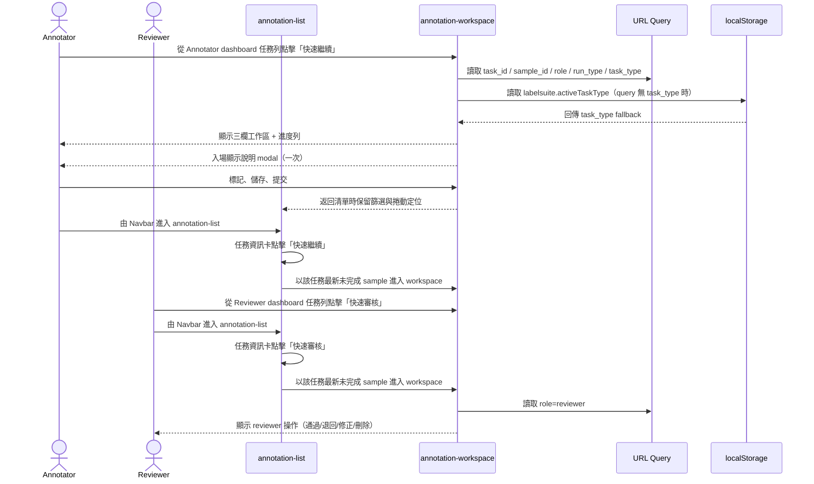
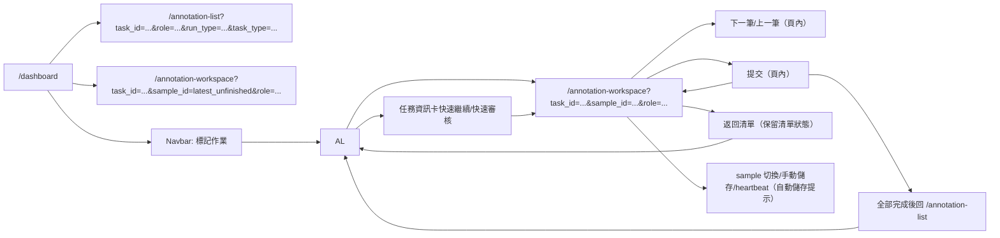

# 功能規格：Annotation List + Workspace — 標記清單與標記作業（Annotator / Reviewer）

**功能分支**：`015-annotation-workspace`  
**建立日期**：2026-04-23  
**版本**：1.3.17  
**狀態**：Draft  
**需求來源**：IA v1.3.1（2026-04-23）標記任務模組規範（`annotation-list` → `annotation-workspace`）

## 規格常數

- `TASK_ROLES = annotator | reviewer`
- `RUN_TYPES = dry_run | official_run`
- `TASK_TYPE_KEYS = single_sentence_classification | single_sentence_va_scoring | sequence_labeling | relation_extraction | sentence_pairs`
- `SEQUENCE_LABELING_SUBTYPES = ner | aspect_list`
- `ASPECT_LIST_CONFIG_FIELDS = input_field | aspect_list_field | allow_sentence_edit | allow_aspect_add | allow_aspect_delete | require_exact_match_in_sentence | min_aspects | max_aspects | require_sentiment_context_check`
- `ANNOTATION_LIST_ROUTE = /annotation-list`
- `ANNOTATION_WORKSPACE_ROUTE = /annotation-workspace`
- `ANNOTATION_LIST_ROUTE_QUERY = task_id | role | run_type | q | status | sort`
- `ANNOTATION_WORKSPACE_ROUTE_QUERY = task_id | sample_id | role | run_type | task_type`
- `TASK_CONTEXT_SOURCE = route_query + local_storage_fallback`
- `TASK_CONFIG_SOURCE = task-detail published config + sample_snapshot_id`
- `GUIDELINE_PANEL_TABS = guideline-files | history`
- `GUIDELINE_MODAL_BEHAVIOR = show-on-entry-per-page-load`
- `GUIDELINE_PANEL_COLLAPSE = desktop-toggleable`
- `SAMPLE_SOURCE_CONTRACT = sample_snapshot_id`
- `SUBMIT_DEFAULT_ACTION = go-to-next-sample`
- `SUBMIT_ALL_DONE_ACTION = redirect-to-annotation-list`
- `AUTOSAVE_TRIGGERS = on-sample-switch | on-save-click | heartbeat`
- `AUTOSAVE_HEARTBEAT_INTERVAL_SECONDS = 15`
- `ACTIVE_TASK_TYPE_STORAGE_KEY = labelsuite.activeTaskType`
- `CONFLICT_RESOLUTION_POLICY = optimistic-lock-with-version-check`
- `MOBILE_BP = 767px`
- `RWD_VIEWPORTS = 375px / 768px / 1440px`

## Process Flow

| Step | Role | Action | System Response |
|------|------|--------|----------------|
| 1 | `annotator` / `reviewer` | 由 dashboard 任務列點擊 `快速繼續/快速審核` | 直接導向 `annotation-workspace`，並帶入該任務「最新未完成 sample」的 `sample_id` |
| 2 | 使用者 | 由 navbar 進入 `annotation-list`，點擊單筆資料或任務資訊卡 `快速繼續/快速審核` | 導向 `annotation-workspace` 並帶入 `task_id/sample_id/run_type/role` |
| 3 | 系統 | 載入工作區資料 | 套用固定樣本、說明檔案與進度（原型內建資料） |
| 4 | `annotator` | 進行逐筆標記、儲存、提交 | 更新完成數；未完成全筆次時提交後預設進入下一筆，全部提交後導回 `annotation-list` |
| 5 | `reviewer` | 審查結果、通過/退回、必要時修正 | 產生審查結果與歷程 |
| 6 | 使用者 | 返回清單 | 保留清單篩選條件與捲動定位 |
| 7 | 使用者 | 中途操作 | 由 sample 切換、儲存、heartbeat 觸發自動儲存提示 |

---

## 使用者情境與測試 *(必填)*

### User Story 1 — 快速入口與清單入口並存（優先級：P1）

Annotator / Reviewer 進入標記模組時，支援兩種入口：dashboard 任務列可直接進入 `annotation-workspace`；navbar 入口則先進 `annotation-list` 再選筆次進入。

**此優先級原因**：需同時滿足 dashboard 的快速續作路徑與 annotation-list 的檢索/篩選操作。  
**獨立測試方式**：分別由 dashboard 與 navbar 進入標記模組，驗證快速入口可直達工作區，清單入口可由單筆與任務資訊卡導向工作區。

**驗收情境**：

1. **Given** 使用者點擊 dashboard 任務卡中的非 `快速繼續/快速審核` 區域，**When** 進入標記模組，**Then** 先進入對應任務的 `annotation-list`，並帶入 `task_id/run_type/role/task_type`。
2. **Given** 使用者點擊 dashboard 任務卡「快速繼續/快速審核」，**When** 進入標記模組，**Then** 直接進入 `annotation-workspace`，且帶入該任務最新未完成 sample 的 `sample_id`。
3. **Given** 使用者於清單點擊任一筆資料列或其 `編輯` 按鈕，**When** 觸發導頁，**Then** 導向 `annotation-workspace` 並帶入 `task_id/sample_id/run_type/role`，且工作區初始化後必須停留在該 `sample_id` 對應的樣本。
4. **Given** 使用者於清單任務資訊卡點擊「快速繼續/快速審核」，**When** 觸發導頁，**Then** 導向 `annotation-workspace` 並帶入該任務最新未完成 sample 的 `sample_id`。
5. **Given** 使用者從工作區返回清單，**When** 回到 `annotation-list`，**Then** 保留當前任務上下文與捲動位置。
6. **Given** 清單中某筆資料被他人鎖定，**When** 點擊該筆，**Then** 顯示鎖定狀態並提供唯讀檢視或稍後再試。
7. **Given** 使用者於標記清單切換完成狀態篩選，**When** 選擇 `已提交/草稿/待處理`，**Then** 清單只顯示符合該完成狀態的資料列。

**介面定義（需與 IA 導覽語意一致）**：

- 區塊 A：`頁首資訊`
  - 必要元素：頁面標題與導引文案
- 區塊 B：`任務資訊卡`
  - 必要元素：任務名稱、進度摘要（例如：完成率/今日完成/平均速度）、Task Type badge、Run Type badge、狀態 badge、進度條
  - 必要元素（操作）：`快速繼續`（annotator）或 `快速審核`（reviewer）按鈕，位置需與 Dashboard 任務列表一致（卡片右側操作區）
  - 位置規範：必須位於篩選列上方（頁首資訊下方、資料清單上方）
  - 視覺樣式：必須與 Dashboard 任務列表列項樣式一致（`list-item` + `badge` + `progress`）
- 區塊 C：`資料清單（Annotator 視圖）`
  - 必要元素：樣本 ID、完成時間、完成狀態、標記者、文本摘要
  - 必要元素（操作）：每列需提供 `編輯` 按鈕，作為進入該筆 `annotation-workspace` 的顯式 CTA
  - 視覺樣式：表格容器與欄位樣式需與 `task-list` 一致（同級 toolbar + table shell）
  - 顯示限制：不顯示「任務資料清單」區塊標題文字
- 區塊 C'：`資料清單（Reviewer 視圖）`
  - 必要元素：樣本 ID、完成狀態、完成時間、文本摘要、標記分布統計、展開控制項
  - 必要元素（操作）：每列提供 `全部通過` / `全部退回` 批次按鈕；展開後每位標記員一列，含 `通過` / `退回` 逐筆按鈕；toolbar 右側提供 `送出審核` 按鈕（Reviewer 專屬，Annotator 不顯示）；送出前需完成每位標記員的審核決策，否則顯示 `toastSelectDecision` 錯誤提示
  - 操作順序：批次與逐筆操作皆固定為左側 `退回`、右側 `通過`
  - 狀態回饋：批次按鈕被按下後，需比照逐筆按鈕切換為深色實心 active 樣式；未按下維持淺色描邊樣式，兩者需可明確區分；再次點擊當前 active 的批次按鈕時，視為取消整筆決策並回到未選取狀態
  - 展開行為：點擊列或展開箭頭展開/收合該筆的標記員明細（含帳號、標記結果 tag、逐列操作）
  - 批次操作：`全部通過` / `全部退回` 套用至同筆所有標記員，展開行同步更新按鈕狀態；若同筆所有逐筆決策一致，對應批次按鈕也需同步切為 active；再次點擊當前 active 的批次按鈕時，需清除同筆全部逐筆決策
  - 標記分布統計：分類任務顯示各標籤出現次數（`標籤×n`）；VA 評分任務第一行顯示 `mean [V, A]` ，第二行顯示`std [V, A]`，第三行顯示 `±1.5std V : lo~hi, ±1.5std A : lo~hi`
  - 標記結果顏色標記（VA 評分任務）：展開行中每位標記員的 `[V, A]` result tag 依以下規則著色：🟢 綠色（`result-tag-green`）：V 與 A 皆落在 `[lo, hi]` 範圍內；🔵 藍色（`result-tag-blue`）：任一維度低於下界（`< lo`）；🔴 紅色（`result-tag-red`）：任一維度高於上界（`> hi`）；優先順序：紅色 > 藍色 > 綠色
  - 視覺樣式：與 Annotator 視圖共用相同 table shell；展開行背景以 `#F8FAFC` 區分
- 區塊 D：`清單操作`
  - 必要元素：完成狀態篩選、關鍵字搜尋、清除篩選、點擊單筆進入作業、鎖定狀態提示

**行為規則**：

- dashboard 任務列中除 `快速繼續/快速審核` 以外的區域，必須導向對應任務的 `annotation-list`。
- dashboard 任務列 `快速繼續/快速審核` 必須直接導向 `annotation-workspace`，不經 `annotation-list`。
- navbar 進入標記作業時，仍以 `annotation-list` 為入口頁。
- 清單與工作區間必須以 `task_id/sample_id/run_type/role` 建立明確導頁契約。
- `annotation-workspace` 初始化時，若 query 含有效 `sample_id`，必須以該樣本作為當前作用中項目；不得回退到固定預設索引。
- 「最新未完成 sample」判定規則：優先取最後一筆 `pending`，若無則取最後一筆 `saved`，若仍無則回退該任務最後一筆。
- 返回清單時需還原同一 `task_id` / `run_type` 上下文，並保留捲動定位。
- 清單必須支援依完成狀態篩選（`submitted | saved | pending`），並可清除篩選回到完整列表。
- 手機版（`<= MOBILE_BP`）清單首列不得因文本摘要換行造成異常大列高；需維持可快速掃讀的緊湊列高。
- Reviewer 視圖下，`通過` / `退回` 決策僅更新前端原型狀態；不觸發導頁，reviewer 可在清單直接完成審核流程。

---

### User Story 2 — Annotator 完成 Dry Run / Official Run 標記（優先級：P1）

Annotator 可在同一工作區中，依任務當前 `run_type` 完成逐筆標記並提交結果。

**此優先級原因**：標記作業是核心產出流程。  
**獨立測試方式**：以 `annotator` 身分分別進入 Dry Run 與 Official Run 任務，驗證標記、儲存、提交與進度更新。

**驗收情境**：

1. **Given** `role=annotator` 且 `run_type` 合法，**When** 由 `annotation-list` 點擊單筆進入 `annotation-workspace`，**Then** 顯示工作區與當前階段（Dry Run / Official Run）。
2. **Given** 正在標記樣本，**When** 點擊儲存，**Then** 系統保存草稿且更新該筆狀態。
3. **Given** 已完成可提交條件，**When** 點擊提交，**Then** 系統記錄提交並預設導向下一筆（`SUBMIT_DEFAULT_ACTION`）。
4. **Given** 任務最後一筆完成提交，**When** 完成提交流程，**Then** 系統導回 `annotation-list` 並將該任務資料列狀態顯示為 `已提交`。
5. **Given** 切換樣本或手動儲存，**When** 有編輯行為發生，**Then** 顯示自動儲存狀態更新（Saving → Saved）。

**介面定義（需與 IA 導覽語意一致）**：

- 區塊 A：`上方任務目標列（固定）`
  - 必要元素：任務目標、操作指引、已標記數量、總量、當前階段、微型進度視覺
- 區塊 B：`三欄工作區（Desktop）`
  - 左欄：標記清單、目前定位、完成狀態
  - 中欄：樣本內容、`task_type` 動態標記控制項、儲存/提交操作
  - 右欄：`說明與檔案`（預設）與 `History`（次頁）
- `sequence_labeling.subtype = aspect_list` 中欄控制項：
  - 必要元素：原始句子區、可編輯句子欄位（僅 `allow_sentence_edit = true` 時啟用）、Aspect List 編輯區、逐列錯誤訊息、整體驗證摘要、儲存草稿、提交。
  - 欄位來源：原始句子必須讀取 task config 的 `input_field` 對應資料欄位；Aspect List 初始值必須讀取 `aspect_list_field` 對應欄位（若資料集提供既有 aspect list）。
  - `allow_sentence_edit = false` 時，句子區必須以唯讀方式呈現；不得提供可輸入 textarea，也不得在 payload 中產生覆寫資料集原文的欄位值。
  - Aspect row 必須包含：row label、aspect 自由文字輸入框（text input，不採用 NER 式 span 拖拉選取）、刪除按鈕（僅 `allow_aspect_delete = true` 時顯示）、exact match 狀態、可定位錯誤訊息。
  - 新增 aspect 按鈕僅在 `allow_aspect_add = true` 且未超過 `max_aspects` 時可用。
  - Aspect row 自由文字輸入框不得改成 NER span 拖拉、token 選取或 entity type 選單；每列代表一個 aspect 文字片段。
  - 若 `require_exact_match_in_sentence = true`，每個 aspect 必須完全出現在目前句子內容中；失敗 row 需顯示錯誤且阻擋提交（硬性攔截）。
  - 若 `require_sentiment_context_check = true`，每個 aspect row 需顯示情緒上下文確認狀態（例如「已檢查 / 需確認」）作為軟性提醒；此為**軟性指引，不阻擋提交**，與 `require_exact_match_in_sentence` 的硬性阻擋行為不同。
- 區塊 C：`Mobile 佈局`
  - 精簡任務目標列 + 主操作區
  - 說明與檔案使用底部抽屜（預設收合，可展開），`History` 以分頁切換

**行為規則**：

- `annotation-workspace` 只能讀取由 task-detail 發布時凍結的 `sample_snapshot_id`。
- `annotation-workspace` 必須讀取 task-detail 發布時凍結的 `TaskConfig`，依 `task_type` 與 config subtype 選擇標記控制項；不得在 workspace 內硬編任務專屬邏輯。
- Dry Run 與 Official Run 樣本切分不可在 workspace 端重算或覆寫。
- 右欄 `說明與檔案` 在翻筆（上一筆/下一筆）後必須持續可見。
- 原型入場時固定顯示說明 modal 一次；關閉後右欄仍固定顯示說明內容。
- Desktop 右欄支援收合/展開切換按鈕，收合後可再次展開。
- 提交後預設停留於 workspace 並載入下一筆；任務全部完成時導回 `annotation-list`（`SUBMIT_ALL_DONE_ACTION`）。
- `task_type` 由 query 參數決定；若 query 缺值，回退 `labelsuite.activeTaskType`，最終回退為 `single_sentence_classification`。
- `sequence_labeling.subtype = aspect_list` 提交 payload 必須保留 `original_sentence`、`corrected_sentence`（若有修改）、`aspects[]`、每個 aspect 的驗證狀態與標記者備註；其中 `aspects[]` 對應 task config 的 `aspect_list_field`，不得覆寫資料集原文。

### User Story 2A — Annotator 完成 Aspect List 抽取 / 校正（優先級：P1）

Annotator 可在 `sequence_labeling.subtype = aspect_list` 任務中，依句子內容校正原句並維護 Aspect List。

**此優先級原因**：Aspect List 是序列標記中的研究情境必要子模式，僅提供一般 NER span 標註不足以完成實際任務。  
**獨立測試方式**：以 `task_type=sequence_labeling` 且 task config `subtype=aspect_list` 進入工作區，驗證句子校正、aspect 新增/刪除/修改、驗證阻擋、儲存與提交。

**驗收情境**：

1. **Given** 任務 config 為 `sequence_labeling.subtype = aspect_list`，**When** annotator 進入工作區，**Then** 中欄顯示句子與 Aspect List 編輯介面，而不是分類 checkbox 或 VA scale。
2. **Given** 任務 config 包含 `input_field = sentence` 與 `aspect_list_field = aspects`，**When** annotator 進入工作區，**Then** 句子內容從 `sentence` 欄位讀取，Aspect List 初始列從 `aspects` 欄位讀取或以空列表初始化。
3. **Given** `allow_sentence_edit = true`，**When** annotator 修改句子，**Then** 系統保留原始句子與修正後句子，並重新驗證既有 aspect 是否仍完全出現在修正後句子中。
4. **Given** `allow_aspect_add = true`，**When** annotator 新增 aspect 並輸入文字，**Then** 新增列進入 Aspect List 並參與 min/max 與 exact match 驗證。
5. **Given** `allow_aspect_delete = true`，**When** annotator 刪除 aspect，**Then** 該列從提交 payload 移除，且 min aspect 驗證即時更新。
6. **Given** `require_exact_match_in_sentence = true`，**When** 任一 aspect 不存在於目前句子，**Then** 該列顯示錯誤，提交按鈕不可完成提交。
7. **Given** `require_sentiment_context_check = true`，**When** 任一 aspect 尚未完成上下文確認，**Then** 系統於該列顯示提醒狀態（「需確認」）；此為軟性指引，不阻擋提交。

---

### User Story 3 — Reviewer 審查與追溯歷程（優先級：P1）

Reviewer 在同一工作區執行審查，先查看單一句子的 標記分布統計與各標記員結果，再以通過 / 退回完成逐列或批次審核，並追溯每筆決策歷程。Aspect List 任務中，Reviewer 可直接修正標記員提交的 Aspect List 後通過，或選擇退回由標記員重做。

**此優先級原因**：Dry Run 一致性與正式資料品質依賴 reviewer 決策。  
**獨立測試方式**：以 `reviewer` 身分進入待審任務，驗證審查操作與 History 追溯欄位。

**驗收情境**：

1. **Given** `role=reviewer`，**When** 進入工作區，**Then** 在 Dry Run 與 Official Run 都顯示 reviewer 可用操作（通過 / 退回），且先顯示句子級 標記分布統計摘要。
2. **Given** reviewer 需快速處理同一句的多位標記員結果，**When** 點擊 `全部通過` 或 `全部退回`，**Then** 系統必須以勾選式批次套用到所有標記員列。
3. **Given** reviewer 退回或通過某位標記員結果，**When** 送出審核，**Then** 該筆歷程新增一筆可追溯紀錄（誰、何時、對哪位標記員做了什麼決策）。
4. **Given** reviewer 在 Dry Run 審查，**When** 需要產生標準答案，**Then** 可使用 標記分布統計、各標記員結果與手動確認流程完成該筆決策。
5. **Given** reviewer 審核 `sequence_labeling.subtype = aspect_list` 任務，**When** 發現標記員多標、漏標或文字需修正，**Then** 可直接刪除、新增或修改該標記員的 aspect row，並在送出審核時留下原始提交與 reviewer 修正 diff。

**介面定義（需與 IA 導覽語意一致）**：

- 區塊 A：`中欄審查操作區`
  - 必要元素：句子級 標記分布統計摘要（`mean`、`std`、`±1.5std` 範圍）
  - 必要元素：標記員逐列結果（帳號、標記值）
  - 必要元素：逐列決策按鈕（`通過` / `退回`）
  - 必要元素：批次操作（`全部通過` / `全部退回`），呈現方式需接近 checkbox 勾選
  - 必要元素：審查說明文案（`通過：此筆標記有效。退回：該標記狀態會回到未標記，標記員需要重新標記。`）
  - 操作順序：`退回` 置左，`通過` 置右；批次操作與逐列操作一致
  - 按鈕視覺一致性：工作區 reviewer 的批次與逐列 `退回 / 通過` 按鈕，必須與 `annotation-list` reviewer 視圖使用完全一致的 icon 與樣式規格；包含 `✕ / ✓` icon 呈現方式、按鈕內距、色彩、邊框、hover、focus、active filled state，不可使用另一套按鈕結構替代
  - 版面排列（Desktop）：審查說明文案需與批次操作按鈕位於同一行，文案在左、`全部退回 / 全部通過` 在右
  - 狀態回饋：批次操作按鈕需支援 active/inactive 兩態，active 態沿用逐列 `通過 / 退回` 的深色實心視覺；再次點擊 active 態時需取消整筆批次決策
  - 逐筆按鈕行為：逐筆 `通過 / 退回` 按鈕點擊後切換為 active 深色實心；再次點擊當前 active 按鈕時視為取消該筆決策，回到未選取狀態；逐筆決策狀態與批次按鈕狀態保持同步
  - 標記結果顏色標記（VA 評分任務）：每位標記員的 `[V, A]` result tag 依以下規則著色：🟢 綠色（`result-tag-green`）：V 與 A 皆落在 `[lo, hi]` 範圍內；🔵 藍色（`result-tag-blue`）：任一維度低於下界（`< lo`）；🔴 紅色（`result-tag-red`）：任一維度高於上界（`> hi`）；優先順序：紅色 > 藍色 > 綠色；`lo`/`hi` 由當筆統計摘要中的 `±1.5std` 範圍解析
  - `sequence_labeling.subtype = aspect_list` 任務：各標記員結果需以可掃讀的 Aspect List diff 呈現，至少顯示每位標記員的新增、刪除、修改、exact match invalid 與句子修正差異；Reviewer 需可在同一列直接新增、刪除、修改 aspect，必要時修正句子，並可選擇「修正後通過」或「退回標記員」。
- 區塊 B：`右欄 History`
  - 必要元素：操作者、時間、欄位差異、決策狀態
- 區塊 C：`右欄說明與檔案`
  - 必要元素：任務說明摘要、檔案列表、預覽/新分頁開啟能力

**行為規則**：

- Reviewer 可於 Dry Run 協助產出標準答案（多數決、IAA 輔助判讀或手動確認）。
- Reviewer 操作必須留下完整審計資訊，供後續品質追溯。
- Reviewer 與 Annotator 共用相同樣本來源契約與導覽骨架，避免視圖不一致。
- 一般分類與 VA 任務的 Reviewer 介面只提供 `通過 / 退回` 兩種決策；不提供直接修改標記值入口。
- `sequence_labeling.subtype = aspect_list` 的 Reviewer 介面需額外提供 row-level 修正入口：Reviewer 可直接新增缺漏 aspect、刪除多標 / 錯標 aspect、修改 aspect 文字與修正句子。這些修正不等同於 `退回`，而是產生 reviewer-corrected result。
- `通過` 表示該筆標記有效；Aspect List 任務若 Reviewer 有直接修正，則表示修正後結果有效。`退回` 表示該筆標記狀態回到未標記，由原標記員重新標記。
- Reviewer 直接修正 Aspect List 時，系統必須保留 annotator 原始提交、reviewer 修正後結果、修正 diff（新增 / 刪除 / 修改 / 句子修正）、Reviewer 身分、時間與最終決策，供品質追溯。
- 手機版（`<= MOBILE_BP`）Reviewer 工作區中，批次操作區需右對齊；各標記員列的 result tag 與逐列 `退回 / 通過` 按鈕也需靠右對齊，維持一致的行尾操作視覺。

---

### User Story 4 — 路由上下文解析與進入控制（優先級：P1）

清單與工作區都由路由參數決定啟動上下文；`role`、`run_type`、`task_type` 缺值時需套用預設與回退邏輯。

**此優先級原因**：確保 dashboard/sidebar 進入清單與工作區時可還原正確模式。  
**獨立測試方式**：模擬清單與工作區的 query 組合與缺值案例，驗證畫面模式、語意與 fallback。

**驗收情境**：

1. **Given** query 含有效 `task_id` 且 `role=annotator` 或 `role=reviewer`，**When** 開啟 `annotation-list`，**Then** 載入對應任務與 run_type 清單。
2. **Given** query 缺少 `run_type`，**When** 開啟清單或工作區，**Then** 使用預設 `dry_run`。
3. **Given** 開啟 `annotation-workspace` 且 query 缺少 `task_type`，**When** 初始化頁面，**Then** 先讀取 `labelsuite.activeTaskType`，若仍缺值則回退 `single_sentence_classification`。
4. **Given** 開啟 `annotation-workspace` 且 query 含有效 `sample_id`，**When** 初始化頁面，**Then** 左側標記清單作用中狀態、中央內容與提交進度都必須對應到該 `sample_id`。

**行為規則**：

- 原型模式下，清單與工作區啟動上下文以 query + localStorage 為主，不在頁面內做 API 權限判斷。
- 無效 `role` 值時，回退預設 `annotator` 呈現，避免頁面不可用。
- 有效 `sample_id` 必須優先於頁面內建預設索引，用於決定 workspace 初始焦點樣本。

---

### User Story 5 — 說明與檔案常駐 + 響應式體驗（優先級：P2）

使用者在 Desktop 與 Mobile 標記流程中都能持續查看說明內容，不因翻筆或版型切換遺失任務指引。

**此優先級原因**：降低標記偏差與操作中斷。  
**獨立測試方式**：在 `375px`、`768px`、`1440px` 驗證翻筆、切換 panel、切換階段時說明區持續可見。

**驗收情境**：

1. **Given** Desktop 三欄佈局，**When** 切換下一筆，**Then** 右欄說明不收起且內容不重置。
2. **Given** Mobile 底部抽屜模式，**When** 切換下一筆，**Then** 抽屜維持目前開合狀態，並保留目前 tab。
3. **Given** 檔案為 PDF/圖片/Markdown，**When** 在右欄點擊檔案，**Then** 能預覽（圖片/Markdown）或新分頁開啟（PDF）。

**行為規則**：

- `說明與檔案` 為本模組強制常駐資訊，不能只在入場 modal 顯示。
- Mobile 必須保留主操作優先，並以抽屜承載輔助資訊，不可遮蔽核心標記區。

---

### Edge Cases

- `annotation-list` 缺少 `task_id` 時，不可進入空白清單；需顯示錯誤提示並提供返回 `dashboard`。
- `annotation-workspace` 缺少 `sample_id` 時，不可載入作業區；需導回 `annotation-list`。
- `task_type` query 值非支援類型時，需回退 `single_sentence_classification` 並保持頁面可操作。
- `task_type=sequence_labeling` 但 task config 缺少 `subtype` 時，需顯示 task config 錯誤並阻擋標記提交；不得回退成分類控制項造成錯誤標記。
- `sequence_labeling.subtype = aspect_list` 但 task config 缺少任一 `ASPECT_LIST_CONFIG_FIELDS` 欄位或欄位型別不合法：需顯示 task config 錯誤並阻擋標記提交。
- `sequence_labeling.subtype = aspect_list` 的樣本資料缺少 `input_field` 指定欄位：不得顯示空白句子讓 annotator 誤標；需顯示資料欄位錯誤並阻擋提交。
- `sequence_labeling.subtype = aspect_list` 的樣本資料缺少 `aspect_list_field` 指定欄位：可用空 Aspect List 初始化，但提交 payload 必須仍寫入對應 `aspect_list_field` 語意。
- `sequence_labeling.subtype = aspect_list` 且所有 aspect 被刪除後低於 `min_aspects`：保留編輯內容、顯示錯誤並阻擋提交。
- `sequence_labeling.subtype = aspect_list` 且 aspect 數量超過 `max_aspects`：阻擋新增或提交，並顯示上限提示。
- `sequence_labeling.subtype = aspect_list` 的 sentence 被修改後，原本 valid 的 aspect 不再完全出現在句子中：該 aspect 需即時轉為 invalid。
- 使用者同時在多分頁操作同任務同樣本時，必須使用版本號檢查；版本衝突時阻擋覆寫並提示手動合併。
- 自動儲存由 `AUTOSAVE_TRIGGERS` 觸發；其中 heartbeat 週期為 `AUTOSAVE_HEARTBEAT_INTERVAL_SECONDS` 秒。
- 自動儲存失敗時，需保留本地編輯狀態並提供明確重試操作。
- `run_type` query 值缺失或非支援值時，前端需回退 `dry_run`。
- 清單中樣本鎖定狀態變更（未鎖定→鎖定）時，點擊進入需即時阻擋並提示。
- 說明檔案連結失效時，不影響標記主流程，但需顯示可追蹤錯誤訊息。

## Requirements *(必填)*

### Functional Requirements

- **FR-001**: 系統必須提供 `annotation-list` 作為 Navbar 進入標記模組時的入口頁（L1）。
- **FR-0010**: 系統必須支援 dashboard 任務列中除 `快速繼續/快速審核` 以外的區域導向 `annotation-list`，並保留被點擊任務上下文（`task_id`、`role`、`run_type`、`task_type`）。
- **FR-001A**: 系統必須支援 dashboard 任務列 `快速繼續/快速審核` 直接導向 `annotation-workspace`（不經 `annotation-list`）。
- **FR-002**: 系統必須提供 `annotation-workspace` 作為單筆標記/審查工作頁（L2）。
- **FR-003**: 系統必須在進入 `annotation-list` 時解析 `ANNOTATION_LIST_ROUTE_QUERY`（至少 `task_id`、`role`、`run_type`）。
- **FR-004**: 系統必須在進入 `annotation-workspace` 時解析 `ANNOTATION_WORKSPACE_ROUTE_QUERY`（`task_id`、`sample_id`、`role`、`run_type`、`task_type`）。
- **FR-004C**: `annotation-workspace` 初始化後，若 `sample_id` 有效，系統必須將該筆樣本設為當前作用中樣本，並同步更新左側清單高亮與中央內容；不得固定落在預設索引。
- **FR-004A**: 由 dashboard 任務列進入時，`task_id` 必須對應被點擊的任務，且不得導向其他任務內容。
- **FR-004B**: 由 dashboard 或清單任務資訊卡的 `快速繼續/快速審核` 進入時，必須帶入該任務「最新未完成 sample」的 `sample_id`。
- **FR-005**: `role` 僅支援 `annotator`、`reviewer`；非支援值必須回退 `annotator`。
- **FR-006**: `run_type` 僅支援 `dry_run`、`official_run`；缺值或非支援值必須回退 `dry_run`。
- **FR-007**: `annotation-list` 必須顯示當前任務上下文的資料清單（樣本 ID、完成狀態、完成時間、標記者、文本摘要）。
- **FR-007A**: `annotation-list` 的表格容器與欄位樣式必須與 `task-list` 一致，且不得顯示「任務資料清單」區塊標題。
- **FR-007B**: `annotation-list` 必須提供完成狀態篩選（`submitted | saved | pending`）與清除篩選操作，篩選結果須即時反映於資料列。
- **FR-007C**: `annotation-list` 必須在篩選列上方顯示任務資訊卡（任務名稱、進度摘要、Task Type / Run Type / 狀態 badge、進度條）。
- **FR-007D**: `annotation-list` 的任務資訊卡視覺樣式必須與 Dashboard 任務列表列項一致（同款 badge 與 progress 規格）。
- **FR-007F**: `annotation-list` 任務資訊卡必須提供 `快速繼續/快速審核` 按鈕，並以同任務「最新未完成 sample」導向 `annotation-workspace`。
- **FR-007E**: 在 `<= MOBILE_BP` 時，清單列內容必須避免異常垂直撐高；文本摘要需提供行動版可讀截斷策略，且儲存格對齊不得造成首列明顯下沉。
- **FR-008**: 點擊清單任一資料列或其 `編輯` 按鈕時，必須導向 `annotation-workspace` 並帶入 `task_id/sample_id/run_type/role`。
- **FR-009**: 由 `annotation-workspace` 返回 `annotation-list` 時，系統必須還原 `task_id` / `run_type` 上下文並保留捲動位置。
- **FR-010**: 清單中被鎖定資料必須可辨識，且點擊時必須阻擋寫入模式並提供唯讀檢視或重試提示。
- **FR-011**: 工作區樣本來源必須鎖定為 `SAMPLE_SOURCE_CONTRACT`，不得在 workspace 端重算或覆寫切分。
- **FR-012**: 系統必須支援 `RUN_TYPES` 並在 UI 明確標示當前階段。
- **FR-013**: Annotator 模式必須支援逐筆標記、儲存草稿、提交。
- **FR-014**: Reviewer 模式必須支援通過、退回、修正、刪除標記結果。
- **FR-014A**: Reviewer 視圖（workspace）中，VA 評分任務每位標記員的 `[V, A]` result tag 必須依 ±1.5std 範圍著色（綠/藍/紅；優先順序紅 > 藍 > 綠），規則與 `annotation-list` reviewer 視圖一致。
- **FR-014B**: 工作區 reviewer 視圖的逐筆 `通過 / 退回` 按鈕需支援 active/inactive 切換；再次點擊當前 active 按鈕時，視為取消該筆決策並回到未選取狀態。
- **FR-015**: Reviewer 在 Dry Run 必須可使用多數決或手動確認流程協助產出標準答案。
- **FR-016**: 系統必須記錄每筆資料的標記歷程（操作者、時間、修改內容）。
- **FR-016A**: Reviewer 在 Dry Run 與 Official Run 執行修正/刪除時，系統必須強制填寫審計理由並記錄。
- **FR-017**: Desktop 介面必須提供三欄工作區與固定任務目標列。
- **FR-018**: Mobile 介面必須提供精簡目標列、主操作區與底部抽屜說明區（預設收合）。
- **FR-019**: `說明與檔案` 面板必須於翻筆後持續可見，不可自動收起或清空。
- **FR-020**: 說明檔案至少必須支援圖片/Markdown 快速預覽與 PDF 新分頁開啟。
- **FR-021**: 原型頁每次 page load 進入時，必須顯示一次說明 modal。
- **FR-022**: 自動儲存必須支援 `on-sample-switch`、`on-save-click` 與每 `AUTOSAVE_HEARTBEAT_INTERVAL_SECONDS` 秒 heartbeat 觸發。
- **FR-022A**: 提交後預設行為必須為載入下一筆（`SUBMIT_DEFAULT_ACTION`）。
- **FR-022C**: 當任務內所有樣本皆為 `submitted` 時，系統必須自動導回 `annotation-list`，並在清單顯示該任務樣本狀態為 `已提交`。
- **FR-022B**: 寫入標記結果時必須使用版本號檢查；版本衝突時阻擋覆寫並要求手動合併。
- **FR-023**: 工作區不得回傳任何 ground-truth 測試答案給 annotator 可見介面。
- **FR-024**: 工作區必須支援 `TASK_TYPE_KEYS` 並依 `task_type` 與 task config 切換對應標記控制項（分類 / VA 雙維度 / 序列標記子模式）。
- **FR-024A**: 當 `task_type = sequence_labeling` 時，工作區必須讀取 `TaskConfig.subtype`，且支援 `SEQUENCE_LABELING_SUBTYPES`；缺少或不支援 subtype 時不得提交標記。
- **FR-024B**: 當 `sequence_labeling.subtype = aspect_list` 時，Annotator 工作區必須顯示句子校正與 Aspect List 編輯介面，包含原始句子、可編輯句子欄位（依 config 啟用）、aspect rows、新增/刪除控制項、逐列驗證狀態與整體錯誤摘要。
- **FR-024B-1**: Aspect List 工作區必須完整消費 task-management-013 定義的 `ASPECT_LIST_CONFIG_FIELDS`；`input_field` 決定句子來源欄位，`aspect_list_field` 決定 Aspect List 來源與提交語意，其餘 boolean / min / max 欄位決定控制項可用狀態與驗證規則。
- **FR-024C**: Aspect List 編輯行為必須受 task config 控制：`allow_sentence_edit` 控制句子是否可修改，`allow_aspect_add` 控制是否可新增，`allow_aspect_delete` 控制是否可刪除。
- **FR-024D**: Aspect List 提交前必須驗證 `min_aspects`、`max_aspects`、空白 aspect、重複 aspect，以及 `require_exact_match_in_sentence`；任一失敗時不得提交。
- **FR-024E**: 當 `require_sentiment_context_check = true` 時，每個 aspect row 必須顯示情緒上下文確認狀態（例如「已檢查 / 需確認」）供標記者自行判斷；此為**軟性指引，不觸發系統硬性攔截**，與 `require_exact_match_in_sentence` 的阻擋行為不同。
- **FR-024F**: Aspect List 標記結果 payload 必須包含 `original_sentence`、`corrected_sentence`、`aspects[]`、`validation_status`、`note`、`version`，且 `aspects[]` 必須對應 task config 的 `aspect_list_field`；annotator 可見資料不得包含 ground truth。
- **FR-024G**: Reviewer 視圖遇到 `sequence_labeling.subtype = aspect_list` 時，必須以可掃讀的 Aspect List diff 呈現各標記員結果，至少包含新增、刪除、修改、exact match invalid 與句子修正差異；審核操作仍沿用 `通過 / 退回` 決策與歷程紀錄。
- **FR-024H**: Reviewer 視圖遇到 `sequence_labeling.subtype = aspect_list` 時，必須提供直接修正控制項，包含新增 aspect、刪除 aspect、修改 aspect 文字與修正句子。Reviewer 修正後通過時，payload / history 必須同時保留 annotator 原始提交與 reviewer-corrected result，並記錄 correction diff。
- **FR-025**: 工作區啟動時若缺少 `task_type` query，必須讀取 `ACTIVE_TASK_TYPE_STORAGE_KEY` 作為 fallback。
- **FR-026**: `annotation-workspace` 初始化每一筆樣本時，所有標記控制項（radio、分類選項、VA scale 等）必須呈現空白/未選取狀態，**除非該筆樣本已有儲存的標記結果**（`status=saved` 且含有效值，或 `status=submitted`）。`status=pending` 或無儲存值的樣本，不得預填任何預設選取值（包含數值中間點如 5）。
- **FR-027**: `annotation-list` 在 `role=reviewer` 時，toolbar 右側必須顯示 `送出審核` 按鈕（`i18n: submitReviewLabel`）；`role=annotator` 時不得顯示此按鈕。
- **FR-028**: `annotation-list` 頁面必須支援 `labelsuite:langchange` 事件，接收到語言切換後需重新套用 i18n strings（至少包含：頁面副標題、`送出審核` 按鈕文字）。
- **FR-029**: `annotation-list` 的 `送出審核` 按鈕點擊時，必須驗證當前任務所有樣本中每位標記員皆已完成審核決策（`approved` 或 `rejected`）；若有任一標記員決策為 `null`，顯示 `toastSelectDecision` 錯誤 toast 並中止提交；全部完成後方顯示 `toastReviewSubmitted` 成功 toast。此行為與 `annotation-workspace` 的 `rvSaveBtn` 邏輯一致。

### User Flow & Navigation *(必填)*

| From | Trigger | To |
|------|---------|----|
| `dashboard（annotator 視圖）` | 點擊任務列非 `快速繼續` 區域 | `annotation-list?task_id=...&role=annotator&run_type=...&task_type=...` |
| `dashboard（annotator 視圖）` | 點擊任務列 `快速繼續` | `annotation-workspace?task_id=...&sample_id=latest_unfinished&role=annotator` |
| `dashboard（reviewer 視圖）` | 點擊任務列非 `快速審核` 區域 | `annotation-list?task_id=...&role=reviewer&run_type=...&task_type=...` |
| `dashboard（reviewer 視圖）` | 點擊任務列 `快速審核` | `annotation-workspace?task_id=...&sample_id=latest_unfinished&role=reviewer` |
| `annotation-list` | 點擊單筆資料列或 `編輯` 按鈕 | `annotation-workspace?task_id=...&sample_id=...` |
| `annotation-list` | 點擊任務資訊卡 `快速繼續/快速審核` | `annotation-workspace?task_id=...&sample_id=latest_unfinished...` |
| `annotation-workspace` | 提交完成（未完成全筆次） | `annotation-workspace`（下一筆） |
| `annotation-workspace` | 提交完成（最後一筆） | `annotation-list`（同任務上下文，狀態為已提交） |
| `annotation-workspace` | 返回清單 | `annotation-list`（保留篩選與捲動） |
| `annotation-list` | Sidebar 導覽切換 | `dashboard` |

**Entry points**: `dashboard` Annotator/Reviewer 任務列表（卡片本體進 `annotation-list`、快速繼續/快速審核直達 `annotation-workspace`）、Navbar 標記作業（先進 `annotation-list`）。  
**Exit points**: `annotation-workspace` 返回 `annotation-list`、`annotation-workspace` 最後一筆提交後自動返回 `annotation-list`、`annotation-list` 透過 Sidebar 切換至 `dashboard`。

### Key Entities *(必填)*

- **TaskContext（Prototype）**: 任務上下文，至少包含 `task_id`、`role`、`run_type`、`task_type`。
- **AnnotationListItem**: 清單中的單筆任務資料，包含 `sample_id`、完成狀態、鎖定狀態、摘要資訊。
- **AnnotationListViewState**: 清單視圖狀態，包含篩選條件、排序、關鍵字、捲動位置。
- **AnnotationRecord**: 標記結果資料，包含樣本識別、標記內容、狀態（draft/submitted）、操作者與時間戳。
- **AspectListAnnotationRecord**: `sequence_labeling.subtype = aspect_list` 標記結果。欄位：`sample_id`、`original_sentence`、`corrected_sentence`、`aspects[]`、`validation_status`、`note`、`version`、`status`、`annotator_id`、`submitted_at`。
- **AspectItem**: 單一 aspect。欄位：`id`、`text`、`normalized_text`、`exact_match_status`、`sentiment_context_checked`、`operation`（`kept | added | edited | deleted`）。
- **AspectListTaskConfig（Read-only）**: 從 task-management-013 發布後凍結讀取。欄位：`input_field`、`aspect_list_field`、`allow_sentence_edit`、`allow_aspect_add`、`allow_aspect_delete`、`require_exact_match_in_sentence`、`min_aspects`、`max_aspects`、`require_sentiment_context_check`。
- **ReviewDecision**: Reviewer 決策資料，包含 `approve/reject/edit/delete` 結果與原因。
- **AnnotationHistoryItem**: 標記歷程節點，包含修改前後差異、操作者、時間、來源動作。
- **GuidelineAsset**: 任務說明資產，包含文字摘要、檔案清單、modal 與右欄同步呈現設定。

---

## Spec Dependencies *(必填)*

### Upstream（本 spec 依賴）

| Spec # | Feature | What this spec needs from it |
|--------|---------|------------------------------|
| shared-008 | Shared Sidebar Navbar | 登入後共用導覽結構與 active 規則 |
| dashboard-012 | Dashboard | Annotator/Reviewer 進入標記清單入口與待辦卡 |
| task-management-013 | New Task | 任務類型設定、`sequence_labeling.subtype` 與 Aspect List config、說明檔案、初始成員與 run 初始化 |
| task-management-014 | Task Detail | Dry/Official 狀態管理、`sample_snapshot_id` 凍結與發布流程 |

### Downstream（依賴本 spec）

| Spec # | Feature | What they rely on from this spec |
|--------|---------|----------------------------------|
| dataset-016 | Dataset Stats | 已提交標記結果與階段資料來源 |
| dataset-017 | Dataset Quality | Dry Run 審查結果、IAA 計算輸入與異常偵測基礎資料 |

---

## Success Criteria *(必填)*

- **SC-001**: `annotation-list` 與 `annotation-workspace` 的 query 解析正確率達 100%，缺值時 fallback 行為符合規格常數。
- **SC-002**: Dashboard 入口點擊 `快速繼續/快速審核` 可直達 `annotation-workspace`；Navbar 入口可先進 `annotation-list` 再導向工作區，導頁成功率達 100%。
- **SC-002A**: Dashboard 入口點擊任務列非 `快速繼續/快速審核` 區域時，必須進入對應任務的 `annotation-list`，且 query 包含正確 `task_id`、`role`、`run_type`、`task_type`。
- **SC-003**: 返回清單時，篩選條件與捲動位置可正確還原。
- **SC-003A**: `annotation-list` 任務資訊卡顯示於篩選列上方，且內容與當前 `task_id/run_type/role` 上下文一致，並顯示 `快速繼續/快速審核` 按鈕。
- **SC-003B**: `annotation-list` 任務資訊卡 `快速繼續/快速審核` 點擊後，必須導向同任務「最新未完成 sample」的 `annotation-workspace`。
- **SC-004**: `single_sentence_classification`、`single_sentence_va_scoring` 與 `sequence_labeling.subtype = aspect_list` 均可完成標記提交流程。
- **SC-004A**: 最後一筆提交後可自動導回 `annotation-list`，且該任務樣本狀態皆顯示 `已提交`。
- **SC-004B**: `sequence_labeling.subtype = aspect_list` 中，句子修改、aspect 新增、aspect 刪除、exact match 驗證與 sentiment context 檢查都會即時更新提交可用狀態；其中 sentiment context 檢查只更新提醒狀態，不會阻擋提交。
- **SC-004C**: Reviewer 檢視 Aspect List 任務時，可辨識各標記員的 Aspect List 差異與 invalid rows，並完成通過 / 退回決策。
- **SC-004D**: `sequence_labeling.subtype = aspect_list` 會依 `input_field` 讀取句子、依 `aspect_list_field` 初始化與提交 Aspect List；`allow_*`、`min_aspects`、`max_aspects`、`require_exact_match_in_sentence`、`require_sentiment_context_check` 的行為與 task-management-013 config 定義一致。
- **SC-005**: 在 `375px / 768px / 1440px` 下，翻筆後 `說明與檔案` 內容維持，Desktop 可收合/展開且 Mobile 抽屜開合可用。
- **SC-005A**: 在 `375px`（行動版）檢視 `annotation-list` 時，清單首列不得出現異常大列高或內容下沉；列表可維持單列緊湊掃讀。
- **SC-006**: Annotator 與 Reviewer 主要流程（標記/審查/提交/返回）端到端可完成，且關鍵操作皆有歷程可追溯。
- **SC-007**: autosave 提示於 sample 切換、手動儲存、15 秒 heartbeat 皆可被觸發。
- **SC-008**: 開啟任意 `status=pending` 樣本時，所有標記控制項（分類 radio、VA scale radio）均呈未選取狀態；開啟已有儲存值的樣本時，控制項正確還原先前選取值。

---

## Changelog

| Version | Date | Change Summary |
|---------|------|----------------|
| 1.3.17 | 2026-04-28 | Added Aspect List reviewer direct correction flow: reviewer can add/delete/edit aspects and preserve annotator original result plus reviewer correction diff before approve/return decision |
| 1.3.16 | 2026-04-28 | Synced with task-management-013 v1.9.3 Aspect List config contract: added `ASPECT_LIST_CONFIG_FIELDS`, field mapping behavior, payload mapping to `aspect_list_field`, config error cases, and success criteria alignment |
| 1.3.15 | 2026-04-28 | Fixed `require_sentiment_context_check` to be soft guidance (non-blocking) in US2 interface, US2A AC#6, and FR-024E; added explicit free-text-input clarification in Aspect row spec; added Aspect List diff view to US3 Zone A reviewer interface definition |
| 1.3.14 | 2026-04-28 | Synced Aspect List annotation planning: expanded TASK_TYPE_KEYS, added `SEQUENCE_LABELING_SUBTYPES`, specified `sequence_labeling.subtype = aspect_list` annotator UI, validation, payload, reviewer diff, entities, FR-024A-G, and SC-004B/C |
| 1.3.13 | 2026-04-27 | Added FR-029: annotation-list submit review button must validate all annotator decisions before submission, matching annotation-workspace rvSaveBtn logic; added toastSelectDecision to i18n |
| 1.3.12 | 2026-04-27 | Added FR-026 and SC-008: pending samples must initialize with all annotation controls in blank/unselected state; no numeric midpoint defaults (e.g. 5) pre-filled |
| 1.3.11 | 2026-04-24 | Synced reviewer action button parity requirement: workspace bulk/row buttons must match annotation-list reviewer buttons exactly in icon treatment and visual states |
| 1.3.10 | 2026-04-24 | Synced reviewer workspace layout details: review note now shares one row with bulk actions on desktop, and mobile reviewer bulk actions / score tags / row actions are right-aligned |
| 1.3.9 | 2026-04-24 | Synced annotation-workspace reviewer UI with annotation-list: added VA score pill color-coding (result-tag-green/blue/red per ±1.5std), individual row button toggle/cancel behavior, and FR-014A/FR-014B |
| 1.3.8 | 2026-04-24 | Synced reviewer bulk decision behavior: bulk `全部通過/全部退回` now supports active filled state, second-click clear-to-none behavior, and changelog-aligned reviewer list interaction rules |
| 1.3.6 | 2026-04-23 | Synced annotation-list row CTA copy: explicit row action is now `編輯`; updated story, interface definition, FR-008, and navigation wording |
| 1.3.5 | 2026-04-23 | Synced dashboard task-card routing split: non-CTA area enters `annotation-list`, while `快速繼續/快速審核` still goes directly to `annotation-workspace`; updated story, FR, navigation, and success criteria |
| 1.3.4 | 2026-04-23 | Synced quick-entry behavior: dashboard `快速繼續/快速審核` now routes directly to `annotation-workspace` latest unfinished sample; added annotation-list task info card `快速繼續/快速審核` requirement and navigation contract |
| 1.3.3 | 2026-04-23 | Synced annotation-list prototype updates: restored task info card above filter bar with Dashboard-equivalent list-item/badge/progress style, and added mobile row-height stability requirements for compact list readability |
| 1.3.2 | 2026-04-23 | Synced prototype behavior: on final sample submit redirect to `annotation-list` and show all samples as `submitted` in list context |
| 1.3.1 | 2026-04-23 | Simplified annotation-list prototype scope: removed top context chips, back-to-dashboard button, and task header metadata from list page; aligned list-page requirements and navigation wording |
| 1.3.0 | 2026-04-23 | Added annotation-list as required L1 entry before annotation-workspace, updated stories/FR/navigation/entities/success criteria for list-to-workspace flow |
| 1.2.0 | 2026-04-23 | Sync prototype behavior: query-driven launch context (`role/run_type/task_type`), active task type fallback, 15s autosave heartbeat, desktop guideline collapse, mobile drawer default collapsed |
| 1.1.0 | 2026-04-23 | Applied clarify decisions: submit default next sample, reviewer edit/delete audit rule, version-check conflict policy, autosave triggers, unified dashboard redirect |
| 1.0.0 | 2026-04-23 | Initial spec based on IA v1.3.1 annotation module rules |
