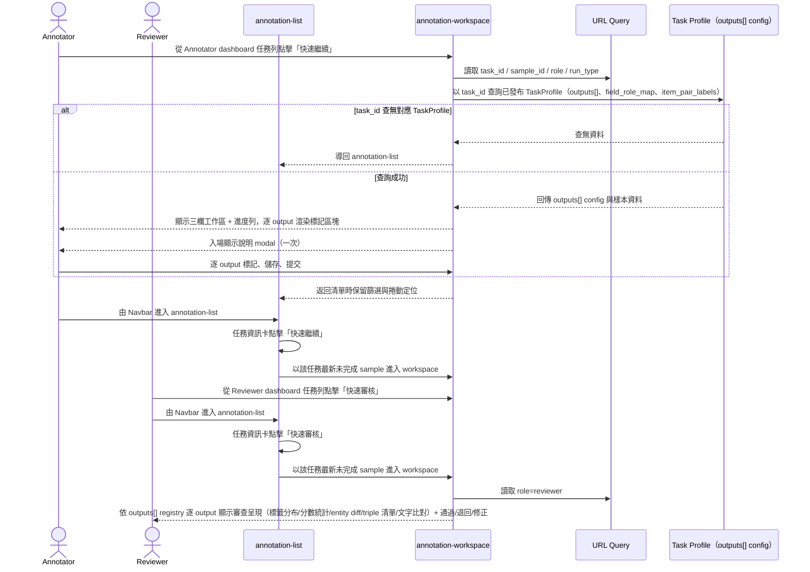
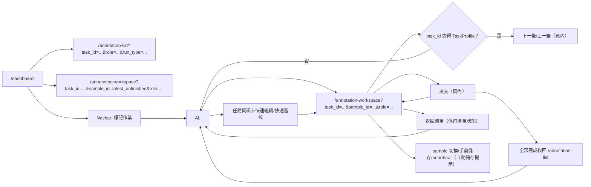

# 功能規格：Annotation List + Workspace — 標記清單與標記作業（Annotator / Reviewer）

**需求來源**: IA v1.3.1（2026-04-23）標記任務模組規範（`annotation-list` → `annotation-workspace`）；本版遷移對齊 task-management-013 v6.9.0 `OUTPUT_TYPE_REGISTRY` / `outputs[]` 契約，取代原本單一分類欄位驅動的舊版任務類型模型

## 已釐清事項

- 本版以既有需求來源、task-management-013 v6.9.0 outputs[] 契約，以及本文件中的流程圖、使用者情境、功能需求、成功標準作為 scope baseline。
- 跨頁或跨模組共用行為需透過「規格相依性」追蹤，不在本文件中隱含建立未列出的依賴。
- 若後續新增實作層契約，需先確認是否構成行為變更；若是，必須依 SDD 流程更新 spec。
- `docs/product/example-data` 的 13 份 fixture（T001–T013）僅為 prototype 示例基線；任意合法 `outputs[]` 組合皆適用，13 筆非白名單，不構成 workspace 可支援的輸出類型組合上限（對齊 013 v6.4.1／v6.4.3 changelog 措辭）。
- Reviewer 呈現改為 registry 驅動：每個 output type 定義自己的審查結果呈現方式（標籤分布、分數統計、entity diff、triple 清單、文字比對），不得逐 task 硬編分支；全部 8 個 output type 皆提供 reviewer row-level 直接修正入口，修正 UI 重用對應 annotator 作答互動控件並以 annotator 答案為初始值（seed），此為本規格 workspace 端呈現決策（見 FR-024L 系列），不需 013 registry 額外定義欄位。

## 規格常數

- `TASK_ROLES = annotator | reviewer`
- `RUN_TYPES = dry_run | official_run`
- `TASK_INPUT_TYPES = single_item | item_pair`（source of truth：task-management-013）
- `OUTPUT_TYPE_KEYS = sequence_tagging | entity_recognition | relation_identification | single_label | multi_label | single_dim | multi_dim | free_text`（source of truth：task-management-013 `OUTPUT_TYPE_REGISTRY`；本規格不重複定義各輸出類型的 schema 欄位，僅描述 workspace 標記/審查介面行為）
- `OUTPUT_TYPE_DEPENDENCIES`：`relation_identification` 可獨立使用；僅在任務同時選取 `entity_recognition` 與 `relation_identification` 時，兩者於 workspace 共用同一份文本與實體來源，呈現為整合標記/審查模式（對齊 013 FR-003d-4、FR-003d-11、FR-003d-13）；workspace 不得自動加入或移除此關聯
- `SEQUENCE_TAGGING_SCHEMES = BIO | BIOES | IOB2 | SINGLE`
- `SEQUENCE_TOKEN_UNITS = character | word`
- `FIELD_ROLES = evidence | input | output`
- `ANNOTATION_LIST_ROUTE = /annotation-list`
- `ANNOTATION_WORKSPACE_ROUTE = /annotation-workspace`
- `ANNOTATION_LIST_ROUTE_QUERY = task_id | role | run_type | q | status | sort | annotator_id | reviewer_id`（`annotator_id` / `reviewer_id` 為 v3.8.0 新增，見 FR-049）
- `ANNOTATION_WORKSPACE_ROUTE_QUERY = task_id | sample_id | role | run_type | annotator_id | reviewer_id`（同上）
- `SUBMISSION_BUCKET_DIMENSIONS = task_id × role × run_type × annotator_id × reviewer_id`（v3.8.0 新增；標記/審核提交紀錄的定址維度，見 FR-049。`role = annotator` 之紀錄無審核員維度）
- `ANNOTATION_IDENTITY_SOURCE = route_query_with_default`（v3.8.0 新增；`annotator_id` / `reviewer_id` 缺值時套用 `DEFAULT_ANNOTATOR_ID` / `DEFAULT_REVIEWER_ID`，與 `role` / `run_type` 的缺值處理一致，見 FR-049）
- `DEFAULT_ANNOTATOR_ID = kioleemg12`（v3.8.0 新增；刻意等同 `REVIEWER_MOCK_ANNOTATORS` 第一位，使訪客的真實提交與 FR-044a 的示範遞補屬於同一人，審核歷程為單一連續鏈而非分裂為兩個身分）
- `REVIEWER_ROSTER = reviewer_wang（王小明）| reviewer_li（李大華）| reviewer_chen（陳美玲，`can_arbitrate = true`）`（v3.8.0 新增；prototype 示範審核員名冊，地位同 `REVIEWER_MOCK_ANNOTATORS`，後端接上後由真實帳號取代。`can_arbitrate` 為爭議池第三人仲裁者旗標，本版僅定義欄位、不定義仲裁行為）
- `DEFAULT_REVIEWER_ID = reviewer_wang`（v3.8.0 新增；`REVIEWER_ROSTER` 第一位）
- `TASK_CONTEXT_SOURCE = route_query`（`role` / `run_type` 缺值或非支援值時套用預設值；`task_id` 查無對應 `TaskProfile` 時導回 `annotation-list`，不再有 localStorage fallback）
- `TASK_PROFILE_SOURCE = task-detail 已發布的 TaskConfig（task-management-013 outputs[] config、field_role_map、item_pair_labels）+ sample_snapshot_id`
- `GUIDELINE_PANEL_TABS = guideline-files | history`（Desktop 右欄提供「說明與檔案」/「歷程」雙頁籤，annotator 與 reviewer 視角一致；`歷程` 頁籤顯示當前樣本合併 annotator/reviewer 事件後的時序紀錄。2.1.0 的 `guideline-files-static` 暫定修訂已由使用者於 2.3.0 定案回滾，見 Changelog 2.3.0。Mobile 底部抽屜僅承載「說明與檔案」，不含歷程頁籤）
- `GUIDELINE_MODAL_BEHAVIOR = show-on-entry-per-page-load`
- `GUIDELINE_PANEL_COLLAPSE = desktop-toggleable`
- `SAMPLE_SOURCE_CONTRACT = sample_snapshot_id`
- `ANNOTATION_LIST_SOURCE = materialized AnnotationListItem from task-detail run publish events`
- `SUBMIT_DEFAULT_ACTION = go-to-next-sample`
- `SUBMIT_ALL_DONE_ACTION = redirect-to-annotation-list`
- `AUTOSAVE_TRIGGERS = on-sample-switch | on-save-click | heartbeat`
- `AUTOSAVE_HEARTBEAT_INTERVAL_SECONDS = 15`
- `CONFLICT_RESOLUTION_POLICY = optimistic-lock-with-version-check`
- `MOBILE_BP = 767px`
- `RWD_VIEWPORTS = 375px / 768px / 1440px`
- `REVIEWER_MOCK_ANNOTATORS = kioleemg12 | 113450022 | tony0950127`（US3 聚合審核卡的固定模擬標記員帳號，供 13 個任務 × 8 種輸出類型的審查流程端到端驗證；不含目前登入使用者本人的既有提交，見 `ReviewerMockRow（Prototype）`；**v3.0.0 起多標記員清單僅適用 `run_type = dry_run`，見 FR-044；v3.7.0 起 `official_run` 於無真實提交時以同源的 `REVIEWER_MOCK_ROWS` 第一列遞補 seed，見 FR-044a**）
- `REVIEW_MODEL_BY_RUN_TYPE = dry_run: consensus_adjudication | official_run: single_annotator_review`（v3.0.0 新增；reviewer 呈現依 `run_type` 分流的頂層規則來源，`annotation-list` 與 `annotation-workspace` 的 reviewer 視圖皆須讀取此規則決定渲染分支，不得逐頁各自硬編判斷，見 FR-030。**v4.0.0 廢止**：審核單位（FR-051）與審核卡版面（FR-053）皆不再依 `run_type` 分流，本常數已無消費端，ID 保留不重用）
- `REVIEW_UNIT_DIMENSIONS = sample_id × annotator_id × run_type`（v3.9.0 新增；審核單位的定址維度——同一樣本由 N 位標記員標記即為 N 個各自獨立的審核單位，兩種 `run_type` 一致，見 FR-051）
- `REVIEW_UNIT_STATUS = pending | approved | modified | disputed | finalized`（v3.9.0 新增；審核單位狀態機，單一狀態欄線性推進，見 FR-051）
- `MIN_REVIEWERS_DEFAULT = 1`（v3.9.0 新增；審核單位進入終態所需之最少審核員人數預設值。本版為固定值，可設定的 `min_reviewers` 屬後續 PR 範圍；此參數是 `approved`/`modified` 兩個中繼態存在的理由——同意或有異動但人數未達門檻）
- `CONSENSUS_MERGE_KEYS`（v3.0.0 新增；dry_run 共識合併鍵，逐輸出類型定義；**v4.0.0 起共識合併本身已廢止，本常數僅存續為 FR-052 審核單位差異比對的鍵定義來源**）：`entity_recognition` = `start + end + type` 精確匹配；`relation_identification` = `subj + obj + type` 精確匹配（`type` 缺值視為固定佔位鍵值，仍需精確相同）
- `DISPUTE_ITEM_SOURCE = derived-from-review-diffs`（v4.6.0 新增；爭議項（`DisputeItem`）於每次讀取時由 FR-052 差異比對推導、不實體化儲存，仲裁投票與定案值為僅有的寫入狀態，見 FR-059）
- `DISPUTE_CONVERGENCE_RULE = per-item-strict-majority`（v4.8.0 新增；單一爭議項於 N 位審核員間的嚴格多數（> N/2）自動收斂規則，未出現於 `reviewer_values` 的審核員計為對 `annotator_value` 的隱含同意票；N=1、偶數平手、全數分歧皆不收斂而留在爭議池待仲裁，見 FR-061）
- `DIM_CONSENSUS_TOLERANCE = 0.10 × (scale_max − scale_min)`（v3.0.0 新增，定案值；`single_dim`/`multi_dim` 一致性 gate 的固定容忍區間，取該題型量表滿分區間的 10% 為門檻，不採 std-based gate；一致性判定式為 `max − min ≤ DIM_CONSENSUS_TOLERANCE`，見 AC-3.22、FR-033。**v4.0.0 廢止**：dry_run 共識判定隨審核卡收斂一併移除，本常數已無消費端；審核單位差異比對明文不套用容差，見 FR-052）
- `SEQ_MAJORITY_INVALID_BIO_FALLBACK = mark-divergent`（v3.0.0 新增；`sequence_tagging` 逐 token 多數決若平手或拼出不合法 `BIO`/`BIOES` 序列，該 token 一律歸為分歧項，見 FR-035。**v4.0.0 廢止**：逐 token 多數決隨共識模型移除）
- `ADJUDICATION_STATUS = pending | consensus | overridden | divergent | adjudicated`（v3.0.0 新增；dry_run 逐項仲裁狀態機，見 FR-040。**v4.0.0 廢止**：仲裁狀態機隨共識模型移除；審核狀態改由 `REVIEW_UNIT_STATUS` 表達，見 FR-051）
- `GOLD_STATUS = draft | gold_confirmed`（v3.0.0 新增；dry_run 樣本層級 gold 狀態，`gold_reopened` 為狀態轉移歷程事件而非新狀態值——轉移後回到 `draft` 並記錄事件，見 FR-041、FR-043。v3.1.0 起為純資料模型狀態，工作區不再渲染專屬狀態徽章。**v4.0.0 廢止**：dry_run 不再產出樣本層級 gold，本常數與 `GoldRecord` 一併失效）

## 流程圖

```mermaid
sequenceDiagram
    actor AN as Annotator
    actor RV as Reviewer
    participant AL as annotation-list
    participant UI as annotation-workspace
    participant Query as URL Query
    participant Profile as Task Profile（outputs[] config）

    AN->>UI: 從 Annotator dashboard 任務列點擊「快速繼續」
    UI->>Query: 讀取 task_id / sample_id / role / run_type
    UI->>Profile: 以 task_id 查詢已發布 TaskProfile（outputs[]、field_role_map、item_pair_labels）
    alt task_id 查無對應 TaskProfile
        Profile-->>UI: 查無資料
        UI-->>AL: 導回 annotation-list
    else 查詢成功
        Profile-->>UI: 回傳 outputs[] config 與樣本資料
        UI-->>AN: 顯示三欄工作區 + 進度列，逐 output 渲染標記區塊
        UI-->>AN: 入場顯示說明 modal（一次）
        AN->>UI: 逐 output 標記、儲存、提交
    end
    UI-->>AL: 返回清單時保留篩選與捲動定位
    AN->>AL: 由 Navbar 進入 annotation-list
    AL->>AL: 任務資訊卡點擊「快速繼續」
    AL->>UI: 以該任務最新未完成 sample 進入 workspace

    RV->>UI: 從 Reviewer dashboard 任務列點擊「快速審核」
    RV->>AL: 由 Navbar 進入 annotation-list
    AL->>AL: 任務資訊卡點擊「快速審核」
    AL->>UI: 以該任務最新未完成 sample 進入 workspace
    UI->>Query: 讀取 role=reviewer
    UI-->>RV: 依 outputs[] registry 逐 output 顯示審查呈現（標籤分布/分數統計/entity diff/triple 清單/文字比對）+ 通過/退回/修正
```

| Step | Role | Action | System Response |
|------|------|--------|----------------|
| 1 | `annotator` / `reviewer` | 由 dashboard 任務列點擊 `快速繼續/快速審核` | 直接導向 `annotation-workspace`，並帶入該任務「最新未完成 sample」的 `sample_id` |
| 2 | 使用者 | 由 navbar 進入 `annotation-list`，點擊單筆資料或任務資訊卡 `快速繼續/快速審核` | 導向 `annotation-workspace` 並帶入 `task_id/sample_id/run_type/role` |
| 3 | 系統 | 以 `task_id` 查詢已發布 `TaskProfile`（`outputs[]` config、`field_role_map`、`item_pair_labels`）與樣本資料 | 查無對應 `TaskProfile` 時導回 `annotation-list`；查詢成功時載入固定樣本、說明檔案與進度（原型內建資料） |
| 4 | `annotator` | 依 `outputs[]` 逐一完成各 output 的標記、儲存、提交 | 更新完成數；未完成全筆次時提交後預設進入下一筆，全部提交後導回 `annotation-list` |
| 5 | `reviewer` | 依 registry 呈現逐 output 審查結果、通過/退回、必要時修正 | 產生審查結果與歷程 |
| 6 | 使用者 | 返回清單 | 保留清單篩選條件與捲動定位 |
| 7 | 使用者 | 中途操作 | 由 sample 切換、儲存、heartbeat 觸發自動儲存提示 |

> **v3.0.0 起**：Step 5 的 reviewer 呈現依 `run_type` 分流（`REVIEW_MODEL_BY_RUN_TYPE`）——`dry_run` 採共識合併 + gold 仲裁模型，`official_run` 採單標記員通過/退回模型；兩者不再共用同一套「逐標記員通過/退回 + 批次全通過/全退回」介面。詳見使用者故事 3（dry_run 共識仲裁）與使用者故事 6（official_run 單標記員審核）。

---

## 使用者情境與測試 *(必填)*

### 使用者故事 1 — 快速入口與清單入口並存（優先級：P1）

Annotator / Reviewer 進入標記模組時，支援兩種入口：dashboard 任務列可直接進入 `annotation-workspace`；navbar 入口則先進 `annotation-list` 再選筆次進入。

**此優先級原因**：需同時滿足 dashboard 的快速續作路徑與 annotation-list 的檢索/篩選操作。
**獨立測試方式**：分別由 dashboard 與 navbar 進入標記模組，驗證快速入口可直達工作區，清單入口可由單筆與任務資訊卡導向工作區。

**驗收情境**：

1. **AC-1.1**：**Given** 使用者點擊 dashboard 任務卡中的非 `快速繼續/快速審核` 區域，**When** 進入標記模組，**Then** 先進入對應任務的 `annotation-list`，並帶入 `task_id/run_type/role`。
2. **AC-1.2**：**Given** 使用者點擊 dashboard 任務卡「快速繼續/快速審核」，**When** 進入標記模組，**Then** 直接進入 `annotation-workspace`，且帶入該任務最新未完成 sample 的 `sample_id`。
3. **AC-1.3**：**Given** 使用者於清單點擊任一筆資料列（Annotator 視圖）或該列 `編輯` 按鈕（兩種視圖皆適用），**When** 觸發導頁，**Then** 導向 `annotation-workspace` 並帶入 `task_id/sample_id/run_type/role`，且工作區初始化後必須停留在該 `sample_id` 對應的樣本。**v4.2.0 修訂**：Reviewer 視圖下資料列已無可展開內容（一列即一個審核單位，見 FR-055），點擊資料列本身改為與 `編輯` 相同的導頁動作，並額外帶出該列的 `annotator_id`（見 AC-1.16）。
4. **AC-1.4**：**Given** 使用者於清單任務資訊卡點擊「快速繼續/快速審核」，**When** 觸發導頁，**Then** 導向 `annotation-workspace` 並帶入該任務最新未完成 sample 的 `sample_id`。
5. **AC-1.5**：**Given** 使用者從工作區返回清單，**When** 回到 `annotation-list`，**Then** 保留當前任務上下文與捲動位置。
6. **AC-1.6**：**Given** 清單中某筆資料被他人鎖定，**When** 點擊該筆，**Then** 顯示鎖定狀態並提供唯讀檢視或稍後再試。
7. **AC-1.7**：**Given** 使用者於標記清單切換完成狀態篩選，**When** 選擇 `已提交/草稿/待處理`，**Then** 清單只顯示符合該完成狀態的資料列。
8. **AC-1.8**：**Given** annotator 或 reviewer 進入 `annotation-list`，**When** 任務資訊卡渲染，**Then** 進度摘要顯示與 Dashboard 同任務、同角色列項一致的工作統計（annotator：完成率/今日完成/平均速度；reviewer：待審筆數/進度/IAA），後接 run-scoped 清單筆數，且進度條寬度等於該完成率百分比。
9. **AC-1.9**：**Given** `run_type = dry_run` 進入 `annotation-list`，**When** 任務資訊卡渲染，**Then** 清單筆數段顯示 `試標回合 R{n} · 本回合清單 {total} 筆`；TaskProfile 未宣告對應 materialized run context 時回合顯示 R1、筆數回退 `datasetRecords` 長度。
10. **AC-1.10（v3.0.0 新增，v3.2.0 修訂；v4.2.0 廢止）**：~~`official_run` reviewer 清單每筆樣本僅一列單一標記員資料，可展開為 1 列明細。~~ 清單粒度改為「樣本 × 標記員」且無展開明細，由 AC-1.14 取代；ID 保留不重用（見 FR-055）。
11. **AC-1.11（v3.0.0 新增；v4.2.0 廢止）**：~~`official_run` reviewer 於清單點擊「送出審核」，驗證條件為「每筆樣本 1 個決策」。~~ 清單層級決策與「送出審核」動作於兩種 `run_type` 皆移除，決策唯一入口為工作區審核卡（FR-053）；由 AC-1.16 取代，ID 保留不重用（見 FR-055）。
12. **AC-1.12（v3.0.0 新增；v4.2.0 廢止）**：~~`dry_run` reviewer 展開資料列可見多標記員比對總覽。~~ 展開明細整體移除——一列即一個審核單位，其標記員答案已直接呈現於該列（AC-1.14）；ID 保留不重用（見 FR-055）。
13. **AC-1.13（v3.0.0 新增；v4.2.0 廢止）**：~~`dry_run` reviewer 點擊 `編輯` 導向共識合併／gold 仲裁畫面。~~ 共識合併／gold 仲裁已於 v4.0.0 整體廢止，導頁目標改為逐標記員審核卡；由 AC-1.16 取代，ID 保留不重用（見 FR-055）。
14. **AC-1.14（v4.2.0 新增，對應 FR-055）**：**Given** `role = reviewer` 進入 `annotation-list`，**When** 檢視資料清單，**Then** 每一列恰對應一個審核單位（`REVIEW_UNIT_DIMENSIONS`＝`sample_id × annotator_id × run_type`）——同一樣本由 N 位標記員標記即展開為 N 個連續資料列，各列顯示同一樣本 ID 與文本摘要、各自的標記員帳號與**該標記員本人**的逐輸出類型答案摘要 tag；**And** 分頁總筆數計審核單位數而非樣本數；**And** 本規則於 `dry_run` 與 `official_run` 完全一致，不因 `run_type` 分流。
15. **AC-1.15（v4.2.0 新增，對應 FR-055）**：**Given** `role = reviewer` 於清單檢視狀態欄與狀態篩選，**When** 渲染完成，**Then** 狀態語彙為 `REVIEW_UNIT_STATUS` 五態（`待審 / 已同意 / 已修改 / 爭議中 / 已定稿`）而非標記完成三態，篩選選項由該常數推導（不得於選單硬編狀態清單）；**And** 選取任一狀態時清單只留下該狀態的審核單位，無符合者顯示空狀態；**And** `role = annotator` 之視圖維持既有 `已提交 / 已儲存 / 待處理` 三態（AC-1.7 不受影響）。
16. **AC-1.16（v4.2.0 新增，對應 FR-055）**：**Given** `role = reviewer` 於清單點擊任一列的 `編輯` 按鈕或資料列本身，**When** 觸發導頁，**Then** 導向 `annotation-workspace` 並帶入 `task_id/sample_id/run_type/role` 與**該列的 `annotator_id`**（沿用 FR-049 身分參數傳遞規則），使工作區審核卡開在同一個審核單位上；**And** 清單不得提供任何逐列或批次的 `通過` / `退回` 決策控件，亦不得提供 `送出審核` 按鈕——兩種 `run_type` 皆然。
17. **AC-1.17（v4.2.0 新增，對應 FR-055）**：**Given** `role = reviewer` 清單含標記分布統計欄，**When** 同一樣本展開為多個審核單位列，**Then** 各列統計欄顯示相同的跨標記員分布數值（統計單位仍為樣本，非審核單位），且與工作區統計取自同一實作來源；**And** 該欄純為唯讀比對脈絡，不承載任何決策語意。
18. **AC-1.18（v4.7.0 新增，對應 FR-060）**：**Given** 一個 `official_run` 審核單位因標記員與某審核員答案不一致而推導為 `爭議中`，**When** 具 `can_arbitrate` 旗標且未參與該單位審核的審核員開啟清單並選擇 `爭議中` 篩選，**Then** 恰顯示該爭議列（含 `爭議中` 徽章與標記員帳號），其列動作為 `仲裁`（`list-arbitrate-entry`），點擊後導向工作區且網址攜帶完整審核單位身分（`task_id / sample_id / annotator_id / reviewer_id`）；**And** 提交差異決策的當事審核員與未具旗標的審核員於同一爭議列維持 `編輯`；**And** 非 `disputed` 之列對任何審核員皆不出現 `仲裁`。

**介面定義（需與 IA 導覽語意一致）**：

- 區塊 A：`頁首資訊`
  - 必要元素：頁面標題與導引文案
- 區塊 B：`任務資訊卡`
  - 必要元素：任務名稱、進度摘要、依 `outputs[].type` 順序顯示的一至多個輸出類型 tag（registry-driven，對齊 012 Dashboard／010 Task List 的呈現契約）、Run Type badge、狀態 badge、進度條
  - 進度摘要組成：以「工作統計 + run-scoped 清單筆數」依序以 ` · ` 串接。工作統計依角色呈現——annotator 為 完成率/今日完成筆數/平均速度，reviewer 為 待審筆數/進度/IAA——且數值必須與 Dashboard 同任務、同角色列項的工作統計一致（同一資料來源，不得兩處各自維護）；清單筆數段依 `run_type` 呈現——`dry_run` 為 `試標回合 R{n} · 本回合清單 {total} 筆`（無 materialized run context 時回合預設 R1），`official_run` 為 `共 {total} 筆資料`
  - 進度條：以工作統計的完成率百分比呈現；該任務於當前 run 全數提交時覆寫為 100%（狀態 badge 同步顯示 `已完成`）；查無對應工作統計時，進度摘要回退為僅顯示清單筆數段、進度條顯示 0%
  - 必要元素（操作）：`快速繼續`（annotator）或 `快速審核`（reviewer）按鈕，位置需與 Dashboard 任務列表一致（卡片右側操作區）
  - 位置規範：必須位於篩選列上方（頁首資訊下方、資料清單上方）
  - 視覺樣式：必須與 Dashboard 任務列表列項樣式一致（`list-item` + `badge` + `progress`）
- 區塊 C：`資料清單（Annotator 視圖）`
  - 必要元素：樣本 ID、完成時間、完成狀態、標記者、文本摘要
  - 必要元素（操作）：每列需提供 `編輯` 按鈕，作為進入該筆 `annotation-workspace` 的顯式 CTA
  - 視覺樣式：表格容器與欄位樣式需與 `task-list` 一致（同級 toolbar + table shell）
  - 顯示限制：不顯示「任務資料清單」區塊標題文字
  - 列表底部：需顯示與 `task-list` 相同視覺語法的 footer pagination
- 區塊 C'：`資料清單（Reviewer 視圖）`
  - **v4.2.0 起不再依 `run_type` 分流（BREAKING）**：兩種 `run_type` 共用同一份清單契約——一列即一個審核單位（`sample_id × annotator_id × run_type`），無展開控制項、無展開明細、無任何清單層級決策控件（見 FR-055、AC-1.14 ~ AC-1.17）。v3.0.0 的 `dry_run` 唯讀總覽／`official_run` 單標記員截斷兩種分流一併廢止。
  - 必要元素：樣本 ID、標記員帳號、審核狀態（`REVIEW_UNIT_STATUS` 五態）、完成時間、文本摘要、該標記員本人的逐輸出類型標記結果摘要 tag、依 `outputs[].type` registry 呈現的標記分布統計
  - 必要元素（操作）：每列提供 `編輯` 按鈕（見 AC-1.3、AC-1.16），為進入該審核單位 `annotation-workspace` 的入口，且必須帶出該列的 `annotator_id`；清單不提供批次或逐列的 `通過` / `退回` 決策控件，亦不提供 `送出審核` 按鈕（兩種 `run_type` 皆然）
  - 標記結果摘要 tag 呈現規則：`multi_dim` 以 `[v1, v2, …]` 陣列格式依維度序呈現各維度值；標記員於某輸出類型標記 Bypass 時，該 tag 改顯示 `無法判定 (Bypass)` 標示；無作答時顯示佔位文字；任務含多個輸出類型時，同列每個輸出類型各一個 tag，於欄寬不足時換行而非撐寬欄位
  - 標記分布統計呈現規則（依 `outputs[].type` registry 驅動，不得逐 task 硬編；統計算法必須與工作區標記分布統計盒（FR-014F）取自同一單一實作來源，不得清單與工作區各自計算造成數字漂移）：`single_label` / `multi_label` / `sequence_tagging` / `entity_recognition` / `relation_identification` 以 `{label}×{n}` 依出現次數降冪並以 `·` 串接（`sequence_tagging` 計 tag、`entity_recognition` 計實體類型、`relation_identification` 計關係類型）；`single_dim` 顯示 `mean : m , std : s`（2 位小數）；`multi_dim` 以多行區塊呈現——第一行 `mean [m1, m2, …]`、第二行 `std [s1, s2, …]`（皆 2 位小數、依維度序），其後每個維度一行 `±1.5std {維度名} : lo~hi`（界值 3 位小數，lo/hi = mean ∓ 1.5·std；維度標籤為 config 維度名稱，不得逐任務硬編縮寫）；`free_text` 顯示固定說明句「自由文本任務 — 請並列比對各標記員結果」；已標記 Bypass 的標記員結果不計入統計；任務含多個輸出類型時，統計欄每個輸出類型各佔一行並以其輸出類型名稱前綴，`multi_dim` 的多行區塊完整置於其前綴行之後
  - 一致度/IAA 資訊呈現規則（**v4.2.0 廢止逐列呈現**）：一致度／IAA 為樣本層級指標，在審核單位粒度下沒有對應對象，隨展開明細一併移除；任務層級 IAA 仍由任務資訊卡進度摘要承載（AC-1.8），不得由清單另行計算造成數字漂移
  - 標記結果顏色標記（`single_dim` / `multi_dim` 類任務）：每列該標記員的維度值 result tag 依該筆樣本跨標記員統計（mean/std，Bypass 不計入）之偏差程度著色：🔴 紅色（`result-tag-red`）：任一維度偏差超過 `1.5·std`；🔵 藍色（`result-tag-blue`）：任一維度偏差超過 `1·std`（未達紅色門檻）；🟢 綠色（`result-tag-green`）：其餘（含 `std = 0`）；優先順序：紅色 > 藍色 > 綠色；標記 Bypass 的列不著色；規則與工作區 reviewer 視圖的 ±1.5std 著色（FR-014A）為同一規則
  - 視覺樣式：與 Annotator 視圖共用相同 table shell（v4.2.0 起無展開行，原展開行背景 `#F8FAFC` 一併移除）
  - 列表底部：需顯示與 `task-list` 相同視覺語法的 footer pagination
- 區塊 D：`清單操作`
  - 必要元素：完成狀態篩選、關鍵字搜尋、清除篩選、點擊單筆進入作業、鎖定狀態提示
  - 分頁規則：
    - footer pagination 必須顯示總筆數與目前頁數資訊（例如 `共 5 筆 · 第 1 / 1 頁`）
    - 必須提供每頁筆數切換（`20 / 50 / 100`）與上一頁 / 下一頁 / 頁碼按鈕
    - 視覺樣式、間距、按鈕狀態與 `task-list` pagination 一致

**行為規則**：

- dashboard 任務列中除 `快速繼續/快速審核` 以外的區域，必須導向對應任務的 `annotation-list`。
- dashboard 任務列 `快速繼續/快速審核` 必須直接導向 `annotation-workspace`，不經 `annotation-list`。
- navbar 進入標記作業時，仍以 `annotation-list` 為入口頁。
- 清單與工作區間必須以 `task_id/sample_id/run_type/role` 建立明確導頁契約；`task_id` 對應的 `outputs[]` 組合完全由 workspace 讀取 `TaskProfile` 取得，不再透過路由參數傳遞。
- `annotation-list` 必須讀取 task-detail 在 run 發布事件中建立完成的 `AnnotationListItem`，不得以任務原始資料集全量即時計算或預先生出清單。
- `run_type = dry_run` 時，`annotation-list` 只顯示指定 `trial_round` 已建立的試標清單；例如 R1 發布 10 筆時清單為 10 筆，R2 發布 10 筆時清單為該回合另一組 10 筆。
- `run_type = official_run` 時，`annotation-list` 只顯示 `開始正式標記` 時建立的正式標記清單，筆數為扣除所有已建立試標回合後的剩餘樣本總數。
- `annotation-workspace` 左側欄位標題固定顯示 `標記清單` / `Annotation List`；不得附加 `試標回合 R{n}`、`正式標記清單` 或 `Official list` 等 run label。筆數仍需依 materialized run context 顯示。
- `annotation-workspace` 初始化時，若 query 含有效 `sample_id`，必須以該樣本作為當前作用中項目；不得回退到固定預設索引。
- 「最新未完成 sample」判定規則：優先取最後一筆 `pending`，若無則取最後一筆 `saved`，若仍無則回退該任務最後一筆。
- 返回清單時需還原同一 `task_id` / `run_type` 上下文，並保留捲動定位。
- 清單必須支援依完成狀態篩選（`submitted | saved | pending`），並可清除篩選回到完整列表。
- 清單底部必須提供 footer pagination，且 Annotator / Reviewer 兩種視圖皆需顯示總筆數、目前頁數、每頁筆數切換與上一頁 / 下一頁 / 頁碼按鈕。
- 清單套用完成狀態篩選、關鍵字搜尋或清除篩選時，footer pagination 必須回到第 1 頁並以篩選後結果重算總筆數與頁數。
- 手機版（`<= MOBILE_BP`）清單首列不得因文本摘要換行造成異常大列高；需維持可快速掃讀的緊湊列高。
- （v4.2.0 修訂，取代 v3.0.0 的 `run_type` 分流規則）Reviewer 視圖下 `annotation-list` 兩種 `run_type` 皆不提供任何清單內決策：無逐列或批次的 `通過` / `退回`，亦無 `送出審核`。決策唯一入口為工作區審核卡（FR-053），清單的職責收斂為「列出審核單位並導向其審核卡」（見 AC-1.14 ~ AC-1.17、FR-055）。
- （v4.2.0 新增）清單的完成狀態篩選語彙依角色分流：`role = annotator` 為標記完成三態（`submitted | saved | pending`），`role = reviewer` 為 `REVIEW_UNIT_STATUS` 五態；兩者共用同一個篩選控件，選項必須由對應常數推導產生，不得於選單硬編。

---

### 使用者故事 2 — Annotator 完成跨輸出類型的逐筆標記（優先級：P1）

Annotator 可在同一工作區中，依任務 `outputs[]` 組成逐一完成各輸出類型的標記，並依 `run_type` 完成儲存與提交。

**此優先級原因**：標記作業是核心產出流程，且必須對任意合法 `outputs[]` 組合一致運作。
**獨立測試方式**：以 `annotator` 身分分別進入單一輸出、多輸出（含整合模式）任務，驗證載入、逐 output 作答、儲存、提交與進度更新。

**驗收情境**：

1. **AC-2.1**：**Given** `role=annotator` 且 `run_type` 合法，**When** 由 `annotation-list` 點擊單筆進入 `annotation-workspace`，**Then** 系統以 `task_id` 讀取 `TaskProfile`，依 `outputs[]` 順序逐一渲染各輸出類型的標記區塊，並顯示工作區與當前階段（Dry Run / Official Run）。
2. **AC-2.2**：**Given** 任務 `outputs[]` 含 2 個以上輸出類型，**When** annotator 進入工作區，**Then** 每個輸出類型各自獨立成一個標記區塊，任一區塊的互動只更新該區塊狀態，不影響其他輸出類型的既有作答。
3. **AC-2.3**：**Given** 正在標記樣本，**When** 點擊儲存，**Then** 系統保存草稿（含所有已作答輸出類型的暫存值）且更新該筆狀態。
4. **AC-2.4**：**Given** 已完成可提交條件（所有輸出類型皆已作答或已勾選 Bypass），**When** 點擊提交，**Then** 系統記錄提交並預設導向下一筆（`SUBMIT_DEFAULT_ACTION`）。
5. **AC-2.5**：**Given** 任務最後一筆完成提交，**When** 完成提交流程，**Then** 系統導回 `annotation-list` 並將該任務資料列狀態顯示為 `已提交`。
6. **AC-2.6**：**Given** 切換樣本或手動儲存，**When** 有編輯行為發生，**Then** 顯示自動儲存狀態更新（Saving → Saved）。
7. **AC-2.7**：**Given** annotator 由 Dashboard 或 annotation-list 進入任一任務工作區，**When** 查看中欄，**Then** 中欄不得顯示任務標題卡（任務名稱標題與卡內語言切換鈕）；任務名稱由右欄「說明與檔案」的任務說明摘要呈現（依 `task_id` 對應的實際任務名稱，與 reviewer 視角一致），語言切換由共用 sidebar 的語言切換鈕提供。
8. **AC-2.8**：**Given** 左欄標記清單，**When** 樣本經歷 未作答 → 儲存草稿 → 提交，**Then** 該筆樣本下方的完成狀態標籤依序顯示 `待標記` → `已儲存` → `已提交`，且其他樣本的狀態標籤不受影響。
9. **AC-2.9**：**Given** 中欄頂部樣本導覽列，**When** 點擊 `上一筆` / `下一筆`，**Then** 工作區切換至對應樣本；位於首筆時 `上一筆` 停用、位於末筆時 `下一筆` 停用；進度摘要顯示 `已提交筆數 / 總筆數`，並於提交後即時更新。
10. **AC-2.10**：**Given** 任務含有獨立題目內容（Evidence 或 input 欄位）的輸出類型，**When** annotator 進入工作區，**Then** 題目內容與標記控制項分別置於兩張獨立卡片，視覺上明確區隔。
11. **AC-2.11**：**Given** 右欄 `歷程` 頁籤，**When** annotator 儲存草稿或提交後切換至該頁籤，**Then** 顯示當前樣本的事件紀錄（操作者角色、時間、動作、對應輸出類型作答摘要），最新事件在前；尚無紀錄時顯示空狀態文案。**v4.9.0 修訂**：本清單受 FR-062 盲審隔離約束——其他審核員未提交的審核事件（含 `saved` 草稿事件）不得出現於清單（見 AC-4.25）。
12. **AC-2.12**：**Given** 中欄題目卡與標記卡，**When** annotator 檢視卡片內容，**Then** 題目卡內的 input 內容不得再包一層內框（卡片邊框為唯一外框），標記卡內不得出現殘留的水平分隔線或 Bypass 選項上方的虛線隔線，ER+RI 整合模式的整合預覽區塊亦不得再包一層外框；Bypass 選項自身的虛線外框保留。

**介面定義（需與 IA 導覽語意一致）**：

- 區塊 A：`上方任務目標列（固定）`
  - 必要元素：任務目標、操作指引、已標記數量、總量、當前階段、微型進度視覺
- 區塊 B：`三欄工作區（Desktop）`
  - 左欄：標記清單、目前定位；每筆樣本下方顯示三態完成狀態標籤（`已提交` / `已儲存` / `待標記`）；reviewer 視角下一列為一個審核單位，狀態標籤下方另加一行 `樣本 ID · 標記員帳號`（見 FR-056）
  - 中欄（上）：樣本導覽列——`上一筆` 按鈕、`已提交筆數 / 總筆數` 進度摘要（含進度條）、`下一筆` 按鈕；位於首筆/末筆時對應按鈕停用
  - 中欄（主體）：題目區塊與標記區塊以獨立卡片區隔——題目卡承載 Evidence 與 input 內容，標記卡承載依 `outputs[]` 順序逐一渲染的輸出類型標記區（見使用者故事 2A）；輸出類型無獨立題目呈現時（其標記區內嵌原文，如 `sequence_tagging`／`entity_recognition`），題目卡可省略
  - 卡片內視覺：卡片邊框為題目/標記區塊的唯一外框——題目卡內的 input 內容直接呈現，不得再包一層內框；標記卡內不得殘留水平分隔線（含區塊分隔線與 Bypass 選項上方的虛線隔線）；Bypass 選項自身的虛線外框為刻意設計，予以保留
  - 中欄（下）：底部操作列——左側自動儲存狀態（`草稿已自動儲存` / `儲存中…`）、右側 `儲存草稿` 與提交按鈕
  - 右欄：`說明與檔案` / `歷程` 雙頁籤（見 `GUIDELINE_PANEL_TABS`），預設顯示說明與檔案
- 區塊 C：`Mobile 佈局`
  - 精簡任務目標列 + 主操作區
  - 說明與檔案使用底部抽屜（預設收合，可展開；抽屜僅承載說明與檔案，`歷程` 頁籤為 Desktop 右欄功能）

**行為規則**：

- `annotation-workspace` 只能讀取由 task-detail 發布時凍結的 `sample_snapshot_id`。
- `annotation-workspace` 必須讀取 task-detail 發布時凍結的 `TaskProfile`（`outputs[]` + `field_role_map` + `item_pair_labels`），依 `outputs[]` 逐一選擇標記控制項；不得在 workspace 內硬編任務專屬邏輯。
- Dry Run 與 Official Run 樣本切分不可在 workspace 端重算或覆寫。
- 右欄 `說明與檔案` 在翻筆（上一筆/下一筆）後必須持續可見。
- 原型入場時固定顯示說明 modal 一次；關閉後右欄仍固定顯示說明內容。
- Desktop 右欄支援收合/展開切換按鈕，收合後可再次展開。
- 提交後預設停留於 workspace 並載入下一筆；任務全部完成時導回 `annotation-list`（`SUBMIT_ALL_DONE_ACTION`）。
- 提交前必須驗證 `outputs[]` 中每個輸出類型皆已完成作答或已勾選 Bypass；任一輸出類型未完成時阻擋提交並提示對應區塊。
- 中欄不得渲染任務標題卡（含任務名稱 header 與卡內語言切換鈕）；此規則同時適用於 annotator 與 reviewer 視角。任務名稱僅由右欄「說明與檔案」的任務說明摘要呈現，來源必須優先使用 `task_id` 對應的實際任務名稱，僅在缺少任務上下文時，才可退回輸出類型層級的預設文案。工作區語言切換改由共用 sidebar 的語言切換鈕提供，與其他頁面一致。

---

### 使用者故事 2A — 依輸出類型完成各種作答控制項（優先級：P1）

Annotator 依任務 `outputs[]` 中每個輸出類型的 registry schema，完成對應的分類、回歸、序列、生成類作答；多輸出任務可在同一畫面逐一完成，`entity_recognition` 與 `relation_identification` 同時選取時以整合模式呈現。

**此優先級原因**：8 種輸出類型與其組合是標記作業的核心產出邏輯；控制項必須完全由 config 驅動，不得為個別任務硬編。
**獨立測試方式**：分別以單一輸出類型任務與多輸出組合任務（含 ER+RI 整合）進入工作區，驗證各控制項的作答、驗證與提交 payload。

**驗收情境**：

1. **AC-2A.1（single_label）**：**Given** `outputs[]` 含 `single_label` 且 config 提供 `label_options`，**When** annotator 點擊任一標籤 chip，**Then** 該輸出類型切換為單選狀態（互斥），儲存草稿時記錄 `{selected}`。
2. **AC-2A.2（multi_label）**：**Given** `outputs[]` 含 `multi_label`，**When** annotator 於階層選擇器勾選一至多個節點（含 branch 與 leaf），**Then** 已選 chip 僅顯示節點名稱，儲存草稿時記錄完整 `LabelPath[]`；超過 `max_selections`（非 0）時阻擋新增選取並提示上限，上限提示文字樣式與工作區其他欄位提示一致。
3. **AC-2A.2a（multi_label 選擇器覆蓋層）**：**Given** `outputs[]` 含 `multi_label` 且階層選擇器已展開，**When** annotator 檢視標記卡，**Then** 選擇器為最上層不透明覆蓋層，完整遮蓋其後方內容（含 Bypass 勾選項），無任何後方元素穿透顯示；關閉選擇器（關閉鈕／Escape／再次點擊觸發器／點擊選擇器外任意處）後方可操作被遮蓋的控制項。
4. **AC-2A.3（single_dim）**：**Given** `outputs[]` 含 `single_dim`，**When** annotator 拖曳滑桿或於 number input 輸入數值，**Then** 滑桿、當前值標籤與 number input 於 100ms 內雙向同步，且值落於 config `min`/`max` 範圍內；當前值標籤於任何時刻皆顯示滑桿當前數值（Output-role preannotation 依 FR-024M 顯示實際值；無儲存值時顯示滑桿的範圍中點起始位置），不得以佔位符號取代數字——唯 Bypass 勾選中例外，此時顯示未評分佔位符號；`status=pending` 且無儲存值時滑桿數值不計為已作答，提交閘門依 AC-2A.10 阻擋，不得以視覺中點作為有效值提交。
5. **AC-2A.4（multi_dim）**：**Given** `outputs[]` 含 `multi_dim`，**When** annotator 調整任一維度滑桿或 number input，**Then** 僅該維度數值更新並雙向同步，各維度使用不同輔助色但同時保留文字標籤；每個維度的當前值標籤於任何時刻皆與該維度滑桿及 number input 顯示相同數值（含未調整維度——Output-role preannotation 依 FR-024M 顯示實際值，無 preannotation 時顯示範圍中點起始位置），不得以佔位符號取代數字——唯 Bypass 勾選中例外，此時全部維度顯示未評分佔位符號；未評分維度的滑桿數值不計為已作答，不得作為有效值提交（依 FR-024M 之 Output-role preannotation 不在此限）。
6. **AC-2A.5（sequence_tagging）**：**Given** `outputs[]` 含 `sequence_tagging`，**When** annotator 依 config `tagging_scheme` 選擇 tag 後點擊 Token，**Then** 該 Token 依方案套用完整 tag（`BIO`/`BIOES`/`IOB2` 每個實體起點使用 `B`；`SINGLE` 為直接類型標籤或 `O`）；Token 邊界由後端依 `tokenization.unit` 提供的正式切分結果決定（見 ADR-031），workspace 不得自行重新切分覆寫正式邊界。
7. **AC-2A.6（entity_recognition）**：**Given** `outputs[]` 含 `entity_recognition`，**When** annotator 先圈選文字再選擇實體類型，或先選擇實體類型再圈選文字，**Then** 兩種順序皆可成功建立實體並記錄 `text/type/start/end`（半開區間）；未先圈選文字即點擊實體類型按鈕時顯示錯誤且不得建立實體。
8. **AC-2A.7（relation_identification 純模式）**：**Given** `outputs[]` 僅含 `relation_identification`（未選 `entity_recognition`），**When** annotator 於原始文本反白選取文字後依序按下 `E1/Arg1 → Relation → E2/Arg2` 逐格填入草稿、最後按「新增」，**Then** 系統以資料集既有唯讀實體作為 E1/E2 候選（不顯示實體建立或刪除控制項），E1/E2 步驟僅接受與既有實體相符的選取（不符時顯示錯誤且不填入）、Relation 步驟接受任意選取範圍作為關係觸發詞；三個草稿欄位未全部填妥前「新增」為 disabled，「退回」依 E2 → Relation → E1 順序逐格撤回草稿（草稿為空時 disabled）。此循序建構器與 task-new Step 2 標記預覽為同一互動控制。
9. **AC-2A.8（entity_recognition + relation_identification 整合模式）**：**Given** `outputs[]` 同時含 `entity_recognition` 與 `relation_identification`，**When** annotator 於整合預覽建立實體後接續建立三元組，**Then** 兩者共用同一份文本與可編輯實體來源，實體列表與三元組列表合併呈現於同一區塊，且各自的作答仍分別記錄為獨立的 `entity_recognition` 與 `relation_identification` OutputAnswer。
10. **AC-2A.9（free_text）**：**Given** `outputs[]` 含 `free_text`，**When** annotator 於 textarea 輸入文字，**Then** 系統即時顯示字元計數 `N / max_length`，超過 `max_length` 時阻擋繼續輸入；`input_instruction` 與 `output_instruction` 必須顯示 config 設定的文案。
11. **AC-2A.10（多輸出任務同畫面）**：**Given** `outputs[]` 含 3 個以上輸出類型（例如 `entity_recognition + relation_identification + multi_dim`），**When** annotator 依序完成各區塊作答，**Then** 全部區塊皆可在同一 sample 頁面內完成，任一區塊尚未完成時提交按鈕阻擋並提示對應區塊，其餘已完成區塊的作答不受影響。

**行為規則**：

- 每個輸出類型的標記控制項必須依 `OUTPUT_TYPE_KEYS` 與該類型的 registry config 動態決定，不得在 workspace 內為特定輸出類型名稱或組合寫死條件分支。
- `sequence_tagging` 的正式 Token 邊界由後端提供（ADR-031：tokenization 為 annotation 資料契約的一部分，engine/version 依任務凍結）；workspace 僅依 `tokenization.unit`／`tagging_scheme` 呈現與互動，不得於生產標記流程自行以瀏覽器 API 重新切分。
- `field_role_map` 中標記為 `output` 角色的欄位值，是任務建立者明確指定的 annotator-visible preannotation，允許用於初始化各輸出類型的預覽/作答狀態（對齊 013 FR-003g-5）；隱藏的 test-set ground truth 仍不得透過此路徑或任何其他路徑下發（見 FR-023）。
- 每個輸出類型的作答狀態彼此獨立；切換或儲存某一輸出類型不得清除或覆寫其他輸出類型的既有作答。
- `outputs[]` 中僅含 `relation_identification` 時，既有實體來源固定為資料集提供的唯讀候選；只有同時選取 `entity_recognition` 時，實體才可由 annotator 建立/修改。

---

### 使用者故事 2B — item_pair 輸入型態與 Evidence 呈現（優先級：P1）

Annotator 在 `input_type = item_pair` 的任務中，以雙欄呈現兩個比較項目；任一輸出類型於 registry 宣告需要 Evidence 呈現時（例如 `free_text`），Evidence 卡片須顯示於 Input 內容與作答控制項之前。

**此優先級原因**：item_pair 輸入型態（原句對任務）與 Evidence 呈現是既有研究情境的必要輸入契約，若缺少 workspace 規格，task-new / task-detail 的 `item_pair` 與 Evidence 設定無法落地。
**獨立測試方式**：以 `input_type=item_pair` 任務與含 Evidence 欄位的 `free_text` 任務分別進入工作區，驗證雙欄呈現、項目對名稱、Evidence 卡位置與 instruction 呈現。

**驗收情境**：

1. **AC-2B.1**：**Given** `TaskProfile.input_type = item_pair`，**When** annotator 進入工作區，**Then** 中欄以雙欄呈現兩個項目內容，區塊小標分別顯示 `TaskProfile.item_pair_labels` 的兩個項目對名稱（若缺值則回退顯示對應 Input 欄位原始名稱）。
2. **AC-2B.2**：**Given** `TaskProfile.input_type = single_item`，**When** annotator 進入工作區，**Then** 中欄僅顯示單一「原始文本」區塊，不得顯示雙欄配對版面。
3. **AC-2B.3**：**Given** 任一已選輸出類型於 registry 宣告 `rendersEvidencePreview: true`（目前為 `free_text`）且 `field_role_map` 已指定 Evidence 角色欄位，**When** annotator 進入工作區，**Then** 「背景參考 (Evidence)」卡片必須顯示於 Input 內容卡與該輸出類型作答控制項之前；未指定 Evidence 時不得顯示空的背景區塊。
4. **AC-2B.4**：**Given** `outputs[]` 含 `free_text`，**When** annotator 進入工作區，**Then** 必須依序顯示 `input_instruction`、Input 內容卡、`output_instruction`、作答 textarea 與字元計數。

**行為規則**：

- `item_pair` 的雙欄小標名稱來源為 `TaskProfile.item_pair_labels`，僅影響顯示文案，不改變 `field_role_map` 或資料欄位本身。
- Evidence 呈現位置與是否顯示完全由該輸出類型 registry 的 `rendersEvidencePreview` metadata 決定，workspace 不得為特定輸出類型硬編顯示順序例外。
- 當多個已選輸出類型宣告 `rendersInputPreview: true`（例如 `sequence_tagging`、`entity_recognition`、`relation_identification`、`free_text`）時，通用輸入文字區塊不得重複顯示；輸入內容改由該輸出類型的專屬或整合預覽完整呈現，行為對齊 013 FR-003g-3。

---

### 使用者故事 3 — Reviewer Dry Run 逐標記員審核（優先級：P1）（v4.0.0 改寫，原「共識合併與 Gold 仲裁」）

Reviewer 在 `run_type = dry_run` 的工作區中，依任務 `outputs[]` 逐一查看每個輸出類型的標記員答案共識合併結果（一致項預接受、分歧項待裁定），必要時對任一輸出類型執行 gold 仲裁（重用對應 annotator 作答控件並以合併共識為初始值），並追溯每筆裁定歷程。個人標記品質問題不在本流程處理，而是交由任務層級 IAA 閘門與重新試跑機制（概念性提及，細節屬 dataset-017／後端範圍）。

**⚠️ v3.0.0 適用範圍收斂**：本故事（含 AC-3.2 ~ AC-3.19，以及對應 FR-014A、FR-014E ~ FR-014M）自本版起僅適用 `run_type = dry_run`。原 AC-3.1 所述「Dry Run 與 Official Run 都顯示相同通過/退回操作」的模型自本版廢止，由 AC-3.1A 取代；`official_run` 的單標記員審核行為改由使用者故事 6（AC-6.1 ~ AC-6.5）定義，不再套用本故事所述之多標記員統計盒、批次操作與逐標記員清單。`dry_run` 完全採共識合併 + gold 仲裁模型，**取代**逐標記員通過/退回與批次全通過/全退回（AC-3.7、AC-3.13、AC-3.14 所述批次操作標註為已廢止，不提供「退回個人重標」通道）。

**⚠️ v4.0.0 適用範圍再次收斂（BREAKING）**：審核單位為「樣本 × 標記員」（FR-051），一張審核卡審的是**一位**標記員的答案，因此本故事所述之跨標記員共識合併與 gold 仲裁模型**整體廢止**：`dry_run` 與 `official_run` 自本版起共用同一張審核卡，其版面契約由 FR-053 定義並沿用使用者故事 6 的 FR-014P（無型別標題、決策按鈕位於 Bypass 列）。隨之廢止者：**AC-3.2 ~ AC-3.6、AC-3.11、AC-3.17 ~ AC-3.30**（跨標記員統計盒、標記員清單、原始文本聯集卡、共識/分歧判定、套用多數決、gold 送出驗證）與 **FR-030 ~ FR-043**；仍適用者：AC-3.8 ~ AC-3.10（修正入口重用 annotator 控件並保留 diff，seed 來源改為受審標記員本人答案）、AC-3.31、AC-3.32（純 relation 任務的實體 scaffolding 與逐型別 seed 隔離）、AC-3.33 ~ AC-3.36（本版新增）。「退回個人重標」通道仍不提供，個別標記品質仍經任務層級 IAA 閘門處理。

**此優先級原因**：Dry Run 一致性與正式資料品質依賴 reviewer 的共識裁定，且審查呈現必須對任意合法 `outputs[]` 組合一致運作。
**獨立測試方式**：以 `reviewer` 身分進入 `run_type=dry_run` 且涵蓋不同輸出類型組合的待審任務，驗證各輸出類型的共識合併呈現、一致項預接受、分歧項裁定與 History 追溯欄位。

**驗收情境**：

1. **AC-3.1（已廢止 v3.0.0）**：~~**Given** `role=reviewer`，**When** 進入工作區，**Then** 在 Dry Run 與 Official Run 都顯示 reviewer 可用操作（通過 / 退回），且依 `outputs[]` 順序逐一顯示每個輸出類型的審查摘要。~~ 本情境所述模型已廢止，由 AC-3.1A 取代；ID 保留不重用。
1A. **AC-3.1A（v3.0.0 新增）**：**Given** `role=reviewer`，**When** 進入工作區，**Then** 系統依 `run_type` 分流呈現（`REVIEW_MODEL_BY_RUN_TYPE`）：`dry_run` 顯示共識合併＋gold 仲裁介面（依 `outputs[]` 順序逐一顯示各輸出類型的合併結果，一致項預接受、分歧項待裁定，無逐標記員通過/退回、無批次全通過/全退回）；`official_run` 顯示單標記員審核介面（見使用者故事 6）。
2. **AC-3.2**：**Given** `outputs[]` 含 `single_label` / `multi_label` / `sequence_tagging`，**When** reviewer 查看審查摘要，**Then** 顯示各標籤（或 tag）的出現次數分布。
3. **AC-3.3**：**Given** `outputs[]` 含 `single_dim` / `multi_dim`，**When** reviewer 查看審查摘要，**Then** 顯示各維度的 `mean`、`std` 與 `±1.5std` 範圍，且各標記員的維度值 result tag 依跨標記員偏差程度著色（綠/藍/紅，優先序紅 > 藍 > 綠，規則見 FR-014A）；`multi_dim` 的 result tag 以 `[v1, v2, …]` 陣列格式依維度序呈現為單一 tag。
4. **AC-3.4**：**Given** `outputs[]` 含 `entity_recognition`，**When** reviewer 查看審查摘要，**Then** 每位標記員的實體結果以與標記員「實體列表」相同的列樣式逐行呈現（每列：實心型別色底徽章＋標記文字＋`(start, end)` token 位置＋列右「刪除」按鈕，徽章顏色取自任務 entity config，見 FR-014M），並可執行直接修正（新增/刪除/修改實體，重用 annotator 的 entity 建構器並以其提交結果為初始值）。
5. **AC-3.5**：**Given** `outputs[]` 含 `relation_identification`，**When** reviewer 查看審查摘要，**Then** 每位標記員的 triple 清單以與標記員「關係識別」清單相同的列樣式呈現（每筆三元組一列：主體與客體實體文字粗體並附 `(start,end)` token 位置、關係觸發詞 pill 附位置、有語意關係類型時附「類型：X」徽章，列右側提供可操作的「類型」下拉與「刪除」按鈕，見 FR-014L），並可執行直接修正（重用 annotator 的關係建構器並以其提交結果為初始值；純模式與整合模式皆不提供 reviewer 直接改寫實體的入口，僅可調整/新增/刪除 triple）。
6. **AC-3.6**：**Given** `outputs[]` 含 `free_text`，**When** reviewer 查看審查摘要，**Then** 以可掃讀方式並列顯示各標記員的文字內容供比對，並可執行直接修正（重用 annotator 的 textarea 控件並以其提交文字為初始值）。
7. **AC-3.7（已廢止 v3.0.0）**：~~**Given** reviewer 需快速處理同一句的多位標記員結果，**When** 點擊 `全部通過` 或 `全部退回`，**Then** 系統必須以勾選式批次套用到所有標記員列。~~ 批次全通過/全退回已由共識合併模型取代；快速處理分歧項改用「套用多數決至全部分歧項」（見 AC-3.28、FR-039），語意不同，不得混用同一元件或文案。ID 保留不重用。
8. **AC-3.8**：**Given** reviewer 退回或通過某位標記員結果，**When** 送出審核，**Then** 該筆歷程新增一筆可追溯紀錄（誰、何時、對哪位標記員的哪個輸出類型做了什麼決策）。
9. **AC-3.9**（v3.0.0 起修訂）：**Given** reviewer 對任一輸出類型（8 型皆適用）於 gold 仲裁區修正結果，**When** 送出審核，**Then** 系統必須同時保留修正前共識（consensus，依 FR-031 ~ FR-035 合併結果）、reviewer 修正後 gold 結果與修正 diff，供品質追溯；修正控件必須重用該輸出類型對應的 annotator 作答互動控件，不得另建輸出類型專屬修正介面（見 FR-042；`official_run` 對應行為改為保留 annotator 原始提交，見 AC-6.3）。
10. **AC-3.10**：**Given** reviewer 由 Dashboard 或 annotation-list 進入任一任務工作區，**When** 查看中欄，**Then** 中欄不得顯示任務標題卡（任務名稱標題與卡內語言切換鈕）；任務名稱由右欄「說明與檔案」的任務說明摘要呈現（依 `task_id` 對應的實際任務名稱，與 annotator 視角一致），語言切換由共用 sidebar 的語言切換鈕提供。
11. **AC-3.11**（v3.0.0 起修訂）：**Given** `outputs[]` 中任一輸出類型的審查列（`ws-review-row`，`run_type=dry_run`），**When** reviewer 檢視該列，**Then** 由上至下依序顯示：型別標題（維度型另顯示彙總結果標籤）、標記分布統計盒（`ws-review-stats`）、審查說明文案（`ws-review-note`）與「套用多數決至全部分歧項」（`ws-review-apply-majority`）同一行（已廢止的 `ws-review-bulk-reject` / `ws-review-bulk-approve` 不再渲染，見 AC-3.7）、標記員清單（`ws-review-annotator-list`，每列 `ws-review-annotator-row[data-annotator]` 含 `ws-review-annotator-name`、`ws-review-annotator-answer`、一致/分歧徽章 `ws-review-consensus-badge`）、gold 仲裁區（標題「直接修正」+ `ws-review-correct-{outKey}`，seed 改為共識合併結果，見 FR-042）。
12. **AC-3.12**：**Given** 標記分布統計盒（`ws-review-stats`）渲染，**When** reviewer 檢視統計文字，**Then** `single_label` / `multi_label` / `sequence_tagging` / `entity_recognition` / `relation_identification` 皆以 `{label}×{n}` 依出現次數降冪並以 `·` 串接（`sequence_tagging` 計 tag、`entity_recognition` 計實體類型、`relation_identification` 計關係類型，此統計盒為既有 entity diff／triple 清單呈現之外的額外彙總資訊，不取代 AC-3.4／AC-3.5 的既有呈現）；`single_dim` 顯示 `mean : m , std : s`（2 位小數）；`multi_dim` 以多行區塊呈現——`mean [m1, m2, …]`、`std [s1, s2, …]`（2 位小數、依維度序）與每維度一行 `±1.5std {維度名} : lo~hi`（界值 3 位小數）；`free_text` 顯示固定說明句「自由文本任務 — 請並列比對各標記員結果」；已標記為 Bypass 的標記員結果不計入統計。
13. **AC-3.13（已廢止 v3.0.0）**：~~**Given** 同一 outKey 下全部標記員列的逐列決策同值，**When** reviewer 檢視批次按鈕（`ws-review-bulk-reject` / `ws-review-bulk-approve`），**Then** 對應批次按鈕 `aria-pressed` 為 `true`；任一標記員列決策不同或缺值時，兩個批次按鈕 `aria-pressed` 皆為 `false`。~~ 批次按鈕已隨批次全通過/全退回一併廢止（見 AC-3.7）。ID 保留不重用。
14. **AC-3.14（已廢止 v3.0.0，由 AC-3.29 取代）**：~~**Given** reviewer 點擊「送出審核」（`ws-review-submit-btn`），**When** 當前樣本任一 outKey × 標記員組合尚無決策，**Then** 系統顯示 toast「請完成每位標記員的審核決策」並中止送出；全部組合皆有決策時方可送出成功。~~ dry_run 送出驗證收斂為「僅分歧項需 gold 裁定」（見 AC-3.29、FR-041）；official_run 對應驗證見 AC-6.5、FR-044。ID 保留不重用。
15. **AC-3.15（v3.0.0 起僅適用 `official_run`）**：**Given** `run_type = official_run` 且「目前標記員」（該樣本的真實提交）任一 outKey 被判定為 `退回`，**When** 送出審核成功，**Then** 系統將該 annotator bucket 的樣本狀態回退為 `待標記`（保留原答案供修改），並新增一筆 `{action:'rejected', role:'reviewer'}` 歷程事件；該事件於歷程面板以紅色徽章顯示。機制本身沿用不變，僅適用範圍收斂為 `official_run`（`dry_run` 無「退回個人重標」通道，見本故事適用範圍收斂說明、FR-014I）；亦見 AC-6.4。
16. **AC-3.16（v3.0.0 起僅適用 `dry_run`）**：**Given** `run_type = dry_run` 且目前登入使用者（annotator 身分）於某樣本已提交紀錄，**When** reviewer 檢視該樣本的標記員清單，**Then** 「目前標記員」列固定顯示於清單最上方；清單其餘列依 `REVIEWER_MOCK_ANNOTATORS` 提供的固定模擬標記員呈現。`official_run` 不適用本情境（僅目前標記員一列，見使用者故事 6）。
17. **AC-3.17**：**Given** `outputs[]` 含 `entity_recognition` 且 `role=reviewer`，**When** 進入工作區，**Then** 中欄最上方顯示「原始文本」卡：原始輸入文字內以行內高亮呈現**所有標記員標記結果的聯集**（含任一標記員標出而其他人遺漏的實體），每個高亮片段帶型別色淡底與底線並附實心型別徽章；高亮顏色取自任務 entity config，與標記員清單的型別徽章同色（見 FR-014K）。
18. **AC-3.18**：**Given** `outputs[]` 含 `relation_identification` 且 `role=reviewer`，**When** 進入工作區，**Then** (1) 每位標記員的關係答案逐列渲染為與標記員「關係識別」清單同源的三元組列，token 位置與關係觸發詞由資料紀錄的 ner 形態三元組於渲染時以主體＋客體實體文字配對解析（關係類型一致者優先）；紀錄無 ner 形態三元組（如 absa 形態）時退回無位置列，與 annotator 視圖一致；(2) 列上「類型」下拉可切換／取消該列語意關係類型、「刪除」可移除該列，操作即時生效且標記分布統計盒隨之重新計算（類型為空的列不計入統計）；(3) 中欄最上方顯示「原始文本」卡——任務同時含 `entity_recognition` 輸出時沿用 AC-3.17 的標記聯集高亮，純 relation 任務（實體僅為 evidence）改高亮資料紀錄的 evidence 實體並附型別徽章，紀錄無 evidence 實體欄位時顯示純文字（見 FR-014L）。
19. **AC-3.19**：**Given** `outputs[]` 含 `entity_recognition` 且 `role=reviewer`，**When** 查看標記員清單，**Then** (1) 每位標記員的實體答案逐列渲染為與標記員「實體列表」同源的實體列，token 位置由資料紀錄的實體 span 欄位於渲染時以「文字＋型別」配對解析；同文字實體出現多次時（如同一實體被標記兩處）依答案順序依序取用未使用的紀錄 span，各列顯示相異位置；紀錄無實體 span 欄位時退回無位置列，與 annotator 視圖一致；(2) 列上「刪除」按鈕可移除該列，操作即時生效且標記分布統計盒隨之重新計算（見 FR-014M）。

**v3.0.0 新增驗收情境（dry_run 共識合併與 gold 仲裁）**：

20. **AC-3.20（single_label 共識）**：**Given** `outputs[]` 含 `single_label` 且 `run_type=dry_run`，**When** reviewer 檢視審查列，**Then** 僅全體標記員（排除 Bypass 後）答案完全相同時該項標記為 `consensus`；任何比例分歧（含 2:1）皆標記為 `divergent`，系統不得以多數決自動判定一致（見 FR-031）。
21. **AC-3.21（multi_label 共識）**：**Given** `outputs[]` 含 `multi_label` 且 `run_type=dry_run`，**When** reviewer 檢視合併清單，**Then** 清單為所有標記員已選標籤聯集，每個標籤獨立顯示支持人數 `×n`，得票數 ≥ ⌈(N+1)/2⌉ 者納入 gold 候選（見 FR-032）。
22. **AC-3.22（single_dim/multi_dim 容忍區間 gate）**：**Given** `outputs[]` 含 `single_dim`/`multi_dim` 且 `run_type=dry_run`，**When** reviewer 檢視一致性判定，**Then** 系統以 `max − min ≤ DIM_CONSENSUS_TOLERANCE` 判定一致/分歧（非 std-based）；一致度以中性灰底 outline 徽章呈現，與既有 ±1.5std 偏差著色（FR-014A）視覺上明確分離；gold 候選值預填為排除 Bypass 後的 mean（見 FR-033）。
23. **AC-3.23（entity/relation 精確匹配合併與部分一致高亮）**：**Given** `outputs[]` 含 `entity_recognition` 或 `relation_identification` 且 `run_type=dry_run`，**When** reviewer 檢視合併清單與原始文本卡，**Then** 合併鍵完全相同（`CONSENSUS_MERGE_KEYS`）者列為一致項；部分重疊或單一標記員獨有者列為分歧項；原文高亮中完全一致 span 為實線、部分一致 span 為虛線並附同意比例小徽章（如 `2/3`）（見 FR-034）。
24. **AC-3.24（sequence_tagging 逐 token 多數決）**：**Given** `outputs[]` 含 `sequence_tagging` 且 `run_type=dry_run`，**When** 逐 token 多數決出現平手，或多數決結果拼出不合法 `BIO`/`BIOES` 序列，**Then** 該 token 歸為分歧項，Token 網格底部顯示每人一段的微型分色底線（不可點擊、不佔用可點擊區域），focus 或 hover 時以 tooltip 列出「標記員：tag」對照；修正入口唯一為 Token 網格本身（見 FR-035、FR-024L-1）。
25. **AC-3.25（free_text 設為底稿）**：**Given** `outputs[]` 含 `free_text` 且 `run_type=dry_run`，**When** reviewer 於任一標記員文字上方點擊「設為底稿」，**Then** 該文字帶入仲裁 textarea 供編修；系統不自動選稿或自動合併多份文字；選稿結果與編輯後 diff 皆留痕於歷程（見 FR-036）。
26. **AC-3.26（一致項預接受可逆）**：**Given** 某項為 `consensus` 狀態，**When** reviewer 檢視或推翻該項，**Then** 文字/徽章以淡化色階呈現（非 `disabled`，`opacity`/`pointer-events`/`tabindex` 皆維持正常）、「通過」對應狀態預先點亮（`aria-pressed="true"`）、推翻透過既有退回/修改操作入口達成（狀態轉為 `overridden`）、旁附不可點擊的純資訊標籤「依 N/N 共識預接受」，容器帶 `aria-describedby` 說明狀態可逆（見 FR-037、FR-040）。
27. **AC-3.27（Bypass 分母）**：**Given** 部分標記員於某輸出類型勾選 Bypass，**When** reviewer 檢視合併比對，**Then** 分母顯示排除 Bypass 後的人數（例如「2/2 一致 · 1 人 Bypass」）；排除 Bypass 後可比對答案少於 2 份時，該項強制歸為 `divergent`（見 FR-038）。
28. **AC-3.28（套用多數決至全部分歧項）**：**Given** 審查列存在多筆 `divergent` 項，**When** reviewer 點擊「套用多數決至全部分歧項」（`ws-review-apply-majority`），**Then** 系統將多數決結果套用至全部分歧項並轉為 `adjudicated`，reviewer 仍可逐項覆寫；此操作與已廢止的批次全通過/全退回（AC-3.7）語意不同，不得共用同一元件或文案（見 FR-039）。
29. **AC-3.29（dry_run 送出驗證收斂）**：**Given** `run_type=dry_run` 且當前樣本存在尚未裁定的 `divergent` 項，**When** reviewer 點擊「送出審核」（`ws-review-submit-btn`），**Then** 系統於未裁定分歧項旁顯示 inline 錯誤（紅字）、顯示 toast「請先裁定所有分歧項目」，並捲動聚焦第一個未裁定項目；全部分歧項皆有 gold 值（一致項不計入待驗證）時方可送出成功（見 FR-041）。
30. **AC-3.30（v3.3.0 新增，span 輸出類型合併審查列）**：**Given** `run_type=dry_run` 且 `outputs[]` 同時含 `entity_recognition` 與 `relation_identification`，**When** reviewer 進入工作區，**Then** 兩者合併為單一審查列（`ws-review-row`，標題為兩個 outKey 以 ` + ` 串接）：列內逐型別各一個 `ws-review-section-{outKey}` 分區（含型別標籤、統計盒、一致/分歧徽章、套用多數決與標記員清單），列尾僅有一個「直接修正」控件 `ws-review-correct-span`；兩型別的仲裁狀態與 gold 值仍獨立記錄，送出驗證同 AC-3.29（見 FR-014N）。
31. **AC-3.31（v3.5.0 新增，純 relation 任務的修正面板實體 scaffolding）**：**Given** `run_type=dry_run` 且 `outputs[]` 含 `relation_identification` 但不含 `entity_recognition`，**When** reviewer 於「直接修正」控件內選取原始文本片段並點擊 `E1/Arg1`，**Then** 面板必須以資料紀錄的 evidence 實體高亮，且該選取若命中任一 evidence 實體即填入槽位，不得回覆「該選取不是資料中的既有實體」（見 FR-014Q）。
32. **AC-3.32（v3.6.0 新增，逐型別 seed 不得覆寫其他型別狀態）**：**Given** `run_type=dry_run` 且 `outputs[]` 同時含 `entity_recognition` 與 `relation_identification`（可再含其他輸出類型），**When** reviewer 進入工作區，**Then** `ws-review-correct-span` 面板須同時呈現兩者的共識結果——實體清單（`ws-er-entity-item`）、關係三元組清單（`ws-ri-triple-item`）與原始文本上的實體高亮皆完整；任一輸出類型（含合併列以外、渲染順序在後的審查列）的 seed 皆不得清空其他輸出類型已 seed 的狀態（見 FR-014R）。
33. **AC-3.33（v4.0.0 新增，兩種 run_type 共用同一張審核卡）**：**Given** `role=reviewer` 且同一筆樣本，**When** 分別以 `run_type=dry_run` 與 `run_type=official_run` 進入工作區，**Then** 兩者渲染的審查列數量、卡片結構與決策控件完全相同（每個 outKey 一列、`entity_recognition` + `relation_identification` 合併為一列、無型別標題、通過/退回位於 Bypass 列）；實作不得存在任何依 `run_type` 分流的呈現分支（見 FR-053、FR-014P、FR-014N）。
34. **AC-3.34（v4.0.0 新增，dry_run 不再渲染共識模型元件）**：**Given** `run_type=dry_run` 且 `role=reviewer`，**When** 進入工作區，**Then** `ws-review-stats`、`ws-review-consensus-badge`、`ws-review-apply-majority`、`ws-review-annotator-list`（含 `ws-review-annotator-row`）、`ws-review-set-draft` 與 `ws-review-source-text` 皆**完全不渲染**（不得以空殼 DOM 形式存在）；中欄樣本文本僅出現於作答面板內一次（見 FR-053、FR-014O）。
35. **AC-3.35（v4.0.0 新增，seed 來源為受審標記員本人答案）**：**Given** `run_type=dry_run`，某樣本由三位標記員標記且其中一位的答案與多數決結果不同，**When** reviewer 以該標記員的 `annotator_id` 進入工作區，**Then** 修正控件的初始值為**該標記員本人**的答案，不得為跨標記員的共識或多數決結果；seed 來源優先序沿用 FR-044a（真實提交 → `REVIEWER_MOCK_ROWS` 中該標記員之列 → 該樣本第一列），且不得改由資料紀錄的答案欄位帶入（FR-014Q／憲章 Data Fairness）。
36. **AC-3.36（v4.0.0 新增，送出驗證收斂為每個 outKey 一筆決策）**：**Given** `run_type=dry_run` 且當前樣本任一 outKey 尚無決策，**When** reviewer 點擊「送出審核」（`ws-review-submit-btn`），**Then** 顯示 `toastSelectDecision` 並中止；每個 outKey 皆有一筆決策後方可送出成功——驗證規則與 `official_run` 完全相同（見 FR-044、AC-6.5）。
37. **AC-3.37（v4.1.0 新增，A / R 快捷鍵決定整個審核單位）**：**Given** `role=reviewer` 且任一 `run_type`，**When** reviewer 在非輸入焦點下按 `A`（或 `R`），**Then** 當前審核單位**全部** outKey 的通過（或退回）按鈕同時轉為 `aria-pressed="true"`，多輸出類型任務一次按鍵即滿足 AC-3.36／AC-6.5 的送出驗證；再按同一鍵取消回未決策（與點擊已選按鈕的 toggle 行為一致，FR-014B）；**And** 焦點位於 `input` / `textarea` / `select` / contenteditable 時，或按鍵帶有 `Shift`／`Ctrl`／`Cmd`／`Alt` 修飾鍵時，一律不觸發任何決策（見 FR-054）。

**介面定義（需與 IA 導覽語意一致）**：

- 區塊 A：`中欄審查操作區`（v4.0.0 起兩種 `run_type` 共用同一結構，見 FR-053；以下 v3.0.0 之 dry_run 專屬結構整段廢止，保留為歷史記錄）
  - 標題規則：中欄不顯示任務標題卡；任務名稱由右欄「說明與檔案」的任務說明摘要呈現，並與 annotator 視角、Dashboard 任務卡、annotation-list 任務資訊卡的任務名稱保持一致；同一任務在 reviewer 視角不得改顯示為輸出類型通稱
  - 審查列結構（v4.0.0 收斂，兩種 `run_type` 相同）：`ws-review-row` 每個 outKey 一列，依 `outputs[]` 順序渲染（`entity_recognition` 與 `relation_identification` 同時存在時合併為一列，見 FR-014N）；每列由上至下為 (1) 作答/修正控件（`ws-review-correct-{outKey}`，seed = 受審標記員本人答案，兼具顯示與編輯；**不渲染型別標題**，見 FR-014P、AC-3.35） (2) 控件尾端的 Bypass 列（`.preview-bypass-row`）承載該 outKey 的通過/退回按鈕（`ws-review-row-approve` / `ws-review-row-reject`），合併列於同一列並排兩組並各附型別標籤（`ws-review-section-label`）。
  - **（v3.0.0 結構，v4.0.0 整段廢止）**：~~型別標題 → 標記分布統計盒 `ws-review-stats` → 審查說明文案 `ws-review-note` ＋「套用多數決至全部分歧項」`ws-review-apply-majority` → 標記員清單 `ws-review-annotator-list` → gold 仲裁區~~ 審核單位收斂為單一標記員後，跨標記員統計與清單無對象可比對，`ws-review-correct-{outKey}` 已完整呈現受審內容（見 FR-053、AC-3.34）。
  - 原始文本卡（`ws-review-source-text`）：**v4.0.0 廢止，兩種 `run_type` 皆不渲染**（見 FR-014O）。~~原規則：`dry_run` 於中欄最上方渲染跨標記員實體聯集高亮卡~~——聯集是其唯一資訊價值，單一標記員情境下該卡退化為作答面板內文本的第二份副本。
  - ~~必要元素（v3.0.0 起）：「套用多數決至全部分歧項」（`ws-review-apply-majority`）~~ **v4.0.0 廢止**（見 FR-053）
  - 必要元素：toolbar 或底部操作列提供 `送出審核` 按鈕（`ws-review-submit-btn`）；v4.0.0 起兩種 `run_type` 之送出驗證統一為「每個 outKey 皆須有一筆決策」，缺值時顯示 `toastSelectDecision` 並中止（見 FR-044、AC-3.36、AC-6.5；原 dry_run 之「分歧項須有 gold 值」驗證隨 FR-041 廢止）
  - 操作順序（v3.0.0 起）：一致項的「通過」語意預先點亮於左、分歧項裁定操作於右，覆寫入口沿用既有退回/修改操作位置
  - 按鈕視覺一致性（v3.0.0 起）：仲裁區內覆寫/裁定所用之退回、修正相關按鈕，其 icon（`✕ / ✓`）、內距、色彩、邊框、hover、focus、active filled state 沿用既有工作區按鈕樣式規格，不另建第二套按鈕結構；「套用多數決至全部分歧項」按鈕獨立樣式，不與 `annotation-list` 逐列 `退回 / 通過` 按鈕共用同一視覺規格
  - 版面排列（Desktop，v3.0.0 起）：審查說明文案 `ws-review-note` 與「套用多數決至全部分歧項」按鈕位於同一行，文案在左、按鈕在右
  - ~~狀態回饋（v3.0.0 起）：一致項狀態徽章 `ws-review-consensus-badge` 依 `ADJUDICATION_STATUS` 呈現~~ **v4.0.0 廢止**（見 FR-053）
  - ~~逐筆覆寫行為（v3.0.0 起）：一致項覆寫轉 `overridden`、分歧項裁定轉 `adjudicated`~~ **v4.0.0 廢止**：決策收斂為每個 outKey 一組通過/退回（見 FR-053、FR-044）
  - 修正入口（v4.0.0 修訂）：全部 8 個輸出類型皆提供 row-level 修正控制項，控制項重用對應 annotator 作答互動控件並以**受審標記員本人答案**為初始值（seed，見 FR-053、AC-3.35），不得另建輸出類型專屬修正介面；由 reviewer 修正的項目需以簡單色彩狀態區分（例如淺綠底/綠色邊框），頁面內不需額外顯示逐筆操作的文字 audit
- 區塊 B：`右欄 History（歷程頁籤）`
  - 承載位置：右欄 `歷程` 頁籤（與 annotator 視角共用同一頁籤結構，見 `GUIDELINE_PANEL_TABS`）
  - 必要元素：操作者角色、時間、動作（儲存/提交/決策）、對應輸出類型摘要
  - 合併規則：同一樣本的 annotator 與 reviewer 事件合併為單一時序清單，兩種角色檢視內容一致，最新事件在前
- 區塊 C：`右欄說明與檔案`
  - 必要元素：任務說明摘要、檔案列表、預覽/新分頁開啟能力
  - 任務說明標題規範：`任務說明` 標題左側必須帶提示圖示（info/驚嘆號 circle icon），與標題同色並排呈現
  - 檔案列規範：每列必須依檔案類型顯示對應小圖示（PDF/圖片/Markdown 三型各異，並以類型色彩區分），檔名之後靠右顯示動作提示文字——PDF 顯示 `新分頁`、圖片與 Markdown 顯示 `預覽`；動作提示文字須隨語言切換更新
  - 圖片預覽規範：點擊圖片檔後，必須以置中的圖片預覽 modal 顯示大圖；不可僅在右欄底部以小尺寸 inline 圖片呈現

**Testid 契約（審查列）**：

| Testid | 元素 | 備註 |
|--------|------|------|
| `ws-review-row` | 單一輸出類型審查列容器 | 每個 outKey 一列，依 `outputs[]` 順序渲染 |
| `ws-review-stats` | 標記分布統計盒 | chip「標記分布統計」+ 渲染時計算的統計文字（FR-014F） |
| `ws-review-note` | 審查說明文案 | 固定文案（見區塊 A 必要元素） |
| `ws-review-bulk-reject` / `ws-review-bulk-approve` | ~~批次「全部退回」/「全部通過」按鈕~~ | **已廢止（v3.0.0）**：批次全通過/全退回隨舊模型廢止；dry_run 分歧項快速處理改用 `ws-review-apply-majority` |
| `ws-review-annotator-list` | 標記員清單容器 | v3.0.0 起僅 `dry_run` 適用；`official_run` 不渲染（FR-044） |
| `ws-review-annotator-row` | 單一標記員列 | 帶 `data-annotator` 屬性（一律為真實標記員帳號；v3.8.0 以前目前使用者列為 `current`，見 FR-050）；v3.0.0 起僅 `dry_run` 適用 |
| `ws-review-annotator-name` | 標記員帳號顯示 | 同上，僅 `dry_run` |
| `ws-review-annotator-answer` | 該標記員本輸出類型答案呈現 | 同上，僅 `dry_run` |
| `ws-review-row-reject` / `ws-review-row-approve` | 逐輸出類型「退回」/「通過」按鈕 | **v4.0.0 起兩種 `run_type` 皆渲染**，代表對受審標記員該輸出類型的單筆決策，位置為作答面板尾端 Bypass 列（`.preview-bypass-row`）右側（見 AC-3.33、AC-6.3、AC-6.7、FR-014B、FR-014P、FR-044、FR-053）；v3.0.0 ~ v3.9.0 期間 `dry_run` 由共識/gold 模型取代而不渲染 |
| `ws-review-correct-{outKey}` | 直接修正控件 | **v4.0.0 起兩種 `run_type` 一致**：seed = 受審標記員本人答案（FR-024L-1、FR-044、FR-044a、FR-053）；v3.0.0 ~ v3.9.0 期間 `dry_run` 為 gold 仲裁區（seed=合併共識，FR-042，已廢止） |
| `ws-review-correct-span`（v3.3.0 新增） | span 合併審查列的唯一直接修正控件 | 僅 `entity_recognition` + `relation_identification` 合併列使用，取代該情境下的逐型別 `ws-review-correct-{outKey}`（FR-014N） |
| `ws-review-section-{outKey}`（v3.3.0 新增） | ~~合併審查列內的逐型別比對分區~~ | **已廢止（v4.0.0）**：比對分區隨共識模型移除，合併列不再有逐型別容器（FR-053）。ID 保留不重用 |
| `ws-review-section-label`（v3.3.0 新增） | 合併審查列的型別標籤 | **v4.0.0 起兩種 `run_type` 一致**：標於 Bypass 列各組通過/退回按鈕之前（FR-014N、FR-014P、FR-053） |
| `ws-review-submit-btn` | 「送出審核」按鈕 | **v4.0.0 起兩種 `run_type` 統一驗證「每個 outKey 一筆決策」**（FR-044、AC-3.36）；原 `dry_run` 之 FR-041 驗證已廢止 |
| `ws-review-consensus-badge`（v3.0.0 新增） | ~~逐項一致/分歧狀態徽章~~ | **已廢止（v4.0.0）**：隨共識模型移除，不再渲染（FR-053）。ID 保留不重用 |
| `ws-review-apply-majority`（v3.0.0 新增） | ~~「套用多數決至全部分歧項」按鈕~~ | **已廢止（v4.0.0）**：隨共識模型移除，不再渲染（FR-053）。ID 保留不重用 |
| `ws-review-set-draft`（v3.0.0 新增） | ~~`free_text`「設為底稿」單選~~ | **已廢止（v4.0.0）**：隨共識模型移除，不再渲染（FR-053）。ID 保留不重用 |
| `ws-review-gold-status`（v3.0.0 新增） | ~~樣本層級 gold 狀態徽章~~ | **已廢止（v3.1.0）**：徽章與樣本清單狀態、歷程面板重複，不再渲染；`GOLD_STATUS` 仍為資料模型狀態（見 FR-041、GoldRecord），僅不具專屬 UI。ID 保留不重用 |

> **v3.0.0 起**：決策維度改依 `run_type` 分流——`dry_run` 以「輸出類型 × 合併項」為單位透過共識/gold 相關 testid 呈現；`official_run` 以「標記員（僅目前標記員）× 輸出類型」為單位，決策入口收斂為型別標題列的 `ws-review-row-reject` / `ws-review-row-approve`。原「本版決策一律以『標記員 × 輸出類型』為單位」措辭自本版起僅適用 `official_run`。

**行為規則**：

> **v3.0.0 起**：以下行為規則除另行標註者外，皆為 `run_type = dry_run` 情境；`official_run` 的對應行為規則見使用者故事 6。

- Reviewer 於 Dry Run 依共識合併結果產出標準答案（一致項預接受、分歧項經多數決輔助或手動 gold 仲裁確認，見 FR-031 ~ FR-036）。
- Reviewer 操作必須留下完整審計資訊，供後續品質追溯。
- Reviewer 與 Annotator 共用相同樣本來源契約與導覽骨架，避免視圖不一致。
- Reviewer 與 Annotator 工作區皆不顯示中欄任務標題卡；右欄任務說明摘要顯示的任務名稱必須優先使用 `task_id` 對應的實際任務名稱，兩種視角共用同一名稱來源。僅在缺少任務上下文時，才可退回輸出類型層級的預設文案。
- 審查呈現與修正能力完全由 `outputs[].type` 決定，不得依任務名稱或個別任務硬編分支；新增輸出類型時只需擴充 registry 對應的呈現規則，不需修改核心審查流程。
- （v3.0.0 起修訂）全部 8 個輸出類型於 `dry_run` 皆提供仲裁區直接修改標記值入口（不再是逐標記員 `通過 / 退回` 決策，改為一致項預接受可覆寫、分歧項裁定，見 FR-031 ~ FR-041）；修正控件必須重用對應 annotator 作答互動控件（單選 chip／階層多選器／slider＋number input／Token 網格／entity 建構器／relation 建構器／textarea），不得為任一輸出類型另建修正專屬介面。
- （v3.0.0 起修訂）Reviewer 於 `dry_run` 仲裁區執行修正時，系統必須保留修正前共識（consensus）、reviewer 修正後 gold 結果、修正 diff、Reviewer 身分、時間與最終仲裁狀態，供品質追溯（見 FR-042、AC-3.9）。
- （**official_run 沿用**）「目前標記員」被 `退回` 時的狀態回退機制沿用不變，僅適用範圍收斂為 `official_run`（見 FR-014I、AC-3.15、AC-6.4）；`dry_run` 不提供逐標記員通過/退回，個人品質問題交由 IAA 閘門與重新試跑處理，不觸發個別標記員狀態回退。
- 標記分布統計盒（`ws-review-stats`，僅 `dry_run` 適用）必須於渲染時依當前標記員清單計算，不得使用預先寫死的統計字串；已標記為 Bypass 的標記員結果不計入統計（見 FR-014F、FR-038）。
- 工作區 reviewer 的「送出審核」（`ws-review-submit-btn`）於 `dry_run` 下驗證當前樣本所有 outKey 的分歧項皆已有 gold 值，缺值時顯示 toast「請先裁定所有分歧項目」並中止（見 FR-041、AC-3.29）；`official_run` 驗證規則見 FR-044、AC-6.5。
- 本模組於 `dry_run` 以固定模擬標記員（`REVIEWER_MOCK_ANNOTATORS`）呈現除目前登入使用者外的標記員列，供 13 個任務 × 8 種輸出類型的審查流程端到端驗證；此為 prototype 資料模擬機制（見 `ReviewerMockRow（Prototype）`、FR-014J）；`official_run` 不使用模擬標記員（見 FR-044）。
- 手機版（`<= MOBILE_BP`）Reviewer 工作區中（`dry_run`），套用多數決按鈕與標記員清單需右對齊；各標記員列的 result tag 與逐列裁定操作也需靠右對齊，維持一致的行尾操作視覺。

---

### 使用者故事 6 — Reviewer 單標記員審核（優先級：P1）（v3.0.0 新增；**v4.0.0 起為兩種 `run_type` 共用的正典審核卡**，見 FR-053、AC-3.33）

Reviewer 在 `run_type = official_run` 的工作區中，針對「目前標記員」單筆真實提交逐輸出類型完成通過/退回與必要修正，不涉及多標記員共識或聚合統計；此為使用者故事 3（dry_run 共識合併）model 分流後對應的 official_run 端行為。

**此優先級原因**：official_run 為正式資料產出階段，品質把關依賴單一標記員逐筆審核而非共識機制；若沿用 dry_run 的聚合審查介面，將呈現不存在的多標記員資料，違反單一資料來源原則。
**獨立測試方式**：以 `reviewer` 身分進入 `run_type=official_run` 的任務，驗證審查列不渲染統計盒/批次操作/多標記員清單、答案直接呈現於修正控件、通過/退回位於型別標題列右側，並可完成送出審核。

**驗收情境**：

1. **AC-6.1**：**Given** `run_type=official_run` 且 `role=reviewer`，**When** 進入工作區，**Then** 審查列不得渲染標記分布統計盒（`ws-review-stats`）、批次操作列（`ws-review-bulk-reject`/`ws-review-bulk-approve`）、偏差著色與多標記員清單（`ws-review-annotator-list`），且不得以空殼 DOM 形式殘留上述元件。
2. **AC-6.2**：**Given** `run_type=official_run`，**When** reviewer 檢視審查列，**Then** 該筆樣本「目前標記員」的答案必須直接 seed 進修正控件（控件兼具顯示與編輯功能），不得另外渲染一份唯讀答案列。
3. **AC-6.3（v3.4.0 修訂）**：**Given** `run_type=official_run`，**When** reviewer 檢視審查列，**Then** 通過/退回操作位於作答面板尾端的 Bypass 列右側（v3.3.0 以前為型別標題列右側，已由 FR-014P 取代），且點擊行為與既有逐列 active/inactive toggle 一致（沿用 FR-014B）。
4. **AC-6.4**：**Given** `run_type=official_run` 且 reviewer 對「目前標記員」的某 outKey 判定為 `退回`，**When** 送出審核成功，**Then** 系統依既有 FR-014I 機制將該筆樣本狀態回退為 `待標記`（保留原答案供修改），並新增一筆 `{action:'rejected', role:'reviewer'}` 歷程事件、於歷程面板以紅色徽章顯示（同 AC-3.15）。
5. **AC-6.5**：**Given** `run_type=official_run`，**When** reviewer 點擊「送出審核」（`ws-review-submit-btn`），**Then** 驗證條件收斂為「當前樣本每個 outKey 皆已有決策」，任一 outKey 缺值時顯示 toast 並中止送出；全部 outKey 皆有決策時方可送出成功。
6. **AC-6.6（v3.3.0 新增）**：**Given** `run_type=official_run`，**When** reviewer 進入工作區，**Then** (1) 中欄不得渲染「原始文本」卡（`ws-review-source-text`），樣本文本僅出現於作答面板內一次（見 FR-014O）；(2) `outputs[]` 同時含 `entity_recognition` 與 `relation_identification` 時兩者合併為單一審查列，列尾僅一個 `ws-review-correct-span` 修正控件，兩組附型別標籤的通過/退回按鈕並列於該控件的 Bypass 列（見 FR-014N、FR-014P）。
7. **AC-6.7（v3.4.0 新增，審查卡外框收斂）**：**Given** `run_type=official_run`，**When** reviewer 檢視任一輸出類型的審查列，**Then** (1) 該列不得渲染型別標題（`.content-card-title`），卡片以「直接修正」控件為唯一內容；(2) 該 outKey 的通過/退回按鈕（`ws-review-row-approve` / `ws-review-row-reject`）必須位於作答面板尾端的 Bypass 列（`.preview-bypass-row`）內，與「無法判定 (Bypass)」同列，使各型別卡片皆以單一決策列收尾；(3) 切換 Bypass 或新增/刪除實體、關係導致作答面板重繪時，決策按鈕必須保留於 Bypass 列且既有決策狀態不遺失；(4) `dry_run` 不套用本條，維持型別標題（見 FR-014P）。
8. **AC-6.8（v3.5.0 新增，純 relation 任務的修正面板實體 scaffolding）**：**Given** `run_type=official_run` 且 `outputs[]` 含 `relation_identification` 但不含 `entity_recognition`，**When** reviewer 於審查列的作答面板內選取原始文本片段並點擊 `E1/Arg1`，**Then** 行為與 AC-3.31 相同——evidence 實體必須高亮且可作為關係端點；反之，`outputs[]` 含 `entity_recognition` 時不得以資料紀錄的實體欄位預填面板（見 FR-014Q）。
9. **AC-6.9（v3.7.0 新增，示範標記員提交遞補）**：**Given** `run_type = official_run` 且該樣本在 prototype 環境中沒有目前登入使用者的真實提交，**When** reviewer 進入工作區，**Then** 每個輸出類型的修正控件皆必須以該樣本的示範標記員答案（`REVIEWER_MOCK_ROWS` 第一列）seed —— span 類型須同時帶出實體列表、三元組清單與作答面板內的文本高亮，不得出現空白審查面板；**And** 該樣本一旦存在真實提交，則一律以真實提交呈現，示範資料不得覆寫之（見 FR-044a）。

**介面定義（需與 IA 導覽語意一致）**：

- 區塊 A：`中欄審查操作區（official_run）`
  - 審查列結構（v3.4.0 修訂）：每個 outKey 一列，依序為 (1) 答案控件（seed=目前標記員提交結果，兼具顯示與編輯；**不渲染型別標題**，見 FR-014P） (2) 控件尾端的 Bypass 列同時承載該 outKey 的通過/退回操作 (3) 直接修正/裁定即發生於同一控件，不另立「直接修正區」標題
  - 明確排除：不渲染 `ws-review-stats`、`ws-review-bulk-reject`/`ws-review-bulk-approve`、`ws-review-annotator-list` 及其子元素
  - 必要元素：toolbar 或底部操作列提供 `送出審核` 按鈕（`ws-review-submit-btn`），驗證規則見 AC-6.5

**行為規則**：

- 本故事所有規則僅適用 `run_type = official_run`；`dry_run` 見使用者故事 3。
- Reviewer 對任一輸出類型執行修正時，系統仍須保留 annotator 原始提交、reviewer 修正後結果、修正 diff、Reviewer 身分、時間與最終決策，供品質追溯（沿用 FR-024L-2）。
- 修正控件必須重用對應 annotator 作答互動控件並以 annotator 提交結果為初始值（seed），不得為任一輸出類型另建修正專屬介面（沿用 FR-024L-1）。
- 「目前標記員」被退回時的狀態回退與歷程事件規則沿用 FR-014I，不因本故事新增而改變其實作，僅明確其適用範圍為 `official_run`。

---

### 使用者故事 4 — 路由上下文解析與進入控制（優先級：P1）

清單與工作區都由路由參數決定啟動上下文；`role`、`run_type` 缺值時需套用預設，`task_id` 查無對應 `TaskProfile` 時需導回清單。

**此優先級原因**：確保 dashboard/sidebar 進入清單與工作區時可還原正確模式，且不再依賴已移除的分類路由參數與 localStorage fallback。
**獨立測試方式**：模擬清單與工作區的 query 組合與缺值/查無 `TaskProfile` 案例，驗證畫面模式、語意與導頁 fallback。

**驗收情境**：

1. **AC-4.1**：**Given** query 含有效 `task_id` 且 `role=annotator` 或 `role=reviewer`，**When** 開啟 `annotation-list`，**Then** 載入對應任務與 run_type 清單。
2. **AC-4.2**：**Given** query 缺少 `run_type`，**When** 開啟清單或工作區，**Then** 使用預設 `dry_run`。
3. **AC-4.3**：**Given** 開啟 `annotation-workspace` 且 query 含有效 `sample_id`，**When** 初始化頁面，**Then** 左側標記清單作用中狀態、中央內容與提交進度都必須對應到該 `sample_id`。
4. **AC-4.4**：**Given** 開啟 `annotation-workspace` 且 `task_id` 查無對應已發布 `TaskProfile`，**When** 初始化頁面，**Then** 系統必須導回 `annotation-list`，不得以任何預設輸出類型或空白控制項呈現工作區。
5. **AC-4.5（v3.8.0 新增，身分解析）**：**Given** query 缺少 `annotator_id` 或 `reviewer_id`，**When** 開啟清單或工作區，**Then** 分別套用 `DEFAULT_ANNOTATOR_ID` / `DEFAULT_REVIEWER_ID`；**And** 清單導向工作區時必須原樣帶出自身收到的身分參數，使兩頁定址到同一筆提交紀錄（見 FR-049）。
6. **AC-4.6（v3.8.0 新增，審核員不互相覆寫）**：**Given** 同一 `task_id` × `run_type` × `sample_id` × `annotator_id`，**When** 兩位不同 `reviewer_id` 先後完成審核送出，**Then** 兩筆審核紀錄必須各自獨立保存，後者不得覆寫前者；該樣本的歷程可依序讀出兩位審核員的決策事件（見 FR-049）。
7. **AC-4.7（v3.8.0 新增，真實身分）**：**Given** 任一標記提交或審核決策，**When** 讀取其歷程事件，**Then** 事件必須攜帶真實的操作者 ID（`actor_id`）；`official_run` 的標記員一律以真實 `annotator_id` 表示，任何情況下不得出現字面值 `current`（見 FR-050）。
8. **AC-4.8（v3.8.0 新增，審核歷程可還原時序）**：**Given** 某樣本已由標記員提交且經審核員決策，**When** 讀取該樣本歷程，**Then** 必須能還原「標記員 → 審核員（→ 仲裁）」的時間序列，且每一筆皆可回答「誰、何時、做了什麼決定」（見 FR-050）。
9. **AC-4.9（v3.9.0 新增，審核單位以標記員為維度）**：**Given** 同一 `sample_id` 由三位標記員各自提交，**When** 讀取其審核狀態，**Then** 必須解析為三個各自獨立的審核單位（`ReviewUnit`），彼此狀態互不影響；**And** 此規則於 `dry_run` 與 `official_run` 完全一致，不因 `run_type` 分流（見 FR-051）。
10. **AC-4.10（v3.9.0 新增，五態推進）**：**Given** 某審核單位之標記員已提交，**When** 審核員尚未提交，**Then** 狀態為 `pending`；**When** 所有已提交的審核員答案與標記員答案逐輸出類型相同且審核員人數已達 `min_reviewers`，**Then** 狀態為 `finalized`（未達門檻為 `approved`）；**When** 任一審核員答案與標記員答案存在差異且人數已達門檻，**Then** 狀態為 `disputed`（未達門檻為 `modified`）；**And** 標記員尚未提交者不成立審核單位（見 FR-051）。
11. **AC-4.11（v3.9.0 新增，逐輸出類型差異比對）**：**Given** 標記員與審核員在同一輸出類型上的答案，**When** 執行差異比對，**Then** `multi_label` / `entity_recognition` / `relation_identification` 必須以合併鍵做順序無關比對（僅存在於單邊者為差異項）、`sequence_tagging` 逐 token 比對、`multi_dim` 逐維度比對；**And** `single_dim` / `multi_dim` 一律採嚴格相等，不得套用 `DIM_CONSENSUS_TOLERANCE`（見 FR-052）。
12. **AC-4.12（v4.3.0 新增，工作區左欄以審核單位為列）**：**Given** 5 筆樣本 × 3 位標記員的任務，**When** 以 reviewer 身分進入 `annotation-workspace`，**Then** 左欄必須渲染 15 個項目，連續三個項目屬同一樣本且分別標示三位標記員帳號；**And** 進度摘要之總筆數為 `15`；**And** `dry_run` 與 `official_run` 完全一致（見 FR-056）。
13. **AC-4.13（v4.3.0 新增，逐審核單位翻頁）**：**Given** 目前位於 `sent-001 × 第一位標記員`，**When** 點擊 `下一筆`，**Then** 必須切換至 `sent-001 × 第二位標記員`（而非 `sent-002`），且審核卡 seed 改為該位標記員本人的答案；**And** 位於末筆樣本的最後一位標記員前 `下一筆` 維持可用、之後停用；**And** 位於首筆樣本的第一位標記員時 `上一筆` 停用（見 FR-056）。
14. **AC-4.14（v4.3.0 新增，選取項目即切換受審標記員）**：**Given** reviewer 左欄清單，**When** 點擊某一審核單位項目，**Then** 目前受審的 `annotator_id` 必須同步更新為該列標記員，審核卡與審核單位狀態皆指向同一人（見 FR-056）。
15. **AC-4.15（v4.3.0 新增，草稿快照不跨標記員外溢）**：**Given** 審核員於某位標記員的審核卡上做出修正但尚未送出，**When** 切換至同一樣本的下一位標記員，**Then** 該修正不得出現在後者的審核卡上，後者必須顯示其本人的答案（見 FR-056）。
16. **AC-4.16（v4.4.0 新增，網址隨審核單位同步）**：**Given** 已開啟 `annotation-workspace`，**When** 以 `上一筆` / `下一筆` 或點選左欄項目切換，**Then** 網址列的 `sample_id` 必須同步為目前顯示的樣本；**And** reviewer 視角必須一併同步 `annotator_id`，annotator 視角不得寫入原本不存在的 `annotator_id`；**And** `task_id` / `role` / `run_type` 與其他既有參數必須原樣保留（見 FR-057）。
17. **AC-4.17（v4.4.0 新增，重新整理停留於同一審核單位）**：**Given** 審核員自 `sent-001 × 第一位標記員` 連續切換至 `sent-001 × 第三位標記員`，**When** 重新整理頁面，**Then** 必須停留在 `sent-001 × 第三位標記員`（審核卡 seed 為該位標記員的答案），而非回到進入時的審核單位；**And** 期間的多次切換不得於瀏覽器歷程堆疊新增紀錄（見 FR-057）。
18. **AC-4.18（v4.5.0 新增，側欄列出的工作區快捷鍵全部可用）**：**Given** 已開啟 `annotation-workspace`，**When** 按下 `Alt + →` / `Alt + ←`，**Then** 必須等同點擊 `下一筆` / `上一筆`（reviewer 視角逐審核單位前進，見 FR-056），位於首個審核單位時 `Alt + ←` 無作用；**And** annotator 按 `Ctrl/Cmd + S` 必須儲存草稿並顯示 `已儲存`（焦點位於備註欄時亦同），reviewer 按同一組合無作用；**And** annotator 按 `Ctrl/Cmd + Enter` 觸發 `提交`、reviewer 觸發 `送出審核`，皆須經各自既有的完整性驗證；**And** 上述按鍵一律不得漏出瀏覽器預設行為（見 FR-058）。
19. **AC-4.19（v4.6.0 新增，爭議項推導基本形）**：**Given** 一個審核單位有兩位審核員已提交決策，其中僅一位在某 `single_label` 輸出上更動了答案，**When** 推導其爭議項，**Then** 必須恰得一項——`annotator_value` 為標記員原值、`reviewer_values` 僅含該位更動的審核員（與標記員一致的審核員不得出現）；**And** 標記員未提交、尚無審核員提交、或所有審核員皆與標記員一致時，推導結果必須為空清單（見 FR-059）。
20. **AC-4.20（v4.6.0 新增，跨審核員合併）**：**Given** 兩位審核員在**同一** `outKey × 合併鍵` 上各自提交了不同的更動值，**When** 推導爭議項，**Then** 兩者必須合併為單一爭議項，`reviewer_values` 以 `reviewer_id` 為鍵同時保存兩個值，不得產生兩個重複項（見 FR-059）。
21. **AC-4.21（v4.6.0 新增，拆解粒度沿用 FR-052）**：**Given** 審核員將一個實體的型別改判（`entity_recognition` 改型），**When** 推導爭議項，**Then** 必須拆為兩項：原合併鍵一項（`annotator_value` 有值、審核員側為空值）與新合併鍵一項（相反）；**And** `multi_dim` 僅有差異的維度成項，未更動的維度不得出現（見 FR-059）。
22. **AC-4.22（v4.8.0 新增，仲裁版面切換）**：**Given** 一個 `disputed` 審核單位（FR-051），**When** 具仲裁資格的審核員（FR-060：`can_arbitrate` 旗標 AND 非當事人）以完整審核單位身分開啟工作區 reviewer 視圖，**Then** 整張審核卡必須切換為仲裁版面（`ws-arbitration-card`）：標記員答案以唯讀摘要呈現、每個未解決爭議項恰渲染一列 A/B 選擇（`ws-arbitration-item`）；**And** 修正控件（含作答面板互動元件）與 ✕/✓ 決策按鈕（`ws-review-row-approve` / `ws-review-row-reject`）必須為 0 節點——仲裁者選邊、不重新標記；**And** 當事審核員、未具旗標的審核員、以及任何人開啟非 `disputed` 單位時，皆維持 FR-053 審核卡，不得出現仲裁版面（見 FR-061）。
23. **AC-4.23（v4.8.0 新增，A/B 投票寫入與定案）**：**Given** 仲裁版面上有未解決爭議項，**When** 仲裁者逐項選擇 A 或 B 並送出，**Then** 每個爭議項必須寫入一筆 `votes[]`（`arbiter_id`、`choice: A | B`、`voted_at`）且 `finalized_value` 為所選側的實際值、`finalized_by` 為仲裁者；**And** 該單位所有爭議項皆已解決（收斂或定案）後，其狀態必須推導為 `finalized`；**And** 尚有爭議項未裁定時送出必須被阻擋且不得寫入任何狀態（見 FR-061）。
24. **AC-4.24（v4.8.0 新增，逐項多數決收斂）**：**Given** 一個爭議項與該單位共 N 位已提交審核員，**When** 依 `DISPUTE_CONVERGENCE_RULE` 推導收斂，**Then** 得票嚴格過半（> N/2，未出現於 `reviewer_values` 者計為對 `annotator_value` 的隱含同意票）的值必須自動收斂定案——仲裁版面以唯讀收斂列呈現（`ws-arbitration-converged`）、不渲染 A/B 列；**And** N=1、偶數平手、全數分歧三種情境必須不收斂、維持待仲裁（見 FR-061）。
25. **AC-4.25（v4.9.0 新增，未提交審核判斷之跨審核員隔離）**：**Given** 審核員 R01 已對某審核單位儲存審核草稿但尚未提交，**When** 另一位審核員 R02 開啟同一審核單位並切換至右欄 `歷程` 頁籤，**Then** R02 看到的歷程清單不得包含 R01 的任何未提交事件（含僅具一般性摘要的 `saved` 草稿事件——「已有動作」的事實本身即構成盲審污染）；**And** R01 本人重新開啟時仍可看到自己的草稿事件；**And** R01 提交後，其審核決策事件依 FR-050 既有規則對 R02 可見（見 FR-062）。
26. **AC-4.26（v4.10.0 新增，official_run 定案產生 gold）**：**Given** `run_type = official_run` 之審核單位，**When** 其狀態推導為 `finalized`（FR-051：全數一致達 `min_reviewers` 門檻，或爭議項全數解決），**Then** 系統必須自該單位之定案判斷產生 gold——一致項自動保留、不一致項採收斂或仲裁定案值，且該 gold 可追溯至來源審核單位（`sample_id × annotator_id × run_type`）與定案者；**And** `run_type = dry_run` 之審核單位於相同條件下不得產生任何樣本層級 gold（見 FR-063）。

**行為規則**：

- 原型模式下，清單與工作區啟動上下文以 query + `TaskProfile` 查詢為主，不在頁面內做 API 權限判斷。
- 無效 `role` 值時，回退預設 `annotator` 呈現，避免頁面不可用。
- 身分參數（`annotator_id` / `reviewer_id`）於原型階段僅為身分載體，不構成權限判斷；後端接上後應由登入 session 提供，路由參數不得成為身分偽造管道。
- 有效 `sample_id` 必須優先於頁面內建預設索引，用於決定 workspace 初始焦點樣本。
- 網址是工作區定位的單一事實來源：讀取（開頁）與寫回（切換）必須對稱，任一方向缺失都會使重新整理落到與畫面不同的審核單位（見 FR-057）。
- `annotation-workspace` 不再讀取或寫入任何 `activeTaskType` 相關 localStorage 狀態；`outputs[]` 組成一律以 `task_id` → `TaskProfile` 查詢為唯一來源。

---

### 使用者故事 5 — 說明與檔案常駐 + 響應式體驗（優先級：P2）

使用者在 Desktop 與 Mobile 標記流程中都能持續查看說明內容，不因翻筆或版型切換遺失任務指引。

**此優先級原因**：降低標記偏差與操作中斷。
**獨立測試方式**：在 `375px`、`768px`、`1440px` 驗證翻筆、切換 panel、切換階段時說明區持續可見。

**驗收情境**：

1. **AC-5.1**：**Given** Desktop 三欄佈局，**When** 切換下一筆，**Then** 右欄說明不收起且內容不重置。
2. **AC-5.2**：**Given** Mobile 底部抽屜模式，**When** 切換下一筆，**Then** 抽屜維持目前開合狀態。
3. **AC-5.3**：**Given** 檔案為 PDF/圖片/Markdown，**When** 在右欄點擊檔案，**Then** PDF 以新分頁開啟、Markdown 以面板內預覽、圖片以 modal 顯示大圖預覽。
4. **AC-5.4**：**Given** 右欄說明與檔案面板，**When** 查看任務說明與檔案列表，**Then** `任務說明` 標題帶提示圖示，且每個檔案列顯示對應類型小圖示與動作提示文字（PDF → `新分頁`、圖片/Markdown → `預覽`）。

**行為規則**：

- `說明與檔案` 為本模組強制常駐資訊，不能只在入場 modal 顯示。
- Mobile 必須保留主操作優先，並以抽屜承載輔助資訊，不可遮蔽核心標記區。
- 圖片檔預覽需支援明確的關閉路徑；至少包含關閉按鈕，且點擊遮罩背景或按下 `Esc` 可關閉 modal。

---

### 邊界情況

- `annotation-list` 缺少 `task_id` 時，不可進入空白清單；需顯示錯誤提示並提供返回 `dashboard`。
- `annotation-workspace` 缺少 `sample_id` 時，不可載入作業區；需導回 `annotation-list`。
- `annotation-workspace` 的 `task_id` 查無對應已發布 `TaskProfile` 時，需導回 `annotation-list`，不得以任何預設輸出類型呈現工作區。
- `TaskProfile.outputs[]` 為空陣列或缺少必要欄位（未通過對應輸出類型的 registry 驗證）時，需顯示 task config 錯誤並阻擋標記提交；不得以任一輸出類型的預設控制項頂替。
- `sequence_tagging` 的可見預標記數量與後端提供的正式 Token 數量不一致時，需顯示錯誤並阻擋提交，不得靜默保留或錯套舊 tag（對齊 ADR-031 決定 4：determinism 為硬性要求）。
- `entity_recognition` 未先圈選文字即點擊實體類型按鈕：顯示錯誤提示，不建立實體。
- `relation_identification` 於 E1/Arg1 或 E2/Arg2 步驟按下按鈕時，選取範圍與任何既有（純模式：資料集唯讀；整合模式：已標記）實體不符，或未先反白選取任何文字：顯示對應錯誤提示，該草稿欄位不填入；三個草稿欄位未全部填妥前「新增」維持 disabled，不存在部分填寫即新增三元組的路徑。
- `multi_label` 選取節點數超過 `max_selections`（非 0）：阻擋新增選取並顯示上限提示。
- `single_dim` / `multi_dim` 樣本值不落在 config `min`/`max`/`step` 合法範圍：需顯示 payload 驗證錯誤並阻擋提交。
- `free_text` 輸入字數超過 `max_length`：阻擋繼續輸入並顯示上限提示。
- `TaskProfile.input_type = item_pair` 但樣本資料缺少任一 Input 角色欄位對應內容：不得顯示空白配對區塊讓 annotator 誤標；需顯示資料欄位錯誤並阻擋提交。
- 任一輸出類型 `allow_bypass = false` 但 annotator 無法完成該輸出類型作答：僅能依一般驗證規則阻擋提交，不得提供「無法判定」勾選項作為繞過手段。
- 使用者同時在多分頁操作同任務同樣本時，必須使用版本號檢查；版本衝突時阻擋覆寫並提示手動合併。
- 自動儲存由 `AUTOSAVE_TRIGGERS` 觸發；其中 heartbeat 週期為 `AUTOSAVE_HEARTBEAT_INTERVAL_SECONDS` 秒。
- 自動儲存失敗時，需保留本地編輯狀態並提供明確重試操作。
- `run_type` query 值缺失或非支援值時，前端需回退 `dry_run`。
- 清單中樣本鎖定狀態變更（未鎖定→鎖定）時，點擊進入需即時阻擋並提示。
- 說明檔案連結失效時，不影響標記主流程，但需顯示可追蹤錯誤訊息。

**v3.0.0 新增（dry_run 共識合併 / gold 仲裁 / official_run 單標記員邊界情境）**：

- reviewer 仲裁到一半離開工作區：已裁定或已預接受的項目須保留狀態草稿，返回同一樣本時續接既有狀態，不得重置為初始未裁定狀態。
- 樣本已達 `gold_confirmed` 後 reviewer 重新開啟編修：`GOLD_STATUS` 須退回 `draft`，新增一筆 `gold_reopened` 歷程事件，且不得覆寫或刪除先前既有的歷程事件。
- `official_run` 樣本被退回、annotator 重新標記後再次送審：系統須清除該筆舊有審核決策狀態（不得沿用前次「已通過」殘留狀態），歷程僅以追加方式記錄新事件，不覆寫舊事件。
- 一致項（`consensus`）reviewer 自行輸入第三種不在任何標記員答案中的值：狀態須轉為 `overridden` 並留痕（原共識值、覆寫後值、操作者、時間）。
- Bypass 排除後可比對答案少於 2 份：該項強制歸為 `divergent`，不得因樣本數不足而回退為一致（見 FR-038、AC-3.27）。
- 分歧項裁定時 reviewer 提供的 gold 值與三位標記員任一答案皆不相同（自行修正）：系統須允許此操作，並保留對全部原始答案的 diff（而非僅對其中一份）。
- IAA 未達標而開啟新一輪試標回合：舊回合已確認的 gold 值須維持可追溯（不得刪除或覆寫），新回合的清單與 gold 集合須獨立建立，不得與舊回合混用。
- 多分頁同時對同一樣本執行仲裁：沿用既有 `CONFLICT_RESOLUTION_POLICY = optimistic-lock-with-version-check`，版本衝突時阻擋覆寫並提示手動合併（不因仲裁模型而另立機制）。
- 當前樣本所有分歧項皆已 `gold_confirmed`，但任務層級 IAA 尚未計算完成：IAA 閘門狀態須顯示為 `pending`，不得誤判為已通過或已失敗。
- `official_run` 決策已完成但尚未點擊「送出審核」即離開工作區：決策須維持草稿狀態，並依既有 autosave 機制保留，不得遺失。

## 需求規格 *(必填)*

### 功能需求

- **FR-001**: 系統必須提供 `annotation-list` 作為 Navbar 進入標記模組時的入口頁（L1）。
- **FR-0010**: 系統必須支援 dashboard 任務列中除 `快速繼續/快速審核` 以外的區域導向 `annotation-list`，並保留被點擊任務上下文（`task_id`、`role`、`run_type`）。
- **FR-001A**: 系統必須支援 dashboard 任務列 `快速繼續/快速審核` 直接導向 `annotation-workspace`（不經 `annotation-list`）。
- **FR-002**: 系統必須提供 `annotation-workspace` 作為單筆標記/審查工作頁（L2）。
- **FR-003**: 系統必須在進入 `annotation-list` 時解析 `ANNOTATION_LIST_ROUTE_QUERY`（至少 `task_id`、`role`、`run_type`）。
- **FR-004**: 系統必須在進入 `annotation-workspace` 時解析 `ANNOTATION_WORKSPACE_ROUTE_QUERY`（`task_id`、`sample_id`、`role`、`run_type`）。
- **FR-004C**: `annotation-workspace` 初始化後，若 `sample_id` 有效，系統必須將該筆樣本設為當前作用中樣本，並同步更新左側清單高亮與中央內容；不得固定落在預設索引。
- **FR-004A**: 由 dashboard 任務列進入時，`task_id` 必須對應被點擊的任務，且不得導向其他任務內容。
- **FR-004B**: 由 dashboard 或清單任務資訊卡的 `快速繼續/快速審核` 進入時，必須帶入該任務「最新未完成 sample」的 `sample_id`。
- **FR-004E**: 系統必須以 `task_id` 讀取 task-detail 已發布的 `TaskProfile`（`outputs[]` config、`field_role_map`、`item_pair_labels`）；查無對應 `TaskProfile` 時必須導回 `annotation-list`，不得以任何輸出類型的預設控制項頂替，且不得提供任何路由層級的分類回退機制。
- **FR-005**: `role` 僅支援 `annotator`、`reviewer`；非支援值必須回退 `annotator`。
- **FR-006**: `run_type` 僅支援 `dry_run`、`official_run`；缺值或非支援值必須回退 `dry_run`。
- **FR-007**: `annotation-list` 必須顯示當前任務上下文的資料清單（樣本 ID、完成狀態、完成時間、標記者、文本摘要）。
- **FR-007A**: `annotation-list` 的表格容器與欄位樣式必須與 `task-list` 一致，且不得顯示「任務資料清單」區塊標題。
- **FR-007B**: `annotation-list` 必須提供完成狀態篩選（`submitted | saved | pending`）與清除篩選操作，篩選結果須即時反映於資料列。
- **FR-007C**: `annotation-list` 必須在篩選列上方顯示任務資訊卡（任務名稱、進度摘要、依 `outputs[].type` 順序顯示的輸出類型 tag、Run Type / 狀態 badge、進度條）。進度摘要為「角色別工作統計 + run-scoped 清單筆數」——annotator 顯示 完成率/今日完成筆數/平均速度，reviewer 顯示 待審筆數/進度/IAA；`dry_run` 筆數段為 `試標回合 R{n} · 本回合清單 {total} 筆`（無 materialized run context 時回合預設 R1），`official_run` 為 `共 {total} 筆資料`；進度條寬度等於工作統計完成率，全數提交時覆寫 100%；查無工作統計時回退為僅筆數段 + 0% 進度條。
- **FR-007D**: `annotation-list` 的任務資訊卡視覺樣式必須與 Dashboard 任務列表列項一致（同款 badge 與 progress 規格），且進度摘要的工作統計數值與進度百分比必須與 Dashboard 同任務、同角色列項取自同一資料來源，不得兩處各自維護造成數字漂移。
- **FR-007F**: `annotation-list` 任務資訊卡必須提供 `快速繼續/快速審核` 按鈕，並以同任務「最新未完成 sample」導向 `annotation-workspace`。
- **FR-007E**: 在 `<= MOBILE_BP` 時，清單列內容必須避免異常垂直撐高；文本摘要需提供行動版可讀截斷策略，且儲存格對齊不得造成首列明顯下沉。
- **FR-007G**: `annotation-list` 的資料表底部必須提供與 `task-list` 一致的 footer pagination，至少包含總筆數 / 目前頁數、每頁筆數切換與上一頁 / 下一頁 / 頁碼按鈕，且 Annotator / Reviewer 兩種視圖皆適用。
- **FR-007H**: `annotation-list` 套用完成狀態篩選、關鍵字搜尋或清除篩選時，footer pagination 必須回到第 1 頁，並依目前結果集即時重算總筆數與頁數；當結果為空時可隱藏 pagination。
- **FR-008**: Annotator 視圖下點擊清單任一資料列或其 `編輯` 按鈕時，必須導向 `annotation-workspace` 並帶入 `task_id/sample_id/run_type/role`；Reviewer 視圖下資料列點擊為展開/收合標記員明細，導頁僅經由每列 `編輯` 按鈕觸發（帶入相同參數）。
- **FR-009**: 由 `annotation-workspace` 返回 `annotation-list` 時，系統必須還原 `task_id` / `run_type` 上下文並保留捲動位置。
- **FR-010**: 清單中被鎖定資料必須可辨識，且點擊時必須阻擋寫入模式並提供唯讀檢視或重試提示。
- **FR-011**: 工作區樣本來源必須鎖定為 `SAMPLE_SOURCE_CONTRACT`，不得在 workspace 端重算或覆寫切分。
- **FR-012**: 系統必須支援 `RUN_TYPES` 並在 UI 明確標示當前階段。
- **FR-013**: Annotator 模式必須支援逐筆標記、儲存草稿、提交。
- **FR-013A**: 工作區左欄標記清單必須於每筆樣本下方顯示三態完成狀態標籤（`已提交` / `已儲存` / `待標記`），並於儲存草稿或提交後即時更新對應樣本的標籤。
- **FR-013B**: 工作區中欄頂部必須提供樣本導覽列：`上一筆` / `下一筆` 按鈕與 `已提交筆數 / 總筆數` 進度摘要（含進度條）；位於首筆/末筆時對應按鈕停用，提交後進度即時更新。annotator 與 reviewer 視角皆適用。**v4.3.0 修訂**：reviewer 視角下「筆」的單位為審核單位而非樣本，導覽與進度分母依 FR-056 計算；annotator 視角不變。
- **FR-013C**: 工作區中欄底部必須提供操作列：左側自動儲存狀態指示（`草稿已自動儲存` / `儲存中…`，對應 `AUTOSAVE_TRIGGERS`），右側 `儲存草稿` 與提交按鈕。
- **FR-013D**: 中欄題目內容（Evidence 與 input 欄位）與標記控制項必須以獨立卡片區隔；卡片切分依欄位角色與輸出類型結構決定，不得依任務名稱或個別輸出類型硬編分支。
- **FR-013E**: 卡片邊框必須是題目/標記區塊的唯一外框：題目卡內 input 內容直接呈現、不得再包內框；標記卡內不得殘留水平分隔線（含區塊分隔線與 Bypass 選項上方的虛線隔線）；`entity_recognition` + `relation_identification` 整合模式的整合預覽區塊不得於卡片內再包一層外框。Bypass 選項自身的虛線外框為刻意設計，必須保留。此規則以結構性樣式覆寫達成，一體適用所有輸出類型，不得逐類型硬編。
- **FR-014**: Reviewer 模式必須支援通過、退回、修正、刪除標記結果（v3.0.0 起：`official_run` 維持本條字面語意；`dry_run` 的「通過/退回」由共識/gold 仲裁狀態取代，「修正/刪除」對應分歧項裁定與一致項推翻，見 FR-030 ~ FR-043）。
- **FR-014A**: （v3.0.0 起僅適用 `dry_run` 多標記員審查列；`official_run` 無多標記員清單，見 FR-044）Reviewer 視圖（workspace）中，`single_dim` / `multi_dim` 類任務每位標記員的維度值 result tag 必須依該筆樣本跨標記員統計（mean/std，Bypass 不計入）之偏差程度著色：任一維度偏差超過 `1.5·std` 為紅、超過 `1·std` 為藍、其餘為綠（含 `std = 0`；優先順序紅 > 藍 > 綠）；標記 Bypass 的標記員列不著色。著色演算法必須與 `annotation-list` reviewer 視圖取自同一單一實作來源，不得兩處各自計算；`multi_dim` 的 result tag 以 `[v1, v2, …]` 陣列格式依維度序呈現為單一 tag，且 workspace 與 `annotation-list` 的 result tag 必須使用相同視覺樣式。
- **FR-014B**: 工作區 reviewer 視圖的逐筆 `通過 / 退回` 按鈕需支援 active/inactive 切換；再次點擊當前 active 按鈕時，視為取消該筆決策並回到未選取狀態（v3.0.0 起：`dry_run` 已由共識/gold 模型取代，不再作為個別標記員通過/退回入口；本規則僅保留適用於 `official_run` 型別標題列的單筆審核決策，見 FR-044、AC-6.3）。
- **FR-014C**: 工作區中欄不得渲染任務標題卡（任務名稱 header 與卡內語言切換鈕），annotator 與 reviewer 視角皆適用；任務名稱由右欄「說明與檔案」的任務說明摘要呈現，名稱來源需與 Dashboard / annotation-list 的任務名稱一致（依 `task_id` 對應），不得以輸出類型通稱取代。
- **FR-014D**: 工作區語言切換必須綁定共用 sidebar 的語言切換鈕（含 mobile 版），與其他頁面行為一致；切換後需重新套用工作區 i18n strings 並重繪工作區，語言選擇沿用全站共用的儲存機制。
- **FR-014E**: （v3.0.0 起僅適用 `run_type = dry_run`；`official_run` 審查列結構定義於 FR-044，不渲染本條所列統計盒、批次操作與多標記員清單）工作區 reviewer 審查列（`ws-review-row`，每個 outKey 一列，依 `outputs[]` 順序渲染）必須依序呈現：型別標題（維度型另顯示彙總結果標籤）→ 標記分布統計盒（`ws-review-stats`）→ 審查說明文案（`ws-review-note`）與批次操作（`ws-review-bulk-reject` / `ws-review-bulk-approve`）同一行 → 標記員清單（`ws-review-annotator-list`；每列 `ws-review-annotator-row[data-annotator]` 含 `ws-review-annotator-name` / `ws-review-annotator-answer` / `ws-review-row-reject` / `ws-review-row-approve`）→ 直接修正區（標題「直接修正」+ `ws-review-correct-{outKey}`，依 FR-024L-1 不變）。
- **FR-014F**: （v3.0.0 起僅適用 `dry_run`；`official_run` 不渲染統計盒，見 FR-044）標記分布統計盒（`ws-review-stats`）必須於渲染時依當前標記員清單計算，不得使用預先寫死的統計字串；依輸出類型套用下列規則：`single_label` / `multi_label` / `sequence_tagging` / `entity_recognition` / `relation_identification` 以 `{label}×{n}` 依出現次數降冪並以 `·` 串接（`sequence_tagging` 計 tag、`entity_recognition` 計實體類型、`relation_identification` 計關係類型；此統計盒為 FR-024L 既有的 entity diff／triple 清單呈現之外的額外彙總資訊，不取代該呈現）；`single_dim` 顯示 `mean : m , std : s`（2 位小數）；`multi_dim` 以多行區塊呈現——第一行 `mean [m1, m2, …]`、第二行 `std [s1, s2, …]`（皆 2 位小數、依維度序），其後每個維度一行 `±1.5std {維度名} : lo~hi`（界值 3 位小數，lo/hi = mean ∓ 1.5·std；維度標籤為 config 維度名稱，不得逐任務硬編縮寫），並依 FR-014A 的 ±1.5std 規則對各標記員列的 result tag 著色；`free_text` 顯示固定說明句「自由文本任務 — 請並列比對各標記員結果」。已標記為 Bypass 的標記員結果不計入統計。
- **FR-014G**（已廢止 v3.0.0）：~~工作區 reviewer 批次按鈕（`ws-review-bulk-reject` / `ws-review-bulk-approve`）之 `aria-pressed` 僅在該 outKey 所有標記員列決策同值時為 `true`；任一標記員列決策不同或缺值時為 `false`。再次點擊當前已為 active（同值）的批次按鈕，視為取消整列同值決策並回到未選取狀態，與逐筆按鈕（FR-014B）的 toggle 行為保持一致。~~ `dry_run` 已無批次全通過/全退回按鈕（見 FR-030、FR-039「套用多數決至全部分歧項」為不同語意的替代操作）；`official_run` 本無批次操作。本條規則不再適用於任一 `run_type`，ID 保留不重用。
- **FR-014H**（已被取代 v3.0.0）：~~工作區 reviewer 「送出審核」按鈕（`ws-review-submit-btn`）點擊時，必須驗證當前樣本所有 outKey × 標記員組合皆已有決策（`approve` / `reject`）；任一組合缺值時顯示 toast「請完成每位標記員的審核決策」並中止送出。送出成功時，歷程必須新增逐標記員、逐輸出類型的決策紀錄（對誰、哪個輸出類型、做了什麼決策）。~~ `dry_run` 的送出驗證改採 FR-041（每個 outKey 之分歧項須有 gold 值，一致項免動作）；`official_run` 的送出驗證改採 FR-044（每個 outKey 對單一標記員須有一筆決策）。ID 保留不重用。
- **FR-014I**：（v3.0.0 起僅適用 `run_type = official_run`，機制文字維持不變，對應 AC-3.15、AC-6.4；`dry_run` 不再有「目前標記員」列可回退，個別標記品質問題改經 IAA 門檻與重試輪次處理，見 FR-030）「目前標記員」列（`data-annotator` 為其真實 `annotator_id`，代表目前登入使用者於該任務的既有提交；v3.8.0 以前為字面值 `current`，見 FR-050）任一 outKey 於送出審核時被判定為 `退回`，系統必須將該 annotator bucket 對應樣本的狀態回退為 `待標記`（保留原答案供修改），並新增一筆 `{action:'rejected', role:'reviewer'}` 歷程事件；該事件於歷程面板必須以紅色徽章顯示。`REVIEWER_MOCK_ANNOTATORS` 的模擬標記員列因無對應可回退的即時使用者狀態，僅記錄決策，不觸發狀態回退。
- **FR-014J**：（v3.0.0 起僅適用 `dry_run`；`official_run` 不渲染模擬標記員清單，優先呈現當前登入標記員的真實提交，無提交時以 `REVIEWER_MOCK_ROWS` 第一列遞補 seed，見 FR-044、FR-044a）工作區 reviewer 模式必須以固定模擬標記員（`REVIEWER_MOCK_ANNOTATORS`）於每筆樣本每個 outKey 呈現三位標記員結果列；若目前登入使用者（annotator 身分）於該樣本已提交，系統必須於標記員清單最上方額外插入「目前標記員」列（`data-annotator` 為其真實 `annotator_id`；v3.8.0 以前為字面值 `current`，見 FR-050）。此為 prototype 資料模擬機制，供 reviewer 端到端驗證使用，見 `ReviewerMockRow（Prototype）`。
- **FR-014K**：（v3.0.0 起為 `dry_run` 基準規則，聯集高亮邏輯由 FR-034 擴充為「精確匹配=實線／部分重疊或僅單一標記員=虛線＋分數徽章」；`official_run` 不渲染標記員聯集，直接以單一標記員之標記結果高亮，見 FR-044）當 `outputs[]` 含 `entity_recognition` 時，工作區 reviewer 視圖必須於中欄最上方渲染「原始文本」卡（`ws-review-source-text`）：於原始輸入文字內以行內高亮（`ws-review-source-mark`）呈現**所有標記員實體結果的聯集**（Bypass 列不納入），每個高亮片段帶型別色淡底＋底線＋實心型別徽章；實體依其文字於原始文本中首次出現的位置定位，無法定位或與已放置片段重疊的實體略過高亮（仍列於標記員清單）。高亮與徽章顏色必須取自任務 entity config（不得硬編色盤），且與標記員清單的型別徽章同色。標記員清單中每位標記員的 `entity_recognition` 答案必須以逐行「實體類型徽章＋標記文字」呈現，徽章為實心型別色底。
- **FR-014L**：（v3.0.0 起為 `dry_run` 基準規則，聯集/合併邏輯由 FR-034 擴充；`official_run` 不渲染標記員聯集，直接以單一標記員之關係結果呈現，見 FR-044）當 `outputs[]` 含 `relation_identification` 時：(1) 工作區 reviewer 標記員清單中每位標記員的關係答案必須與 annotator「關係識別」清單共用同一列渲染實作（單一實作來源，禁止並存第二份三元組列樣板）——每列（`relation-triple-row`）含粗體主體/客體實體文字附 `(start,end)` token 位置、關係觸發詞 pill 附位置、語意關係類型徽章「類型：X」（僅類型存在且屬於任務 `relation_types` 時顯示），列右側為可操作的「類型」下拉（可切換／取消該列語意關係類型；取消後該列不計入標記分布統計）與「刪除」按鈕，操作即時生效並重新渲染統計；token 位置與觸發詞由資料紀錄的 ner 形態三元組於渲染時以主體＋客體實體文字配對解析（關係類型一致者優先，類型變更後仍錨定同一實體對），配對失敗或紀錄無 ner 形態三元組（如 absa 形態）時退回無位置列，與 annotator 視圖一致。(2) 工作區 reviewer 中欄最上方必須渲染「原始文本」卡（`ws-review-source-text`）：任務同時含 `entity_recognition` 輸出時依 FR-014K 呈現標記聯集高亮；純 relation 任務（實體僅為 evidence scaffolding）改高亮資料紀錄的 evidence 實體並附實心型別徽章，型別配色沿用共用色盤依型別首次出現順序配色（與 annotator 關係視圖的開場高亮同源）；紀錄無 evidence 實體欄位時顯示純文字。
- **FR-014M**：（v3.0.0 起為 `dry_run` 基準規則，聯集清單由 FR-034 擴充貢獻者標記與一致性徽章；`official_run` 僅呈現單一標記員的實體列表，不含貢獻者標記，見 FR-044）當 `outputs[]` 含 `entity_recognition` 時，工作區 reviewer 標記員清單中每位標記員的實體答案必須與 annotator「實體列表」共用同一列渲染實作（單一實作來源，禁止並存第二份實體列樣板）——每列（`entity-list-row`）含實心型別色底徽章（顏色取自任務 entity config，不得硬編色盤）、標記文字、`(start, end)` token 位置（僅位置存在時顯示）與列右「刪除」按鈕，刪除即時生效並重新渲染標記分布統計。token 位置由資料紀錄的實體 span 欄位於渲染時以「文字＋型別」配對解析（單一資料來源——標記員答案維持 `{text, type}` 型別層級）；同文字實體出現多次時依答案順序依序取用未使用的紀錄 span；配對失敗或紀錄無實體 span 欄位時退回無位置列，與 annotator 視圖一致。
- **FR-014N**（v3.3.0 新增，對應 AC-3.30、AC-6.6）：當 `outputs[]` 同時含 `entity_recognition` 與 `relation_identification` 時，工作區 reviewer 必須將兩者合併為**單一審查列**（`ws-review-row`，標題為兩個 outKey 以 ` + ` 串接），不得各自渲染一列。合併理由：兩者為同一標記動作的兩個階段，共用的作答面板（關係建構器）本身即包含原始文本、實體類型選擇器與兩個 Bypass 開關，逐型別各掛一份會在同一畫面重複渲染相同樣本文本且外觀無從區辨（見 FR-014O）。合併列內部規則：(1) 比對資訊仍逐輸出類型分區呈現，每區為一個 `ws-review-section-{outKey}` 容器，內含型別標籤（`ws-review-section-label`）、該型別自身的統計盒、一致/分歧徽章、「套用多數決至全部分歧項」與標記員清單，各區規則分別沿用 FR-014L、FR-014M、FR-034；(2) 全列僅渲染**一個**「直接修正」控件（`ws-review-correct-span`，由 `relation_identification` 掛載——其面板為 `entity_recognition` 面板的超集），`ws-review-correct-entity_recognition` 與 `ws-review-correct-relation_identification` 於合併情境不渲染；(3) 兩組通過/退回按鈕（`ws-review-row-reject` / `ws-review-row-approve`）並列於該修正控件的 Bypass 列，各自附型別標籤（v3.4.0 修訂：v3.3.0 原置於標題列，已隨 FR-014P 移除標題列而下移；**v4.0.0 起兩種 `run_type` 皆適用**，原僅 `official_run`）；(4) 決策仍逐 outKey 獨立記錄，送出驗證（FR-044）不受合併影響（v4.0.0：`ADJUDICATION_STATUS` 與 gold 值隨 FR-040/FR-041 廢止）。任務僅含其中一種輸出類型時維持單型別審查列，不套用本條。
- **FR-014P**（v3.4.0 新增，對應 AC-6.3、AC-6.6、AC-6.7；**v4.0.0 擴及兩種 `run_type`**，對應 AC-3.33）：審查列外框必須收斂為「單一作答面板 ＋ 單一決策列」：(1) **不得渲染型別標題**（`.content-card-title`）——該列除作答面板外別無他物，面板本身已完整呈現受審內容，重複標示 outKey 僅增加噪音（v3.4.0 ~ v3.9.0 期間 `dry_run` 不套用，因其統計盒與標記員清單本身不帶型別資訊而仍需標題；**v4.0.0 起兩者皆已移除，`dry_run` 一併套用本條**）。(2) 該 outKey 的通過/退回按鈕（`ws-review-row-approve` / `ws-review-row-reject`）必須掛載於作答面板尾端的 Bypass 列（`.preview-bypass-row`，即「無法判定 (Bypass)」所在列）右側，使所有輸出類型的卡片一律以同一條決策列收尾；span 合併列（FR-014N）於同一 Bypass 列並列兩組按鈕，各組前置型別標籤（`ws-review-section-label`）以資區辨。(3) 作答面板由共用引擎在 Bypass 切換、實體/關係新增刪除時整體重繪，實作必須在重繪後將**同一個**按鈕元素重新掛回 Bypass 列（不得重建），確保既有決策狀態不遺失。(4) 任務設定 `allow_bypass: false` 而引擎未渲染 Bypass 列時，須自行補一條同樣式決策列，使 (2) 的版面契約在所有設定下皆成立。
- **FR-014Q**（v3.5.0 新增，對應 AC-3.31、AC-6.8）：reviewer 審查列「直接修正」控件的實體狀態（`state.previewEntities`）在 `outputs[]` **不含** `entity_recognition` 時，必須以資料紀錄的實體欄位（evidence scaffolding）作為種子——與 annotator 視圖同源。理由：純 relation 任務的實體僅為 scaffolding，標記員從不標記亦不提交實體清單（見 FR-014L(2)），若審查列僅由標記員提交結果 seed，實體清單必為空，共用引擎的關係建構器便會拒絕每一次文本選取（「該選取不是資料中的既有實體」），reviewer 完全無法修正關係。反之，`outputs[]` **含** `entity_recognition` 時實體即為受審答案本身，一律不得以資料紀錄欄位回填，避免將 gold 答案當作無人提交的作答呈現（Constitution：Data Fairness）。本條同時適用 `dry_run` 與 `official_run`。
- **FR-014R**（v3.6.0 新增，對應 AC-3.32）：reviewer 審查列的修正面板狀態逐輸出類型 seed，但 `entity_recognition` 與 `relation_identification` 共用同一份引擎狀態（`state.previewEntities` / `state.previewTriples`），其餘型別各自持有 `state.previewState[outKey]`。因此每次 seed **只得重置該輸出類型自身擁有的狀態**——`entity_recognition` → `previewEntities`；`relation_identification` → `previewTriples`（外加 FR-014Q 的 scaffolding 例外）；其餘型別兩者皆不得動。理由：合併列（FR-014N）依序 seed 兩個 span 型別，且 `outputs[]` 含第三種型別時該型別的審查列 seed 在後（如 T013 的 `multi_dim`），無差別清空共用狀態會抹除前一個型別剛 seed 完成的共識結果，使修正面板顯示空的實體/關係清單。另：共識合併值僅含 `{text, type}` 而無字元位置（標記員答案模型不含位置），共用引擎僅對具備 `start` 的實體渲染原始文本高亮，故 seed 時必須自輸入文本解析位置（取首個尚未被其他實體占用之出現位置，重疊者略過，`end` 採含端點慣例）；位置一律不得取自資料紀錄的實體欄位（Constitution：Data Fairness），文本中已不存在的實體維持無位置、僅列於清單而不高亮。
- **FR-014O**（v3.3.0 新增，對應 AC-6.6；**v4.0.0 擴及兩種 `run_type`**，對應 AC-3.34）：中欄最上方的「原始文本」卡（`ws-review-source-text`，FR-014K、FR-014L）**於 `dry_run` 與 `official_run` 皆不得渲染**（須完全不渲染，不得以空殼 DOM 形式存在）。v3.3.0 ~ v3.9.0 期間僅 `official_run` 不渲染；v4.0.0 起 `dry_run` 亦同——理由與 `official_run` 相同（見下），因為審核單位收斂後 `dry_run` 同樣只有一位標記員。理由：該卡的資訊價值來自跨標記員的標記聯集高亮（FR-034 實線/虛線＋分數徽章），`official_run` 僅有單一標記員、且其標記結果已由同畫面的作答面板（FR-044）完整呈現，此時該卡退化為與面板內原始文本完全相同的第二份副本，僅增加捲動距離與「哪一份可互動」的認知負擔。
- **FR-030**（v3.0.0 新增）：工作區 reviewer 視圖呈現方式必須依 `run_type`（`REVIEW_MODEL_BY_RUN_TYPE`）分流：`dry_run` 採共識合併 + gold 仲裁模型（FR-031 ~ FR-043），`official_run` 採單標記員通過/退回模型（FR-044）。原 AC-3.1 所述「Dry Run 與 Official Run 皆顯示同一套通過/退回」模型自本版廢止；`dry_run` 不再提供「退回個人重標」通道，個別標記員的標記品質問題改經任務層級 IAA 門檻（`iaa_gate_passed` / `iaa_gate_failed`）與重試輪次（`trial_round_started`）處理，其判定與觸發邏輯屬 dataset-017 與後端範圍，本規格僅概念性引用、不展開定義。 **（v4.0.0 廢止）**：審核單位收斂為「樣本 × 標記員」後，一張審核卡只審一位標記員的答案，跨標記員的共識判定、多數決、gold 仲裁與其狀態機皆無對象可運作；本條規則不再適用於任一 `run_type`，ID 保留不重用（見 FR-053）。
- **FR-031**（v3.0.0 新增，對應 AC-3.20）：`single_label` 之共識判定僅接受「所有非 Bypass 標記員選取同一選項」為一致（consensus）；任何票數分布不一致（含 2:1 多數）一律判定為分歧（divergent），不得以多數決自動判定一致。 **（v4.0.0 廢止）**：審核單位收斂為「樣本 × 標記員」後，一張審核卡只審一位標記員的答案，跨標記員的共識判定、多數決、gold 仲裁與其狀態機皆無對象可運作；本條規則不再適用於任一 `run_type`，ID 保留不重用（見 FR-053）。
- **FR-032**（v3.0.0 新增，對應 AC-3.21）：`multi_label` 之共識合併結果為所有非 Bypass 標記員選取標籤的聯集；聯集中每個標籤依「該標籤獲選人數 ≥ ⌈(N+1)/2⌉」（N 為非 Bypass 標記員數）判定為一致項，未達門檻者為分歧項；每個標籤旁必須顯示 `×n`（獲選人數）。 **（v4.0.0 廢止）**：審核單位收斂為「樣本 × 標記員」後，一張審核卡只審一位標記員的答案，跨標記員的共識判定、多數決、gold 仲裁與其狀態機皆無對象可運作；本條規則不再適用於任一 `run_type`，ID 保留不重用（見 FR-053）。
- **FR-033**（v3.0.0 新增，對應 AC-3.22）：`single_dim` / `multi_dim` 之共識判定採固定容忍區間門檻：`max − min ≤ DIM_CONSENSUS_TOLERANCE`（逐維度判定，`multi_dim` 任一維度超出門檻即該維度為分歧）；不得採用以 std 為基礎的門檻。既有 ±1.5std 著色（FR-014A、FR-014F）僅作為獨立的視覺化偏差輔助，與本條一致/分歧判定完全解耦，不得混用同一套視覺編碼；一致/分歧狀態改以中性灰階外框徽章呈現（`ws-review-consensus-badge`，見 FR-040），gold 欄位預先帶入該維度平均值（mean）。 **（v4.0.0 廢止）**：審核單位收斂為「樣本 × 標記員」後，一張審核卡只審一位標記員的答案，跨標記員的共識判定、多數決、gold 仲裁與其狀態機皆無對象可運作；本條規則不再適用於任一 `run_type`，ID 保留不重用（見 FR-053）。
- **FR-034**（v3.0.0 新增，對應 AC-3.23）：`entity_recognition` / `relation_identification` 之共識合併鍵為 `CONSENSUS_MERGE_KEYS`（entity = `start + end + type` 精確匹配；relation = `subj + obj + type` 精確匹配）；精確匹配者為一致項，部分重疊或僅單一標記員提出者為分歧項。聯集清單必須重用 FR-014M（`buildEntityListRow`）／FR-014L（`buildRelationTripleRow`）之列樣式，並附加貢獻者標記與一致性徽章（`ws-review-consensus-badge`）。原始文本聯集高亮（FR-014K、FR-014L）擴充為：完全一致（所有非 Bypass 標記員精確匹配）以實線標示，部分一致（部分重疊或僅單一標記員）以虛線＋分數徽章（如 `2/3`）標示。 **（v4.0.0 廢止）**：審核單位收斂為「樣本 × 標記員」後，一張審核卡只審一位標記員的答案，跨標記員的共識判定、多數決、gold 仲裁與其狀態機皆無對象可運作；本條規則不再適用於任一 `run_type`，ID 保留不重用（見 FR-053）。
- **FR-035**（v3.0.0 新增，對應 AC-3.24）：`sequence_tagging` 之共識判定為逐 token 多數決：每個 token 位置採該位置獲票最多之 tag 預填 Token 網格並標示為預接受（consensus）；若多數決票數相同（平局）或多數決結果組成的序列不符合任務 `tagging_scheme`（BIO/BIOES）合法性，依 `SEQ_MAJORITY_INVALID_BIO_FALLBACK` 一律判定該 token 為分歧（divergent），不得以非法序列預填。分歧 token 必須以逐標記員的細底線（micro underline，依標記員區分顏色）標示，該底線本身不可點擊（non-clickable），僅提供 hover/focus 顯示各標記員原始標記之 tooltip；唯一修正入口為 Token 網格本身（點擊該 token 重新選定 tag 即完成仲裁），不得另設分歧清單或側欄修正控制。 **（v4.0.0 廢止）**：審核單位收斂為「樣本 × 標記員」後，一張審核卡只審一位標記員的答案，跨標記員的共識判定、多數決、gold 仲裁與其狀態機皆無對象可運作；本條規則不再適用於任一 `run_type`，ID 保留不重用（見 FR-053）。
- **FR-036**（v3.0.0 新增，對應 AC-3.25）：`free_text` 不提供自動合併或自動選取結果；每位標記員的文本旁必須提供「設為草稿」控制（`ws-review-set-draft`，radio-semantics，同時僅一位可選中），選取後將該標記員文本載入 gold 仲裁文字區（FR-042）供編輯；選取＋後續編輯所產生的差異（diff）必須被追蹤並可於歷程呈現（見 FR-043）。 **（v4.0.0 廢止）**：審核單位收斂為「樣本 × 標記員」後，一張審核卡只審一位標記員的答案，跨標記員的共識判定、多數決、gold 仲裁與其狀態機皆無對象可運作；本條規則不再適用於任一 `run_type`，ID 保留不重用（見 FR-053）。
- **FR-037**（v3.0.0 新增，對應 AC-3.26）：一致項（consensus）於仲裁區必須以「淡化色階」呈現預接受狀態，不得使用 disabled 樣式（`opacity`、`pointer-events`、`tabindex` 均維持正常互動狀態）；對應之「通過」語意徽章需預先點亮（`aria-pressed="true"`）；旁側必須顯示不可點擊的說明文字「依 N/N 共識預接受」（N 為分母，依 FR-038 排除 Bypass）；容器須提供 `aria-describedby` 說明該狀態可逆。使用者可透過既有的退回/修正入口覆寫一致項，覆寫後狀態轉為 `overridden`（見 FR-040）。 **（v4.0.0 廢止）**：審核單位收斂為「樣本 × 標記員」後，一張審核卡只審一位標記員的答案，跨標記員的共識判定、多數決、gold 仲裁與其狀態機皆無對象可運作；本條規則不再適用於任一 `run_type`，ID 保留不重用（見 FR-053）。
- **FR-038**（v3.0.0 新增，對應 AC-3.27）：一致/分歧判定之分母必須排除已標記 Bypass 的標記員（與 FR-014F 統計盒排除規則一致）；排除 Bypass 後可比較答案數 < 2 時，該項目不得判定為一致，強制標示為分歧（divergent），並於統計/說明文案中以「N/M 一致 · K 人 Bypass」格式呈現（N=一致人數、M=可比較分母、K=Bypass 人數）。 **（v4.0.0 廢止）**：審核單位收斂為「樣本 × 標記員」後，一張審核卡只審一位標記員的答案，跨標記員的共識判定、多數決、gold 仲裁與其狀態機皆無對象可運作；本條規則不再適用於任一 `run_type`，ID 保留不重用（見 FR-053）。
- **FR-039**（v3.0.0 新增，對應 AC-3.28）：仲裁區必須提供「套用多數決至全部分歧項」按鈕（`ws-review-apply-majority`），點擊後對當前 outKey 所有分歧項套用其多數決結果（依 FR-031 ~ FR-035 各輸出類型的多數決定義）填入 gold 值；本操作為顯式點擊觸發，不得於頁面載入或切筆時自動套用；套用後單一項目仍可個別覆寫。本按鈕與已廢止的批次全通過/全退回（FR-014G）語意不同，不得視為其功能延續。 **（v4.0.0 廢止）**：審核單位收斂為「樣本 × 標記員」後，一張審核卡只審一位標記員的答案，跨標記員的共識判定、多數決、gold 仲裁與其狀態機皆無對象可運作；本條規則不再適用於任一 `run_type`，ID 保留不重用（見 FR-053）。
- **FR-040**（v3.0.0 新增）：每個仲裁項目（AdjudicationItem，見關鍵實體）必須具備狀態機 `ADJUDICATION_STATUS = pending | consensus | overridden | divergent | adjudicated`：初始為 `pending`；共識判定完成後一致項轉為 `consensus`、分歧項轉為 `divergent`；`consensus` 項目經覆寫（FR-037）轉為 `overridden`；`divergent` 項目經裁定寫入 gold 值後轉為 `adjudicated`。狀態變更須即時反映於 `ws-review-consensus-badge`。 **（v4.0.0 廢止）**：審核單位收斂為「樣本 × 標記員」後，一張審核卡只審一位標記員的答案，跨標記員的共識判定、多數決、gold 仲裁與其狀態機皆無對象可運作；本條規則不再適用於任一 `run_type`，ID 保留不重用（見 FR-053）。
- **FR-041**（v3.0.0 新增，對應 AC-3.29）：每筆樣本具備 gold 狀態（GoldRecord，見關鍵實體）`GOLD_STATUS = draft | gold_confirmed`；不提供第二個「確認 gold」送出按鈕——於仲裁控制項中選取或編輯即視為該項目確認。gold 狀態不設專屬徽章（v3.1.0 廢止 `ws-review-gold-status`，見 testid 表），其變化由樣本清單狀態與歷程面板事件（`gold_confirmed` / `gold_reopened`，見 FR-043）呈現。「送出審核」（`ws-review-submit-btn`）維持為唯一 CTA；`dry_run` 下點擊送出時，必須驗證每個 outKey 之所有分歧項（`divergent` / `overridden` 狀態）皆已有 gold 值，一致項（`consensus`）不需額外動作即視為已裁定；驗證失敗時顯示 inline 錯誤並跳出 toast「請先裁定所有分歧項目」，並依 UXC-04/UXC-05 捲動聚焦至第一個未裁定項目。 **（v4.0.0 廢止）**：審核單位收斂為「樣本 × 標記員」後，一張審核卡只審一位標記員的答案，跨標記員的共識判定、多數決、gold 仲裁與其狀態機皆無對象可運作；本條規則不再適用於任一 `run_type`，ID 保留不重用（見 FR-053）。
- **FR-042**（v3.0.0 新增）：`dry_run` 下既有「直接修正區」（FR-014E、FR-024L-1）語意升級為「gold 仲裁區」：初始帶入值（seed）改為共識合併結果（consensus，依 FR-031 ~ FR-035），不再以任一標記員個人提交為初始值——該語意自本版起僅適用 `official_run`（見 FR-044）。原「原始值」/「修正後」顯示語意相應調整為「修正前共識」→「修正後 gold」。 **（v4.0.0 廢止）**：審核單位收斂為「樣本 × 標記員」後，一張審核卡只審一位標記員的答案，跨標記員的共識判定、多數決、gold 仲裁與其狀態機皆無對象可運作；本條規則不再適用於任一 `run_type`，ID 保留不重用（見 FR-053）。
- **FR-043**（v3.0.0 新增）：標記歷程須新增下列事件動作類型：`overridden`（橘色徽章，一致項被覆寫）、`adjudicated`（藍色徽章，分歧項完成裁定）、`gold_confirmed`（綠色徽章，樣本 gold 狀態確認）、`gold_reopened`（橘色徽章，已確認 gold 被重新開啟，見邊界情況第 2 項）；既有 `approved` / `rejected` 事件類型自本版起僅於 `official_run` 產生（見 FR-044、AC-6.4）。任務層級 IAA 門檻事件（`iaa_gate_passed` / `iaa_gate_failed` / `trial_round_started`）於歷程面板僅概念性提及其存在，詳細觸發與資料結構屬 dataset-017 與後端範圍，不在本規格定義。 **（v4.0.0 廢止）**：審核單位收斂為「樣本 × 標記員」後，一張審核卡只審一位標記員的答案，跨標記員的共識判定、多數決、gold 仲裁與其狀態機皆無對象可運作；本條規則不再適用於任一 `run_type`，ID 保留不重用（見 FR-053）。
- **FR-044**（v3.0.0 新增，對應 AC-6.1 ~ AC-6.5；**v4.0.0 擴及兩種 `run_type`**，對應 AC-3.33 ~ AC-3.36）：reviewer 審查列僅呈現**受審標記員本人**的提交（既有 `run_type` 隔離機制），不得渲染標記分布統計盒（`ws-review-stats`）、批次操作列、FR-014A 之偏差著色，或多標記員清單（`ws-review-annotator-list`）——不得以空殼 DOM 形式存在，須完全不渲染。標記員答案須直接帶入修正/作答控制項（該控制項同時作為顯示與編輯用途，不另外呈現唯讀答案列）。通過／退回控制移至該輸出類型標題列右側（卡片語意 = 單一審查項目）。「送出審核」驗證維持「每個 outKey 皆須有決策」，但範圍收斂為單一標記員（非 FR-014H 原本逐標記員 × 逐輸出類型的矩陣驗證）。退回後回退為待標記並保留原答案供修改之機制沿用 FR-014I／AC-3.15，跨版本不變。（v3.7.0 修訂：本條「僅呈現當前標記員真實提交」之來源規則，於 prototype 無提交時由 FR-044a 的示範資料遞補；審查列結構、不渲染統計盒/清單等規定不受影響。）
- **FR-044a**（v3.7.0 新增，對應 AC-6.9；**v4.0.0 擴及兩種 `run_type`**，對應 AC-3.35）：審查列 seed 來源優先序為「目前登入標記員的真實提交 → 該樣本示範標記員答案」。prototype 的真實提交僅存在於本機 localStorage，因此未親自標記過的訪客（例如自儀表板「快速審核」直接進入）在所有 official_run 任務都會取得空白審查面板，與清單「待審 N 筆」不符；遞補來源限定為 `REVIEWER_MOCK_ROWS` 該樣本中 `annotator_id` 相符之列（v4.0.0 修訂：審核單位以標記員為維度，遞補資料必須是卡片宣稱受審的同一人；名冊無該人時回退為該樣本第一列），**不得**改由資料紀錄的答案欄位帶入（違反 FR-014Q 與憲章 Data Fairness）。遞補值走與 dry_run 共識相同的 compact seed 路徑，實體位置依 FR-014R 於原文解析；此為 prototype 資料模擬機制（同 FR-014J 之定位），後端接上後由真實提交查詢取代。
- **FR-049**（v3.8.0 新增，對應 AC-4.5、AC-4.6）：標記與審核的提交紀錄必須以 `SUBMISSION_BUCKET_DIMENSIONS`（`task_id × role × run_type × annotator_id × reviewer_id`）定址，不得僅以 `task_id × role × run_type` 定址。`role = annotator` 之紀錄沒有審核員維度，該維度以固定佔位值填充以維持鍵值一致長度。身分來源為 `ANNOTATION_IDENTITY_SOURCE`：`annotation-list` 與 `annotation-workspace` 皆自路由參數解析 `annotator_id` / `reviewer_id`，缺值套用預設值；清單導向工作區時必須將自身收到的身分參數原樣帶出（未帶入者維持不帶，兩頁回退到同一組預設值）。此定址是「一式 N 份」審核（多位審核員審同一筆標記）的前置條件——在此之前兩位審核員會寫入同一筆紀錄而互相覆寫。本條僅定義身分維度與儲存定址，不改變任何版面呈現，亦不引入權限判斷。
- **FR-050**（v3.8.0 新增，對應 AC-4.7、AC-4.8）：每一筆標記歷程事件（`AnnotationHistoryItem`）必須攜帶 `actor_id`——實際執行該動作者的真實 ID：`role = annotator` 之事件為 `annotator_id`，`role = reviewer` 之事件（含 `rejected` 這類寫入標記員紀錄的事件）為 `reviewer_id`。`official_run` 的審核決策摘要必須以真實 `annotator_id` 標示被審核的標記員，不得使用字面值 `current`（該字面值使「單一標記員 · approve」這類摘要無法回答「誰標記、誰審核」）。歷程面板必須顯示事件的操作者身分（角色 + `actor_id`）；v3.8.0 以前寫入、不具 `actor_id` 的既有事件僅顯示角色，不得因此報錯。系統必須能將同一樣本跨標記員與審核員的事件合併為單一時序清單，還原「標記員 → 審核員（→ 仲裁）」順序（沿用 FR-016B 的合併呈現規則）。
- **FR-051**（v3.9.0 新增，對應 AC-4.9、AC-4.10）：審核單位（`ReviewUnit`，見關鍵實體）必須以 `REVIEW_UNIT_DIMENSIONS`（`sample_id × annotator_id × run_type`）定址——同一樣本由 N 位標記員標記即為 N 個各自獨立、狀態互不影響的審核單位。此定址於 `dry_run` 與 `official_run` 完全一致，不得依 `run_type` 分流（`REVIEW_MODEL_BY_RUN_TYPE` 的兩種模型自 v3.9.0 起於審核單位層級失效，其**工作區呈現層已於 v4.0.0 移除**，見 FR-053；`annotation-list` 清單粒度屬後續 PR 範圍）。狀態依 `REVIEW_UNIT_STATUS` 單一狀態欄線性推進，判定式為（`n` = 該單位已提交之審核員人數，`min` = `min_reviewers`，預設 `MIN_REVIEWERS_DEFAULT`）：標記員未提交 → 不成立審核單位；`n = 0` → `pending`；所有審核員答案皆與標記員答案相同 → `n < min` 為 `approved`、`n ≥ min` 為 `finalized`；任一審核員答案與標記員答案存在差異 → `n < min` 為 `modified`、`n ≥ min` 為 `disputed`。`finalized` 為終態；`disputed` 原為終態，自 v4.8.0 起為爭議池的輸入——該單位所有爭議項皆已解決（多數決收斂或仲裁定案，FR-061）時推導為 `finalized`，否則維持 `disputed`。狀態解析必須讀取該標記員名下**所有**審核員的已提交決策，不得僅讀取目前登入審核員自己的紀錄（沿用 FR-049 的身分維度定址）；未送出的草稿不計入。本條僅定義資料模型，不改變任何版面呈現。
- **FR-052**（v3.9.0 新增，對應 AC-4.11）：標記員與審核員答案的差異比對必須逐輸出類型定義，且在共通的 CompactAnswer 形狀上運作：`multi_label`、`entity_recognition`、`relation_identification` 以合併鍵做順序無關的集合比對（沿用 `CONSENSUS_MERGE_KEYS` 的比對語意，僅存在於單邊者列為差異項）；`sequence_tagging` 逐 token 位置比對；`multi_dim` 逐維度比對；`single_label` / `single_dim` / `free_text` 為單值比對。`single_dim` 與 `multi_dim` 一律採**嚴格相等**，不得套用 `DIM_CONSENSUS_TOLERANCE`——容差回答的是「兩位標記員是否算有共識」，審核單位問的是「審核員是否更動了此答案」，任何幅度的更動皆為差異。比對結果須同時提供「是否相同」與「差異項清單」，供後續 PR 的審核卡與爭議池呈現。**已知落差**：`CONSENSUS_MERGE_KEYS` 定義 `entity_recognition` 合併鍵為 `start + end + type`，但 CompactAnswer 不攜帶位置資訊，原型實作以 `text + type` 為鍵；本版沿用既有共識程式碼的實作鍵以維持兩處行為一致，位置維度待後端接上答案結構後統一。
- **FR-053**（v4.0.0 新增，BREAKING，對應 AC-3.33 ~ AC-3.36）：工作區 reviewer 審核卡必須對兩種 `run_type` 渲染**同一套版面**，不得存在任何依 `run_type` 分流的呈現分支。版面契約沿用既有 `official_run` 規則：每個 outKey 一列（span 型別依 FR-014N 合併為一列），列內僅有作答/修正控件與其 Bypass 列上的一組通過/退回按鈕，無型別標題（FR-014P）；seed 來源為受審標記員本人答案（FR-044、FR-044a）；送出驗證為「每個 outKey 一筆決策」（FR-044）。`dry_run` 原有之共識模型元件——標記分布統計盒（`ws-review-stats`）、一致/分歧徽章（`ws-review-consensus-badge`）、「套用多數決至全部分歧項」（`ws-review-apply-majority`）、標記員清單（`ws-review-annotator-list` / `ws-review-annotator-row`）、「設為底稿」（`ws-review-set-draft`）與原始文本聯集卡（`ws-review-source-text`）——一律**完全不渲染**，不得以空殼 DOM 形式存在。理由：審核單位為「樣本 × 標記員」（FR-051），一張卡只審一位標記員；跨標記員的分布、共識與多數決在此單位下沒有比對對象，而聯集高亮的資訊價值同樣依賴多位標記員，單人情境退化為作答面板內文本的重複副本（FR-014O）。本條取代 FR-030 的 `run_type` 分流規則。**實作備註**：本版僅移除呈現層；`annotation-workspace.data.js` 的共識演算法（`computeConsensusMerge` / `computeSequenceMajority`）與其孤兒輔助函式已無消費端，其刪除屬後續 PR 範圍（單一 PR 大小上限），不構成行為差異。
- **FR-054**（v4.1.0 新增，對應 AC-3.37）：工作區 reviewer 模式必須實作 `A`＝通過、`R`＝退回兩個決策快捷鍵，作用對象為**當前審核單位的全部輸出類型**：審核單位為「樣本 × 標記員」（FR-051），一次按鍵即完成該單位的決策，與 FR-044 的「每個 outKey 一筆決策」送出驗證對齊；介面不提供「目前聚焦輸出類型」的概念，因此不得只決定其中一個 outKey。重複按同一鍵取消回未決策（沿用 FR-014B 的 toggle 語意）。下列情況必須不觸發：焦點位於 `input` / `textarea` / `select` / contenteditable（`free_text` 修正即為輸入行為）、按鍵帶有 `Shift` / `Ctrl` / `Cmd` / `Alt` 修飾鍵、以及 `role = annotator`。共用側欄自 spec 008 起即列出這兩個快捷鍵，本條為其行為定義；同時列出的批次快捷鍵 `Shift+A`（全部通過）／`Shift+R`（全部退回）自本版起**廢止並自側欄總覽移除**——審核單位收斂為單一標記員後（FR-051、FR-053），批次操作沒有可批次的對象，其總覽列的移除由 spec 008 v1.4.0 的 SC-009D 承接。
- **FR-055**（v4.2.0 新增，BREAKING，對應 AC-1.14 ~ AC-1.17）：`annotation-list` reviewer 視圖的清單粒度必須為**審核單位**（`REVIEW_UNIT_DIMENSIONS`＝`sample_id × annotator_id × run_type`，FR-051）——同一樣本由 N 位標記員標記即渲染為 N 個連續資料列，兩種 `run_type` 完全一致，不得存在任何依 `run_type` 分流的清單分支。每列必須呈現：樣本 ID、該列標記員帳號、該審核單位的 `REVIEW_UNIT_STATUS`、完成時間、文本摘要、**該標記員本人**的逐輸出類型答案摘要 tag，以及該樣本的跨標記員標記分布統計（統計單位仍為樣本，故同一樣本各列數值相同；演算法沿用與工作區同一實作來源）。分頁總筆數計審核單位數。狀態篩選選項依角色由對應常數推導：reviewer 為 `REVIEW_UNIT_STATUS` 五態、annotator 維持既有三態，不得於選單硬編狀態清單。導頁（列點擊與 `編輯` 按鈕）必須帶出該列的 `annotator_id`（沿用 FR-049 身分參數傳遞規則），使工作區審核卡開在同一審核單位。**廢止**：展開控制項與標記員明細列（`list-review-expand`、`list-review-annotator-row`）、逐列決策控件（`list-review-row-approve`、`list-review-row-reject`）、`送出審核` 按鈕與其 toast（`submitReviewLabel`、`toastSelectDecision`、`toastReviewSubmitted`），testid 與 i18n key 一律保留不重用。理由：v4.0.0 已將工作區審核卡收斂為「一張卡審一位標記員」（FR-053），清單卻仍是「一列一筆樣本」——`dry_run` 需展開才看得到標記員、`official_run` 更把三位標記員截斷成一位，導致清單根本無法列出、篩選或定位到實際的審核標的；清單層級的通過/退回則會與審核卡的決策面產生兩個互相矛盾的決策來源。本條取代 FR-047、FR-048，並使 FR-027 失去標的。
- **FR-056**（v4.3.0 新增，BREAKING，對應 AC-4.12 ~ AC-4.15）：`annotation-workspace` reviewer 視角的**導覽單位**必須為審核單位（`REVIEW_UNIT_DIMENSIONS`，FR-051），與 `annotation-list` 的清單粒度（FR-055）一致：
  1. **左欄清單**：一列一個審核單位——同一樣本由 N 位標記員標記即渲染為 N 個連續項目，每列於狀態標籤下方標示 `樣本 ID · 標記員帳號`（`ws-sample-annotator`），使三個共用同一段文本摘要的連續項目可區分。名冊來源必須與 `annotation-list` 同一函式（`getReviewerMockRows()`），不得各自推導，否則兩頁筆數會漂移。
  2. **進度分母**：`已提交筆數 / 總筆數` 之總筆數計審核單位數；已提交數必須逐審核單位查詢其身分 bucket（FR-049）後加總，不得只讀目前身分的單一 bucket。
  3. **`上一筆` / `下一筆`**：每次前進/後退**一個審核單位**——同一樣本的下一位標記員排在下一個樣本之前；位於首個/末個審核單位時對應按鈕停用。
  4. **切換必須同步身分**：選取左欄項目或按 `上一筆` / `下一筆` 跨越標記員時，必須一併更新目前受審的 `annotator_id`，使審核卡 seed（FR-044、FR-044a）與審核單位狀態（FR-051）指向同一人。
  5. **草稿快照以審核單位為鍵**：工作區記憶體中的作答快照必須以 `sample_id + annotator_id` 為鍵；僅以 `sample_id` 為鍵會使審核員在同一樣本切換標記員時，看到自己對前一位標記員所做的修正被掛在從未給過該答案的人名下。

  annotator 視角完全不變：其審核單位與樣本一對一（一位標記員對一筆樣本僅有自己的提交），上述規則套用後結果與 v4.2.0 相同。**與 FR-013B 總筆數的落差**：reviewer 的總筆數取審核單位數，而非該 `run_type` 已物化配額（`materializedRuns[run_type].total`）——後者計的是樣本數，代表標記員的工作量，審核員的工作量則是審核單位數；此數值刻意與 `annotation-list` 的 `共 N 筆`（FR-055）一致，兩處必須相同。
- **FR-057**（v4.4.0 新增，對應 AC-4.16 ~ AC-4.17）：`annotation-workspace` 的網址必須持續定址到**目前顯示的審核單位**——每次切換樣本或標記員時皆須將其寫回網址列，使重新整理、加入書籤與分享連結都解析回畫面上的那一筆（issue #151）：
  1. **同步範圍**：`sample_id` 於所有角色同步；`annotator_id` 僅於 reviewer 視角同步（其為審核單位的另一半，見 FR-056）。annotator 視角的標記員身分在翻筆時不會改變，不得因此在網址中新增其進入連結原本沒有的參數。
  2. **改寫而非堆疊**：必須採原地取代（`replaceState` 語意），不得每次翻筆都在瀏覽器歷程新增一筆——否則走訪 N 個審核單位後需按 N 次上一頁才能離開工作區。
  3. **保留其餘參數**：改寫必須就地更新既有查詢字串，不得以已知鍵重建——重建會靜默丟棄本頁不讀取的參數。
  4. **開頁正規化**：`sample_id` 查無對應樣本而回退至第一筆時（AC-4.3 的既有回退行為），網址亦須改寫為實際顯示的樣本，使重新整理具冪等性。
- **FR-058**（v4.5.0 新增，對應 AC-4.18）：共用側欄快捷鍵總覽（spec 008）於「工作區」分類列出的四個操作快捷鍵必須全部可用，不得只是文案：`Ctrl/Cmd + S`＝儲存草稿、`Ctrl/Cmd + Enter`＝提交目前標記、`Alt + ←`＝上一筆、`Alt + →`＝下一筆（issue #152）：
  1. **與按鈕同一路徑**：每個快捷鍵必須觸發其對應按鈕本身的行為，不得另立一條繞過按鈕既有條件的路徑——按鈕已承載角色配置（reviewer 視角的 `儲存草稿` 隱藏且未綁定處理器）與首/末審核單位的停用狀態，重新推導會產生第二份會漂移的事實來源。因此：目標按鈕隱藏或停用時，快捷鍵必須無作用（首筆按 `Alt + ←` 不得回捲至末筆；reviewer 按 `Ctrl/Cmd + S` 不得寫入草稿）。
  2. **提交依角色分流**：`Ctrl/Cmd + Enter` 於 annotator 視角觸發 `提交`、於 reviewer 視角觸發 `送出審核`，兩者皆須經過各自既有的完整性驗證（FR-044 每個 outKey 皆有決策），不得繞過。
  3. **輸入焦點仍生效**：與 FR-054 的 `A`／`R` 相反，此四者為修飾鍵組合、不產生文字，焦點位於 `input` / `textarea` / `select` / contenteditable 時**必須照常觸發**——`儲存草稿` 最需要的時機正是 `free_text` 作答途中。
  4. **必須抑制瀏覽器預設行為**：`Ctrl/Cmd + S` 會開啟瀏覽器「儲存網頁」對話框、`Alt + ←` 在 Chrome/Firefox 為「上一頁」，未攔截將導致按鍵同時翻筆並離開工作區。抑制須在可用性判斷之前執行，使隱藏或停用的目標也不會漏出瀏覽器預設行為。
- **FR-059**（v4.6.0 新增，對應 AC-4.19 ~ AC-4.21）：爭議池的爭議項（`DisputeItem`，見關鍵實體）必須於每次讀取時由 FR-052 之差異比對**推導**而得，不得實體化儲存（`DISPUTE_ITEM_SOURCE`）——與 `ReviewUnit.status`（FR-051）同一哲學：推導使爭議池在結構上不可能與審核單位狀態機漂移，仲裁投票與定案值才是僅有的寫入狀態（欄位已於實體定義，其寫入行為屬後續 PR 範圍）。推導規則：
  1. **輸入**：該審核單位（`sample_id × annotator_id × run_type`，FR-051）之標記員已提交答案與**所有**審核員已提交決策（沿用 FR-049 身分維度定址）；標記員未提交或尚無任何審核員提交時，爭議項清單為空。
  2. **項目識別**：以 `outKey × 合併鍵`（FR-052 差異項之 `key`）為爭議項識別；同一識別跨審核員合併為單一爭議項，依 `TaskProfile.outputs[]` 順序、再依差異項出現順序穩定排序。
  3. **A/B 值**：`annotator_value` 取 FR-052 差異項之標記員側值（僅存在於審核員側者為空值）；`reviewer_values` 以 `reviewer_id` 為鍵逐審核員保存其差異側值——**與標記員一致的審核員不得出現於其中**（沒有差異即沒有立場），故完全一致的審核單位推導結果為空清單。
  4. **拆解粒度沿用 FR-052**：集合型（`multi_label` / `entity_recognition` / `relation_identification`）逐合併鍵各一項——實體改型即拆為兩項（原鍵 `annotator_value` 有值、審核員側空值；新鍵相反）；`sequence_tagging` 逐 token 位置、`multi_dim` 逐維度（僅有差異的維度成項）、`single_label` / `single_dim` / `free_text` 整個 outKey 至多一項。

  本條僅定義資料模型與推導契約，不改變任何版面呈現；仲裁介面、A/B 投票與多數決收斂見 FR-061（v4.8.0）。
- **FR-060**（v4.7.0 新增，對應 AC-1.18）：`annotation-list` reviewer 視圖中，狀態為 `disputed`（FR-051）的審核單位列，對**具仲裁資格**的審核員必須將列動作按鈕由 `編輯` 換為 `仲裁`（testid `list-arbitrate-entry`）。仲裁資格＝以下兩條件**同時**成立：
  1. **名冊旗標**：該審核員於審核員名冊中具 `can_arbitrate` 旗標；
  2. **非當事人**：該審核員於該審核單位**沒有自己的審核提交**（依 FR-049 身分維度定址查無其 reviewer bucket）——產生爭議的參與者不得仲裁自己參與的爭議。

  不符資格者（當事審核員、未具旗標者）維持 `編輯`；非 `disputed` 之列對任何人皆不得出現 `仲裁`。`仲裁` 與 `編輯` 導向**同一**工作區網址並攜帶完整審核單位身分（`task_id / sample_id / role / run_type / annotator_id / reviewer_id`，沿用 FR-055 導頁規則），不新增任何網址參數——單位是否為爭議由清單列既有的狀態推導決定（資格判定本身不重複推導狀態），工作區依身分與單位狀態自行切換版面，該仲裁版面見 FR-061（v4.8.0）。
- **FR-061**（v4.8.0 新增，對應 AC-4.22 ~ AC-4.24）：工作區 reviewer 視圖必須為爭議池提供**逐項仲裁版面**，切換條件為「該審核單位狀態為 `disputed`（FR-051）**AND** 目前審核員具仲裁資格（FR-060 兩條件）」——條件成立時整張審核卡切換為仲裁版面，不成立時維持 FR-053 審核卡，兩者互斥、不得混渲染：
  1. **仲裁者選邊、不重新標記**：仲裁版面呈現標記員答案的唯讀摘要（一致項的脈絡）與逐爭議項的 A/B 選擇；修正控件與 ✕/✓ 決策按鈕一律不渲染——仲裁的產出是「採哪一側」，不是第三份新答案，渲染修正控件等於重新開啟 FR-053 已收斂的「一卡一標記員」審核語意。
  2. **A/B 選項取值**：A＝`annotator_value`；B＝審核員側值，**相同**差異值的審核員合併為同一選項、**相異**差異值各成一個 B 選項（`choice` 仍記為 `A | B`，`finalized_value` 記實際選中的值）。
  3. **送出與寫入**：所有未解決爭議項皆已裁定方可送出（與 FR-044 完整性驗證同一哲學），未完成時阻擋且不得寫入任何狀態。送出時逐項寫入 `votes[]`（`arbiter_id`、`choice`、`voted_at`）與 `finalized_value` / `finalized_by`——此為 `DisputeItem` 僅有的寫入狀態（FR-059、`DISPUTE_ITEM_SOURCE`）。仲裁狀態以**審核單位**定址（`task_id × run_type × annotator_id × sample_id`），不得寫入任何 reviewer bucket——爭議屬於單位本身，任何仲裁者的定案必須對該單位的所有檢視者可見。
  4. **逐項多數決收斂**（`DISPUTE_CONVERGENCE_RULE`）：N 位已提交審核員對單一爭議項的嚴格多數（> N/2）自動收斂——未出現於 `reviewer_values` 的審核員計為對 `annotator_value` 的隱含同意票；收斂項不進爭議池、以唯讀收斂列呈現且不渲染 A/B 列，收斂結果為**推導**而非寫入（與 FR-059 同一哲學）。N=1（不成多數）、偶數平手、全數分歧三種情境不收斂，維持待仲裁。
  5. **狀態機延伸**（修訂 FR-051）：`disputed` 不再是終態——該單位所有爭議項皆已解決（收斂或仲裁定案）時，狀態推導為 `finalized`；仍有未解決項時維持 `disputed`。
- **FR-062**（v4.9.0 新增，對應 AC-4.25）：**盲審隔離——未提交的審核判斷僅本人可見**。審核員對某審核單位**尚未提交**的審核判斷（草稿決策、修正內容，及其 `saved` 草稿歷程事件）必須僅對該審核員本人可見：其他任何審核員（含具仲裁資格者）於任何 reviewer 可見的呈現路徑——右欄 `歷程` 頁籤之合併時序清單（FR-016B、AC-2.11）、審核卡、清單——皆不得看到他人未提交的判斷；「已有動作」的事實本身（如一筆僅含一般性摘要的 `saved` 事件）即構成盲審污染，不得以摘要或去內容化形式呈現。**已提交**之審核判斷維持既有規則：逐審核員獨立保存並可依序讀出（FR-049、AC-4.6）、以真實 `actor_id` 合併入時序清單（FR-050、AC-4.8）、仲裁定案對所有檢視者可見（FR-061）；annotator 之儲存/提交事件為受審內容之一部分，不受本條影響。本條是獨立審核（一式 N 份，審核員互不影響）在呈現層的必要前提——FR-049 的資料層獨立定址若在呈現層互相可見即失去意義。
- **FR-063**（v4.10.0 新增，對應 AC-4.26）：**official_run 定案即產生 gold——正式標記的 gold 資料層契約**。本條將產品決策文件 `docs/product/reviewer-model-redesign.md` 之既有定案（決策②「dry_run 不產 gold，gold 只在正式標記產生」、目標流程分岔節點「該審核單位定案。正式標記時即成為 gold」、資料模型變更表「`GoldRecord` 縮限：只在 official_run 產生」）升格為可引用的正式 FR，不新增決策文件以外的任何行為：
  1. **產生時點**：`run_type = official_run` 之審核單位（`REVIEW_UNIT_DIMENSIONS`，FR-051）狀態推導為 `finalized` 時——不論經由「所有審核員答案皆與標記員答案相同且 `n ≥ min_reviewers`」或「該單位所有爭議項皆已解決（多數決收斂或仲裁定案，FR-061）」——該單位的定案判斷即成為 gold；`finalized` 以外的任何狀態不產生 gold。
  2. **gold 承載內容（契約層）**：gold 取自定案後的最終判斷——標記員與審核員一致的部分自動保留（決策③「兩人都同意的部分自動保留」），不一致項逐項採收斂或仲裁定案值（FR-061 `finalized_value`）；且每筆 gold 必須可追溯至其來源審核單位身分（`sample_id × annotator_id × run_type`）與定案來源者——參與定案之審核員真實 `reviewer_id`（FR-049、FR-050），經仲裁定案者另含 `finalized_by`（FR-061）。
  3. **dry_run 不產 gold**：`dry_run` 審核單位定案不產生任何樣本層級 gold——維持規格常數 `GOLD_STATUS` 之 v4.0.0 廢止條目（dry_run 不再產出樣本層級 gold，`GoldRecord` 一併失效）；試標的品質產出為 IAA 與每位標記員的被修改率（概念性提及，指標細節屬 dataset-017 範圍，本條僅界定「不產 gold」的邊界）。

  本條僅定義資料層契約，不改變任何版面呈現，亦不恢復已廢止之 `AdjudicationItem`／`GoldRecord` 實體（dry_run 共識仲裁彙總實體，名稱保留不重用，見 FR-053）；official_run gold 的儲存實體形狀決策文件未定，留待後端接上時定義，本條僅鎖定產生時點、來源判斷與可追溯性三項契約。
- **FR-016**: 系統必須記錄每筆資料的標記歷程（操作者、時間、修改內容、對應輸出類型）。
- **FR-016A**: Reviewer 在 Dry Run 與 Official Run 執行修正/刪除時，系統必須強制填寫審計理由並記錄。
- **FR-016B**: 標記歷程必須於右欄 `歷程` 頁籤呈現，annotator 與 reviewer 視角皆可查看；同一樣本的 annotator 與 reviewer 事件（儲存/提交/決策）合併為單一時序清單，每筆事件包含操作者角色、時間、動作與對應輸出類型作答摘要，最新事件在前；尚無紀錄時顯示空狀態文案。**v4.9.0 修訂**：合併清單納入 reviewer 事件時受 FR-062 盲審隔離約束——僅納入已提交之審核事件與檢視者本人的草稿事件，其他審核員未提交的事件不得納入。
- **FR-017**: Desktop 介面必須提供三欄工作區與固定任務目標列。
- **FR-018**: Mobile 介面必須提供精簡目標列、主操作區與底部抽屜說明區（預設收合）。
- **FR-019**: `說明與檔案` 面板必須於翻筆後持續可見，不可自動收起或清空。
- **FR-020**: 說明檔案至少必須支援圖片/Markdown 快速預覽與 PDF 新分頁開啟。
- **FR-020A**: 圖片類說明檔在右欄被點擊時，必須開啟置中 modal 顯示大圖；modal 需支援關閉按鈕、點擊遮罩關閉與 `Esc` 關閉，且不得以僅限右欄底部的小圖 inline 預覽取代。
- **FR-020B**: `任務說明` 摘要標題必須帶提示圖示（info circle icon）；檔案列表每列必須依檔案類型（PDF/圖片/Markdown）顯示對應的小圖示，並於檔名右側顯示動作提示文字（PDF → `新分頁`、圖片/Markdown → `預覽`），動作提示文字須隨語言切換即時更新。圖示與動作提示由檔案 `type` 欄位驅動，不得依任務別硬編。
- **FR-021**: 原型頁每次 page load 進入時，必須顯示一次說明 modal。
- **FR-022**: 自動儲存必須支援 `on-sample-switch`、`on-save-click` 與每 `AUTOSAVE_HEARTBEAT_INTERVAL_SECONDS` 秒 heartbeat 觸發。
- **FR-022A**: 提交後預設行為必須為載入下一筆（`SUBMIT_DEFAULT_ACTION`）。
- **FR-022C**: 當任務內所有樣本皆為 `submitted` 時，系統必須自動導回 `annotation-list`，並在清單顯示該任務樣本狀態為 `已提交`。
- **FR-022B**: 寫入標記結果時必須使用版本號檢查；版本衝突時阻擋覆寫並要求手動合併。
- **FR-023**: 工作區不得回傳任何 ground-truth 測試答案給 annotator 可見介面；`field_role_map` 中 `output` 角色欄位值屬於任務建立者明確指定的 annotator-visible preannotation，允許用於初始化各輸出類型作答狀態，但隱藏的 test-set ground truth 不得透過此路徑或任何其他路徑下發（對齊 013 FR-003g-5、v6.0.0 changelog）。
- **FR-024**: 工作區必須完全由 `TaskProfile.outputs[]` 驅動；系統必須依 `outputs[]` 順序逐一渲染各輸出類型的標記/審查區塊，不得為特定輸出類型、組合或任務名稱寫死專屬分支邏輯（Generalization-First）。
- **FR-024A**: 當 `outputs[]` 含 `sequence_tagging` 時，Annotator 工作區必須顯示「原始文本」與依 `tokenization.unit` 由後端提供的正式 Token 網格；使用者先選定完整 tag（依 `tagging_scheme` 決定可用 tag 組合）再點擊 Token 完成標記。
- **FR-024A-1**: `sequence_tagging` 的正式 Token 邊界為後端計算之單一權威來源（見 ADR-031）；同一任務的 tokenization engine/version 於建立時凍結，workspace 不得於正式標記流程另行以前端邏輯重新切分文本。
- **FR-024A-2**: `sequence_tagging` 提交前必須驗證標記 tag 數量與正式 Token 數量一致；不一致時阻擋提交並顯示錯誤，不得靜默保留或錯套舊 tag。
- **FR-024A-3**: `sequence_tagging` 標記結果 payload 必須包含 `tokens[]`（正式 Token 文字）、`tags[]`（與 `tokens[]` index-aligned）、`scheme`（`SEQUENCE_TAGGING_SCHEMES` 之一）、`unit`（`SEQUENCE_TOKEN_UNITS` 之一）、`bypass`、`version`；annotator 可見資料不得包含 ground truth。
- **FR-024B**: 當 `outputs[]` 含 `entity_recognition` 時，Annotator 工作區必須顯示：原始文本圈選區、依 config `entities` 動態產生的 Entity Type 按鈕列、已標記實體列表（含類型 badge、文字、字元位置 `(start, end)`、刪除按鈕）；已標記 span 需以對應顏色底線於原始文本中呈現。
- **FR-024B-1**: `entity_recognition` 標記流程必須同時支援「先選類型後圈選」與「先圈選後選類型」兩種順序；未先圈選文字即點擊 Entity Type 按鈕時必須顯示錯誤提示且不得建立實體。
- **FR-024B-2**: `entity_recognition` 標記結果 payload 必須包含 `entities[]`（`id`、`text`、`type`、`start`、`end`，半開區間）、`bypass`、`version`；annotator 可見資料不得包含 ground truth。
- **FR-024C**: 當 `outputs[]` 僅含 `relation_identification`（未選 `entity_recognition`）時，既有實體必須以資料集提供的唯讀高亮呈現，不得顯示實體類型選擇器、實體列表或建立/刪除實體控制項；三元組以循序建構器建立：annotator 於原始文本反白選取文字，依序按下 `E1/Arg1 → Relation → E2/Arg2` 將選取填入對應草稿欄位，最後按「新增」寫入三元組列表。建構器需顯示 E1/Rel/E2 三個草稿狀態欄與當前選取內容；E1/E2 步驟僅接受與既有實體相符的選取（不符或未選取時顯示錯誤），Relation 步驟接受任意選取範圍作為關係觸發詞；各步驟按鈕依草稿進度循序啟用（前一欄未填時後續步驟為 disabled）。此循序建構器必須與 task-new Step 2 標記預覽／task-detail 標記設定為同一互動控制，workspace 不得另行提供不同型態的關係建構介面（例如下拉選單）。
- **FR-024C-1**: `relation_identification` 的「退回」操作作用於草稿欄位：依 `E2/Arg2 → Relation → E1/Arg1` 順序撤回最後填入的一格；草稿全空時「退回」為 disabled（不移除已入列的三元組，純模式亦不移除既有唯讀實體）。三個草稿欄位未全部填妥前「新增」為 disabled。已入列的三元組由每列的刪除按鈕個別移除；`relation_types` 非空時，每列另提供類型選單供事後指定或變更該筆 triple 的 `relation` 語意類型，已指定者於該列顯示類型 badge。
- **FR-024C-2**: `relation_identification` 標記結果 payload 必須包含 `triples[]`（`id`、`e1Id`、`relation?`、`e2Id`）、`bypass`、`version`；純模式不得於此 payload 重複輸出實體資料，實體為資料集既有內容。`relation_types` 非空時，`relation` 語意類型由 annotator 於三元組入列後經該列類型選單指定，屬選填欄位（未指定時為空，對應 OutputAnswer 的 `relation?`）；`relation_types` 為空時不顯示類型選單、不得輸出寫死類型。
- **FR-024D**: 當 `outputs[]` 含 `single_label` 時，Annotator 工作區必須以互斥單選 chip 呈現 `label_options`；標記結果 payload 必須包含 `{selected}`、`bypass`、`version`。
- **FR-024E**: 當 `outputs[]` 含 `multi_label` 時，Annotator 工作區必須以可搜尋階層多選器呈現 `label_options`（`LabelOptionNode[]`）；已選 chip 僅顯示節點名稱，選取後選擇器保持開啟直到使用者明確關閉。選擇器展開時必須為該區塊的最上層不透明覆蓋層，完整遮蓋其後方渲染的內容（含 Bypass 勾選項），不得有任何後方元素穿透顯示於選擇器之上（與 task-new Step 2 標記預覽的選擇器呈現一致）；被遮蓋的控制項需先關閉選擇器方可操作，關閉途徑包含關閉鈕、Escape 鍵、再次點擊觸發器或點擊選擇器範圍外任意處（自動關閉）。
- **FR-024E-1**: `multi_label` 選取節點數超過 config `max_selections`（非 0）時，必須阻擋新增選取並提示上限；上限提示文字必須沿用工作區既有欄位提示文字的字級與顏色樣式，不得以瀏覽器預設樣式呈現。標記結果 payload 必須包含 `{selected: LabelPath[]}`（完整 root-to-selected-node ID path）、`bypass`、`version`。
- **FR-024F**: 當 `outputs[]` 含 `single_dim` 時，Annotator 工作區必須以單一可拖曳 range slider 呈現，當前值標籤即時跟隨滑塊顯示於正上方，右側 number input 顯示相同當前值並雙向同步；當前值標籤於任何時刻皆必須顯示滑桿當前數值、與 number input 一致，不得以佔位符號取代數字——唯 Bypass 勾選中例外，此時顯示未評分佔位符號（與 task-new Step 2 標記預覽的呈現一致）。`status=pending` 且無儲存值時，滑桿與當前值標籤可停於範圍中點作為起始位置，但該起始值不計為已作答、不得作為有效值提交（依 FR-024M 之 Output-role preannotation 不在此限）。標記結果 payload 必須包含 `{value}`、`bypass`、`version`。
- **FR-024G**: 當 `outputs[]` 含 `multi_dim` 時，Annotator 工作區必須為 config `dimensions[]` 中每個維度各自呈現獨立 range slider 與 number input，並依維度順序配置不同輔助色但同時保留文字標籤；每個維度的當前值標籤於任何時刻皆必須顯示該維度滑桿當前數值、與其 number input 一致（含未調整維度——Output-role preannotation 依 FR-024M 顯示實際值，無 preannotation 時顯示範圍中點起始位置），不得以佔位符號取代數字——唯 Bypass 勾選中例外，此時全部維度顯示未評分佔位符號。標記結果 payload 必須包含 `{values: Record<dimension_name, number>}`、`bypass`、`version`；任一未評分維度的起始值不計為已作答，不得作為有效值提交（依 FR-024M 之 Output-role preannotation 不在此限）。
- **FR-024H**: 當 `outputs[]` 含 `free_text` 時，Annotator 工作區必須依序呈現選填的「背景參考 (Evidence)」（限 `field_role_map` 已指定 Evidence 且該輸出類型宣告 `rendersEvidencePreview: true`）、`input_instruction`、Input 內容卡、`output_instruction`、textarea 與字元計數 `N / max_length`。
- **FR-024H-1**: `free_text` 有 Output 角色欄位時，textarea 須以該欄位值預填作為 annotator-visible preannotation；未指定 Output 時 textarea 須為空字串。標記結果 payload 必須包含 `{text}`、`bypass`、`version`；輸入字數超過 `max_length` 時阻擋提交。
- **FR-024I**: 當 `outputs[]` 同時含 `entity_recognition` 與 `relation_identification` 時，Annotator 工作區必須以整合模式呈現：共用同一份文本，實體列表與三元組列表合併顯示；`entity_recognition` 保留 FR-024B-1 的兩種建立順序，`relation_identification` 保留 FR-024C 的循序關係建構器並改以整合模式提供的可編輯實體作為 E1/E2 來源；兩者仍各自輸出獨立的 `OutputAnswer`（分別為 `entity_recognition` 與 `relation_identification`）。
- **FR-024J**: 每個輸出類型於其 config `allow_bypass = true` 時，必須於該輸出類型的標記區塊底部提供獨立的「無法判定 (Bypass)」勾選項；勾選後必須清空並停用該輸出類型區塊內的其他互動控制項，僅影響該區塊，不影響其他輸出類型；取消勾選後必須恢復可操作並依 FR-023 的預標記規則重新初始化。
- **FR-024J-1**: `entity_recognition` + `relation_identification` 整合模式中，兩者各自提供獨立的 Bypass 勾選項；勾選 `entity_recognition` 的 Bypass 時，因 `relation_identification` 依賴其實體來源，整合區塊（含關係建構器）必須一併清空停用；勾選 `relation_identification` 的 Bypass 時僅清空停用關係建構器與三元組列表，實體標記不受影響。
- **FR-024J-2**: 每個輸出類型的提交 payload 必須包含 `bypass: boolean`，記錄該輸出類型是否被標記為「無法判定」；`bypass = true` 時其餘作答欄位須為空值或省略。
- **FR-024K**: 當 `TaskProfile.input_type = item_pair` 時，Annotator 工作區必須以雙欄呈現兩個項目內容，區塊小標使用 `TaskProfile.item_pair_labels` 生效值（缺值時回退對應 Input 欄位原始名稱）；`single_item` 時不得顯示雙欄配對版面。
- **FR-024L**: Reviewer 審查呈現必須依 `outputs[].type` 對應下列規則之一：`single_label` / `multi_label` / `sequence_tagging` 顯示標籤（或 tag）出現次數分布；`single_dim` / `multi_dim` 顯示 `mean`/`std`/`±1.5std` 分數統計；`entity_recognition` 顯示 entity diff；`relation_identification` 顯示 triple 清單（monospace，一筆一行）；`free_text` 顯示標記員文字內容比對。此對應規則由 workspace 端呈現層維護，不得逐任務硬編分支。
- **FR-024L-1**: 全部 8 個 `OUTPUT_TYPE_KEYS` 皆提供 reviewer row-level 直接修正入口（新增/刪除/修改）；修正 UI 必須重用該輸出類型對應的 annotator 作答互動控件（`single_label`→單選 chip、`multi_label`→階層多選器、`single_dim`/`multi_dim`→slider＋number input、`sequence_tagging`→Token 網格、`entity_recognition`→entity 建構器、`relation_identification`→關係建構器、`free_text`→textarea），並以該筆 annotator 提交的答案作為控件初始值（seed）；不得為任一輸出類型另行開發專屬修正介面。
- **FR-024L-2**: Reviewer 對任一輸出類型執行直接修正時，系統必須同時保留 annotator 原始提交、reviewer 修正後結果與修正 diff（新增/刪除/修改，依輸出類型呈現對應差異形式：分類型為選值差異、分數型為數值差異、序列/實體/關係型為結構化 diff、文字型為文字差異），供品質追溯。
- **FR-024M**: 當 `field_role_map` 中存在對應輸出類型的 `output` 角色欄位時，`annotation-workspace` 初始化該筆樣本時必須以該欄位實際值初始化對應輸出類型的作答控制項，呈現為 annotator-visible preannotation（可編修、可直接提交），此規則適用全部 8 個 `OUTPUT_TYPE_KEYS`：`single_label` 預選匹配標籤；`multi_label` 以正規化後的 paths 預選；`single_dim` 滑桿設於實際分數值；`multi_dim` 各維度滑桿設於對應維度值；`sequence_tagging` 以符合目前方案且與 Token 等長的可見預標記初始化；`entity_recognition` 以實際實體列表初始化；`relation_identification` 以實際三元組初始化；`free_text` 預填實際答案文字（見 FR-024H-1）。此初始化行為對齊 013 FR-003g-5 的 Step 2 預覽初始化契約。無對應 `output` 角色欄位時，該輸出類型必須依 FR-026 維持空白/未選取狀態。
- **FR-024M-1**: Output-role prefill 僅限 `field_role_map` 明文映射為 `output` 角色的欄位；未映射任何角色、或映射為 `input`/`evidence` 角色的欄位一律於送達 annotator 前剝除，不得以任何形式（API、前端 state、預覽）下發隱藏的 test-set ground truth（對齊 FR-023、Data Fairness NON-NEGOTIABLE）。
- **FR-026**: `annotation-workspace` 初始化每一筆樣本時，所有輸出類型的標記控制項（分類選項、階層選擇器、維度 sliders、Token 網格、entity/triple 建構器、textarea 等）必須呈現空白/未選取狀態，**除非該筆樣本已有儲存的標記結果**（`status=saved` 且含有效值，或 `status=submitted`），**或該輸出類型依 FR-024M 具備 Output-role preannotation**。`status=pending`、無儲存值且無 Output-role preannotation 的輸出類型，不得預填任何合成預設選取值（包含數值中間點如 5）；range slider 即使因原生控制項需要視覺 thumb 位置，也必須以未評分狀態區分，且在使用者操作前不得被提交為有效值。
- **FR-027**（v3.0.0 起僅適用 `run_type = official_run`；**v4.2.0 廢止**）：~~`annotation-list` 在 `role=reviewer` 且 `run_type=official_run` 時，toolbar 右側必須顯示 `送出審核` 按鈕（`i18n: submitReviewLabel`）。~~ 清單層級決策整體移除後已無可送出之標的，該按鈕與 `submitReviewLabel` 一併移除；ID 保留不重用（見 FR-055）。
- **FR-028**（v4.2.0 修訂）：`annotation-list` 頁面必須支援 `labelsuite:langchange` 事件，接收到語言切換後需重新套用 i18n strings（至少包含：頁面副標題、依角色分流的表頭欄名與狀態篩選選項，見 AC-1.15）。
- **FR-029**（已由清單移除 v3.0.0；`dry_run` 決策改於 workspace 完成，ID 保留不重用）：~~`annotation-list` 的 `送出審核` 按鈕點擊時，必須驗證當前任務所有樣本中每位標記員皆已完成審核決策（`approved` 或 `rejected`）；若有任一標記員決策為 `null`，顯示 `toastSelectDecision` 錯誤 toast 並中止提交；全部完成後方顯示 `toastReviewSubmitted` 成功 toast。此行為與 `annotation-workspace` 的 `rvSaveBtn` 邏輯一致。~~ `run_type = dry_run` 之 `annotation-list` 自 v3.0.0 起為唯讀總覽，不提供 `送出審核` 動作，本條驗證邏輯不再適用；逐標記員決策、共識合併與 gold 送出改於 `annotation-workspace` 完成並驗證（FR-041）。`run_type = official_run` 之清單送出審核驗證改依 FR-048。
- **FR-047**（v3.0.0 新增並已定案；**v4.2.0 廢止，BREAKING**，由 FR-055 取代，ID 保留不重用）：~~`annotation-list` reviewer 視圖必須依 `run_type` 分流呈現：`dry_run` 改為**唯讀總覽**——展開明細保留多標記員答案比對顯示（逐標記員答案摘要 tag、標記分布統計）與一致度/IAA 資訊，移除逐列與批次的通過/退回決策控件，亦不顯示 `送出審核` 按鈕（見 FR-027）；決策入口收斂為每列既有 `編輯` 按鈕（AC-1.3），點擊後導向 `annotation-workspace` 完成共識合併與 gold 仲裁（FR-031 ~ FR-043）。`official_run` 為每筆樣本一列、單一標記員，不得顯示 IAA 或分布統計欄位；資料列可展開（與 `dry_run` 共用同一展開控制項與標記員明細列元件），展開明細恰 1 列並顯示該標記員帳號與逐輸出類型答案摘要 tag，唯讀且不提供比對或決策控件（v3.2.0 修訂：原「不提供展開比對」改為「可展開但僅單列、無比對」）。展開明細之答案資料來源為該筆樣本指派標記員的提交；原型階段以 `REVIEWER_MOCK_ANNOTATORS` 第一列作為該單一標記員的示範資料。~~
- **FR-048**（v3.0.0 新增並已定案；**v4.2.0 廢止，BREAKING**，由 FR-055 取代，ID 保留不重用）：~~`annotation-list` 之「送出審核」動作僅存在於 `run_type = official_run`，驗證規則為「每筆樣本一筆決策」（單一標記員 `approved` / `rejected` 皆已填寫方可送出）；`run_type = dry_run` 之 `annotation-list` 自 v3.0.0 起不提供「送出審核」動作（原 FR-029 之清單送出審核驗證邏輯不再適用），逐標記員決策與 gold 送出改於 `annotation-workspace` 完成並驗證（FR-041）。~~

> **v2.0.0 移除項目**：原 `FR-004D`（保留次分類路由參數）與原 `FR-025`（任務分類 localStorage fallback 機制）隨 taxonomy 遷移一併移除，不再適用；詳見 Changelog。

### 使用者流程與導頁 *(必填)*

```mermaid
flowchart LR
    D["/dashboard"] --> ALQ["/annotation-list?task_id=...&role=...&run_type=..."]
    D --> AWQ["/annotation-workspace?task_id=...&sample_id=latest_unfinished&role=..."]
    D --> NAV["Navbar: 標記作業"]
    NAV --> AL
    AL --> AW["/annotation-workspace?task_id=...&sample_id=...&role=..."]
    AL --> AWQC["任務資訊卡快速繼續/快速審核"]
    AWQC --> AW
    AW --> PROFILE{"task_id 查得 TaskProfile？"}
    PROFILE -->|否| AL
    PROFILE -->|是| NEXT["下一筆/上一筆（頁內）"]
    AW --> SUBMIT["提交（頁內）"]
    SUBMIT --> AW
    SUBMIT --> ALDONE["全部完成後回 /annotation-list"]
    ALDONE --> AL
    AW --> BACK["返回清單（保留清單狀態）"]
    BACK --> AL
    AW --> AUTO["sample 切換/手動儲存/heartbeat（自動儲存提示）"]
```

| From | Trigger | To |
|------|---------|----|
| `dashboard（annotator 視圖）` | 點擊任務列非 `快速繼續` 區域 | `annotation-list?task_id=...&role=annotator&run_type=...` |
| `dashboard（annotator 視圖）` | 點擊任務列 `快速繼續` | `annotation-workspace?task_id=...&sample_id=latest_unfinished&role=annotator` |
| `dashboard（reviewer 視圖）` | 點擊任務列非 `快速審核` 區域 | `annotation-list?task_id=...&role=reviewer&run_type=...` |
| `dashboard（reviewer 視圖）` | 點擊任務列 `快速審核` | `annotation-workspace?task_id=...&sample_id=latest_unfinished&role=reviewer` |
| `annotation-list` | 點擊單筆資料列或 `編輯` 按鈕 | `annotation-workspace?task_id=...&sample_id=...` |
| `annotation-list` | 點擊任務資訊卡 `快速繼續/快速審核` | `annotation-workspace?task_id=...&sample_id=latest_unfinished...` |
| `annotation-workspace` | `task_id` 查無對應 `TaskProfile` | `annotation-list`（同任務上下文） |
| `annotation-workspace` | 提交完成（未完成全筆次） | `annotation-workspace`（下一筆） |
| `annotation-workspace` | 提交完成（最後一筆） | `annotation-list`（同任務上下文，狀態為已提交） |
| `annotation-workspace` | 返回清單 | `annotation-list`（保留篩選與捲動） |
| `annotation-list` | Sidebar 導覽切換 | `dashboard` |

**Entry points**: `dashboard` Annotator/Reviewer 任務列表（卡片本體進 `annotation-list`、快速繼續/快速審核直達 `annotation-workspace`）、Navbar 標記作業（先進 `annotation-list`）。
**Exit points**: `annotation-workspace` 返回 `annotation-list`、`annotation-workspace` 最後一筆提交後自動返回 `annotation-list`、`annotation-workspace` 查無 `TaskProfile` 時導回 `annotation-list`、`annotation-list` 透過 Sidebar 切換至 `dashboard`。

### 關鍵實體 *(必填)*

- **TaskContext（Prototype）**: 任務上下文，至少包含 `task_id`、`role`、`run_type`。
- **AnnotationListItem**: 清單中的單筆任務資料，由 task-detail run 發布事件建立；包含 `task_id`、`sample_id`、`run_type`、`trial_round?`、`sample_snapshot_id`、完成狀態、鎖定狀態、摘要資訊。任務建立時不得預先產生此資料。
- **AnnotationListViewState**: 清單視圖狀態，包含篩選條件、排序、關鍵字、捲動位置。
- **TaskProfile（Read-only）**: 從 task-management-013 發布後凍結讀取的任務設定。欄位：`task_id`、`input_type`（`TASK_INPUT_TYPES`）、`outputs[]`（`OutputConfig[]`，每項含 `type`（`OUTPUT_TYPE_KEYS`）與 `config`）、`field_role_map: Record<string, FieldRole>`、`item_pair_labels?: [string, string]`（僅 `input_type = item_pair` 時存在）、`guidelineFiles?: GuidelineFile[]`（`{ name, type, url }`；任務通用的說明檔案清單，供右欄常駐「說明與檔案」呈現與檔案預覽，所有任務共用同一資料形狀，不得為個別任務類型硬編檔案清單文案）、`materializedRuns?: Record<RunType, { round?: number, total: number }>`（由 task-detail run 發布事件建立的 materialized run context；`annotation-list` 資訊卡與 `annotation-workspace` 標記清單筆數優先取對應 `run_type` 的 `total`，未宣告時回退 `datasetRecords` 長度；`dry_run` 且有 `round` 時清單資訊卡顯示試標回合徽章，workspace 左欄標題仍固定為「標記清單」不得附加 run label）。
- **AnnotationRecord**: 單一樣本的標記結果。欄位：`sample_id`、`answers: OutputAnswer[]`（依 `TaskProfile.outputs[]` 順序，一至多筆）、`note?`（整筆備註）、`version`、`status`（`pending | saved | submitted`）、`annotator_id`、`submitted_at?`。
- **OutputAnswer**: 單一輸出類型的作答結果。共通欄位：`type`（`OUTPUT_TYPE_KEYS` 之一）、`bypass: boolean`、`note?`（該輸出類型專屬備註，例如 Bypass 原因）、`version`。依 `type` 額外攜帶下列 payload 欄位之一：`single_label` → `{selected: string}`；`multi_label` → `{selected: LabelPath[]}`；`single_dim` → `{value: number}`；`multi_dim` → `{values: Record<string, number>}`；`sequence_tagging` → `{tokens: string[], tags: string[], scheme: string, unit: string}`；`entity_recognition` → `{entities: { id, text, type, start, end }[]}`；`relation_identification` → `{triples: { id, e1Id, relation?, e2Id }[]}`；`free_text` → `{text: string}`。`bypass = true` 時其餘 payload 欄位須為空值或省略。
- **ReviewDecision**（v3.0.0 起僅適用 `run_type = official_run`；**v4.0.0 起兩種 `run_type` 皆適用**，`dry_run` 的 AdjudicationItem／GoldRecord 已廢止，見下）: Reviewer 對單一標記員（`annotator_id`）於單一輸出類型（`output_type`）的審查決策，決策維度為「標記員 × 輸出類型」而非整筆樣本。欄位：`annotator_id`、`output_type`（`OUTPUT_TYPE_KEYS`）、`decision`（`approve | reject`）、`correction?`（全部 8 個 `OUTPUT_TYPE_KEYS` 皆支援，含修正後結果與 diff；修正控件重用對應 annotator 作答控件並以其答案為初始值）、`reason?`、`reviewer_id`、`decided_at`。`annotator_id` 與 `reviewer_id` 皆必須為真實 ID（v3.8.0 起強制，見 FR-049、FR-050）——在此之前實作端兩者皆以字面值 `current` 代表，決策無從追溯到人。當 `annotator_id` 對應目前登入使用者（該樣本的指派標記員）且 `decision = reject` 時，系統必須觸發該 annotator bucket 的樣本狀態回退（見 FR-014I）；`official_run` 下無 `REVIEWER_MOCK_ANNOTATORS` 模擬標記員（見 FR-044）。
- **ReviewUnit**（v3.9.0 新增，兩種 `run_type` 皆適用）：一位標記員對一筆樣本的標記，作為一個可獨立審核的單位。欄位：`sample_id`、`annotator_id`、`run_type`、`status`（`REVIEW_UNIT_STATUS`，見 FR-051）、`reviewer_decisions[]`（該單位下各審核員的已提交決策，依 FR-049 之身分維度分別保存）、`diffs_by_output_type`（逐輸出類型的差異項清單，依 FR-052 比對得出）。`status` 由標記員提交與所有審核員決策**推導**而得，非獨立寫入的欄位——沒有「設定為 disputed」這類操作，狀態隨決策自然推進。同一 `sample_id` 下不同 `annotator_id` 之審核單位彼此完全獨立。
- **DisputeItem**（v4.6.0 新增，兩種 `run_type` 皆適用）：一個審核單位內、單一 `outKey × 合併鍵` 上標記員與審核員的具體分歧，作為爭議池逐項仲裁的最小單位。欄位：`output_type`（outKey）、`item_key`（合併鍵，FR-052 差異項之 `key`）、`annotator_value?`（標記員側值，僅存在於審核員側者為空值）、`reviewer_values`（`Record<reviewer_id, value?>`，僅收與標記員有差異的審核員）、`votes[]?`（仲裁投票：`arbiter_id`、`choice: A | B`、`voted_at`）、`finalized_value?` / `finalized_by?`（定案值與定案者）。識別與 A/B 值一律由 FR-052 差異比對**推導**（`DISPUTE_ITEM_SOURCE`），不實體化儲存；`votes[]` 與 `finalized_*` 為僅有的寫入狀態，其寫入行為見 FR-061（v4.8.0），以審核單位定址儲存。原型實作為 `getDisputeItems()`，回傳 `{outKey, key, annotatorValue, reviewerValues}`；仲裁狀態讀寫為 `getArbitrationState()` / `submitArbitration()`，收斂推導為 `resolveDisputeConvergence()`。
- **AdjudicationItem**（v3.0.0 新增，僅適用 `run_type = dry_run`；**v4.0.0 廢止**——共識/仲裁模型移除後不再有此單位，名稱保留不重用，見 FR-053）：單一樣本、單一輸出類型下的一個仲裁單位（`single_label`/`free_text` 為整個 outKey 一項；`multi_label`/`entity_recognition`/`relation_identification`/`sequence_tagging` 為聯集中每個標籤/實體/關係/token 各一項；`single_dim`/`multi_dim` 為每個維度一項）。欄位：`sample_id`、`output_type`（`OUTPUT_TYPE_KEYS`）、`item_key`（合併鍵，依 FR-031 ~ FR-035 定義）、`status`（`ADJUDICATION_STATUS`，見 FR-040）、`consensus_value?`（一致判定時的合併結果）、`gold_value?`（裁定後寫入的 gold 值）、`agreement_count`（一致人數）、`total_count`（排除 Bypass 後的可比較分母，依 FR-038）、`contributors[]`（提出該項目的標記員 ID 清單）。
- **GoldRecord**（v3.0.0 新增，僅適用 `run_type = dry_run`；**v4.0.0 廢止**——dry_run 不再產出樣本層級 gold，名稱保留不重用，見 FR-053）：單一樣本、單一輸出類型的 gold 仲裁彙總結果。欄位：`sample_id`、`output_type`（`OUTPUT_TYPE_KEYS`）、`gold_status`（`GOLD_STATUS`，見 FR-041）、`gold_answer`（與 `OutputAnswer` 同形狀，彙總各 AdjudicationItem 的 `gold_value` / `consensus_value`）、`adjudicated_by`（reviewer_id）、`adjudicated_at`。`gold_status` 由 `draft` 轉為 `gold_confirmed` 後若被重新開啟（見邊界情況第 2 項），須回到 `draft` 並新增 `gold_reopened` 歷程事件，既有歷程事件不得被覆寫。
- **ReviewerMockRow（Prototype）**: US3 聚合審核卡的模擬標記員提交資料，來源為 `annotation-workspace.data.js` 的 `REVIEWER_MOCK_ROWS`（13 個任務全樣本 × 固定 3 位標記員 `REVIEWER_MOCK_ANNOTATORS`），透過 `getReviewerMockRows(taskId, sampleId)` 取得。每位標記員逐 outKey 攜帶精簡答案格式：`single_label` → `string`、`multi_label` → `string[]`、`single_dim` → `number`、`multi_dim` → `{dim: number}`、`sequence_tagging` → `{text, tag}[]`、`entity_recognition` → `{text, type}[]`、`relation_identification` → `{subj, rel, obj}[]`、`free_text` → `string`；可選 `bypass` map（依 outKey 標記該標記員該輸出類型是否為 Bypass，Bypass 者不計入 `ws-review-stats` 統計）。若目前登入使用者於該樣本已提交，畫面於清單最上方插入代表目前使用者的列（`data-annotator` 為其真實 `annotator_id`；v3.8.0 以前為字面值 `current`，見 FR-050），其資料來源為真實 `AnnotationRecord` 而非模擬資料。
- **AnnotationHistoryItem**: 標記歷程節點，包含操作者、時間、對應輸出類型、修改前後差異、來源動作。欄位：`action`、`role`（`TASK_ROLES`）、`actor_id`（v3.8.0 新增，實際操作者的真實 ID，見 FR-050；v3.8.0 以前寫入的事件無此欄位，讀取端須容忍缺值）、`at`、`summary`。`action` 可能值：`approved` / `rejected`（v3.0.0 起僅 `official_run` 產生，`rejected` 於 `role='reviewer'` 時以紅色徽章顯示，見 FR-014I）、`overridden`（v3.0.0 新增，橘色徽章，`dry_run` 一致項被覆寫）、`adjudicated`（v3.0.0 新增，藍色徽章，`dry_run` 分歧項完成裁定）、`gold_confirmed`（v3.0.0 新增，綠色徽章）、`gold_reopened`（v3.0.0 新增，橘色徽章）；詳見 FR-043。
- **GuidelineAsset**: 任務說明資產，包含文字摘要、檔案清單（來源為 `TaskProfile.guidelineFiles`，`{ name, type, url }[]`）、modal 與右欄同步呈現設定。

---

## 規格相依性 *(本功能依賴其他規格，或被其他規格依賴時填寫)*

### 上游（本規格依賴的規格）

| Spec # | Feature | What this spec needs from it |
|--------|---------|------------------------------|
| shared-008 | Shared Sidebar Navbar | 登入後共用導覽結構與 active 規則 |
| dashboard-012 | Dashboard | Annotator/Reviewer 進入標記清單入口與待辦卡；依 `outputs[].type` 呈現一至多個 registry-driven tag |
| task-management-013 | New Task | `outputs[]` config 與 `OUTPUT_TYPE_REGISTRY`（8 種輸出類型 schema）、`field_role_map`、`item_pair_labels`、sequence_tagging tokenization 契約（見 ADR-031）、說明檔案、初始成員與 run 初始化 |
| task-management-014 | Task Detail | Dry/Official 狀態管理、`sample_snapshot_id` 凍結與發布流程、`TaskProfile`（`outputs[]` + `field_role_map` + `item_pair_labels`）凍結與摘要 |

### 下游（依賴本規格的規格）

| Spec # | Feature | What they rely on from this spec |
|--------|---------|----------------------------------|
| dataset-016 | Dataset Stats | 已提交標記結果（`AnnotationRecord.answers[]`）與階段資料來源 |
| dataset-017 | Dataset Quality | Dry Run 審查結果、IAA 計算輸入與異常偵測基礎資料 |

> **v2.0.0 下游影響檢查**：本次為 015 consumer 端同步 task-management-013 的 `outputs[]` / `OUTPUT_TYPE_REGISTRY` 契約，013 契約本身不變（013 版本維持 v6.9.0）。016／017 對 `AnnotationRecord` / `OutputAnswer` 資料形狀的消費行為尚未同步檢查，依 013 既有的下游延後範圍（v5.0.0、v6.2.0/v6.3.0 changelog）維持延後，不在本次變更範圍內；016／017 spec 本身的規格內容未於本次修改。
>
> **已知落後項**：`specs/_shared/constants.md` 目前仍將 `TASK_TYPE_KEYS`（同值異名 `TASK_TYPE_ENUM`）、`SEQUENCE_LABELING_SUBTYPES`、`SENTENCE_PAIRS_MODES`、`SENTENCE_PAIRS_RESPONSE_FORMATS`、`ACTIVE_TASK_TYPE_STORAGE_KEY` 列為本規格（015）引用的常數；本次遷移後 015 已不再使用上述常數，該檔案的引用清單需另行更新（不屬本次「僅修改本檔案」範圍，記錄於下方 Open Questions）。

---

## 成功標準 *(必填)*

- **SC-001**: `annotation-list` 與 `annotation-workspace` 的 query 解析正確率達 100%，缺值時 fallback 行為符合規格常數。
- **SC-002**: Dashboard 入口點擊 `快速繼續/快速審核` 可直達 `annotation-workspace`；Navbar 入口可先進 `annotation-list` 再導向工作區，導頁成功率達 100%。
- **SC-002A**: Dashboard 入口點擊任務列非 `快速繼續/快速審核` 區域時，必須進入對應任務的 `annotation-list`，且 query 包含正確 `task_id`、`role`、`run_type`。
- **SC-003**: 返回清單時，篩選條件與捲動位置可正確還原。
- **SC-003A**: `annotation-list` 任務資訊卡顯示於篩選列上方，且內容與當前 `task_id/run_type/role` 上下文一致，並顯示 `快速繼續/快速審核` 按鈕。
- **SC-003B**: `annotation-list` 任務資訊卡 `快速繼續/快速審核` 點擊後，必須導向同任務「最新未完成 sample」的 `annotation-workspace`。
- **SC-003C**: `annotation-list` 在 Annotator / Reviewer 視圖下皆會顯示 footer pagination，並正確呈現總筆數、當前頁數、每頁筆數、上一頁 / 下一頁與頁碼 active 狀態。
- **SC-003D**: `annotation-list` 套用完成狀態篩選、關鍵字搜尋或清除篩選後，footer pagination 會重算結果並回到第 1 頁；空結果時不顯示 pagination。
- **SC-004**: 8 種 `OUTPUT_TYPE_KEYS`（`sequence_tagging`、`entity_recognition`、`relation_identification`、`single_label`、`multi_label`、`single_dim`、`multi_dim`、`free_text`）各自可在單一輸出任務中完成標記並提交。
- **SC-004A**: 最後一筆提交後可自動導回 `annotation-list`，且該任務樣本狀態皆顯示 `已提交`。
- **SC-004B**: 多輸出任務（含 `entity_recognition + relation_identification` 整合模式、`entity_recognition + relation_identification + multi_dim` 三輸出組合）可在同一 sample 頁面內逐一完成所有輸出類型的作答並提交，任一輸出類型的互動不影響其他輸出類型的既有作答。
- **SC-004C**: 任意合法 `outputs[]` 組合（不限於 `docs/product/example-data` 的 13 份 fixture）皆可在不新增 workspace 分支邏輯的前提下完成標記與審查流程。
- **SC-004D**（v3.0.0 起本條僅適用 `run_type = official_run`；`dry_run` 對應標準改為 SC-004F/SC-004G）: Reviewer 檢視涵蓋 5 種呈現規則（標籤分布、分數統計、entity diff、triple 清單、文字比對）的任務時，皆可正確辨識審查摘要並完成通過 / 退回決策；全部 8 個 `OUTPUT_TYPE_KEYS` 皆可完成直接修正（重用對應 annotator 作答控件並以其答案為初始值）並保留修正 diff。
- **SC-004E**: `TaskProfile.input_type = item_pair` 的任務在 workspace 中正確顯示雙欄配對版面與 `item_pair_labels` 生效值；`single_item` 任務僅顯示單欄版面。
- **SC-004F**（v3.0.0 新增；**v4.0.0 廢止**）: ~~`dry_run` 下 8 種 `OUTPUT_TYPE_KEYS` 的共識/分歧判定規則（FR-031 ~ FR-035）判定結果 100% 符合各條規則定義。~~ 共識判定隨 FR-053 移除；對應的差異比對標準改由 SC-004K 涵蓋。
- **SC-004G**（v3.0.0 新增；**v4.0.0 廢止**）: ~~`dry_run` 送出審核僅要求分歧項目具備 gold 值即可通過驗證。~~ 送出驗證統一為「每個 outKey 一筆決策」，改由 SC-004L 涵蓋。
- **SC-004H**（v3.0.0 新增）: `official_run` 審查列不渲染統計盒、批次操作列與多標記員清單（無空殼 DOM 殘留），且標記員答案 100% 正確帶入修正/作答控制項作為初始值。
- **SC-004I**（v3.0.0 新增，v3.2.0 修訂）: `annotation-list` 於 `official_run` 下每筆樣本僅顯示單一標記員一列，展開後恰 1 列標記結果（帳號＋答案摘要 tag，無比對、無統計欄、無決策控件）；`dry_run` 下展開明細為唯讀總覽（保留多標記員答案比對與一致度/IAA 資訊，無任何決策控件與送出按鈕），決策入口僅剩「編輯」CTA 導向 `annotation-workspace` 仲裁（AC-1.12、AC-1.13、FR-047、FR-048）。
- **SC-004J**（v3.8.0 新增）: 兩位不同審核員對同一筆標記完成審核後，兩筆決策 100% 各自獨立保存（無覆寫），且該樣本歷程可依時序讀出「標記員 → 審核員」與各事件的真實操作者 ID；任何標記或審核紀錄皆不再以字面值 `current` 表示標記員（AC-4.5 ~ AC-4.8、FR-049、FR-050）。
- **SC-004K**（v3.9.0 新增）: 同一樣本由 3 位標記員標記時，可解析出 3 個狀態互不影響的審核單位，且 `dry_run` 與 `official_run` 得到完全相同的狀態推導結果（無 `run_type` 分支）；全部 8 種輸出類型的標記員／審核員答案差異比對 100% 涵蓋（AC-4.9 ~ AC-4.11、FR-051、FR-052）。
- **SC-004L**（v4.0.0 新增）: 同一筆樣本分別以 `dry_run` 與 `official_run` 進入 reviewer 工作區時，審查列數量、卡片結構與決策控件 100% 相同，且 `ws-review-stats` / `ws-review-consensus-badge` / `ws-review-apply-majority` / `ws-review-annotator-list` / `ws-review-set-draft` / `ws-review-source-text` 於兩種 `run_type` 下皆為 0 個 DOM 節點；兩種 `run_type` 的送出驗證皆為「每個 outKey 一筆決策」（AC-3.33 ~ AC-3.36、FR-053）。
- **SC-004M**（v4.1.0 新增）: reviewer 工作區在非輸入焦點下按一次 `A`，`ws-review-row-approve` 全數為 `aria-pressed="true"`（多輸出類型任務含 3 個決策對時亦然）且可直接送出審核成功；於 `free_text` 修正欄位內輸入 `a`／`r` 時決策維持未選取，`Shift+A`／`Shift+R`／`Ctrl+A`／`Cmd+A` 皆不產生決策（AC-3.37、FR-054）。
- **SC-004N**（v4.2.0 新增）: 5 筆樣本 × 3 位標記員的任務以 reviewer 身分進入 `annotation-list` 時，`dry_run` 與 `official_run` 皆渲染 15 列、分頁顯示 `共 15 筆`，且兩種 `run_type` 的列數、欄位與控件 100% 相同；`list-review-expand` / `list-review-annotator-row` / `list-review-row-approve` / `list-review-row-reject` / `#submitReviewBtn` 於兩種 `run_type` 下皆為 0 個 DOM 節點；狀態篩選恰 6 個選項（全部 + 五態），選任一無對應單位的狀態時清單為 0 列並顯示空狀態（AC-1.14 ~ AC-1.17、FR-055）。
- **SC-004O**（v4.3.0 新增）: 5 筆樣本 × 3 位標記員的任務以 reviewer 身分進入 `annotation-workspace` 時，`dry_run` 與 `official_run` 皆渲染 15 個左欄項目、進度分母為 `15`，且與 `annotation-list` 的 `共 15 筆`（SC-004N）完全相同；自首個審核單位連按 `下一筆` 14 次可走訪全部 15 個審核單位（每次前進恰一個單位、期間審核卡 seed 隨受審標記員切換），第 15 個單位時 `下一筆` 停用；同一樣本切換標記員後，前一位標記員的未送出修正 0% 出現於後者的審核卡；annotator 視角維持 5 個項目、進度分母 `5` 且無標記員標示（AC-4.12 ~ AC-4.15、FR-056）。
- **SC-004P**（v4.4.0 新增）: 於 `annotation-workspace` 內以翻頁或點選左欄切換後，網址列的 `sample_id` 與畫面顯示樣本 100% 一致；reviewer 視角的 `annotator_id` 亦同步，且重新整理後停留在切換後的同一審核單位（審核卡 seed 為該位標記員的答案）；連續切換 N 次後 `history.length` 不變（0 筆新增歷程）；`task_id` / `role` / `run_type` / `reviewer_id` 於改寫後完全保留，`task_type` / `sub_type` 仍為 0 次出現；annotator 視角未帶 `annotator_id` 進入者，改寫後網址仍不含該參數（AC-4.16 ~ AC-4.17、FR-057）。
- **SC-004Q**（v4.5.0 新增）: 共用側欄「工作區」分類列出的快捷鍵中，未實作者為 0 個；`Alt + →` / `Alt + ←` 之翻筆結果與點擊 `下一筆` / `上一筆` 100% 一致（含 reviewer 逐審核單位語意與首/末停用），annotator `Ctrl/Cmd + S` 顯示 `已儲存` 且左欄狀態同步、reviewer 按同一組合 0 次觸發儲存，`Ctrl/Cmd + Enter` 於兩種角色分別命中 `提交` 與 `送出審核`；上述按鍵之 `defaultPrevented` 為 100%（AC-4.18、FR-058）。
- **SC-004R**（v4.6.0 新增）: 爭議項推導與 FR-052 差異比對 100% 一致——每個差異項對應恰一個爭議項識別，不存在第二套比對邏輯；標記員未提交、零審核員提交、全數一致三種情境的空清單判定 100% 正確；實體改型拆項、跨審核員同鍵合併、`multi_dim` 逐維度成項皆由資料契約測試釘住（AC-4.19 ~ AC-4.21、FR-059）。
- **SC-004S**（v4.7.0 新增）: 爭議列仲裁入口的資格判定 100% 符合「`can_arbitrate` 旗標 AND 非當事人」——合格仲裁者於 `爭議中` 篩選下看到恰一個 `仲裁` 動作（`list-arbitrate-entry`），點擊後導頁參數（`task_id` / `sample_id` / `annotator_id` / `reviewer_id`）與該審核單位 100% 一致；當事審核員與未具旗標者於同一列為 0 個 `list-arbitrate-entry` 節點；全頁 `list-arbitrate-entry` 數量恰等於 `disputed` 列數，非爭議列為 0（AC-1.18、FR-060）。
- **SC-004T**（v4.8.0 新增）: 仲裁版面切換 100% 符合「`disputed` AND 仲裁資格」——不符合任一條件時 0 個 `ws-arbitration-card` 節點；仲裁版面內修正控件與 ✕/✓ 決策按鈕 100% 為 0 節點；送出後 `votes[]` 與 `finalized_value` / `finalized_by` 與所選 100% 一致，未逐項裁定的送出 0 寫入；收斂規則之嚴格多數情境 100% 自動定案且不渲染 A/B 列，N=1／偶數平手／全數分歧情境 100% 維持待仲裁；所有爭議項皆解決之單位 100% 推導為 `finalized`（AC-4.22 ~ AC-4.24、FR-061）。
- **SC-004U**（v4.9.0 新增）: 跨審核員草稿隔離 100% 成立——任一審核員視角下，歷程頁籤與任何 reviewer 可見的呈現路徑中，他人未提交之審核事件為 0 筆；本人草稿事件與他人已提交事件之可見性 100% 維持既有規則（AC-4.25、FR-062）。
- **SC-004V**（v4.10.0 新增）: gold 產出邊界 100% 符合「僅 `official_run` 審核單位 `finalized` 時產生」——`dry_run` 定案產生之樣本層級 gold 為 0 筆；每筆 gold 皆可追溯至其來源審核單位（`sample_id × annotator_id × run_type`）與定案者（AC-4.26、FR-063）。
- **SC-005**: 在 `375px / 768px / 1440px` 下，翻筆後 `說明與檔案` 內容維持，Desktop 可收合/展開且 Mobile 抽屜開合可用。
- **SC-005B**: 點擊右欄圖片檔後，會開啟圖片預覽 modal 並顯示對應大圖；使用者可透過關閉按鈕、遮罩背景或 `Esc` 成功關閉。
- **SC-005A**: 在 `375px`（行動版）檢視 `annotation-list` 時，清單首列不得出現異常大列高或內容下沉；列表可維持單列緊湊掃讀。
- **SC-006**: Annotator 與 Reviewer 主要流程（標記/審查/提交/返回）端到端可完成，且關鍵操作皆有歷程可追溯。
- **SC-007**: autosave 提示於 sample 切換、手動儲存、15 秒 heartbeat 皆可被觸發。
- **SC-008**: 開啟任意 `status=pending` 樣本時，所有輸出類型的標記控制項（分類 chip、階層選擇器、`single_dim`/`multi_dim` sliders、Token 網格、entity/triple 建構器、`free_text` textarea）均呈未選取／未作答狀態且無法以視覺中點直接提交；`single_dim`/`multi_dim` 的滑桿、當前值標籤與 number input 可顯示範圍中點起始位置或 FR-024M 之 Output-role preannotation 實際值，三者於任何時刻顯示相同數值，起始中點不計為已作答。開啟已有儲存值的樣本時，控制項正確還原先前選取值。slider 或右側 number input 調整後，於 100ms 內雙向同步，當前值跟隨滑塊顯示於正上方；number input 可直接輸入範圍內非 step 小數且不被吸附，超出範圍時自動校正，各維度色彩可區辨且文字資訊完整。

---

## Open Questions

- [ ] `sequence_tagging` 正式 Token 邊界依 ADR-031 由後端提供，惟 word-mode 分詞引擎選型（CKIP／Jieba／PyICU）尚未定案；待引擎選定後需回頭確認 FR-024A-1 的實作可行性與時程。
- [x] **GUIDELINE_PANEL_TABS 修訂已定案**（v2.3.0 resolved）：v2.1.0 暫定的「右欄常駐無 tab」修訂已由使用者於 2026-08-10 定案回滾——使用者要求恢復右欄 `說明與檔案` / `歷程` 雙頁籤（annotator 與 reviewer 皆適用），相關條文（`GUIDELINE_PANEL_TABS`、使用者故事 2 區塊 B、使用者故事 3 區塊 B、FR-016B）已於 2.3.0 修訂完成，prototype 已同步實作。
- [x]（v3.0.0 已定案）`annotation-list` 之 `dry_run` reviewer 視圖仲裁化：採用。已改寫為正式規則，見 AC-1.12、AC-1.13、FR-047、US1 區塊 C'。
- [x]（v3.0.0 已定案）`DIM_CONSENSUS_TOLERANCE` 定值為量表滿分區間之 10%：`DIM_CONSENSUS_TOLERANCE = 0.10 × (scale_max − scale_min)`，已寫入規格常數區並套用於 AC-3.22、FR-033。

## Constitution Compliance

- Generalization-First: 標記與審查介面完全由 `TaskProfile.outputs[]` 與 `OUTPUT_TYPE_REGISTRY` 驅動；新增輸出類型只需擴充 registry 對應的呈現規則，不需修改核心 workspace 流程（FR-024、FR-024L）。v3.0.0 起，`dry_run` 共識合併/分歧判定規則（FR-031 ~ FR-035）同樣依輸出類型 registry 分派，不為特定任務或標籤組合寫死專屬判定邏輯。
- Data Fairness: `output` 角色欄位值為任務建立者明確指定的 annotator-visible preannotation，可用於初始化全部 8 個輸出類型的作答狀態（FR-024M）；僅 `field_role_map` 明文映射為 `output` 角色的欄位可下發，未映射欄位一律剝除，隱藏的 test-set ground truth 不得透過 API、前端 state 或預覽下發給 annotator（FR-023、FR-024M-1）。v3.0.0 起，`GoldRecord`／`AdjudicationItem` 之 `gold_value`／`gold_answer` 僅供 reviewer 視角存取，不得透過任何路徑下發至 annotator-facing 介面或 API。

---

## Changelog

| Version | Date | Change Summary |
|---------|------|----------------|
| 4.10.0 | 2026-08-19 | **official_run 定案即產生 gold——決策文件既有規則升格為正式 FR**（issue #208，源自 issue #180 驗收規劃 w7 方法論審查建議事項 §6.2-2）：「official_run 定案即產生 gold」此前僅存在於產品決策文件 `docs/product/reviewer-model-redesign.md`（決策②、目標流程分岔節點、資料模型變更表 `GoldRecord` 縮限條目），spec 015 正文只有反向的廢止條文（規格常數 `GOLD_STATUS` v4.0.0 廢止：dry_run 不再產出樣本層級 gold）——廢止條文只回答「dry_run 不產」，從未正面定義「official_run 何時產、產什麼、如何追溯」，驗收文件與 Demo Paper 缺乏可引用的 spec 級契約。新增 **FR-063**、**AC-4.26**、**SC-004V**：產生時點（official_run 審核單位推導為 `finalized` 時，FR-051／FR-061 兩條路徑皆適用）、gold 承載內容契約（一致項自動保留＋不一致項採收斂或仲裁定案值；可追溯來源審核單位與定案者）、dry_run 不產 gold 邊界（試標品質產出為 IAA 與每位標記員的被修改率，指標細節屬 dataset-017）。**純 spec 補完，不改變任何行為**：條文忠實鏡射決策文件既有定案，決策文件未定之處（gold 儲存實體形狀）明文留待後端接上時定義而不自行發明；已廢止之 `GoldRecord`／`AdjudicationItem` 實體不恢復（名稱保留不重用）。 |
| 4.9.0 | 2026-08-19 | **盲審隔離：未提交的審核判斷僅本人可見**（issue #193，源自 issue #180 驗收規劃 finding F-09、追溯矩陣裁決 #3）：AC-2.11 定義歷程頁籤含 `saved` 事件、FR-016B 要求合併為單一時序清單，但從未規範**跨審核員可見性**——R01 儲存審核草稿後，R02 開啟同一審核單位的 `歷程` 頁籤即可能看到 R01 的 `saved` 事件；即使草稿事件多僅含一般性摘要，「已有動作」的事實本身即構成盲審污染，獨立審核（FR-049 一式 N 份定址）在呈現層失去意義。新增 **FR-062**、**AC-4.25**、**SC-004U**：未提交的審核判斷（草稿決策與其 `saved` 歷程事件）僅對該審核員本人可見，其他審核員（含仲裁者）於任何 reviewer 可見路徑皆不得看到；已提交判斷維持既有規則（FR-049／FR-050／FR-061）、annotator 事件不受影響。連帶修訂 AC-2.11 與 FR-016B（合併清單納入 reviewer 事件時受 FR-062 約束）。**本版僅定義規格規則，不動任何原型程式**：`getSampleHistory`（`annotation-workspace.data.js`）合併全部 reviewer bucket 歷程而不過濾提交狀態（`entryStatus`），自本版起定案為 Implementation mismatch，其修正屬原型層後續 PR。 |
| 4.8.0 | 2026-08-18 | **爭議池仲裁版面：逐項 A/B 投票與多數決收斂**（issue #147，P3c；接續 v4.6.0 資料模型與 v4.7.0 清單入口，P3 收尾）：v4.7.0 的 `仲裁` 入口導向工作區後，工作區仍渲染 FR-053 審核卡——仲裁者只能重新當一次審核員，DisputeItem 的 `votes[]` / `finalized_*` 欄位定義了卻沒有任何寫入路徑。新增 **FR-061**、**AC-4.22 ~ AC-4.24**、**SC-004T**、規格常數 `DISPUTE_CONVERGENCE_RULE`，並修訂 FR-051：`disputed` 不再是終態，所有爭議項解決後推導為 `finalized`。**三項設計決策**：（1）仲裁者**選邊、不重標**——整張審核卡切換為仲裁版面，修正控件與 ✕/✓ 一律不渲染，仲裁產出是「採哪一側」而非第三份答案；（2）多數決收斂為**推導**而非寫入（與 `DISPUTE_ITEM_SOURCE` 同一哲學），嚴格多數（> N/2，含對標記員值的隱含同意票）自動定案，N=1／偶數平手／全數分歧進池；（3）仲裁狀態以**審核單位**定址儲存、不入 reviewer bucket——爭議屬於單位，任何仲裁者的定案對所有檢視者可見。原型：`annotation-workspace.data.js` 新增 `getArbitrationState()` / `submitArbitration()` / `resolveDisputeConvergence()` 並延伸 `getReviewUnitStatus()`；`annotation-workspace.config.js` 新增仲裁版面渲染分支；新增 14 個工作區仲裁測試（版面切換、三種反例、投票寫入、收斂契約）。 |
| 4.7.0 | 2026-08-18 | **爭議池清單入口：爭議列的仲裁動作**（issue #147，P3b；接續 v4.6.0 資料模型）：五態篩選自 v4.2.0 起即提供 `爭議中` 選項，但爭議列與一般列在動作上毫無差別——具仲裁資格的審核員無從辨識哪些爭議可由自己認領，v4.6.0 定義的 DisputeItem 也沒有任何介面抵達路徑。新增 **FR-060**、**AC-1.18**、**SC-004S**：`disputed` 列對合格仲裁者將 `編輯` 換為 `仲裁`（`list-arbitrate-entry`）；資格＝名冊 `can_arbitrate` 旗標 **AND** 非當事人（該審核單位查無自己的 reviewer 提交，FR-049 定址）。**兩項刻意取捨**：（1）資格判定函式不含 `disputed` 狀態檢查——清單列本就為顯示推導過單位狀態，函式只回答「此人可否仲裁此單位」，把狀態檢查塞進函式等於強迫每個呼叫端付出第二次全量推導；（2）`仲裁` 與 `編輯` 導向同一網址、不新增參數——工作區依身分與單位狀態自行決定版面（P3c），入口不預先綁定版面語意。原型：`annotation-workspace.data.js` 新增 `isArbiterCandidate()`；`annotation-list.html` 爭議列 CTA 分支與 i18n `arbitrateBtnLabel`；新增 5 個清單測試，含 `爭議中` 篩選**正向**路徑（既有測試僅涵蓋無爭議單位時的空清單負向路徑，篩選自 v4.2.0 上線以來從未被真正的爭議單位驗證過）。 |
| 4.6.0 | 2026-08-18 | **爭議池資料模型：DisputeItem 推導契約**（issue #147，審核員模型重構 P3 之一；本版僅動資料模型，不動任何版面）：FR-051 宣告 `disputed` 為終態且「為後續爭議池仲裁的輸入」，但從未定義**一個爭議是什麼**——爭議池、逐項 A/B 仲裁、多數決收斂都無從掛載。核心決策為**推導、不實體化**：爭議項於每次讀取時由 FR-052 差異比對推導（與 `ReviewUnit.status` 同一哲學），爭議池在結構上不可能與狀態機漂移；仲裁投票（`votes[]`）與定案值（`finalized_*`）為僅有的寫入狀態，欄位先於實體定義、寫入行為留待後續 P3 PR。新增規格常數 `DISPUTE_ITEM_SOURCE`、**FR-059**（輸入定址、`outKey × 合併鍵` 識別與跨審核員合併、A/B 值取法——一致的審核員不得出現、拆解粒度沿用 FR-052 含實體改型拆兩項）、**AC-4.19 ~ AC-4.21**、**SC-004R** 與關鍵實體 **DisputeItem**。原型：`annotation-workspace.data.js` 新增 `getDisputeItems()`；`readReviewerSubmissions()` 改回傳 `[{reviewerId, answers}]` 以攜帶審核員身分，9 個資料契約測試釘住推導行為。仲裁介面、清單入口與收斂規則屬 issue #147 之後續拆分（P3b/P3c）。 |
| 4.5.0 | 2026-08-18 | **側欄列出的工作區快捷鍵全部落地，死字串移除**（issue #152）：共用側欄快捷鍵總覽於「工作區」分類列出 `Ctrl/Cmd + S`／`Ctrl/Cmd + Enter`／`Alt + ←`／`Alt + →`，四者全部從未實作——總覽持續教使用者按下沒有效果的鍵（與 v4.1.0 修正 `A`／`R` 的同一類問題，該版處理的是審核分類，本版處理其餘四個）。新增 **FR-058**、**AC-4.18**、**SC-004Q**。**實作取捨**：快捷鍵一律轉派對應按鈕的 click，而非直接呼叫處理器——按鈕已承載角色配置（reviewer 的 `儲存草稿` 隱藏且未綁定）與首/末審核單位的 `disabled`，重新推導等於複製一份會漂移的條件；隱藏或停用時因此自然無作用。**與 FR-054 的刻意差異**：`A`／`R` 在輸入焦點時必須靜音（它們就是普通字元），本版四者為修飾鍵組合、不產生文字，因此在輸入焦點時照常生效——`儲存草稿` 最需要的時機正是 `free_text` 作答途中。`preventDefault` 為必要行為而非整潔：`Ctrl/Cmd + S` 會開啟瀏覽器儲存對話框、`Alt + ←` 為上一頁。**連帶清除**：i18n 字典中的 `reviewBulkApproveLabel`／`reviewBulkRejectLabel`（中英各一對）自 v4.1.0 廢止批次快捷鍵後即為死字串，全 repo 零引用，本版一併移除。 |
| 4.4.0 | 2026-08-17 | **工作區網址隨審核單位同步**（issue #151）：`annotation-workspace` 開頁時讀取 `sample_id`，但切換樣本後從不寫回網址列，網址永遠停在進入時的那一筆——重新整理會跳回進入樣本、複製連結分享會開到別筆、瀏覽器上一頁／下一頁對樣本切換完全無效。v4.3.0 之後網址定址的是一個**審核單位**，因此只同步 `sample_id` 只修一半：reviewer 重整後仍會落到預設標記員，即另一個審核單位。新增 **FR-057**、**AC-4.16 ~ AC-4.17**、**SC-004P**：切換時以原地取代（`replaceState` 語意）將 `sample_id`（所有角色）與 `annotator_id`（僅 reviewer）寫回網址。**三項刻意取捨**：（1）採取代而非堆疊，否則走訪 15 個審核單位後需按 15 次上一頁才能離開工作區；（2）就地更新既有查詢字串而非以已知鍵重建，避免靜默丟棄本頁不讀取的參數；（3）annotator 視角不寫入 `annotator_id`——其身分在翻筆時不變，寫入會在網址中憑空新增進入連結原本沒有的參數。開頁回退（`sample_id` 查無對應樣本）亦一併正規化為實際顯示的樣本，使重新整理具冪等性。 |
| 4.3.0 | 2026-08-17 | **工作區導覽粒度收斂（BREAKING）：reviewer 左欄與 `上一筆`／`下一筆` 改以審核單位為單位**（issue #146，審核員模型重構 P2 之五；接續 v4.2.0 的清單粒度）：v4.2.0 已把 `annotation-list` 攤平為一列一個審核單位，工作區卻仍是樣本形狀——左欄逐 `datasetRecords` 渲染而無角色分支、進度分母取 `datasetRecords.length`、`annotator_id` 於開頁時解析後即固定不變。審核員自清單點進 `sent-001 × 第一位標記員` 後，`下一筆` 直接跳到 `sent-002` 且身分仍是同一人，同一樣本另外兩位標記員在工作區內**沒有任何抵達路徑**，v4.1.0 的「`A` 通過 → `下一筆`」快速通道因此每輪只能覆蓋三分之一的審核單位。新增 **FR-056**、**AC-4.12 ~ AC-4.15**、**SC-004O**：左欄一列一個審核單位並標示 `樣本 ID · 標記員帳號`（`ws-sample-annotator`）、進度分母計審核單位數且逐單位查詢身分 bucket、翻頁每次前進一個審核單位、切換時同步 `annotator_id`、記憶體作答快照改以 `sample_id + annotator_id` 為鍵。名冊來源沿用 `annotation-list` 同一個 `getReviewerMockRows()`，兩頁筆數不會漂移。連帶修訂 FR-013B（reviewer 的「筆」＝審核單位）與 US2 區塊 B 左欄描述。**快照鍵為必要修正而非附帶重構**：原鍵僅為 `sample_id`，在樣本內可切換標記員後，審核員對前一位標記員所做的未送出修正會直接顯示在下一位名下——審核員將核准一個那個人從未給過的答案（與 v4.0.1 修正的 seed 汙染同類，但來源是審核員自己的編輯）。**已知取捨**：reviewer 進度總筆數取審核單位數，刻意不採 `materializedRuns[run_type].total`（後者計樣本數＝標記員工作量），使其與清單 `共 N 筆` 一致，落差理由已寫入 FR-056。**連帶更新測試**：`dashboard-output-types` 的「reviewer 以獨立路由開啟 13 個任務」原斷言左欄項目數等於 `datasetRecords.length`，該假設正是本版所改，改為依角色推導期望值（reviewer 取攤平後的名冊列數）。 |
| 4.2.0 | 2026-08-17 | **清單粒度收斂（BREAKING）：`annotation-list` reviewer 視圖改為一列一個審核單位，清單層級決策整體移除**（issue #146，審核員模型重構 P2 之四；接續 v3.9.0 資料模型與 v4.0.0 審核卡收斂）：v4.0.0 已讓工作區「一張卡審一位標記員」，清單卻仍停在「一列一筆樣本」——`dry_run` 需展開才看得到標記員、`official_run` 更把三位標記員截斷成一位，審核員無法在清單列出、篩選或定位到實際的審核標的；清單層級的通過/退回則與審核卡構成兩個互相矛盾的決策來源。新增 **FR-055**、**AC-1.14 ~ AC-1.17**、**SC-004N**：清單粒度＝`REVIEW_UNIT_DIMENSIONS`（同一樣本 N 位標記員 → N 列，兩種 `run_type` 一致），每列顯示該標記員本人答案與該審核單位的 `REVIEW_UNIT_STATUS`；狀態篩選依角色由常數推導（reviewer 五態、annotator 維持三態）；導頁必須帶出該列 `annotator_id`（沿用 FR-049）；標記分布統計欄存續為唯讀跨標記員脈絡（統計單位仍為樣本，故同一樣本各列數值相同）。**廢止**：FR-047、FR-048、FR-027、AC-1.10 ~ AC-1.13，展開控制項與標記員明細列（testid `list-review-expand`／`list-review-annotator-row`）、逐列決策控件（`list-review-row-approve`／`list-review-row-reject`）、`送出審核` 按鈕與其 toast（i18n `submitReviewLabel`／`toastSelectDecision`／`toastReviewSubmitted`）、逐列一致度／IAA 摘要（樣本層級指標在審核單位粒度下無對應對象，任務層級 IAA 仍由 AC-1.8 承載）——ID 與 key 一律保留不重用。AC-1.3 同步修訂：reviewer 資料列點擊由「展開/收合」改為與 `編輯` 相同的導頁動作。**已知取捨**：reviewer 表格維持 8 欄（新增標記員欄但保留完成時間欄——移除欄位屬粒度變更以外的範圍，且逐單位完成時間在本版後更具意義），窄視窗欄寬壓力待後續 RWD 調整。 |
| 4.1.0 | 2026-08-17 | **Reviewer A / R 決策快捷鍵落地，批次快捷鍵廢止**（issue #146，審核員模型重構 P2 之三）：共用側欄的快捷鍵總覽自 spec 008 起就列出 `A`／`R`／`Shift+A`／`Shift+R` 四個審核快捷鍵，但工作區從未實作其中任何一個——總覽等於承諾了不存在的功能。新增 **FR-054**、**AC-3.37**、**SC-004M**：`A`＝通過、`R`＝退回，作用對象為當前審核單位的**全部**輸出類型（審核單位為「樣本 × 標記員」，介面不存在「目前聚焦輸出類型」的概念，且 FR-044 的送出驗證要求每個 outKey 皆有決策，只決定其一無法送出）；重複按同一鍵取消回未決策（沿用 FR-014B toggle 語意）；焦點位於 `input`／`textarea`／`select`／contenteditable 或按鍵帶修飾鍵時不觸發，`role = annotator` 不註冊。**廢止**：批次快捷鍵 `Shift+A`（全部通過）／`Shift+R`（全部退回）——審核單位收斂為單一標記員後（FR-051、FR-053）沒有可批次的對象，其側欄總覽列的移除由 spec 008 v1.4.0 的 SC-009D 承接。 |
| 4.0.1 | 2026-08-17 | **修正：審核面板的 seed 被資料集輸出角色欄位覆寫**（issue #161）：v3.7.0 已診斷出「非 span 類型因共用引擎的輸出角色預填而看似有值（實際非標記員答案）」，但當時僅修 span 類型，本版補齊其餘輸出類型。根因為 `buildAnnotatorRecord()` 在 `sanitizeRecordForAnnotator()` 之後回填 output 角色欄位——那是 013 FR-003g-5 對**標記員**的預填設計，但 reviewer 模式沿用同一份紀錄，使共用引擎九處 `getOutputFieldValue()` 預設合併路徑一律以資料集 gold 欄位勝出：T001/sent-001 標記員 `113450022` 提交 `negative`，審核面板卻顯示 `gold_label` 的 `positive`——審核員核准的是無人給過的答案，FR-051／FR-052 的審核單位狀態亦建立在錯誤比對上。修法為將 output 角色欄位的回填限定於 annotator 模式，reviewer 於紀錄邊界即不取得該欄位，一次涵蓋全部 8 種輸出類型（所有預填讀取皆匯流至 `getOutputFieldValue()`，逐型別守衛則需為每個新型別重複補上）。**規格條文未變**：FR-044a、AC-3.35、FR-014Q 本即禁止此 seed 來源，本版為實作補正。013 FR-003g-5 的標記員側預填不受影響，新增回歸測試同時釘住兩側：reviewer 面板在資料集 output 欄位被整批移除後必須逐像素不變（13 任務 × 兩種 `run_type`），annotator 面板則必須改變。 |
| 4.0.0 | 2026-08-17 | **審核卡版面收斂（BREAKING）：dry_run 與 official_run 共用同一張逐標記員審核卡，dry_run 共識合併／gold 仲裁模型整體移除**（issue #146，審核員模型重構 P2 之二；接續 v3.9.0 的審核單位資料模型）：v3.9.0 已將審核單位定為「樣本 × 標記員」（FR-051），呈現層卻仍依 `REVIEW_MODEL_BY_RUN_TYPE` 分流——`dry_run` 審的是三位標記員合併後的共識、`official_run` 審的是單一標記員，同一份資料模型被兩套互斥版面消費，教授回饋要求的「逐標記員審核」在 dry_run 完全無法操作。新增 **FR-053**（審核卡對兩種 `run_type` 渲染同一套版面，不得存在 `run_type` 呈現分支；版面契約沿用既有 official_run 規則：每個 outKey 一列、span 型別合併為一列、無型別標題、通過/退回位於 Bypass 列、seed = 受審標記員本人答案、送出驗證為「每個 outKey 一筆決策」）與 **AC-3.33 ~ AC-3.36**、**SC-004L**。**廢止**：FR-030 ~ FR-043（run_type 分流、8 型共識判定、一致項預接受、Bypass 分母、套用多數決、`ADJUDICATION_STATUS`、gold 送出驗證與仲裁區、gold 歷程事件）、AC-3.2 ~ AC-3.6／AC-3.11／AC-3.17 ~ AC-3.30、SC-004F／SC-004G、規格常數 `REVIEW_MODEL_BY_RUN_TYPE`／`DIM_CONSENSUS_TOLERANCE`／`SEQ_MAJORITY_INVALID_BIO_FALLBACK`／`ADJUDICATION_STATUS`／`GOLD_STATUS`、關鍵實體 `AdjudicationItem`／`GoldRecord`，以及 testid `ws-review-stats`／`ws-review-consensus-badge`／`ws-review-apply-majority`／`ws-review-annotator-list`／`ws-review-annotator-row`／`ws-review-set-draft`／`ws-review-section-{outKey}`（ID 一律保留不重用）。**擴及兩種 `run_type`**：FR-014N(3)、FR-014O（原始文本卡兩種 run_type 皆不渲染——其資訊價值來自跨標記員聯集，單人情境下退化為作答面板內文本的重複副本）、FR-014P（審查列無型別標題、決策按鈕位於 Bypass 列）、FR-044、FR-044a；`ReviewDecision` 由「僅 official_run」改為兩種 `run_type` 皆適用。FR-044a 的遞補來源同步修訂為「`REVIEWER_MOCK_ROWS` 中 `annotator_id` 相符之列」（審核單位以標記員為維度，遞補資料必須是卡片宣稱受審的同一人；名冊無該人時回退第一列）。`CONSENSUS_MERGE_KEYS` 不廢止，存續為 FR-052 差異比對的鍵定義來源。**刻意不在本版處理**：(1) `annotation-workspace.data.js` 的共識演算法（`computeConsensusMerge`／`computeSequenceMajority`）與呈現層移除後產生的孤兒輔助函式已無消費端，其刪除屬 issue #146 後續 PR（受單一 PR 5 檔／300 行上限所限），不構成行為差異；(2) `annotation-list` 清單粒度（移除單標記員截斷）屬後續 PR。**已知落差（沿自 v3.9.0，本版未修）**：dataset-017 FR-036 的品質指標不依賴 gold，故 dry_run 移除 gold 不影響其計算，惟該 spec「與共識/gold 的一致率」一句需另開 issue 修正措辭。 |
| 3.9.0 | 2026-08-17 | **審核單位資料模型：審核粒度定為「樣本 × 標記員」，兩種 run_type 共用同一套狀態推導**（issue #146，審核員模型重構 P2 之一；本版僅動資料模型，不動任何版面）：根因為審核粒度隱含在 `REVIEW_MODEL_BY_RUN_TYPE` 的 run_type 分流中——`dry_run` 審的是多標記員合併後的共識、`official_run` 審的是單一標記員，「三位標記員各自的標記是三個各自可審的單位」在資料層無從表達，教授回饋要求的逐標記員審核與爭議池仲裁因此無法建立。新增 FR-051（審核單位以 `REVIEW_UNIT_DIMENSIONS = sample_id × annotator_id × run_type` 定址，兩種 run_type 一致；`REVIEW_UNIT_STATUS` 五態單欄線性推進，狀態由標記員提交與所有審核員決策推導而得，須讀取該標記員名下所有審核員的已提交決策）與 FR-052（逐輸出類型差異比對：集合型採合併鍵順序無關比對、`sequence_tagging` 逐 token、`multi_dim` 逐維度；`single_dim`/`multi_dim` 一律嚴格相等，明文不套用 `DIM_CONSENSUS_TOLERANCE`——容差判定的是標記員之間是否有共識，與「審核員是否更動答案」是不同問題）。新增規格常數 `REVIEW_UNIT_DIMENSIONS`、`REVIEW_UNIT_STATUS`、`MIN_REVIEWERS_DEFAULT`（`approved`/`modified` 兩個中繼態即為 `min_reviewers` 可設定後的預留位置）。新增 AC-4.9 ~ AC-4.11、SC-004K 與關鍵實體 `ReviewUnit`。`REVIEW_MODEL_BY_RUN_TYPE` 於審核單位層級自本版起失效，但其呈現層（審核卡收斂、`ADJUDICATION_STATUS`／`GoldRecord` 之 dry_run 共識仲裁移除、清單粒度）屬 issue #146 的後續 PR，本版**刻意不移除**任何既有條文或程式，以免消費端斷裂。**已知落差**：(1) `CONSENSUS_MERGE_KEYS` 定義 `entity_recognition` 合併鍵含位置（`start + end + type`），但 CompactAnswer 不攜帶位置，實作以 `text + type` 為鍵，本版沿用既有共識程式碼的鍵以維持兩處一致（見 FR-052）；(2) dataset-017 FR-036 的標記員品質指標以多數決／平均／合併參考值為基準，不依賴 gold，故 dry_run 移除 gold 不影響其計算，惟該 spec 行文中「與共識/gold 的一致率」一句需在後續 issue 中修正措辭。 |
| 3.8.0 | 2026-08-14 | **審核身分地基：提交紀錄改以身分維度定址、歷程事件攜帶真實操作者 ID**（issue #145，審核員模型重構 P1；本版僅動資料契約與身分傳遞，不動任何版面）：根因為提交紀錄僅以 `task_id × role × run_type` 定址、且 `official_run` 以字面值 `current` 代表標記員——兩位審核員審同一筆標記會互相覆寫，審核歷程摘要呈現為「`single_label · current: approve`」而無從得知誰標記、誰審核，使「一式 N 份」審核與後續爭議池仲裁在資料層無法表達。新增 FR-049（提交紀錄改以 `SUBMISSION_BUCKET_DIMENSIONS = task_id × role × run_type × annotator_id × reviewer_id` 定址；`annotator_id` / `reviewer_id` 自路由參數解析、缺值套用預設，清單導向工作區時原樣帶出）與 FR-050（歷程事件新增 `actor_id`；`official_run` 決策摘要改用真實 `annotator_id`，禁用字面值 `current`；歷程面板顯示角色 + `actor_id`，缺值之舊事件僅顯示角色）。新增規格常數 `SUBMISSION_BUCKET_DIMENSIONS`、`ANNOTATION_IDENTITY_SOURCE`、`DEFAULT_ANNOTATOR_ID`（刻意等同 `REVIEWER_MOCK_ANNOTATORS` 第一位 `kioleemg12`，使真實提交與 FR-044a 示範遞補屬於同一人）、`REVIEWER_ROSTER`（`reviewer_wang` / `reviewer_li` / `reviewer_chen`，後者帶 `can_arbitrate` 旗標，本版僅定義欄位不定義仲裁行為）、`DEFAULT_REVIEWER_ID`，並擴充兩頁的 `*_ROUTE_QUERY`。新增 AC-4.5 ~ AC-4.8、SC-004J；連帶修訂關鍵實體 `AnnotationHistoryItem`（新增 `actor_id`）、`ReviewDecision`（`annotator_id` / `reviewer_id` 必須為真實 ID）、`ReviewerMockRow`（`data-annotator` 改為真實 `annotator_id`）。`REVIEW_MODEL_BY_RUN_TYPE` 的 run_type 分流、爭議池與 `min_reviewers` 屬後續 PR（issue #146 ~ #149）範圍，本版不變更。**已知落差**：身分於原型階段來自路由參數，不構成權限判斷，後端接上後須改由登入 session 提供。 |
| 3.7.0 | 2026-08-13 | **修正：official_run 審核介面看不到標記員標記結果**（使用者回報：進入 T010 醫療實體與關係辨識、T013 ABSA 的審核介面，都沒有看到標記員標記完的結果）：根因為 `official_run` 的審查列一律只讀 localStorage 的真實提交，而 prototype 從未預先種入任何提交——8 個 official_run 審核任務全數受影響，其中 span 類型因 seed 會清空實體/三元組狀態而必然空白，非 span 類型則因共用引擎的輸出角色預填而看似有值（實際非標記員答案）。新增 FR-044a——seed 來源優先序改為「真實提交 → `REVIEWER_MOCK_ROWS` 該樣本第一列」，遞補值走與 dry_run 共識相同的 compact 路徑（實體位置依 FR-014R 解析），且不得改由資料紀錄答案欄位帶入（FR-014Q／Data Fairness）。新增 AC-6.9；連帶修訂 FR-044、FR-014J 與 `REVIEWER_MOCK_ANNOTATORS` 常數註記中「official_run 不使用模擬標記員」之敘述。 |
| 3.6.0 | 2026-08-13 | **修正：dry_run 逐型別 seed 互相覆寫，合併 span 卡的共識實體/關係遭清空**（使用者回報：ER+RI 合併卡的修正面板實體高亮為 0）：根因為修正面板的 seed 對每個輸出類型都無差別清空共用的 `previewEntities` / `previewTriples`——合併列先 seed `entity_recognition`、再 seed `relation_identification` 時即抹除前者結果，`outputs[]` 含第三種型別時（T013 的 `multi_dim`）該列 seed 在後，連關係結果一併抹除；另因共識合併值僅含 `{text, type}` 無字元位置，共用引擎不予高亮。新增 FR-014R——每次 seed 只重置該型別自身擁有的狀態，並自輸入文本解析共識實體位置（首個未占用之出現位置、重疊略過），位置不得取自資料紀錄實體欄位（Data Fairness）。新增 AC-3.32。 |
| 3.5.0 | 2026-08-13 | **修正：純 relation 任務的 reviewer 修正面板拿不到實體 scaffolding**（使用者回報：輸出類型僅「關係識別」而不含實體辨識的任務，審核介面選取文本一律被擋下並顯示「該選取不是資料中的既有實體，請選取已高亮的實體」）：根因為審查列的作答面板僅以標記員提交結果 seed 實體狀態，而純 relation 任務的實體屬 evidence scaffolding、從不隨提交結果傳遞，導致實體清單為空、共用引擎的 `findEntitySlot()` 拒絕每一次選取（`dry_run` / `official_run` 皆然）。新增 FR-014Q——`outputs[]` 不含 `entity_recognition` 時，修正面板的實體狀態改以資料紀錄的實體欄位為種子（與 annotator 視圖同源）；含 `entity_recognition` 時維持僅由提交/共識結果 seed，不得回填資料紀錄欄位（Data Fairness）。新增 AC-3.31、AC-6.8。 |
| 3.4.0 | 2026-08-13 | **`official_run` 審查卡外框收斂：移除型別標題、通過/退回下移至 Bypass 列**（使用者回報：以審核員角度檢視正式標記時，卡片最上方重複顯示任務輸出類型（如 `sequence_tagging`）並無資訊價值；通過/退回按鈕懸浮於標題列，與面板尾端的「無法判定 (Bypass)」分居兩處，各輸出類型的決策位置缺乏一致性）：新增 FR-014P——(1) `official_run` 審查列不再渲染型別標題（`.content-card-title`），卡片以「直接修正」控件為唯一內容（`dry_run` 不套用，其統計盒與標記員清單本身不帶型別資訊，仍需標題）；(2) 通過/退回按鈕改掛於作答面板尾端的 Bypass 列（`.preview-bypass-row`）右側，8 種輸出類型與 span 合併列一律以同一條決策列收尾，合併列於同一列並排兩組並各附型別標籤；(3) 面板因 Bypass 切換或實體/關係增刪而重繪時，須將同一按鈕元素重新掛回（不得重建），既有決策狀態不遺失；(4) `allow_bypass: false` 時自行補一條同樣式決策列。連帶修訂 AC-6.3、AC-6.6(2)、FR-014N(3)、US6 區塊 A 審查列結構與 testid 表；新增 AC-6.7。共用引擎（`task-config.engine.js`）僅為 Bypass 列補上穩定 class `preview-bypass-row` 與 flex 版面，行為不變。 |
| 3.3.0 | 2026-08-13 | **Reviewer span 輸出類型合併為單一審查列，`official_run` 移除「原始文本」卡**（使用者回報：同時含 `entity_recognition` 與 `relation_identification` 的任務，審核畫面上原始文本會出現三次——頂部原始文本卡一次、實體辨識修正面板一次、關係識別修正面板一次，外觀相同而無從得知哪一份可互動）：(1) 新增 FR-014N——兩種 span 輸出類型並存時合併為單一 `ws-review-row`（標題以 ` + ` 串接），比對資訊仍逐型別分區於 `ws-review-section-{outKey}`（型別標籤 `ws-review-section-label` ＋各自的統計盒／一致徽章／套用多數決／標記員清單），列尾僅保留一個直接修正控件 `ws-review-correct-span`（由 `relation_identification` 掛載，其面板為 `entity_recognition` 面板的超集）；`official_run` 下兩組通過/退回按鈕並列於標題列且各附型別標籤；決策、`ADJUDICATION_STATUS` 與 gold 值仍逐 outKey 獨立記錄，送出驗證（FR-041、FR-044）不變；(2) 新增 FR-014O——「原始文本」卡收斂為僅 `dry_run` 渲染，`official_run` 完全不渲染（該卡價值來自跨標記員聯集高亮，單標記員情境下退化為作答面板內文本的重複副本）；(3) 新增 AC-3.30、AC-6.6；修訂 US3 區塊 A 審查列結構與原始文本卡條目；testid 表新增 `ws-review-correct-span`、`ws-review-section-{outKey}`、`ws-review-section-label`。 |
| 3.2.0 | 2026-08-13 | **`annotation-list` official_run reviewer 視圖改為可展開單一標記員標記結果**（使用者回報：正式標記下 reviewer 看不到標記員的標記結果，理論上應有且僅有一列）：資料列改為可展開，與 `dry_run` 共用同一展開控制項（`list-review-expand`）與標記員明細列元件（`list-review-annotator-row`）；展開明細恰 1 列，顯示標記員帳號與逐輸出類型答案摘要 tag，唯讀不提供任何決策控件，仍不顯示標記分布統計欄與 IAA。表頭於 reviewer 視圖一律加入展開欄，`標記分布統計` 欄維持僅 `dry_run` 顯示；資料列點擊行為不變（`official_run` 導向工作區，展開箭頭以 `stopPropagation` 隔離）。修訂 AC-1.10、US1 區塊 C'、FR-047、SC-004I；AC-1.11（送出審核驗證「每筆樣本一筆決策」）不變。**已知落差**：展開明細之答案於原型階段取自 `REVIEWER_MOCK_ANNOTATORS` 第一列作為指派標記員的示範資料（真實提交需由 reviewer 自身操作產生，否則整份 demo 皆為空），FR-047 已明文標註。 |
| 3.1.0 | 2026-08-13 | **移除 reviewer dry_run 工作區的樣本層級 gold 狀態徽章**：`ws-review-gold-status` 徽章卡片（原置於中欄所有 `ws-review-row` 之上）不再渲染——該狀態與樣本清單的樣本狀態、歷程面板的 `gold_confirmed` / `gold_reopened` 事件重複，對 reviewer 不提供額外資訊。testid ID 保留不重用；`GOLD_STATUS` 常數、`GoldRecord.gold_status` 欄位、FR-043 歷程事件與邊界情況第 2 項（重新開啟退回 `draft`）之資料模型語意皆不變，僅移除專屬 UI 呈現。連帶更新 FR-041（刪除「`ws-review-gold-status` 即時反映當前狀態」子句）、規格常數 `GOLD_STATUS` 註記與 testid 表。 |
| 3.0.0 | 2026-08-12 | **Reviewer 呈現依 `run_type` 分流（breaking）— dry_run 改採共識合併 + gold 仲裁模型，official_run 收斂為單標記員審核**：(1) 原 AC-3.1「Dry Run 與 Official Run 皆顯示同一套通過/退回」廢止，由 AC-3.1A 取代；使用者故事 3 更名為「Reviewer Dry Run 共識合併與 Gold 仲裁」並收斂適用範圍（AC-3.2 ~ AC-3.19、FR-014A/FR-014E ~ FR-014M 起僅適用 `dry_run`）；批次全通過/全退回（AC-3.7、FR-014G）與逐標記員送出驗證（AC-3.13、AC-3.14、FR-014H）廢止/取代，不再提供「退回個人重標」通道，個別標記品質改經任務層級 IAA 門檻與重試輪次處理（僅概念性引用，詳見 dataset-017）；(2) 新增 8 種輸出類型的共識/分歧合併規則（FR-031 ~ FR-035、AC-3.20 ~ AC-3.24）：`single_label` 僅全員一致為 consensus；`multi_label` 聯集 + 每標籤多數決 `≥⌈(N+1)/2⌉`；`single_dim`/`multi_dim` 改採固定容忍區間門檻 `max−min ≤ DIM_CONSENSUS_TOLERANCE`（非 std-based），既有 ±1.5std 著色降級為獨立視覺輔助、與一致/分歧判定解耦，改用中性灰階徽章（`ws-review-consensus-badge`）；`entity_recognition`/`relation_identification` 採 `CONSENSUS_MERGE_KEYS` 精確匹配、聯集清單附貢獻者標記，原始文本聯集高亮擴充實線（全一致）／虛線＋分數徽章（部分一致）；`sequence_tagging` 逐 token 多數決預填，平局或非法 BIO/BIOES 序列一律 fallback 為分歧（`SEQ_MAJORITY_INVALID_BIO_FALLBACK`），分歧 token 以逐標記員細底線＋tooltip 呈現、唯一修正入口為 Token 網格；`free_text` 無自動合併，改用「設為草稿」選取控制（`ws-review-set-draft`）；(3) 新增仲裁互動與狀態機（FR-036 ~ FR-043、AC-3.25 ~ AC-3.29）：一致項以淡化色階預接受（非 disabled）＋可覆寫；Bypass 排除於分母外、剩餘可比較答案 <2 強制分歧（FR-038）；新增「套用多數決至全部分歧項」按鈕（`ws-review-apply-majority`，FR-039，與已廢止批次操作語意不同）；新增 `ADJUDICATION_STATUS`（pending/consensus/overridden/divergent/adjudicated）與 `GOLD_STATUS`（draft/gold_confirmed）狀態機；不設第二個 gold 確認按鈕，仲裁控制項互動即視為確認，送出驗證收斂為「僅分歧項須有 gold 值」；直接修正區升級為 gold 仲裁區，初始值由「annotator 提交」改為「共識合併結果」；新增歷程事件 `overridden`/`adjudicated`/`gold_confirmed`/`gold_reopened`，既有 `approved`/`rejected` 改僅 `official_run` 產生；(4) 新增使用者故事 6（AC-6.1 ~ AC-6.5、FR-044）定義 `official_run` 單標記員審核：不渲染統計盒/批次操作/偏差著色/多標記員清單，答案直接帶入修正控制項，通過/退回移至型別標題列右側，退回回退機制沿用 FR-014I/AC-3.15；(5) `annotation-list` reviewer 視圖同步分流（AC-1.10、AC-1.11、FR-047、FR-048）：`official_run` 改每筆樣本一列、單一標記員、不可展開比對，送出驗證收斂為「每筆樣本一筆決策」；(6) 新增關鍵實體 `AdjudicationItem`、`GoldRecord`，`ReviewDecision` 收斂為僅 `official_run` 適用；(7) 新增 SC-004F ~ SC-004I；補充 Constitution Compliance 說明。**測試銜接事項留待 plan 階段處理，本次未執行**：既有聚合審核卡測試情境需重新指向 `dry_run`，測試 helper 預設 `run_type` 需一併更新。**（同版本內修訂）使用者已定案本版初稿留下的 2 項 Open Question，補充如下**：(8a) **`annotation-list` dry_run 仲裁化：採用**——展開明細改為唯讀總覽，保留多標記員答案比對顯示與一致度/IAA 資訊，移除逐列與批次的通過/退回決策控件及 `送出審核` 按鈕，決策入口收斂為既有 `編輯` CTA 導向 `annotation-workspace` 完成仲裁；新增 AC-1.12、AC-1.13，改寫 US1 區塊 C'、FR-027（送出審核按鈕僅 `official_run` 顯示）、FR-029（清單送出審核驗證邏輯廢止，ID 保留不重用）、FR-047、FR-048 與行為規則；`official_run` 之單列模型（AC-1.10、AC-1.11 原文）維持不變；(8b) **`DIM_CONSENSUS_TOLERANCE` 定值為量表滿分區間之 10%**：`DIM_CONSENSUS_TOLERANCE = 0.10 × (scale_max − scale_min)`，已寫入規格常數區並確認 AC-3.22、FR-033 引用一致；原 2 項 Open Questions 移除並改寫為正式規則。**（同版本內修訂，speckit.analyze）**：修正 SC-004I 使其與 changelog 8a（dry_run 清單唯讀總覽 + `編輯` CTA）一致；依 spec-template v1.6.0 移除過時 meta 區塊（輸入與生成規則樣板、審查與驗收清單），「已釐清事項」升為頂層章節。 |
| 2.13.0 | 2026-08-11 | **prototype sync — entity 審核列比照標記員視圖（token 位置＋刪除）**（使用者要求含實體辨識輸出的審核介面，每位標記員的實體答案依標記員原本的實體列表呈現——含 `(start, end)` token 位置與刪除功能）：(1) 新增 FR-014M——reviewer 實體答案列與 annotator「實體列表」共用同一列渲染實作（單一實作來源，`entity-list-row`：實心型別徽章＋標記文字＋token 位置＋「刪除」按鈕，刪除即時生效並重新計算統計）；token 位置由資料紀錄實體 span 欄位於渲染時以文字＋型別配對解析，同文字多次出現依答案順序取用未使用 span，無 span 欄位退回無位置列；(2) 新增 AC-3.19；修訂 AC-3.4（逐行徽章＋文字 → 標記員視圖同源實體列）、區塊 A 審查列結構 (4) entity 條款。 |
| 2.12.0 | 2026-08-11 | **prototype sync — relation 審核列比照標記員視圖＋原始文本卡擴及 relation 任務**（使用者要求 reviewer 看到的每位標記員關係答案依標記員原本的標記畫面呈現——含 token 位置、觸發詞、類型徽章與類型/刪除功能，且畫面最上方需有原始文本區塊）：(1) 新增 FR-014L——reviewer 關係答案列與 annotator「關係識別」清單共用同一列渲染實作（單一實作來源，`relation-triple-row`：粗體實體文字附 `(start,end)`、觸發詞 pill 附位置、「類型：X」徽章、可操作「類型」下拉與「刪除」按鈕，操作即時生效並重新計算統計、類型取消不計入統計）；token 位置與觸發詞由資料紀錄 ner 形態三元組於渲染時以主體＋客體配對解析（類型一致優先），無 ner 形態（absa）退回無位置列；「原始文本」卡擴及 relation 任務——純 relation 任務高亮紀錄 evidence 實體（共用色盤依型別首次出現順序），無 evidence 欄位顯示純文字；(2) 新增 AC-3.18；修訂 AC-3.5（monospace 多行文字 → 標記員視圖同源三元組列）、區塊 A 審查列結構 (4) 與原始文本卡條目（觸發條件擴為 entity 或 relation）。 |
| 2.11.0 | 2026-08-11 | **prototype sync — entity 審核卡原始文本聯集高亮卡＋標記員實體徽章結果列**（使用者比對舊版 NER 審核工作區後要求還原兩項舊版視覺：中欄最上方原始文本卡顯示所有標記結果、每位標記員結果附彩色實體標籤）：(1) 新增 FR-014K——`outputs[]` 含 `entity_recognition` 時 reviewer 中欄最上方渲染「原始文本」卡（`ws-review-source-text`），行內高亮（`ws-review-source-mark`）呈現所有標記員實體結果的聯集（Bypass 列不納入；依文本首次出現位置定位，無法定位或重疊者略過高亮但仍列於清單），高亮帶型別色淡底＋底線＋實心型別徽章，顏色取自任務 entity config 不得硬編色盤；(2) 標記員清單 `entity_recognition` 答案由外框 chip 改為逐行「實體類型徽章（實心型別色底）＋標記文字」。修訂 AC-3.4、區塊 A（審查列結構＋原始文本卡）；新增 AC-3.17、FR-014K。 |
| 2.10.0 | 2026-08-11 | **prototype sync — 工作區審核卡維度型標記結果 tag 陣列格式＋偏差著色＋樣式與清單統一**（使用者比對舊版工作區審核卡後要求：多維度輸出類型每位標記員的標記結果改以 `[]` 呈現並依離群值差異著色；後續補充修正：tag 視覺樣式必須與標記清單展開明細完全一致）：(1) 工作區聚合審核卡 `multi_dim` 每位標記員的標記值由逐維度 `{dim}:{v}` chips 改為單一 result tag，以 `[v1, v2, …]` 陣列格式依維度序呈現；(2) FR-014A 著色規則具體化——依該筆樣本跨標記員 mean/std（Bypass 不計入）之偏差程度著色，任一維度偏差 >1.5·std 紅、>1·std 藍、其餘綠（含 std=0），Bypass 列不著色；著色演算法與 `annotation-list` reviewer 視圖抽出為同一單一實作來源，不得兩處各自計算；(3) workspace 與 `annotation-list` 的 result tag 必須使用相同視覺樣式。修訂 FR-014A、區塊 A（審查列結構）、AC-3.3、AC-3.11 相鄰結構描述。 |
| 2.9.0 | 2026-08-11 | **prototype sync — multi_dim 統計還原舊版多行呈現 + 標記結果 tag 陣列格式**（使用者比對舊版 reviewer 標記清單後要求：多維度輸出類型的標記分布統計改回舊版呈現、標記內容以 `[]` 顯示多維度資料）：(1) `multi_dim` 統計由單行「逐維度 `mean : m , std : s` 串接並於行末標註 `(±1.5std)`」改為舊版多行區塊——第一行 `mean [m1, m2, …]`、第二行 `std [s1, s2, …]`（皆 2 位小數、依維度序），其後每個維度一行 `±1.5std {維度名} : lo~hi`（界值 3 位小數，lo/hi = mean ∓ 1.5·std）；維度標籤取 config 維度名稱（Generalization-First，不得如舊版硬編 V/A 縮寫）；`single_dim` 維持 `mean : m , std : s` 不變。因清單統計欄與工作區標記分布統計盒（FR-014F）為同一單一實作來源（v2.8.0 定案），工作區統計盒的 `multi_dim` 呈現一併變更。多輸出類型任務中 `multi_dim` 的多行區塊完整置於其型別前綴行之後。(2) 清單展開明細的 `multi_dim` 標記結果摘要 tag 由 `{dim}:{v}` 鍵值對改為 `[v1, v2, …]` 陣列格式（依維度序）；偏差著色規則（FR-014A）不變。修訂區塊 C'（統計呈現規則、展開行為）、AC-3.12、FR-014F。 |
| 2.8.0 | 2026-08-11 | **prototype sync — Reviewer 清單聚合審核還原**（使用者比對舊版清單後回報三項缺漏：標記分布統計欄、`全部退回/全部通過` 批次與逐標記員明細、toolbar `送出審核` 按鈕；為 consumers 遷移（eff1938）時遺落的回歸，區塊 C' 與 FR-027–FR-029 原即要求此組行為，本版為一致性 + 具體化修訂，全部 13 個任務 × 8 種輸出類型一體適用）：(1) 統計欄算法定案為與工作區標記分布統計盒（FR-014F）同一單一實作來源——label 族（`single_label` / `multi_label` / `sequence_tagging` / `entity_recognition` / `relation_identification`）以 `{label}×{n}` 依次數降冪 `·` 串接、`single_dim` / `multi_dim` 逐維度 `mean : m , std : s`（2 位小數，`multi_dim` 行末標註 `(±1.5std)`）、`free_text` 固定說明句、Bypass 不計入；多輸出類型任務每型各佔一行並以輸出類型名稱前綴——取代舊版逐型別各異的呈現條文（多行 mean/std、entity diff 摘要、triple 逐行 monospace、文字比對摘要）。(2) 維度型 result tag 著色由 `[lo, hi]` 範圍規則改為跨標記員 mean/std 偏差規則（>1.5·std 紅、>1·std 藍、其餘綠，std=0 視為綠，Bypass 列不著色），與工作區 FR-014A 為同一規則。(3) 明文化 Reviewer 視圖資料列點擊為展開/收合、導頁僅經由 `編輯` 按鈕（AC-1.3、FR-008 同步修訂）；展開明細補 Bypass `無法判定 (Bypass)` 標示與無作答佔位。(4) `送出審核` 驗證範圍明文化為整個任務全部清單筆次（非僅當前分頁）；決策狀態於篩選/分頁/語言切換後必須保留。修訂使用者故事 1 區塊 C'、AC-1.3、FR-008、行為規則；FR-027–FR-029 條文本身不變（本版為其 prototype 落實）。 |
| 2.7.2 | 2026-08-11 | **prototype sync — 任務資訊卡進度摘要與進度條還原**（使用者回報清單上方缺少舊版「已完成 % · 今日筆數 · 平均速度 · 試標回合 · 本回合清單筆數」描述且進度條未正常顯示；為 consumers 遷移時遺落的回歸，FR-007C/FR-007D 原即要求進度摘要與 Dashboard 同款 progress 規格）：具體化進度摘要組成——「角色別工作統計 + run-scoped 清單筆數」以 ` · ` 串接，annotator 統計為 完成率/今日完成筆數/平均速度、reviewer 為 待審筆數/進度/IAA，統計數值與進度百分比必須與 Dashboard 同任務、同角色列項取自同一資料來源；`dry_run` 筆數段為 `試標回合 R{n} · 本回合清單 {total} 筆`（無 materialized run context 時回合預設 R1），`official_run` 為 `共 {total} 筆資料`；進度條寬度等於完成率、全數提交覆寫 100%、查無統計時回退僅筆數段 + 0%。修訂使用者故事 1 區塊 B、FR-007C、FR-007D，新增 AC-1.8、AC-1.9。 |
| 2.7.1 | 2026-08-11 | **prototype sync — 整合預覽區塊移除卡片內重複外框**（使用者回報整合預覽外框造成畫面雜亂）：ER+RI 整合模式的整合預覽區塊在標記卡內不得再包一層外框，卡片邊框為唯一外框——延伸 v2.4.0「卡片邊框唯一外框」規則至整合預覽包裝層。修訂 FR-013E、AC-2.12。 |
| 2.7.0 | 2026-08-11 | **relation_identification 建構器與 task-new Step 2 對齊**（使用者回報工作區關係識別介面與 task-new Step 2／task-detail 標記設定差距過大）：工作區（純模式與 ER+RI 整合模式一體適用，reviewer 直接修正依 FR-024L-1 重用同控件）的關係建構器定案為與 task-new Step 2 相同的循序建構器——於原始文本反白選取後依序按 `E1/Arg1 → Relation → E2/Arg2` 填入草稿欄位（含 E1/Rel/E2 草稿狀態欄與當前選取顯示），最後按「新增」入列；E1/E2 僅接受與既有實體相符的選取（不符或未選取時顯示錯誤且不填入），Relation 接受任意選取作為關係觸發詞；各步驟按鈕依草稿進度循序啟用，「新增」於三欄未填妥前 disabled；「退回」改為草稿逐格撤回（E2→Rel→E1，草稿空時 disabled），已入列三元組由每列刪除按鈕移除；`relation` 語意類型改為入列後經該列類型選單事後指定的選填欄位（對齊 OutputAnswer `relation?`），workspace 不得另行提供下拉選單等不同型態的關係建構介面。修訂 AC-2A.7、FR-024C、FR-024C-1、FR-024C-2 與邊界情況。**移除舊條文**：(1) 「E1 與 E2 相同時阻擋新增」——循序建構器下「新增」在三欄未填妥前即為 disabled，且該阻擋規則為 spec-only、任何 prototype 版本皆未實作；(2) 「Undo 移除最後一筆 triple」——退回作用於草稿欄位而非已入列三元組；(3) 「`relation_types` 非空時每筆 triple 需附語意類型」——與 OutputAnswer 既有的 `relation?` 選填定義矛盾，定案為選填。 |
| 2.6.2 | 2026-08-11 | **prototype sync — single_dim/multi_dim 當前值標籤恆顯示數字**（使用者回報標記介面缺陷：滑塊上方顯示「—」而非數值）：`single_dim` 與 `multi_dim` 的當前值標籤於任何時刻皆須顯示滑桿當前數值、與 number input 一致——Output-role preannotation 依 FR-024M 顯示實際值，無 preannotation 時顯示範圍中點起始位置——不得以佔位符號取代數字；唯 Bypass 勾選中例外，此時顯示未評分佔位符號（答案已明確清空）。「未作答」的判定移至提交閘門（起始中點不計為已作答、不得作為有效值提交），不再以佔位符號呈現於顯示層——原「未調整維度顯示佔位符號」設計與 FR-024M preannotation 顯示互相矛盾（滑桿與 number input 已顯示 preannotation 實際值、上方標籤卻顯示佔位符號）。修訂 AC-2A.3、AC-2A.4、FR-024F、FR-024G、SC-008（原「number input 為空值」措辭同步修正為與滑桿一致的起始數值顯示）。 |
| 2.6.1 | 2026-08-11 | **prototype sync — multi_label 選擇器覆蓋層與上限提示樣式修正**（使用者回報標記介面缺陷）：(1) 階層選擇器展開時必須為標記卡內最上層不透明覆蓋層，完整遮蓋其後方內容（含 Bypass 勾選項），不得有後方元素穿透顯示於選擇器之上，與 task-new Step 2 標記預覽一致；被遮蓋的控制項需先關閉選擇器（關閉鈕／Escape／再次點擊觸發器／點擊選擇器外任意處自動關閉）方可操作——移除 prototype 原為維持 Bypass 常時可點而將其抬升至選擇器之上的堆疊處理（該處理造成 Bypass 勾選項穿透疊在選擇器標題上）。(2) `max_selections` 上限提示文字必須沿用工作區既有欄位提示文字的字級與顏色樣式，不得以瀏覽器預設樣式呈現。修訂 FR-024E、FR-024E-1、AC-2A.2，新增 AC-2A.2a。 |
| 2.6.0 | 2026-08-11 | **還原右欄說明與檔案面板的舊版視覺**（使用者比對舊版介面後要求）：(1) `任務說明` 摘要標題左側加回提示圖示（info circle icon），與標題同色並排。(2) 檔案列表每列加回檔案類型小圖示（PDF/圖片/Markdown 三型各異、以類型色彩區分）與檔名右側動作提示文字——PDF 顯示 `新分頁`、圖片/Markdown 顯示 `預覽`；動作提示為 i18n 文字，隨語言切換即時更新。圖示與動作提示由 `GuidelineFile.type` 驅動、不得依任務別硬編，維持 v2.1.0 引入的 `guidelineFiles` 動態渲染架構（僅還原視覺，非回退為靜態清單）。新增 FR-020B、AC-5.4，使用者故事 3 區塊 C（右欄說明與檔案，annotator/reviewer 共用面板）補任務說明標題與檔案列規範。 |
| 2.5.0 | 2026-08-10 | **US3 聚合審核卡具體化**（prototype 補齊既有 US3 契約，非新增功能——US3 原已要求逐標記員列＋批次操作＋歷程追溯，本版是一致性 + 具體化修訂）：新增審查列固定結構順序與 testid 契約（`ws-review-row` / `ws-review-stats` / `ws-review-note` / `ws-review-bulk-reject` / `ws-review-bulk-approve` / `ws-review-annotator-list` / `ws-review-annotator-row` / `ws-review-annotator-name` / `ws-review-annotator-answer` / `ws-review-row-reject` / `ws-review-row-approve` / `ws-review-submit-btn`，FR-014E，AC-3.11）；標記分布統計改為渲染時依標記員清單計算（取代任何寫死字串），逐型別公式明文化（`{label}×{n}` 依次數降冪以 `·` 串接 / `mean : m , std : s` 2 位小數 / free_text 固定說明句，Bypass 不計入，FR-014F，AC-3.12）；批次按鈕新增 `aria-pressed` 僅全列同值時為真的三態 toggle 規則（FR-014G，AC-3.13）；`送出審核`（`ws-review-submit-btn`）新增全 outKey × 標記員決策完整性驗證，未完成時顯示 toast「請完成每位標記員的審核決策」並中止（FR-014H，AC-3.14）；「目前標記員」列任一 outKey 被退回時，落實既有條文「退回即回到未標記」為真實狀態回退——annotator bucket 回到待標記並保留原答案，並新增 `{action:'rejected', role:'reviewer'}` 歷程事件（歷程面板紅色徽章顯示），舊 prototype 僅文案宣稱、從未實作（FR-014I，AC-3.15）；新增固定模擬標記員資料模型 `REVIEWER_MOCK_ANNOTATORS`（`kioleemg12` / `113450022` / `tony0950127`）與 `ReviewerMockRow（Prototype）` 關鍵實體（`REVIEWER_MOCK_ROWS` / `getReviewerMockRows(taskId, sampleId)`），涵蓋 13 個任務全樣本 × 8 種輸出類型，含「目前標記員」列插入規則（FR-014J，AC-3.16）。`ReviewDecision` 關鍵實體對齊為「標記員 × 輸出類型」決策維度，新增 `annotator_id` 欄位並註記退回時的狀態回退觸發條件。新增 AC-3.11–AC-3.16、FR-014E–FR-014J；既有 AC-3.1–3.10、FR-014～FR-014D、FR-024L 系列不變號、不改義（新條文為並列補強，AC-3.12 明文不取代 AC-3.4／AC-3.5 的 entity diff／triple 清單既有呈現）。FR-027–FR-029（`annotation-list` 送出審核，尚未實作）維持原樣不動；FR-029 對 `annotation-workspace` 的 `rvSaveBtn` 既有措辭與本版新增 `ws-review-submit-btn` testid 為同一顆按鈕在不同修訂輪次下的命名，本版不回頭改寫 FR-029 措辭。 |
| 2.4.0 | 2026-08-10 | **移除中欄卡片內多餘框線與隔線**（使用者比對舊版介面後要求）：題目卡內 input 內容不得再包一層內框（engine 預覽的 `.annotation-preview-sample` 內框在卡片內為重複框線，予以剝除）；標記卡內移除殘留的水平分隔線（engine 的 `.annotation-preview-divider`）與 Bypass 選項上方的虛線隔線；Bypass 選項自身的虛線外框為刻意設計、保留。落實為 workspace 頁面 scoped 樣式覆寫，一體適用所有輸出類型，不動共用 engine（FR-013E、AC-2.12，使用者故事 2 區塊 B 補「卡片內視覺」規則）。 |
| 2.3.0 | 2026-08-10 | **還原舊版工作區 chrome 並定案右欄雙頁籤**（使用者要求對齊 pre-outputs[] 版本的工作區框架，annotator 與 reviewer 視角一致）：(1) 左欄標記清單每筆樣本下方新增三態完成狀態標籤 `已提交` / `已儲存` / `待標記`（FR-013A、AC-2.8）。(2) 中欄頂部新增樣本導覽列——`上一筆` / `下一筆` 按鈕（首末筆停用）＋ `已提交筆數 / 總筆數` 進度摘要與進度條（FR-013B、AC-2.9）。(3) 中欄題目區塊與標記區塊改以獨立卡片區隔，切分依欄位角色與輸出類型結構決定、不得硬編分支（FR-013D、AC-2.10）。(4) 中欄底部新增操作列——自動儲存狀態指示（`草稿已自動儲存` / `儲存中…`）＋ `儲存草稿`（原 `儲存` 更名）與提交按鈕（FR-013C）。(5) **`GUIDELINE_PANEL_TABS` 由 `guideline-files-static` 定案回滾為 `guideline-files | history` 雙頁籤**：v2.1.0 暫定修訂由使用者定案否決，右欄恢復 `說明與檔案` / `歷程` 兩個頁籤且兩種角色皆可見；`歷程` 頁籤顯示當前樣本合併 annotator/reviewer 事件後的時序紀錄（操作者角色、時間、動作、輸出類型作答摘要，最新在前，空狀態文案），落實 FR-016 的歷程呈現面（FR-016B、AC-2.11）；使用者故事 3 區塊 B 同步改寫為歷程頁籤承載；Mobile 抽屜維持僅承載說明與檔案。對應 Open Question 已結案。 |
| 2.2.0 | 2026-08-10 | 移除工作區中欄任務標題卡（任務名稱 header＋卡內 ZH/EN 語言切換鈕），annotator 與 reviewer 視角一致適用；任務名稱僅由右欄「說明與檔案」任務說明摘要呈現（名稱來源與 Dashboard / annotation-list 一致，依 `task_id` 對應）。工作區語言切換改綁共用 sidebar 的語言切換鈕（含 mobile 版），與其他頁面行為一致。AC-2.7、AC-3.10 改寫為「不得顯示任務標題卡」的負向驗收；FR-014C 改寫為標題卡移除規則、FR-014D 改寫為 sidebar 語言切換綁定規則；使用者故事 2 / 3 的介面定義與行為規則同步修訂。另修正前版 header 版本欄位漏跟 changelog 2.1.1 同步的問題（本版直接自 2.1.1 遞增）。 |
| 2.1.1 | 2026-08-10 | `TaskProfile` 實體新增 `materializedRuns?: Record<RunType, { round?, total }>` 通用欄位，落實既有條文「筆數仍需依 materialized run context 顯示」與「清單由 task-detail run 發布事件建立」於 outputs[] 模型下的資料建模（取代舊 prototype 的 `MATERIALIZED_RUN_CONTEXT` 硬編 map）；`annotation-list`／`annotation-workspace` 筆數優先讀取對應 `run_type` 的 `total`，未宣告時回退 `datasetRecords` 長度。同時依 FR-024M-1 收緊 `sanitizeRecordForAnnotator`：未映射任何角色的欄位亦於送達 annotator 前端 state 前剝除（先前僅剝除 output 角色欄位、未映射欄位僅靠渲染層不讀取），封閉 engine 以字面 key（`entities`／`triples`）讀取未映射答案欄位的潛在洩漏路徑。 |
| 2.1.0 | 2026-08-10 | **實作後 spec 一致性修訂**（post-implementation review，循 PR #142 前例）：(1) 新增 FR-024M／FR-024M-1，明文化 Output-role prefill 適用全部 8 個 `OUTPUT_TYPE_KEYS`（`field_role_map` 存在 output 角色欄位時以其實際值初始化作答控制項，annotator-visible、可編修、可直接提交），對齊 013 FR-003g-5；並明文 Data Fairness 邊界——僅明文映射為 output 角色的欄位可下發，未映射欄位一律剝除，隱藏 test-set ground truth 不得下發（`sanitizeRecordForAnnotator` 實作行為）。FR-026、FR-024F、AC-2A.4 同步加註「Output-role preannotation 依 FR-024M 不在此限」例外字句，避免與既有「不得預填合成預設值」規則衝突；`free_text` FR-024H-1 維持不變（已相容）。(2) `GUIDELINE_PANEL_TABS` 修訂為反映實作：右欄「說明與檔案」為常駐顯示，不提供 guideline-files/history 雙 tab 切換，`History` 為 Reviewer 流程內建區塊（既有機制，非本面板分頁）——**pending user confirmation**；與此修訂同源的使用者故事 2 區塊 B 與使用者故事 5 區塊 C 已由主 session 裁決一併修訂對齊（見 Open Questions），FR-024G 亦同步補上與 AC-2A.4 對應的 FR-024M 例外字句。AC-5.2 移除重複的「並保留目前 tab」字句，簡化為「抽屜維持目前開合狀態」。(3) `TaskProfile` 實體新增 `guidelineFiles?: GuidelineFile[]`（`{ name, type, url }`）通用欄位描述，`GuidelineAsset` 實體同步補充檔案清單來源，對齊實作採用的通用資料建模（非 per-category 硬編文案，符合 Generalization-First）。 |
| 2.0.0 | 2026-08-07 | **Breaking：taxonomy 全面遷移至 outputs[] 模型**。移除 5 型 `task_type`（`single_sentence_classification`／`single_sentence_va_scoring`／`sequence_labeling`＋`SEQUENCE_LABELING_SUBTYPES`／`relation_extraction`／`sentence_pairs`）與對應常數（`TASK_TYPE_KEYS`、`SEQUENCE_LABELING_SUBTYPES`、`ASPECT_LIST_CONFIG_FIELDS`、`SENTENCE_PAIRS_MODES`、`SENTENCE_PAIRS_RESPONSE_FORMATS`、`SENTENCE_PAIRS_CONFIG_FIELDS`、`ACTIVE_TASK_TYPE_STORAGE_KEY`）；改採 task-management-013 v6.9.0 的 8-key `OUTPUT_TYPE_KEYS`（`sequence_tagging`／`entity_recognition`／`relation_identification`／`single_label`／`multi_label`／`single_dim`／`multi_dim`／`free_text`）與 `outputs[]` 組合模型。**路由契約變更**：`ANNOTATION_WORKSPACE_ROUTE_QUERY` 移除 `task_type`／`sub_type`，改為以 `task_id` 查詢已發布 `TaskProfile`；查無對應 `TaskProfile` 時導回 `annotation-list`。**Reviewer 呈現 registry 化**：審查摘要（標籤分布/分數統計/entity diff/triple 清單/文字比對）與直接修正入口改依 `outputs[].type` 決定，不再逐 task 硬編分支。移除 `AspectListAnnotationRecord`、`SentencePairsAnnotationRecord`、`AspectItem`、`AspectListTaskConfig`、`SentencePairsTaskConfig` 實體，改為通用的 `AnnotationRecord` / `OutputAnswer` / `TaskProfile`。移除 `FR-004D`（`sub_type` 路由保留）與 `FR-025`（`ACTIVE_TASK_TYPE_STORAGE_KEY` fallback）；`FR-024` 系列重編為共通 FR + 8 個輸出類型子 FR + 整合模式 FR（`FR-024I`）+ Bypass FR（`FR-024J` 系列）+ item_pair FR（`FR-024K`）+ Reviewer 呈現 FR（`FR-024L` 系列）。明確標註 `docs/product/example-data` 13 份 fixture（T001–T013）為 prototype 示例基線，非合法輸出組合上限（對齊 013 v6.4.1／v6.4.3 changelog 措辭）。使用者故事全面改寫（US2A 依 8 種輸出類型與整合模式重寫、US2B 聚焦 item_pair／Evidence 呈現、US3 改為 registry 驅動審查）；AC 改採 `AC-N.N` 穩定 ID 格式。移除「執行狀態」章節（依 spec-template v1.6.0 於 MAJOR/MINOR 版本更新時淘汰）。**本版同日定案修訂**：Reviewer 直接修正入口原草案暫定僅 `entity_recognition`／`sequence_tagging` 可用（列於 Open Questions 待確認），使用者已定案擴大為全部 8 個 `OUTPUT_TYPE_KEYS` 皆提供 row-level 直接修正，修正 UI 一律重用對應 annotator 作答互動控件並以其答案為初始值（seed），不得另建輸出類型專屬修正介面（FR-024L-1、FR-024L-2 已同步更新）；因本版尚未合併，此決策併入 2.0.0 條目一併記錄，不另行 patch bump。 |
| 1.7.0 | 2026-07-23 | VA number input 改為 `step="any"`，允許直接鍵入範圍內非 step 小數並同步 slider／數值標籤；slider 保留 task config step 微調，手動輸入只依 min/max 校正（FR-024V、SC-008） |
| 1.6.0 | 2026-07-23 | VA 每列滑桿右側改為 number input，與 slider 及上方數值標籤雙向同步；pending 維度維持空值，完成輸入後依 task config min/max/step 校正並移動滑塊（FR-024V、SC-008） |
| 1.5.0 | 2026-07-23 | 將 `single_sentence_va_scoring` Annotator 控制項由大量 radio 選項改為 Valence／Arousal 雙列 range slider；數值即時跟隨滑塊顯示於正上方，各維度採不同輔助色，並保留 pending 未評分與鍵盤操作契約（FR-024V、FR-026、SC-008） |
| 1.4.11 | 2026-05-21 | 補充輸入與產生規則、已釐清事項、審查清單與執行狀態；同步功能分支格式 |
| 1.4.10 | 2026-05-10 | Clarified annotation-list data source: list items are materialized only by task-detail run publish events; dry run lists show the current trial round item count, while official run lists show the remaining samples created when official labeling starts |
| 1.4.9 | 2026-05-06 | Synced annotation-list footer pagination with prototype: both annotator and reviewer list views now require task-list-style pagination (total/page info, page-size switcher, prev/next, numbered pages), plus reset-to-page-1 behavior after filter/search changes |
| 1.4.7 | 2026-05-06 | Synced reviewer annotation-list relation extraction stats with prototype: `relation_extraction` distribution summary now renders one relation/triple per line in monospace text instead of compressing multiple metrics into a single ` · `-joined line |
| 1.4.6 | 2026-05-06 | Synced Aspect List reviewer correction UI with prototype: removed inline add/delete/edit audit copy from the review card, clarified that reviewer-added rows are distinguished by simple highlight color, and kept correction diff retention in payload/history only |
| 1.4.5 | 2026-05-06 | Synced reviewer workspace title behavior with prototype: review-card header now uses the actual task name (matching annotator/dashboard/list context) instead of generic task-type copy; sentence-pairs reviewer source block no longer repeats the same header above the review card |
| 1.4.4 | 2026-05-04 | Synced guideline image preview behavior with prototype: image assets now open in centered modal, added close-path requirements, and clarified PDF/Markdown/image preview split |
| 1.4.3 | 2026-04-29 | 補齊 `sentence_pairs` workspace 規格：新增 Annotator/Reviewer 介面、`SentencePairsTaskConfig` / payload / edge cases，並對齊 task-new / task-detail / dataset-analysis 的分類型與評分型契約 |
| 1.4.2 | 2026-04-29 | Synced NER workspace planning with prototype: added `sub_type` route contract, `sequence_labeling.subtype = ner` annotator/reviewer UI + payload requirements, and aligned NER config keys to `entities / scheme / allow_overlapping` |
| 1.4.1 | 2026-04-29 | Extended FR-024I to require (start, end) char-index display in Entity List; extended FR-024J to capture char offsets on text selection; updated FR-024N payload entities[] to include start/end fields |
| 1.4.0 | 2026-04-29 | Added relation_extraction workspace spec: FR-024I~N covering entity selection flow, triple builder, Undo, submission validation, payload format, and five_tuple extension note; updated TASK_TYPE_KEYS coverage |
| 1.3.17 | 2026-04-28 | Added Aspect List reviewer direct correction flow: reviewer can add/delete/edit aspects and preserve annotator original result plus reviewer correction diff before approve/return decision |
| 1.3.16 | 2026-04-28 | Synced with task-management-013 v1.9.3 Aspect List config contract: added `ASPECT_LIST_CONFIG_FIELDS`, field mapping behavior, payload mapping to `aspect_list_field`, config error cases, and success criteria alignment |
| 1.3.15 | 2026-04-28 | Fixed `require_sentiment_context_check` to be soft guidance (non-blocking) in US2 interface, US2A AC#6, and FR-024E; added explicit free-text-input clarification in Aspect row spec; added Aspect List diff view to US3 Zone A reviewer interface definition |
| 1.3.14 | 2026-04-28 | Synced Aspect List annotation planning: expanded TASK_TYPE_KEYS, added `SEQUENCE_LABELING_SUBTYPES`, specified `sequence_labeling.subtype = aspect_list` annotator UI, validation, payload, reviewer diff, entities, FR-024A-G, and SC-004B/C |
| 1.3.13 | 2026-04-27 | Added FR-029: annotation-list submit review button must validate all annotator decisions before submission, matching annotation-workspace rvSaveBtn logic; added toastSelectDecision to i18n |
| 1.3.12 | 2026-04-27 | Added FR-026 and SC-008: pending samples must initialize with all annotation controls in blank/unselected state; no numeric midpoint defaults (e.g. 5) pre-filled |
| 1.3.11 | 2026-04-24 | Synced reviewer action button parity requirement: workspace bulk/row buttons must match annotation-list reviewer buttons exactly in icon treatment and visual states |
| 1.3.10 | 2026-04-24 | Synced reviewer workspace layout details: review note now shares one row with bulk actions on desktop, and mobile reviewer bulk actions / score tags / row actions are right-aligned |
| 1.3.9 | 2026-04-24 | Synced annotation-workspace reviewer UI with annotation-list: added VA score pill color-coding (result-tag-green/blue/red per ±1.5std), individual row button toggle/cancel behavior, and FR-014A/FR-014B |
| 1.3.8 | 2026-04-24 | Synced reviewer bulk decision behavior: bulk `全部通過/全部退回` now supports active filled state, second-click clear-to-none behavior, and changelog-aligned reviewer list interaction rules |
| 1.3.6 | 2026-04-23 | Synced annotation-list row CTA copy: explicit row action is now `編輯`; updated story, interface definition, FR-008, and navigation wording |
| 1.3.5 | 2026-04-23 | Synced dashboard task-card routing split: non-CTA area enters `annotation-list`, while `快速繼續/快速審核` still goes directly to `annotation-workspace`; updated story, FR, navigation, and success criteria |
| 1.3.4 | 2026-04-23 | Synced quick-entry behavior: dashboard `快速繼續/快速審核` now routes directly to `annotation-workspace` latest unfinished sample; added annotation-list task info card `快速繼續/快速審核` requirement and navigation contract |
| 1.3.3 | 2026-04-23 | Synced annotation-list prototype updates: restored task info card above filter bar with Dashboard-equivalent list-item/badge/progress style, and added mobile row-height stability requirements for compact list readability |
| 1.3.2 | 2026-04-23 | Synced prototype behavior: on final sample submit redirect to `annotation-list` and show all samples as `submitted` in list context |
| 1.3.1 | 2026-04-23 | Simplified annotation-list prototype scope: removed top context chips, back-to-dashboard button, and task header metadata from list page; aligned list-page requirements and navigation wording |
| 1.3.0 | 2026-04-23 | Added annotation-list as required L1 entry before annotation-workspace, updated stories/FR/navigation/entities/success criteria for list-to-workspace flow |
| 1.2.0 | 2026-04-23 | Sync prototype behavior: query-driven launch context (`role/run_type/task_type`), active task type fallback, 15s autosave heartbeat, desktop guideline collapse, mobile drawer default collapsed |
| 1.1.0 | 2026-04-23 | Applied clarify decisions: submit default next sample, reviewer edit/delete audit rule, version-check conflict policy, autosave triggers, unified dashboard redirect |
| 1.0.0 | 2026-04-23 | Initial spec based on IA v1.3.1 annotation module rules |
