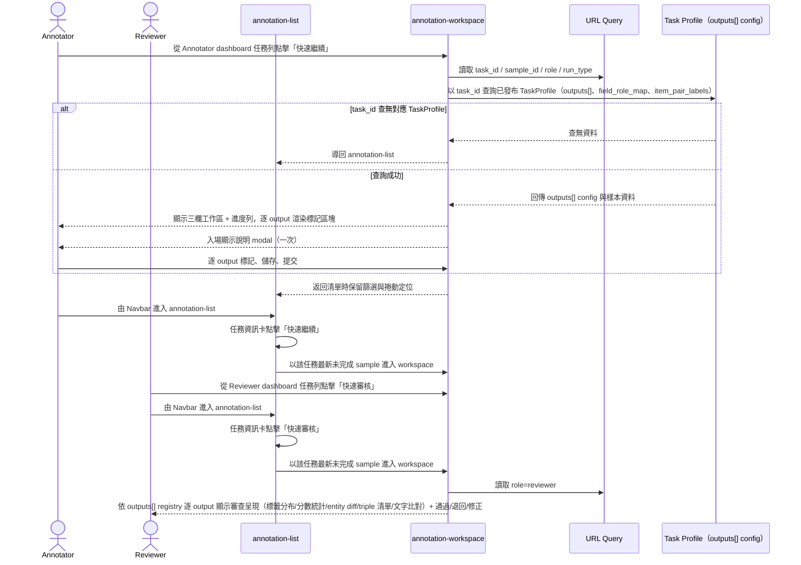
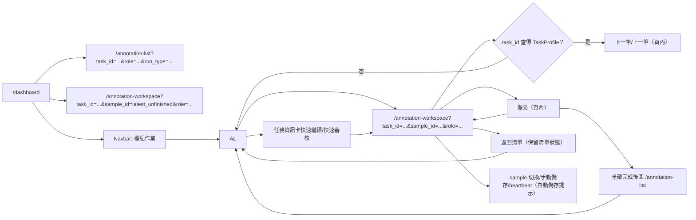

# 功能規格：Annotation List + Workspace — 標記清單與標記作業（Annotator / Reviewer）

**需求來源**: IA v1.3.1（2026-04-23）標記任務模組規範（`annotation-list` → `annotation-workspace`）；本版遷移對齊 task-management-013 v6.9.0 `OUTPUT_TYPE_REGISTRY` / `outputs[]` 契約，取代原本單一分類欄位驅動的舊版任務類型模型

## 輸入與生成規則

**輸入描述**：本規格需定義 Annotation List + Workspace 的標記/審核清單與工作區流程、以 `outputs[]` 為核心的 task profile 驅動畫面、提交 payload、安全邊界與 RWD 行為。

**產生規格時必須遵守**：

1. 先確認本規格範圍與需求來源一致：IA v1.3.1（2026-04-23）標記任務模組規範（annotation-list → annotation-workspace），並與 task-management-013 v6.9.0 的 `OUTPUT_TYPE_REGISTRY` / `outputs[]` 契約保持一致。
2. 若新增或改動角色權限、導頁、資料欄位、錯誤狀態、i18n、可存取屬性或響應式邊界，必須同步檢查使用者情境、功能需求、成功標準與規格相依性。
3. 若需求描述缺少角色、狀態、資料來源、權限、錯誤處理、導頁目標或量化門檻，需以待釐清標記記錄具體問題，不得自行假設。
4. 規格應描述使用者可觀察行為、業務規則與驗收條件；避免描述框架、檔案結構、API 實作或資料庫實作，除非該內容本身是已定義的產品契約。
5. 本規格若與 prototype、IA 或上游規格不一致，必須明確記錄差異、更新相依性，並新增 changelog。
6. 本規格不得為任何 output type 或欄位組合寫死專屬分支邏輯；標記/審查介面必須完全由 `outputs[]` 與 `OUTPUT_TYPE_REGISTRY` 驅動（Generalization-First，NON-NEGOTIABLE）。

**已釐清事項**：

- 本版以既有需求來源、task-management-013 v6.9.0 outputs[] 契約，以及本文件中的流程圖、使用者情境、功能需求、成功標準作為 scope baseline。
- 跨頁或跨模組共用行為需透過「規格相依性」追蹤，不在本文件中隱含建立未列出的依賴。
- 若後續新增實作層契約，需先確認是否構成行為變更；若是，必須依 SDD 流程更新 spec。
- `docs/product/example-data` 的 13 份 fixture（T001–T013）僅為 prototype 示例基線；任意合法 `outputs[]` 組合皆適用，13 筆非白名單，不構成 workspace 可支援的輸出類型組合上限（對齊 013 v6.4.1／v6.4.3 changelog 措辭）。
- Reviewer 呈現改為 registry 驅動：每個 output type 定義自己的審查結果呈現方式（標籤分布、分數統計、entity diff、triple 清單、文字比對），不得逐 task 硬編分支；全部 8 個 output type 皆提供 reviewer row-level 直接修正入口，修正 UI 重用對應 annotator 作答互動控件並以 annotator 答案為初始值（seed），此為本規格 workspace 端呈現決策（見 FR-024L 系列），不需 013 registry 額外定義欄位。

## 規格常數

- `TASK_ROLES = annotator | reviewer`
- `RUN_TYPES = dry_run | official_run`
- `TASK_INPUT_TYPES = single_item | item_pair`（source of truth：task-management-013）
- `OUTPUT_TYPE_KEYS = sequence_tagging | entity_recognition | relation_identification | single_label | multi_label | single_dim | multi_dim | free_text`（source of truth：task-management-013 `OUTPUT_TYPE_REGISTRY`；本規格不重複定義各輸出類型的 schema 欄位，僅描述 workspace 標記/審查介面行為）
- `OUTPUT_TYPE_DEPENDENCIES`：`relation_identification` 可獨立使用；僅在任務同時選取 `entity_recognition` 與 `relation_identification` 時，兩者於 workspace 共用同一份文本與實體來源，呈現為整合標記/審查模式（對齊 013 FR-003d-4、FR-003d-11、FR-003d-13）；workspace 不得自動加入或移除此關聯
- `SEQUENCE_TAGGING_SCHEMES = BIO | BIOES | IOB2 | SINGLE`
- `SEQUENCE_TOKEN_UNITS = character | word`
- `FIELD_ROLES = evidence | input | output`
- `ANNOTATION_LIST_ROUTE = /annotation-list`
- `ANNOTATION_WORKSPACE_ROUTE = /annotation-workspace`
- `ANNOTATION_LIST_ROUTE_QUERY = task_id | role | run_type | q | status | sort`
- `ANNOTATION_WORKSPACE_ROUTE_QUERY = task_id | sample_id | role | run_type`
- `TASK_CONTEXT_SOURCE = route_query`（`role` / `run_type` 缺值或非支援值時套用預設值；`task_id` 查無對應 `TaskProfile` 時導回 `annotation-list`，不再有 localStorage fallback）
- `TASK_PROFILE_SOURCE = task-detail 已發布的 TaskConfig（task-management-013 outputs[] config、field_role_map、item_pair_labels）+ sample_snapshot_id`
- `GUIDELINE_PANEL_TABS = guideline-files-static`（右欄「說明與檔案」為常駐顯示區塊，不提供 guideline-files/history 雙 tab 切換；`History` 為 Reviewer 流程內建的獨立追溯區塊，透過既有機制呈現，非本面板分頁——pending user confirmation，見 Changelog 2.1.0）
- `GUIDELINE_MODAL_BEHAVIOR = show-on-entry-per-page-load`
- `GUIDELINE_PANEL_COLLAPSE = desktop-toggleable`
- `SAMPLE_SOURCE_CONTRACT = sample_snapshot_id`
- `ANNOTATION_LIST_SOURCE = materialized AnnotationListItem from task-detail run publish events`
- `SUBMIT_DEFAULT_ACTION = go-to-next-sample`
- `SUBMIT_ALL_DONE_ACTION = redirect-to-annotation-list`
- `AUTOSAVE_TRIGGERS = on-sample-switch | on-save-click | heartbeat`
- `AUTOSAVE_HEARTBEAT_INTERVAL_SECONDS = 15`
- `CONFLICT_RESOLUTION_POLICY = optimistic-lock-with-version-check`
- `MOBILE_BP = 767px`
- `RWD_VIEWPORTS = 375px / 768px / 1440px`

## 流程圖

```mermaid
sequenceDiagram
    actor AN as Annotator
    actor RV as Reviewer
    participant AL as annotation-list
    participant UI as annotation-workspace
    participant Query as URL Query
    participant Profile as Task Profile（outputs[] config）

    AN->>UI: 從 Annotator dashboard 任務列點擊「快速繼續」
    UI->>Query: 讀取 task_id / sample_id / role / run_type
    UI->>Profile: 以 task_id 查詢已發布 TaskProfile（outputs[]、field_role_map、item_pair_labels）
    alt task_id 查無對應 TaskProfile
        Profile-->>UI: 查無資料
        UI-->>AL: 導回 annotation-list
    else 查詢成功
        Profile-->>UI: 回傳 outputs[] config 與樣本資料
        UI-->>AN: 顯示三欄工作區 + 進度列，逐 output 渲染標記區塊
        UI-->>AN: 入場顯示說明 modal（一次）
        AN->>UI: 逐 output 標記、儲存、提交
    end
    UI-->>AL: 返回清單時保留篩選與捲動定位
    AN->>AL: 由 Navbar 進入 annotation-list
    AL->>AL: 任務資訊卡點擊「快速繼續」
    AL->>UI: 以該任務最新未完成 sample 進入 workspace

    RV->>UI: 從 Reviewer dashboard 任務列點擊「快速審核」
    RV->>AL: 由 Navbar 進入 annotation-list
    AL->>AL: 任務資訊卡點擊「快速審核」
    AL->>UI: 以該任務最新未完成 sample 進入 workspace
    UI->>Query: 讀取 role=reviewer
    UI-->>RV: 依 outputs[] registry 逐 output 顯示審查呈現（標籤分布/分數統計/entity diff/triple 清單/文字比對）+ 通過/退回/修正
```

| Step | Role | Action | System Response |
|------|------|--------|----------------|
| 1 | `annotator` / `reviewer` | 由 dashboard 任務列點擊 `快速繼續/快速審核` | 直接導向 `annotation-workspace`，並帶入該任務「最新未完成 sample」的 `sample_id` |
| 2 | 使用者 | 由 navbar 進入 `annotation-list`，點擊單筆資料或任務資訊卡 `快速繼續/快速審核` | 導向 `annotation-workspace` 並帶入 `task_id/sample_id/run_type/role` |
| 3 | 系統 | 以 `task_id` 查詢已發布 `TaskProfile`（`outputs[]` config、`field_role_map`、`item_pair_labels`）與樣本資料 | 查無對應 `TaskProfile` 時導回 `annotation-list`；查詢成功時載入固定樣本、說明檔案與進度（原型內建資料） |
| 4 | `annotator` | 依 `outputs[]` 逐一完成各 output 的標記、儲存、提交 | 更新完成數；未完成全筆次時提交後預設進入下一筆，全部提交後導回 `annotation-list` |
| 5 | `reviewer` | 依 registry 呈現逐 output 審查結果、通過/退回、必要時修正 | 產生審查結果與歷程 |
| 6 | 使用者 | 返回清單 | 保留清單篩選條件與捲動定位 |
| 7 | 使用者 | 中途操作 | 由 sample 切換、儲存、heartbeat 觸發自動儲存提示 |

---

## 使用者情境與測試 *(必填)*

### 使用者故事 1 — 快速入口與清單入口並存（優先級：P1）

Annotator / Reviewer 進入標記模組時，支援兩種入口：dashboard 任務列可直接進入 `annotation-workspace`；navbar 入口則先進 `annotation-list` 再選筆次進入。

**此優先級原因**：需同時滿足 dashboard 的快速續作路徑與 annotation-list 的檢索/篩選操作。
**獨立測試方式**：分別由 dashboard 與 navbar 進入標記模組，驗證快速入口可直達工作區，清單入口可由單筆與任務資訊卡導向工作區。

**驗收情境**：

1. **AC-1.1**：**Given** 使用者點擊 dashboard 任務卡中的非 `快速繼續/快速審核` 區域，**When** 進入標記模組，**Then** 先進入對應任務的 `annotation-list`，並帶入 `task_id/run_type/role`。
2. **AC-1.2**：**Given** 使用者點擊 dashboard 任務卡「快速繼續/快速審核」，**When** 進入標記模組，**Then** 直接進入 `annotation-workspace`，且帶入該任務最新未完成 sample 的 `sample_id`。
3. **AC-1.3**：**Given** 使用者於清單點擊任一筆資料列或其 `編輯` 按鈕，**When** 觸發導頁，**Then** 導向 `annotation-workspace` 並帶入 `task_id/sample_id/run_type/role`，且工作區初始化後必須停留在該 `sample_id` 對應的樣本。
4. **AC-1.4**：**Given** 使用者於清單任務資訊卡點擊「快速繼續/快速審核」，**When** 觸發導頁，**Then** 導向 `annotation-workspace` 並帶入該任務最新未完成 sample 的 `sample_id`。
5. **AC-1.5**：**Given** 使用者從工作區返回清單，**When** 回到 `annotation-list`，**Then** 保留當前任務上下文與捲動位置。
6. **AC-1.6**：**Given** 清單中某筆資料被他人鎖定，**When** 點擊該筆，**Then** 顯示鎖定狀態並提供唯讀檢視或稍後再試。
7. **AC-1.7**：**Given** 使用者於標記清單切換完成狀態篩選，**When** 選擇 `已提交/草稿/待處理`，**Then** 清單只顯示符合該完成狀態的資料列。

**介面定義（需與 IA 導覽語意一致）**：

- 區塊 A：`頁首資訊`
  - 必要元素：頁面標題與導引文案
- 區塊 B：`任務資訊卡`
  - 必要元素：任務名稱、進度摘要（例如：完成率/今日完成/平均速度）、依 `outputs[].type` 順序顯示的一至多個輸出類型 tag（registry-driven，對齊 012 Dashboard／010 Task List 的呈現契約）、Run Type badge、狀態 badge、進度條
  - 必要元素（操作）：`快速繼續`（annotator）或 `快速審核`（reviewer）按鈕，位置需與 Dashboard 任務列表一致（卡片右側操作區）
  - 位置規範：必須位於篩選列上方（頁首資訊下方、資料清單上方）
  - 視覺樣式：必須與 Dashboard 任務列表列項樣式一致（`list-item` + `badge` + `progress`）
- 區塊 C：`資料清單（Annotator 視圖）`
  - 必要元素：樣本 ID、完成時間、完成狀態、標記者、文本摘要
  - 必要元素（操作）：每列需提供 `編輯` 按鈕，作為進入該筆 `annotation-workspace` 的顯式 CTA
  - 視覺樣式：表格容器與欄位樣式需與 `task-list` 一致（同級 toolbar + table shell）
  - 顯示限制：不顯示「任務資料清單」區塊標題文字
  - 列表底部：需顯示與 `task-list` 相同視覺語法的 footer pagination
- 區塊 C'：`資料清單（Reviewer 視圖）`
  - 必要元素：樣本 ID、完成狀態、完成時間、文本摘要、依 `outputs[].type` registry 呈現的標記分布統計、展開控制項
  - 必要元素（操作）：每列提供 `全部通過` / `全部退回` 批次按鈕；展開後每位標記員一列，含 `通過` / `退回` 逐筆按鈕；toolbar 右側提供 `送出審核` 按鈕（Reviewer 專屬，Annotator 不顯示）；送出前需完成每位標記員的審核決策，否則顯示 `toastSelectDecision` 錯誤提示
  - 操作順序：批次與逐筆操作皆固定為左側 `退回`、右側 `通過`
  - 狀態回饋：批次按鈕被按下後，需比照逐筆按鈕切換為深色實心 active 樣式；未按下維持淺色描邊樣式，兩者需可明確區分；再次點擊當前 active 的批次按鈕時，視為取消整筆決策並回到未選取狀態
  - 展開行為：點擊列或展開箭頭展開/收合該筆的標記員明細（含帳號、標記結果 tag、逐列操作）
  - 批次操作：`全部通過` / `全部退回` 套用至同筆所有標記員，展開行同步更新按鈕狀態；若同筆所有逐筆決策一致，對應批次按鈕也需同步切為 active；再次點擊當前 active 的批次按鈕時，需清除同筆全部逐筆決策
  - 標記分布統計呈現規則（依 `outputs[].type` registry 驅動，不得逐 task 硬編）：`single_label` / `multi_label` / `sequence_tagging` 顯示各標籤（或 tag）出現次數；`single_dim` / `multi_dim` 每個維度第一行顯示 `mean`，第二行顯示 `std`，第三行顯示 `±1.5std` 範圍；`entity_recognition` 顯示各標記員 entity diff 摘要；`relation_identification` 以 monospace 多行文字呈現，每一筆 triple 摘要各占一行，不得以單行 ` · ` 串接壓縮顯示；`free_text` 顯示各標記員文字內容比對摘要
  - 標記結果顏色標記（`single_dim` / `multi_dim` 類任務）：展開行中每位標記員的維度值 result tag 依以下規則著色：🟢 綠色（`result-tag-green`）：全部維度皆落在 `[lo, hi]` 範圍內；🔵 藍色（`result-tag-blue`）：任一維度低於下界（`< lo`）；🔴 紅色（`result-tag-red`）：任一維度高於上界（`> hi`）；優先順序：紅色 > 藍色 > 綠色
  - 視覺樣式：與 Annotator 視圖共用相同 table shell；展開行背景以 `#F8FAFC` 區分
  - 列表底部：需顯示與 `task-list` 相同視覺語法的 footer pagination
- 區塊 D：`清單操作`
  - 必要元素：完成狀態篩選、關鍵字搜尋、清除篩選、點擊單筆進入作業、鎖定狀態提示
  - 分頁規則：
    - footer pagination 必須顯示總筆數與目前頁數資訊（例如 `共 5 筆 · 第 1 / 1 頁`）
    - 必須提供每頁筆數切換（`20 / 50 / 100`）與上一頁 / 下一頁 / 頁碼按鈕
    - 視覺樣式、間距、按鈕狀態與 `task-list` pagination 一致

**行為規則**：

- dashboard 任務列中除 `快速繼續/快速審核` 以外的區域，必須導向對應任務的 `annotation-list`。
- dashboard 任務列 `快速繼續/快速審核` 必須直接導向 `annotation-workspace`，不經 `annotation-list`。
- navbar 進入標記作業時，仍以 `annotation-list` 為入口頁。
- 清單與工作區間必須以 `task_id/sample_id/run_type/role` 建立明確導頁契約；`task_id` 對應的 `outputs[]` 組合完全由 workspace 讀取 `TaskProfile` 取得，不再透過路由參數傳遞。
- `annotation-list` 必須讀取 task-detail 在 run 發布事件中建立完成的 `AnnotationListItem`，不得以任務原始資料集全量即時計算或預先生出清單。
- `run_type = dry_run` 時，`annotation-list` 只顯示指定 `trial_round` 已建立的試標清單；例如 R1 發布 10 筆時清單為 10 筆，R2 發布 10 筆時清單為該回合另一組 10 筆。
- `run_type = official_run` 時，`annotation-list` 只顯示 `開始正式標記` 時建立的正式標記清單，筆數為扣除所有已建立試標回合後的剩餘樣本總數。
- `annotation-workspace` 左側欄位標題固定顯示 `標記清單` / `Annotation List`；不得附加 `試標回合 R{n}`、`正式標記清單` 或 `Official list` 等 run label。筆數仍需依 materialized run context 顯示。
- `annotation-workspace` 初始化時，若 query 含有效 `sample_id`，必須以該樣本作為當前作用中項目；不得回退到固定預設索引。
- 「最新未完成 sample」判定規則：優先取最後一筆 `pending`，若無則取最後一筆 `saved`，若仍無則回退該任務最後一筆。
- 返回清單時需還原同一 `task_id` / `run_type` 上下文，並保留捲動定位。
- 清單必須支援依完成狀態篩選（`submitted | saved | pending`），並可清除篩選回到完整列表。
- 清單底部必須提供 footer pagination，且 Annotator / Reviewer 兩種視圖皆需顯示總筆數、目前頁數、每頁筆數切換與上一頁 / 下一頁 / 頁碼按鈕。
- 清單套用完成狀態篩選、關鍵字搜尋或清除篩選時，footer pagination 必須回到第 1 頁並以篩選後結果重算總筆數與頁數。
- 手機版（`<= MOBILE_BP`）清單首列不得因文本摘要換行造成異常大列高；需維持可快速掃讀的緊湊列高。
- Reviewer 視圖下，`通過` / `退回` 決策僅更新前端原型狀態；不觸發導頁，reviewer 可在清單直接完成審核流程。

---

### 使用者故事 2 — Annotator 完成跨輸出類型的逐筆標記（優先級：P1）

Annotator 可在同一工作區中，依任務 `outputs[]` 組成逐一完成各輸出類型的標記，並依 `run_type` 完成儲存與提交。

**此優先級原因**：標記作業是核心產出流程，且必須對任意合法 `outputs[]` 組合一致運作。
**獨立測試方式**：以 `annotator` 身分分別進入單一輸出、多輸出（含整合模式）任務，驗證載入、逐 output 作答、儲存、提交與進度更新。

**驗收情境**：

1. **AC-2.1**：**Given** `role=annotator` 且 `run_type` 合法，**When** 由 `annotation-list` 點擊單筆進入 `annotation-workspace`，**Then** 系統以 `task_id` 讀取 `TaskProfile`，依 `outputs[]` 順序逐一渲染各輸出類型的標記區塊，並顯示工作區與當前階段（Dry Run / Official Run）。
2. **AC-2.2**：**Given** 任務 `outputs[]` 含 2 個以上輸出類型，**When** annotator 進入工作區，**Then** 每個輸出類型各自獨立成一個標記區塊，任一區塊的互動只更新該區塊狀態，不影響其他輸出類型的既有作答。
3. **AC-2.3**：**Given** 正在標記樣本，**When** 點擊儲存，**Then** 系統保存草稿（含所有已作答輸出類型的暫存值）且更新該筆狀態。
4. **AC-2.4**：**Given** 已完成可提交條件（所有輸出類型皆已作答或已勾選 Bypass），**When** 點擊提交，**Then** 系統記錄提交並預設導向下一筆（`SUBMIT_DEFAULT_ACTION`）。
5. **AC-2.5**：**Given** 任務最後一筆完成提交，**When** 完成提交流程，**Then** 系統導回 `annotation-list` 並將該任務資料列狀態顯示為 `已提交`。
6. **AC-2.6**：**Given** 切換樣本或手動儲存，**When** 有編輯行為發生，**Then** 顯示自動儲存狀態更新（Saving → Saved）。
7. **AC-2.7**：**Given** annotator 由 Dashboard 或 annotation-list 進入任一任務工作區，**When** 查看中欄標記卡標題，**Then** 標題必須顯示與 reviewer 視角一致的實際任務名稱（依 `task_id` 對應），不得退回成泛用輸出類型文案。

**介面定義（需與 IA 導覽語意一致）**：

- 區塊 A：`上方任務目標列（固定）`
  - 必要元素：任務目標、操作指引、已標記數量、總量、當前階段、微型進度視覺
- 區塊 B：`三欄工作區（Desktop）`
  - 左欄：標記清單、目前定位、完成狀態
  - 中欄：依 `outputs[]` 順序逐一渲染的輸出類型標記卡（見使用者故事 2A）、儲存/提交操作
  - 右欄：`說明與檔案` 常駐顯示（無分頁切換）；`History` 為 Reviewer 流程內建的獨立追溯區塊，非本欄分頁（見 `GUIDELINE_PANEL_TABS`，pending user confirmation）
- 區塊 C：`Mobile 佈局`
  - 精簡任務目標列 + 主操作區
  - 說明與檔案使用底部抽屜（預設收合，可展開；無 `History` 分頁，同區塊 B 之修訂）

**行為規則**：

- `annotation-workspace` 只能讀取由 task-detail 發布時凍結的 `sample_snapshot_id`。
- `annotation-workspace` 必須讀取 task-detail 發布時凍結的 `TaskProfile`（`outputs[]` + `field_role_map` + `item_pair_labels`），依 `outputs[]` 逐一選擇標記控制項；不得在 workspace 內硬編任務專屬邏輯。
- Dry Run 與 Official Run 樣本切分不可在 workspace 端重算或覆寫。
- 右欄 `說明與檔案` 在翻筆（上一筆/下一筆）後必須持續可見。
- 原型入場時固定顯示說明 modal 一次；關閉後右欄仍固定顯示說明內容。
- Desktop 右欄支援收合/展開切換按鈕，收合後可再次展開。
- 提交後預設停留於 workspace 並載入下一筆；任務全部完成時導回 `annotation-list`（`SUBMIT_ALL_DONE_ACTION`）。
- 提交前必須驗證 `outputs[]` 中每個輸出類型皆已完成作答或已勾選 Bypass；任一輸出類型未完成時阻擋提交並提示對應區塊。
- 中欄主卡 header 必須優先使用 `task_id` 對應的實際任務名稱；此規則同時適用於 annotator 的標記卡與 reviewer 的審查卡。僅在缺少任務上下文時，才可退回輸出類型層級的預設文案。

---

### 使用者故事 2A — 依輸出類型完成各種作答控制項（優先級：P1）

Annotator 依任務 `outputs[]` 中每個輸出類型的 registry schema，完成對應的分類、回歸、序列、生成類作答；多輸出任務可在同一畫面逐一完成，`entity_recognition` 與 `relation_identification` 同時選取時以整合模式呈現。

**此優先級原因**：8 種輸出類型與其組合是標記作業的核心產出邏輯；控制項必須完全由 config 驅動，不得為個別任務硬編。
**獨立測試方式**：分別以單一輸出類型任務與多輸出組合任務（含 ER+RI 整合）進入工作區，驗證各控制項的作答、驗證與提交 payload。

**驗收情境**：

1. **AC-2A.1（single_label）**：**Given** `outputs[]` 含 `single_label` 且 config 提供 `label_options`，**When** annotator 點擊任一標籤 chip，**Then** 該輸出類型切換為單選狀態（互斥），儲存草稿時記錄 `{selected}`。
2. **AC-2A.2（multi_label）**：**Given** `outputs[]` 含 `multi_label`，**When** annotator 於階層選擇器勾選一至多個節點（含 branch 與 leaf），**Then** 已選 chip 僅顯示節點名稱，儲存草稿時記錄完整 `LabelPath[]`；超過 `max_selections`（非 0）時阻擋新增選取並提示上限。
3. **AC-2A.3（single_dim）**：**Given** `outputs[]` 含 `single_dim`，**When** annotator 拖曳滑桿或於 number input 輸入數值，**Then** 滑桿、當前值標籤與 number input 於 100ms 內雙向同步，且值落於 config `min`/`max` 範圍內；`status=pending` 且無儲存值時滑桿維持未評分狀態，不得以視覺中點作為有效值。
4. **AC-2A.4（multi_dim）**：**Given** `outputs[]` 含 `multi_dim`，**When** annotator 調整任一維度滑桿或 number input，**Then** 僅該維度數值更新並雙向同步，各維度使用不同輔助色但同時保留文字標籤；未評分維度不得預填任何合成預設值（含中間值；依 FR-024M 之 Output-role preannotation 不在此限）。
5. **AC-2A.5（sequence_tagging）**：**Given** `outputs[]` 含 `sequence_tagging`，**When** annotator 依 config `tagging_scheme` 選擇 tag 後點擊 Token，**Then** 該 Token 依方案套用完整 tag（`BIO`/`BIOES`/`IOB2` 每個實體起點使用 `B`；`SINGLE` 為直接類型標籤或 `O`）；Token 邊界由後端依 `tokenization.unit` 提供的正式切分結果決定（見 ADR-031），workspace 不得自行重新切分覆寫正式邊界。
6. **AC-2A.6（entity_recognition）**：**Given** `outputs[]` 含 `entity_recognition`，**When** annotator 先圈選文字再選擇實體類型，或先選擇實體類型再圈選文字，**Then** 兩種順序皆可成功建立實體並記錄 `text/type/start/end`（半開區間）；未先圈選文字即點擊實體類型按鈕時顯示錯誤且不得建立實體。
7. **AC-2A.7（relation_identification 純模式）**：**Given** `outputs[]` 僅含 `relation_identification`（未選 `entity_recognition`），**When** annotator 依序操作 `E1 → Relation → E2 → Add`，**Then** 系統以資料集既有唯讀實體作為 E1/E2 候選，不顯示實體建立或刪除控制項；E1 與 E2 相同或任一欄位為空時阻擋新增並顯示錯誤。
8. **AC-2A.8（entity_recognition + relation_identification 整合模式）**：**Given** `outputs[]` 同時含 `entity_recognition` 與 `relation_identification`，**When** annotator 於整合預覽建立實體後接續建立三元組，**Then** 兩者共用同一份文本與可編輯實體來源，實體列表與三元組列表合併呈現於同一區塊，且各自的作答仍分別記錄為獨立的 `entity_recognition` 與 `relation_identification` OutputAnswer。
9. **AC-2A.9（free_text）**：**Given** `outputs[]` 含 `free_text`，**When** annotator 於 textarea 輸入文字，**Then** 系統即時顯示字元計數 `N / max_length`，超過 `max_length` 時阻擋繼續輸入；`input_instruction` 與 `output_instruction` 必須顯示 config 設定的文案。
10. **AC-2A.10（多輸出任務同畫面）**：**Given** `outputs[]` 含 3 個以上輸出類型（例如 `entity_recognition + relation_identification + multi_dim`），**When** annotator 依序完成各區塊作答，**Then** 全部區塊皆可在同一 sample 頁面內完成，任一區塊尚未完成時提交按鈕阻擋並提示對應區塊，其餘已完成區塊的作答不受影響。

**行為規則**：

- 每個輸出類型的標記控制項必須依 `OUTPUT_TYPE_KEYS` 與該類型的 registry config 動態決定，不得在 workspace 內為特定輸出類型名稱或組合寫死條件分支。
- `sequence_tagging` 的正式 Token 邊界由後端提供（ADR-031：tokenization 為 annotation 資料契約的一部分，engine/version 依任務凍結）；workspace 僅依 `tokenization.unit`／`tagging_scheme` 呈現與互動，不得於生產標記流程自行以瀏覽器 API 重新切分。
- `field_role_map` 中標記為 `output` 角色的欄位值，是任務建立者明確指定的 annotator-visible preannotation，允許用於初始化各輸出類型的預覽/作答狀態（對齊 013 FR-003g-5）；隱藏的 test-set ground truth 仍不得透過此路徑或任何其他路徑下發（見 FR-023）。
- 每個輸出類型的作答狀態彼此獨立；切換或儲存某一輸出類型不得清除或覆寫其他輸出類型的既有作答。
- `outputs[]` 中僅含 `relation_identification` 時，既有實體來源固定為資料集提供的唯讀候選；只有同時選取 `entity_recognition` 時，實體才可由 annotator 建立/修改。

---

### 使用者故事 2B — item_pair 輸入型態與 Evidence 呈現（優先級：P1）

Annotator 在 `input_type = item_pair` 的任務中，以雙欄呈現兩個比較項目；任一輸出類型於 registry 宣告需要 Evidence 呈現時（例如 `free_text`），Evidence 卡片須顯示於 Input 內容與作答控制項之前。

**此優先級原因**：item_pair 輸入型態（原句對任務）與 Evidence 呈現是既有研究情境的必要輸入契約，若缺少 workspace 規格，task-new / task-detail 的 `item_pair` 與 Evidence 設定無法落地。
**獨立測試方式**：以 `input_type=item_pair` 任務與含 Evidence 欄位的 `free_text` 任務分別進入工作區，驗證雙欄呈現、項目對名稱、Evidence 卡位置與 instruction 呈現。

**驗收情境**：

1. **AC-2B.1**：**Given** `TaskProfile.input_type = item_pair`，**When** annotator 進入工作區，**Then** 中欄以雙欄呈現兩個項目內容，區塊小標分別顯示 `TaskProfile.item_pair_labels` 的兩個項目對名稱（若缺值則回退顯示對應 Input 欄位原始名稱）。
2. **AC-2B.2**：**Given** `TaskProfile.input_type = single_item`，**When** annotator 進入工作區，**Then** 中欄僅顯示單一「原始文本」區塊，不得顯示雙欄配對版面。
3. **AC-2B.3**：**Given** 任一已選輸出類型於 registry 宣告 `rendersEvidencePreview: true`（目前為 `free_text`）且 `field_role_map` 已指定 Evidence 角色欄位，**When** annotator 進入工作區，**Then** 「背景參考 (Evidence)」卡片必須顯示於 Input 內容卡與該輸出類型作答控制項之前；未指定 Evidence 時不得顯示空的背景區塊。
4. **AC-2B.4**：**Given** `outputs[]` 含 `free_text`，**When** annotator 進入工作區，**Then** 必須依序顯示 `input_instruction`、Input 內容卡、`output_instruction`、作答 textarea 與字元計數。

**行為規則**：

- `item_pair` 的雙欄小標名稱來源為 `TaskProfile.item_pair_labels`，僅影響顯示文案，不改變 `field_role_map` 或資料欄位本身。
- Evidence 呈現位置與是否顯示完全由該輸出類型 registry 的 `rendersEvidencePreview` metadata 決定，workspace 不得為特定輸出類型硬編顯示順序例外。
- 當多個已選輸出類型宣告 `rendersInputPreview: true`（例如 `sequence_tagging`、`entity_recognition`、`relation_identification`、`free_text`）時，通用輸入文字區塊不得重複顯示；輸入內容改由該輸出類型的專屬或整合預覽完整呈現，行為對齊 013 FR-003g-3。

---

### 使用者故事 3 — Reviewer 審查與追溯歷程（優先級：P1）

Reviewer 在同一工作區執行審查，依任務 `outputs[]` 逐一查看每個輸出類型的審查呈現（標籤分布、分數統計、entity diff、triple 清單或文字比對），以通過 / 退回完成逐列或批次審核，必要時對任一輸出類型直接修正（重用對應 annotator 作答控件並以其答案為初始值），並追溯每筆決策歷程。

**此優先級原因**：Dry Run 一致性與正式資料品質依賴 reviewer 決策，且審查呈現必須對任意合法 `outputs[]` 組合一致運作。
**獨立測試方式**：以 `reviewer` 身分進入涵蓋不同輸出類型組合的待審任務，驗證各輸出類型的審查呈現、決策操作與 History 追溯欄位。

**驗收情境**：

1. **AC-3.1**：**Given** `role=reviewer`，**When** 進入工作區，**Then** 在 Dry Run 與 Official Run 都顯示 reviewer 可用操作（通過 / 退回），且依 `outputs[]` 順序逐一顯示每個輸出類型的審查摘要。
2. **AC-3.2**：**Given** `outputs[]` 含 `single_label` / `multi_label` / `sequence_tagging`，**When** reviewer 查看審查摘要，**Then** 顯示各標籤（或 tag）的出現次數分布。
3. **AC-3.3**：**Given** `outputs[]` 含 `single_dim` / `multi_dim`，**When** reviewer 查看審查摘要，**Then** 顯示各維度的 `mean`、`std` 與 `±1.5std` 範圍，且各標記員的維度值 result tag 依範圍著色（綠/藍/紅，優先序紅 > 藍 > 綠）。
4. **AC-3.4**：**Given** `outputs[]` 含 `entity_recognition`，**When** reviewer 查看審查摘要，**Then** 以可掃讀的 entity diff 呈現各標記員的新增/刪除/相符實體，並可執行直接修正（新增/刪除/修改實體，重用 annotator 的 entity 建構器並以其提交結果為初始值）。
5. **AC-3.5**：**Given** `outputs[]` 含 `relation_identification`，**When** reviewer 查看審查摘要，**Then** 以 monospace 多行文字呈現各標記員的 triple 清單，每筆三元組各占一行，並可執行直接修正（重用 annotator 的關係建構器並以其提交結果為初始值；純模式與整合模式皆不提供 reviewer 直接改寫實體的入口，僅可調整/新增/刪除 triple）。
6. **AC-3.6**：**Given** `outputs[]` 含 `free_text`，**When** reviewer 查看審查摘要，**Then** 以可掃讀方式並列顯示各標記員的文字內容供比對，並可執行直接修正（重用 annotator 的 textarea 控件並以其提交文字為初始值）。
7. **AC-3.7**：**Given** reviewer 需快速處理同一句的多位標記員結果，**When** 點擊 `全部通過` 或 `全部退回`，**Then** 系統必須以勾選式批次套用到所有標記員列。
8. **AC-3.8**：**Given** reviewer 退回或通過某位標記員結果，**When** 送出審核，**Then** 該筆歷程新增一筆可追溯紀錄（誰、何時、對哪位標記員的哪個輸出類型做了什麼決策）。
9. **AC-3.9**：**Given** reviewer 對任一輸出類型（8 型皆適用）直接修正標記員結果，**When** 送出審核，**Then** 系統必須同時保留 annotator 原始提交、reviewer 修正後結果與修正 diff，供品質追溯；修正控件必須重用該輸出類型對應的 annotator 作答互動控件，不得另建輸出類型專屬修正介面。
10. **AC-3.10**：**Given** reviewer 由 Dashboard 或 annotation-list 進入任一任務工作區，**When** 查看中欄審查卡標題，**Then** 標題必須顯示與 annotator 視角一致的實際任務名稱（依 `task_id` 對應），不得退回成泛用輸出類型文案。

**介面定義（需與 IA 導覽語意一致）**：

- 區塊 A：`中欄審查操作區`
  - 標題規則：審查卡 header 必須顯示當前任務名稱，並與 annotator 視角、Dashboard 任務卡、annotation-list 任務資訊卡的任務名稱保持一致；同一任務在 reviewer 視角不得改顯示為輸出類型通稱
  - 必要元素：依 `outputs[]` 順序逐一呈現的輸出類型審查摘要區塊（標籤分布 / 分數統計 / entity diff / triple 清單 / 文字比對，依 FR-024L 對應規則），各區塊皆提供直接修正入口
  - 必要元素：標記員逐列結果（帳號、依輸出類型呈現的標記值）
  - 必要元素：逐列決策按鈕（`通過` / `退回`）
  - 必要元素：批次操作（`全部通過` / `全部退回`），呈現方式需接近 checkbox 勾選
  - 必要元素：審查說明文案（`通過：此筆標記有效。退回：該標記狀態會回到未標記，標記員需要重新標記。`）
  - 操作順序：`退回` 置左，`通過` 置右；批次操作與逐列操作一致
  - 按鈕視覺一致性：工作區 reviewer 的批次與逐列 `退回 / 通過` 按鈕，必須與 `annotation-list` reviewer 視圖使用完全一致的 icon 與樣式規格；包含 `✕ / ✓` icon 呈現方式、按鈕內距、色彩、邊框、hover、focus、active filled state，不可使用另一套按鈕結構替代
  - 版面排列（Desktop）：審查說明文案需與批次操作按鈕位於同一行，文案在左、`全部退回 / 全部通過` 在右
  - 狀態回饋：批次操作按鈕需支援 active/inactive 兩態，active 態沿用逐列 `通過 / 退回` 的深色實心視覺；再次點擊 active 態時需取消整筆批次決策
  - 逐筆按鈕行為：逐筆 `通過 / 退回` 按鈕點擊後切換為 active 深色實心；再次點擊當前 active 按鈕時視為取消該筆決策，回到未選取狀態；逐筆決策狀態與批次按鈕狀態保持同步
  - 修正入口：全部 8 個輸出類型皆提供 row-level 直接修正控制項，控制項重用對應 annotator 作答互動控件並以 annotator 提交結果為初始值（seed），不得另建輸出類型專屬修正介面；由 reviewer 新增/修改的項目需以簡單色彩狀態區分（例如淺綠底/綠色邊框），頁面內不需額外顯示逐筆操作的文字 audit
- 區塊 B：`右欄 History`
  - 必要元素：操作者、時間、輸出類型、欄位差異、決策狀態
- 區塊 C：`右欄說明與檔案`
  - 必要元素：任務說明摘要、檔案列表、預覽/新分頁開啟能力
  - 圖片預覽規範：點擊圖片檔後，必須以置中的圖片預覽 modal 顯示大圖；不可僅在右欄底部以小尺寸 inline 圖片呈現

**行為規則**：

- Reviewer 可於 Dry Run 協助產出標準答案（多數決、IAA 輔助判讀或手動確認）。
- Reviewer 操作必須留下完整審計資訊，供後續品質追溯。
- Reviewer 與 Annotator 共用相同樣本來源契約與導覽骨架，避免視圖不一致。
- Reviewer 工作區的審查卡標題必須優先使用 `task_id` 對應的實際任務名稱；Annotator 工作區的標記卡標題也必須共用同一名稱來源。僅在缺少任務上下文時，才可退回輸出類型層級的預設文案。
- 審查呈現與修正能力完全由 `outputs[].type` 決定，不得依任務名稱或個別任務硬編分支；新增輸出類型時只需擴充 registry 對應的呈現規則，不需修改核心審查流程。
- 全部 8 個輸出類型皆提供 Reviewer `通過 / 退回` 決策，並皆提供直接修改標記值入口；修正控件必須重用對應 annotator 作答互動控件（單選 chip／階層多選器／slider＋number input／Token 網格／entity 建構器／relation 建構器／textarea），不得為任一輸出類型另建修正專屬介面。
- Reviewer 對任一輸出類型執行直接修正時，系統必須保留 annotator 原始提交、reviewer 修正後結果、修正 diff、Reviewer 身分、時間與最終決策，供品質追溯。
- `通過` 表示該筆標記有效；若 Reviewer 對該筆有直接修正，則表示修正後結果有效。`退回` 表示該筆標記狀態回到未標記，由原標記員重新標記。
- 手機版（`<= MOBILE_BP`）Reviewer 工作區中，批次操作區需右對齊；各標記員列的 result tag 與逐列 `退回 / 通過` 按鈕也需靠右對齊，維持一致的行尾操作視覺。

---

### 使用者故事 4 — 路由上下文解析與進入控制（優先級：P1）

清單與工作區都由路由參數決定啟動上下文；`role`、`run_type` 缺值時需套用預設，`task_id` 查無對應 `TaskProfile` 時需導回清單。

**此優先級原因**：確保 dashboard/sidebar 進入清單與工作區時可還原正確模式，且不再依賴已移除的分類路由參數與 localStorage fallback。
**獨立測試方式**：模擬清單與工作區的 query 組合與缺值/查無 `TaskProfile` 案例，驗證畫面模式、語意與導頁 fallback。

**驗收情境**：

1. **AC-4.1**：**Given** query 含有效 `task_id` 且 `role=annotator` 或 `role=reviewer`，**When** 開啟 `annotation-list`，**Then** 載入對應任務與 run_type 清單。
2. **AC-4.2**：**Given** query 缺少 `run_type`，**When** 開啟清單或工作區，**Then** 使用預設 `dry_run`。
3. **AC-4.3**：**Given** 開啟 `annotation-workspace` 且 query 含有效 `sample_id`，**When** 初始化頁面，**Then** 左側標記清單作用中狀態、中央內容與提交進度都必須對應到該 `sample_id`。
4. **AC-4.4**：**Given** 開啟 `annotation-workspace` 且 `task_id` 查無對應已發布 `TaskProfile`，**When** 初始化頁面，**Then** 系統必須導回 `annotation-list`，不得以任何預設輸出類型或空白控制項呈現工作區。

**行為規則**：

- 原型模式下，清單與工作區啟動上下文以 query + `TaskProfile` 查詢為主，不在頁面內做 API 權限判斷。
- 無效 `role` 值時，回退預設 `annotator` 呈現，避免頁面不可用。
- 有效 `sample_id` 必須優先於頁面內建預設索引，用於決定 workspace 初始焦點樣本。
- `annotation-workspace` 不再讀取或寫入任何 `activeTaskType` 相關 localStorage 狀態；`outputs[]` 組成一律以 `task_id` → `TaskProfile` 查詢為唯一來源。

---

### 使用者故事 5 — 說明與檔案常駐 + 響應式體驗（優先級：P2）

使用者在 Desktop 與 Mobile 標記流程中都能持續查看說明內容，不因翻筆或版型切換遺失任務指引。

**此優先級原因**：降低標記偏差與操作中斷。
**獨立測試方式**：在 `375px`、`768px`、`1440px` 驗證翻筆、切換 panel、切換階段時說明區持續可見。

**驗收情境**：

1. **AC-5.1**：**Given** Desktop 三欄佈局，**When** 切換下一筆，**Then** 右欄說明不收起且內容不重置。
2. **AC-5.2**：**Given** Mobile 底部抽屜模式，**When** 切換下一筆，**Then** 抽屜維持目前開合狀態。
3. **AC-5.3**：**Given** 檔案為 PDF/圖片/Markdown，**When** 在右欄點擊檔案，**Then** PDF 以新分頁開啟、Markdown 以面板內預覽、圖片以 modal 顯示大圖預覽。

**行為規則**：

- `說明與檔案` 為本模組強制常駐資訊，不能只在入場 modal 顯示。
- Mobile 必須保留主操作優先，並以抽屜承載輔助資訊，不可遮蔽核心標記區。
- 圖片檔預覽需支援明確的關閉路徑；至少包含關閉按鈕，且點擊遮罩背景或按下 `Esc` 可關閉 modal。

---

### 邊界情況

- `annotation-list` 缺少 `task_id` 時，不可進入空白清單；需顯示錯誤提示並提供返回 `dashboard`。
- `annotation-workspace` 缺少 `sample_id` 時，不可載入作業區；需導回 `annotation-list`。
- `annotation-workspace` 的 `task_id` 查無對應已發布 `TaskProfile` 時，需導回 `annotation-list`，不得以任何預設輸出類型呈現工作區。
- `TaskProfile.outputs[]` 為空陣列或缺少必要欄位（未通過對應輸出類型的 registry 驗證）時，需顯示 task config 錯誤並阻擋標記提交；不得以任一輸出類型的預設控制項頂替。
- `sequence_tagging` 的可見預標記數量與後端提供的正式 Token 數量不一致時，需顯示錯誤並阻擋提交，不得靜默保留或錯套舊 tag（對齊 ADR-031 決定 4：determinism 為硬性要求）。
- `entity_recognition` 未先圈選文字即點擊實體類型按鈕：顯示錯誤提示，不建立實體。
- `relation_identification`（純模式）E1 與 E2 選擇相同實體，或任一欄位為空：阻擋新增三元組並顯示錯誤。
- `multi_label` 選取節點數超過 `max_selections`（非 0）：阻擋新增選取並顯示上限提示。
- `single_dim` / `multi_dim` 樣本值不落在 config `min`/`max`/`step` 合法範圍：需顯示 payload 驗證錯誤並阻擋提交。
- `free_text` 輸入字數超過 `max_length`：阻擋繼續輸入並顯示上限提示。
- `TaskProfile.input_type = item_pair` 但樣本資料缺少任一 Input 角色欄位對應內容：不得顯示空白配對區塊讓 annotator 誤標；需顯示資料欄位錯誤並阻擋提交。
- 任一輸出類型 `allow_bypass = false` 但 annotator 無法完成該輸出類型作答：僅能依一般驗證規則阻擋提交，不得提供「無法判定」勾選項作為繞過手段。
- 使用者同時在多分頁操作同任務同樣本時，必須使用版本號檢查；版本衝突時阻擋覆寫並提示手動合併。
- 自動儲存由 `AUTOSAVE_TRIGGERS` 觸發；其中 heartbeat 週期為 `AUTOSAVE_HEARTBEAT_INTERVAL_SECONDS` 秒。
- 自動儲存失敗時，需保留本地編輯狀態並提供明確重試操作。
- `run_type` query 值缺失或非支援值時，前端需回退 `dry_run`。
- 清單中樣本鎖定狀態變更（未鎖定→鎖定）時，點擊進入需即時阻擋並提示。
- 說明檔案連結失效時，不影響標記主流程，但需顯示可追蹤錯誤訊息。

## 需求規格 *(必填)*

### 功能需求

- **FR-001**: 系統必須提供 `annotation-list` 作為 Navbar 進入標記模組時的入口頁（L1）。
- **FR-0010**: 系統必須支援 dashboard 任務列中除 `快速繼續/快速審核` 以外的區域導向 `annotation-list`，並保留被點擊任務上下文（`task_id`、`role`、`run_type`）。
- **FR-001A**: 系統必須支援 dashboard 任務列 `快速繼續/快速審核` 直接導向 `annotation-workspace`（不經 `annotation-list`）。
- **FR-002**: 系統必須提供 `annotation-workspace` 作為單筆標記/審查工作頁（L2）。
- **FR-003**: 系統必須在進入 `annotation-list` 時解析 `ANNOTATION_LIST_ROUTE_QUERY`（至少 `task_id`、`role`、`run_type`）。
- **FR-004**: 系統必須在進入 `annotation-workspace` 時解析 `ANNOTATION_WORKSPACE_ROUTE_QUERY`（`task_id`、`sample_id`、`role`、`run_type`）。
- **FR-004C**: `annotation-workspace` 初始化後，若 `sample_id` 有效，系統必須將該筆樣本設為當前作用中樣本，並同步更新左側清單高亮與中央內容；不得固定落在預設索引。
- **FR-004A**: 由 dashboard 任務列進入時，`task_id` 必須對應被點擊的任務，且不得導向其他任務內容。
- **FR-004B**: 由 dashboard 或清單任務資訊卡的 `快速繼續/快速審核` 進入時，必須帶入該任務「最新未完成 sample」的 `sample_id`。
- **FR-004E**: 系統必須以 `task_id` 讀取 task-detail 已發布的 `TaskProfile`（`outputs[]` config、`field_role_map`、`item_pair_labels`）；查無對應 `TaskProfile` 時必須導回 `annotation-list`，不得以任何輸出類型的預設控制項頂替，且不得提供任何路由層級的分類回退機制。
- **FR-005**: `role` 僅支援 `annotator`、`reviewer`；非支援值必須回退 `annotator`。
- **FR-006**: `run_type` 僅支援 `dry_run`、`official_run`；缺值或非支援值必須回退 `dry_run`。
- **FR-007**: `annotation-list` 必須顯示當前任務上下文的資料清單（樣本 ID、完成狀態、完成時間、標記者、文本摘要）。
- **FR-007A**: `annotation-list` 的表格容器與欄位樣式必須與 `task-list` 一致，且不得顯示「任務資料清單」區塊標題。
- **FR-007B**: `annotation-list` 必須提供完成狀態篩選（`submitted | saved | pending`）與清除篩選操作，篩選結果須即時反映於資料列。
- **FR-007C**: `annotation-list` 必須在篩選列上方顯示任務資訊卡（任務名稱、進度摘要、依 `outputs[].type` 順序顯示的輸出類型 tag、Run Type / 狀態 badge、進度條）。
- **FR-007D**: `annotation-list` 的任務資訊卡視覺樣式必須與 Dashboard 任務列表列項一致（同款 badge 與 progress 規格）。
- **FR-007F**: `annotation-list` 任務資訊卡必須提供 `快速繼續/快速審核` 按鈕，並以同任務「最新未完成 sample」導向 `annotation-workspace`。
- **FR-007E**: 在 `<= MOBILE_BP` 時，清單列內容必須避免異常垂直撐高；文本摘要需提供行動版可讀截斷策略，且儲存格對齊不得造成首列明顯下沉。
- **FR-007G**: `annotation-list` 的資料表底部必須提供與 `task-list` 一致的 footer pagination，至少包含總筆數 / 目前頁數、每頁筆數切換與上一頁 / 下一頁 / 頁碼按鈕，且 Annotator / Reviewer 兩種視圖皆適用。
- **FR-007H**: `annotation-list` 套用完成狀態篩選、關鍵字搜尋或清除篩選時，footer pagination 必須回到第 1 頁，並依目前結果集即時重算總筆數與頁數；當結果為空時可隱藏 pagination。
- **FR-008**: 點擊清單任一資料列或其 `編輯` 按鈕時，必須導向 `annotation-workspace` 並帶入 `task_id/sample_id/run_type/role`。
- **FR-009**: 由 `annotation-workspace` 返回 `annotation-list` 時，系統必須還原 `task_id` / `run_type` 上下文並保留捲動位置。
- **FR-010**: 清單中被鎖定資料必須可辨識，且點擊時必須阻擋寫入模式並提供唯讀檢視或重試提示。
- **FR-011**: 工作區樣本來源必須鎖定為 `SAMPLE_SOURCE_CONTRACT`，不得在 workspace 端重算或覆寫切分。
- **FR-012**: 系統必須支援 `RUN_TYPES` 並在 UI 明確標示當前階段。
- **FR-013**: Annotator 模式必須支援逐筆標記、儲存草稿、提交。
- **FR-014**: Reviewer 模式必須支援通過、退回、修正、刪除標記結果。
- **FR-014A**: Reviewer 視圖（workspace）中，`single_dim` / `multi_dim` 類任務每位標記員的維度值 result tag 必須依 ±1.5std 範圍著色（綠/藍/紅；優先順序紅 > 藍 > 綠），規則與 `annotation-list` reviewer 視圖一致。
- **FR-014B**: 工作區 reviewer 視圖的逐筆 `通過 / 退回` 按鈕需支援 active/inactive 切換；再次點擊當前 active 按鈕時，視為取消該筆決策並回到未選取狀態。
- **FR-014C**: 工作區 reviewer 視圖的審查卡標題必須顯示與 annotator 視角一致的實際任務名稱，名稱來源需與 Dashboard / annotation-list 的任務名稱一致；不得以輸出類型通稱取代。
- **FR-014D**: 工作區 annotator 視圖的標記卡標題必須顯示與 reviewer 視角一致的實際任務名稱，名稱來源需與 Dashboard / annotation-list 的任務名稱一致；不得以輸出類型通稱取代。
- **FR-015**: Reviewer 在 Dry Run 必須可使用多數決或手動確認流程協助產出標準答案。
- **FR-016**: 系統必須記錄每筆資料的標記歷程（操作者、時間、修改內容、對應輸出類型）。
- **FR-016A**: Reviewer 在 Dry Run 與 Official Run 執行修正/刪除時，系統必須強制填寫審計理由並記錄。
- **FR-017**: Desktop 介面必須提供三欄工作區與固定任務目標列。
- **FR-018**: Mobile 介面必須提供精簡目標列、主操作區與底部抽屜說明區（預設收合）。
- **FR-019**: `說明與檔案` 面板必須於翻筆後持續可見，不可自動收起或清空。
- **FR-020**: 說明檔案至少必須支援圖片/Markdown 快速預覽與 PDF 新分頁開啟。
- **FR-020A**: 圖片類說明檔在右欄被點擊時，必須開啟置中 modal 顯示大圖；modal 需支援關閉按鈕、點擊遮罩關閉與 `Esc` 關閉，且不得以僅限右欄底部的小圖 inline 預覽取代。
- **FR-021**: 原型頁每次 page load 進入時，必須顯示一次說明 modal。
- **FR-022**: 自動儲存必須支援 `on-sample-switch`、`on-save-click` 與每 `AUTOSAVE_HEARTBEAT_INTERVAL_SECONDS` 秒 heartbeat 觸發。
- **FR-022A**: 提交後預設行為必須為載入下一筆（`SUBMIT_DEFAULT_ACTION`）。
- **FR-022C**: 當任務內所有樣本皆為 `submitted` 時，系統必須自動導回 `annotation-list`，並在清單顯示該任務樣本狀態為 `已提交`。
- **FR-022B**: 寫入標記結果時必須使用版本號檢查；版本衝突時阻擋覆寫並要求手動合併。
- **FR-023**: 工作區不得回傳任何 ground-truth 測試答案給 annotator 可見介面；`field_role_map` 中 `output` 角色欄位值屬於任務建立者明確指定的 annotator-visible preannotation，允許用於初始化各輸出類型作答狀態，但隱藏的 test-set ground truth 不得透過此路徑或任何其他路徑下發（對齊 013 FR-003g-5、v6.0.0 changelog）。
- **FR-024**: 工作區必須完全由 `TaskProfile.outputs[]` 驅動；系統必須依 `outputs[]` 順序逐一渲染各輸出類型的標記/審查區塊，不得為特定輸出類型、組合或任務名稱寫死專屬分支邏輯（Generalization-First）。
- **FR-024A**: 當 `outputs[]` 含 `sequence_tagging` 時，Annotator 工作區必須顯示「原始文本」與依 `tokenization.unit` 由後端提供的正式 Token 網格；使用者先選定完整 tag（依 `tagging_scheme` 決定可用 tag 組合）再點擊 Token 完成標記。
- **FR-024A-1**: `sequence_tagging` 的正式 Token 邊界為後端計算之單一權威來源（見 ADR-031）；同一任務的 tokenization engine/version 於建立時凍結，workspace 不得於正式標記流程另行以前端邏輯重新切分文本。
- **FR-024A-2**: `sequence_tagging` 提交前必須驗證標記 tag 數量與正式 Token 數量一致；不一致時阻擋提交並顯示錯誤，不得靜默保留或錯套舊 tag。
- **FR-024A-3**: `sequence_tagging` 標記結果 payload 必須包含 `tokens[]`（正式 Token 文字）、`tags[]`（與 `tokens[]` index-aligned）、`scheme`（`SEQUENCE_TAGGING_SCHEMES` 之一）、`unit`（`SEQUENCE_TOKEN_UNITS` 之一）、`bypass`、`version`；annotator 可見資料不得包含 ground truth。
- **FR-024B**: 當 `outputs[]` 含 `entity_recognition` 時，Annotator 工作區必須顯示：原始文本圈選區、依 config `entities` 動態產生的 Entity Type 按鈕列、已標記實體列表（含類型 badge、文字、字元位置 `(start, end)`、刪除按鈕）；已標記 span 需以對應顏色底線於原始文本中呈現。
- **FR-024B-1**: `entity_recognition` 標記流程必須同時支援「先選類型後圈選」與「先圈選後選類型」兩種順序；未先圈選文字即點擊 Entity Type 按鈕時必須顯示錯誤提示且不得建立實體。
- **FR-024B-2**: `entity_recognition` 標記結果 payload 必須包含 `entities[]`（`id`、`text`、`type`、`start`、`end`，半開區間）、`bypass`、`version`；annotator 可見資料不得包含 ground truth。
- **FR-024C**: 當 `outputs[]` 僅含 `relation_identification`（未選 `entity_recognition`）時，既有實體必須以資料集提供的唯讀高亮呈現，不得顯示實體類型選擇器、實體列表或建立/刪除實體控制項；使用者依序操作 `E1 → Relation → E2 → Undo → Add` 建立三元組。
- **FR-024C-1**: `relation_identification` 的 Undo 操作：若 Triple List 非空則移除最後一筆 triple；Triple List 為空時 Undo 按鈕為 disabled（純模式不移除既有唯讀實體）。E1 與 E2 相同或任一欄位為空時，Add 操作必須阻擋並顯示錯誤。
- **FR-024C-2**: `relation_identification` 標記結果 payload 必須包含 `triples[]`（`id`、`e1Id`、`relation?`、`e2Id`）、`bypass`、`version`；純模式不得於此 payload 重複輸出實體資料，實體為資料集既有內容。`relation_types` 非空時，每筆 triple 需附 `relation` 語意類型；為空時不得輸出寫死類型。
- **FR-024D**: 當 `outputs[]` 含 `single_label` 時，Annotator 工作區必須以互斥單選 chip 呈現 `label_options`；標記結果 payload 必須包含 `{selected}`、`bypass`、`version`。
- **FR-024E**: 當 `outputs[]` 含 `multi_label` 時，Annotator 工作區必須以可搜尋階層多選器呈現 `label_options`（`LabelOptionNode[]`）；已選 chip 僅顯示節點名稱，選取後選擇器保持開啟直到使用者明確關閉。
- **FR-024E-1**: `multi_label` 選取節點數超過 config `max_selections`（非 0）時，必須阻擋新增選取並提示上限；標記結果 payload 必須包含 `{selected: LabelPath[]}`（完整 root-to-selected-node ID path）、`bypass`、`version`。
- **FR-024F**: 當 `outputs[]` 含 `single_dim` 時，Annotator 工作區必須以單一可拖曳 range slider 呈現，當前值標籤即時跟隨滑塊顯示於正上方，右側 number input 顯示相同當前值並雙向同步；`status=pending` 且無儲存值時不得預填任何合成預設值（依 FR-024M 之 Output-role preannotation 不在此限）。標記結果 payload 必須包含 `{value}`、`bypass`、`version`。
- **FR-024G**: 當 `outputs[]` 含 `multi_dim` 時，Annotator 工作區必須為 config `dimensions[]` 中每個維度各自呈現獨立 range slider 與 number input，並依維度順序配置不同輔助色但同時保留文字標籤。標記結果 payload 必須包含 `{values: Record<dimension_name, number>}`、`bypass`、`version`；任一未評分維度不得預填預設值（依 FR-024M 之 Output-role preannotation 不在此限）。
- **FR-024H**: 當 `outputs[]` 含 `free_text` 時，Annotator 工作區必須依序呈現選填的「背景參考 (Evidence)」（限 `field_role_map` 已指定 Evidence 且該輸出類型宣告 `rendersEvidencePreview: true`）、`input_instruction`、Input 內容卡、`output_instruction`、textarea 與字元計數 `N / max_length`。
- **FR-024H-1**: `free_text` 有 Output 角色欄位時，textarea 須以該欄位值預填作為 annotator-visible preannotation；未指定 Output 時 textarea 須為空字串。標記結果 payload 必須包含 `{text}`、`bypass`、`version`；輸入字數超過 `max_length` 時阻擋提交。
- **FR-024I**: 當 `outputs[]` 同時含 `entity_recognition` 與 `relation_identification` 時，Annotator 工作區必須以整合模式呈現：共用同一份文本，實體列表與三元組列表合併顯示；`entity_recognition` 保留 FR-024B-1 的兩種建立順序，`relation_identification` 保留 FR-024C 的循序關係建構器並改以整合模式提供的可編輯實體作為 E1/E2 來源；兩者仍各自輸出獨立的 `OutputAnswer`（分別為 `entity_recognition` 與 `relation_identification`）。
- **FR-024J**: 每個輸出類型於其 config `allow_bypass = true` 時，必須於該輸出類型的標記區塊底部提供獨立的「無法判定 (Bypass)」勾選項；勾選後必須清空並停用該輸出類型區塊內的其他互動控制項，僅影響該區塊，不影響其他輸出類型；取消勾選後必須恢復可操作並依 FR-023 的預標記規則重新初始化。
- **FR-024J-1**: `entity_recognition` + `relation_identification` 整合模式中，兩者各自提供獨立的 Bypass 勾選項；勾選 `entity_recognition` 的 Bypass 時，因 `relation_identification` 依賴其實體來源，整合區塊（含關係建構器）必須一併清空停用；勾選 `relation_identification` 的 Bypass 時僅清空停用關係建構器與三元組列表，實體標記不受影響。
- **FR-024J-2**: 每個輸出類型的提交 payload 必須包含 `bypass: boolean`，記錄該輸出類型是否被標記為「無法判定」；`bypass = true` 時其餘作答欄位須為空值或省略。
- **FR-024K**: 當 `TaskProfile.input_type = item_pair` 時，Annotator 工作區必須以雙欄呈現兩個項目內容，區塊小標使用 `TaskProfile.item_pair_labels` 生效值（缺值時回退對應 Input 欄位原始名稱）；`single_item` 時不得顯示雙欄配對版面。
- **FR-024L**: Reviewer 審查呈現必須依 `outputs[].type` 對應下列規則之一：`single_label` / `multi_label` / `sequence_tagging` 顯示標籤（或 tag）出現次數分布；`single_dim` / `multi_dim` 顯示 `mean`/`std`/`±1.5std` 分數統計；`entity_recognition` 顯示 entity diff；`relation_identification` 顯示 triple 清單（monospace，一筆一行）；`free_text` 顯示標記員文字內容比對。此對應規則由 workspace 端呈現層維護，不得逐任務硬編分支。
- **FR-024L-1**: 全部 8 個 `OUTPUT_TYPE_KEYS` 皆提供 reviewer row-level 直接修正入口（新增/刪除/修改）；修正 UI 必須重用該輸出類型對應的 annotator 作答互動控件（`single_label`→單選 chip、`multi_label`→階層多選器、`single_dim`/`multi_dim`→slider＋number input、`sequence_tagging`→Token 網格、`entity_recognition`→entity 建構器、`relation_identification`→關係建構器、`free_text`→textarea），並以該筆 annotator 提交的答案作為控件初始值（seed）；不得為任一輸出類型另行開發專屬修正介面。
- **FR-024L-2**: Reviewer 對任一輸出類型執行直接修正時，系統必須同時保留 annotator 原始提交、reviewer 修正後結果與修正 diff（新增/刪除/修改，依輸出類型呈現對應差異形式：分類型為選值差異、分數型為數值差異、序列/實體/關係型為結構化 diff、文字型為文字差異），供品質追溯。
- **FR-024M**: 當 `field_role_map` 中存在對應輸出類型的 `output` 角色欄位時，`annotation-workspace` 初始化該筆樣本時必須以該欄位實際值初始化對應輸出類型的作答控制項，呈現為 annotator-visible preannotation（可編修、可直接提交），此規則適用全部 8 個 `OUTPUT_TYPE_KEYS`：`single_label` 預選匹配標籤；`multi_label` 以正規化後的 paths 預選；`single_dim` 滑桿設於實際分數值；`multi_dim` 各維度滑桿設於對應維度值；`sequence_tagging` 以符合目前方案且與 Token 等長的可見預標記初始化；`entity_recognition` 以實際實體列表初始化；`relation_identification` 以實際三元組初始化；`free_text` 預填實際答案文字（見 FR-024H-1）。此初始化行為對齊 013 FR-003g-5 的 Step 2 預覽初始化契約。無對應 `output` 角色欄位時，該輸出類型必須依 FR-026 維持空白/未選取狀態。
- **FR-024M-1**: Output-role prefill 僅限 `field_role_map` 明文映射為 `output` 角色的欄位；未映射任何角色、或映射為 `input`/`evidence` 角色的欄位一律於送達 annotator 前剝除，不得以任何形式（API、前端 state、預覽）下發隱藏的 test-set ground truth（對齊 FR-023、Data Fairness NON-NEGOTIABLE）。
- **FR-026**: `annotation-workspace` 初始化每一筆樣本時，所有輸出類型的標記控制項（分類選項、階層選擇器、維度 sliders、Token 網格、entity/triple 建構器、textarea 等）必須呈現空白/未選取狀態，**除非該筆樣本已有儲存的標記結果**（`status=saved` 且含有效值，或 `status=submitted`），**或該輸出類型依 FR-024M 具備 Output-role preannotation**。`status=pending`、無儲存值且無 Output-role preannotation 的輸出類型，不得預填任何合成預設選取值（包含數值中間點如 5）；range slider 即使因原生控制項需要視覺 thumb 位置，也必須以未評分狀態區分，且在使用者操作前不得被提交為有效值。
- **FR-027**: `annotation-list` 在 `role=reviewer` 時，toolbar 右側必須顯示 `送出審核` 按鈕（`i18n: submitReviewLabel`）；`role=annotator` 時不得顯示此按鈕。
- **FR-028**: `annotation-list` 頁面必須支援 `labelsuite:langchange` 事件，接收到語言切換後需重新套用 i18n strings（至少包含：頁面副標題、`送出審核` 按鈕文字）。
- **FR-029**: `annotation-list` 的 `送出審核` 按鈕點擊時，必須驗證當前任務所有樣本中每位標記員皆已完成審核決策（`approved` 或 `rejected`）；若有任一標記員決策為 `null`，顯示 `toastSelectDecision` 錯誤 toast 並中止提交；全部完成後方顯示 `toastReviewSubmitted` 成功 toast。此行為與 `annotation-workspace` 的 `rvSaveBtn` 邏輯一致。

> **v2.0.0 移除項目**：原 `FR-004D`（保留次分類路由參數）與原 `FR-025`（任務分類 localStorage fallback 機制）隨 taxonomy 遷移一併移除，不再適用；詳見 Changelog。

### 使用者流程與導頁 *(必填)*

```mermaid
flowchart LR
    D["/dashboard"] --> ALQ["/annotation-list?task_id=...&role=...&run_type=..."]
    D --> AWQ["/annotation-workspace?task_id=...&sample_id=latest_unfinished&role=..."]
    D --> NAV["Navbar: 標記作業"]
    NAV --> AL
    AL --> AW["/annotation-workspace?task_id=...&sample_id=...&role=..."]
    AL --> AWQC["任務資訊卡快速繼續/快速審核"]
    AWQC --> AW
    AW --> PROFILE{"task_id 查得 TaskProfile？"}
    PROFILE -->|否| AL
    PROFILE -->|是| NEXT["下一筆/上一筆（頁內）"]
    AW --> SUBMIT["提交（頁內）"]
    SUBMIT --> AW
    SUBMIT --> ALDONE["全部完成後回 /annotation-list"]
    ALDONE --> AL
    AW --> BACK["返回清單（保留清單狀態）"]
    BACK --> AL
    AW --> AUTO["sample 切換/手動儲存/heartbeat（自動儲存提示）"]
```

| From | Trigger | To |
|------|---------|----|
| `dashboard（annotator 視圖）` | 點擊任務列非 `快速繼續` 區域 | `annotation-list?task_id=...&role=annotator&run_type=...` |
| `dashboard（annotator 視圖）` | 點擊任務列 `快速繼續` | `annotation-workspace?task_id=...&sample_id=latest_unfinished&role=annotator` |
| `dashboard（reviewer 視圖）` | 點擊任務列非 `快速審核` 區域 | `annotation-list?task_id=...&role=reviewer&run_type=...` |
| `dashboard（reviewer 視圖）` | 點擊任務列 `快速審核` | `annotation-workspace?task_id=...&sample_id=latest_unfinished&role=reviewer` |
| `annotation-list` | 點擊單筆資料列或 `編輯` 按鈕 | `annotation-workspace?task_id=...&sample_id=...` |
| `annotation-list` | 點擊任務資訊卡 `快速繼續/快速審核` | `annotation-workspace?task_id=...&sample_id=latest_unfinished...` |
| `annotation-workspace` | `task_id` 查無對應 `TaskProfile` | `annotation-list`（同任務上下文） |
| `annotation-workspace` | 提交完成（未完成全筆次） | `annotation-workspace`（下一筆） |
| `annotation-workspace` | 提交完成（最後一筆） | `annotation-list`（同任務上下文，狀態為已提交） |
| `annotation-workspace` | 返回清單 | `annotation-list`（保留篩選與捲動） |
| `annotation-list` | Sidebar 導覽切換 | `dashboard` |

**Entry points**: `dashboard` Annotator/Reviewer 任務列表（卡片本體進 `annotation-list`、快速繼續/快速審核直達 `annotation-workspace`）、Navbar 標記作業（先進 `annotation-list`）。
**Exit points**: `annotation-workspace` 返回 `annotation-list`、`annotation-workspace` 最後一筆提交後自動返回 `annotation-list`、`annotation-workspace` 查無 `TaskProfile` 時導回 `annotation-list`、`annotation-list` 透過 Sidebar 切換至 `dashboard`。

### 關鍵實體 *(必填)*

- **TaskContext（Prototype）**: 任務上下文，至少包含 `task_id`、`role`、`run_type`。
- **AnnotationListItem**: 清單中的單筆任務資料，由 task-detail run 發布事件建立；包含 `task_id`、`sample_id`、`run_type`、`trial_round?`、`sample_snapshot_id`、完成狀態、鎖定狀態、摘要資訊。任務建立時不得預先產生此資料。
- **AnnotationListViewState**: 清單視圖狀態，包含篩選條件、排序、關鍵字、捲動位置。
- **TaskProfile（Read-only）**: 從 task-management-013 發布後凍結讀取的任務設定。欄位：`task_id`、`input_type`（`TASK_INPUT_TYPES`）、`outputs[]`（`OutputConfig[]`，每項含 `type`（`OUTPUT_TYPE_KEYS`）與 `config`）、`field_role_map: Record<string, FieldRole>`、`item_pair_labels?: [string, string]`（僅 `input_type = item_pair` 時存在）、`guidelineFiles?: GuidelineFile[]`（`{ name, type, url }`；任務通用的說明檔案清單，供右欄常駐「說明與檔案」呈現與檔案預覽，所有任務共用同一資料形狀，不得為個別任務類型硬編檔案清單文案）、`materializedRuns?: Record<RunType, { round?: number, total: number }>`（由 task-detail run 發布事件建立的 materialized run context；`annotation-list` 資訊卡與 `annotation-workspace` 標記清單筆數優先取對應 `run_type` 的 `total`，未宣告時回退 `datasetRecords` 長度；`dry_run` 且有 `round` 時清單資訊卡顯示試標回合徽章，workspace 左欄標題仍固定為「標記清單」不得附加 run label）。
- **AnnotationRecord**: 單一樣本的標記結果。欄位：`sample_id`、`answers: OutputAnswer[]`（依 `TaskProfile.outputs[]` 順序，一至多筆）、`note?`（整筆備註）、`version`、`status`（`pending | saved | submitted`）、`annotator_id`、`submitted_at?`。
- **OutputAnswer**: 單一輸出類型的作答結果。共通欄位：`type`（`OUTPUT_TYPE_KEYS` 之一）、`bypass: boolean`、`note?`（該輸出類型專屬備註，例如 Bypass 原因）、`version`。依 `type` 額外攜帶下列 payload 欄位之一：`single_label` → `{selected: string}`；`multi_label` → `{selected: LabelPath[]}`；`single_dim` → `{value: number}`；`multi_dim` → `{values: Record<string, number>}`；`sequence_tagging` → `{tokens: string[], tags: string[], scheme: string, unit: string}`；`entity_recognition` → `{entities: { id, text, type, start, end }[]}`；`relation_identification` → `{triples: { id, e1Id, relation?, e2Id }[]}`；`free_text` → `{text: string}`。`bypass = true` 時其餘 payload 欄位須為空值或省略。
- **ReviewDecision**: Reviewer 對單一標記員 `AnnotationRecord` 的審查結果。欄位：`output_type`（`OUTPUT_TYPE_KEYS`，適用於逐輸出類型決策時）、`decision`（`approve | reject`）、`correction?`（全部 8 個 `OUTPUT_TYPE_KEYS` 皆支援，含修正後結果與 diff；修正控件重用對應 annotator 作答控件並以其答案為初始值）、`reason?`、`reviewer_id`、`decided_at`。
- **AnnotationHistoryItem**: 標記歷程節點，包含操作者、時間、對應輸出類型、修改前後差異、來源動作。
- **GuidelineAsset**: 任務說明資產，包含文字摘要、檔案清單（來源為 `TaskProfile.guidelineFiles`，`{ name, type, url }[]`）、modal 與右欄同步呈現設定。

---

## 規格相依性 *(本功能依賴其他規格，或被其他規格依賴時填寫)*

### 上游（本規格依賴的規格）

| Spec # | Feature | What this spec needs from it |
|--------|---------|------------------------------|
| shared-008 | Shared Sidebar Navbar | 登入後共用導覽結構與 active 規則 |
| dashboard-012 | Dashboard | Annotator/Reviewer 進入標記清單入口與待辦卡；依 `outputs[].type` 呈現一至多個 registry-driven tag |
| task-management-013 | New Task | `outputs[]` config 與 `OUTPUT_TYPE_REGISTRY`（8 種輸出類型 schema）、`field_role_map`、`item_pair_labels`、sequence_tagging tokenization 契約（見 ADR-031）、說明檔案、初始成員與 run 初始化 |
| task-management-014 | Task Detail | Dry/Official 狀態管理、`sample_snapshot_id` 凍結與發布流程、`TaskProfile`（`outputs[]` + `field_role_map` + `item_pair_labels`）凍結與摘要 |

### 下游（依賴本規格的規格）

| Spec # | Feature | What they rely on from this spec |
|--------|---------|----------------------------------|
| dataset-016 | Dataset Stats | 已提交標記結果（`AnnotationRecord.answers[]`）與階段資料來源 |
| dataset-017 | Dataset Quality | Dry Run 審查結果、IAA 計算輸入與異常偵測基礎資料 |

> **v2.0.0 下游影響檢查**：本次為 015 consumer 端同步 task-management-013 的 `outputs[]` / `OUTPUT_TYPE_REGISTRY` 契約，013 契約本身不變（013 版本維持 v6.9.0）。016／017 對 `AnnotationRecord` / `OutputAnswer` 資料形狀的消費行為尚未同步檢查，依 013 既有的下游延後範圍（v5.0.0、v6.2.0/v6.3.0 changelog）維持延後，不在本次變更範圍內；016／017 spec 本身的規格內容未於本次修改。
>
> **已知落後項**：`specs/_shared/constants.md` 目前仍將 `TASK_TYPE_KEYS`（同值異名 `TASK_TYPE_ENUM`）、`SEQUENCE_LABELING_SUBTYPES`、`SENTENCE_PAIRS_MODES`、`SENTENCE_PAIRS_RESPONSE_FORMATS`、`ACTIVE_TASK_TYPE_STORAGE_KEY` 列為本規格（015）引用的常數；本次遷移後 015 已不再使用上述常數，該檔案的引用清單需另行更新（不屬本次「僅修改本檔案」範圍，記錄於下方 Open Questions）。

---

## 成功標準 *(必填)*

- **SC-001**: `annotation-list` 與 `annotation-workspace` 的 query 解析正確率達 100%，缺值時 fallback 行為符合規格常數。
- **SC-002**: Dashboard 入口點擊 `快速繼續/快速審核` 可直達 `annotation-workspace`；Navbar 入口可先進 `annotation-list` 再導向工作區，導頁成功率達 100%。
- **SC-002A**: Dashboard 入口點擊任務列非 `快速繼續/快速審核` 區域時，必須進入對應任務的 `annotation-list`，且 query 包含正確 `task_id`、`role`、`run_type`。
- **SC-003**: 返回清單時，篩選條件與捲動位置可正確還原。
- **SC-003A**: `annotation-list` 任務資訊卡顯示於篩選列上方，且內容與當前 `task_id/run_type/role` 上下文一致，並顯示 `快速繼續/快速審核` 按鈕。
- **SC-003B**: `annotation-list` 任務資訊卡 `快速繼續/快速審核` 點擊後，必須導向同任務「最新未完成 sample」的 `annotation-workspace`。
- **SC-003C**: `annotation-list` 在 Annotator / Reviewer 視圖下皆會顯示 footer pagination，並正確呈現總筆數、當前頁數、每頁筆數、上一頁 / 下一頁與頁碼 active 狀態。
- **SC-003D**: `annotation-list` 套用完成狀態篩選、關鍵字搜尋或清除篩選後，footer pagination 會重算結果並回到第 1 頁；空結果時不顯示 pagination。
- **SC-004**: 8 種 `OUTPUT_TYPE_KEYS`（`sequence_tagging`、`entity_recognition`、`relation_identification`、`single_label`、`multi_label`、`single_dim`、`multi_dim`、`free_text`）各自可在單一輸出任務中完成標記並提交。
- **SC-004A**: 最後一筆提交後可自動導回 `annotation-list`，且該任務樣本狀態皆顯示 `已提交`。
- **SC-004B**: 多輸出任務（含 `entity_recognition + relation_identification` 整合模式、`entity_recognition + relation_identification + multi_dim` 三輸出組合）可在同一 sample 頁面內逐一完成所有輸出類型的作答並提交，任一輸出類型的互動不影響其他輸出類型的既有作答。
- **SC-004C**: 任意合法 `outputs[]` 組合（不限於 `docs/product/example-data` 的 13 份 fixture）皆可在不新增 workspace 分支邏輯的前提下完成標記與審查流程。
- **SC-004D**: Reviewer 檢視涵蓋 5 種呈現規則（標籤分布、分數統計、entity diff、triple 清單、文字比對）的任務時，皆可正確辨識審查摘要並完成通過 / 退回決策；全部 8 個 `OUTPUT_TYPE_KEYS` 皆可完成直接修正（重用對應 annotator 作答控件並以其答案為初始值）並保留修正 diff。
- **SC-004E**: `TaskProfile.input_type = item_pair` 的任務在 workspace 中正確顯示雙欄配對版面與 `item_pair_labels` 生效值；`single_item` 任務僅顯示單欄版面。
- **SC-005**: 在 `375px / 768px / 1440px` 下，翻筆後 `說明與檔案` 內容維持，Desktop 可收合/展開且 Mobile 抽屜開合可用。
- **SC-005B**: 點擊右欄圖片檔後，會開啟圖片預覽 modal 並顯示對應大圖；使用者可透過關閉按鈕、遮罩背景或 `Esc` 成功關閉。
- **SC-005A**: 在 `375px`（行動版）檢視 `annotation-list` 時，清單首列不得出現異常大列高或內容下沉；列表可維持單列緊湊掃讀。
- **SC-006**: Annotator 與 Reviewer 主要流程（標記/審查/提交/返回）端到端可完成，且關鍵操作皆有歷程可追溯。
- **SC-007**: autosave 提示於 sample 切換、手動儲存、15 秒 heartbeat 皆可被觸發。
- **SC-008**: 開啟任意 `status=pending` 樣本時，所有輸出類型的標記控制項（分類 chip、階層選擇器、`single_dim`/`multi_dim` sliders、Token 網格、entity/triple 建構器、`free_text` textarea）均呈未選取／未評分狀態且無法以視覺中點直接提交；`single_dim`/`multi_dim` 的 number input 為空值。開啟已有儲存值的樣本時，控制項正確還原先前選取值。slider 或右側 number input 調整後，於 100ms 內雙向同步，當前值跟隨滑塊顯示於正上方；number input 可直接輸入範圍內非 step 小數且不被吸附，超出範圍時自動校正，各維度色彩可區辨且文字資訊完整。

---

## 審查與驗收清單

### 內容品質

- [x] 規格聚焦使用者可觀察行為、業務規則與驗收條件。
- [x] 所有必填章節已完成；不適用的內容已明確排除或未納入本版範圍。
- [x] 無未解決的待釐清標記殘留（Open Questions 已列出跨檔案落後項，供後續處理）。
- [x] 需求、驗收情境與成功標準皆可測試。

### Label Suite 合規性

- [x] 功能分支格式符合 `feat/[module]/NNN-feature`。
- [x] 已檢查本規格未要求跨 feature import；跨模組共用行為需透過 shared contract 或規格相依性追蹤。
- [x] 涉及輸出類型的行為皆要求由 `OUTPUT_TYPE_REGISTRY`、schema 或凍結 `TaskProfile` 驅動，不以硬編任務邏輯定義（Generalization-First）。
- [x] 已檢查 annotator-facing API / UI 不得暴露 test-set answer、ground-truth 或等價特權資料（Data Fairness，FR-023）。
- [x] Prototype / IA / 上游規格 source of truth 已列於需求來源或規格相依性。
- [x] 上下游規格相依性已列出；若本規格改版，需檢查 downstream 影響（016／017 延後範圍已記錄）。

---

## Open Questions

- [ ] `sequence_tagging` 正式 Token 邊界依 ADR-031 由後端提供，惟 word-mode 分詞引擎選型（CKIP／Jieba／PyICU）尚未定案；待引擎選定後需回頭確認 FR-024A-1 的實作可行性與時程。
- [ ] **GUIDELINE_PANEL_TABS 修訂待確認**（v2.1.0 pending user confirmation）：`GUIDELINE_PANEL_TABS` 常數、AC-5.2、使用者故事 2 區塊 B 與使用者故事 5 區塊 C 已全數修訂為「右欄常駐無 tab、History 為 Reviewer 專屬既有機制（wsReviewHistory）」以對齊實作（主 session 裁決，循 proto-sync 前例）。整組修訂待使用者確認；若使用者要求 Annotator 側 History 分頁功能，需另開 Feature 補實作並回滾此組條文。

## Constitution Compliance

- Generalization-First: 標記與審查介面完全由 `TaskProfile.outputs[]` 與 `OUTPUT_TYPE_REGISTRY` 驅動；新增輸出類型只需擴充 registry 對應的呈現規則，不需修改核心 workspace 流程（FR-024、FR-024L）。
- Data Fairness: `output` 角色欄位值為任務建立者明確指定的 annotator-visible preannotation，可用於初始化全部 8 個輸出類型的作答狀態（FR-024M）；僅 `field_role_map` 明文映射為 `output` 角色的欄位可下發，未映射欄位一律剝除，隱藏的 test-set ground truth 不得透過 API、前端 state 或預覽下發給 annotator（FR-023、FR-024M-1）。

---

## Changelog

| Version | Date | Change Summary |
|---------|------|----------------|
| 2.1.1 | 2026-08-10 | `TaskProfile` 實體新增 `materializedRuns?: Record<RunType, { round?, total }>` 通用欄位，落實既有條文「筆數仍需依 materialized run context 顯示」與「清單由 task-detail run 發布事件建立」於 outputs[] 模型下的資料建模（取代舊 prototype 的 `MATERIALIZED_RUN_CONTEXT` 硬編 map）；`annotation-list`／`annotation-workspace` 筆數優先讀取對應 `run_type` 的 `total`，未宣告時回退 `datasetRecords` 長度。同時依 FR-024M-1 收緊 `sanitizeRecordForAnnotator`：未映射任何角色的欄位亦於送達 annotator 前端 state 前剝除（先前僅剝除 output 角色欄位、未映射欄位僅靠渲染層不讀取），封閉 engine 以字面 key（`entities`／`triples`）讀取未映射答案欄位的潛在洩漏路徑。 |
| 2.1.0 | 2026-08-10 | **實作後 spec 一致性修訂**（post-implementation review，循 PR #142 前例）：(1) 新增 FR-024M／FR-024M-1，明文化 Output-role prefill 適用全部 8 個 `OUTPUT_TYPE_KEYS`（`field_role_map` 存在 output 角色欄位時以其實際值初始化作答控制項，annotator-visible、可編修、可直接提交），對齊 013 FR-003g-5；並明文 Data Fairness 邊界——僅明文映射為 output 角色的欄位可下發，未映射欄位一律剝除，隱藏 test-set ground truth 不得下發（`sanitizeRecordForAnnotator` 實作行為）。FR-026、FR-024F、AC-2A.4 同步加註「Output-role preannotation 依 FR-024M 不在此限」例外字句，避免與既有「不得預填合成預設值」規則衝突；`free_text` FR-024H-1 維持不變（已相容）。(2) `GUIDELINE_PANEL_TABS` 修訂為反映實作：右欄「說明與檔案」為常駐顯示，不提供 guideline-files/history 雙 tab 切換，`History` 為 Reviewer 流程內建區塊（既有機制，非本面板分頁）——**pending user confirmation**；與此修訂同源的使用者故事 2 區塊 B 與使用者故事 5 區塊 C 已由主 session 裁決一併修訂對齊（見 Open Questions），FR-024G 亦同步補上與 AC-2A.4 對應的 FR-024M 例外字句。AC-5.2 移除重複的「並保留目前 tab」字句，簡化為「抽屜維持目前開合狀態」。(3) `TaskProfile` 實體新增 `guidelineFiles?: GuidelineFile[]`（`{ name, type, url }`）通用欄位描述，`GuidelineAsset` 實體同步補充檔案清單來源，對齊實作採用的通用資料建模（非 per-category 硬編文案，符合 Generalization-First）。 |
| 2.0.0 | 2026-08-07 | **Breaking：taxonomy 全面遷移至 outputs[] 模型**。移除 5 型 `task_type`（`single_sentence_classification`／`single_sentence_va_scoring`／`sequence_labeling`＋`SEQUENCE_LABELING_SUBTYPES`／`relation_extraction`／`sentence_pairs`）與對應常數（`TASK_TYPE_KEYS`、`SEQUENCE_LABELING_SUBTYPES`、`ASPECT_LIST_CONFIG_FIELDS`、`SENTENCE_PAIRS_MODES`、`SENTENCE_PAIRS_RESPONSE_FORMATS`、`SENTENCE_PAIRS_CONFIG_FIELDS`、`ACTIVE_TASK_TYPE_STORAGE_KEY`）；改採 task-management-013 v6.9.0 的 8-key `OUTPUT_TYPE_KEYS`（`sequence_tagging`／`entity_recognition`／`relation_identification`／`single_label`／`multi_label`／`single_dim`／`multi_dim`／`free_text`）與 `outputs[]` 組合模型。**路由契約變更**：`ANNOTATION_WORKSPACE_ROUTE_QUERY` 移除 `task_type`／`sub_type`，改為以 `task_id` 查詢已發布 `TaskProfile`；查無對應 `TaskProfile` 時導回 `annotation-list`。**Reviewer 呈現 registry 化**：審查摘要（標籤分布/分數統計/entity diff/triple 清單/文字比對）與直接修正入口改依 `outputs[].type` 決定，不再逐 task 硬編分支。移除 `AspectListAnnotationRecord`、`SentencePairsAnnotationRecord`、`AspectItem`、`AspectListTaskConfig`、`SentencePairsTaskConfig` 實體，改為通用的 `AnnotationRecord` / `OutputAnswer` / `TaskProfile`。移除 `FR-004D`（`sub_type` 路由保留）與 `FR-025`（`ACTIVE_TASK_TYPE_STORAGE_KEY` fallback）；`FR-024` 系列重編為共通 FR + 8 個輸出類型子 FR + 整合模式 FR（`FR-024I`）+ Bypass FR（`FR-024J` 系列）+ item_pair FR（`FR-024K`）+ Reviewer 呈現 FR（`FR-024L` 系列）。明確標註 `docs/product/example-data` 13 份 fixture（T001–T013）為 prototype 示例基線，非合法輸出組合上限（對齊 013 v6.4.1／v6.4.3 changelog 措辭）。使用者故事全面改寫（US2A 依 8 種輸出類型與整合模式重寫、US2B 聚焦 item_pair／Evidence 呈現、US3 改為 registry 驅動審查）；AC 改採 `AC-N.N` 穩定 ID 格式。移除「執行狀態」章節（依 spec-template v1.6.0 於 MAJOR/MINOR 版本更新時淘汰）。**本版同日定案修訂**：Reviewer 直接修正入口原草案暫定僅 `entity_recognition`／`sequence_tagging` 可用（列於 Open Questions 待確認），使用者已定案擴大為全部 8 個 `OUTPUT_TYPE_KEYS` 皆提供 row-level 直接修正，修正 UI 一律重用對應 annotator 作答互動控件並以其答案為初始值（seed），不得另建輸出類型專屬修正介面（FR-024L-1、FR-024L-2 已同步更新）；因本版尚未合併，此決策併入 2.0.0 條目一併記錄，不另行 patch bump。 |
| 1.7.0 | 2026-07-23 | VA number input 改為 `step="any"`，允許直接鍵入範圍內非 step 小數並同步 slider／數值標籤；slider 保留 task config step 微調，手動輸入只依 min/max 校正（FR-024V、SC-008） |
| 1.6.0 | 2026-07-23 | VA 每列滑桿右側改為 number input，與 slider 及上方數值標籤雙向同步；pending 維度維持空值，完成輸入後依 task config min/max/step 校正並移動滑塊（FR-024V、SC-008） |
| 1.5.0 | 2026-07-23 | 將 `single_sentence_va_scoring` Annotator 控制項由大量 radio 選項改為 Valence／Arousal 雙列 range slider；數值即時跟隨滑塊顯示於正上方，各維度採不同輔助色，並保留 pending 未評分與鍵盤操作契約（FR-024V、FR-026、SC-008） |
| 1.4.11 | 2026-05-21 | 補充輸入與產生規則、已釐清事項、審查清單與執行狀態；同步功能分支格式 |
| 1.4.10 | 2026-05-10 | Clarified annotation-list data source: list items are materialized only by task-detail run publish events; dry run lists show the current trial round item count, while official run lists show the remaining samples created when official labeling starts |
| 1.4.9 | 2026-05-06 | Synced annotation-list footer pagination with prototype: both annotator and reviewer list views now require task-list-style pagination (total/page info, page-size switcher, prev/next, numbered pages), plus reset-to-page-1 behavior after filter/search changes |
| 1.4.7 | 2026-05-06 | Synced reviewer annotation-list relation extraction stats with prototype: `relation_extraction` distribution summary now renders one relation/triple per line in monospace text instead of compressing multiple metrics into a single ` · `-joined line |
| 1.4.6 | 2026-05-06 | Synced Aspect List reviewer correction UI with prototype: removed inline add/delete/edit audit copy from the review card, clarified that reviewer-added rows are distinguished by simple highlight color, and kept correction diff retention in payload/history only |
| 1.4.5 | 2026-05-06 | Synced reviewer workspace title behavior with prototype: review-card header now uses the actual task name (matching annotator/dashboard/list context) instead of generic task-type copy; sentence-pairs reviewer source block no longer repeats the same header above the review card |
| 1.4.4 | 2026-05-04 | Synced guideline image preview behavior with prototype: image assets now open in centered modal, added close-path requirements, and clarified PDF/Markdown/image preview split |
| 1.4.3 | 2026-04-29 | 補齊 `sentence_pairs` workspace 規格：新增 Annotator/Reviewer 介面、`SentencePairsTaskConfig` / payload / edge cases，並對齊 task-new / task-detail / dataset-analysis 的分類型與評分型契約 |
| 1.4.2 | 2026-04-29 | Synced NER workspace planning with prototype: added `sub_type` route contract, `sequence_labeling.subtype = ner` annotator/reviewer UI + payload requirements, and aligned NER config keys to `entities / scheme / allow_overlapping` |
| 1.4.1 | 2026-04-29 | Extended FR-024I to require (start, end) char-index display in Entity List; extended FR-024J to capture char offsets on text selection; updated FR-024N payload entities[] to include start/end fields |
| 1.4.0 | 2026-04-29 | Added relation_extraction workspace spec: FR-024I~N covering entity selection flow, triple builder, Undo, submission validation, payload format, and five_tuple extension note; updated TASK_TYPE_KEYS coverage |
| 1.3.17 | 2026-04-28 | Added Aspect List reviewer direct correction flow: reviewer can add/delete/edit aspects and preserve annotator original result plus reviewer correction diff before approve/return decision |
| 1.3.16 | 2026-04-28 | Synced with task-management-013 v1.9.3 Aspect List config contract: added `ASPECT_LIST_CONFIG_FIELDS`, field mapping behavior, payload mapping to `aspect_list_field`, config error cases, and success criteria alignment |
| 1.3.15 | 2026-04-28 | Fixed `require_sentiment_context_check` to be soft guidance (non-blocking) in US2 interface, US2A AC#6, and FR-024E; added explicit free-text-input clarification in Aspect row spec; added Aspect List diff view to US3 Zone A reviewer interface definition |
| 1.3.14 | 2026-04-28 | Synced Aspect List annotation planning: expanded TASK_TYPE_KEYS, added `SEQUENCE_LABELING_SUBTYPES`, specified `sequence_labeling.subtype = aspect_list` annotator UI, validation, payload, reviewer diff, entities, FR-024A-G, and SC-004B/C |
| 1.3.13 | 2026-04-27 | Added FR-029: annotation-list submit review button must validate all annotator decisions before submission, matching annotation-workspace rvSaveBtn logic; added toastSelectDecision to i18n |
| 1.3.12 | 2026-04-27 | Added FR-026 and SC-008: pending samples must initialize with all annotation controls in blank/unselected state; no numeric midpoint defaults (e.g. 5) pre-filled |
| 1.3.11 | 2026-04-24 | Synced reviewer action button parity requirement: workspace bulk/row buttons must match annotation-list reviewer buttons exactly in icon treatment and visual states |
| 1.3.10 | 2026-04-24 | Synced reviewer workspace layout details: review note now shares one row with bulk actions on desktop, and mobile reviewer bulk actions / score tags / row actions are right-aligned |
| 1.3.9 | 2026-04-24 | Synced annotation-workspace reviewer UI with annotation-list: added VA score pill color-coding (result-tag-green/blue/red per ±1.5std), individual row button toggle/cancel behavior, and FR-014A/FR-014B |
| 1.3.8 | 2026-04-24 | Synced reviewer bulk decision behavior: bulk `全部通過/全部退回` now supports active filled state, second-click clear-to-none behavior, and changelog-aligned reviewer list interaction rules |
| 1.3.6 | 2026-04-23 | Synced annotation-list row CTA copy: explicit row action is now `編輯`; updated story, interface definition, FR-008, and navigation wording |
| 1.3.5 | 2026-04-23 | Synced dashboard task-card routing split: non-CTA area enters `annotation-list`, while `快速繼續/快速審核` still goes directly to `annotation-workspace`; updated story, FR, navigation, and success criteria |
| 1.3.4 | 2026-04-23 | Synced quick-entry behavior: dashboard `快速繼續/快速審核` now routes directly to `annotation-workspace` latest unfinished sample; added annotation-list task info card `快速繼續/快速審核` requirement and navigation contract |
| 1.3.3 | 2026-04-23 | Synced annotation-list prototype updates: restored task info card above filter bar with Dashboard-equivalent list-item/badge/progress style, and added mobile row-height stability requirements for compact list readability |
| 1.3.2 | 2026-04-23 | Synced prototype behavior: on final sample submit redirect to `annotation-list` and show all samples as `submitted` in list context |
| 1.3.1 | 2026-04-23 | Simplified annotation-list prototype scope: removed top context chips, back-to-dashboard button, and task header metadata from list page; aligned list-page requirements and navigation wording |
| 1.3.0 | 2026-04-23 | Added annotation-list as required L1 entry before annotation-workspace, updated stories/FR/navigation/entities/success criteria for list-to-workspace flow |
| 1.2.0 | 2026-04-23 | Sync prototype behavior: query-driven launch context (`role/run_type/task_type`), active task type fallback, 15s autosave heartbeat, desktop guideline collapse, mobile drawer default collapsed |
| 1.1.0 | 2026-04-23 | Applied clarify decisions: submit default next sample, reviewer edit/delete audit rule, version-check conflict policy, autosave triggers, unified dashboard redirect |
| 1.0.0 | 2026-04-23 | Initial spec based on IA v1.3.1 annotation module rules |
