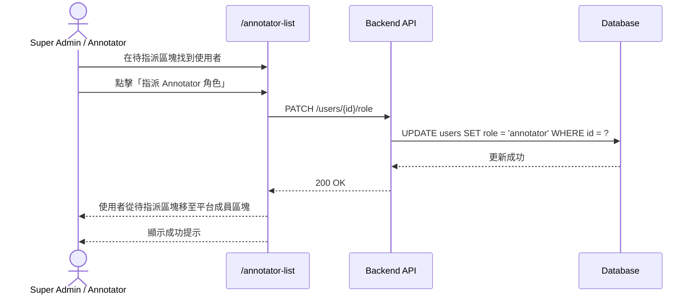
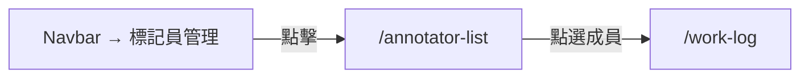

# 功能規格：平台成員列表（搜尋、啟用/停用）

**功能分支**：`008-annotator-list`
**建立日期**：2026-04-05
**狀態**：Clarified
**需求來源**：IA v7 Spec 清單 #008 — 平台成員列表（搜尋、啟用/停用）

## 流程說明

| 步驟 | 角色 | 動作 | 系統回應 |
|------|------|------|----------|
| 1 | Super Admin / Annotator | 在待指派區塊找到使用者 | 顯示待指派使用者的姓名與 Email |
| 2 | Super Admin / Annotator | 點擊「指派 Annotator 角色」 | 送出 PATCH 請求 |
| 3 | System | 更新 `users.role = annotator` | 寫入資料庫 |
| 4 | System | — | 使用者從待指派區塊移至平台成員區塊 |
| 5 | System | — | 顯示成功提示 |

---

## 使用者情境與測試 *(必填)*

### User Story 1 — 查看平台成員列表（優先級：P1）

具有 `annotator` 系統角色或 `super_admin` 的使用者在 `/annotator-list` 查看所有平台成員，可搜尋、篩選、啟用/停用成員。

**此優先級原因**：這是任務 PL 邀請標記員加入任務的入口，也是管理員維護平台成員的主要頁面。

**獨立測試方式**：登入後進入 `/annotator-list`，確認所有系統角色為 `annotator` 的平台成員均顯示，搜尋與篩選功能正常運作。

**驗收情境**：

1. **Given** 已登入使用者（`annotator` 或 `super_admin`）在 `/annotator-list`，**When** 頁面載入，**Then** 顯示所有系統角色為 `annotator` 的平台成員，包含姓名、Email、帳號狀態。
2. **Given** 使用者在 `/annotator-list`，**When** 輸入搜尋關鍵字（姓名或 Email），**Then** 列表即時篩選顯示符合結果。
3. **Given** 使用者在 `/annotator-list`，**When** 點選某成員，**Then** 導向該成員的 `/work-log` 頁面。
4. **Given** 空狀態（尚無任何平台成員），**When** 頁面載入，**Then** 顯示說明文字「尚無平台成員，請邀請使用者至 `/register` 或 Google SSO 自行加入」。

---

### User Story 2 — 任務 PL 邀請成員加入任務（優先級：P2）

任務 `project_leader` 在 `/annotator-list` 選取平台成員，邀請加入自己負責的任務並指派任務角色（`reviewer` 或 `annotator`）。

**此優先級原因**：任務人員指派是任務管理流程的重要環節，PL 需要從這裡選取標記員。

**獨立測試方式**：以 PL 角色登入，進入 `/annotator-list` 選取成員並指派任務角色，確認 `task_membership` 中建立對應記錄。

**驗收情境**：

1. **Given** 任務 PL 在 `/annotator-list`，**When** 選取成員並選擇要加入的任務與任務角色，**Then** `task_membership` 建立對應記錄，被邀請的成員可在 dashboard 看到新任務。
2. **Given** 任務 PL 在 `/annotator-list`，**When** 嘗試邀請已是該任務成員的使用者，**Then** 顯示「此成員已在任務中」，不建立重複記錄。

---

### 邊界情況

- 一般 `annotator` 可以停用其他成員嗎？→ 不行；任務層級的停用只有任務 `project_leader` 可執行；平台帳號停用只有 `super_admin` 可執行（spec 006）。
- 任務 PL 可以邀請 `super_admin` 加入任務嗎？→ 可以；`super_admin` 也可以擁有任務角色。

---

## 需求規格 *(必填)*

### 功能需求

- **FR-001**：`/annotator-list` 只有系統角色為 `annotator` 或 `super_admin` 的使用者可存取。
- **FR-002**：頁面必須列出所有系統角色為 `annotator` 的平台成員，顯示姓名、Email、帳號狀態。
- **FR-003**：任務 `project_leader` 可在 `/annotator-list` 停用或啟用平台成員在其負責任務中的參與狀態（任務層級）；`super_admin` 的平台帳號停用在 `/user-management` 管理（spec 006），不在此頁操作。
- **FR-004**：頁面必須支援依姓名或 Email 的即時搜尋篩選。
- **FR-005**：任務 `project_leader` 可從此列表選取成員，邀請加入自己負責的任務並指派任務角色（`reviewer` 或 `annotator`）。
- **FR-006**：點選成員列表中的任一成員，導向該成員的 `/work-log`。
- **FR-007**：空狀態（尚無任何平台成員）顯示引導說明文字。

### User Flow & Navigation

| From | Trigger | To |
|------|---------|-----|
| Navbar → 標記員管理 | 點擊 | `/annotator-list` |
| `/annotator-list` | 點選成員 | `/work-log`（該成員） |
| `/annotator-list` | 邀請成員操作 | 停留（頁面內操作，不跳轉）|

> **注意**：PL 邀請成員加入任務的操作在 `/annotator-list` 頁面內完成（彈窗或下拉選單選取任務與角色），操作完成後停留在 `/annotator-list`，不跳轉至 `/task-detail`。

**Entry points**：Navbar → 標記員管理；`/task-detail` 的「邀請成員」按鈕可開啟此頁（依實作方式，也可以 modal 形式呈現）。
**Exit points**：點選成員 → `/work-log`；其他操作停留在本頁。

### 關鍵實體

- **User（使用者）**：顯示欄位：`name`、`email`、`role`（系統角色）、`is_active`。
- **TaskMembership（任務成員）**：邀請成員時建立：`task_id`、`user_id`、`task_role`（`reviewer` | `annotator`）。

---

## 成功標準 *(必填)*

- **SC-001**：任務成員邀請後，`task_membership` 中建立正確記錄，不得有重複記錄。
