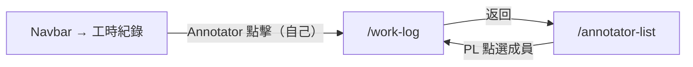

# 功能規格：工時紀錄

**功能分支**：`009-work-log`
**建立日期**：2026-04-05
**狀態**：Clarified
**需求來源**：IA v7 Spec 清單 #009 — 工時紀錄

## 使用者情境與測試 *(必填)*

### User Story 1 — Annotator 查看自己的工時紀錄（優先級：P1）

已登入的 `annotator` 在 `/work-log` 查看自己的出缺勤紀錄、各任務的標記時間與標記數量，作為工時結算的參考依據。

**此優先級原因**：工時紀錄是平台對標記員勞動付出的自動追蹤機制，標記員有權查看自己的紀錄。

**獨立測試方式**：以 annotator 身份登入，進入 `/work-log`，確認只顯示自己的工時資料，且與實際標記行為一致。

**驗收情境**：

1. **Given** 已登入 `annotator` 在 `/work-log`，**When** 頁面載入，**Then** 只顯示該使用者自己的工時紀錄（其他成員資料不可見）。
2. **Given** 已登入 `annotator` 在 `/work-log`，**When** 查看任務標記時間，**Then** 顯示每個任務的累計標記時間（系統自動追蹤，從進入到離開 annotation-workspace 的時間）。
3. **Given** 已登入 `annotator` 在 `/work-log`，**When** 查看任務標記數量，**Then** 顯示每個任務的完成筆數（Dry Run / Official Run 分開計算）。
4. **Given** 尚無任何工時紀錄的使用者，**When** 進入 `/work-log`，**Then** 顯示空狀態說明文字「尚無工時紀錄」。

---

### User Story 2 — Project Leader 查看任務成員工時（優先級：P2）

任務 `project_leader` 在 `/work-log` 查看自己負責任務的所有標記員工時紀錄，可按成員或任務篩選，作為工時結算依據。

**此優先級原因**：PL 需要彙整標記員的工時資料進行結算，是管理功能的重要一環。

**獨立測試方式**：以 PL 身份從 `/annotator-list` 點進某標記員的 `/work-log`，確認顯示該成員在 PL 負責任務中的工時資料。

**驗收情境**：

1. **Given** 任務 PL 從 `/annotator-list` 點選某標記員，**When** 進入該成員的 `/work-log`，**Then** 顯示該成員在 PL 所負責任務中的標記時間與標記數量。
2. **Given** 任務 PL 在成員的 `/work-log`，**When** 切換任務篩選，**Then** 只顯示選定任務的工時資料。
3. **Given** 任務 PL 查看非自己任務的成員工時，**Then** 系統拒絕存取，只顯示 PL 自己負責任務的成員資料。

---

### 邊界情況

- 工時紀錄是否包含 Dry Run 的標記時間？→ 是，Dry Run 與 Official Run 分開計算並標示。
- 計薪是否在系統內處理？→ 否；工時紀錄僅作為依據，實際計薪由系統外部處理（IA §4 明確說明）。

---

## 需求規格 *(必填)*

### 功能需求

- **FR-001**：`/work-log` 只有已登入使用者可存取；`annotator` 只能查看自己的紀錄；任務 `project_leader` 可查看其負責任務的成員紀錄；`super_admin` 可查看所有平台成員的工時紀錄。
- **FR-002**：系統必須在使用者進入與離開 `annotation-workspace` 時自動記錄時間，作為任務標記時間的計算依據。
- **FR-003（出缺勤紀錄）**：系統自動記錄每日是否有至少一次進入 `annotation-workspace` 的行為，作為出勤依據；未進行任何標記的日期標記為缺勤。出缺勤紀錄不需使用者手動打卡。
- **FR-004**：頁面必須顯示各任務的累計標記時間、完成筆數（Dry Run / Official Run 分開）。
- **FR-005**：頁面必須支援依任務篩選。
- **FR-006**：PL 查看成員工時時，只能查看自己負責任務中的成員資料，不得存取非所屬任務的成員資料。
- **FR-007**：空狀態（尚無工時紀錄）顯示說明文字「尚無工時紀錄」。

### User Flow & Navigation

| From | Trigger | To |
|------|---------|-----|
| Navbar → 工時紀錄 | `annotator` 點擊 | `/work-log`（自己的紀錄）|
| `/annotator-list` | PL 點選成員 | `/work-log`（該成員紀錄）|
| `/work-log` | 返回按鈕 | `/annotator-list`（PL）或 `/dashboard`（annotator）|

**Entry points**：Navbar → 工時紀錄（`annotator`）；`/annotator-list` → 點選成員（PL）。
**Exit points**：返回 `/annotator-list`（PL）或 `/dashboard`（`annotator`）。

### 關鍵實體

- **WorkLog**：關鍵屬性：`user_id`、`task_id`、`run_type`（`dry_run` | `official_run`）、`started_at`、`ended_at`、`annotation_count`。系統於 `annotation-workspace` 進入與離開時自動寫入。

---

## 成功標準 *(必填)*

- **SC-001**：`annotator` 進入 `/work-log` 只能看到自己的資料，無法存取其他成員的工時。
- **SC-002**：標記時間自動追蹤，不需標記員手動填寫。
- **SC-003**：Dry Run 與 Official Run 的工時與筆數分開顯示，不混計。
