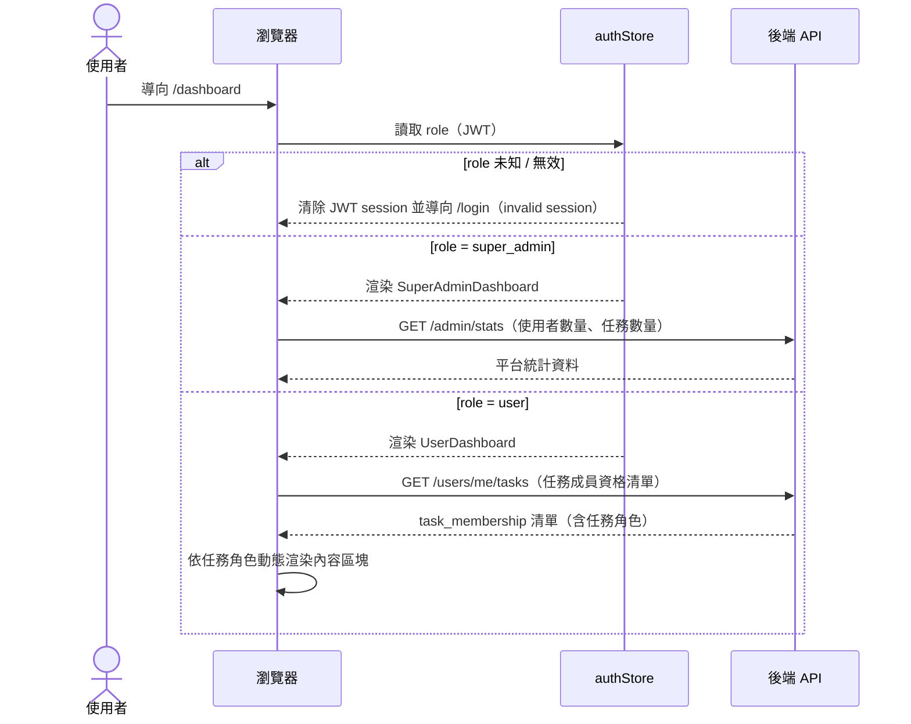
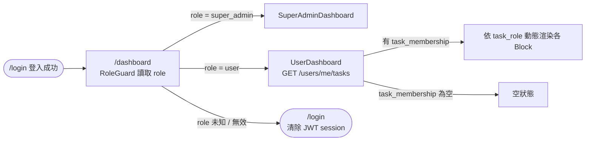
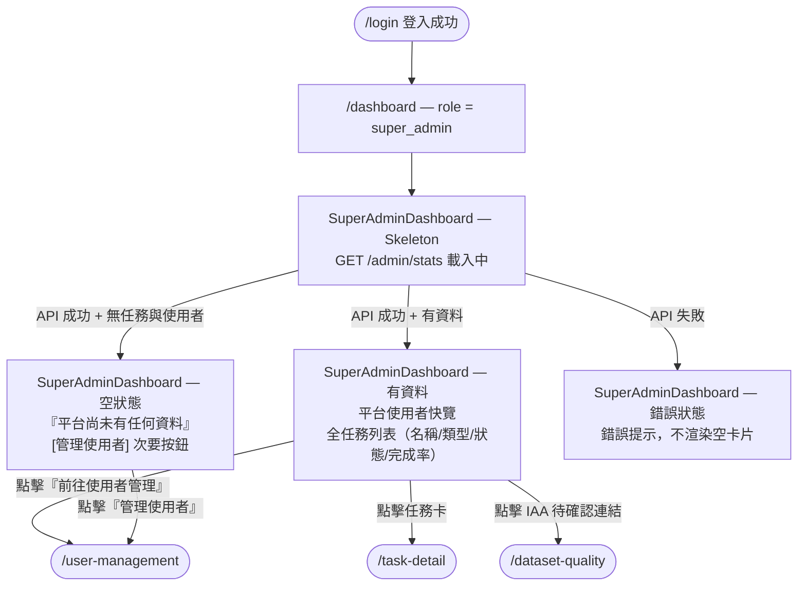
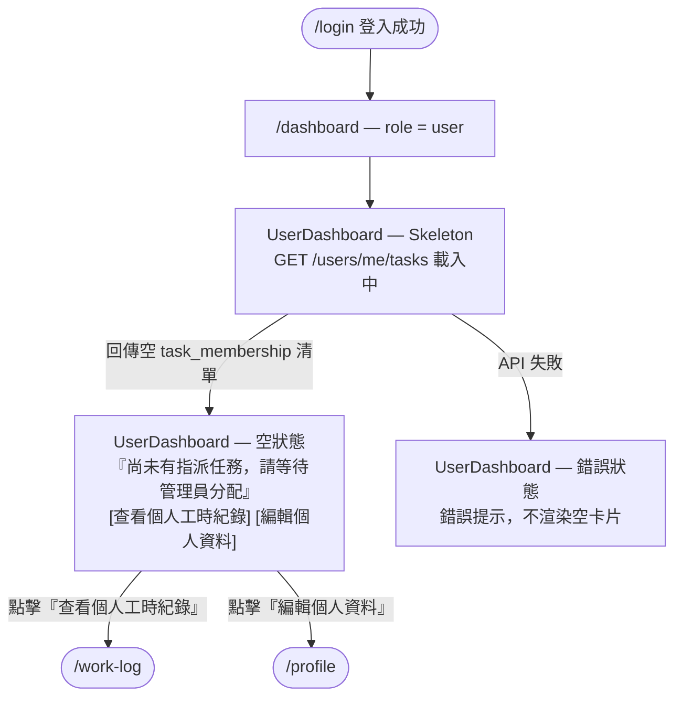
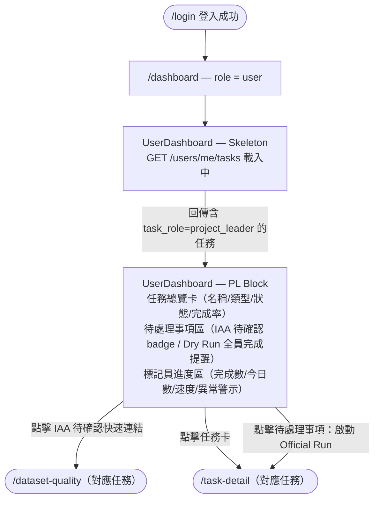
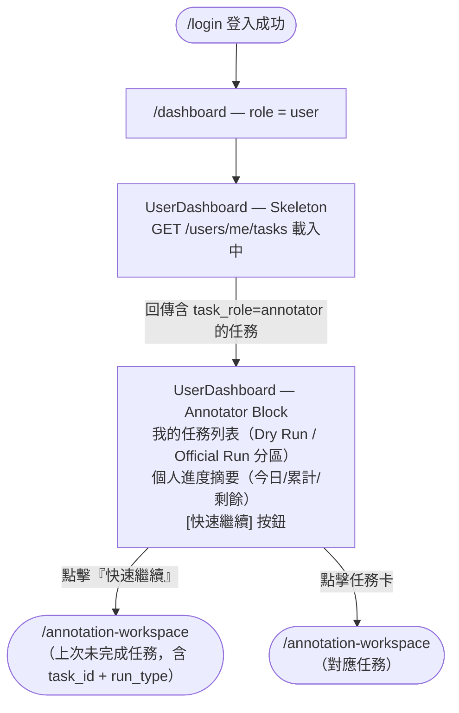
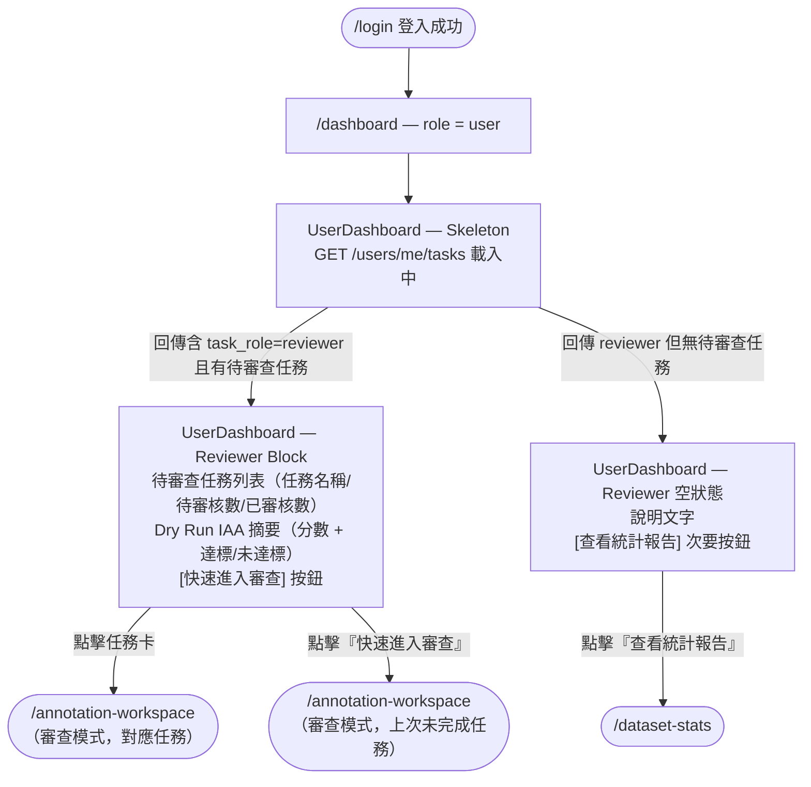

# 功能規格：Dashboard — 儀表板

**功能分支**：`012-dashboard`
**建立日期**：2026-04-05
**狀態**：Draft
**需求來源**：IA v7 Spec 清單 #011 · #012 · #013 · #014 · #042 — Dashboard 儀表板（Annotator / Super Admin / Reviewer / Project Leader / User 空狀態）

---

## Process Flow

| 步驟 | 角色 | 動作 | 系統回應 |
|------|------|------|---------|
| 1 | 使用者 | 導向 `/dashboard` | 前端從 `authStore` 讀取 System Role（`role`）|
| 2a | RoleGuard | `role` 未知 / 無效 | 清除 JWT session 並導向 `/login`（invalid session，防止無窮重導）|
| 2b | 前端 | `role = super_admin` | 渲染 `SuperAdminDashboard`，呼叫 `/admin/stats` |
| 2c | 前端 | `role = user` | 渲染 `UserDashboard`，呼叫 `/users/me/tasks` 取得任務成員資格清單 |
| 3 | 前端 | 收到任務成員資格清單 | 依各任務的 `task_role` 動態渲染對應內容區塊（Project Leader / Reviewer / Annotator）|
| 4 | 使用者 | 點擊卡片 / 快捷連結 | 導向對應模組頁面 |

---

## 使用者情境與測試 *(必填)*

### User Story 1 — Super Admin 檢視平台總覽（優先級：P1）

Super Admin 登入後看到平台總覽儀表板：平台使用者各角色帳號數量、快速進入 `user-management` 的連結、所有任務列表（名稱、類型、狀態、完成率）以及標記員進度。若平台剛部署尚無資料，顯示空狀態說明與「管理使用者」快捷按鈕。

**此優先級原因**：Super Admin Dashboard 是首次部署後管理員唯一的操作入口，必須在任何其他功能開放前提供基本的平台狀態可見性。

**獨立測試方式**：以 `super_admin` 帳號登入，驗證系統渲染 `SuperAdminDashboard`，確認平台使用者統計數字與任務列表正確顯示；新部署環境下確認空狀態與「管理使用者」按鈕。

**驗收情境**：

1. **Given** `role = super_admin` 的已登入使用者，**When** 導向 `/dashboard`，**Then** 系統渲染 `SuperAdminDashboard`，顯示平台使用者快覽（各角色帳號數）與「前往使用者管理」連結。
2. **Given** 平台已有任務資料的 Super Admin，**When** 檢視儀表板，**Then** 顯示所有任務列表，每筆含任務名稱、任務類型、當前狀態、整體完成率進度條。
3. **Given** 剛部署的 Super Admin（無任務與使用者資料），**When** 導向 `/dashboard`，**Then** 顯示空狀態說明文字「平台尚未有任何資料」與「管理使用者」次要按鈕（→ `user-management`）。

---

### User Story 2 — User 無任務空狀態引導（優先級：P1）

擁有 `user` 系統角色但尚未被任何 Project Leader 指派任務的使用者，登入後看到空狀態說明與引導連結，提示等待 Project Leader 邀請，並提供次要操作入口（工時紀錄、個人資料）。

**此優先級原因**：空狀態是首次使用者或尚未被指派任務時的常見情境，提供明確引導可降低使用者困惑，但不影響核心標記流程。

**獨立測試方式**：以無任何任務指派的 `user` 帳號登入，確認儀表板顯示空狀態訊息（不顯示空白任務列表），且「查看個人工時紀錄」與「編輯個人資料」連結可正確導向對應頁面。

**驗收情境**：

1. **Given** 尚未被指派任務的 `user` 使用者，**When** 導向 `/dashboard`，**Then** 顯示空狀態說明文字「尚未有指派任務，請等待管理員分配」，不顯示空白任務列表。
2. **Given** 空狀態的 `user` 使用者，**When** 點擊「查看個人工時紀錄」，**Then** 導向 `/work-log`。
3. **Given** 空狀態的 `user` 使用者，**When** 點擊「編輯個人資料」，**Then** 導向 `/profile`。

---

### User Story 3 — User 以 project_leader 角色檢視任務進度（優先級：P2）

擁有 `user` 系統角色且在至少一項任務中持有 `project_leader` 任務角色的使用者，登入後可在儀表板看到其負責任務的總覽卡、待處理事項提醒（IAA 待確認 / Dry Run 全員完成），以及標記員進度區。

**此優先級原因**：Project Leader 是任務生命週期的核心管理者，儀表板必須提供即時的任務狀態與待處理提醒，但因需要任務資料存在才能驗證，優先級次於基本登入流程。

**獨立測試方式**：以持有 project_leader task_role 的 `user` 帳號登入，確認 UserDashboard 正確渲染任務總覽卡、待處理事項區與標記員進度區；確認點擊 IAA 待確認連結可導向 `/dataset-quality`。

**驗收情境**：

1. **Given** 在任務 A 持有 `project_leader` 任務角色的使用者，**When** 導向 `/dashboard`，**Then** 顯示任務 A 的任務總覽卡（名稱、類型、狀態、整體完成率進度條）。
2. **Given** 任務 A 的 Dry Run 已全員完成的 project_leader，**When** 檢視儀表板，**Then** 待處理事項區顯示「Dry Run 已全員完成，請啟動 Official Run」提醒。
3. **Given** 任務 A 有 IAA 結果待確認的 project_leader，**When** 點擊 IAA 待確認快速連結，**Then** 導向 `/dataset-quality`（對應任務）。

---

### User Story 4 — User 以 annotator 角色檢視已指派任務（優先級：P2）

擁有 `user` 系統角色且已被指派至少一項任務的使用者，登入後可在儀表板看到我的任務清單（分 Dry Run / Official Run 兩區）、個人進度摘要，以及「快速繼續」按鈕直接跳回上次未完成的任務。

**此優先級原因**：標記者每次登入的核心目標是繼續標記任務，儀表板必須在第一時間提供正確的任務狀態與進入點。

**獨立測試方式**：以有任務指派的 `user` 帳號登入，確認任務清單、完成進度數字與「快速繼續」按鈕正確顯示；點擊「快速繼續」確認導向 `/annotation-workspace`。

**驗收情境**：

1. **Given** 已被指派任務的 `user` 使用者，**When** 導向 `/dashboard`，**Then** 顯示「我的任務列表」，分 Dry Run 與 Official Run 兩區，每筆顯示任務名稱、已完成數 / 總分配數、狀態（未開始 / 進行中 / 已提交）。
2. **Given** 已被指派任務的 `user` 使用者，**When** 檢視儀表板，**Then** 顯示個人進度摘要：今日完成數、累計完成數、距離本任務完成還剩幾筆。
3. **Given** 上次有未完成任務的 `user` 使用者，**When** 點擊「快速繼續」按鈕，**Then** 直接導向對應任務的 `/annotation-workspace`。

---

### User Story 5 — User 以 reviewer 角色檢視待審查任務（優先級：P2）

擁有 `user` 系統角色且在至少一項任務中持有 `reviewer` 任務角色的使用者，登入後可在儀表板看到待審查任務列表、Dry Run IAA 摘要，以及快速進入審查按鈕；若目前無待審查任務則顯示空狀態與次要連結。

**此優先級原因**：Reviewer 的核心工作入口是 annotation-workspace 審查模式，儀表板提供任務導覽但不是唯一入口，故優先級次於 Annotator 的標記流程。

**獨立測試方式**：以持有 reviewer task_role 的 `user` 帳號登入，確認 UserDashboard 正確渲染待審查任務列表與 IAA 摘要；確認點擊任務卡可導向 `/annotation-workspace` 審查模式；確認無任務時顯示空狀態。

**驗收情境**：

1. **Given** 在任務 A 持有 `reviewer` 任務角色的使用者，**When** 導向 `/dashboard`，**Then** 顯示任務 A 的待審查任務列表（任務名稱、待審核筆數、已審核 / 總筆數）。
2. **Given** 上述 reviewer，**When** 點選任務 A 的任務卡，**Then** 直接進入 `/annotation-workspace` 審查模式（任務 A）。
3. **Given** 任務 A Dry Run 進行中的 reviewer，**When** 檢視儀表板，**Then** Dry Run IAA 摘要顯示當前 IAA 分數與達標 / 未達標狀態。
4. **Given** 目前無待審查任務的 reviewer，**When** 導向 `/dashboard`，**Then** 顯示空狀態說明文字與「查看統計報告」次要按鈕（→ `/dataset-stats`）。

---

### 邊界情況

- `role` 為 JWT 中未定義的未知值時？→ 清除 JWT session 並導向 `/login`（invalid session）。
- `user` 使用者在不同任務中同時擔任 `project_leader` 與 `annotator` 任務角色時？→ `UserDashboard` 依各任務的 `task_role` 動態渲染各自的內容區塊，不合併顯示。多個任務角色區塊並存時，依優先順序垂直堆疊：`project_leader` Block 最上方，其次 `reviewer` Block，最後 `annotator` Block。
- `/admin/stats` 或 `/users/me/tasks` API 回應延遲或失敗時？→ 顯示 loading skeleton；若最終失敗則顯示錯誤提示，不渲染空的任務列表。
- `user` 使用者曾有任務但所有任務均已完成時？→ 顯示任務列表（狀態「已提交 / 已完成」），不觸發空狀態。

---

## 需求規格 *(必填)*

### 功能需求

- **FR-001**：`DashboardPage` 必須以 `role ===` 明確比對進行 role dispatch：`super_admin` → `SuperAdminDashboard`；`user` → `UserDashboard`；未知 / 無效值 → 清除 JWT session 並導向 `/login`。
- **FR-002**：只有 `role = super_admin` 的使用者 MUST 能看到 `SuperAdminDashboard`（平台使用者快覽、使用者管理快捷連結）— 由 RoleGuard 強制執行。
- **FR-003**：只有 `role = user` 的使用者 MUST 能看到 `UserDashboard` — 由 RoleGuard 強制執行。
- **FR-004**：`SuperAdminDashboard` 必須顯示平台使用者各角色帳號數量，並提供「前往使用者管理」快捷連結（→ `/user-management`）。
- **FR-005**：`SuperAdminDashboard` 必須顯示所有任務列表，每筆顯示：任務名稱、任務類型、當前狀態、整體完成率進度條。
- **FR-006**：`UserDashboard` 必須呼叫 `/users/me/tasks` 取得任務成員資格清單，並依各任務的 `task_role` 動態渲染對應內容區塊。
- **FR-007**：`UserDashboard` 中 `task_role = annotator` 的任務區塊必須顯示：我的任務列表（Dry Run / Official Run 分區，含任務名稱、已完成數 / 總分配數、狀態）、個人進度摘要（今日完成數、累計完成數、剩餘筆數）、「快速繼續」按鈕（→ `/annotation-workspace`）。
- **FR-008**：`UserDashboard` 無任務時（`role = user` 但未被指派任務）必須顯示空狀態訊息與次要按鈕（「查看個人工時紀錄」→ `/work-log`；「編輯個人資料」→ `/profile`）。
- **FR-009**：`SuperAdminDashboard` 無任何任務與使用者資料時必須顯示空狀態說明與「管理使用者」次要按鈕（→ `/user-management`）。
- **FR-010**：儀表板所有 API 呼叫在回應期間必須顯示 loading skeleton；呼叫失敗時顯示錯誤提示，不渲染空內容。
- **FR-011**：儀表板頁面必須支援響應式設計（375px、768px、1440px）。
- **FR-012**：儀表板頁面必須支援 zh-TW / en 語言切換，與應用程式其他頁面一致。
- **FR-013**：`UserDashboard` 中 `task_role = project_leader` 的任務區塊必須顯示：任務總覽卡（任務名稱、任務類型、當前狀態、整體完成率進度條）、待處理事項區（IAA 結果待確認附快速連結至 `/dataset-quality`；Dry Run 已全員完成待啟動 Official Run）、標記員進度區（各標記員本任務完成數 / 今日完成數 / 平均速度，速度異常者標示警示）。
- **FR-014**：`UserDashboard` 中 `task_role = reviewer` 的任務區塊必須顯示：待審查任務列表（任務名稱、待審核筆數、已審核 / 總筆數；點選任務卡 → `/annotation-workspace` 審查模式）、Dry Run IAA 摘要（IAA 分數依任務類型顯示對應指標、達標 / 未達標狀態）、快速進入審查按鈕（→ `/annotation-workspace`）；無待審查任務時顯示說明文字與「查看統計報告」次要按鈕（→ `/dataset-stats`）。

### User Flow & Navigation

> 每個 User Story 對應獨立的 flow 圖與畫面狀態清單，以利後續 wireframe 繪製時逐一對應每個畫面狀態。所有 flow 均以「`/login` 登入成功」為共同起點。

#### 系統角色 Dispatch（全域）

---

#### US1 — Super Admin 檢視平台總覽

**畫面狀態清單（wireframe 對應）：**

| 畫面狀態 | 需繪製 | 說明 |
|---------|:------:|------|
| `SuperAdminDashboard — Skeleton` | ✅ | 全頁骨架，卡片區顯示灰色佔位 |
| `SuperAdminDashboard — 有資料` | ✅ | 平台使用者快覽 + 全任務列表（名稱/類型/狀態/完成率）|
| `SuperAdminDashboard — 空狀態` | ✅ | 空狀態說明文字 + 「管理使用者」次要按鈕 |
| `SuperAdminDashboard — 錯誤` | ✅ | 錯誤提示區塊，不渲染空白卡片 |

**Navigation 表：**

| From | Trigger | To |
|------|---------|-----|
| `SuperAdminDashboard — 有資料` | 「前往使用者管理」快捷連結 | `/user-management` |
| `SuperAdminDashboard — 有資料` | 點擊任務卡 | `/task-detail`（對應任務）|
| `SuperAdminDashboard — 有資料` | IAA 待確認快速連結 | `/dataset-quality`（對應任務）|
| `SuperAdminDashboard — 空狀態` | 「管理使用者」次要按鈕 | `/user-management` |

---

#### US2 — User 無任務空狀態引導

**畫面狀態清單（wireframe 對應）：**

| 畫面狀態 | 需繪製 | 說明 |
|---------|:------:|------|
| `UserDashboard — Skeleton` | ✅（共用）| 全頁骨架 |
| `UserDashboard — 空狀態` | ✅ | 空狀態插圖 + 說明文字 + 兩個次要按鈕 |

**Navigation 表：**

| From | Trigger | To |
|------|---------|-----|
| `UserDashboard — 空狀態` | 「查看個人工時紀錄」次要按鈕 | `/work-log` |
| `UserDashboard — 空狀態` | 「編輯個人資料」次要按鈕 | `/profile` |

---

#### US3 — User 以 project_leader 角色檢視任務進度

**畫面狀態清單（wireframe 對應）：**

| 畫面狀態 | 需繪製 | 說明 |
|---------|:------:|------|
| `UserDashboard — Skeleton` | ✅（共用）| 全頁骨架 |
| `UserDashboard — PL Block（有任務）` | ✅ | 任務總覽卡 + 待處理事項區（含 badge）+ 標記員進度區 |

**Navigation 表：**

| From | Trigger | To |
|------|---------|-----|
| `UserDashboard — PL Block` | 點擊任務卡 | `/task-detail`（對應任務）|
| `UserDashboard — PL Block` | IAA 待確認快速連結 | `/dataset-quality`（對應任務）|
| `UserDashboard — PL Block` | 待處理事項：啟動 Official Run | `/task-detail`（對應任務，Official Run tab）|

---

#### US4 — User 以 annotator 角色檢視已指派任務

**畫面狀態清單（wireframe 對應）：**

| 畫面狀態 | 需繪製 | 說明 |
|---------|:------:|------|
| `UserDashboard — Skeleton` | ✅（共用，US2～US5 同一張）| 全頁骨架 |
| `UserDashboard — Annotator Block` | ✅ | 任務列表（Dry Run + Official Run）+ 進度摘要 + 快速繼續按鈕 |

**Navigation 表：**

| From | Trigger | To |
|------|---------|-----|
| `UserDashboard — Annotator Block` | 「快速繼續」按鈕 | `/annotation-workspace`（上次未完成任務，帶 `task_id` + `run_type`）|
| `UserDashboard — Annotator Block` | 點擊任務卡 | `/annotation-workspace`（對應任務）|

---

#### US5 — User 以 reviewer 角色檢視待審查任務

**畫面狀態清單（wireframe 對應）：**

| 畫面狀態 | 需繪製 | 說明 |
|---------|:------:|------|
| `UserDashboard — Skeleton` | ✅（共用）| 全頁骨架 |
| `UserDashboard — Reviewer Block（有任務）` | ✅ | 待審查任務列表 + IAA 摘要區 + 快速進入審查按鈕 |
| `UserDashboard — Reviewer 空狀態` | ✅ | 空狀態說明文字 + 「查看統計報告」次要按鈕 |

**Navigation 表：**

| From | Trigger | To |
|------|---------|-----|
| `UserDashboard — Reviewer Block` | 點擊任務卡 | `/annotation-workspace`（審查模式，對應任務）|
| `UserDashboard — Reviewer Block` | 「快速進入審查」按鈕 | `/annotation-workspace`（審查模式，上次未完成任務）|
| `UserDashboard — Reviewer 空狀態` | 「查看統計報告」次要按鈕 | `/dataset-stats` |

---

### Wireframe 畫面總覽

> 本節為所有需繪製 wireframe 畫面的集中索引，供繪圖前確認範圍、標注共用畫面、對應 Page 命名。
>
> **單一檔案**：所有畫面集中在一個 `.pen` 檔 `design/wireframes/pages/dashboard/dashboard.pen`，每個畫面狀態為檔案內的獨立 **Page**，不拆分為多個 `.pen` 檔。此設計對應路由結構（`/dashboard` 為單一路由），並與後續 `design/prototype/pages/dashboard/dashboard.html` 一一對應。
>
> **共用畫面**：標注「✦ 共用」的 Page 僅繪製一次，在各 US 流程中重複引用。
>
> **多角色並存**：同一 `user` 在不同任務中同時持有多個 task role（如 PL + Annotator + Reviewer），`UserDashboard` 以垂直堆疊方式渲染各 Block（順序：PL Block → Reviewer Block → Annotator Block）。此情境不需額外 Page，可在各 Block Page 下方標注說明即可。

#### 總計：11 張

| 角色 | 畫面數 |
|------|:------:|
| Super Admin（system role = `super_admin`） | 4 |
| User 共用 Skeleton（system role = `user`） | 1 |
| User — 錯誤狀態 | 1 |
| User — 無任務空狀態 | 1 |
| User — Project Leader Block | 1 |
| User — Annotator Block | 1 |
| User — Reviewer Block | 2 |
| **合計** | **11** |

---

#### SuperAdminDashboard — 4 張

> 觸發條件：`authStore.role === 'super_admin'`。由 RoleGuard 強制，`user` 無法存取。

| ID | 畫面狀態 | Page 名稱 | 對應 US | 需繪製內容 | 導出導航 |
|----|---------|----------|---------|-----------|---------|
| SA-1 | **Skeleton** | `SA-1 SuperAdmin Skeleton` | US1 | 全頁灰色骨架佔位：Header、使用者快覽卡區（灰塊 ×N）、任務列表區（灰色列 ×N）；無實際數字，無操作元件 | — |
| SA-2 | **有資料** | `SA-2 SuperAdmin 有資料` | US1 | ① 平台使用者快覽：各系統角色帳號數（`user_count`、`super_admin_count`）統計卡 + 「前往使用者管理」快捷連結 ② 全任務列表：表格或卡片，每筆顯示任務名稱、任務類型（`classification` / `scoring` 等）、當前狀態（草稿 / Dry Run / IAA 確認 / Official Run / 已完成）、整體完成率進度條 ③ 若有 IAA 結果待確認的任務，顯示快速連結至 `/dataset-quality` | 「前往使用者管理」→ `/user-management`；任務卡點擊 → `/task-detail`；IAA 快速連結 → `/dataset-quality` |
| SA-3 | **空狀態** | `SA-3 SuperAdmin 空狀態` | US1 | 空狀態插圖或圖示 + 說明文字「平台尚未有任何資料」+ 「管理使用者」次要按鈕（outlined / ghost 樣式）；不顯示任何任務列表或統計卡 | 「管理使用者」→ `/user-management` |
| SA-4 | **錯誤** | `SA-4 SuperAdmin 錯誤` | US1 | `/admin/stats` 呼叫失敗：錯誤提示區塊（icon + 說明文字 + 「重試」按鈕）；不渲染任何空白卡片或 placeholder 數字 | 「重試」→ 重新呼叫 `/admin/stats` |

---

#### UserDashboard — 共用畫面 — 2 張

> 觸發條件：`authStore.role === 'user'`，`GET /users/me/tasks` 載入中（Skeleton）或失敗（錯誤）。US2～US5 均共用此兩張畫面。

| ID | 畫面狀態 | Page 名稱 | 對應 US | 需繪製內容 | 導出導航 |
|----|---------|----------|---------|-----------|---------|
| U-0 | **Skeleton** ✦ 共用 | `U-0 User Skeleton` | US2、US3、US4、US5 | 全頁灰色骨架佔位：Header、內容區灰塊（高度模擬單一或多 Block 的大約佔位）；無實際數字，無 Block 標題，無操作元件 | — |
| U-7 | **錯誤** ✦ 共用 | `U-7 User 錯誤` | US2、US3、US4、US5 | `/users/me/tasks` 呼叫失敗：錯誤提示區塊（icon + 說明文字 + 「重試」按鈕）；不渲染任何空白卡片或 placeholder 數字 | 「重試」→ 重新呼叫 `/users/me/tasks` |

---

#### UserDashboard — US2 無任務空狀態 — 1 張

> 觸發條件：`/users/me/tasks` 回傳空清單（`task_membership` 為空）。

| ID | 畫面狀態 | Page 名稱 | 對應 US | 需繪製內容 | 導出導航 |
|----|---------|----------|---------|-----------|---------|
| U-1 | **空狀態** | `U-1 User 空狀態` | US2 | 空狀態插圖或圖示 + 說明文字「尚未有指派任務，請等待管理員分配」+ 兩個次要按鈕：「查看個人工時紀錄」（→ `/work-log`）、「編輯個人資料」（→ `/profile`）；不顯示任何任務列表或 Block | 「查看個人工時紀錄」→ `/work-log`；「編輯個人資料」→ `/profile` |

---

#### UserDashboard — US3 Project Leader Block — 1 張

> 觸發條件：`/users/me/tasks` 回傳至少一筆 `task_role = project_leader` 的任務成員資格。

| ID | 畫面狀態 | Page 名稱 | 對應 US | 需繪製內容 | 導出導航 |
|----|---------|----------|---------|-----------|---------|
| U-2 | **PL Block — 有任務** | `U-2 PL Block 有任務` | US3 | ① **任務總覽卡**：任務名稱、任務類型、當前狀態（badge）、整體完成率進度條 ② **待處理事項區**：IAA 結果待確認（badge + 快速連結 → `/dataset-quality`）、Dry Run 已全員完成提醒（→ 啟動 Official Run）③ **標記員進度區**：各標記員本任務完成數 / 今日完成數 / 平均速度，速度異常者顯示警示圖示或醒目顏色標示 | IAA 待確認 → `/dataset-quality`；任務卡 → `/task-detail`；啟動 Official Run → `/task-detail`（Official Run tab）|

---

#### UserDashboard — US4 Annotator Block — 1 張

> 觸發條件：`/users/me/tasks` 回傳至少一筆 `task_role = annotator` 的任務成員資格。

| ID | 畫面狀態 | Page 名稱 | 對應 US | 需繪製內容 | 導出導航 |
|----|---------|----------|---------|-----------|---------|
| U-4 | **Annotator Block** | `U-4 Annotator Block` | US4 | ① **我的任務列表**（分兩區）：Dry Run 區 + Official Run 區，每筆顯示任務名稱、已完成數 / 總分配數、狀態（未開始 / 進行中 / 已提交）② **個人進度摘要**：今日完成數、累計完成數、距離本任務完成還剩幾筆 ③ **「快速繼續」按鈕**（主要按鈕，導向上次未完成任務的 `/annotation-workspace`，帶 `task_id` + `run_type` 參數）| 「快速繼續」→ `/annotation-workspace`（上次未完成任務）；任務卡點擊 → `/annotation-workspace`（對應任務）|

---

#### UserDashboard — US5 Reviewer Block — 2 張

> 觸發條件：`/users/me/tasks` 回傳至少一筆 `task_role = reviewer` 的任務成員資格。

| ID | 畫面狀態 | Page 名稱 | 對應 US | 需繪製內容 | 導出導航 |
|----|---------|----------|---------|-----------|---------|
| U-5 | **Reviewer Block — 有任務** | `U-5 Reviewer Block 有任務` | US5 | ① **待審查任務列表**：任務名稱、待審核筆數、已審核 / 總筆數，點擊任務卡 → `/annotation-workspace`（審查模式）② **Dry Run IAA 摘要**：當前 IAA 分數（依任務類型顯示對應指標）+ 達標 / 未達標狀態（圖示或顏色）③ **「快速進入審查」按鈕**（主要按鈕，導向上次未完成任務的審查模式）| 任務卡點擊 → `/annotation-workspace`（審查模式）；「快速進入審查」→ `/annotation-workspace`（審查模式，上次未完成）|
| U-6 | **Reviewer 空狀態** | `U-6 Reviewer 空狀態` | US5 | `reviewer` task_role 存在但目前無待審查任務：說明文字（無待審查任務）+ 「查看統計報告」次要按鈕（→ `/dataset-stats`）；不顯示任務列表或 IAA 摘要 | 「查看統計報告」→ `/dataset-stats` |

---

#### 畫面 ID 彙整索引

檔案：`design/wireframes/pages/dashboard/dashboard.pen`

| 畫面 ID | 角色 | 畫面狀態 | Page 名稱（dashboard.pen 內）|
|--------|------|---------|------------------------------|
| SA-1 | Super Admin | Skeleton | `SA-1 SuperAdmin Skeleton` |
| SA-2 | Super Admin | 有資料 | `SA-2 SuperAdmin 有資料` |
| SA-3 | Super Admin | 空狀態 | `SA-3 SuperAdmin 空狀態` |
| SA-4 | Super Admin | 錯誤 | `SA-4 SuperAdmin 錯誤` |
| U-0 | User（共用） | Skeleton | `U-0 User Skeleton` |
| U-7 | User（共用） | 錯誤 | `U-7 User 錯誤` |
| U-1 | User | 空狀態（無任務） | `U-1 User 空狀態` |
| U-2 | User / PL | PL Block — 有任務 | `U-2 PL Block 有任務` |
| U-4 | User / Annotator | Annotator Block | `U-4 Annotator Block` |
| U-5 | User / Reviewer | Reviewer Block — 有任務 | `U-5 Reviewer Block 有任務` |
| U-6 | User / Reviewer | Reviewer 空狀態 | `U-6 Reviewer 空狀態` |

### 關鍵實體

- **User（使用者）**：`authStore` 持有 `role`（System Role，JWT 單值：`super_admin` 或 `user`）。Dashboard role dispatch 以 `role` 為唯一依據，所有已註冊使用者均持有 `user` 系統角色。
- **TaskMembership（任務成員資格）**：`task_membership(task_id, user_id, task_role)` 表。`UserDashboard` 透過 `/users/me/tasks` 取得，任務角色（`project_leader` / `reviewer` / `annotator`）決定各區塊內容渲染邏輯。Task Role 不存於 JWT，必須每次從 API 取得。
- **TaskSummaryCard（任務摘要卡）**：儀表板中每筆任務的顯示單元。

  | 欄位 | 來源 | 說明 |
  |------|------|------|
  | `task_id` | `task_membership` | 任務唯一識別碼 |
  | `task_name` | `tasks` 表 | 任務名稱 |
  | `task_type` | `tasks` 表 | 任務類型（`classification` / `scoring` 等）|
  | `status` | `tasks` 表 | 草稿 / Dry Run 進行中 / 等待 IAA 確認 / Official Run 進行中 / 已完成 |
  | `completion_rate` | 計算欄位 | 整體完成率（完成筆數 / 總分配筆數）|
  | `task_role` | `task_membership` 表 | 使用者在此任務的角色 |
  | `assigned_count` | `task_membership` 表 | 分配給此標記員的總筆數（Annotator 視角）|
  | `completed_count` | 標記記錄表 | 此標記員已完成筆數（Annotator 視角）|

- **PlatformStats（平台統計）**：Super Admin 專屬，由 `/admin/stats` 提供。欄位：各系統角色帳號數（`user_count`、`super_admin_count`）、全平台任務總數。

---

## 成功標準 *(必填)*

- **SC-001**：`role = super_admin` 使用者導向 `/dashboard` 時，系統渲染 `SuperAdminDashboard` 且不顯示 `UserDashboard` 的任何內容。
- **SC-002**：`role = user` 使用者導向 `/dashboard` 時，系統渲染 `UserDashboard` 且不顯示 `SuperAdminDashboard` 的任何內容。
- **SC-003**：未知 / 無效 role 的使用者導向 `/dashboard` 時，清除 JWT session 並在 500ms 內導向 `/login`，不渲染任何 dashboard 內容。
- **SC-004**：`UserDashboard` 的任務清單資料與後端 `task_membership` 一致，無多餘或遺漏任務。
- **SC-005**：API 呼叫失敗時儀表板顯示可辨識的錯誤提示，不渲染空白卡片或顯示 undefined / null 值。
- **SC-006**：儀表板頁面在視窗寬度 375px、768px、1440px 下均正確渲染，無版型破版。
- **SC-007**：儀表板頁面正確顯示 zh-TW 與 en 兩種語言；語言切換立即生效，不需重新載入頁面。
- **SC-008**：「快速繼續」按鈕導向正確的 `/annotation-workspace`（任務 ID 與 run_type 參數正確）。
- **SC-009**：僅持有 `task_role = project_leader` 的使用者在 `UserDashboard` 看到任務總覽卡與標記員進度區，不顯示 annotator 或 reviewer 的任務區塊。
- **SC-010**：僅持有 `task_role = reviewer` 的使用者在 `UserDashboard` 看到待審查任務列表與 IAA 摘要，不顯示 annotator 或 project_leader 的任務區塊。
- **SC-011**：同時持有多個 task role 的使用者，各 task role 對應的任務區塊均正確獨立渲染，不互相合併或覆蓋。
