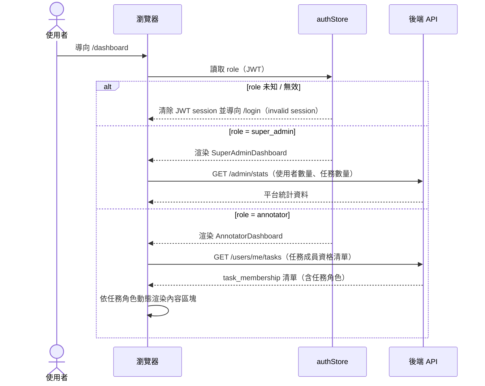
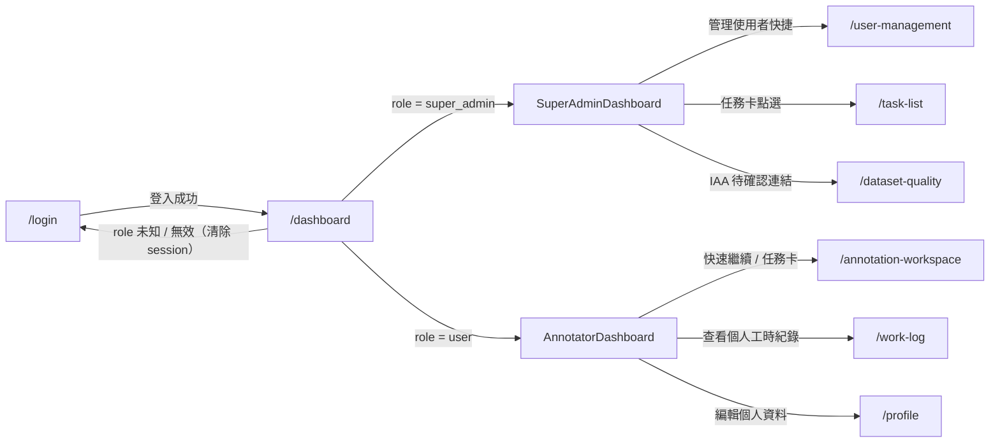

# 功能規格：Dashboard — 儀表板

**功能分支**：`012-dashboard`
**建立日期**：2026-04-05
**狀態**：Draft
**需求來源**：IA v7 Spec 清單 #012 — Dashboard 儀表板

---

## Process Flow

| 步驟 | 角色 | 動作 | 系統回應 |
|------|------|------|---------|
| 1 | 使用者 | 導向 `/dashboard` | 前端從 `authStore` 讀取 System Role（`role`）|
| 2a | RoleGuard | `role` 未知 / 無效 | 清除 JWT session 並導向 `/login`（invalid session，防止無窮重導）|
| 2b | 前端 | `role = super_admin` | 渲染 `SuperAdminDashboard`，呼叫 `/admin/stats` |
| 2c | 前端 | `role = user` | 渲染 `AnnotatorDashboard`，呼叫 `/users/me/tasks` 取得任務成員資格清單 |
| 3 | 前端 | 收到任務成員資格清單 | 依各任務的 `task_role` 動態渲染對應內容區塊（Project Leader / Reviewer / Annotator）|
| 4 | 使用者 | 點擊卡片 / 快捷連結 | 導向對應模組頁面 |

---

## 使用者情境與測試 *(必填)*

### User Story 1 — Super Admin 檢視平台總覽（優先級：P1）

Super Admin 登入後看到平台總覽儀表板：平台使用者各角色帳號數量、快速進入 `user-management` 的連結、所有任務列表（名稱、類型、狀態、完成率）以及標記員進度。若平台剛部署尚無資料，顯示空狀態說明與「管理使用者」快捷按鈕。

**此優先級原因**：Super Admin Dashboard 是首次部署後管理員唯一的操作入口，必須在任何其他功能開放前提供基本的平台狀態可見性。

**獨立測試方式**：以 `super_admin` 帳號登入，驗證系統渲染 `SuperAdminDashboard`，確認平台使用者統計數字與任務列表正確顯示；新部署環境下確認空狀態與「管理使用者」按鈕。

**驗收情境**：

1. **Given** `role = super_admin` 的已登入使用者，**When** 導向 `/dashboard`，**Then** 系統渲染 `SuperAdminDashboard`，顯示平台使用者快覽（各角色帳號數）與「前往使用者管理」連結。
2. **Given** 平台已有任務資料的 Super Admin，**When** 檢視儀表板，**Then** 顯示所有任務列表，每筆含任務名稱、任務類型、當前狀態、整體完成率進度條。
3. **Given** 剛部署的 Super Admin（無任務與使用者資料），**When** 導向 `/dashboard`，**Then** 顯示空狀態說明文字「平台尚未有任何資料」與「管理使用者」次要按鈕（→ `user-management`）。

---

### User Story 2 — User 檢視已指派任務（優先級：P1）

擁有 `user` 系統角色且已被指派至少一項任務的使用者，登入後可在儀表板看到我的任務清單（分 Dry Run / Official Run 兩區）、個人進度摘要，以及「快速繼續」按鈕直接跳回上次未完成的任務。

**此優先級原因**：標記者每次登入的核心目標是繼續標記任務，儀表板必須在第一時間提供正確的任務狀態與進入點。

**獨立測試方式**：以有任務指派的 `user` 帳號登入，確認任務清單、完成進度數字與「快速繼續」按鈕正確顯示；點擊「快速繼續」確認導向 `/annotation-workspace`。

**驗收情境**：

1. **Given** 已被指派任務的 `user` 使用者，**When** 導向 `/dashboard`，**Then** 顯示「我的任務列表」，分 Dry Run 與 Official Run 兩區，每筆顯示任務名稱、已完成數 / 總分配數、狀態（未開始 / 進行中 / 已提交）。
2. **Given** 已被指派任務的 `user` 使用者，**When** 檢視儀表板，**Then** 顯示個人進度摘要：今日完成數、累計完成數、距離本任務完成還剩幾筆。
3. **Given** 上次有未完成任務的 `user` 使用者，**When** 點擊「快速繼續」按鈕，**Then** 直接導向對應任務的 `/annotation-workspace`。

---

### User Story 3 — User 無任務空狀態引導（優先級：P2）

擁有 `user` 系統角色但尚未被任何 Project Leader 指派任務的使用者，登入後看到空狀態說明與引導連結，提示等待 Project Leader 邀請，並提供次要操作入口（工時紀錄、個人資料）。

**此優先級原因**：空狀態是首次使用者或尚未被指派任務時的常見情境，提供明確引導可降低使用者困惑，但不影響核心標記流程。

**獨立測試方式**：以無任何任務指派的 `user` 帳號登入，確認儀表板顯示空狀態訊息（不顯示空白任務列表），且「查看個人工時紀錄」與「編輯個人資料」連結可正確導向對應頁面。

**驗收情境**：

1. **Given** 尚未被指派任務的 `user` 使用者，**When** 導向 `/dashboard`，**Then** 顯示空狀態說明文字「尚未有指派任務，請等待管理員分配」，不顯示空白任務列表。
2. **Given** 空狀態的 `user` 使用者，**When** 點擊「查看個人工時紀錄」，**Then** 導向 `/work-log`。
3. **Given** 空狀態的 `user` 使用者，**When** 點擊「編輯個人資料」，**Then** 導向 `/profile`。

---

### 邊界情況

- `role` 為 JWT 中未定義的未知值時？→ 清除 JWT session 並導向 `/login`（invalid session）。
- `user` 使用者在不同任務中同時擔任 `project_leader` 與 `annotator` 任務角色時？→ `AnnotatorDashboard` 依各任務的 `task_role` 動態渲染各自的內容區塊，不合併顯示。
- `/admin/stats` 或 `/users/me/tasks` API 回應延遲或失敗時？→ 顯示 loading skeleton；若最終失敗則顯示錯誤提示，不渲染空的任務列表。
- `user` 使用者曾有任務但所有任務均已完成時？→ 顯示任務列表（狀態「已提交 / 已完成」），不觸發空狀態。

---

## 需求規格 *(必填)*

### 功能需求

- **FR-001**：`DashboardPage` 必須以 `role ===` 明確比對進行 role dispatch：`super_admin` → `SuperAdminDashboard`；`user` → `AnnotatorDashboard`；未知 / 無效值 → 清除 JWT session 並導向 `/login`。
- **FR-002**：只有 `role = super_admin` 的使用者 MUST 能看到 `SuperAdminDashboard`（平台使用者快覽、使用者管理快捷連結）— 由 RoleGuard 強制執行。
- **FR-003**：只有 `role = user` 的使用者 MUST 能看到 `AnnotatorDashboard` — 由 RoleGuard 強制執行。
- **FR-004**：`SuperAdminDashboard` 必須顯示平台使用者各角色帳號數量，並提供「前往使用者管理」快捷連結（→ `/user-management`）。
- **FR-005**：`SuperAdminDashboard` 必須顯示所有任務列表，每筆顯示：任務名稱、任務類型、當前狀態、整體完成率進度條。
- **FR-006**：`AnnotatorDashboard` 必須呼叫 `/users/me/tasks` 取得任務成員資格清單，並依各任務的 `task_role` 動態渲染對應內容區塊。
- **FR-007**：`AnnotatorDashboard` 有任務時必須顯示：我的任務列表（Dry Run / Official Run 分區）、個人進度摘要（今日完成數、累計完成數、剩餘筆數）、「快速繼續」按鈕。
- **FR-008**：`AnnotatorDashboard` 無任務時（`role = user` 但未被指派任務）必須顯示空狀態訊息與次要按鈕（「查看個人工時紀錄」→ `/work-log`；「編輯個人資料」→ `/profile`）。
- **FR-009**：`SuperAdminDashboard` 無任何任務與使用者資料時必須顯示空狀態說明與「管理使用者」次要按鈕（→ `/user-management`）。
- **FR-010**：儀表板所有 API 呼叫在回應期間必須顯示 loading skeleton；呼叫失敗時顯示錯誤提示，不渲染空內容。
- **FR-011**：儀表板頁面必須支援響應式設計（375px、768px、1440px）。
- **FR-012**：儀表板頁面必須支援 zh-TW / en 語言切換，與應用程式其他頁面一致。

### User Flow & Navigation

| From | Trigger | To |
|------|---------|-----|
| `/login` | 登入成功 | `/dashboard` |
| `/dashboard` | `role` 未知 / 無效（invalid session）| `/login`（清除 JWT）|
| `SuperAdminDashboard` | 「管理使用者」快捷連結 | `/user-management` |
| `SuperAdminDashboard` | 任務卡點選 | `/task-list`（或 `/task-detail`）|
| `SuperAdminDashboard` | IAA 待確認連結 | `/dataset-quality` |
| `AnnotatorDashboard` | 「快速繼續」按鈕 / 任務卡 | `/annotation-workspace` |
| `AnnotatorDashboard` | 「查看個人工時紀錄」（空狀態）| `/work-log` |
| `AnnotatorDashboard` | 「編輯個人資料」（空狀態）| `/profile` |
| Navbar Logo | 點擊 | `/dashboard` |

**Entry points**：`/login`（登入成功後）、Navbar Logo（任意已登入頁面）。
**Exit points**：各功能模組（`/task-list`、`/annotation-workspace`、`/user-management`、`/work-log`、`/profile`、`/dataset-quality`）。

### 關鍵實體

- **User（使用者）**：`authStore` 持有 `role`（System Role，JWT 單值：`super_admin` 或 `user`）。Dashboard role dispatch 以 `role` 為唯一依據，所有已註冊使用者均持有 `user` 系統角色。
- **TaskMembership（任務成員資格）**：`task_membership(task_id, user_id, task_role)` 表。`AnnotatorDashboard` 透過 `/users/me/tasks` 取得，任務角色（`project_leader` / `reviewer` / `annotator`）決定各區塊內容渲染邏輯。Task Role 不存於 JWT，必須每次從 API 取得。
- **TaskSummaryCard（任務摘要卡）**：儀表板中每筆任務的顯示單元。

  | 欄位 | 來源 | 說明 |
  |------|------|------|
  | `task_id` | `task_membership` | 任務唯一識別碼 |
  | `task_name` | `tasks` 表 | 任務名稱 |
  | `task_type` | `tasks` 表 | 任務類型（`classification` / `scoring` 等）|
  | `status` | `tasks` 表 | 草稿 / Dry Run 進行中 / 等待 IAA 確認 / Official Run 進行中 / 已完成 |
  | `completion_rate` | 計算欄位 | 整體完成率（完成筆數 / 總分配筆數）|
  | `task_role` | `task_membership` 表 | 使用者在此任務的角色 |
  | `assigned_count` | `task_membership` 表 | 分配給此標記員的總筆數（Annotator 視角）|
  | `completed_count` | 標記記錄表 | 此標記員已完成筆數（Annotator 視角）|

- **PlatformStats（平台統計）**：Super Admin 專屬，由 `/admin/stats` 提供。欄位：各系統角色帳號數（`annotator_count`、`super_admin_count`、`pending_count`）、全平台任務總數。

---

## 成功標準 *(必填)*

- **SC-001**：`role = super_admin` 使用者導向 `/dashboard` 時，系統渲染 `SuperAdminDashboard` 且不顯示 `AnnotatorDashboard` 的任何內容。
- **SC-002**：`role = user` 使用者導向 `/dashboard` 時，系統渲染 `AnnotatorDashboard` 且不顯示 `SuperAdminDashboard` 的任何內容。
- **SC-003**：未知 / 無效 role 的使用者導向 `/dashboard` 時，清除 JWT session 並在 500ms 內導向 `/login`，不渲染任何 dashboard 內容。
- **SC-004**：`AnnotatorDashboard` 的任務清單資料與後端 `task_membership` 一致，無多餘或遺漏任務。
- **SC-005**：API 呼叫失敗時儀表板顯示可辨識的錯誤提示，不渲染空白卡片或顯示 undefined / null 值。
- **SC-006**：儀表板頁面在視窗寬度 375px、768px、1440px 下均正確渲染，無版型破版。
- **SC-007**：儀表板頁面正確顯示 zh-TW 與 en 兩種語言；語言切換立即生效，不需重新載入頁面。
- **SC-008**：「快速繼續」按鈕導向正確的 `/annotation-workspace`（任務 ID 與 run_type 參數正確）。
