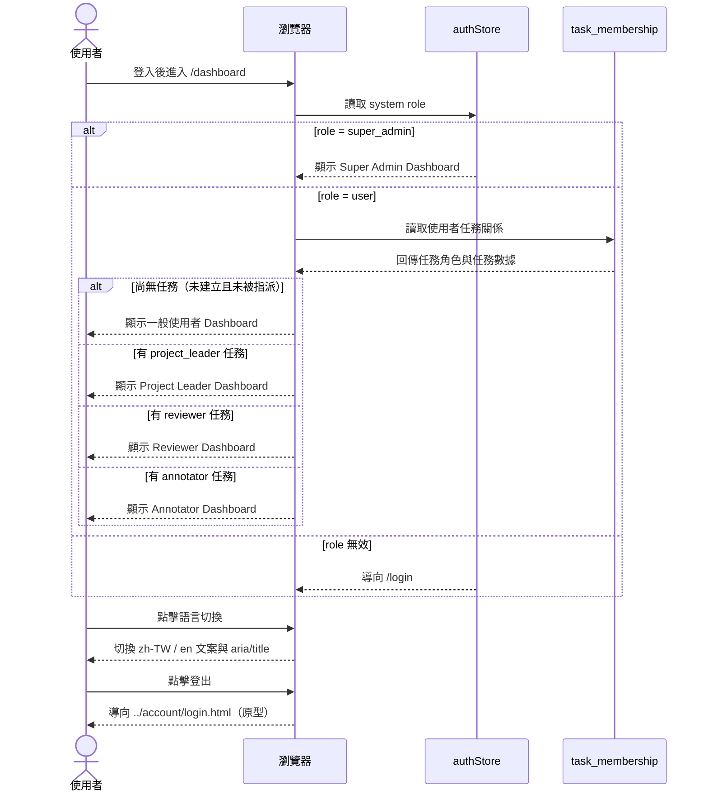
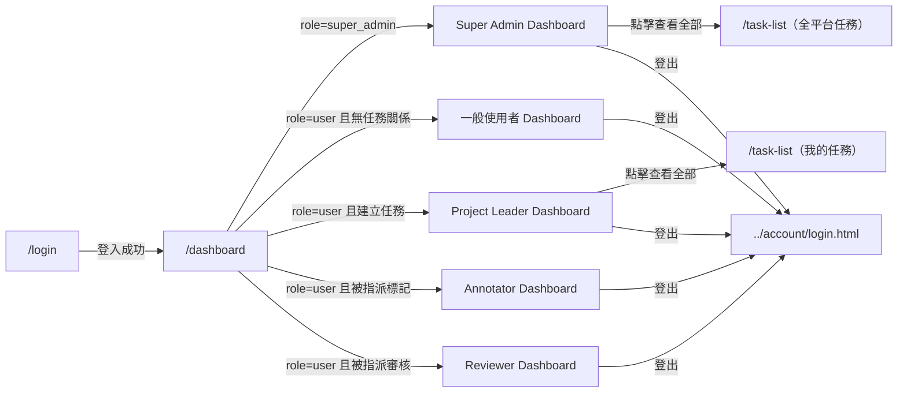

# 功能規格：Dashboard — 儀表板

## 功能目標

讓 Super Admin、Project Leader、Annotator 與 Reviewer 在 Dashboard 任務列表中直接依任務 `outputs[].type` 辨識一至多個輸出類型；標籤由共用 registry 驅動，且不得把 13 筆 prototype 示例誤當成任務、輸出組合或產品能力的白名單。

**需求來源**: 最新原型 [design/prototype/pages/dashboard/dashboard.html](../../../design/prototype/pages/dashboard/dashboard.html)

## Clarifications

### Session 2026-05-22

- Q: 當 `role = user` 同時具有多種任務角色時，應優先顯示哪個視圖？ → A: 以 `project_leader` > `reviewer` > `annotator` 優先順序顯示對應單一主視圖。
- Q: `task_membership` 資料載入中時，使用者應看到什麼狀態？ → A: 顯示 Skeleton（骨架屏）：頁面結構可見，資料區以灰色佔位塊呈現，避免空白頁閃動。
- Q: Super Admin「最近提醒」清單為空時應顯示什麼？ → A: 顯示「目前沒有提醒」i18n 文字佔位，不顯示空白區塊。
- Q: `task_membership` API 失敗（500／逾時）時，使用者應看到什麼？ → A: 結束 Skeleton，顯示 i18n 錯誤文字 + 重試按鈕；不得靜默 fallback 至一般使用者視圖，不清除 session。
- Q: 某任務所有 sample 均已提交時，`快速繼續/快速審核` 應如何處理？ → A: 導向該任務的 `annotation-list`（不帶 `sample_id`），讓使用者自行瀏覽任務狀態；按鈕仍保持可見可點擊。

### Session 2026-07-29

- Q: Prototype 的 Annotator 與 Reviewer 場景應呈現哪些任務？ → A: 兩個場景都以 `docs/product/example-data/` 的 T001–T013 作完整驗收基線，且每筆皆須能以對應角色導向標記／審核介面；此基線只驗證清單與導頁能力，不代表正式系統固定只有 13 個任務或所有使用者都可看見全部任務。

## 規格常數

- `MOBILE_BP` 與 `RWD_VIEWPORTS`：引用 [specs/_shared/constants.md](../../_shared/constants.md)。
- `OUTPUT_TYPE_KEYS = single_label | multi_label | single_dim | multi_dim | sequence_tagging | entity_recognition | relation_identification | free_text`
- `OUTPUT_TYPE_SOURCE = task-management-013.OUTPUT_TYPE_REGISTRY`

## 流程圖

```mermaid
sequenceDiagram
    actor 使用者
    participant 瀏覽器
    participant authStore
    participant membership as task_membership

    使用者->>瀏覽器: 登入後進入 /dashboard
    瀏覽器->>authStore: 讀取 system role

    alt role = super_admin
        authStore-->>瀏覽器: 顯示 Super Admin Dashboard
    else role = user
        瀏覽器->>membership: 讀取使用者任務關係
        membership-->>瀏覽器: 回傳任務角色與任務數據
        alt 尚無任務（未建立且未被指派）
            瀏覽器-->>使用者: 顯示一般使用者 Dashboard
        else 有 project_leader 任務
            瀏覽器-->>使用者: 顯示 Project Leader Dashboard
        else 有 reviewer 任務
            瀏覽器-->>使用者: 顯示 Reviewer Dashboard
        else 有 annotator 任務
            瀏覽器-->>使用者: 顯示 Annotator Dashboard
        end
    else role 無效
        authStore-->>瀏覽器: 導向 /login
    end

    使用者->>瀏覽器: 點擊語言切換
    瀏覽器-->>使用者: 切換 zh-TW / en 文案與 aria/title

    使用者->>瀏覽器: 點擊登出
    瀏覽器-->>使用者: 導向 ../account/login.html（原型）
```

| 步驟 | 角色 | 動作 | 系統回應 |
|------|------|------|---------|
| 1 | 使用者 | 登入後進入 `/dashboard` | 系統讀取 `system role` |
| 2 | 系統 | `role = super_admin` | 顯示 Super Admin Dashboard |
| 3 | 系統 | `role = user` | 讀取任務關係，決定顯示一般使用者 / PL / Annotator / Reviewer 視圖 |
| 4 | 使用者 | 點擊語言切換 | 切換 zh-TW / en，更新文案與可存取屬性 |
| 5 | 使用者 | 點擊登出 | 導向 `../account/login.html`（原型導頁） |
| 6 | 使用者 | 切換語言後導向其他頁再返回 | 維持同語系，不回退預設語言 |

## 使用者情境與測試 *(必填)*

### Dashboard 頁首區塊（M3）

**頁首定義（需與原型一致）**：

- 主標題：`儀表板`
- 副標題：`掌握任務進度與團隊協作狀態`
- 位置：位於主內容區最上方，顯示於場景模式控制區（Scenario Controls）之前

**頁首行為規則**：

- 頁首區塊不隨角色視圖切換而隱藏，於所有 Dashboard 視圖固定顯示。
- 語言切換時，主標題與副標題必須即時切換（zh-TW / en）。

### 使用者故事 1 — 一般使用者儀表板（優先級：P1）

`user` 登入後，若尚未建立任務且未被指派任務，顯示一般使用者視圖。

**此優先級原因**：這是新使用者第一個會遇到的情境，需明確指引下一步。

**獨立測試方式**：以無任務關係的 `user` 登入，確認顯示「三張行動入口卡」與「三條最短成功路徑」。

**驗收情境**：

1. **Given** `role = user` 且無任何任務關係，**When** 進入 `/dashboard`，**Then** 顯示區塊標題「開始你的第一個工作流程」。
2. **Given** 同上，**When** 檢視首頁行動入口，**Then** 顯示 3 張卡片：建立標記專案、進行資料標記、進行標記審核，且各卡均有清楚 CTA。
3. **Given** 同上，**When** 檢視成功路徑區塊，**Then** 顯示 3 條路徑（負責人/標記員/審核員），且每條路徑皆有 5~8 個 onboarding steps（本版為 5 步）。

**首頁行動入口定義（需與原型一致）**：

- 區塊標題：`開始你的第一個工作流程`
- 區塊副標：`從三個行動入口開始，快速達成第一個可交付成果`
- 行動卡 A：
  - 標題：`建立標記專案`
  - 內文：`上傳資料、設定標籤規則、指派團隊成員。`
  - 步驟流程（3 步）：建立任務 → 上傳資料 → 指派人員
  - CTA：`開始建立任務`
- 行動卡 B：
  - 標題：`進行資料標記`
  - 內文：`查看待辦任務，完成資料標記並提交結果。`
  - 步驟流程（3 步）：開啟任務 → 進行標記 → 提交標記
  - CTA：`開始標記`
- 行動卡 C：
  - 標題：`進行標記審核`
  - 內文：`檢查標記內容、退回修正或通過資料。`
  - 步驟流程（3 步）：審核標記 → 核準或修正 → 完成審核
  - CTA：`開始審核`

**最短成功路徑定義（需與原型一致）**：

- 區塊標題：`三條最短成功路徑`
- 區塊副標：`照著這三條路徑走，你可以快速完成第一次上手。`
- 路徑 A：`負責人路徑：建立任務成功`（5 步）
  - 建立任務 → 上傳資料 → 設定規則 → 指派人員 → 啟動任務
- 路徑 B：`標記員路徑：完成第一筆標記`（5 步）
  - 進入待辦 → 閱讀規則 → 完成首筆 → 提交 → 確認完成 1 筆
- 路徑 C：`審核員路徑：完成第一筆審核`（5 步）
  - 進入待審 → 比對規範 → 標記修正點 → 通過或退回 → 確認完成 1 筆

**行為規則**：

- 當使用者符合一般使用者條件（無任務關係）時，三張行動入口卡與三條最短成功路徑必須同時顯示。
- 語言切換時，兩個區塊標題/副標、三張行動卡（標題/內文/CTA）與三條路徑步驟文案都必須即時切換。
- 三張行動卡 CTA 必須可追蹤點擊事件，並保留後續綁定實際路由的擴充空間。

### 使用者故事 2 — Super Admin 儀表板（優先級：P1）

Super Admin 登入後看到平台層級總覽，用於掌握整體人員、任務與風險提醒。

**此優先級原因**：平台管理者需要第一時間掌握全局狀態。

**獨立測試方式**：以 Super Admin 身分登入，確認只顯示 Super Admin 版面，且包含規定區塊與欄位。

**驗收情境**：

1. **Given** `role = super_admin`，**When** 進入 `/dashboard`，**Then** 顯示平台使用者統計（總用戶、專案負責人、標記員、審核員）。
2. **Given** `role = super_admin`，**When** 進入 `/dashboard`，**Then** 顯示任務概況（總任務、進行中、等待 IAA 確認、速度異常）。
3. **Given** `role = super_admin`，**When** 檢視任務列表，**Then** 每列包含名稱、摘要、依 `outputs[].type` 順序呈現的一至多個輸出類型 tag、Annotation Stage badge、狀態 badge 與進度條。

**系統管理員介面定義（需與原型一致）**：

- 指標卡版面規則：標籤（小字、全大寫、muted）顯示於上方，數值（大字加粗）顯示於下方。
- 區塊 A：`平台使用者統計`
  - 副標：`系統概況`
  - 指標卡（4 張）：
    - `總用戶`（單位：人）
    - `專案負責人`（單位：人）
    - `標記員`（單位：人）
    - `審核員`（單位：人）
- 區塊 B：`任務概況`
  - 副標：`所有項目統計`
  - 指標卡（4 張）：
    - `總任務`（單位：個）
    - `進行中`（單位：個）
    - `等待 IAA 確認`（單位：個）
    - `速度異常`（單位：個）
- 區塊 C：`最近提醒`
  - 副標：`系統通知`
  - 清單列項：
    - 提醒標題（例如：`NER Benchmark`）
    - 提醒內容（例如：`IAA 已達 0.81，待確認後啟動`）
- 區塊 D：`任務列表`
  - 副標：`進行中的所有項目`
  - 右上操作：`查看全部` 按鈕
  - 任務列項欄位：
    - 任務名稱
    - 任務摘要（專案負責人 / 審核員 / 標記員人數 / 完成率）
    - badge 群組（Output Type tags、Annotation Stage、Status）
    - 完成率 progress bar

**系統管理員區塊行為規則**：

- 四個主要區塊（A/B/C/D）在 `super_admin` 視圖中必須同時可見。
- 在 `> MOBILE_BP` 且左側導覽列為收合狀態時，`平台使用者統計` 與 `任務概況` 的指標卡必須維持可讀寬度；當欄寬不足時應自動換列，不得將如 `專案負責人`、`等待 IAA 確認` 等較長標籤擠壓成異常窄欄。
- 在 `<= MOBILE_BP` 時，`平台使用者統計` 與 `任務概況` 的 4 張指標卡必須優先以兩欄卡片排列呈現，視覺密度需與 `標記概況` 同級，避免單欄連續堆疊造成區塊過度冗長。
- `查看全部` 為任務列表主操作按鈕，文字必須可 i18n 切換。
- 點擊 `查看全部` 時，系統必須導向 `/task-list`，並以登入者身分套用對應任務可見範圍：`super_admin` 顯示全平台任務，`user` 顯示自己具 `task_membership` 的任務。
- 語言切換時，區塊標題/副標、提醒文字、任務列表標題與按鈕、badge 文字都必須即時切換。
- `最近提醒` 清單為空時，必須顯示 i18n 文字佔位（例如「目前沒有提醒」），不得顯示空白區塊。

### 使用者故事 3 — Project Leader 儀表板（優先級：P1）

`user` 在任務中建立任務後成為 Project Leader，登入後看到任務管理導向儀表板。

**此優先級原因**：Project Leader 是任務推進關鍵角色。

**獨立測試方式**：以有 `project_leader` 任務關係的 `user` 登入，確認顯示 PL 版面。

**驗收情境**：

1. **Given** `role = user` 且有 `project_leader` 任務，**When** 進入 `/dashboard`，**Then** 顯示任務概況（總任務、進行中、等待 IAA 確認、速度異常）。
2. **Given** 同上，**When** 檢視任務列表，**Then** 每列包含任務名稱、摘要、依 `outputs[].type` 順序呈現的一至多個輸出類型 tag、Annotation Stage badge、狀態 badge 與進度條。

**專案負責人介面定義（需與原型一致）**：

- 指標卡版面規則：標籤（小字、全大寫、muted）顯示於上方，數值（大字加粗）顯示於下方。
- 區塊 A：`任務概況`
  - 副標：`所有項目統計`
  - 指標卡（4 張）：
    - `總任務`（單位：個）
    - `進行中`（單位：個）
    - `等待 IAA 確認`（單位：個）
    - `速度異常`（單位：個）
- 區塊 B：`任務列表`
  - 副標：`進行中的所有項目`
  - 右上操作：`查看全部` 按鈕
  - 任務列項欄位：
    - 任務名稱
    - 任務摘要（審核員 / 標記員人數 / 完成率）
    - badge 群組（Output Type tags、Annotation Stage、Status）
    - 完成率 progress bar

**專案負責人區塊行為規則**：

- 在 `project_leader` 視圖中，區塊 A 與區塊 B 必須同時可見。
- 在 `<= MOBILE_BP` 時，`任務概況` 的 4 張指標卡必須優先以兩欄卡片排列呈現，視覺密度需與 `標記概況` 同級，避免單欄連續堆疊造成區塊過度冗長。
- `查看全部` 為任務列表主操作按鈕，文字必須可 i18n 切換。
- 點擊 `查看全部` 時，系統必須導向 `/task-list`，並沿用登入者 `user` 身分顯示其具 `task_membership` 的任務，不得切換為全平台視角。
- 語言切換時，區塊標題/副標、任務摘要、badge 文案必須即時切換。

### 使用者故事 4 — Annotator 儀表板（優先級：P1）

`user` 被指派為標記員後，登入時看到個人作業導向儀表板。

**此優先級原因**：Annotator 的主流程是快速回到標記工作。

**獨立測試方式**：以有 `annotator` 任務關係的 `user` 登入，確認顯示 Annotator 版面。

**驗收情境**：

1. **Given** `role = user` 且有 `annotator` 任務，**When** 進入 `/dashboard`，**Then** 顯示標記概況（待標記、今日完成、平均速度）。
2. **Given** 同上，**When** 檢視任務列表，**Then** 每列包含名稱、進度摘要、依 `outputs[].type` 順序呈現的一至多個輸出類型 tag、階段／狀態 badge、進度條與「快速繼續」按鈕。
3. **Given** 位於標記員任務列表且點擊某任務列的非 CTA 區域，**When** 系統導頁，**Then** 需進入該任務對應的 `annotation-list`，並帶入該任務 `task_id`、`role=annotator`、`run_type` 與 `task_type`。
4. **Given** 位於標記員任務列表且點擊某任務 `快速繼續`，**When** 系統導頁，**Then** 需進入該任務對應的 `annotation-workspace`，並帶入該任務第一筆非 `已提交` sample 的 `sample_id`（可為 `已儲存` 或 `待標記`）。

**標記員介面定義（需與原型一致）**：

- 指標卡版面規則：標籤（小字、全大寫、muted）顯示於上方，數值（大字加粗）顯示於下方。
- 區塊 A：`標記概況`
  - 副標：`我的標記進度與待處理任務`
  - 指標卡（3 張）：
    - `待標記`（單位：筆）
    - `今日完成`（單位：筆）
    - `平均速度`（單位：分/筆）
- 區塊 B：`任務列表`
  - 副標：`我的進行中任務`
  - 任務列項欄位：
    - 任務名稱
    - 進度摘要（完成率 / 今日完成數 / 平均速度）
    - badge 群組（Output Type tags、Annotation Stage、Status）
    - 操作按鈕：`快速繼續`
    - 完成率 progress bar

**標記員區塊行為規則**：

- 在 `annotator` 視圖中，區塊 A 與區塊 B 必須同時可見。
- 每個任務列項都必須包含 `快速繼續` CTA。
- 在 `<= MOBILE_BP` 時，任務列中的 badge 群組與 `快速繼續` CTA 必須改為垂直堆疊；多個輸出類型 tag 需先完整換行顯示，CTA 另起一列，不得將 `試標 / 正式標記 / 進行中` 等標籤擠出卡片邊界。
- 點擊任務列中除 `快速繼續` 以外的區域時，必須帶入被點擊任務上下文（`task_id`、`role=annotator`、`run_type`、`task_type`）導向 `annotation-list`。
- 點擊 `快速繼續` 必須帶入被點擊任務上下文（`task_id`、`role=annotator`、第一筆非 `已提交` sample 的 `sample_id`）導向標記作業頁。
- 語言切換時，區塊標題/副標、指標標籤、任務摘要、按鈕、badge 文案必須即時切換。

### 使用者故事 5 — Reviewer 儀表板（優先級：P1）

`user` 被指派為審核員後，登入時看到審查導向儀表板。

**此優先級原因**：Reviewer 需要快速定位待審任務。

**獨立測試方式**：以有 `reviewer` 任務關係的 `user` 登入，確認顯示 Reviewer 版面。

**驗收情境**：

1. **Given** `role = user` 且有 `reviewer` 任務，**When** 進入 `/dashboard`，**Then** 顯示審核概況（待審總數、今日已審、IAA 摘要）。
2. **Given** 同上，**When** 檢視任務列表，**Then** 每列包含名稱、審查摘要、依 `outputs[].type` 順序呈現的一至多個輸出類型 tag、階段／狀態 badge、進度條與「快速審核」按鈕。
3. **Given** 位於審核員任務列表且點擊某任務列的非 CTA 區域，**When** 系統導頁，**Then** 需進入該任務對應的 `annotation-list`，並帶入該任務 `task_id`、`role=reviewer`、`run_type` 與 `task_type`。
4. **Given** 位於審核員任務列表且點擊某任務 `快速審核`，**When** 系統導頁，**Then** 需進入該任務對應的 `annotation-workspace`，並帶入該任務第一筆非 `已提交` sample 的 `sample_id`（可為 `已儲存` 或 `待審核`）。

**審核員介面定義（需與原型一致）**：

- 指標卡版面規則：標籤（小字、全大寫、muted）顯示於上方，數值（大字加粗）顯示於下方。
- 區塊 A：`審核概況`
  - 副標：`我的審查進度與待處理項目`
  - 指標卡（3 張）：
    - `待審總數`（單位：筆）
    - `今日已審`（單位：筆）
    - `IAA 摘要`（無單位，為 0–1 係數）
- 區塊 B：`任務列表`
  - 副標：`我的待審任務`
  - 任務列項欄位：
    - 任務名稱
    - 審查摘要（待審筆數 / 進度 / IAA）
    - badge 群組（Output Type tags、Annotation Stage、Status）
    - 操作按鈕：`快速審核`
    - 完成率 progress bar

**審核員區塊行為規則**：

- 在 `reviewer` 視圖中，區塊 A 與區塊 B 必須同時可見。
- 每個任務列項都必須包含 `快速審核` CTA。
- 在 `<= MOBILE_BP` 時，任務列中的 badge 群組與 `快速審核` CTA 必須改為垂直堆疊；多個輸出類型 tag 需先完整換行顯示，CTA 另起一列，不得將 `試標 / 正式標記 / 進行中` 等標籤擠出卡片邊界。
- 點擊任務列中除 `快速審核` 以外的區域時，必須帶入被點擊任務上下文（`task_id`、`role=reviewer`、`run_type`、`task_type`）導向 `annotation-list`。
- 點擊 `快速審核` 必須帶入被點擊任務上下文（`task_id`、`role=reviewer`、第一筆非 `已提交` sample 的 `sample_id`）導向標記作業頁。
- 語言切換時，區塊標題/副標、指標標籤、任務摘要、按鈕、badge 文案必須即時切換。

### 邊界情況

- 角色值不存在或不在允許清單時？→ 導向 `/login`。
- `task_membership` API 回傳錯誤（5xx／逾時）時？→ 結束 Skeleton，顯示 i18n 錯誤文字 + 重試按鈕；不靜默 fallback 至一般使用者視圖，不清除 session。
- Annotator／Reviewer 任務中所有 sample 均已提交時？→ `快速繼續/快速審核` 仍可見可點擊，導向該任務 `annotation-list`（不帶 `sample_id`），讓使用者自行確認任務狀態。
- `role = user` 且同時有多種任務角色時？→ 以 `project_leader` > `reviewer` > `annotator` 優先順序顯示對應單一主視圖。
- 某文字 key 在 i18n 缺漏時？→ 保留原本 DOM 文字，不中斷頁面互動。
- 行動版（`<= MOBILE_BP`）時導覽列如何呈現？→ 由側邊欄轉為底部橫向導覽。

## 需求規格 *(必填)*

### 功能需求

- **FR-001**：系統必須依登入者 `system role` 與任務關係渲染對應 Dashboard。
- **FR-001A**：`/dashboard` 必須顯示頁首標題區塊，包含主標題「儀表板」與副標題「掌握任務進度與團隊協作狀態」，並置於場景模式控制區之前。
- **FR-001B**：`role = user` 且同時具有多種任務角色時，系統必須依 `project_leader` > `reviewer` > `annotator` 優先順序顯示唯一的對應主視圖。
- **FR-002**：`super_admin` 必須顯示 Super Admin Dashboard。
- **FR-003**：`user` 且尚無任務關係時，必須顯示一般使用者 Dashboard。
- **FR-004**：`user` 建立任務後（具 `project_leader` 任務關係）必須顯示 Project Leader Dashboard。
- **FR-005**：`user` 被指派標記後（具 `annotator` 任務關係）必須顯示 Annotator Dashboard。
- **FR-006**：`user` 被指派審核後（具 `reviewer` 任務關係）必須顯示 Reviewer Dashboard。
- **FR-007**：一般使用者 Dashboard 必須包含首頁流程入口區塊，標題為 `開始你的第一個工作流程`，副標為 `從三個行動入口開始，快速達成第一個可交付成果`。
- **FR-007A**：首頁流程入口區塊必須包含 3 張行動卡：`建立標記專案`、`進行資料標記`、`進行標記審核`，且每張卡均包含標題、說明文字、3 步流程圖示、CTA。
- **FR-007B**：三張行動卡 CTA 必須分別提供：建立任務入口、標記入口、審核入口。
- **FR-007C**：一般使用者 Dashboard 必須包含最短成功路徑區塊，標題為 `三條最短成功路徑`，副標為 `照著這三條路徑走，你可以快速完成第一次上手。`。
- **FR-007D**：最短成功路徑區塊必須包含 3 條路徑：負責人（建立任務成功）、標記員（完成第一筆標記）、審核員（完成第一筆審核）。
- **FR-007E**：每條最短成功路徑必須包含 5~8 個 onboarding steps（本版原型固定顯示 5 步）。
- **FR-007F**：一般使用者視圖的流程入口與最短成功路徑相關文案在 zh-TW / en 語言切換時必須即時同步更新。
- **FR-008**：Super Admin Dashboard 必須包含：平台使用者統計、任務概況、最近提醒、任務列表。
- **FR-008A**：Super Admin Dashboard 的「平台使用者統計」必須包含 4 張指標卡：總用戶（人）、專案負責人（人）、標記員（人）、審核員（人）；各卡標籤顯示於數值上方。
- **FR-008B**：Super Admin Dashboard 的「任務概況」必須包含 4 張指標卡：總任務（個）、進行中（個）、等待 IAA 確認（個）、速度異常（個）；各卡標籤顯示於數值上方。
- **FR-008C**：Super Admin Dashboard 的「最近提醒」必須以清單呈現，且每項包含提醒標題與提醒內容；清單為空時必須顯示 i18n 文字佔位（如「目前沒有提醒」），不得呈現空白區塊。
- **FR-008D**：Super Admin Dashboard 的「任務列表」必須顯示「查看全部」按鈕，且每列包含名稱、摘要、一至多個輸出類型 tag、Annotation Stage／Status badge 與 progress bar。
- **FR-008E**：Super Admin Dashboard 點擊「查看全部」時，系統必須導向 `/task-list`，並以 `super_admin` 權限顯示全平台任務。
- **FR-009**：Project Leader Dashboard 必須包含：任務概況、任務列表。
- **FR-009A**：Project Leader Dashboard 的「任務概況」必須包含 4 張指標卡：總任務（個）、進行中（個）、等待 IAA 確認（個）、速度異常（個）；各卡標籤顯示於數值上方。
- **FR-009B**：Project Leader Dashboard 的「任務列表」必須顯示「查看全部」按鈕，且按鈕文字可 i18n 切換。
- **FR-009C**：Project Leader Dashboard 的「任務列表」每列必須包含任務名稱、任務摘要、一至多個輸出類型 tag、Annotation Stage／Status badge 與 progress bar。
- **FR-009D**：Project Leader Dashboard 點擊「查看全部」時，系統必須導向 `/task-list`，並沿用登入者 `user` 身分只顯示其具 `task_membership` 的任務。
- **FR-010**：Annotator Dashboard 必須包含：標記概況、任務列表、快速繼續按鈕。
- **FR-010A**：Annotator Dashboard 的「標記概況」必須包含 3 張指標卡：待標記（筆）、今日完成（筆）、平均速度（分/筆）；各卡標籤顯示於數值上方。
- **FR-010B**：Annotator Dashboard 的任務列表每列必須包含進度摘要、`快速繼續` 按鈕、一至多個輸出類型 tag、Annotation Stage／Status badge 與 progress bar。
- **FR-010B1**：點擊 Annotator 任務列中除 `快速繼續` 按鈕以外的區域時，系統必須以該列任務上下文導向 `annotation-list`（至少包含 `task_id`、`role=annotator`、`run_type`、`task_type`）；`task_type` 是 015 尚未遷移前的獨立 routing compatibility 欄位，不得由 `outputs[]` 第一項或其組合推導。
- **FR-010B2**：Annotator 每筆可見任務必須保留獨立 `task_id`、可操作 sample 與 routing compatibility metadata，不得因多筆任務具有相同 `outputs[].type` 或相同 compatibility renderer 而合併導頁上下文。
- **FR-010C**：點擊 Annotator 任務列 `快速繼續` 時，若任務存在非 `已提交` sample，系統必須導向 `annotation-workspace`（帶入 `task_id`、`role=annotator`、第一筆非 `已提交` sample 的 `sample_id`；可為 `已儲存` 或 `待標記`）；若所有 sample 均已提交，則導向該任務 `annotation-list`（不帶 `sample_id`）。
- **FR-011**：Reviewer Dashboard 必須包含：審核概況、任務列表、快速審核按鈕。
- **FR-011A**：Reviewer Dashboard 的「審核概況」必須包含 3 張指標卡：待審總數（筆）、今日已審（筆）、IAA 摘要（無單位，0–1 係數）；各卡標籤顯示於數值上方。
- **FR-011B**：Reviewer Dashboard 的任務列表每列必須包含審查摘要、`快速審核` 按鈕、一至多個輸出類型 tag、Annotation Stage／Status badge 與 progress bar。
- **FR-011B1**：點擊 Reviewer 任務列中除 `快速審核` 按鈕以外的區域時，系統必須以該列任務上下文導向 `annotation-list`（至少包含 `task_id`、`role=reviewer`、`run_type`、`task_type`）；`task_type` 是 015 尚未遷移前的獨立 routing compatibility 欄位，不得由 `outputs[]` 第一項或其組合推導。
- **FR-011B2**：Reviewer 每筆可見任務必須保留獨立 `task_id`、可操作 sample 與 routing compatibility metadata，不得因多筆任務具有相同 `outputs[].type` 或相同 compatibility renderer 而合併導頁上下文。
- **FR-011C**：點擊 Reviewer 任務列 `快速審核` 時，若任務存在非 `已提交` sample，系統必須導向 `annotation-workspace`（帶入 `task_id`、`role=reviewer`、第一筆非 `已提交` sample 的 `sample_id`；可為 `已儲存` 或 `待審核`）；若所有 sample 均已提交，則導向該任務 `annotation-list`（不帶 `sample_id`）。
- **FR-012**：四種有任務角色的 Dashboard 列項必須依 `outputs[]` 原始順序，為每個 `output.type` 各呈現一個唯讀 tag；複合任務不得只顯示第一項或合成固定任務類型名稱。
- **FR-012A**：輸出類型 tag 的合法值與 zh-TW／en 文案必須來自 `OUTPUT_TYPE_SOURCE` 的 8 個 `OUTPUT_TYPE_KEYS`；標籤群組須有完整可存取名稱，且不得只靠顏色傳達類型。
- **FR-012B**：`docs/product/example-data/` 的 13 份 fixture 只作 prototype 驗收基線，不是 API、任務數量、合法組合或 renderer 白名單；加入第 14 筆任意合法 `outputs[]` 組合後，具相應 membership 的角色視圖必須無需新增分支即可呈現。
- **FR-012C**：Dashboard 只能消費任務名稱、`outputs[].type`、階段、狀態、角色摘要與進度等安全 summary metadata；不得讀取、顯示、快取或序列化 fixture／任務資料中的 answer、gold、reference、ground truth 或等價答案內容。
- **FR-012D**：Super Admin 可見全平台任務；其他角色仍只可見具有相應 `task_membership` 的任務，不得依任務名稱或輸出類型決定權限。
- **FR-013**：頁面必須支援 zh-TW / en 語言切換，且切換不需重載。
- **FR-014**：語言切換後必須同步更新文字節點、每個輸出類型 tag 與可存取屬性（如 `aria-label`、`title`）。
- **FR-014A**：Dashboard 語言狀態必須跨頁持久化；導向 `/profile` 或 account 頁面後再返回，需沿用同語系。
- **FR-015**：頁面必須顯示使用者資訊區塊（頭像、名稱、角色）與登出操作。
- **FR-016**：若角色值無效，系統必須導向 `/login`。
- **FR-017**：頁面必須具備響應式設計，支援至少 `RWD_VIEWPORTS`。
- **FR-0170**：在 `> MOBILE_BP` 時，主導覽必須維持左側側邊欄呈現（品牌、主導覽、語言切換、使用者資訊與登出）。
- **FR-0170A**：在 `> MOBILE_BP` 時，語言切換按鈕必須顯示於品牌列（Logo + Label Suite）右側，並以單一語言代碼（`ZH` 或 `EN`）呈現。
- **FR-017A**：在 `<= MOBILE_BP` 時，導覽必須由側邊欄轉為固定於頁面底部的橫向導覽（4 個主項目等寬呈現，避免文字垂直斷行）。
- **FR-017B**：在 `<= MOBILE_BP` 時，內容區需預留底部導覽高度，避免任一面板或按鈕被底部導覽遮擋。
- **FR-017C**：在 `<= MOBILE_BP` 時，頁面頂部必須保留品牌列（Logo + Label Suite 字樣），不得因底部導覽而移除。
- **FR-017D**：在 `<= MOBILE_BP` 時，登出按鈕必須顯示於頂部品牌列最右側，且需支援 i18n 的 `aria-label` 與 `title`。
- **FR-017E**：在 `<= MOBILE_BP` 時，頂部品牌列必須顯示當前人員名稱與 i18n 語言切換按鈕（例如 `ZH` 或 `EN`）；語言切換按鈕需可即時切換語系。
- **FR-017F**：在 `<= MOBILE_BP` 時，Super Admin 與 Project Leader 任務列表單列需改為垂直堆疊（任務摘要在上、可換行的輸出類型／階段／狀態 tag 群組在下），不得截斷、重疊或造成水平 overflow。
- **FR-017G**：在 `> MOBILE_BP` 且左側導覽列收合時，Super Admin 的 `平台使用者統計` 與 `任務概況` 指標卡必須維持可讀最小寬度；欄寬不足時應換列，不得將長標籤壓縮為異常窄欄。
- **FR-017H**：在 `<= MOBILE_BP` 時，Annotator 任務列表單列的多 tag 群組與 `快速繼續` CTA 必須改為垂直堆疊，tag 不得超出卡片右邊界。
- **FR-017I**：在 `<= MOBILE_BP` 時，Reviewer 任務列表單列的多 tag 群組與 `快速審核` CTA 必須改為垂直堆疊，tag 不得超出卡片右邊界。
- **FR-017J**：在 `<= MOBILE_BP` 時，Super Admin 的 `平台使用者統計` 與 `任務概況` 指標區塊必須優先使用兩欄卡片排列，不得退化為 4 張單欄直向堆疊。
- **FR-017K**：在 `<= MOBILE_BP` 時，Project Leader 的 `任務概況` 指標區塊必須優先使用兩欄卡片排列，不得退化為 4 張單欄直向堆疊。
- **FR-018**：進入 `/dashboard` 後，在 `task_membership` API 回應返回前，系統必須顯示 Skeleton（骨架屏）：頁面結構可見，以指標卡與任務列表佔位塊為預設佈局（對應最常見的有任務角色視圖）；若 API 回應後確認為一般使用者 Dashboard，則直接切換為對應佈局，接受此預設 Skeleton 與最終版面的視覺差異；API 回應後無縫切換為實際內容，不得出現空白頁閃動。
- **FR-019**：`task_membership` API 回傳錯誤（5xx 或網路逾時）時，系統必須結束 Skeleton 並顯示 i18n 錯誤訊息與重試按鈕；不得靜默 fallback 至一般使用者視圖，亦不得清除 session 或導向 `/login`。

### 使用者流程與導頁

```mermaid
flowchart LR
    login["/login"]
    dashboard["/dashboard"]
    user["一般使用者 Dashboard"]
    sa["Super Admin Dashboard"]
    pl["Project Leader Dashboard"]
    an["Annotator Dashboard"]
    rv["Reviewer Dashboard"]
    logout["../account/login.html"]

    login -->|登入成功| dashboard
    dashboard -->|role=super_admin| sa
    dashboard -->|role=user 且無任務關係| user
    dashboard -->|role=user 且建立任務| pl
    dashboard -->|role=user 且被指派標記| an
    dashboard -->|role=user 且被指派審核| rv
    sa -->|點擊查看全部| tasklistAll["/task-list（全平台任務）"]
    pl -->|點擊查看全部| tasklistMine["/task-list（我的任務）"]
    user -->|登出| logout
    sa -->|登出| logout
    pl -->|登出| logout
    an -->|登出| logout
    rv -->|登出| logout
```

| From | Trigger | To |
|------|---------|-----|
| `/dashboard` | `role=super_admin` | Super Admin Dashboard |
| `/dashboard` | `role=user` 且無任務關係 | 一般使用者 Dashboard |
| `/dashboard` | `role=user` 且有 `project_leader` 任務關係 | Project Leader Dashboard |
| `/dashboard` | `role=user` 且有 `annotator` 任務關係 | Annotator Dashboard |
| `/dashboard` | `role=user` 且有 `reviewer` 任務關係 | Reviewer Dashboard |
| Super Admin Dashboard | 點擊 `查看全部` | `/task-list`（全平台任務） |
| Project Leader Dashboard | 點擊 `查看全部` | `/task-list`（我的任務） |
| 任一 Dashboard | 點擊登出 | `../account/login.html`（原型） |

**Entry points**：`/dashboard`（登入後）。
**Exit points**：登出導向 `../account/login.html`。

### 關鍵實體

- **SystemRole**：系統角色。允許值：`user`、`super_admin`。
- **TaskRole**：任務角色。允許值：`project_leader`、`annotator`、`reviewer`。
- **MembershipSummary**：儀表板判斷摘要，包含：建立任務數、被指派標記數、被指派審核數。
- **LanguageState**：當前語言狀態。關鍵欄位：`lang`（`zh` / `en`）、`storage_key = labelsuite.lang`。
- **DashboardViewModel（原型）**：畫面展示資料，包含 metrics、task list、progress 與 action label；每筆 task summary 只含 `task_id`、任務名稱、`outputs: { type: OUTPUT_TYPE_KEYS }[]`、階段、狀態、角色摘要與進度等安全 metadata。

## 規格相依性 *(本功能依賴其他規格，或被其他規格依賴時填寫)*

### 上游（本規格依賴的規格）

| 規格編號 | 功能 | 本規格需要的內容 |
|---------|------|----------------|
| 001 | Login — Email / Password | 已登入狀態與 `system role` |
| 008 | Shared Sidebar Navbar | 全站語言持久化契約（跨頁維持同語系） |
| 010 | Task List | `outputs[].type` 多 tag、13 筆 prototype 基線與 config-driven generalization 契約 |
| 013 | New Task | `OUTPUT_TYPE_REGISTRY`、8 個 `OUTPUT_TYPE_KEYS` 與 `outputs[]` producer contract |

### 下游（依賴本規格的規格）

| 規格編號 | 功能 | 依賴本規格的內容 |
|---------|------|----------------|
| 010 | Task List | Dashboard「查看全部」入口與角色可見範圍 |
| 013 | New Task | 「建立第一個任務」入口語意與建立後角色轉換 |
| 015 | Annotation Workspace | Annotator / Reviewer 快速操作入口語意 |

> **v2.0.0 同步界線**：本版只同步 Dashboard 任務摘要對 `outputs[].type` 的顯示消費；014 Task Detail 與 015 Annotation Workspace 仍保留既有 consumer／routing 契約，`task_type` 僅是獨立 legacy routing compatibility 欄位，不得由輸出 tag 推導，也不得據此宣稱任意輸出組合已可進入正式工作區。

> **v2.0.2 過渡性相容寫入**：Dashboard 導向標記／審核頁前仍寫入 legacy `localStorage` 鍵 `labelsuite.activeTaskType`（值取自各任務的獨立 `task_type` compatibility 欄位），因為 `annotation-list`、`annotation-workspace` 與 shared sidebar 在 014／015 遷移前仍讀取該鍵。010 Task List v2.0.0 已移除該頁的寫入路徑，Dashboard 是目前唯一寫入者；此為 static annotation prototype 的過渡性相容路徑，014／015 完成 `outputs[]` 遷移後應一併移除。

## 成功標準 *(必填)*

- **SC-001**：`super_admin` 與 `user` 可正確進入對應 Dashboard 類型。
- **SC-002**：`user` 的四種狀態（無任務 / PL / Annotator / Reviewer）皆符合各自區塊定義。
- **SC-003**：一般使用者 Dashboard 顯示「開始你的第一個工作流程」區塊標題與副標，且文案符合規格。
- **SC-004**：一般使用者 Dashboard 完整顯示 3 張行動入口卡（建立標記專案 / 進行資料標記 / 進行標記審核），且每張卡均有 3 步流程圖示與對應 CTA（開始建立任務 / 開始標記 / 開始審核）。
- **SC-004A**：一般使用者 Dashboard 完整顯示 3 條最短成功路徑，且每條路徑顯示 5 個 onboarding steps，內容符合本規格定義。
- **SC-005**：Super Admin Dashboard 完整顯示 4 個主要區塊，且任務列表依 `outputs[].type` 顯示一至多個輸出類型 tag。
- **SC-006**：語言切換可於 1 秒內完成主要文案與 aria/title 更新（不重新整理頁面）。
- **SC-006A**：切換語言後導向 `/profile` 或 account 頁面再返回 `/dashboard`，語系需維持一致。
- **SC-007**：在 `RWD_VIEWPORTS` 視窗寬度下均無版型破版。
- **SC-008**：Project Leader Dashboard 完整顯示任務概況與任務列表，且「查看全部」按鈕、指標與多輸出 tag 列項符合規格。
- **SC-008A**：Super Admin Dashboard 點擊「查看全部」後，必須導向 `/task-list`，且任務列表顯示全平台任務。
- **SC-008B**：Project Leader Dashboard 點擊「查看全部」後，必須導向 `/task-list`，且任務列表只顯示登入者具 `task_membership` 的任務。
- **SC-009**：Annotator Dashboard 完整顯示標記概況與多輸出 tag 任務列表，且每列皆有「快速繼續」按鈕。
- **SC-010**：Reviewer Dashboard 完整顯示審核概況與多輸出 tag 任務列表，且每列皆有「快速審核」按鈕。
- **SC-011**：Prototype 頁面（`design/prototype/pages/*.html`）不得引用失效影像資源；檢查結果應無 `` / `background-image` 失效來源。
- **SC-012**：在手機版（`<= MOBILE_BP`）檢視 Super Admin 與 Project Leader 任務列表時，任務名稱與摘要可正常閱讀，多 tag 群組可換行且無截斷、重疊或水平 overflow。
- **SC-012A**：在桌面版（`> MOBILE_BP`）且左側導覽列收合時，Super Admin 的 `平台使用者統計` 與 `任務概況` 內長標籤指標卡仍維持可讀寬度，無異常窄欄。
- **SC-012B**：在手機版（`<= MOBILE_BP`）檢視 Annotator 與 Reviewer 任務列表時，每張任務卡內所有輸出類型／階段／狀態 tag 均需落在卡片邊界內，且 `快速繼續/快速審核` 不得與 tag 同列互相擠壓。
- **SC-012C**：在手機版（`<= MOBILE_BP`）檢視 Super Admin 與 Project Leader 的指標區塊時，`平台使用者統計 / 任務概況` 必須維持兩欄卡片排列，前兩張指標卡應落在同一列，不得退化為逐張直排。
- **SC-013**：在桌面版（`> MOBILE_BP`）檢視時，主導覽維持左側側邊欄，且不出現底部導覽覆蓋內容的情況。
- **SC-014**：Dashboard 頁首區塊固定顯示於所有角色視圖上方，並正確顯示主標「儀表板」與副標「掌握任務進度與團隊協作狀態」。
- **SC-015**：Annotator/Reviewer 視圖點擊任務列 `快速繼續/快速審核` 後，若任務有非 `已提交` sample，必須導向 `annotation-workspace` 並帶入正確 `task_id`、`role`、`sample_id`；若所有 sample 均已提交，必須導向 `annotation-list`（不帶 `sample_id`），按鈕保持可見可點擊。
- **SC-016**：Annotator/Reviewer 視圖點擊任務列非 `快速繼續/快速審核` 區域後，必須導向對應任務的 `annotation-list`，且帶入正確 `task_id`、`role`、`run_type` 與獨立 legacy routing compatibility `task_type`；不得把 `outputs[]` 壓縮成該值。
- **SC-017**：進入 `/dashboard` 後，在 `task_membership` API 回應前，頁面必須顯示 Skeleton 佔位塊（主要內容區域有灰色佔位），不得出現空白頁或未樣式化的裸 DOM。
- **SC-018**：`task_membership` API 回傳 5xx 或逾時時，Skeleton 必須結束並顯示 i18n 錯誤訊息與可操作的重試按鈕；不得顯示一般使用者視圖，不得清除 session。
- **SC-019**：四種有任務角色的 Dashboard 均依 registry 逐項顯示被指派摘要的 `outputs[].type`；Prototype 的 Annotator 與 Reviewer 場景各自依 T001–T013 順序呈現完整 13 筆安全摘要，其中 `medical-ner-re.json` 映射 2 個、`absa-va.json` 映射 3 個順序正確的輸出類型；正式產品仍只呈現登入者 membership 範圍內的摘要。
- **SC-020**：13 筆示例涵蓋全部 8 個 `OUTPUT_TYPE_KEYS`；加入第 14 筆任意合法組合及 membership 後，相應角色視圖可直接呈現，無需新增任務名稱、組合或 renderer 分支。
- **SC-021**：輸出類型 tag 可即時切換 zh-TW／en，tag 群組具完整可存取名稱，並在 `RWD_VIEWPORTS` 下正確換行。
- **SC-022**：Dashboard 及其可供 Annotator 存取的資料不得出現 fixture／任務中的 answer、gold、reference、ground truth 或等價答案內容。
- **SC-023**：本版新增或修改的 prototype 驗收情境皆有對應 Playwright 測試，涵蓋四角色、13 筆基線、複合 tag、第 14 筆泛化、i18n、可存取名稱與手機換行。
- **SC-024**：Prototype 的 Annotator 與 Reviewer 場景各有 13 個快速操作；T001–T013 每筆具有獨立 `task_id`、非空 `sample_id` 與明確 compatibility route，並能以 `role=annotator`／`role=reviewer` 成功載入標記／審核介面。

## Changelog

| 版本 | 日期 | 變更摘要 |
|------|------|---------|
| 2.0.2 | 2026-07-29 | **記錄 legacy `labelsuite.activeTaskType` 過渡寫入**：明確 Dashboard 為該 `localStorage` 鍵目前唯一寫入者（010 v2.0.0 已移除其寫入），值僅取自獨立 `task_type` compatibility 欄位、不得由 `outputs[]` 推導；014／015 遷移完成後一併移除。 |
| 2.0.1 | 2026-07-29 | **補齊 Annotator／Reviewer 的 13 任務導頁基線**：兩個 prototype 場景皆依 T001–T013 呈現完整安全摘要，每筆保留獨立 task／sample／compatibility route 並可進入對應角色介面；正式產品的 membership 權限與任務數量不受 13 筆示例限制。 |
| 2.0.0 | 2026-07-29 | **Dashboard 任務摘要遷移至可組合輸出類型**：四種有任務角色的列表改由 `outputs[].type` 依序顯示一至多個 registry-driven tag，涵蓋 8 個合法 key、複合輸出、zh/en、可存取名稱與手機換行；13 筆 fixture 僅為安全 summary metadata 的 prototype 基線，新增第 14 筆任意合法組合泛化與答案資料不外露驗收。014／015 consumer 仍延後，legacy `task_type` 僅保留為獨立 routing compatibility 欄位。 |
| 1.3.34 | 2026-05-22 | 修正流程圖多角色優先順序：sequenceDiagram 中 reviewer/annotator else 分支順序與文字規則不符，調整為 project_leader > reviewer > annotator；更新 FR-018 與 SC-017 Skeleton 描述為更泛用的「主要內容區域」，避免 General User Dashboard（無指標卡/任務列表）造成誤導 |
| 1.3.33 | 2026-05-22 | 釐清全部 sample 已提交時快速操作行為：fallback 至 annotation-list，按鈕保持可見；更新 FR-010C、FR-011C、SC-015、邊界情況 |
| 1.3.32 | 2026-05-22 | 釐清 `task_membership` API 錯誤狀態：結束 Skeleton 顯示 i18n 錯誤訊息 + 重試按鈕，不 fallback；新增 FR-019、SC-018、邊界情況 |
| 1.3.31 | 2026-05-22 | 釐清「最近提醒」空狀態：清單為空顯示 i18n 文字佔位；更新 FR-008C、系統管理員行為規則 |
| 1.3.30 | 2026-05-22 | 釐清 loading state：`task_membership` 載入中顯示 Skeleton 骨架屏；新增 FR-018、SC-017 |
| 1.3.29 | 2026-05-22 | 釐清多任務角色分流優先順序：`project_leader` > `reviewer` > `annotator`；新增 FR-001B、更新邊界情況 |
| 1.3.28 | 2026-05-21 | 補充輸入與產生規則、已釐清事項、審查清單與執行狀態；同步功能分支格式 |
| 1.3.27 | 2026-04-30 | 同步手機版 summary metrics 密度規則：Super Admin 的 `平台使用者統計 / 任務概況` 與 Project Leader 的 `任務概況` 需優先維持兩欄卡片排列，避免單欄直排過於冗長；更新行為規則、FR-017J/K、SC-012C |
| 1.3.26 | 2026-04-30 | 同步最新原型 RWD 修正：補充桌面收合 sidebar 時 Super Admin 指標卡需維持可讀寬度；新增 Annotator / Reviewer 手機任務卡 badge 與 CTA 垂直堆疊規範，更新行為規則、FR-017G/H/I、SC-012A/B |
| 1.3.25 | 2026-04-30 | 同步快速入口樣本選取規則：`快速繼續/快速審核` 改為導向任務中第一筆非 `已提交` 的 sample（可為 `已儲存`、`待標記`、`待審核`），更新 User Story、FR-010C、FR-011C、SC-015 |
| 1.3.24 | 2026-04-30 | 同步原型：指標卡版面改為標籤在上（小字全大寫 muted）、數值在下（大字加粗）；所有角色補上計量單位（人/個/筆/分/筆）；IAA 摘要明確標記無單位；更新各角色介面定義、FR-008A/B、FR-009A、FR-010A、FR-011A |
| 1.3.23 | 2026-04-27 | 同步原型：行動卡 C 標題改為「進行標記審核」；三張卡 CTA 更新為「開始建立任務／開始標記／開始審核」；介面定義補充各卡 3 步流程圖示；同步更新 FR-007A、SC-004 |
| 1.3.22 | 2026-04-24 | 補充 Dashboard 任務列表「查看全部」導頁契約：Super Admin 導向 `/task-list` 顯示全平台任務，Project Leader 導向 `/task-list` 顯示登入者可見任務 |
| 1.3.21 | 2026-04-23 | 同步任務列雙路徑契約：Annotator/Reviewer 點擊卡片非 CTA 區域導向 `annotation-list`，僅 `快速繼續/快速審核` 直達 `annotation-workspace`（更新 User Story、FR-010B1/FR-011B1、SC-016） |
| 1.3.20 | 2026-04-23 | 同步快速入口導頁契約：`快速繼續/快速審核` 必須帶入最新未完成 sample 的 `sample_id` 直達 `annotation-workspace`（更新 User Story、FR-010C/FR-011C、SC-015） |
| 1.3.19 | 2026-04-23 | 移除一般使用者首頁「開始第一筆標記/審核」導頁規範；改以 Annotator/Reviewer 任務列表 `快速繼續/快速審核` 導向對應任務工作區 |
| 1.3.18 | 2026-04-23 | 同步原型：一般使用者 workflow CTA 已綁定 annotation workspace，新增 `role=annotator/reviewer` 導頁契約與驗收 |
| 1.3.17 | 2026-04-22 | 介面詞彙統一：Dashboard 任務列表相關規格統一使用 `Annotation Stage` |
| 1.3.16 | 2026-04-18 | 調整一般使用者「三條最短成功路徑」副標文案為更易讀的使用者語句，並同步更新 FR 條文 |
| 1.3.15 | 2026-04-18 | 一般使用者首頁改版為「行動入口 + 三條最短成功路徑」：移除角色導向引導卡，新增三張任務入口卡與三條 5 步 onboarding 路徑，並更新 FR/SC 對齊原型 |
| 1.3.14 | 2026-04-16 | 新增跨頁語言持久化規範：Dashboard 切換語言後導向 profile/account 再返回需維持同語系 |
| 1.3.13 | 2026-04-16 | 同步 dashboard M3：新增頁首標題區塊規範（主標「儀表板」/副標「掌握任務進度與團隊協作狀態」），補充對應 FR 與成功標準 |
| 1.3.12 | 2026-04-15 | 語言切換顯示格式改為單一代碼（`ZH`/`EN`），並補充桌面版位置規範：按鈕位於品牌列右側 |
| 1.3.11 | 2026-04-15 | 抽出響應式規格常數（`MOBILE_BP`、`RWD_VIEWPORTS`），統一取代重複的 768px 條文 |
| 1.3.10 | 2026-04-15 | 補充桌面版導覽規範：`>768px` 維持左側側邊欄，並新增對應成功標準 |
| 1.3.9 | 2026-04-15 | 修正系統管理員手機版任務卡排版規範：任務摘要與 badge 改為垂直堆疊，避免文字擠壓 |
| 1.3.8 | 2026-04-15 | 手機版頂部 Logo 列新增人員名稱與 i18n 語言切換按鈕，並同步補充 RWD 規格條文 |
| 1.3.7 | 2026-04-15 | 手機版登出按鈕移至頂部 Logo 列右側，並補齊 i18n 屬性規範 |
| 1.3.6 | 2026-04-15 | 手機版導覽規格改為底部橫向導覽，並保留頂部品牌列；補強 RWD 遮擋規範與 prototype 破圖檢查標準 |
| 1.3.5 | 2026-04-15 | 專案負責人任務列表新增「查看全部」按鈕，並同步更新介面定義、FR、SC |
| 1.3.4 | 2026-04-15 | 一般使用者指標卡順序調整：將「目前角色」移至最左，並同步更新驗收與 FR 條文 |
| 1.3.3 | 2026-04-15 | 補強剩餘角色頁面規格：Project Leader / Annotator / Reviewer 的介面定義、行為規則、FR 與 SC 細化 |
| 1.3.2 | 2026-04-15 | 補強系統管理員介面規格：區塊/指標/任務列表欄位、區塊行為規則、FR 與 SC 細化 |
| 1.3.1 | 2026-04-15 | 補強一般使用者引導區塊規格：標題/副標、三張引導卡文案、顯示與 i18n 行為規則、驗收標準 |
| 1.3.0 | 2026-04-15 | 同步原型：新增一般使用者情境與「我被指派的審核」，並更新角色分流模型（system role + task role） |
| 1.2.0 | 2026-04-15 | 移除角色場景切換需求，改為登入角色分流；補強四角色畫面定義細節 |
| 1.1.0 | 2026-04-15 | 調整為與 001 spec 相近寫法，保留精簡範圍並對齊最新 dashboard 原型 |
| 1.0.0 | 2026-04-15 | Dashboard 精簡版初稿 |
