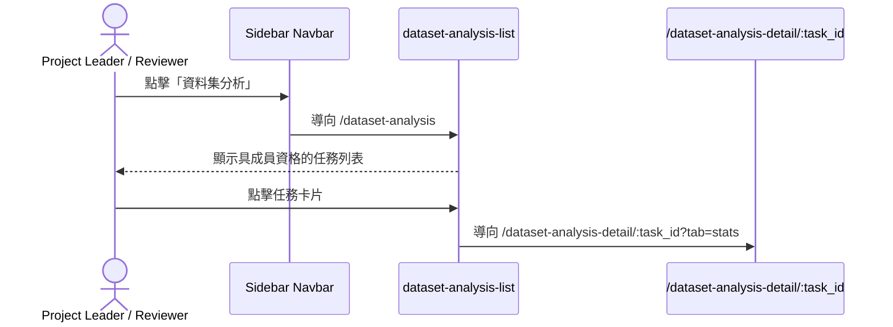
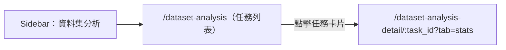

# 功能規格：Dataset Analysis List — 任務列表頁（模組入口）

**功能分支**：`016-dataset-analysis-list`  
**建立日期**：2026-04-24  
**版本**：1.2.1  
**狀態**：Draft  
**需求來源**：IA v1.3.2（2026-04-24）`dataset-analysis-list` 任務列表頁（模組入口）

## 規格常數

- `TASK_ROLES_ALLOWED = project_leader | reviewer`
- `DATASET_ANALYSIS_LIST_ROUTE = /dataset-analysis`
- `DATASET_ANALYSIS_DETAIL_ROUTE = /dataset-analysis-detail/:task_id`
- `LIST_EMPTY_STATE_TRIGGER = no_tasks_with_membership`
- `INVALID_TASK_TRIGGER = task_not_found_or_no_membership`
- `IAA_BADGE_STATES = pass | fail | pending | not_started`
- `MOBILE_BP = 767px`
- `RWD_VIEWPORTS = 375px / 768px / 1440px`

## Process Flow

| Step | Role | Action | System Response |
|------|------|--------|----------------|
| 1 | `project_leader` / `reviewer` | 點擊 Navbar「資料集分析」 | 導向 `/dataset-analysis` |
| 2 | 系統 | 載入列表資料 | 顯示具成員資格的任務列表 |
| 3 | 使用者 | 點擊任務卡片 | 導向 `/dataset-analysis-detail/:task_id?tab=stats` |

---

## 使用者情境與測試 *(必填)*

### User Story 1 — 進入資料集分析模組入口（優先級：P1）

使用者由 Navbar 進入資料集分析模組後，可看到自己具 `TASK_ROLES_ALLOWED` 成員資格的任務列表，作為後續進入 analysis detail 的主要入口；Dashboard badge deep link 為合法次入口。

**此優先級原因**：本頁是資料集分析模組的 L1 landing；若沒有此頁，使用者無法選擇分析任務。  
**獨立測試方式**：以具多個 `TASK_ROLES_ALLOWED` membership 的帳號進入頁面，驗證列表資料、IAA 狀態徽章與導向行為正確。

**驗收情境**：

1. **Given** 使用者至少具一個 `TASK_ROLES_ALLOWED` task membership，**When** 點擊 Navbar「資料集分析」，**Then** 導向 `/dataset-analysis`，顯示該使用者具成員資格的任務列表。
2. **Given** 任務列表顯示，**When** 點擊任一任務卡片，**Then** 導向 `/dataset-analysis-detail/:task_id?tab=stats`。
3. **Given** 使用者無任何具成員資格的任務（`LIST_EMPTY_STATE_TRIGGER`），**When** 進入 `/dataset-analysis`，**Then** 顯示空狀態文字「尚無可分析的任務」。
4. **Given** 某任務的 quality 結果已產生，**When** 任務卡片顯示，**Then** `IAA 狀態徽章` 以 `pass` 或 `fail` 呈現最終結果；尚未產生最終結果時則顯示 `pending` 或 `not_started`。

**介面定義（需與 IA 導覽語意一致）**：

- 頁面副標題：`資料集標記一致性與任務執行情形分析`
- 區塊 A：`任務列表區`
  - 必要元素：任務名稱、任務類型、完成率、IAA 狀態徽章
- 區塊 B：`空狀態`
  - 必要元素：說明文字「尚無可分析的任務」

**行為規則**：

- 列表僅顯示使用者具 `TASK_ROLES_ALLOWED` 角色的任務。
- 點擊任務卡片導向 detail 頁時，預設進入 `?tab=stats`。
- `IAA 狀態徽章` 僅反映 quality 結果摘要狀態，不顯示原始 IAA 數值；狀態集合為 `IAA_BADGE_STATES`。

---

### Edge Cases

- 使用者沒有任何符合 `TASK_ROLES_ALLOWED` 的任務 membership：顯示空狀態，不顯示錯誤頁。
- 使用者僅具 `annotator` membership、無任何 `TASK_ROLES_ALLOWED` membership：顯示空狀態，不導回其他頁面。
- 使用者以舊連結或無效 `task_id` 嘗試進入 detail 頁：由 detail spec 處理 `INVALID_TASK_TRIGGER` 並導回列表頁。
- 手機版（`<= MOBILE_BP`）任務卡片資訊需可完整閱讀，不可發生資訊重疊。

## Requirements *(必填)*

### Functional Requirements

- **FR-001**: 系統必須提供 `DATASET_ANALYSIS_LIST_ROUTE`（`/dataset-analysis`）作為資料集分析模組的入口頁（L1）。
- **FR-002**: 系統必須以 task membership role 作為列表資料過濾依據；僅具 `TASK_ROLES_ALLOWED` membership 的任務可出現在頁面上。
- **FR-003**: 任務列表必須僅列出使用者具 `TASK_ROLES_ALLOWED` 角色的任務。
- **FR-004**: 每張任務卡片必須顯示任務名稱、任務類型、完成率、IAA 狀態徽章。
- **FR-004A**: `IAA 狀態徽章` 必須僅反映該任務最新 quality 結果摘要狀態，狀態值限定為 `pass | fail | pending | not_started`。
- **FR-005**: 當 `LIST_EMPTY_STATE_TRIGGER` 觸發時，頁面必須顯示空狀態說明文字「尚無可分析的任務」。
- **FR-006**: 點擊任務卡片必須導向 `DATASET_ANALYSIS_DETAIL_ROUTE`（`/dataset-analysis-detail/:task_id`），預設進入 `?tab=stats`。
- **FR-007**: 頁面必須支援 `RWD_VIEWPORTS`，在 `<= MOBILE_BP` 仍可完成任務選取與導頁操作。

### User Flow & Navigation *(必填)*

| From | Trigger | To |
|------|---------|----|
| `Sidebar Navbar` | 點擊「資料集分析」 | `/dataset-analysis` |
| `dataset-analysis-list` | 點擊任務卡片 | `/dataset-analysis-detail/:task_id?tab=stats` |

**Entry points**: Sidebar Navbar「資料集分析」。  
**Exit points**: 點擊任務卡片進入 analysis detail。

### Key Entities *(必填)*

- **TaskSummaryCard**: 任務列表卡片資料，至少包含 `task_id`、`task_name`、`task_type`、`overall_completion_rate`、`membership_role`、`iaa_status`。
- **IAAStatusSummary**: quality 結果摘要狀態，列舉值為 `pass | fail | pending | not_started`；供列表頁卡片徽章顯示使用。

---

## Spec Dependencies *(必填)*

### Upstream（本 spec 依賴）

| Spec # | Feature | What this spec needs from it |
|--------|---------|------------------------------|
| shared-008 | Shared Sidebar Navbar | 登入後共用導覽結構與 active 規則（資料集分析 L0 項） |

### Downstream（依賴本 spec）

| Spec # | Feature | What they rely on from this spec |
|--------|---------|----------------------------------|
| dataset-017 | Dataset Analysis Detail | detail 頁入口路徑、task card 導頁行為、列表頁返回目標 |

---

## Success Criteria *(必填)*

- **SC-001**: 進入 `/dataset-analysis` 時，任務列表正確顯示使用者具成員資格的任務。
- **SC-002**: 每張任務卡片皆正確顯示任務名稱、任務類型、完成率、IAA 狀態徽章，且徽章值僅為 `pass | fail | pending | not_started` 之一。
- **SC-003**: `LIST_EMPTY_STATE_TRIGGER` 觸發時，正確顯示「尚無可分析的任務」空狀態。
- **SC-004**: 點擊任務卡片後，正確導向 `/dataset-analysis-detail/:task_id?tab=stats`。
- **SC-005**: 使用者僅具 `annotator` membership、無任何 `TASK_ROLES_ALLOWED` membership 時，頁面顯示空狀態且不顯示不可存取錯誤。
- **SC-006**: 在 `375px / 768px / 1440px` 三種視窗寬度下，任務卡片皆可正常顯示且可完成導頁。

---

## Changelog

| Version | Date | Change Summary |
| --- | --- | --- |
| 1.2.1 | 2026-04-24 | Clarify entry/permission/badge semantics: 列表頁改為主要入口而非唯一入口；權限以 task membership role 為準；補入 IAA badge state enum（pass/fail/pending/not_started） |
| 1.2.0 | 2026-04-24 | Narrow scope to pure IA planning for `dataset-analysis-list`: 移除 stats/detail 詳細規格，僅保留列表入口、空狀態與導向 detail 行為 |
| 1.1.0 | 2026-04-24 | Redesign: 採用任務列表入口 + 雙 Tab 架構（統計總覽 / 品質監控），路由改為 /dataset-analysis-detail/:task_id，task_type 改由 API 載入 |
| 1.0.0 | 2026-04-24 | Initial spec based on IA v1.3.1 dataset module — dataset-stats page |
