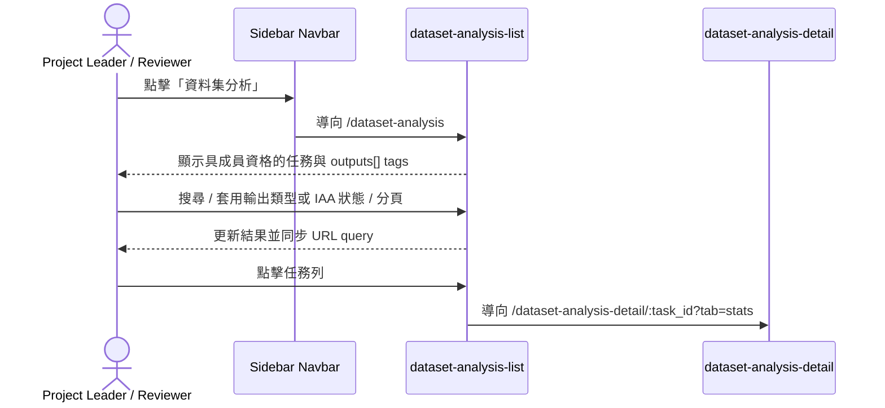
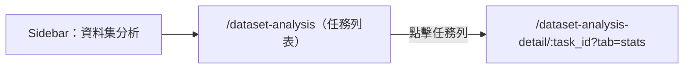

# 功能規格：Dataset Analysis List — 任務列表頁（模組入口）

**需求來源**: IA v1.3.2（2026-04-24）`dataset-analysis-list` 任務列表頁（模組入口）；task-management-010 v2.0.1 任務列表輸出類型契約；task-management-013 v6.4.2 `outputs[]` producer contract。

## 功能目標

讓具 `project_leader` 或 `reviewer` 任務成員資格的使用者，在資料集分析模組入口以 config-driven 的 `outputs[].type` 辨識、搜尋與篩選可分析任務，並保留完成率、IAA 摘要、分頁及前往統計總覽的主要流程。複合任務須逐項呈現輸出類型，不得壓縮為單一固定類型；Prototype 使用 13 筆 example-data 任務作為可驗收示意，不得限制正式系統的任務數量、名稱或合法輸出組合。

## Clarifications

### Session 2026-07-29

- Q: Dataset Analysis List 的任務類型應如何與 New Task 對齊？ → A: 直接消費 `outputs[].type`，合法 key 與 zh/en 文案由 `OUTPUT_TYPE_REGISTRY` 提供。
- Q: 複合任務選定單一輸出類型篩選時是否命中？ → A: 是；只要 `outputs[]` 任一項符合所選 key 即納入結果。
- Q: 13 筆 example-data 是否構成產品上限？ → A: 否；它們只用於 prototype 驗收，新增第 14 筆或其他合法組合不得需要修改列表核心邏輯。
- Q: 本版是否同步 Dataset Analysis Detail 的統計與品質分析？ → A: 否；本版只同步列表 consumer，dataset-017 仍延後。

## 規格常數

以下共用常數一律引用 `specs/_shared/constants.md`，不得在本規格重複定義：

- `TASK_ROLES_ALLOWED`
- `DATASET_ANALYSIS_LIST_ROUTE`
- `DATASET_ANALYSIS_DETAIL_ROUTE`
- `INVALID_TASK_TRIGGER`
- `IAA_BADGE_STATES`
- `MOBILE_BP`
- `RWD_VIEWPORTS`

本規格特有或直接引用 producer registry 的契約：

- `OUTPUT_TYPE_KEYS = single_label | multi_label | single_dim | multi_dim | sequence_tagging | entity_recognition | relation_identification | free_text`
- `OUTPUT_TYPE_SOURCE = task-management-013 OUTPUT_TYPE_REGISTRY`
- `LIST_VIEW_STATES = loading | ready | empty | error`
- `LIST_EMPTY_STATE_TRIGGER = no_tasks_with_membership`
- `LIST_ERROR_STATE_TRIGGER = task_list_load_failed`
- `LIST_QUERY_PARAMS = keyword | output_type | iaa_status | limit | offset`
- `LIST_LIMIT_DEFAULT = 20`
- `LIST_LIMIT_OPTIONS = 20 | 50 | 100`
- `LIST_OFFSET_DEFAULT = 0`
- `SEARCH_DEBOUNCE_MS = 300`

## 流程圖

```mermaid
sequenceDiagram
    actor U as Project Leader / Reviewer
    participant NAV as Sidebar Navbar
    participant LIST as dataset-analysis-list
    participant DETAIL as dataset-analysis-detail

    U->>NAV: 點擊「資料集分析」
    NAV->>LIST: 導向 /dataset-analysis
    LIST-->>U: 顯示具成員資格的任務與 outputs[] tags
    U->>LIST: 搜尋 / 套用輸出類型或 IAA 狀態 / 分頁
    LIST-->>U: 更新結果並同步 URL query
    U->>LIST: 點擊任務列
    LIST->>DETAIL: 導向 /dataset-analysis-detail/:task_id?tab=stats
```

| Step | Role | Action | System Response |
|------|------|--------|----------------|
| 1 | `project_leader` / `reviewer` | 點擊 Navbar「資料集分析」 | 導向 `/dataset-analysis` |
| 2 | 系統 | 載入列表資料 | 顯示使用者具 `TASK_ROLES_ALLOWED` membership 的任務 |
| 3 | 使用者 | 搜尋 / 套用輸出類型、IAA 狀態篩選 / 切換分頁 | 列表即時更新並保留合法查詢條件 |
| 4 | 使用者 | 點擊任務列 | 導向 `/dataset-analysis-detail/:task_id?tab=stats` |

---

## 使用者情境與測試 *(必填)*

### 使用者故事 1 — 進入資料集分析模組入口（優先級：P1）

使用者由 Navbar 進入資料集分析模組後，可看到自己具 `TASK_ROLES_ALLOWED` 成員資格的任務列表，透過輸出類型、IAA 狀態與關鍵字定位任務，再前往統計總覽；Dashboard badge deep link 仍為合法次入口。

**此優先級原因**：本頁是資料集分析模組的 L1 landing；若沒有此頁，使用者無法選擇分析任務。

**獨立測試方式**：以具多個 `TASK_ROLES_ALLOWED` membership 的帳號進入頁面，驗證 13 筆 prototype baseline、輸出類型 membership 篩選、IAA 狀態、搜尋、URL query、分頁、錯誤／空狀態及導向行為。

**驗收情境**：

1. **Given** 使用者至少具一個 `TASK_ROLES_ALLOWED` task membership，**When** 點擊 Navbar「資料集分析」，**Then** 導向 `/dataset-analysis` 並顯示該使用者可分析的任務。
2. **Given** 位於 `/dataset-analysis`，**When** 選定一個輸出類型，**Then** 只顯示 `outputs[]` 至少含該 key 的任務，複合任務亦可命中。
3. **Given** 位於 `/dataset-analysis`，**When** 輸入 raw output key 或目前語系的輸出類型文案，**Then** 搜尋結果包含所有符合的單一與複合任務。
4. **Given** 搜尋或篩選結果超過單頁，**When** 切換分頁，**Then** 顯示對應資料且保留合法查詢條件。
5. **Given** 任務列表顯示，**When** 點擊任一任務列，**Then** 導向 `/dataset-analysis-detail/:task_id?tab=stats`。
6. **Given** 使用者無任何具成員資格的任務，**When** 進入 `/dataset-analysis`，**Then** 保留表頭並顯示「尚無可分析的任務」empty row。
7. **Given** quality 摘要已產生，**When** 任務列顯示，**Then** IAA 徽章依 `IAA_BADGE_STATES` 顯示；列表不自行從標記答案重算 IAA。
8. **Given** 搜尋或篩選後無符合結果，**When** 查看列表，**Then** 保留表頭、顯示空結果說明及清除篩選操作。
9. **Given** 列表載入失敗，**When** 頁面顯示結果區，**Then** 保留表頭並顯示 error row 與重試操作，不得誤呈現為空資料。
10. **Given** 任務具有多個 `outputs[]` 項目，**When** 顯示輸出類型欄，**Then** 每個 output 各呈現一個具文字與可存取名稱的唯讀 tag，欄寬不足時可換行。
11. **Given** Prototype 載入 task-management-010 定義的 13 筆示例，**When** 檢視與篩選列表，**Then** 顯示 13 筆不同任務並符合本規格的示例分布。
12. **Given** 在示例資料加入第 14 筆任意合法 `outputs[]` 組合，**When** 重新呈現列表，**Then** 可直接顯示與篩選，不需新增任務名稱或輸出組合分支。

**介面定義（需與 IA 導覽語意一致）**：

- 頁面副標題：`資料集標記一致性與任務執行情形分析`
- 區塊 A：`任務列表區`
  - 呈現形式：表格式列表，視覺樣式及輸出類型 tag 語意對齊 task-management-010。
  - 必要欄位：任務名稱、輸出類型、完成率、IAA 狀態徽章、成員角色。
- 區塊 A-1：`搜尋與篩選列`
  - 輸出類型篩選器：`全部輸出類型` 加上正好 8 個 `OUTPUT_TYPE_KEYS` 選項。
  - IAA 狀態篩選器、關鍵字搜尋、清除篩選。
- 區塊 A-2：`列表底部分頁列`
  - 總筆數／目前頁數資訊、每頁筆數切換、上一頁／下一頁、有限數量的頁碼按鈕。
- 區塊 B：`空狀態`
  - 保留表頭，以 `tbody` empty row 顯示「尚無可分析的任務」。
- 區塊 C：`空結果狀態`
  - 保留表頭，以 `tbody` empty row 顯示說明及清除篩選操作。
- 區塊 D：`錯誤狀態`
  - 保留表頭，以 `tbody` error row 顯示錯誤訊息及重試操作。

**行為規則**：

- 列表只顯示使用者具 `TASK_ROLES_ALLOWED` membership 的任務。
- 輸出類型查詢值使用 raw `OUTPUT_TYPE_KEYS`；選項、tag 及搜尋文案由 `OUTPUT_TYPE_REGISTRY` 提供，不得硬編任務名稱或固定組合。
- `output_type` 採 membership 語意：只要任一 `output.type` 等於所選 key 即命中，不得只比較第一項或要求完整陣列相等。
- 每個 `outputs[].type` 依原順序各呈現一個唯讀 tag；顏色只能作為輔助，tag 必須有可見文字，tag 群組須具有可存取名稱。
- 多 tag 在欄寬不足時於儲存格內換行，不得截斷文字、互相重疊或造成整頁水平 overflow。
- 搜尋為不分大小寫的 `contains`，作用於任務名稱、每個 output raw key 與目前語系文案、IAA 狀態及成員角色；輸入後於 `SEARCH_DEBOUNCE_MS` 內同步 `keyword` URL query。
- 查詢條件只允許 `LIST_QUERY_PARAMS`，不支援的歷史或未知 query keys 必須移除。
- 搜尋、輸出類型或 IAA 篩選改變時，`offset` 重設為 `0`；`limit` 改變時亦重設為 `0`。
- 無效的 `output_type`、`iaa_status`、`limit` 或 `offset` 回退為無篩選或預設值，並以正規化後的 query 更新 URL；超出結果範圍的 `offset` 正規化為最後一個合法 offset。
- URL query 於重新整理、分頁切換與返回 `/dataset-analysis` 時還原；預設值可以省略。
- 點擊任務列導向 detail 頁時，預設進入 `?tab=stats`。
- `IAA 狀態徽章` 只顯示上游 quality 結果的摘要狀態，不顯示原始 IAA 數值。
- `overall_completion_rate` 與 `iaa_status` 均為列表摘要 metadata；列表不得載入、推導或計算 gold、reference、answer、ground truth 或其他答案內容。
- 語言切換時，欄位、filter options、tag、IAA 與角色文案即時更新。

### Prototype 示例資料基線

Prototype 使用 task-management-010「Prototype 示例資料基線」所列的相同 13 份 `docs/product/example-data/` fixture 與 `outputs[].type` mapping；016 不重複建立另一套 mapping 或轉換邏輯。這 13 筆只用於驗收，不代表 API 筆數、正式資料分布或合法組合上限。

- 輸出類型 membership filter 命中數：
  - `single_label = 2`
  - `multi_label = 2`
  - `single_dim = 1`
  - `multi_dim = 2`
  - `sequence_tagging = 1`
  - `entity_recognition = 3`
  - `relation_identification = 3`
  - `free_text = 2`
- 複合任務：
  - `medical-ner-re.json` 顯示 `entity_recognition`、`relation_identification` 兩個 tag。
  - `absa-va.json` 顯示 `entity_recognition`、`relation_identification`、`multi_dim` 三個 tag。
- IAA 示意分布：`pass = 6`、`pending = 3`、`fail = 2`、`not_started = 2`。
- 成員角色示意分布：`project_leader = 6`、`reviewer = 7`。

### 邊界情況

- 使用者沒有任何符合 `TASK_ROLES_ALLOWED` 的 membership：顯示空狀態，不顯示錯誤頁。
- 使用者僅具 `annotator` membership：顯示空狀態，不導回其他頁面。
- 高篩選條件組合導致無結果：顯示空結果，保留一鍵清除篩選。
- 列表載入失敗：顯示 error row 與重試，不得顯示「尚無可分析的任務」。
- 任務的 `outputs[]` 為空、缺少或含 registry 未知 key：該列資料契約無效，列表顯示可重試的錯誤狀態，不得猜測預設輸出類型。
- 使用者以舊連結或無效 `task_id` 進入 detail：由 dataset-017 依 `INVALID_TASK_TRIGGER` 處理並返回列表。
- 手機版欄位空間不足：允許表格橫向捲動及 tag 儲存格內換行，但操作與文字不得重疊。

---

## 需求規格 *(必填)*

### 功能需求

- **FR-001**: 系統必須提供 `DATASET_ANALYSIS_LIST_ROUTE` 作為資料集分析模組入口。
- **FR-002**: 僅具 `TASK_ROLES_ALLOWED` membership 的任務可出現在列表。
- **FR-003**: 列表必須以 `LIST_VIEW_STATES` 互斥驅動 loading、ready、empty、error 呈現。
- **FR-004**: 列表必須提供全欄位搜尋、輸出類型篩選、IAA 狀態篩選及 `limit`／`offset` 分頁。
- **FR-004A**: IAA 徽章必須只顯示最新 quality 摘要，值限定於 `IAA_BADGE_STATES`；當任務 `outputs[]` 僅含 IAA 排除類型（如僅 `free_text`）時，徽章須顯示 `not_applicable`，不得顯示 `pass`／`fail`／`pending`／`not_started` 或空白。
- **FR-004B**: 輸出類型篩選必須由 `OUTPUT_TYPE_REGISTRY` 提供 `全部輸出類型` 與正好 8 個 `OUTPUT_TYPE_KEYS`，raw value 與顯示文案分離。
- **FR-004C**: `output_type` 必須以 `outputs[].type` membership 語意比對。
- **FR-004D**: 搜尋必須比對每個 output raw key 與目前語系 registry 文案，並於 `SEARCH_DEBOUNCE_MS` 內同步 URL。
- **FR-004E**: 分頁必須使用 `limit`／`offset`，預設為 `LIST_LIMIT_DEFAULT`／`LIST_OFFSET_DEFAULT`，並可切換 `LIST_LIMIT_OPTIONS`。
- **FR-004F**: `LIST_QUERY_PARAMS` 必須同步至 URL；無效值及不支援 query keys 必須移除或正規化。
- **FR-004G**: 搜尋、篩選或 `limit` 改變時，`offset` 必須重設為 `0`。
- **FR-005**: 每列至少顯示 `task_name`、`outputs[]` tags、`overall_completion_rate`、`iaa_status`、`membership_role`。
- **FR-005A**: 每個 output 必須各呈現一個 registry-driven 唯讀 tag，具可見文字與可存取名稱，且多 tag 可換行。
- **FR-005B**: `LIST_EMPTY_STATE_TRIGGER` 觸發時，頁面必須保留表頭並顯示「尚無可分析的任務」empty row。
- **FR-005C**: 篩選後無結果時，頁面必須保留表頭並提供清除篩選操作。
- **FR-005D**: `LIST_ERROR_STATE_TRIGGER` 觸發時，頁面必須保留表頭並顯示 error row 與重試操作，不得誤呈現為 empty。
- **FR-005E**: 列表資料契約只能包含任務與分析摘要 metadata，不得包含或由列表推導 gold、reference、answer、ground truth 或等價答案內容。
- **FR-006**: 點擊任務列必須導向 `DATASET_ANALYSIS_DETAIL_ROUTE`，預設進入 `?tab=stats`。
- **FR-007**: 在 `RWD_VIEWPORTS` 均須可完成搜尋、篩選、分頁、任務選取及導頁，且多 tag 不得重疊或造成整頁水平 overflow。
- **FR-008**: 新增具任意合法 `outputs[]` 組合的任務時，列表顯示、搜尋及篩選不得需要新增任務名稱或輸出組合分支。

### 使用者流程與導頁 *(必填)*

```mermaid
flowchart LR
    NAV["Sidebar：資料集分析"] --> LIST["/dataset-analysis（任務列表）"]
    LIST -->|點擊任務列| DETAIL["/dataset-analysis-detail/:task_id?tab=stats"]
```

| From | Trigger | To |
|------|---------|----|
| `Sidebar Navbar` | 點擊「資料集分析」 | `/dataset-analysis` |
| `dataset-analysis-list` | 點擊任務列 | `/dataset-analysis-detail/:task_id?tab=stats` |

**Entry points**: Sidebar Navbar「資料集分析」。

**Exit points**: 點擊任務列進入 analysis detail。

### 關鍵實體 *(必填)*

- **TaskSummaryRow**: 任務列表摘要，至少包含 `task_id`、`task_name`、`outputs: { type: OUTPUT_TYPE_KEYS }[]`、`overall_completion_rate`、`membership_role`、`iaa_status`；不得包含 output config、原始標記答案或評估答案。
- **IAAStatusSummary**: quality 結果摘要狀態，值為 `IAA_BADGE_STATES`（含 `not_applicable`）；只供列表徽章顯示。
- **DatasetAnalysisListViewState**: 包含 `keyword`、`output_type`、`iaa_status`、`limit`、`offset`。
- **DatasetAnalysisListResponse**: 包含 `items: TaskSummaryRow[]`、`total`、`limit`、`offset`；`items` 僅含列表必要 metadata。

---

## 規格相依性 *(本功能依賴其他規格，或被其他規格依賴時填寫)*

### 上游（本規格依賴的規格）

| Spec # | Feature | What this spec needs from it |
|--------|---------|------------------------------|
| shared-008 | Shared Sidebar Navbar | 登入後共用導覽結構與 active 規則（資料集分析 L0 項） |
| task-management-010 | Task List | `outputs[].type` 多 tag、registry filter、URL query、RWD 及 13 筆 prototype baseline |
| task-management-013 | New Task | `OUTPUT_TYPE_REGISTRY`、8 個 `OUTPUT_TYPE_KEYS` 與 `outputs[]` producer contract |

### 下游（依賴本規格的規格）

| Spec # | Feature | What they rely on from this spec |
|--------|---------|----------------------------------|
| dataset-017 | Dataset Analysis Detail | detail 頁入口路徑、`task_id` 導頁與列表返回目標 |

> **v2.0.0 scope boundary（已由 dataset-017 v2.0.0 補齊，見下方 v2.1.0 Changelog）**：dataset-017 已於 v2.0.0 完成統計、IAA 與品質分析對 `outputs[]`（8-key `OUTPUT_TYPE_KEYS`）的完整遷移，detail 頁現已支援全部 8 種輸出類型與任意複合組合的逐型並列顯示；`IAA_BADGE_STATES` 的 `not_applicable` 值（任務 `outputs[]` 僅含 `free_text` 等 IAA 排除類型時）已由 dataset-017 定義並由本規格列表徽章一併呈現。

---

## 成功標準 *(必填)*

- **SC-001**: 進入 `/dataset-analysis` 時，只顯示使用者具 `TASK_ROLES_ALLOWED` membership 的任務。
- **SC-002**: 每列正確顯示任務名稱、所有輸出類型 tag、完成率、IAA 摘要及成員角色。
- **SC-003**: `全部輸出類型` 與 8 個 registry filter 正確呈現；每個 filter 的 13 筆 baseline 命中數符合本規格。
- **SC-004**: 搜尋 raw output key 與目前語系文案可得到相同的 membership 結果。
- **SC-005**: `LIST_QUERY_PARAMS` 可於重新整理、分頁切換及返回列表時還原；filter 或 `limit` 改變後 `offset = 0`，無效及不支援 query 被正規化移除。
- **SC-006**: empty、filtered-empty 與 error 三種狀態互不混淆，皆保留表頭；後兩者分別提供清除篩選與重試操作。
- **SC-007**: 點擊任務列後導向 `/dataset-analysis-detail/:task_id?tab=stats`。
- **SC-008**: Prototype 預設顯示 13 筆不同任務；`medical-ner-re.json` 顯示 2 tags，`absa-va.json` 顯示 3 tags。
- **SC-009**: 加入第 14 筆任意合法 `outputs[]` 任務後，可直接顯示、搜尋及篩選，無需修改核心分支。
- **SC-010**: 列表 response、頁面、搜尋索引及 URL 均不包含 gold、reference、answer、ground truth 或等價答案內容。
- **SC-011**: 在 `375px`、`768px`、`1440px` 下皆可操作列表，複合 tag 可換行且無資訊重疊或整頁水平 overflow。
- **SC-012**: 本版每個新增或修改的 prototype 驗收情境皆有對應 Playwright 測試，涵蓋 13 筆 baseline、8 filters、IAA／角色分布、raw／localized 搜尋、`limit`／`offset`、query normalization、複合 tag、14th-task 泛化、empty/error 與三個 `RWD_VIEWPORTS`。

---

## Changelog

| Version | Date | Change Summary |
| --- | --- | --- |
| 2.1.0 | 2026-08-12 | **同步 dataset-017 v2.0.0 IAA 策略 v2（minor）**：`IAA_BADGE_STATES` 新增 `not_applicable`（任務 `outputs[]` 僅含 IAA 排除類型如 `free_text` 時，徽章顯示 `not_applicable` 而非 `pass`／`fail`／`pending`／`not_started` 或空白），更新 FR-004A 與 `IAAStatusSummary` 實體；移除已過時的「v2.0.0 scope boundary（detail 待同步）」註記，改記錄 dataset-017 已完成 8-key `outputs[]` 遷移，detail 頁現支援全部 8 種輸出類型與複合組合。 |
| 2.0.0 | 2026-07-29 | **Dataset Analysis List 遷移至可組合輸出類型**：移除固定單一 `task_type` 與 `page`／`page_size` 契約，改以 `outputs[].type` 多 tag、registry-driven 8 種輸出類型 membership filter、raw／localized 搜尋及 `output_type`／`limit`／`offset` URL query。加入 empty/error 分流、摘要 metadata 安全界線、13 筆 prototype baseline 與 filter／IAA／角色分布、medical／ABSA 複合 tag、第 14 筆合法任務泛化及 Playwright 驗收。13 筆只作示意，不構成產品上限；dataset-017 detail consumer 仍延後。 |
| 1.3.1 | 2026-05-21 | 補充輸入與產生規則、已釐清事項、審查清單與執行狀態；同步功能分支格式 |
| 1.3.0 | 2026-04-30 | Sync with current prototype: 列表入口改為對齊 task-list 的 table layout；新增 task type / IAA status / keyword filters、footer pagination、URL query 保留、空結果清除篩選、membership role 欄位 |
| 1.2.1 | 2026-04-24 | Clarify entry/permission/badge semantics: 列表頁改為主要入口而非唯一入口；權限以 task membership role 為準；補入 IAA badge state enum（pass/fail/pending/not_started） |
| 1.2.0 | 2026-04-24 | Narrow scope to pure IA planning for `dataset-analysis-list`: 移除 stats/detail 詳細規格，僅保留列表入口、空狀態與導向 detail 行為 |
| 1.1.0 | 2026-04-24 | Redesign: 採用任務列表入口 + 雙 Tab 架構（統計總覽 / 品質監控），路由改為 /dataset-analysis-detail/:task_id，task_type 改由 API 載入 |
| 1.0.0 | 2026-04-24 | Initial spec based on IA v1.3.1 dataset module — dataset-stats page |
