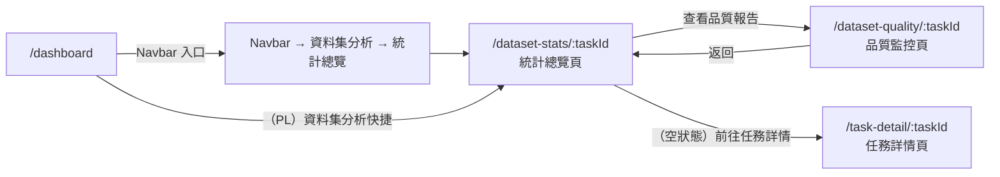

# 功能規格：統計總覽頁（Dataset Stats）

**功能分支**：`016-dataset-stats`
**建立日期**：2026-04-05
**狀態**：Draft
**需求來源**：IA v7 Spec 清單 #016 — 統計總覽頁（dataset-stats）

---

## 使用者情境與測試 *(必填)*

### User Story 1 — Project Leader 查看整體完成率（優先級：P1）

任務 `project_leader` 進入統計總覽頁，掌握當前任務的整體標注進度（Dry Run / Official Run 分開統計），以及各標記員的個人完成率，作為任務排程與人力調度的依據。

**此優先級原因**：整體完成率是 PL 最核心的管理資訊，直接影響何時觸發 IAA 確認、何時啟動 Official Run 等決策。

**獨立測試方式**：建立任務並由多個標記員完成部分標注後，以 project_leader 帳號進入 `/dataset-stats/:taskId`，確認整體完成率、各標記員完成率均正確計算並顯示。

**驗收情境**：

1. **Given** 任務 `project_leader` 進入 `/dataset-stats/:taskId`，**When** 頁面載入，**Then** 顯示任務整體進度（Dry Run 區塊：已完成筆數 / 總筆數、完成率百分比；Official Run 區塊：相同格式，尚未啟動時顯示「尚未發布 Official Run」說明），並列出各標記員的個人完成率長條圖（依完成率排序）。
2. **Given** project_leader 查看各標記員完成率，**When** 某位標記員完成率低於平均值的 80%，**Then** 系統以警示色（橘色）標示該標記員，方便 PL 識別需要跟進的成員。

---

### User Story 2 — Project Leader 查看標注分佈（優先級：P2）

任務 `project_leader` 查看標注資料的分佈情況（例如各標籤次數 / 比例、分數分佈直方圖），判斷資料集是否有標籤不平衡或分佈異常問題。

**此優先級原因**：標注分佈是資料品質的重要指標，但不影響任務的基本流程推進，故為 P2。

**獨立測試方式**：在有足夠標注資料的任務中，以 PL 帳號確認各任務類型顯示正確的分佈圖表；以 reviewer 帳號確認僅看到分佈資訊、不顯示個別標記員姓名與明細。

**驗收情境**：

1. **Given** project_leader 在統計總覽頁，**When** 查看標注分佈區塊，**Then** 系統依 `task_type` 顯示對應圖表：`classification` 顯示各標籤次數與比例長條圖；`scoring` 顯示分數分佈直方圖（含平均值 / 中位數 / 標準差）；`ner` 顯示實體類型分佈與每句平均實體數；`relation` 顯示實體類型與關係類型分佈及 Triple 數量；`sentence_pair` 依 `annotation.mode` 呈現分類或評分對應圖表。
2. **Given** 任務角色為 `reviewer` 的使用者進入統計總覽頁，**When** 查看標注分佈區塊，**Then** 顯示整體標注分佈圖表，但各標記員姓名與個人完成率明細不顯示（以「—」遮蓋或隱藏整個個人明細區塊）。

---

### User Story 3 — Project Leader 依時間範圍篩選並匯出統計資料（優先級：P2）

任務 `project_leader` 使用時間範圍篩選器，查看特定期間的標注進度，並將統計結果匯出為 CSV 供外部分析。

**此優先級原因**：時間篩選與匯出功能提升管理效率，但為輔助功能，核心統計不依賴此功能。

**驗收情境**：

1. **Given** project_leader 在統計總覽頁，**When** 設定起始日期與結束日期後點擊「套用」，**Then** 頁面所有統計圖表（完成率、標注分佈）均重新計算並只顯示該時間範圍內的標注資料，URL query string 同步更新（`?from=YYYY-MM-DD&to=YYYY-MM-DD`）以支援分享連結。
2. **Given** project_leader 在統計總覽頁，**When** 點擊「匯出 CSV」按鈕，**Then** 系統產生包含各標記員完成數、各標籤 / 分數分佈統計的 CSV 檔案，瀏覽器自動下載，Toast 顯示「統計資料已匯出」，檔名格式為 `stats_{task_name}_{YYYYMMDD}.csv`。

---

### 邊界情況

- **尚無標注資料（空狀態）：** 顯示說明文字「尚無標注資料，請先發布 Dry Run」，提供「前往任務詳情」次要按鈕（→ `/task-detail/:taskId`），所有圖表區域顯示空狀態佔位符。
- **Reviewer 存取個人明細：** Reviewer 進入此頁時，個人標記員明細區塊整體隱藏，不洩漏個別標記員資訊。
- **Official Run 尚未發布：** Official Run 區塊顯示「尚未發布 Official Run」說明，不顯示空白圖表或 0% 完成率，避免誤導。
- **時間篩選範圍無資料：** 若所選時間範圍內沒有任何標注，圖表顯示空狀態而非錯誤，提示「此期間無標注資料」。

---

## 需求規格 *(必填)*

### 功能需求

- **FR-001**：只有任務角色為 `project_leader` 或 `reviewer` 的使用者，以及系統角色 `super_admin`，MUST 能進入 `/dataset-stats/:taskId`；透過 `useTaskRole(taskId)` hook 驗證，無任務成員資格者重導至 `/dashboard`。
- **FR-002**：頁面 MUST 同時顯示 Dry Run 與 Official Run 的標注進度（各自的完成筆數 / 總筆數 / 完成率百分比）；Official Run 尚未發布時顯示對應說明文字。
- **FR-003**：頁面 MUST 依 `task_type` 動態渲染標注分佈圖表，圖表類型與內容依 config 決定（詳見 User Story 2 SC-1）；不得在前端硬編碼任務類型判斷。
- **FR-004**：只有任務角色 `project_leader`（及 `super_admin`）MUST 能看到各標記員的個人完成率與姓名明細；`reviewer` 只能看到整體分佈，個人明細區塊隱藏。
- **FR-005**：完成率低於全員平均值 80% 的標記員 MUST 在個人明細清單中以警示色標示。
- **FR-006**：頁面 MUST 提供時間範圍篩選器（起始日 / 結束日）；套用後所有統計圖表依篩選條件重新計算，篩選參數反映於 URL query string。
- **FR-007**：只有任務角色 `project_leader`（及 `super_admin`）MUST 能使用「匯出 CSV」功能；`reviewer` 不顯示此按鈕。
- **FR-008**：頁面底部 MUST 提供「查看品質報告」連結，導向 `/dataset-quality/:taskId`，以串接 dataset-stats 與 dataset-quality 的工作流程。
- **FR-009**：尚無標注資料時，頁面 MUST 顯示空狀態說明文字並提供「前往任務詳情」按鈕，不顯示空白圖表。

### User Flow & Navigation

| From | Trigger | To |
|------|---------|-----|
| Navbar → 資料集分析 → 統計總覽 | 點擊 | `/dataset-stats/:taskId` |
| `/dashboard`（PL / Reviewer） | 資料集分析快捷連結 | `/dataset-stats/:taskId` |
| `/dataset-stats/:taskId` | 「查看品質報告」連結 | `/dataset-quality/:taskId` |
| `/dataset-stats/:taskId`（空狀態） | 「前往任務詳情」按鈕 | `/task-detail/:taskId` |
| `/dataset-quality/:taskId` | 「返回統計總覽」 | `/dataset-stats/:taskId` |

**Entry points**：Navbar → 資料集分析 → 統計總覽；Dashboard PL 視角的資料集分析快捷連結；`dataset-quality` 返回連結。
**Exit points**：「查看品質報告」→ `/dataset-quality/:taskId`；（空狀態）「前往任務詳情」→ `/task-detail/:taskId`。

### 關鍵實體

- **AnnotationStats（計算欄位，非持久化 entity）**：由後端即時聚合計算，不另存資料庫欄位。包含：`task_id`、`run_type`（`dry_run` | `official_run`）、`total_items`（總筆數）、`completed_items`（已提交筆數）、`completion_rate`（完成率 0.0–1.0）、`per_annotator`（各標記員個人統計陣列：`annotator_id`、`name`、`completed`、`rate`）、`distribution`（標注分佈，依 task_type 結構不同）、`time_range`（篩選條件）。
- **AnnotatorProgress**（聚合視圖）：`annotator_id`、`name`、`task_id`、`run_type`、`completed_count`、`total_assigned`、`completion_rate`、`is_below_avg_threshold`（是否低於平均值 80%）。

---

## 成功標準 *(必填)*

- **SC-001**：五種 `task_type` 的標注分佈圖表均能依 config 正確渲染，新增任務類型不需修改前端圖表元件。
- **SC-002**：Reviewer 進入頁面時，個人標記員明細區塊完整隱藏，無任何個別標記員資訊外洩。
- **SC-003**：時間範圍篩選後，圖表數據與 URL query string 一致，分享連結可重現相同篩選結果。
- **SC-004**：匯出 CSV 檔案包含所有標記員完成數與標注分佈統計，檔名格式正確，不包含任何 test-set 原始資料內容。
- **SC-005**：空狀態時不顯示錯誤或空白圖表，使用者能清楚知道下一步行動。
