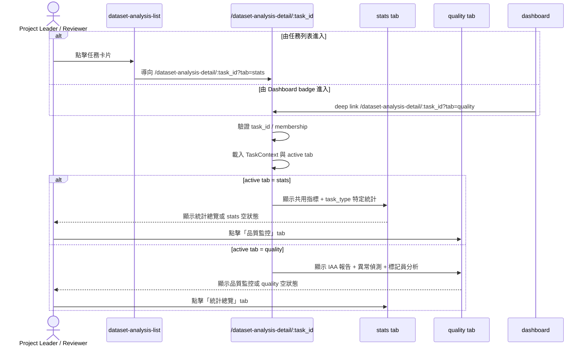
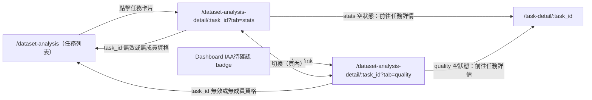

# 功能規格：Dataset Analysis Detail — 統計總覽 + 品質監控雙 Tab

**功能分支**：`017-dataset-analysis-detail`  
**建立日期**：2026-04-24  
**版本**：1.3.2  
**狀態**：Draft  
**需求來源**：IA v1.3.2（2026-04-24）資料集分析模組規範（雙 Tab 架構）

## 規格常數

- `TASK_ROLES_ALLOWED = project_leader | reviewer`
- `TASK_TYPE_KEYS = single_sentence_classification | single_sentence_va_scoring | sequence_labeling | relation_extraction | sentence_pairs`
- `DATASET_ANALYSIS_LIST_ROUTE = /dataset-analysis`
- `DATASET_ANALYSIS_DETAIL_ROUTE = /dataset-analysis-detail/:task_id`
- `TAB_STATS = stats`
- `TAB_QUALITY = quality`
- `DEFAULT_TAB = stats`
- `ROUTE_PARAM = task_id`
- `SHARED_METRICS = sentence_count | token_count | overall_completion_rate`
- `STATS_EMPTY_STATE_TRIGGER = no_submitted_annotations`
- `QUALITY_EMPTY_STATE_TRIGGER = dry_run_not_completed`
- `INVALID_TASK_TRIGGER = task_not_found_or_no_membership`
- `STATS_TAB_STATES = loading | empty | ready | error`
- `QUALITY_TAB_STATES = loading | dry_run_in_progress | report_pending | report_generating | ready | error`
- `IAA_SUMMARY_STATES = pass | fail | pending | not_started`
- `MOBILE_BP = 767px`
- `RWD_VIEWPORTS = 375px / 768px / 1440px`
- `CONSISTENCY_DEVIATION_BLOCK = annotator_consistency_deviation_analysis`
- `CONSISTENCY_DEVIATION_STD_LEVELS = 1.5xSTD | 2xSTD`

- 標記員風險等級：
  - `ANNOTATOR_RISK_LEVELS = normal | watch | high_risk`
  - `ANNOTATOR_MIN_SAMPLE_THRESHOLD = 10`（低於此數不進行風險評估）
  - 風險判斷規則（OR 邏輯，任一成立即升級）：
    - `watch`：個別 IAA < 群體 IAA - 0.05 **或** 速度 < 群體平均 × 0.6
    - `high_risk`：個別 IAA < IAA 閾值 **或** outlier rate > 30% **或** 速度 < 群體平均 × 0.4
  - 閾值為預設值，可由 `project_leader` 在任務設定中覆寫
- 標記員異常原因分類（annotator-level，非 sample-level）：
  - `ANNOTATOR_CAUSE_TYPES = annotator_bias | marking_too_fast | marking_too_slow`
  - `annotator_bias`：Δ 值（個別平均 - 群體平均）絕對值超過 1σ 且具方向性（系統性偏高或偏低）
  - `marking_too_fast`：個別平均速度 < 群體平均 × 0.6
  - `marking_too_slow`：個別平均速度 > 群體平均 × 2.0
- 樣本層級旗標（sample-level，與標記員風險分開處理）：
  - `SAMPLE_FLAG_TYPES = high_divergence`
  - `high_divergence`：同一樣本中，任一標記員的標記值距群體中位數 > 2σ，且其他標記員一致性高（pairwise ICC > 0.75）
- 標記一致性偏離分析（annotator-level observation，非 decision layer）：
  - `CONSISTENCY_DEVIATION_BLOCK` 顯示每位標記員在可比較單位中的群體偏離次數與比例，用於輔助判讀一致性風險，不直接等同風險等級
  - 可比較單位需為同一資料單位具有足夠重疊標記次數後所形成的比較母體；relation extraction 可為「標記 5 次的三元組數」，其他 task type 以對應資料單位名稱顯示
  - `1.5xSTD`：中度偏離觀測閾值；`2xSTD`：高度偏離觀測閾值
  - 本區塊為 annotator-level 聚合統計；不得以單一高分歧樣本直接取代整體偏離比例
- 建議行動操作權限：
  - `RISK_ACTION_ALLOWED_ROLE = project_leader`（reviewer 僅能查看，不能執行行動）
- VA 評分任務的風險分數聚合規則：
  - `VA_RISK_AGGREGATION = max(risk_level_V, risk_level_A)`（取 V / A 中較高風險等級）
  - 原因分類：V / A 分開標示，不合併為單一原因

- IAA 閾值（依 task_type）：
  - `IAA_THRESHOLD_CLASSIFICATION = 0.8`（Krippendorff's Alpha nominal）
  - `IAA_THRESHOLD_VA_RECOMMENDED = 0.75`（ICC，建議）
  - `IAA_THRESHOLD_VA_STRICT = 0.80`（ICC，嚴格）
  - `IAA_THRESHOLD_SEQUENCE = 0.8`（Pairwise Entity-level F1 strict）
  - `IAA_THRESHOLD_SEQUENCE_RELAXED = 0.7`（Pairwise Entity-level F1 partial overlap）
  - `IAA_THRESHOLD_RELATION = 0.75`（Pairwise Triple-level F1）
  - `IAA_THRESHOLD_RELATION_HIGH = 0.8`（Pairwise Triple-level F1 高品質）
  - `IAA_THRESHOLD_SENTENCE_PAIRS = 0.8`（Krippendorff's Alpha nominal）

## Process Flow

| Step | Role | Action | System Response |
|------|------|--------|----------------|
| 1 | `project_leader` / `reviewer` | 由任務列表或 Dashboard badge 進入詳情頁 | 進入 `/dataset-analysis-detail/:task_id`，預設 `?tab=stats` 或依 deep link 進入 `?tab=quality` |
| 2 | 系統 | 驗證 `task_id` 與成員資格 | 合法則載入 TaskContext；否則導回 `/dataset-analysis` |
| 3 | 系統 | 載入 active tab 與對應資料 | 渲染共用 detail shell、Tab 列與對應 tab 內容 |
| 4 | 使用者 | 查看統計總覽或品質監控 | 顯示對應圖表、表格、空狀態或錯誤狀態 |
| 5 | 使用者 | 點擊另一個 Tab | 更新 `?tab=`，頁內切換且保留任務上下文 |

---

## 使用者情境與測試 *(必填)*

### User Story 1 — 進入任務分析詳情頁並載入共用 Detail Shell（優先級：P1）

使用者由任務列表主要入口或 Dashboard badge 合法次入口進入任務分析詳情頁後，系統需先解析任務上下文並渲染共用 detail shell，包含麵包屑、任務基本資訊與雙 Tab 導覽。

**此優先級原因**：detail shell 是 stats 與 quality 兩個 tab 的共同容器；若上下文與 Tab shell 未建立，雙 Tab 架構無法成立。  
**獨立測試方式**：從任務列表與 Dashboard badge 兩個入口進入，驗證同一 detail shell 能正確顯示且 active tab 正確。

**驗收情境**：

1. **Given** 使用者從 `dataset-analysis-list` 點擊任務卡片，**When** 進入詳情頁，**Then** 導向 `/dataset-analysis-detail/:task_id?tab=stats`，並渲染 detail shell 與統計總覽 active tab。
2. **Given** 使用者從 Dashboard「IAA 待確認」badge 進入，**When** 開啟詳情頁，**Then** 導向 `/dataset-analysis-detail/:task_id?tab=quality`，並渲染 detail shell 與品質監控 active tab。
3. **Given** `task_id` 無效或使用者無成員資格（`INVALID_TASK_TRIGGER`），**When** 嘗試進入詳情頁，**Then** 導回 `/dataset-analysis` 並顯示錯誤提示。
4. **Given** 使用者對該任務不存在 `TASK_ROLES_ALLOWED` membership，**When** 嘗試進入詳情頁，**Then** 視為 `INVALID_TASK_TRIGGER`，導回 `/dataset-analysis` 並顯示錯誤提示。

**介面定義（需與 IA 導覽語意一致）**：

- 區塊 A：`Detail Header`
  - 必要元素：麵包屑返回任務列表、任務名稱
- 區塊 B：`Tab Shell`
  - 必要元素：統計總覽 tab、品質監控 tab、active 狀態、頁內切換行為
- 區塊 C：`錯誤狀態`
  - 必要元素：導回提示文案（無效 task_id / 無成員資格）

**行為規則**：

- detail shell 為 stats / quality 共用，不因 tab 切換而重建任務上下文。
- `?tab=` 僅控制 active tab，不可覆寫 `task_type` 或 `task_id`。
- 未帶 `?tab=` 時一律落在 `DEFAULT_TAB`。

---

### User Story 2 — 查看統計總覽與任務類型特定指標（優先級：P1）

使用者在統計總覽 tab 可查看當前任務的共用指標與依 `task_type` 動態渲染的特定統計圖表，作為進一步檢視品質監控前的基礎分析。

**此優先級原因**：IA 已將統計總覽定義為 detail page 的預設 tab；若缺少此內容，017 無法完整承接 analysis-detail 頁責任。  
**獨立測試方式**：以不同 `task_type` 的任務進入 `?tab=stats`，驗證共用指標、特定指標與空狀態皆正確。

**驗收情境**：

1. **Given** 任務 `task_type=single_sentence_classification`，**When** 進入統計總覽 tab，**Then** 顯示 `SHARED_METRICS` 與分類特定指標（標籤長條圖、多標籤共現矩陣）。
2. **Given** 任務 `task_type=single_sentence_va_scoring`，**When** 進入統計總覽 tab，**Then** 顯示 Valence / Arousal 分佈直方圖、平均值 / 標準差 / 中位數，以及二維 V-A scatter plot。
3. **Given** 任務 `task_type=sequence_labeling`，**When** 進入統計總覽 tab，**Then** 顯示實體類型分佈、每句平均實體數、Entity span 長度分佈。
4. **Given** 任務 `task_type=relation_extraction`，**When** 進入統計總覽 tab，**Then** 顯示實體類型分佈、關係類型分佈、Triple 數量統計。
5. **Given** 任務 `task_type=sentence_pairs`，**When** 進入統計總覽 tab，**Then** 依子類型顯示標籤分佈（分類）或分數分佈（評分）。
6. **Given** 尚無已提交標記資料（`STATS_EMPTY_STATE_TRIGGER`），**When** 進入統計總覽 tab，**Then** 顯示「尚無標記資料，請先發布 Dry Run」與「前往任務詳情」次要按鈕。

**介面定義（需與 IA 導覽語意一致）**：

- 區塊 A：`共用指標區`
  - 必要元素：Sentence 數量、Token 數量、整體完成率
- 區塊 B：`任務類型特定指標區`
  - `single_sentence_classification`：各標籤次數 / 比例長條圖、多標籤共現矩陣
  - `single_sentence_va_scoring`：Valence / Arousal 分佈直方圖、統計摘要列、V-A 二維分佈 scatter plot
  - `sequence_labeling`：實體類型分佈、每句平均實體數、Entity span 長度分佈
  - `relation_extraction`：實體類型分佈、關係類型分佈、Triple 數量統計
  - `sentence_pairs`：分類子類型為標籤分佈；評分子類型為分數分佈
- 區塊 C：`Stats 空狀態`
  - 必要元素：說明文字、「前往任務詳情」次要按鈕（→ `task-detail`）

**行為規則**：

- `task_type` 由任務資料載入，不由路由 query 決定。
- 空狀態下仍保留 detail shell 與 Tab 列；`SHARED_METRICS` 可顯示既有值，特定圖表以空狀態取代。
- 語言切換需同步更新圖表標題、軸標籤、圖例與說明文字。

---

### User Story 3 — 查看 IAA 報告與品質監控內容（優先級：P1）

使用者在品質監控 tab 可查看 Dry Run 完成後依 `task_type` 選定的主要 IAA 指標、與閾值的比較結果，以及異常偵測、標記一致性偏離分析與標記員個別分析；其中 `sentence_pairs` 的分類型與評分型皆需被支援。

**此優先級原因**：品質監控是 detail page 的第二個核心 tab，負責 Dry Run 後的品質決策。  
**獨立測試方式**：以不同 `task_type` 進入 `?tab=quality`，驗證 IAA 指標、異常偵測、標記一致性偏離分析與標記員分析皆正確。

**驗收情境**：

1. **Given** `task_type=single_sentence_classification`，**When** 進入品質監控，**Then** 顯示 Krippendorff's Alpha（nominal）⭐️ 為主要指標，替代指標區（Cohen's Kappa / Fleiss' Kappa）可選顯示，並標示 `IAA_THRESHOLD_CLASSIFICATION`。
2. **Given** `task_type=single_sentence_va_scoring`，**When** 進入品質監控，**Then** 顯示 ICC ⭐️ 為主要指標，分別計算 IAA_V / IAA_A，Overall = (IAA_V + IAA_A) / 2，並標示 `IAA_THRESHOLD_VA_RECOMMENDED` 與 `IAA_THRESHOLD_VA_STRICT`。
3. **Given** `task_type=sequence_labeling`，**When** 進入品質監控，**Then** 顯示 Pairwise Entity-level F1 ⭐️ 為主要指標，提供 strict 與 partial overlap match 切換，並標示 `IAA_THRESHOLD_SEQUENCE` / `IAA_THRESHOLD_SEQUENCE_RELAXED`。
4. **Given** `task_type=relation_extraction`，**When** 進入品質監控，**Then** 顯示 Pairwise Triple-level F1 ⭐️ 為主要指標，並標示 `IAA_THRESHOLD_RELATION` / `IAA_THRESHOLD_RELATION_HIGH`。
5. **Given** `task_type=sentence_pairs` 且子類型為分類型，**When** 進入品質監控，**Then** 顯示 Krippendorff's Alpha（nominal）⭐️ 與 `IAA_THRESHOLD_SENTENCE_PAIRS`。
6. **Given** `task_type=sentence_pairs` 且子類型為評分型，**When** 進入品質監控，**Then** 顯示 ICC ⭐️ 為主要指標，並沿用 `IAA_THRESHOLD_VA_RECOMMENDED` 與 `IAA_THRESHOLD_VA_STRICT` 作為門檻。
7. **Given** Dry Run 尚未完成（`QUALITY_EMPTY_STATE_TRIGGER`），**When** 進入品質監控，**Then** 顯示「IAA 報告將在 Dry Run 完成後產生」與「前往任務詳情」次要按鈕。

**介面定義（需與 IA 導覽語意一致）**：

- 區塊 A：`IAA 報告區`
  - 必要元素：主要 IAA 指標、IAA 數值、閾值比較、計算方法說明
  - 選用元素：替代 / 輔助指標（可展開 / 收合）
- 區塊 B：`共用品質監控功能區`
  - 必要元素依顯示順序為：異常偵測（速度異常 / 離群值）、標記員風險評估（個別速度 / 個別 IAA vs 群體平均）、`標記一致性偏離分析`（可比較單位數、`離群值(1.5xSTD)筆數`、`離群值(1.5xSTD)比例`、`離群值(2xSTD)筆數`、`離群值(2xSTD)比例`）
- 區塊 C：`Quality 空狀態`
  - 必要元素：說明文字、「前往任務詳情」次要按鈕（→ `task-detail`）

**行為規則**：

- 主要 IAA 指標固定顯示；替代 / 輔助指標預設收合。
- IAA 數值需有明確的達標（綠色 / pass）與未達標（紅色 / fail）視覺標示。
- 指標區與分析區皆為唯讀，不提供編輯操作。
- 共用品質監控區塊在 ready state 下需固定依序呈現：異常偵測 → 標記員風險評估 → `標記一致性偏離分析`。
- `標記一致性偏離分析` 為觀測型區塊，不可直接覆寫 `AnnotatorRiskAssessment.risk_level`；若需影響風險等級，必須另行明確定義規則。
- quality tab 需同時輸出可供列表頁使用的 `IAA_SUMMARY_STATES` 摘要狀態。

---

### User Story 4 — 在同一 Detail 頁中切換雙 Tab（優先級：P1）

使用者可在同一個 detail page 中於統計總覽與品質監控之間切換，並保留任務上下文與各自的捲動位置。

**此優先級原因**：analysis-detail 的核心價值是同任務上下文下的雙 Tab 對照；若 tab 切換不穩定，整頁資訊架構即失效。  
**獨立測試方式**：從 stats 與 quality 互切，驗證 URL、active tab、任務上下文與捲動位置皆正確。

**驗收情境**：

1. **Given** 使用者位於 `/dataset-analysis-detail/:task_id?tab=stats`，**When** 點擊「品質監控」tab，**Then** 更新 `?tab=quality`，頁內切換且任務上下文不變。
2. **Given** 使用者位於 `/dataset-analysis-detail/:task_id?tab=quality`，**When** 點擊「統計總覽」tab，**Then** 更新 `?tab=stats`，頁內切換且任務上下文不變。
3. **Given** 使用者已於任一 tab 捲動內容，**When** 切換到另一 tab 再切回，**Then** 各 tab 捲動位置彼此獨立且不被重置。

**行為規則**：

- Tab 切換屬頁內切換，不可重新導向到任務列表。
- active tab 以 `?tab=` 反映，供 deep link 與重新整理後恢復狀態。

---

### Edge Cases

- `/dataset-analysis-detail/:task_id` 的 `task_id` 不存在或無成員資格時，導回 `/dataset-analysis` 並顯示錯誤提示。
- `task_type` 無法從 API 取得時，stats 與 quality 皆顯示錯誤狀態，不可靜默回退為預設類型。
- 統計總覽 state 必須明確區分 `loading | empty | ready | error`；其中 `empty` 對應 `STATS_EMPTY_STATE_TRIGGER`。
- 品質監控 state 必須明確區分 `loading | dry_run_in_progress | report_pending | report_generating | ready | error`；其中 `dry_run_in_progress | report_pending | report_generating` 皆屬 `QUALITY_EMPTY_STATE_TRIGGER` 的產品空狀態集合。
- 語言切換後，stats 圖表與 quality 指標名稱、圖例、說明文字需同步更新。
- 手機版（`<= MOBILE_BP`）scatter plot、co-occurrence matrix、IAA 表格、標記一致性偏離分析表格與標記員分析表格需支援橫向捲動。
- Tab 切換時，各 tab 的捲動位置相互獨立，切換後不重置捲動位置。

## Requirements *(必填)*

### Functional Requirements

- **FR-001**: 系統必須提供 `DATASET_ANALYSIS_DETAIL_ROUTE`（`/dataset-analysis-detail/:task_id`）作為資料集分析模組的 detail 頁，承載 `TAB_STATS` 與 `TAB_QUALITY`。
- **FR-002**: detail 頁必須先驗證 `task_id` 與成員資格；當 `INVALID_TASK_TRIGGER` 觸發時，導回 `/dataset-analysis` 並顯示錯誤提示。
- **FR-003**: detail 頁權限判斷必須僅以該 `task_id` 的 task membership role 為準；僅 `TASK_ROLES_ALLOWED` membership 可進入 detail 頁。
- **FR-004**: 系統必須由任務 API 載入 `TaskContext`，至少包含 `task_id`、`task_name`、`task_type`，不依賴路由 query。
- **FR-005**: detail 頁必須提供共用 detail shell，至少包含麵包屑、任務基本資訊與 Tab 列。
- **FR-006**: Tab 列必須提供「統計總覽」與「品質監控」兩個入口；切換為頁內切換，active tab 以 `?tab=` query 標示。
- **FR-007**: 未帶 `?tab=` 時，系統必須以 `DEFAULT_TAB`（`stats`）作為預設 active tab。
- **FR-008**: 統計總覽 tab 必須固定顯示 `SHARED_METRICS`（Sentence 數量、Token 數量、整體完成率）。
- **FR-008A**: stats tab 必須實作正式狀態列舉 `STATS_TAB_STATES`，並以互斥狀態驅動 loading、empty、ready、error 顯示。
- **FR-009**: 系統必須依任務資料中的 `task_type` 動態渲染 stats tab 對應特定統計指標區塊，涵蓋 `TASK_TYPE_KEYS` 所有值。
- **FR-009A**: `single_sentence_classification` 必須顯示各標籤次數 / 比例長條圖與多標籤共現矩陣。
- **FR-009B**: `single_sentence_va_scoring` 必須顯示 Valence / Arousal 分佈直方圖、統計摘要與 V-A scatter plot。
- **FR-009C**: `sequence_labeling` 必須顯示實體類型分佈、每句平均實體數與 Entity span 長度分佈。
- **FR-009D**: `relation_extraction` 必須顯示實體類型分佈、關係類型分佈與 Triple 數量統計。
- **FR-009E**: `sentence_pairs` 必須依子類型顯示標籤分佈（分類）或分數分佈（評分）。
- **FR-010**: 當 `STATS_EMPTY_STATE_TRIGGER` 觸發時，stats tab 必須顯示「尚無標記資料，請先發布 Dry Run」與「前往任務詳情」次要按鈕。
- **FR-011**: 品質監控為 detail 頁的 `TAB_QUALITY`（`?tab=quality`）tab，必須由 stats tab 切換或 Dashboard badge deep link 進入。
- **FR-012**: 系統必須依 `task_type` 顯示對應的主要 IAA 指標，涵蓋 `TASK_TYPE_KEYS` 所有值。
- **FR-012A**: `single_sentence_classification` 必須顯示 Krippendorff's Alpha（nominal）為主要指標；多標籤任務需顯示 label-wise alpha → macro average；替代指標（Cohen's Kappa / Fleiss' Kappa）以可展開區塊顯示。
- **FR-012B**: `single_sentence_va_scoring` 必須分別顯示 IAA_V / IAA_A，並計算 Overall IAA = (IAA_V + IAA_A) / 2；輔助指標（Krippendorff's Alpha interval / Pearson / Spearman）以可展開區塊顯示。
- **FR-012C**: `sequence_labeling` 必須顯示 Pairwise Entity-level F1 為主要指標，提供 strict（預設）與 partial overlap match 切換。
- **FR-012D**: `relation_extraction` 必須顯示 Pairwise Triple-level F1 為主要指標（subject + relation + object 完全一致）；輔助指標（entity-level F1 / relation-only agreement）以可展開區塊顯示。
- **FR-012E**: `sentence_pairs`（分類型）必須顯示 Krippendorff's Alpha（nominal）為主要指標，替代 Fleiss' Kappa。
- **FR-013**: 系統必須以明確視覺（達標綠色 / 未達標紅色）標示 IAA 數值與閾值比較結果。
- **FR-014**: 系統必須提供異常偵測功能，至少涵蓋：標記速度異常（過快 / 過慢）與離群標記值（outliers）。
- **FR-015**: 系統必須提供 `CONSISTENCY_DEVIATION_BLOCK`「標記一致性偏離分析」獨立區塊，顯示每位標記員在可比較單位中的偏離統計。
- **FR-015A**: `標記一致性偏離分析` 至少必須顯示 5 個獨立欄位：可比較單位數、`離群值(1.5xSTD)筆數`、`離群值(1.5xSTD)比例`、`離群值(2xSTD)筆數`、`離群值(2xSTD)比例`。
- **FR-015B**: `標記一致性偏離分析` 的欄位標題需依 `task_type` 使用對應資料單位名稱；relation extraction 可顯示「標記 5 次的三元組數」，其他 task type 不得硬編碼為三元組。
- **FR-015C**: `標記一致性偏離分析` 為 annotator-level 聚合觀測，不得以單一 `SampleDivergenceFlag` 直接取代該標記員的整體偏離統計。
- **FR-016**: 系統必須提供標記員個別分析，至少涵蓋：個別速度與個別 IAA vs 群體平均對照。
- **FR-017**: 當 `QUALITY_EMPTY_STATE_TRIGGER` 觸發時，quality tab 必須顯示「IAA 報告將在 Dry Run 完成後產生」與「前往任務詳情」次要按鈕。
- **FR-018**: 系統必須支援 Dashboard「IAA 待確認」badge deep link（`/dataset-analysis-detail/:task_id?tab=quality`）直接進入品質監控 tab 並正確載入任務上下文。
- **FR-019**: 語言切換必須即時更新 stats 圖表與 quality 指標的全頁文案，不觸發頁面重新載入。
- **FR-020**: 手機版（`<= MOBILE_BP`）必須維持 stats 圖表、IAA 報告、標記一致性偏離分析表格與標記員分析表格可讀性；較寬內容需支援橫向捲動。
- **FR-021**: Tab 切換時，各 tab 的捲動位置必須相互獨立且不重置。
- **FR-022**: quality tab 必須實作正式狀態列舉 `QUALITY_TAB_STATES`，並以互斥狀態驅動 loading、空狀態、ready、error 顯示。
- **FR-023**: `sentence_pairs` 的品質監控必須同時支援分類型與評分型；評分型主要 IAA 指標為 ICC，門檻沿用 `IAA_THRESHOLD_VA_RECOMMENDED` 與 `IAA_THRESHOLD_VA_STRICT`。
- **FR-024**: quality tab 必須輸出 `IAA_SUMMARY_STATES`（`pass | fail | pending | not_started`）作為列表頁 `IAA 狀態徽章` 的唯一摘要來源。
- **FR-025**: 系統必須依 `ANNOTATOR_RISK_LEVELS` 規則為每位標記員計算並顯示風險等級（`normal | watch | high_risk`）。
- **FR-026**: 當標記員已完成樣本數低於 `ANNOTATOR_MIN_SAMPLE_THRESHOLD` 時，系統必須顯示「資料不足，暫不評估」並略過風險等級計算；不可顯示預設 normal 等級。
- **FR-027**: 系統必須依 `ANNOTATOR_CAUSE_TYPES` 為 `watch` 或 `high_risk` 標記員標示一個或多個異常原因；原因分類限定於 annotator-level（`annotator_bias | marking_too_fast | marking_too_slow`），不得以「資料模糊」等 sample-level 屬性作為標記員異常原因。
- **FR-028**: 系統必須將 `SAMPLE_FLAG_TYPES = high_divergence` 的樣本獨立以樣本層級旗標顯示，與標記員風險等級區塊分開呈現；高分歧樣本不應拉高對應標記員的風險等級。
- **FR-029**: 建議行動（審核標記 / 調整參與狀態）只能由 `RISK_ACTION_ALLOWED_ROLE`（`project_leader`）執行；`reviewer` 僅能查看風險等級與原因，不得觸發行動。
- **FR-030**: `single_sentence_va_scoring` 任務的標記員風險等級必須以 `VA_RISK_AGGREGATION` 規則（取 V / A 中較高等級）決定；V / A 的原因分類需分開標示，不合併顯示。

### User Flow & Navigation *(必填)*

| From | Trigger | To |
|------|---------|----|
| `dataset-analysis-list` | 點擊任務卡片 | `/dataset-analysis-detail/:task_id?tab=stats` |
| `dashboard`（IAA 待確認 badge） | 點擊 badge 連結 | `/dataset-analysis-detail/:task_id?tab=quality` |
| `/dataset-analysis-detail/:task_id?tab=stats` | 點擊「品質監控」tab | `?tab=quality`（頁內切換） |
| `/dataset-analysis-detail/:task_id?tab=quality` | 點擊「統計總覽」tab | `?tab=stats`（頁內切換） |
| `/dataset-analysis-detail/:task_id?tab=stats`（空狀態） | 點擊「前往任務詳情」 | `/task-detail/:task_id` |
| `/dataset-analysis-detail/:task_id?tab=quality`（空狀態） | 點擊「前往任務詳情」 | `/task-detail/:task_id` |
| `/dataset-analysis-detail/:task_id` | task_id 無效或無成員資格 | `/dataset-analysis`（顯示提示） |

**Entry points**: `dataset-analysis-list` 任務卡片；Dashboard「IAA 待確認」badge deep link。  
**Exit points**: 雙 Tab 頁內切換；麵包屑返回任務列表；空狀態按鈕跳轉至 `task-detail`。

### Key Entities *(必填)*

- **TaskContext**: 任務上下文，至少包含 `task_id`、`task_name`、`task_type`、`membership_role`。
- **DetailShellState**: detail 頁共用狀態，包含 `active_tab`、`breadcrumb`、`task_context_loaded`、`error_state`。
- **SharedMetrics**: 共用統計指標，包含 `sentence_count`、`token_count`、`overall_completion_rate`。
- **ClassificationStats**: 分類任務統計，包含各標籤次數 / 比例與多標籤共現矩陣。
- **VAScoringStats**: VA 評分任務統計，包含 Valence / Arousal 分佈、統計摘要與二維分佈資料。
- **SequenceLabelingStats**: 序列標記任務統計，包含實體類型分佈、平均實體數與 span 長度分佈。
- **RelationExtractionStats**: 關係抽取任務統計，包含實體類型分佈、關係類型分佈與 Triple 數量。
- **SentencePairsStats**: 句對任務統計，依子類型對應 ClassificationStats 或 VAScoringStats 結構。
- **StatsTabState**: stats tab 狀態，包含 `view_state`（`loading | empty | ready | error`）、`shared_metrics`、`task_type_stats`、`empty_state`、`loading_state`。
- **IAAReport**: IAA 報告，包含主要指標名稱、計算結果、閾值、達標狀態與各輔助指標。
- **IAAReportVA**: VA 雙維度 IAA 報告，包含 IAA_V、IAA_A、Overall IAA 與各輔助指標。
- **AnomalyDetectionResult**: 異常偵測結果，包含速度異常標記員清單與離群樣本清單。
- **AnnotatorConsistencyDeviationSummary**: 標記一致性偏離分析摘要，包含 `comparison_unit_count`、`outlier_count_1_5xstd`、`outlier_rate_1_5xstd`、`outlier_count_2xstd`、`outlier_rate_2xstd`；僅作 annotator-level 觀測，不直接代表風險等級。
- **AnnotatorQualityProfile**: 標記員個別品質資料，包含個別速度與個別 IAA vs 群體平均。
- **AnnotatorRiskAssessment**: 標記員風險評估結果，包含 `risk_level`（`normal | watch | high_risk | insufficient_data`）、`cause_types`（`ANNOTATOR_CAUSE_TYPES` 陣列）、`sample_count`、`insufficient_data`（布林）。
- **SampleDivergenceFlag**: 樣本層級高分歧旗標，包含 `sample_id`、`divergence_score`、`outlier_annotator_ids`（非一致標記員清單）；與 `AnnotatorRiskAssessment` 分離儲存與顯示。
- **QualityTabState**: quality tab 狀態，包含 `view_state`（`loading | dry_run_in_progress | report_pending | report_generating | ready | error`）、`iaa_report`、`iaa_summary_state`、`anomaly_detection`、`annotator_consistency_deviation`、`annotator_profiles`、`empty_state`、`loading_state`。

---

## Spec Dependencies *(必填)*

### Upstream（本 spec 依賴）

| Spec # | Feature | What this spec needs from it |
|--------|---------|------------------------------|
| shared-008 | Shared Sidebar Navbar | 登入後共用導覽結構與 active 規則（資料集分析 L0 項） |
| task-management-014 | Task Detail | `task_id`、`task_type`；Dry Run / Official Run 狀態；空狀態按鈕導回目標 |
| annotation-015 | Annotation Workspace | 已提交標記結果作為統計資料與 IAA 計算輸入來源 |
| dataset-016 | Dataset Analysis List | 模組入口任務列表、task card 導向 detail 頁規格 |
| dashboard-012 | Dashboard | IAA 待確認 badge deep link 規格與通知機制 |

### Downstream（依賴本 spec）

| Spec # | Feature | What they rely on from this spec |
|--------|---------|----------------------------------|
| — | — | — |

---

## Success Criteria *(必填)*

- **SC-001**: 進入 `/dataset-analysis-detail/:task_id` 時，detail shell 正確顯示任務上下文、麵包屑與雙 Tab 導覽。
- **SC-002**: 未帶 `?tab=` 時，頁面預設進入統計總覽 tab；帶 `?tab=quality` 時可正確進入品質監控 tab。
- **SC-003**: `SHARED_METRICS` 三項指標在所有 `task_type` 下皆固定可見於 stats tab。
- **SC-004**: `TASK_TYPE_KEYS` 的五種任務類型各自對應的 stats 指標區塊皆可正確渲染。
- **SC-005**: `STATS_EMPTY_STATE_TRIGGER` 觸發時，stats 空狀態說明文字與「前往任務詳情」按鈕正確顯示並可正確導向 `task-detail`。
- **SC-006**: `TASK_TYPE_KEYS` 五種任務類型各自對應的主要 IAA 指標皆可正確顯示，替代 / 輔助指標以可展開區塊承載。
- **SC-007**: `QUALITY_EMPTY_STATE_TRIGGER` 觸發時，quality 空狀態說明文字與「前往任務詳情」按鈕正確顯示並可正確導向 `task-detail`。
- **SC-008**: Tab 切換（統計總覽 ↔ 品質監控）為頁內切換，URL 的 `?tab=` query 正確更新，任務上下文不重置。
- **SC-009**: Dashboard「IAA 待確認」badge deep link（`/dataset-analysis-detail/:task_id?tab=quality`）可正確進入品質監控 tab 並載入對應任務資料。
- **SC-010**: 在 `375px / 768px / 1440px` 三種視窗寬度下，stats 圖表、IAA 報告與標記員分析表格皆可正常顯示且不截斷關鍵內容。
- **SC-010A**: 在 `375px / 768px / 1440px` 三種視窗寬度下，`標記一致性偏離分析` 表格可正常顯示，必要時提供橫向捲動，且 `離群值(1.5xSTD)筆數`、`離群值(1.5xSTD)比例`、`離群值(2xSTD)筆數`、`離群值(2xSTD)比例` 欄位不截斷關鍵資訊。
- **SC-011**: stats tab 與 quality tab 皆以正式狀態列舉驅動畫面，`loading / empty / ready / error` 與 `dry_run_in_progress / report_pending / report_generating` 不可混淆。
- **SC-012**: `sentence_pairs` 評分型任務進入 quality tab 時，系統正確顯示 ICC 與對應門檻比較結果。
- **SC-013**: quality tab 可穩定輸出 `pass | fail | pending | not_started` 摘要狀態，供列表頁 IAA 徽章一致使用。
- **SC-014**: 標記員完成樣本數 ≥ `ANNOTATOR_MIN_SAMPLE_THRESHOLD` 時，系統正確顯示 `normal | watch | high_risk` 風險等級；低於閾值時顯示「資料不足，暫不評估」且不顯示任何風險等級。
- **SC-015**: 高分歧樣本（`high_divergence`）以樣本層級旗標獨立顯示，不與標記員風險等級區塊合併，且不影響相關標記員的風險等級計算。
- **SC-016**: 建議行動 UI 僅對 `project_leader` 角色可見；以 `reviewer` 身份進入 quality tab 時，建議行動欄位不顯示或顯示為 disabled 且不可點擊。
- **SC-017**: `single_sentence_va_scoring` 任務中，標記員風險等級以 V / A 中較高等級決定，且 V / A 原因分類分別標示，不合併為單一原因。
- **SC-018**: quality tab 中新增 `標記一致性偏離分析` 獨立區塊，並固定顯示在 `標記員風險評估` 區塊下方；該區塊顯示每位標記員的可比較單位數、`離群值(1.5xSTD)筆數`、`離群值(1.5xSTD)比例`、`離群值(2xSTD)筆數`、`離群值(2xSTD)比例`，且不直接覆寫 `risk_level`。

---

## Changelog

| Version | Date | Change Summary |
| --- | --- | --- |
| 1.3.2 | 2026-04-24 | Reorder quality-tab shared blocks so `標記一致性偏離分析` is rendered below `標記員風險評估`; sync prototype HTML panel order and spec wording |
| 1.3.1 | 2026-04-24 | Add `標記一致性偏離分析` block to quality tab: 定義獨立區塊名稱、`離群值(1.5xSTD)筆數/比例` 與 `離群值(2xSTD)筆數/比例` 欄位、task-type 單位命名規則、觀測層與風險評估的邊界；新增 `AnnotatorConsistencyDeviationSummary` entity 與對應 FR / SC |
| 1.3.0 | 2026-04-24 | Add decision layer spec: 補入標記員風險等級（FR-024/025）、最低樣本門檻、annotator-level 原因分類（FR-026）、sample-level 高分歧旗標分離（FR-027）、行動角色門檻（FR-028）、VA 風險聚合規則（FR-029）；對應新增 SC-014~017、AnnotatorRiskAssessment、SampleDivergenceFlag entities 與風險等級規格常數 |
| 1.2.1 | 2026-04-24 | Clarify detail contract: 權限改為僅依 task membership role；補入 stats/quality state enums；新增 `sentence_pairs` 評分型 quality 規格；定義 quality→list 的 IAA summary state |
| 1.2.0 | 2026-04-24 | Expand spec scope from quality-only tab to full analysis-detail page: 補入共用 detail shell、stats tab 區塊定義、task_type 統計指標、stats empty/error state、detail-level entities 與 success criteria |
| 1.1.0 | 2026-04-24 | Redesign: 改為雙 Tab 架構的品質監控 tab，路由改為 /dataset-analysis-detail/:task_id?tab=quality，task_type 改由 API 載入，移除 Navbar 直接入口 |
| 1.0.0 | 2026-04-24 | Initial spec based on IA v1.3.1 dataset module — dataset-quality page |
