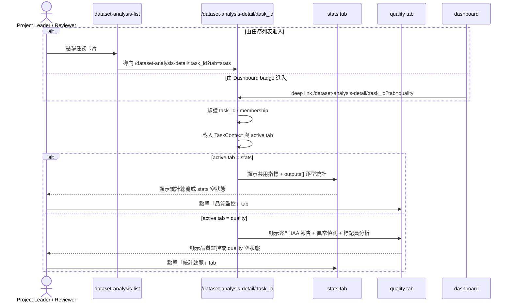
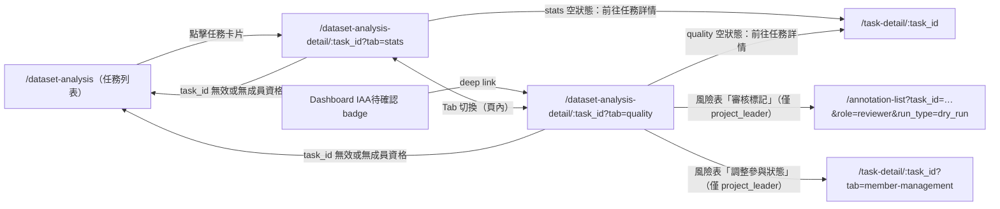

# 功能規格：Dataset Analysis Detail — 統計總覽 + 品質監控雙 Tab# 功能規格：Dataset Analysis Detail — 統計總覽 + 品質監控雙 Tab

**需求來源**: IA v1.3.2（2026-04-24）資料集分析模組規範（雙 Tab 架構）；task-management-013 `OUTPUT_TYPE_REGISTRY`（ADR-029 outputs[] 組合模型）；IAA 策略 v2（2026-08-12，8-key 輸出類型逐型指標）

## 已釐清事項

- 本版以既有需求來源與本文件中的 流程圖、使用者情境、功能需求、成功標準 作為 scope baseline。
- 跨頁或跨模組共用行為需透過「規格相依性」追蹤，不在本文件中隱含建立未列出的依賴。
- 若後續新增實作層契約，需先確認是否構成行為變更；若是，必須依 SDD 流程更新 spec。
- **v2.0.0 IAA 策略 v2**：本版將統計總覽與品質監控的分型邏輯自 legacy `task_type` 枚舉改為任務 `outputs[]`（`OUTPUT_TYPE_KEYS`，ADR-029 組合模型）逐型驅動；`sentence_pairs` 收斂進 `single_label` / `multi_label` / `single_dim` / `multi_dim`；新增逐型 IAA 主指標表、任務層級 `x/y` 達標徽章合成規則與小樣本估計警示。原 `sequence_labeling.analysis_profile = aspect` 專屬品質功能已依使用者裁決**泛化為型別無關項**而非退役：高分歧樣本分析泛化為「逐型一致性最低樣本清單」（7 型，`free_text` 除外）、Annotator Quality Ranking 泛化為「逐型標記員品質排名」（7 型，`free_text` 除外）、邊界錯誤分析泛化為「邊界分歧分析」（僅 `entity_recognition`、`sequence_tagging` 適用）；僅 Aspect Coverage 與 Aspect × Sentiment（皆為 aspect taxonomy 特定聚合，無法泛化為型別無關指標）確定退役，隨 `SEQUENCE_LABELING_SUBTYPES` 停用一併移除。

## 規格常數

以下共用常數一律引用 `specs/_shared/constants.md`，不得在本規格重複定義：

- `TASK_ROLES_ALLOWED`
- `DATASET_ANALYSIS_LIST_ROUTE`
- `DATASET_ANALYSIS_DETAIL_ROUTE`
- `INVALID_TASK_TRIGGER`
- `IAA_BADGE_STATES`（本規格以同值異名 `IAA_SUMMARY_STATES` 定義，見下方；兩者皆含 `not_applicable`，異名統一留待下次共用常數改版一併處理）
- `MOBILE_BP`
- `RWD_VIEWPORTS`
- `OUTPUT_TYPE_KEYS`（來源：`task-management-013` `OUTPUT_TYPE_REGISTRY`；`annotation-015` 亦引用同值）

本規格特有常數：

- `TAB_STATS = stats`
- `TAB_QUALITY = quality`
- `DEFAULT_TAB = stats`
- `ROUTE_PARAM = task_id`
- `SHARED_METRICS = sentence_count | token_count | completion_rate | submitted_sample_count | avg_annotation_time_per_sentence`
- `STATS_EMPTY_STATE_TRIGGER = no_submitted_annotations`
- `QUALITY_EMPTY_STATE_TRIGGER = dry_run_not_completed`
- `STATS_TAB_STATES = loading | empty | ready | error`
- `QUALITY_TAB_STATES = loading | dry_run_in_progress | report_pending | report_generating | ready | error`
- `IAA_SUMMARY_STATES = pass | fail | pending | not_started | not_applicable`（`not_applicable` 專供 `y = 0`〔任務 `outputs[]` 僅含被排除類型，如僅 `free_text`〕情境使用）
- `CONSISTENCY_DEVIATION_BLOCK = annotator_consistency_deviation_analysis`
- `CONSISTENCY_DEVIATION_STD_LEVELS = 1.5xSTD | 2xSTD`

- 標記員風險等級：
  - `ANNOTATOR_RISK_LEVELS = normal | watch | high_risk`
  - `ANNOTATOR_MIN_SAMPLE_THRESHOLD = 10`（低於此數不進行風險評估）
  - 風險判斷規則（OR 邏輯，任一成立即升級）：
    - `watch`：個別 IAA < 群體 IAA - 0.05 **或** 速度 < 群體平均 × 0.6
    - `high_risk`：個別 IAA < IAA 閾值 **或** outlier rate > 30% **或** 速度 < 群體平均 × 0.4
  - 閾值為預設值，可由 `project_leader` 在任務設定中覆寫
- 標記員異常原因分類（annotator-level，非 sample-level）：
  - `ANNOTATOR_CAUSE_TYPES = annotator_bias | marking_too_fast | marking_too_slow`
  - `annotator_bias`：Δ 值（個別平均 - 群體平均）絕對值超過 1σ 且具方向性（系統性偏高或偏低）
  - `marking_too_fast`：個別平均速度 < 群體平均 × 0.6
  - `marking_too_slow`：個別平均速度 > 群體平均 × 2.0
- 樣本層級旗標（sample-level，與標記員風險分開處理）：
  - `SAMPLE_FLAG_TYPES = high_divergence`
  - `high_divergence`：同一樣本中，任一標記員的標記值距群體中位數 > 2σ，且其他標記員一致性高（pairwise ICC > 0.75）
- 標記一致性偏離分析（annotator-level observation，非 decision layer）：
  - `CONSISTENCY_DEVIATION_BLOCK` 顯示每位標記員在可比較單位中的群體偏離次數與比例，用於輔助判讀一致性風險，不直接等同風險等級
  - 可比較單位需為同一資料單位具有足夠重疊標記次數後所形成的比較母體；`relation_identification` 可為「標記 5 次的三元組數」，其他輸出類型以對應資料單位名稱顯示
  - `1.5xSTD`：中度偏離觀測閾值；`2xSTD`：高度偏離觀測閾值
  - 本區塊為 annotator-level 聚合統計；不得以單一高分歧樣本直接取代整體偏離比例
- 建議行動操作權限：
  - `RISK_ACTION_ALLOWED_ROLE = project_leader`（reviewer 僅能查看，不能執行行動）
- `multi_dim` 任務的風險分數聚合規則：
  - `DIMENSION_RISK_AGGREGATION = max(risk_level across dimensions)`（取各維度中較高風險等級；泛化既有 `(IAA_V+IAA_A)/2` 模式至 N 維）
  - 原因分類：各維度分開標示，不合併為單一原因

### IAA 逐型指標表（`OUTPUT_TYPE_IAA_REGISTRY`，唯一權威來源；`task-management-014` 唯讀呈現需引用本表，不得另建第二份定義）

| Output Type | 主指標（gate 用） | 單位 | 門檻常數 | 附註 |
| --- | --- | --- | --- | --- |
| `single_label` | Krippendorff's Alpha（nominal）⭐️；輔助顯示 Cohen's Kappa（2 人）/ Fleiss' Kappa | item | `IAA_THRESHOLD_SINGLE_LABEL = 0.80` | |
| `multi_label` | 逐標籤 Alpha（nominal）→ 巨集平均 ⭐️ | label | `IAA_THRESHOLD_MULTI_LABEL = 0.80` | 正例出現次數 `< IAA_LABEL_MIN_POSITIVE` 的稀有標籤排除於巨集平均 |
| `single_dim` | ICC(2,1) two-way random absolute ⭐️；輔助顯示 Alpha（interval）/ Pearson / Spearman | item | `IAA_THRESHOLD_SINGLE_DIM_RECOMMENDED = 0.75`（建議，**gate 用**）/ `IAA_THRESHOLD_SINGLE_DIM_STRICT = 0.80`（嚴格，僅顯示） | |
| `multi_dim` | 逐維度 ICC(2,1) → 巨集平均 ⭐️ | dimension | `IAA_THRESHOLD_MULTI_DIM_RECOMMENDED = 0.75`（建議，僅顯示）/ `IAA_THRESHOLD_MULTI_DIM_STRICT = 0.80`（嚴格，**gate 用**） | 泛化 `single_dim` 之 N 維版本 |
| `entity_recognition` | Pairwise Span F1 strict（start + end + type 全同）⭐️；partial-overlap F1 僅供顯示，不入閘門 | span | `IAA_THRESHOLD_ENTITY_RECOGNITION_STRICT = 0.80`（`IAA_THRESHOLD_ENTITY_RECOGNITION_PARTIAL_DISPLAY = 0.70` 僅顯示） | 以任兩位標記員配對（`C(n,2)`）計算後取平均 |
| `relation_identification` | Pairwise Triple-level F1（subject + relation + object 全同）⭐️；輔助顯示 entity-level F1 | triple | `IAA_THRESHOLD_RELATION_IDENTIFICATION = 0.75`（`IAA_THRESHOLD_RELATION_IDENTIFICATION_HIGH_DISPLAY = 0.80` 為「高品質」顯示帶，非第二道閘門） | |
| `sequence_tagging` | Token-level Alpha（nominal）⭐️ | token | `IAA_THRESHOLD_TOKEN = 0.75` | 計算前必須遮罩全體標記員皆標為 `O` 的 token（或等價地僅納入非 `O` 位置），避免 `O` 佔多數造成指標虛高 |
| `free_text` | 不計自動 IAA | — | — | 排除於 `x/y` 分母；UI 顯示「不適用—由審核員評估」，不得顯示空白或 0 |

> `⭐️` 標示為該輸出類型的主要（gate）指標；其餘為輔助 / 顯示用指標，不影響達標判定。
> 雙門檻型別（`single_dim` / `multi_dim`）以「**gate 用**」標註者為達標判定與 registry `default_threshold`（`task-management-014` 唯讀呈現引用值）：`single_dim` 取建議階 `0.75`、`multi_dim` 取嚴格階 `0.80`（使用者定案：多維度巨集平均刻意取嚴格階）；另一階僅供顯示標示（FR-012H / FR-012I），不入閘門。
> `input_type = item_pair` 的任務沿用其 `outputs[]` 實際類型（`single_label` / `multi_label` / `single_dim` / `multi_dim`）計算 IAA；配對欄位顯示名稱另由 `item_pair_labels`（`task-management-013` v6.9.0）驅動，不影響 IAA 數學。

- `IAA_LABEL_MIN_POSITIVE = 5`（`multi_label` 巨集平均排除正例出現次數低於此值的稀有標籤）
- `IAA_GATE_EXCLUDED_TYPES = free_text`（IAA 達標分母排除集，registry/常數驅動，不得硬編任務類型判斷）
- `IAA_COMPOSITE_BADGE_FORMAT = "{x}/{y} 達標 · {N} 型排除"`（`N = 0` 時省略「· {N} 型排除」後綴）
- `IAA_COMPOSITE_GATE_RULE = pass ⟺ x == y AND y > 0`（全部達標，非多數決；`y = 1` 時仍以「1/1 達標」分數形式呈現，不分岔 UI）
- `IAA_PENDING_BADGE_FORMAT = "—/{y} 待完成 Dry Run"`（`y` 可由 `outputs[]` 靜態算出；尚無 Dry Run 資料時不得顯示 `0/{y}`）
- `IAA_SMALL_SAMPLE_THRESHOLD = 5`（完成標記員數 `n < 5` 時顯示「小樣本估計」中性警示徽章；不阻擋閘門，點估計照常顯示）

- 逐型一致性最低樣本清單（高分歧樣本分析泛化版）：
  - `LOW_CONSISTENCY_SAMPLE_SCOPE = single_label | multi_label | single_dim | multi_dim | entity_recognition | relation_identification | sequence_tagging`（7 型；`free_text` 無自動 IAA 指標，不提供本清單）
  - `LOW_CONSISTENCY_SAMPLE_LIST_SIZE = 20`（每型清單預設顯示筆數上限，超出以捲動查看）
  - `DISAGREEMENT_SAMPLE_SORT = disagreement_score_desc`（清單依樣本分歧度由高到低排序）
  - 逐型分歧度計算單位：
    - `single_label` / `multi_label`：逐樣本投票分裂度（`1 - 眾數票數佔比`；`multi_label` 取各標籤分裂度平均）
    - `single_dim` / `multi_dim`：逐樣本標記值離散度（樣本內各標記員給值的標準差；`multi_dim` 取各維度離散度平均）
    - `entity_recognition` / `relation_identification`：該樣本的 pairwise F1（沿用 `OUTPUT_TYPE_IAA_REGISTRY` 對應主指標定義，逐樣本計算而非整體平均）
    - `sequence_tagging`：該樣本非 `O` token 分歧率（樣本內非 `O` token 中標記不一致者所佔比例）
  - 本清單與 `annotation-015`（v3.0.0）dry_run 仲裁流程中的「divergent」分歧項為同源概念，可作為 reviewer 仲裁優先順序參考；本規格僅提供品質監控唯讀清單，不重複定義或修改仲裁規則，仲裁規則以 `annotation-015` 為準。
- 逐型標記員品質排名（Annotator Quality Ranking 泛化版）：
  - `ANNOTATOR_QUALITY_RANKING_SCOPE = single_label | multi_label | single_dim | multi_dim | entity_recognition | relation_identification | sequence_tagging`（7 型；`free_text` 不參與排名）
  - 逐型一致率計算方式：
    - `single_label` / `multi_label`：與多數決一致率（該標記員標記與樣本多數決結果相同之比例）
    - `single_dim` / `multi_dim`：與平均值的平均絕對偏差（MAD），依 MAD 由低到高排序（MAD 越低排名越前）
    - `entity_recognition` / `relation_identification`：與合併聚合參考值（多標記員標記聚合後的參考集合，非任務 ground truth）的 F1
    - `sequence_tagging`：與多數決 token 標記一致率
  - 排名沿用 `IAA_SMALL_SAMPLE_THRESHOLD` 小樣本警示規則：完成樣本數 `< IAA_SMALL_SAMPLE_THRESHOLD` 的標記員於排名中顯示小樣本估計警示，不因此被剔除排名。
- 邊界分歧分析（Boundary Error Analysis 泛化版；僅 `entity_recognition`、`sequence_tagging` 適用）：
  - `BOUNDARY_DISAGREEMENT_SCOPE = entity_recognition | sequence_tagging`
  - `BOUNDARY_ERROR_TYPES = span_too_long | span_too_short | wrong_boundary`（部分重疊但邊界不一致的分類）
  - 定義：任兩位標記員對同一片段有重疊（partial overlap）但起訖位置不完全一致，即計入 partial-overlap 計算但不計入 strict 計算的案例；`BOUNDARY_DISAGREEMENT_SCOPE` 以外的輸出類型不適用。

## 流程圖

```mermaid
sequenceDiagram
    actor PL as Project Leader / Reviewer
    participant LIST as dataset-analysis-list
    participant DETAIL as /dataset-analysis-detail/:task_id
    participant STATS as stats tab
    participant QUALITY as quality tab
    participant DASH as dashboard

    alt 由任務列表進入
        PL->>LIST: 點擊任務卡片
        LIST->>DETAIL: 導向 /dataset-analysis-detail/:task_id?tab=stats
    else 由 Dashboard badge 進入
        DASH->>DETAIL: deep link /dataset-analysis-detail/:task_id?tab=quality
    end
    DETAIL->>DETAIL: 驗證 task_id / membership
    DETAIL->>DETAIL: 載入 TaskContext 與 active tab
    alt active tab = stats
        DETAIL->>STATS: 顯示共用指標 + outputs[] 逐型統計
        STATS-->>PL: 顯示統計總覽或 stats 空狀態
        PL->>QUALITY: 點擊「品質監控」tab
    else active tab = quality
        DETAIL->>QUALITY: 顯示逐型 IAA 報告 + 異常偵測 + 標記員分析
        QUALITY-->>PL: 顯示品質監控或 quality 空狀態
        PL->>STATS: 點擊「統計總覽」tab
    end
```

| Step | Role | Action | System Response |
|------|------|--------|----------------|
| 1 | `project_leader` / `reviewer` | 由任務列表或 Dashboard badge 進入詳情頁 | 進入 `/dataset-analysis-detail/:task_id`，預設 `?tab=stats` 或依 deep link 進入 `?tab=quality` |
| 2 | 系統 | 驗證 `task_id` 與成員資格 | 合法則載入 TaskContext；否則導回 `/dataset-analysis` |
| 3 | 系統 | 載入 active tab 與對應資料 | 渲染共用 detail shell、Tab 列與對應 tab 內容 |
| 4 | 使用者 | 查看統計總覽或品質監控 | 顯示對應圖表、表格、空狀態或錯誤狀態 |
| 5 | 使用者 | 點擊另一個 Tab | 更新 `?tab=`，頁內切換且保留任務上下文 |

---

## 使用者情境與測試 *(必填)*

### 使用者故事 1 — 進入任務分析詳情頁並載入共用 Detail Shell（優先級：P1）

使用者由任務列表主要入口或 Dashboard badge 合法次入口進入任務分析詳情頁後，系統需先解析任務上下文並渲染共用 detail shell，包含麵包屑、任務基本資訊與雙 Tab 導覽。

**此優先級原因**：detail shell 是 stats 與 quality 兩個 tab 的共同容器；若上下文與 Tab shell 未建立，雙 Tab 架構無法成立。
**獨立測試方式**：從任務列表與 Dashboard badge 兩個入口進入，驗證同一 detail shell 能正確顯示且 active tab 正確。

**驗收情境**：

1. **Given** 使用者從 `dataset-analysis-list` 點擊任務卡片，**When** 進入詳情頁，**Then** 導向 `/dataset-analysis-detail/:task_id?tab=stats`，並渲染 detail shell 與統計總覽 active tab。
2. **Given** 使用者從 Dashboard「IAA 待確認」badge 進入，**When** 開啟詳情頁，**Then** 導向 `/dataset-analysis-detail/:task_id?tab=quality`，並渲染 detail shell 與品質監控 active tab。
3. **Given** `task_id` 無效或使用者無成員資格（`INVALID_TASK_TRIGGER`），**When** 嘗試進入詳情頁，**Then** 導回 `/dataset-analysis` 並顯示錯誤提示。
4. **Given** 使用者對該任務不存在 `TASK_ROLES_ALLOWED` membership，**When** 嘗試進入詳情頁，**Then** 視為 `INVALID_TASK_TRIGGER`，導回 `/dataset-analysis` 並顯示錯誤提示。

**介面定義（需與 IA 導覽語意一致）**：

- 區塊 A：`Detail Header`
  - 必要元素：麵包屑返回任務列表、麵包屑第二段顯示當前任務名稱、頁首標題固定為 `任務詳情`、頁首副標題
- 區塊 B：`Tab Shell`
  - 必要元素：統計總覽 tab、品質監控 tab、active 狀態、頁內切換行為
- 區塊 C：`錯誤狀態`
  - 必要元素：導回提示文案（無效 task_id / 無成員資格）

**行為規則**：

- detail shell 為 stats / quality 共用，不因 tab 切換而重建任務上下文。
- `?tab=` 僅控制 active tab，不可覆寫 `outputs[]` 或 `task_id`。
- 未帶 `?tab=` 時一律落在 `DEFAULT_TAB`。
- 麵包屑格式固定為 `資料集分析 › {task_name}`，並置於頁首標題區塊下方；語系切換時第二段需同步顯示當前語系的任務名稱。
- 頁首 `h1` 固定顯示 `任務詳情`（en：`Task detail`），不得以任務名稱取代。
- 頁首副標題固定顯示資料集分析 detail 的頁面用途說明（zh：`檢視統計總覽與品質監控`；en：`Review statistics and quality monitoring`），語系切換時需同步更新。
- 頁首 `h1` 與副標題位置需維持 shared Dashboard heading baseline；breadcrumb 不得置於 `h1` 前方造成頁首下移。

---

### 使用者故事 2 — 查看統計總覽與輸出類型特定指標（優先級：P1）

使用者在統計總覽 tab 可查看當前任務的共用指標，以及依任務 `outputs[]` 動態渲染的各輸出類型特定統計區塊；複合任務（`outputs[]` 含多個輸出類型）需依原順序逐型並列顯示，不得壓縮為單一固定類型。

**此優先級原因**：IA 已將統計總覽定義為 detail page 的預設 tab；若缺少此內容，017 無法完整承接 analysis-detail 頁責任。
**獨立測試方式**：以不同 `outputs[]` 組合（單一與複合）的任務進入 `?tab=stats`，驗證共用指標、各輸出類型區塊與空狀態皆正確。

**驗收情境**：

1. **Given** 任務 `outputs[]` 含 `single_label`，**When** 進入統計總覽 tab，**Then** 顯示 `SHARED_METRICS` 與該輸出類型的標籤次數 / 比例長條圖。
2. **Given** 任務 `outputs[]` 含 `multi_label`，**When** 進入統計總覽 tab，**Then** 顯示標籤次數 / 比例長條圖與多標籤共現矩陣。
3. **Given** 任務 `outputs[]` 含 `single_dim`，**When** 進入統計總覽 tab，**Then** 顯示該維度分佈直方圖與平均值 / 標準差 / 中位數統計摘要。
4. **Given** 任務 `outputs[]` 含 `multi_dim`，**When** 進入統計總覽 tab，**Then** 依維度數量顯示逐維度分佈直方圖與統計摘要，並提供維度間分佈視覺化（2 維為 scatter plot，3 維以上為逐對散佈或平行座標）。
5. **Given** 任務 `outputs[]` 含 `entity_recognition`，**When** 進入統計總覽 tab，**Then** 顯示實體類型分佈、每句平均實體數、Entity span 長度分佈。
6. **Given** 任務 `outputs[]` 含 `relation_identification`，**When** 進入統計總覽 tab，**Then** 顯示關係類型分佈與 Triple 數量統計；若同任務 `outputs[]` 亦含 `entity_recognition`，實體類型分佈僅顯示於 `entity_recognition` 區塊，不重複呈現。
7. **Given** 任務 `outputs[]` 含 `sequence_tagging`，**When** 進入統計總覽 tab，**Then** 顯示標記類型（tag）分佈、每句平均標記片段數、標記片段長度分佈。
8. **Given** 任務 `outputs[]` 含 `free_text`，**When** 進入統計總覽 tab，**Then** 顯示已提交回答數與平均回答字數，不提供標籤 / 分數類圖表。
9. **Given** 任務 `outputs[]` 含多個輸出類型，**When** 進入統計總覽 tab，**Then** 依 `outputs[]` 原順序逐型並列顯示各自的特定統計區塊。
10. **Given** 尚無已提交標記資料（`STATS_EMPTY_STATE_TRIGGER`），**When** 進入統計總覽 tab，**Then** 顯示「尚無標記資料，請先發布 Dry Run」與「前往任務詳情」次要按鈕。

**介面定義（需與 IA 導覽語意一致）**：

- 區塊 A：`共用指標區`
  - 必要元素：Sentence 數量（分析母體）、Token 數量（空格分詞）、完成率（已完成 / 全部）、已提交樣本（至少 1 位已提交）、平均標記時間（每句平均用時）
- 區塊 B：`輸出類型特定指標區`（依 `outputs[]` 原順序逐型並列，一個輸出類型一個子區塊卡片）
  - `single_label`：各標籤次數 / 比例長條圖
  - `multi_label`：各標籤次數 / 比例長條圖、多標籤共現矩陣
  - `single_dim`：該維度分佈直方圖、統計摘要列
  - `multi_dim`：逐維度分佈直方圖、逐維度統計摘要、維度間分佈視覺化
  - `entity_recognition`：實體類型分佈、每句平均實體數、Entity span 長度分佈
  - `relation_identification`：關係類型分佈、Triple 數量統計
  - `sequence_tagging`：標記類型（tag）分佈、每句平均標記片段數、標記片段長度分佈
  - `free_text`：已提交回答數、平均回答字數
- 區塊 C：`Stats 空狀態`
  - 必要元素：說明文字、「前往任務詳情」次要按鈕（→ `task-detail`）

**行為規則**：

- `outputs[]` 由任務資料載入，不由路由 query 決定。
- 複合任務依 `outputs[]` 原順序逐型並列渲染子區塊卡片；不得只顯示第一個輸出類型或以固定優先序覆蓋原始順序。
- 空狀態下仍保留 detail shell 與 Tab 列；`SHARED_METRICS` 可顯示既有值，特定圖表以空狀態取代。
- 語言切換需同步更新圖表標題、軸標籤、圖例與說明文字。
- `input_type = item_pair` 的任務欄位顯示名稱沿用任務設定的 `item_pair_labels`（來源 `task-management-013` v6.9.0），不得另建 stats 專屬分支邏輯。

**`entity_recognition` 分析規則**：

- 統計目標：以 entity span 為主要分析單位。
- `實體類型分佈`：依 task config 的 entity 類型清單聚合，不得混入非 entity metadata。
- `每句平均實體數`：以句子中標記 entity span 數量計算平均值，可附帶 0、1、2、3+ bucket 分佈。
- `Entity span 長度分佈`：以 token 長度為主、字元長度為輔；至少輸出 1、2、3、4+ token buckets。

**`sequence_tagging` 分析規則**：

- 統計母體：以任務 `tokenization` 設定（`character` / `word`，來源 `task-management-013` v6.3.0）切分後的 token 序列為準。
- `標記類型（tag）分佈`：依任務 `scheme`（`BIO / BIOES / IOB2 / SINGLE`）解析後的 tag 類型聚合。
- `每句平均標記片段數`：將連續同類型 tag 還原為片段（span）後計算平均值。
- `標記片段長度分佈`：以 token 長度計算，至少輸出 1、2、3、4+ token buckets。

---

### 使用者故事 3 — 查看 IAA 報告與品質監控內容（優先級：P1）

使用者在品質監控 tab 可查看 Dry Run 完成後依任務 `outputs[]` 逐型計算的 IAA 主要指標、與門檻的比較結果，以及異常偵測、標記一致性偏離分析與標記員個別分析；複合任務需逐型並列顯示 IAA 報告，並提供任務層級 `x/y` 達標徽章。

**此優先級原因**：品質監控是 detail page 的第二個核心 tab，負責 Dry Run 後的品質決策。
**獨立測試方式**：以不同 `outputs[]` 組合進入 `?tab=quality`，驗證逐型 IAA 指標、`x/y` 徽章、異常偵測、標記一致性偏離分析與標記員分析皆正確。

**驗收情境**：

1. **Given** `outputs[]` 含 `single_label`，**When** 進入品質監控，**Then** 顯示 Krippendorff's Alpha（nominal）⭐️ 為主要指標，輔助指標區（Cohen's Kappa / Fleiss' Kappa）可展開顯示，並標示 `IAA_THRESHOLD_SINGLE_LABEL`。
2. **Given** `outputs[]` 含 `multi_label`，**When** 進入品質監控，**Then** 顯示逐標籤 Alpha → 巨集平均 ⭐️ 為主要指標，正例出現次數 `< IAA_LABEL_MIN_POSITIVE` 的標籤排除於巨集平均並標示排除清單，並標示 `IAA_THRESHOLD_MULTI_LABEL`。
3. **Given** `outputs[]` 含 `single_dim`，**When** 進入品質監控，**Then** 顯示 ICC ⭐️ 為主要指標，並標示 `IAA_THRESHOLD_SINGLE_DIM_RECOMMENDED` 與 `IAA_THRESHOLD_SINGLE_DIM_STRICT`。
4. **Given** `outputs[]` 含 `multi_dim`，**When** 進入品質監控，**Then** 顯示逐維度 ICC → 巨集平均 ⭐️ 為主要指標，並標示 `IAA_THRESHOLD_MULTI_DIM_RECOMMENDED` 與 `IAA_THRESHOLD_MULTI_DIM_STRICT`。
5. **Given** `outputs[]` 含 `entity_recognition`，**When** 進入品質監控，**Then** 顯示 Pairwise Span F1 strict ⭐️ 為主要指標，partial-overlap F1 僅供顯示切換且不影響達標判定，並標示 `IAA_THRESHOLD_ENTITY_RECOGNITION_STRICT`。
6. **Given** `outputs[]` 含 `relation_identification`，**When** 進入品質監控，**Then** 顯示 Pairwise Triple-level F1 ⭐️ 為主要指標，entity-level F1 以輔助指標顯示，並標示 `IAA_THRESHOLD_RELATION_IDENTIFICATION`（`IAA_THRESHOLD_RELATION_IDENTIFICATION_HIGH_DISPLAY` 僅為「高品質」顯示帶）。
7. **Given** `outputs[]` 含 `sequence_tagging`，**When** 進入品質監控，**Then** 顯示 Token-level Alpha ⭐️ 為主要指標，計算前遮罩全體標記員皆標為 `O` 的 token，並標示 `IAA_THRESHOLD_TOKEN`。
8. **Given** `outputs[]` 含 `free_text`，**When** 進入品質監控，**Then** 該輸出類型子區塊顯示「不適用—由審核員評估」狀態，不計入自動 IAA，且不得顯示空白或 0。
9. **Given** `outputs[]` 含多個輸出類型，**When** 進入品質監控，**Then** 依原順序逐型並列顯示各自 IAA 報告，並顯示任務層級 `x/y` 達標徽章（依 `IAA_COMPOSITE_BADGE_FORMAT`）。
10. **Given** 任務 `outputs[]` 僅含 `free_text`（`y = 0`），**When** 進入品質監控，**Then** 任務層級摘要狀態為 `IAA_SUMMARY_STATES = not_applicable`，不顯示任何 pass / fail 判定。
11. **Given** 完成標記員數 `n < IAA_SMALL_SAMPLE_THRESHOLD`，**When** 檢視任一輸出類型的 IAA 指標，**Then** 指標旁顯示中性「小樣本估計」警示徽章，不阻擋閘門且點估計照常顯示。
12. **Given** Dry Run 尚未完成（`QUALITY_EMPTY_STATE_TRIGGER`），**When** 進入品質監控，**Then** 顯示「IAA 報告將在 Dry Run 完成後產生」與「前往任務詳情」次要按鈕；若可由 `outputs[]` 靜態算出 `y`，另以 `IAA_PENDING_BADGE_FORMAT` 顯示待完成徽章。
13. **Given** `outputs[]` 含 `LOW_CONSISTENCY_SAMPLE_SCOPE` 中任一型別（`single_label` / `multi_label` / `single_dim` / `multi_dim` / `entity_recognition` / `relation_identification` / `sequence_tagging`），**When** 進入品質監控，**Then** 該型別子區塊顯示「一致性最低樣本清單」，依 `DISAGREEMENT_SAMPLE_SORT` 由高到低排序，並依型別使用對應分歧度計算單位；`outputs[]` 含 `free_text` 時，該型別不顯示此清單。
14. **Given** `outputs[]` 含 `ANNOTATOR_QUALITY_RANKING_SCOPE` 中任一型別，**When** 進入品質監控，**Then** 該型別子區塊顯示「標記員品質排名」，依型別對應一致率計算方式排序，且完成樣本數 `< IAA_SMALL_SAMPLE_THRESHOLD` 的標記員顯示小樣本估計警示但不被剔除；`outputs[]` 含 `free_text` 時，該型別不參與排名。
15. **Given** `outputs[]` 含 `entity_recognition` 或 `sequence_tagging`，**When** 進入品質監控，**Then** 該型別子區塊顯示「邊界分歧分析」，統計部分重疊但邊界不一致的案例數與範例；其他輸出類型不顯示邊界分歧分析區塊。

**介面定義（需與 IA 導覽語意一致）**：

- 區塊 A：`IAA 報告區`（依 `outputs[]` 原順序逐型並列）
  - 每個輸出類型子區塊必要元素：主要 IAA 指標名稱、IAA 數值、閾值比較、計算方法說明
  - 選用元素：輔助 / 顯示用指標（可展開 / 收合）
  - `free_text` 子區塊改顯示「不適用—由審核員評估」狀態卡，不顯示指標數值
- 區塊 A-1：`任務層級 x/y 達標徽章`（依 `IAA_COMPOSITE_BADGE_FORMAT` 與 `IAA_COMPOSITE_GATE_RULE`）
- 區塊 A-2：`逐型一致性最低樣本清單`（`LOW_CONSISTENCY_SAMPLE_SCOPE` 7 型各自子區塊；`free_text` 不顯示）
  - 必要元素：清單標題（含型別名稱）、依 `DISAGREEMENT_SAMPLE_SORT` 排序的樣本列（樣本識別、分歧度數值、文本摘要）、與 `annotation-015` dry_run 仲裁「divergent」同源概念的說明文字
- 區塊 A-3：`逐型標記員品質排名`（`ANNOTATOR_QUALITY_RANKING_SCOPE` 7 型各自子區塊；`free_text` 不顯示）
  - 必要元素：排名表（標記員、一致率數值、名次）、小樣本估計警示標示
- 區塊 A-4：`邊界分歧分析`（僅 `entity_recognition`、`sequence_tagging` 顯示）
  - 必要元素：`BOUNDARY_ERROR_TYPES` 分類案例計數、案例範例列表
- 區塊 B：`共用品質監控功能區`
  - 必要元素依顯示順序為：異常偵測（速度異常 / 離群值）、標記員風險評估（個別速度 / 個別 IAA vs 群體平均）、`標記一致性偏離分析`（可比較單位數、`離群值(1.5xSTD)筆數`、`離群值(1.5xSTD)比例`、`離群值(2xSTD)筆數`、`離群值(2xSTD)比例`）
- 區塊 C：`Quality 空狀態`
  - 必要元素：說明文字、「前往任務詳情」次要按鈕（→ `task-detail`）

**行為規則**：

- 主要 IAA 指標固定顯示；輔助 / 顯示用指標預設收合。
- IAA 數值需有明確的達標（綠色 / pass）與未達標（紅色 / fail）視覺標示；`free_text` 子區塊不適用此視覺規則，改用中性樣式呈現「不適用」狀態。
- 指標區與分析區皆為唯讀，不提供編輯操作。
- 每個輸出類型子區塊在 ready state 下需固定依序呈現：主要／輔助 IAA 指標 → 一致性最低樣本清單（`LOW_CONSISTENCY_SAMPLE_SCOPE` 範圍內）→ 標記員品質排名（`ANNOTATOR_QUALITY_RANKING_SCOPE` 範圍內）→ 邊界分歧分析（`BOUNDARY_DISAGREEMENT_SCOPE` 範圍內）；`free_text` 子區塊僅顯示「不適用」狀態卡。
- 共用品質監控區塊在 ready state 下需固定依序呈現：異常偵測 → 標記員風險評估 → `標記一致性偏離分析`。
- `標記一致性偏離分析` 為觀測型區塊，不可直接覆寫 `AnnotatorRiskAssessment.risk_level`；若需影響風險等級，必須另行明確定義規則。
- 「一致性最低樣本清單」為唯讀觀測清單，不可直接觸發或修改 `annotation-015` 的 dry_run 仲裁狀態；僅供 reviewer 判讀優先順序參考。
- 「標記員品質排名」與「標記一致性偏離分析」為互補但不同的觀測面向：前者為與共識/gold 的一致率排名，後者為標準差偏離統計；兩者不得互相覆寫或合併顯示為單一分數。
- quality tab 需同時輸出可供列表頁使用的 `IAA_SUMMARY_STATES` 摘要狀態，且該狀態必須依 `IAA_COMPOSITE_GATE_RULE` 由逐型結果推導，不得由單一輸出類型結果直接代表整體。
- 完成標記員數 `n < IAA_SMALL_SAMPLE_THRESHOLD` 時顯示小樣本估計警示徽章，且不影響達標判定與點估計顯示。

**`entity_recognition` 品質規則**：

- `Pairwise Span F1 strict` 為主要指標：以 entity boundary（start + end）與 type 完全一致計算。
- `Partial-overlap F1` 僅供顯示切換：允許 span overlap 但仍需 type 相容；不影響 `x/y` 達標判定。
- 以任兩位標記員配對（`C(n,2)`）計算後取平均。
- 「一致性最低樣本清單」以該樣本 pairwise F1 為分歧度；「標記員品質排名」以與合併聚合參考值的 F1 排序；「邊界分歧分析」統計 partial-overlap 但非 strict 一致的案例。

**`sequence_tagging` 品質規則**：

- `Token-level Alpha`（nominal）為主要指標。
- O-tag 遮罩規則：計算前必須先遮罩全體標記員皆標為 `O` 的 token（或等價地僅納入至少一位標記員標為非 `O` 的 token 位置）；不得將全員一致的 `O` token 直接計入分子分母，避免 `O` 佔多數造成指標虛高。
- 「一致性最低樣本清單」以該樣本非 `O` token 分歧率為分歧度；「標記員品質排名」以與多數決 token 標記一致率排序；「邊界分歧分析」統計 span 邊界部分重疊但不完全一致的案例。

---

### 使用者故事 4 — 在同一 Detail 頁中切換雙 Tab（優先級：P1）

使用者可在同一個 detail page 中於統計總覽與品質監控之間切換，並保留任務上下文與各自的捲動位置。

**此優先級原因**：analysis-detail 的核心價值是同任務上下文下的雙 Tab 對照；若 tab 切換不穩定，整頁資訊架構即失效。
**獨立測試方式**：從 stats 與 quality 互切，驗證 URL、active tab、任務上下文與捲動位置皆正確。

**驗收情境**：

1. **Given** 使用者位於 `/dataset-analysis-detail/:task_id?tab=stats`，**When** 點擊「品質監控」tab，**Then** 更新 `?tab=quality`，頁內切換且任務上下文不變。
2. **Given** 使用者位於 `/dataset-analysis-detail/:task_id?tab=quality`，**When** 點擊「統計總覽」tab，**Then** 更新 `?tab=stats`，頁內切換且任務上下文不變。
3. **Given** 使用者已於任一 tab 捲動內容，**When** 切換到另一 tab 再切回，**Then** 各 tab 捲動位置彼此獨立且不被重置。

**行為規則**：

- Tab 切換屬頁內切換，不可重新導向到任務列表。
- active tab 以 `?tab=` 反映，供 deep link 與重新整理後恢復狀態。

---

### 邊界情況

- `/dataset-analysis-detail/:task_id` 的 `task_id` 不存在或無成員資格時，導回 `/dataset-analysis` 並顯示錯誤提示。
- 任務 `outputs[]` 無法從 API 取得、為空、缺少或含 registry 未知 key 時，stats 與 quality 皆顯示可重試的錯誤狀態，不得靜默回退為預設輸出類型或猜測組合。
- 任務 `outputs[]` 僅含 `free_text`（`y = 0`）時，quality tab 的任務層級摘要狀態為 `IAA_SUMMARY_STATES = not_applicable`，不得顯示 pass / fail / pending。
- 完成標記員數 `n < IAA_SMALL_SAMPLE_THRESHOLD` 時顯示小樣本估計警示徽章，不阻擋任何既有判定或操作。
- 統計總覽 state 必須明確區分 `loading | empty | ready | error`；其中 `empty` 對應 `STATS_EMPTY_STATE_TRIGGER`。
- 品質監控 state 必須明確區分 `loading | dry_run_in_progress | report_pending | report_generating | ready | error`；其中 `dry_run_in_progress | report_pending | report_generating` 皆屬 `QUALITY_EMPTY_STATE_TRIGGER` 的空狀態集合。
- 語言切換後，stats 圖表與 quality 指標名稱、圖例、說明文字需同步更新。
- 手機版（`<= MOBILE_BP`）scatter plot、co-occurrence matrix、IAA 表格、標記一致性偏離分析表格與標記員分析表格需支援橫向捲動。
- Tab 切換時，各 tab 的捲動位置相互獨立，切換後不重置捲動位置。

## 需求規格 *(必填)*

### 功能需求

> 本版（v2.0.0）淘汰 FR-009A–E（含全部子項）、FR-012A–E（含全部子項）、FR-023、FR-023A、FR-031、FR-032、FR-033；新增 FR-009F–M、FR-012F–M、FR-024A–C、FR-034。已淘汰編號不再重複使用，詳見 Changelog。

- **FR-001**: 系統必須提供 `DATASET_ANALYSIS_DETAIL_ROUTE`（`/dataset-analysis-detail/:task_id`）作為資料集分析模組的 detail 頁，承載 `TAB_STATS` 與 `TAB_QUALITY`。
- **FR-002**: detail 頁必須先驗證 `task_id` 與成員資格；當 `INVALID_TASK_TRIGGER` 觸發時，導回 `/dataset-analysis` 並顯示錯誤提示。
- **FR-003**: detail 頁權限判斷必須僅以該 `task_id` 的 task membership role 為準；僅 `TASK_ROLES_ALLOWED` membership 可進入 detail 頁。
- **FR-004**: 系統必須由任務 API 載入 `TaskContext`，至少包含 `task_id`、`task_name`、`outputs[]`（每筆為 `{ type ∈ OUTPUT_TYPE_KEYS, config }`，來源 `task-management-013` `OUTPUT_TYPE_REGISTRY`），不依賴路由 query。
- **FR-005**: detail 頁必須提供共用 detail shell，至少包含麵包屑、任務基本資訊與 Tab 列。
- **FR-006**: Tab 列必須提供「統計總覽」與「品質監控」兩個入口；切換為頁內切換，active tab 以 `?tab=` query 標示。
- **FR-007**: 未帶 `?tab=` 時，系統必須以 `DEFAULT_TAB`（`stats`）作為預設 active tab。
- **FR-008**: 統計總覽 tab 必須固定顯示 `SHARED_METRICS`（Sentence 數量、Token 數量、完成率、已提交樣本、平均標記時間）。
- **FR-008A**: stats tab 必須實作正式狀態列舉 `STATS_TAB_STATES`，並以互斥狀態驅動 loading、empty、ready、error 顯示。
- **FR-009**: 系統必須依任務資料中的 `outputs[]` 動態渲染 stats tab 對應各輸出類型特定統計指標區塊，涵蓋 `OUTPUT_TYPE_KEYS` 所有值；複合任務需依 `outputs[]` 原順序逐型並列顯示，不得壓縮為單一固定類型。
- **FR-009F**: `single_label` 必須顯示各標籤次數 / 比例長條圖。
- **FR-009G**: `multi_label` 必須顯示各標籤次數 / 比例長條圖與多標籤共現矩陣。
- **FR-009H**: `single_dim` 必須顯示該維度分佈直方圖與統計摘要（平均值 / 標準差 / 中位數）。
- **FR-009I**: `multi_dim` 必須依維度數量顯示逐維度分佈直方圖、逐維度統計摘要，以及維度間分佈視覺化（2 維為 scatter plot，3 維以上為逐對散佈或平行座標）。
- **FR-009J**: `entity_recognition` 必須顯示實體類型分佈、每句平均實體數與 Entity span 長度分佈。
- **FR-009K**: `relation_identification` 必須顯示關係類型分佈與 Triple 數量統計；若同任務 `outputs[]` 亦含 `entity_recognition`，實體類型分佈不得於本區塊重複顯示。
- **FR-009L**: `sequence_tagging` 必須依任務 `tokenization` 設定（來源 `task-management-013`）顯示標記類型（tag）分佈、每句平均標記片段數與標記片段長度分佈。
- **FR-009M**: `free_text` 必須顯示已提交回答數與平均回答字數，不得提供標籤 / 分數類圖表。
- **FR-010**: 當 `STATS_EMPTY_STATE_TRIGGER` 觸發時，stats tab 必須顯示「尚無標記資料，請先發布 Dry Run」與「前往任務詳情」次要按鈕。
- **FR-011**: 品質監控為 detail 頁的 `TAB_QUALITY`（`?tab=quality`）tab，必須由 stats tab 切換或 Dashboard badge deep link 進入。
- **FR-012**: 系統必須依任務 `outputs[]` 顯示對應各輸出類型的主要 IAA 指標，涵蓋 `OUTPUT_TYPE_KEYS` 所有值並依 `OUTPUT_TYPE_IAA_REGISTRY` 定義計算方式與門檻；複合任務需依原順序逐型並列顯示。
- **FR-012F**: `single_label` 必須顯示 Krippendorff's Alpha（nominal）為主要指標並標示 `IAA_THRESHOLD_SINGLE_LABEL`；輔助指標（Cohen's Kappa / Fleiss' Kappa）以可展開區塊顯示。
- **FR-012G**: `multi_label` 必須顯示逐標籤 Alpha → 巨集平均為主要指標並標示 `IAA_THRESHOLD_MULTI_LABEL`；正例出現次數 `< IAA_LABEL_MIN_POSITIVE` 的標籤必須排除於巨集平均並標示排除清單。
- **FR-012H**: `single_dim` 必須顯示 ICC(2,1) 為主要指標並標示 `IAA_THRESHOLD_SINGLE_DIM_RECOMMENDED` 與 `IAA_THRESHOLD_SINGLE_DIM_STRICT`；輔助指標（Alpha interval / Pearson / Spearman）以可展開區塊顯示。
- **FR-012I**: `multi_dim` 必須顯示逐維度 ICC(2,1) → 巨集平均為主要指標並標示 `IAA_THRESHOLD_MULTI_DIM_RECOMMENDED` 與 `IAA_THRESHOLD_MULTI_DIM_STRICT`。
- **FR-012J**: `entity_recognition` 必須顯示 Pairwise Span F1 strict 為主要指標並標示 `IAA_THRESHOLD_ENTITY_RECOGNITION_STRICT`；partial-overlap F1（`IAA_THRESHOLD_ENTITY_RECOGNITION_PARTIAL_DISPLAY`）僅供顯示切換，不得作為第二道達標判定。
- **FR-012K**: `relation_identification` 必須顯示 Pairwise Triple-level F1 為主要指標並標示 `IAA_THRESHOLD_RELATION_IDENTIFICATION`；entity-level F1 以輔助指標顯示；`IAA_THRESHOLD_RELATION_IDENTIFICATION_HIGH_DISPLAY` 僅為「高品質」顯示帶，不得作為第二道達標判定。
- **FR-012L**: `sequence_tagging` 必須顯示 Token-level Alpha（nominal）為主要指標並標示 `IAA_THRESHOLD_TOKEN`；計算前必須先遮罩全體標記員皆標為 `O` 的 token（或等價僅納入非 `O` 位置），不得將全員一致的 `O` token 計入分子分母。
- **FR-012M**: `free_text` 不得計算自動 IAA；quality tab 必須顯示「不適用—由審核員評估」狀態，並排除於 `IAA_GATE_EXCLUDED_TYPES` 對應的 `x/y` 分母，不得顯示空白或 0。
- **FR-013**: 系統必須以明確視覺（達標綠色 / 未達標紅色）標示各輸出類型 IAA 數值與門檻比較結果；`free_text` 子區塊改用中性樣式顯示「不適用」狀態，不套用達標 / 未達標判定色彩。
- **FR-014**: 系統必須提供異常偵測功能，至少涵蓋：標記速度異常（過快 / 過慢）與離群標記值（outliers）。
- **FR-015**: 系統必須提供 `CONSISTENCY_DEVIATION_BLOCK`「標記一致性偏離分析」獨立區塊，顯示每位標記員在可比較單位中的偏離統計。
- **FR-015A**: `標記一致性偏離分析` 至少必須顯示 5 個獨立欄位：可比較單位數、`離群值(1.5xSTD)筆數`、`離群值(1.5xSTD)比例`、`離群值(2xSTD)筆數`、`離群值(2xSTD)比例`。
- **FR-015B**: `標記一致性偏離分析` 的欄位標題需依任務 `outputs[]` 中的輸出類型使用對應資料單位名稱；`relation_identification` 可顯示「標記 5 次的三元組數」，其他輸出類型不得硬編碼為三元組。
- **FR-015C**: `標記一致性偏離分析` 為 annotator-level 聚合觀測，不得以單一 `SampleDivergenceFlag` 直接取代該標記員的整體偏離統計。
- **FR-016**: 系統必須提供標記員個別分析，至少涵蓋：個別速度與個別 IAA vs 群體平均對照。
- **FR-017**: 當 `QUALITY_EMPTY_STATE_TRIGGER` 觸發時，quality tab 必須顯示「IAA 報告將在 Dry Run 完成後產生」與「前往任務詳情」次要按鈕。
- **FR-018**: 系統必須支援 Dashboard「IAA 待確認」badge deep link（`/dataset-analysis-detail/:task_id?tab=quality`）直接進入品質監控 tab 並正確載入任務上下文。
- **FR-019**: 語言切換必須即時更新 stats 圖表與 quality 指標的全頁文案，不觸發頁面重新載入。
- **FR-020**: 手機版（`<= MOBILE_BP`）必須維持 stats 圖表、IAA 報告、標記一致性偏離分析表格與標記員分析表格可讀性；較寬內容需支援橫向捲動。
- **FR-021**: Tab 切換時，各 tab 的捲動位置必須相互獨立且不重置。
- **FR-022**: quality tab 必須實作正式狀態列舉 `QUALITY_TAB_STATES`，並以互斥狀態驅動 loading、空狀態、ready、error 顯示。
- **FR-024**: quality tab 必須輸出 `IAA_SUMMARY_STATES`（`pass | fail | pending | not_started | not_applicable`）作為列表頁 `IAA 狀態徽章` 的唯一摘要來源，並依 `IAA_COMPOSITE_GATE_RULE` 由逐型結果推導。
- **FR-024A**: 系統必須依 `IAA_COMPOSITE_BADGE_FORMAT` 顯示任務層級 `x/y` 達標徽章；`x` 為主指標達標的輸出類型數，`y` 為 `outputs[]` 中不在 `IAA_GATE_EXCLUDED_TYPES` 排除集的相異輸出類型數。
- **FR-024B**: 當 `y = 0`（任務 `outputs[]` 僅含被排除類型，如僅 `free_text`）時，`IAA_SUMMARY_STATES` 必須為 `not_applicable`，不得顯示 `pass | fail | pending`。
- **FR-024C**: 尚無 Dry Run 資料但 `y` 可由 `outputs[]` 靜態算出時，quality tab 必須以 `IAA_PENDING_BADGE_FORMAT`（`—/{y} 待完成 Dry Run`）顯示，不得顯示 `0/{y}`。
- **FR-025**: 系統必須依 `ANNOTATOR_RISK_LEVELS` 規則為每位標記員計算並顯示風險等級（`normal | watch | high_risk`）。
- **FR-026**: 當標記員已完成樣本數低於 `ANNOTATOR_MIN_SAMPLE_THRESHOLD` 時，系統必須顯示「資料不足，暫不評估」並略過風險等級計算；不可顯示預設 normal 等級。
- **FR-027**: 系統必須依 `ANNOTATOR_CAUSE_TYPES` 為 `watch` 或 `high_risk` 標記員標示一個或多個異常原因；原因分類限定於 annotator-level（`annotator_bias | marking_too_fast | marking_too_slow`），不得以「資料模糊」等 sample-level 屬性作為標記員異常原因。
- **FR-028**: 系統必須將 `SAMPLE_FLAG_TYPES = high_divergence` 的樣本獨立以樣本層級旗標顯示，與標記員風險等級區塊分開呈現；高分歧樣本不應拉高對應標記員的風險等級。
- **FR-029**: 建議行動（審核標記 / 調整參與狀態）只能由 `RISK_ACTION_ALLOWED_ROLE`（`project_leader`）執行；`reviewer` 僅能查看風險等級與原因，不得觸發行動。
- **FR-030**: `multi_dim` 任務的標記員風險等級必須以 `DIMENSION_RISK_AGGREGATION` 規則（取各維度中較高等級）決定；各維度的原因分類需分開標示，不合併顯示。
- **FR-034**: 當任一輸出類型完成標記員數 `n < IAA_SMALL_SAMPLE_THRESHOLD` 時，quality tab 必須在該指標旁顯示中性「小樣本估計」警示徽章；此徽章不得阻擋 `IAA_COMPOSITE_GATE_RULE` 判定，且點估計仍須正常顯示。
- **FR-035**: 系統必須為 `LOW_CONSISTENCY_SAMPLE_SCOPE`（`single_label` / `multi_label` / `single_dim` / `multi_dim` / `entity_recognition` / `relation_identification` / `sequence_tagging` 共 7 型；`free_text` 除外）逐型提供「一致性最低樣本清單」，依 `DISAGREEMENT_SAMPLE_SORT` 由高到低排序，且分歧度計算單位須依輸出類型分別採用投票分裂度（`single_label`/`multi_label`）、標記值離散度（`single_dim`/`multi_dim`）、逐樣本 pairwise F1（`entity_recognition`/`relation_identification`）或非 `O` token 分歧率（`sequence_tagging`）。
- **FR-035A**: 「一致性最低樣本清單」必須標註其與 `annotation-015`（v3.0.0）dry_run 仲裁流程中的「divergent」分歧項為同源概念，可作為 reviewer 仲裁優先順序參考；本規格不得重複定義或修改 `annotation-015` 的仲裁規則，仲裁行為以 `annotation-015` 為準。
- **FR-036**: 系統必須為 `ANNOTATOR_QUALITY_RANKING_SCOPE`（同 7 型；`free_text` 不參與）逐型提供標記員品質排名：`single_label`/`multi_label` 依與多數決一致率排序、`single_dim`/`multi_dim` 依與平均值的平均絕對偏差（MAD）由低到高排序、`entity_recognition`/`relation_identification` 依與合併聚合參考值的 F1 排序、`sequence_tagging` 依與多數決 token 標記一致率排序；排名須套用 `IAA_SMALL_SAMPLE_THRESHOLD` 小樣本警示規則，完成樣本數不足者顯示警示但不得從排名中剔除。
- **FR-037**: 系統必須為 `BOUNDARY_DISAGREEMENT_SCOPE`（僅 `entity_recognition`、`sequence_tagging` 兩型）提供「邊界分歧分析」，統計 `BOUNDARY_ERROR_TYPES` 分類下部分重疊但邊界不一致的案例數與範例；`BOUNDARY_DISAGREEMENT_SCOPE` 以外的輸出類型不得顯示邊界分歧分析內容。
- **FR-038**: 標記員風險表的建議行動按鈕必須可導頁（僅 `RISK_ACTION_ALLOWED_ROLE` 可觸發，見 FR-029）：「審核標記」導向 `/annotation-list?task_id={task_id}&role=reviewer&run_type=dry_run`（品質分析以 dry run 完成為前提，見 `QUALITY_EMPTY_STATE_TRIGGER`）；「調整參與狀態」導向 `/task-detail/{task_id}?tab=member-management`。

### 使用者流程與導頁 *(必填)*

```mermaid
flowchart LR
    LIST["/dataset-analysis（任務列表）"] -->|點擊任務卡片| DETAIL_S["/dataset-analysis-detail/:task_id?tab=stats"]
    DASH_BADGE["Dashboard IAA待確認 badge"] -->|deep link| DETAIL_Q["/dataset-analysis-detail/:task_id?tab=quality"]
    DETAIL_S <-->|Tab 切換（頁內）| DETAIL_Q
    DETAIL_S -->|stats 空狀態：前往任務詳情| TD["/task-detail/:task_id"]
    DETAIL_Q -->|quality 空狀態：前往任務詳情| TD
    DETAIL_S -->|task_id 無效或無成員資格| LIST
    DETAIL_Q -->|task_id 無效或無成員資格| LIST
    DETAIL_Q -->|風險表「審核標記」（僅 project_leader）| AL["/annotation-list?task_id=…&role=reviewer&run_type=dry_run"]
    DETAIL_Q -->|風險表「調整參與狀態」（僅 project_leader）| TDM["/task-detail/:task_id?tab=member-management"]
```

| From | Trigger | To |
|------|---------|----|
| `dataset-analysis-list` | 點擊任務卡片 | `/dataset-analysis-detail/:task_id?tab=stats` |
| `dashboard`（IAA 待確認 badge） | 點擊 badge 連結 | `/dataset-analysis-detail/:task_id?tab=quality` |
| `/dataset-analysis-detail/:task_id?tab=stats` | 點擊「品質監控」tab | `?tab=quality`（頁內切換） |
| `/dataset-analysis-detail/:task_id?tab=quality` | 點擊「統計總覽」tab | `?tab=stats`（頁內切換） |
| `/dataset-analysis-detail/:task_id?tab=stats`（空狀態） | 點擊「前往任務詳情」 | `/task-detail/:task_id` |
| `/dataset-analysis-detail/:task_id?tab=quality`（空狀態） | 點擊「前往任務詳情」 | `/task-detail/:task_id` |
| `/dataset-analysis-detail/:task_id` | task_id 無效或無成員資格 | `/dataset-analysis`（顯示提示） |
| `/dataset-analysis-detail/:task_id?tab=quality`（標記員風險表） | 點擊「審核標記」（僅 project_leader，FR-038） | `/annotation-list?task_id={task_id}&role=reviewer&run_type=dry_run` |
| `/dataset-analysis-detail/:task_id?tab=quality`（標記員風險表） | 點擊「調整參與狀態」（僅 project_leader，FR-038） | `/task-detail/{task_id}?tab=member-management` |

**Entry points**: `dataset-analysis-list` 任務卡片；Dashboard「IAA 待確認」badge deep link。
**Exit points**: 雙 Tab 頁內切換；麵包屑返回任務列表；空狀態按鈕跳轉至 `task-detail`。

### 關鍵實體 *(必填)*

- **TaskContext**: 任務上下文，至少包含 `task_id`、`task_name`、`outputs[]`（`{ type ∈ OUTPUT_TYPE_KEYS, config }`）、`membership_role`。
- **DetailShellState**: detail 頁共用狀態，包含 `active_tab`、`breadcrumb`、`task_context_loaded`、`error_state`。
- **SharedMetrics**: 共用統計指標，包含 `sentence_count`、`token_count`、`overall_completion_rate`。
- **OutputTypeStats**: 單一輸出類型的統計抽象父型別，依 `type` 分派至 `SingleLabelStats` / `MultiLabelStats` / `SingleDimStats` / `MultiDimStats` / `EntityRecognitionStats` / `RelationIdentificationStats` / `SequenceTaggingStats` / `FreeTextStats`。
- **SingleLabelStats**: 包含各標籤次數 / 比例分佈。
- **MultiLabelStats**: 包含各標籤次數 / 比例分佈與多標籤共現矩陣。
- **SingleDimStats**: 包含該維度分佈、平均值 / 標準差 / 中位數。
- **MultiDimStats**: 包含逐維度分佈陣列、逐維度統計摘要與維度間分佈視覺化資料。
- **EntityRecognitionStats**: 包含 `entity_type_distribution`、`avg_entities_per_sentence`、`entity_span_length_distribution`。
- **RelationIdentificationStats**: 包含 `relation_type_distribution`、`triple_count_stats`。
- **SequenceTaggingStats**: 包含 `tag_distribution`、`avg_spans_per_sentence`、`span_length_distribution`。
- **FreeTextStats**: 包含 `submitted_response_count`、`avg_response_length`。
- **StatsTabState**: stats tab 狀態，包含 `view_state`（`loading | empty | ready | error`）、`shared_metrics`、`output_type_stats[]`（依 `outputs[]` 順序排列）、`empty_state`、`loading_state`。
- **OutputTypeIAAReport**: 單一輸出類型的 IAA 報告抽象父型別，包含 `output_type`、`primary_metric_name`、`primary_metric_value`、`threshold`、`pass_state`、`auxiliary_metrics[]`；`free_text` 型別以 `not_applicable` 狀態取代數值欄位。
- **IAACompositeSummary**: 任務層級 IAA 合成摘要，包含 `x`（達標型別數）、`y`（納入分母型別數）、`excluded_types[]`、`summary_state`（`IAA_SUMMARY_STATES`）。
- **AnomalyDetectionResult**: 異常偵測結果，包含速度異常標記員清單與離群樣本清單。
- **AnnotatorConsistencyDeviationSummary**: 標記一致性偏離分析摘要，包含 `comparison_unit_count`、`outlier_count_1_5xstd`、`outlier_rate_1_5xstd`、`outlier_count_2xstd`、`outlier_rate_2xstd`；僅作 annotator-level 觀測，不直接代表風險等級。
- **AnnotatorQualityProfile**: 標記員個別品質資料，包含個別速度與個別 IAA vs 群體平均。
- **AnnotatorRiskAssessment**: 標記員風險評估結果，包含 `risk_level`（`normal | watch | high_risk | insufficient_data`）、`cause_types`（`ANNOTATOR_CAUSE_TYPES` 陣列）、`sample_count`、`insufficient_data`（布林）。
- **SampleDivergenceFlag**: 樣本層級高分歧旗標，包含 `sample_id`、`divergence_score`、`outlier_annotator_ids`（非一致標記員清單）；與 `AnnotatorRiskAssessment` 分離儲存與顯示。
- **SmallSampleFlag**: 小樣本估計旗標，包含 `output_type`、`completed_annotator_count`、`is_small_sample`（`completed_annotator_count < IAA_SMALL_SAMPLE_THRESHOLD`）。
- **LowConsistencySampleEntry**: 一致性最低樣本清單單筆項目，包含 `output_type`、`sample_id`、`divergence_score`、`divergence_metric_name`（依型別而異：`vote_split` / `value_dispersion` / `pairwise_f1` / `non_o_token_disagreement_rate`）、`text_summary`。
- **LowConsistencySampleList**: 單一輸出類型的一致性最低樣本清單，包含 `output_type`、`entries[]`（`LowConsistencySampleEntry`，依 `DISAGREEMENT_SAMPLE_SORT` 排序，上限 `LOW_CONSISTENCY_SAMPLE_LIST_SIZE`）；僅 `LOW_CONSISTENCY_SAMPLE_SCOPE` 範圍內型別產生本清單，與 `annotation-015` dry_run 仲裁「divergent」概念同源但不共用資料寫入路徑。
- **AnnotatorQualityRankingEntry**: 標記員品質排名單筆項目，包含 `output_type`、`annotator_id`、`consistency_score`、`metric_name`（依型別而異：`majority_agreement_rate` / `mad_to_mean` / `f1_to_merged_reference` / `token_majority_agreement_rate`）、`rank`、`small_sample_flag`。
- **BoundaryDisagreementSummary**: 單一輸出類型（僅 `entity_recognition`、`sequence_tagging`）的邊界分歧統計，包含 `output_type`、`error_type_counts`（依 `BOUNDARY_ERROR_TYPES` 分類的案例數）、`examples[]`（`BoundaryDisagreementExample`）。
- **BoundaryDisagreementExample**: 單一邊界分歧案例，包含 `sample_id`、`error_type`（`BOUNDARY_ERROR_TYPES`）、`annotator_spans[]`（各標記員標記的邊界範圍，供比對顯示）。
- **QualityTabState**: quality tab 狀態，包含 `view_state`（`loading | dry_run_in_progress | report_pending | report_generating | ready | error`）、`output_type_iaa_reports[]`（依 `outputs[]` 順序）、`iaa_composite_summary`、`low_consistency_sample_lists[]`（`LOW_CONSISTENCY_SAMPLE_SCOPE` 範圍內型別）、`annotator_quality_rankings[]`（`ANNOTATOR_QUALITY_RANKING_SCOPE` 範圍內型別）、`boundary_disagreement_summaries[]`（`BOUNDARY_DISAGREEMENT_SCOPE` 範圍內型別）、`anomaly_detection`、`annotator_consistency_deviation`、`annotator_profiles`、`empty_state`、`loading_state`。

---

## 規格相依性 *(本功能依賴其他規格，或被其他規格依賴時填寫)*

### 上游（本規格依賴的規格）

| Spec # | Feature | What this spec needs from it |
|--------|---------|------------------------------|
| shared-008 | Shared Sidebar Navbar | 登入後共用導覽結構與 active 規則（資料集分析 L0 項） |
| task-management-013 | New Task | `OUTPUT_TYPE_REGISTRY`、8 個 `OUTPUT_TYPE_KEYS`、`outputs[]` producer contract 與 `item_pair_labels` 欄位命名 |
| task-management-014 | Task Detail | `task_id`、`outputs[]`；Dry Run / Official Run 狀態；空狀態按鈕導回目標 |
| annotation-015 | Annotation Workspace | 已提交標記結果（依 `outputs[]` 結構）作為統計資料與 IAA 計算輸入來源；v3.0.0 dry_run 仲裁流程「divergent」分歧項概念為「一致性最低樣本清單」的同源參照（本規格不重複定義仲裁規則） |
| dataset-016 | Dataset Analysis List | 模組入口任務列表、task card 導向 detail 頁規格、`IAA_BADGE_STATES` |
| dashboard-012 | Dashboard | IAA 待確認 badge deep link 規格與通知機制 |

### 下游（依賴本規格的規格）

| Spec # | Feature | What they rely on from this spec |
|--------|---------|----------------------------------|
| — | — | — |

---

## 成功標準 *(必填)*

- **SC-001**: 進入 `/dataset-analysis-detail/:task_id` 時，detail shell 正確顯示任務上下文、麵包屑與雙 Tab 導覽。
- **SC-002**: 未帶 `?tab=` 時，頁面預設進入統計總覽 tab；帶 `?tab=quality` 時可正確進入品質監控 tab。
- **SC-003**: `SHARED_METRICS` 五項指標在所有 `outputs[]` 組合下皆固定可見於 stats tab。
- **SC-004**: 任務 `outputs[]` 中每個輸出類型皆可正確渲染其 stats 指標區塊。
- **SC-004B**: 複合任務（`outputs[]` 含 2 個以上類型）依原順序逐型並列顯示 stats 區塊，不遺漏任一類型。
- **SC-005**: `STATS_EMPTY_STATE_TRIGGER` 觸發時，stats 空狀態說明文字與「前往任務詳情」按鈕正確顯示並可正確導向 `task-detail`。
- **SC-006**: 任務 `outputs[]` 中每個輸出類型皆可正確顯示對應主要 IAA 指標與門檻，輔助 / 顯示用指標以可展開區塊承載。
- **SC-006B**: `entity_recognition` 的 partial-overlap F1 顯示切換不影響 `x/y` 達標判定計算。
- **SC-007**: `QUALITY_EMPTY_STATE_TRIGGER` 觸發時，quality 空狀態說明文字與「前往任務詳情」按鈕正確顯示並可正確導向 `task-detail`。
- **SC-008**: Tab 切換（統計總覽 ↔ 品質監控）為頁內切換，URL 的 `?tab=` query 正確更新，任務上下文不重置。
- **SC-009**: Dashboard「IAA 待確認」badge deep link（`/dataset-analysis-detail/:task_id?tab=quality`）可正確進入品質監控 tab 並載入對應任務資料。
- **SC-010**: 在 `375px / 768px / 1440px` 三種視窗寬度下，stats 圖表、IAA 報告與標記員分析表格皆可正常顯示且不截斷關鍵內容。
- **SC-010A**: 在 `375px / 768px / 1440px` 三種視窗寬度下，`標記一致性偏離分析` 表格可正常顯示，必要時提供橫向捲動，且 `離群值(1.5xSTD)筆數`、`離群值(1.5xSTD)比例`、`離群值(2xSTD)筆數`、`離群值(2xSTD)比例` 欄位不截斷關鍵資訊。
- **SC-011**: stats tab 與 quality tab 皆以正式狀態列舉驅動畫面，`loading / empty / ready / error` 與 `dry_run_in_progress / report_pending / report_generating` 不可混淆。
- **SC-013**: quality tab 可穩定輸出 `pass | fail | pending | not_started | not_applicable` 摘要狀態，並依 `IAA_COMPOSITE_GATE_RULE` 由逐型結果推導，供列表頁 IAA 徽章一致使用。
- **SC-014**: 標記員完成樣本數 ≥ `ANNOTATOR_MIN_SAMPLE_THRESHOLD` 時，系統正確顯示 `normal | watch | high_risk` 風險等級；低於閾值時顯示「資料不足，暫不評估」且不顯示任何風險等級。
- **SC-015**: 高分歧樣本（`high_divergence`）以樣本層級旗標獨立顯示，不與標記員風險等級區塊合併，且不影響相關標記員的風險等級計算。
- **SC-016**: 建議行動 UI 僅對 `project_leader` 角色可見；以 `reviewer` 身份進入 quality tab 時，建議行動欄位不顯示或顯示為 disabled 且不可點擊。
- **SC-017**: `multi_dim` 任務中，標記員風險等級以各維度中較高等級決定，且各維度原因分類分別標示，不合併為單一原因。
- **SC-018**: quality tab 中新增 `標記一致性偏離分析` 獨立區塊，並固定顯示在 `標記員風險評估` 區塊下方；該區塊顯示每位標記員的可比較單位數、`離群值(1.5xSTD)筆數`、`離群值(1.5xSTD)比例`、`離群值(2xSTD)筆數`、`離群值(2xSTD)比例`，且不直接覆寫 `risk_level`。
- **SC-021**: 任務層級 `x/y` 達標徽章正確反映 `IAA_COMPOSITE_BADGE_FORMAT`，且 `y = 0`（僅 `free_text`）時顯示 `not_applicable` 狀態而非 `0/0` 或空白。
- **SC-022**: 尚無 Dry Run 資料時，可由 `outputs[]` 靜態算出 `y` 的任務會顯示 `—/{y} 待完成 Dry Run`，不顯示 `0/{y}`。
- **SC-023**: 完成標記員數 `n < IAA_SMALL_SAMPLE_THRESHOLD` 時，指標旁正確顯示小樣本估計警示徽章，且不影響達標判定與點估計顯示。
- **SC-024**: `sequence_tagging` 的 Token-level Alpha 計算正確遮罩全體標記員皆標為 `O` 的 token，不因 `O` 佔多數造成指標虛高。
- **SC-025**: `multi_label` 巨集平均計算正確排除正例出現次數 `< IAA_LABEL_MIN_POSITIVE` 的稀有標籤，並顯示排除清單。
- **SC-026**: `LOW_CONSISTENCY_SAMPLE_SCOPE`（7 型）皆能正確顯示依 `DISAGREEMENT_SAMPLE_SORT` 排序、依型別採對應分歧度計算單位的一致性最低樣本清單；`free_text` 不顯示本清單；清單旁正確顯示與 `annotation-015` dry_run「divergent」同源概念的說明文字。
- **SC-027**: `ANNOTATOR_QUALITY_RANKING_SCOPE`（7 型）皆能正確顯示依型別對應一致率計算方式排序的標記員品質排名；`free_text` 不參與排名；完成樣本數不足 `IAA_SMALL_SAMPLE_THRESHOLD` 的標記員正確顯示小樣本估計警示且未被剔除。
- **SC-028**: `entity_recognition`、`sequence_tagging` 正確顯示邊界分歧分析（案例數與範例）；其餘輸出類型不顯示該區塊內容。

---

## Changelog

| Version | Date | Change Summary |
| --- | --- | --- |
| 2.1.0 | 2026-08-18 | Fix issue #153: 定義標記員風險表建議行動按鈕的導頁行為（新增 FR-038）——「審核標記」導向 `/annotation-list?task_id=…&role=reviewer&run_type=dry_run`（品質分析以 dry run 為資料前提）、「調整參與狀態」導向 `/task-detail/:task_id?tab=member-management`；同步更新使用者流程圖與導頁表。原型以事件委派實作，行為僅 `project_leader` 可觸發（沿用 FR-029）。標記員篩選預填**未納入**：風險表顯示 display name 而 annotation-list 標記員為帳號 ID，兩側 roster 未對齊前預填會空篩，留待後續處理。 |
| 2.0.0 | 2026-08-12 | **IAA 策略 v2 — 遷移至 8-key 輸出類型（major）**：移除 `TASK_TYPE_KEYS` / `SEQUENCE_LABELING_ANALYSIS_PROFILES` / `SENTENCE_PAIRS_MODES` / `SENTENCE_PAIRS_RESPONSE_FORMATS`，改以任務 `outputs[]`（`OUTPUT_TYPE_KEYS`，來源 `task-management-013` `OUTPUT_TYPE_REGISTRY`）驅動 stats/quality 逐型並列顯示。新增 `OUTPUT_TYPE_IAA_REGISTRY` 逐型主指標表：`single_label`/`multi_label` 用 Krippendorff's Alpha（`multi_label` 巨集平均排除稀有標籤，`IAA_LABEL_MIN_POSITIVE = 5`）、`single_dim`/`multi_dim` 用 ICC 並將 `(IAA_V+IAA_A)/2` 泛化為 N 維巨集平均、`entity_recognition` 用 pairwise span F1 strict（partial 僅顯示）、`relation_identification` 用 pairwise triple F1（高品質顯示帶非第二閘門）、`sequence_tagging` 新增 token-level Alpha 並訂定 O-tag 遮罩規則（`IAA_THRESHOLD_TOKEN = 0.75`）、`free_text` 排除自動 IAA。新增任務層級 `x/y` 達標徽章合成規則（`IAA_COMPOSITE_BADGE_FORMAT` / `IAA_COMPOSITE_GATE_RULE` / `IAA_PENDING_BADGE_FORMAT`）與 `IAA_SUMMARY_STATES` 新值 `not_applicable`；新增 `IAA_SMALL_SAMPLE_THRESHOLD = 5` 小樣本估計警示。`VA_RISK_AGGREGATION` 泛化為 `DIMENSION_RISK_AGGREGATION`（`multi_dim` 取各維度最高風險等級）。`sentence_pairs` 收斂進 `single_label`/`multi_label`/`single_dim`/`multi_dim`（欄位顯示名稱改用 `task-management-013` v6.9.0 `item_pair_labels`）。原 `sequence_labeling.analysis_profile = aspect` 專屬品質功能**依使用者裁決改為泛化保留（非整批退役）**：邊界錯誤分析（舊 `BoundaryErrorSummary`）泛化為僅適用 `entity_recognition`／`sequence_tagging` 兩型的「邊界分歧分析」（`BoundaryDisagreementSummary`/`BoundaryDisagreementExample`，統計 partial-overlap 但非 strict 一致的邊界不一致案例）；高分歧樣本分析（舊 `DisagreementSample`）泛化為 7 型皆適用（`free_text` 除外）的「一致性最低樣本清單」（`LowConsistencySampleList`/`LowConsistencySampleEntry`，逐型採投票分裂度／標記值離散度／逐樣本 pairwise F1／非 `O` token 分歧率為分歧度單位，並標註與 `annotation-015` v3.0.0 dry_run 仲裁「divergent」概念同源，供 reviewer 仲裁優先順序參考）；Annotator Quality Ranking 泛化為 7 型皆適用（`free_text` 除外）的「標記員品質排名」（`AnnotatorQualityRankingEntry`，逐型採與多數決一致率／與平均值 MAD／與合併聚合參考值 F1／與多數決 token 一致率排序，沿用 `IAA_SMALL_SAMPLE_THRESHOLD` 小樣本警示）。僅 Aspect Coverage 與 Aspect × Sentiment（皆為 aspect taxonomy 特定聚合、無法泛化為型別無關指標）**維持退役**，隨 `SEQUENCE_LABELING_SUBTYPES` 停用一併移除；Aspect taxonomy normalization 亦隨之移除。淘汰 FR-009A–E（含全部子項）、FR-012A–E（含全部子項）、FR-023、FR-023A、FR-031、FR-032、FR-033、SC-004N、SC-004A、SC-006N、SC-006A、SC-012、SC-019、SC-020；新增 FR-009F–M、FR-012F–M、FR-024A–C、FR-034、FR-035、FR-035A、FR-036、FR-037、SC-004B、SC-006B、SC-021–028。淘汰實體 `TaskAnalysisProfile`、`SentencePairsAnalysisProfile`、`ClassificationStats`、`VAScoringStats`、`SequenceLabelingStats` 系列（含 `NerSequenceLabelingStats`/`AspectSequenceLabelingStats`）、`RelationExtractionStats`、`SentencePairsStats`、`ScoringStats`、`IAAReport`（舊）、`SequenceLabelingQualityReport` 系列、舊 `BoundaryErrorSummary`、舊 `DisagreementSample`、`IAAReportVA`；新增 `OutputTypeStats` 系列（`SingleLabelStats`/`MultiLabelStats`/`SingleDimStats`/`MultiDimStats`/`EntityRecognitionStats`/`RelationIdentificationStats`/`SequenceTaggingStats`/`FreeTextStats`）、`OutputTypeIAAReport`、`IAACompositeSummary`、`SmallSampleFlag`、`LowConsistencySampleEntry`、`LowConsistencySampleList`、`AnnotatorQualityRankingEntry`、`BoundaryDisagreementSummary`、`BoundaryDisagreementExample`（新命名，語意與舊實體不同，非退役項目復用）。新增上游相依 `task-management-013`（`OUTPUT_TYPE_REGISTRY`）；`annotation-015` 相依說明補充 v3.0.0 dry_run 仲裁「divergent」概念參照。**（同版本內修訂，speckit.analyze）**：IAA registry 表為雙門檻型別標明 gate 採用階（`single_dim` 取建議階 0.75、`multi_dim` 取嚴格階 0.80，即 `task-management-014` 引用之 `default_threshold`；使用者定案 multi_dim 刻意取嚴格階）；依 spec-template v1.6.0 移除過時 meta 區塊（輸入與生成規則樣板、審查與驗收清單、執行狀態），「已釐清事項」升為頂層章節。 |
| 1.4.5 | 2026-05-21 | 補充輸入與產生規則、已釐清事項、審查清單與執行狀態；同步功能分支格式 |
| 1.4.4 | 2026-05-15 | Align detail heading with shared Dashboard heading baseline: breadcrumb now sits below the page title/subtitle so the top-level heading position stays consistent across modules |
| 1.4.3 | 2026-05-04 | 補齊 detail header 副標題：在 `任務詳情 / Task detail` 下方固定顯示頁面用途說明 `檢視統計總覽與品質監控 / Review statistics and quality monitoring`，prototype 與測試同步更新 |
| 1.4.2 | 2026-05-04 | 調整 detail header 文案責任：breadcrumb 第二段改為顯示當前 `task_name`，頁首標題固定為 `任務詳情 / Task detail`；prototype 與測試同步更新 |
| 1.4.1 | 2026-04-29 | 對齊 `sentence_pairs` 上游 config：stats / quality 改明確依 `pair_mode / response_format` 分流，新增句對分析設定與評分型統計實體，避免僅以 task_type 猜測分析模式 |
| 1.4.0 | 2026-04-29 | Add `sequence_labeling.analysis_profile` support for `ner | aspect`: 定義 Aspect 專屬 stats/quality 區塊、Aspect taxonomy normalization、邊界錯誤分析、高分歧樣本分析 與報告產製規則 |
| 1.3.2 | 2026-04-24 | Reorder quality-tab shared blocks so `標記一致性偏離分析` is rendered below `標記員風險評估`; sync prototype HTML panel order and spec wording |
| 1.3.1 | 2026-04-24 | Add `標記一致性偏離分析` block to quality tab: 定義獨立區塊名稱、`離群值(1.5xSTD)筆數/比例` 與 `離群值(2xSTD)筆數/比例` 欄位、task-type 單位命名規則、觀測層與風險評估的邊界；新增 `AnnotatorConsistencyDeviationSummary` entity 與對應 FR / SC |
| 1.3.0 | 2026-04-24 | Add decision layer spec: 補入標記員風險等級（FR-024/025）、最低樣本門檻、annotator-level 原因分類（FR-026）、sample-level 高分歧旗標分離（FR-027）、行動角色門檻（FR-028）、VA 風險聚合規則（FR-029）；對應新增 SC-014~017、AnnotatorRiskAssessment、SampleDivergenceFlag entities 與風險等級規格常數 |
| 1.2.1 | 2026-04-24 | Clarify detail contract: 權限改為僅依 task membership role；補入 stats/quality state enums；新增 `sentence_pairs` 評分型 quality 規格；定義 quality→list 的 IAA summary state |
| 1.2.0 | 2026-04-24 | Expand spec scope from quality-only tab to full analysis-detail page: 補入共用 detail shell、stats tab 區塊定義、task_type 統計指標、stats empty/error state、detail-level entities 與 success criteria |
| 1.1.0 | 2026-04-24 | Redesign: 改為雙 Tab 架構的品質監控 tab，路由改為 /dataset-analysis-detail/:task_id?tab=quality，task_type 改由 API 載入，移除 Navbar 直接入口 |
| 1.0.0 | 2026-04-24 | Initial spec based on IA v1.3.1 dataset module — dataset-quality page |
