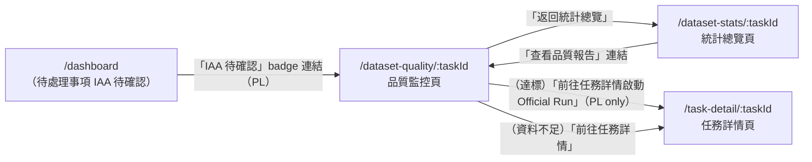

# 功能規格：品質監控頁（Dataset Quality）

**功能分支**：`017-dataset-quality`
**建立日期**：2026-04-05
**狀態**：Draft
**需求來源**：IA v7 Spec 清單 #017 — 品質監控頁（dataset-quality）

---

## 使用者情境與測試 *(必填)*

### User Story 1 — Project Leader 查看 IAA 結果判斷是否達標（優先級：P1）

任務 `project_leader` 進入品質監控頁，查看 Dry Run 的 Inter-Annotator Agreement（IAA）計算結果，判斷是否達到 Official Run 的門檻（≥ 0.8），並依此決定是否啟動 Official Run。

**此優先級原因**：IAA 達標確認是 Dry Run → Official Run 的唯一決策關卡。此功能直接影響任務能否進入正式標記階段。

**獨立測試方式**：建立任務，讓多個標記員完成 Dry Run 後，以 project_leader 帳號進入 `/dataset-quality/:taskId`，確認 IAA 分數正確顯示、達標/未達標狀態正確，並確認達標時「啟動 Official Run」按鈕可點擊。

**驗收情境**：

1. **Given** Dry Run 已全員完成且 IAA 計算完畢，任務 `project_leader` 進入 `/dataset-quality/:taskId`，**When** 頁面載入，**Then** 系統顯示依 `task_type` config 決定的 IAA 指標名稱（例如：`classification` 顯示 Cohen's Kappa / Fleiss' Kappa；`scoring` 顯示 Krippendorff's Alpha；`ner` 顯示 Entity-level F1）、計算結果數值、本任務設定的門檻值（`evaluation.metric` 對應指標的 IAA 標準 ≥ 0.8），以及達標（綠色）/ 未達標（紅色）的視覺狀態。
2. **Given** IAA 結果達標（≥ 0.8），**When** project_leader 查看品質監控頁，**Then** 頁面顯示「IAA 已達標，可啟動 Official Run」提示，並提供「前往任務詳情啟動 Official Run」按鈕（→ `/task-detail/:taskId`）。

---

### User Story 2 — Project Leader 查看低一致性項目清單（優先級：P2）

任務 `project_leader` 查看標記員之間一致性最低的資料項目清單，以便人工審查、討論標記準則並決定是否重新標記。

**此優先級原因**：低一致性項目清單是 IAA 未達標時的重要診斷工具，但不阻礙整體流程，故為 P2。

**獨立測試方式**：確認低一致性項目清單只顯示項目內容與一致性分數，不顯示標記員姓名（Data Fairness）；確認點擊項目可展開查看各標記員答案。

**驗收情境**：

1. **Given** IAA 計算完成且存在低一致性項目，**When** project_leader 查看品質監控頁的「低一致性項目」區塊，**Then** 系統顯示依一致性分數由低至高排列的資料項目清單，每筆顯示：項目序號、資料內容摘要（截斷至 100 字元）、該筆的 item-level 一致性分數；預設顯示最低的 20 筆。
2. **Given** project_leader 點擊某筆低一致性項目展開，**When** 查看詳細答案，**Then** 顯示所有標記員對該筆資料的標注答案（以匿名代號 Annotator A / B / C 顯示，不顯示真實姓名），**並且確保不顯示任何 test-set ground truth 答案**（Data Fairness 原則）。

---

### User Story 3 — Reviewer 查看整體 IAA 結果（優先級：P2）

任務 `reviewer` 進入品質監控頁，查看 IAA 摘要資訊，輔助理解整體標注品質，但無法查看個別標記員明細。

**此優先級原因**：Reviewer 需要了解整體品質趨勢以進行審查決策，但不需要管理層級的完整數據。

**驗收情境**：

1. **Given** 任務角色為 `reviewer` 的使用者進入品質監控頁，**When** 頁面載入，**Then** 顯示 IAA 指標名稱、整體計算結果與達標狀態；一致性矩陣以匿名代號（A / B / C）顯示，不顯示標記員真實姓名。
2. **Given** Reviewer 在品質監控頁，**When** 嘗試查看低一致性項目清單，**Then** 系統顯示項目清單（同 PL 視角的匿名呈現），但「前往任務詳情啟動 Official Run」按鈕隱藏（該操作僅 PL 可執行）。

---

### 邊界情況

- **IAA 計算尚未完成（Loading 狀態）：** 後端非同步計算期間（Celery task），頁面顯示 skeleton loading 動畫與「IAA 計算中，通常需要 1–2 分鐘...」說明文字，前端每 10 秒輪詢一次 `GET /tasks/:taskId/iaa-status`，計算完成後自動更新頁面。
- **Dry Run 資料不足無法計算 IAA：** 若 Dry Run 標注筆數低於最小計算門檻（Cohen's Kappa 需至少 2 位標記員各完成至少 10 筆），頁面顯示「資料不足，無法計算 IAA，目前已完成 N 筆，需至少 M 筆」說明，提供「前往任務詳情」按鈕。
- **僅一位標記員完成 Dry Run：** 無法計算多人 IAA，系統顯示「IAA 需至少 2 位標記員完成 Dry Run 方可計算」說明。
- **Data Fairness — 防止 test-set 答案外洩：** 低一致性項目清單只顯示 Dry Run 的標注答案（標記員之間的答案），絕不顯示任何 ground truth 資料；後端 API 回傳 `LowAgreementItem` 時，`ground_truth` 欄位 MUST 被剝除，不進入 API 回應。
- **super_admin 進入此頁：** 以 project_leader 相同視角（完整資訊）進入，不需要 task_membership 記錄。

---

## 需求規格 *(必填)*

### 功能需求

- **FR-001**：只有任務角色為 `project_leader` 或 `reviewer` 的使用者，以及系統角色 `super_admin`，MUST 能進入 `/dataset-quality/:taskId`；透過 `useTaskRole(taskId)` hook 驗證，無任務成員資格者重導至 `/dashboard`。
- **FR-002**：頁面 MUST 依 `task.type` config 與 `evaluation.metric` 欄位，動態顯示對應的 IAA 指標名稱與計算結果；支援 `cohen_kappa`（Cohen's Kappa）、`fleiss_kappa`（Fleiss' Kappa）、`krippendorff_alpha`（Krippendorff's Alpha）、`f1_macro`（Macro-F1）、`entity_f1`（Entity-level F1）、`pearson`、`spearman` 等 IAA 指標（見 config-schema §5 Metrics Registry）；UI 顯示名稱應使用指標的正式全名，不得以其他指標名稱代稱（例如 `f1_macro` 顯示為「Macro-F1」，而非「Kappa」）。
- **FR-003**：系統 MUST 顯示任務設定的 IAA 門檻值（預設 ≥ 0.8），以及當前計算結果是否達標的視覺指示（達標：綠色；未達標：紅色）。
- **FR-004**：頁面 MUST 顯示標記員兩兩之間的一致性矩陣（heat map）；矩陣中的標記員識別一律使用匿名代號（Annotator A / B / C），不顯示真實姓名；`reviewer` 視角同樣匿名。
- **FR-005**：只有任務角色 `project_leader`（及 `super_admin`）MUST 能在 IAA 達標時看到「前往任務詳情啟動 Official Run」按鈕；`reviewer` 不顯示此按鈕。
- **FR-006**：頁面 MUST 提供低一致性項目清單，依 item-level 一致性分數由低至高排序，預設顯示 20 筆（可展開查看全部）；每筆顯示項目序號、資料內容摘要、item 一致性分數。
- **FR-007**：展開低一致性項目時，MUST 顯示各標記員的標注答案（以匿名代號呈現）；後端 API **絕對禁止**回傳 ground truth 資料，`IAAResult` 及 `LowAgreementItem` API 回應必須在後端層剝除 `ground_truth` 欄位，此為 Data Fairness NON-NEGOTIABLE 約束。
- **FR-008**：IAA 計算為非同步（Celery task）；計算進行中時，頁面 MUST 顯示 loading 狀態並每 10 秒自動輪詢 `GET /tasks/:taskId/iaa-status`；計算完成後自動渲染結果，不需手動重整。
- **FR-009**：Dry Run 資料不足無法計算 IAA 時，MUST 顯示明確的說明文字（含當前筆數與最小門檻），提供「前往任務詳情」按鈕，不顯示空白圖表或錯誤訊息。
- **FR-010**：頁面 MUST 提供「返回統計總覽」連結（→ `/dataset-stats/:taskId`），串接兩個分析頁面的工作流程。

### User Flow & Navigation

| From | Trigger | To |
|------|---------|-----|
| `/dashboard`（PL 待處理事項） | 點擊「IAA 待確認」badge 連結 | `/dataset-quality/:taskId` |
| `/dataset-stats/:taskId` | 「查看品質報告」連結 | `/dataset-quality/:taskId` |
| `/dataset-quality/:taskId` | 「返回統計總覽」 | `/dataset-stats/:taskId` |
| `/dataset-quality/:taskId`（IAA 達標，PL） | 「前往任務詳情啟動 Official Run」 | `/task-detail/:taskId` |
| `/dataset-quality/:taskId`（資料不足） | 「前往任務詳情」 | `/task-detail/:taskId` |

**Entry points**：`/dashboard` PL 視角的待處理事項區「IAA 待確認」badge；`/dataset-stats/:taskId` 的「查看品質報告」連結；Navbar → 資料集分析 → 品質監控（直接進入）。
**Exit points**：「返回統計總覽」→ `/dataset-stats/:taskId`；達標時「啟動 Official Run」→ `/task-detail/:taskId`。

### 關鍵實體

- **IAAResult**：IAA 計算結果。欄位：`id`、`task_id`、`run_type`（通常為 `dry_run`）、`metric`（IAA 指標 id，對應 config-schema §5）、`score`（計算結果，0.0–1.0 或對應指標範圍）、`threshold`（門檻值，預設 0.8）、`is_passed`（是否達標）、`calculated_at`、`status`（`pending` | `calculating` | `completed` | `insufficient_data`）。
- **LowAgreementItem**：低一致性項目。欄位：`id`、`task_id`、`item_id`、`item_content_preview`（截斷至 100 字元，不含 ground truth）、`agreement_score`（item 層級一致性分數）、`annotator_answers`（各匿名代號對應的標注答案陣列；`ground_truth` 欄位後端強制剝除，不回傳）。
- **AgreementMatrix**：一致性矩陣。欄位：`task_id`、`run_type`、`annotators`（匿名代號陣列，例如 `["A","B","C"]`）、`matrix`（二維陣列，`matrix[i][j]` 為 Annotator i 與 j 之間的 pairwise agreement score）。

---

## 成功標準 *(必填)*

- **SC-001**：六種 IAA 指標均能依 `evaluation.metric` config 正確對應顯示，新增指標不需修改前端元件。
- **SC-002**：後端 API 在任何情況下均不回傳 `ground_truth` 資料欄位；此行為有自動化測試覆蓋（API response schema 驗證）。
- **SC-003**：一致性矩陣與低一致性項目清單的標記員識別一律以匿名代號呈現，不顯示真實姓名，通過 reviewer 帳號的手動測試驗證。
- **SC-004**：IAA 計算中的 loading 狀態與自動輪詢機制正常運作，計算完成後無需手動重整即可看到結果。
- **SC-005**：Dry Run 資料不足時，明確顯示當前筆數與最小門檻，使用者能清楚知道需要多少資料才能觸發計算。
- **SC-006**：IAA 達標時 PL 可看到「啟動 Official Run」按鈕；reviewer 在同一頁面不顯示此按鈕；此差異有 role-based 的前端 RoleGuard 保護。
