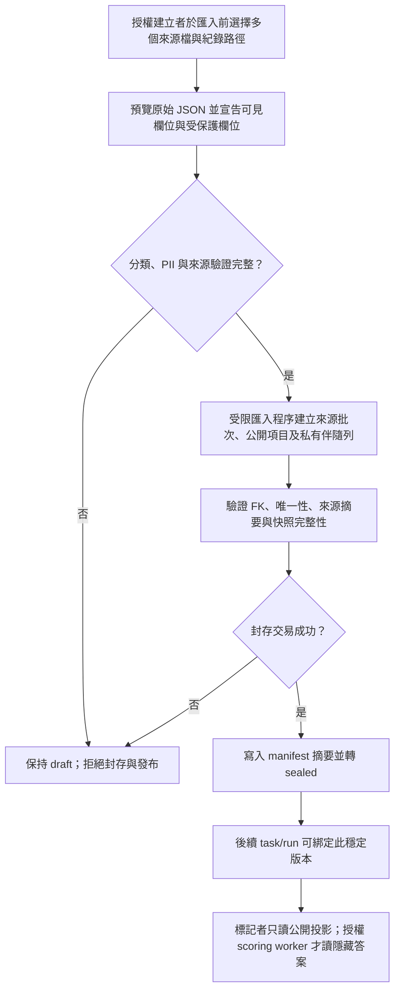

# 功能規格：Dataset Ingestion and Lineage

**Owner**：`dataset` 模組／backend 匯入與資料集版本契約。**需求來源**：issue #1160、[dataset lineage 設計候選](../../../docs/superpowers/specs/2026-10-06-dataset-lineage-design.md)、foundation FR-105／FR-106、ADR-005／ADR-024。本規格定義未來實作應滿足的行為與資料邊界；所列資料表均為**候選表**，目前沒有對應的 ORM、migration、API 或已部署 schema。

## 功能目標

讓每筆可標記資料可追溯至不可變資料集版本、匯入來源、來源批次及前處理版本；讓建立者在發布前明確區分可下發欄位與受保護欄位；讓隱藏 test-set 答案與 split 資訊留在獨立受限資料邊界，確保標記者的任何回應或狀態不洩漏答案。SQLite quick start 與 PostgreSQL production 必須維持相同的身分、完整性、封存與隔離語意。本規格不定義 task/run 的抽樣、清單或標記結果表。

## 已釐清事項與範圍

- `task-management-013` 的多檔上傳、第一筆原始 JSON 預覽與 `field_role_map` 已有規格；建立者的原始預覽只屬於**匯入前、授權建立流程**。匯入後不得為了重現預覽提供可讀取受保護原始來源或 hidden answer 的一般 API。
- `field_role_map.output` 是建立者明確選擇的**標記者可見預標記**；它不是隱藏 test-set 答案。受保護欄位分類須獨立宣告，與可見 Input／Evidence／Output 欄位互斥。
- 版本採完整快照，父版本只作 lineage；既有版本的項目不可因子版本修改而變動。`draft` 與 `sealed` 是本規格的候選版本狀態；其餘 task/run 狀態仍以原規格為準。
- `dataset-016`／`dataset-017` 是分析列表／詳情的消費者，不負責匯入或答案權限。實際 task→dataset version、snapshot→item、annotation→schema version 的 FK 由各自擁有的後續規格決定，不能用本規格的圖線假裝已約束。

## Process Flow

`draft → sealed` 的唯一合法轉換由授權匯入／發布服務執行；必須在同一交易驗證與寫入 manifest、`sealed_at`、狀態及稽核事件。重試須以同一版本與內容得到相同結果；並行封存或更動須以鎖定或明確衝突檢查防止雙重發布。交易失敗完整回滾且版本維持可修正的 `draft`。`sealed` 不得回到 `draft`；資料內容修訂須建立新版本。此段是設計契約，並非現有服務行為。

## User Flow

本功能**不新增獨立頁面**；建立者於既有 `task-management-013` Step 1 的多檔上傳與原始 JSON 預覽進入。原始預覽的可見範圍在檔案匯入前，由既有 UI 契約控制；後續儲存版本只提供經分類的公開投影。離開點為後續 `task-management-014` 的 Dry Run 發布流程；本規格只要求其消費穩定 `sealed` 版本，不自行建立 `sample_snapshot_id` 或 assignment。Frontend Ready Gate：本規格屬 backend 資料契約且無新增頁面，prototype／畫面 traceability 不適用。

## 使用者情境與測試 *(必填)*

### 使用者故事 1 — 匯入來源可追溯（優先級：P1）

授權建立者匯入多個來源檔時，未來的每筆資料均能定位到原始檔次序、來源紀錄序號及前處理版本。

**此優先級原因**：缺少來源與批次身分，資料修正、重跑與匯出無法重現。

**獨立測試方式**：以兩個合成 JSON／JSONL 檔、相同來源 id 與重複內容匯入，檢查版本、批次、項目 FK 與唯一性；只用合成資料，不讀真實答案。

**驗收情境**：

1. **AC-1.1**：**Given** 建立者在 013 上傳兩個合法來源且選定紀錄路徑，**When** 匯入同一 `draft` 版本，**Then** 每個檔案形成一筆有序來源批次並保存該檔的欄位分類 manifest，每筆接受的來源紀錄形成一筆項目，並可沿 FK 追溯來源 checksum、紀錄路徑、來源行序、前處理版本及資料集版本。
2. **AC-1.2**：**Given** 同一來源批次的來源行序已匯入，**When** 重複寫入相同行序，**Then** 資料庫唯一約束拒絕第二筆；不同批次或後繼版本的相同來源 id／內容不被錯誤地視為全域重複。
3. **AC-1.3**：**Given** 一個版本指定父版本，**When** 父版本屬於另一個 dataset 或形成自身／循環祖先，**Then** 拒絕；父版本僅提供血緣，不令子版本讀取父版本的可變資料列。

### 使用者故事 2 — 明確分類並保護隱藏答案（優先級：P1）

建立者先決定來源欄位是否可公開，標記者取得的資料只含允許的投影；隱藏答案僅在授權 scoring worker 的讀取路徑可用。

**此優先級原因**：單靠欄位名稱或呼叫者自行刪欄，無法阻止巢狀 JSON、cache 或 serializer 外洩。

**獨立測試方式**：以合成的公開文字、可見 Output 預標記、受保護 `gold_label` 與任意名稱的隱藏答案欄位，驗證分類衝突、缺漏、資料列公開投影與遞迴 answer-leakage 測試；涉及標記者回應的測試須標記 `@pytest.mark.security`。

**驗收情境**：

1. **AC-2.1**：**Given** 任一來源批次的分類 manifest 缺失、不完整、與 `field_role_map` 的 Input／Evidence／Output 重疊，或 PII 審查未完成，**When** 嘗試封存版本，**Then** 保持 `draft` 並拒絕發布，不得根據 `answer`、`gold_label` 等名稱猜測受保護欄位。
2. **AC-2.2**：**Given** 欄位明確分類，**When** 建立 `dataset_item.public_payload`，**Then** 只存 allowlist 的可見欄位，明確選擇的 Output 可作可見預標記；受保護答案、split、來源位置及私有來源參照不在公開項目、標記者 payload 或其可推知 metadata。
3. **AC-2.3**：**Given** 一筆接受的項目，**When** 私有伴隨列寫入，**Then** `dataset_item_private` 以同一項目 ID 作 PK/FK 且恰有一筆；沒有來源答案時該欄可為 null，但後續需要答案的測試集發布／計分不得默默接受空答案。
4. **AC-2.4**：**Given** 有隱藏 test-set 答案與 split 的版本，**When** 標記者讀取任務、assignment、項目、提交、排行榜或狀態，**Then** 回應的巢狀資料、前端狀態、log、cache、trace 與 fixture 均不得包含答案、答案路徑、split 或可據以辨識 gold/test 的資訊；儲存後答案僅由授權 scoring worker 讀取。
5. **AC-2.5**：**Given** 建立者在匯入前使用 013 的原始 JSON 預覽，**When** 匯入完成，**Then** 一般建立者／標記者路徑不得以預覽功能再讀受限原始來源或 private table；匯入程序與 scoring worker 使用的受限來源須有獨立存取控制。
6. **AC-2.6**：**Given** 來源批次處於 `draft` 且建立者要修正分類 manifest，**When** 修正方向為公開改受保護，**Then** 系統只刪除該欄位的公開投影並把匯入時已持有的值搬入私有列，過程不讀取已儲存的含答案資料；**When** 修正方向為受保護改公開或為尚未分類的欄位新增分類，**Then** 修正被拒絕並要求重新上傳該批來源、走串流匯入器重建，且任何角色都不因此取得讀取答案的權限。

### 使用者故事 3 — 封存可重現版本（優先級：P1）

任務執行引用已封存的完整版本，任何來源或欄位修訂都建立另一個版本。

**此優先級原因**：task/run 若指向會改變的「最新資料」，抽樣、評分與匯出無法重現。

**獨立測試方式**：在 SQLite 與真實 PostgreSQL 以合成資料驗證唯一性、FK、完整快照、seal 交易回滾與並行競爭；後續 task/run 測試另驗證 snapshot 綁定。

**驗收情境**：

1. **AC-3.1**：**Given** `draft` 版本所有欄位分類、來源 checksum、公開／私有項目與有序 manifest 均通過驗證，**When** 授權服務封存，**Then** 同一交易寫入 manifest digest、`sealed_at`、`sealed` 狀態與稽核事件，失敗時全部回滾。
2. **AC-3.2**：**Given** 版本已 `sealed`，**When** 嘗試更改批次順序、來源參照、前處理版本、公開資料、隱藏答案或 split，**Then** 拒絕原地變更；修改須建立具新版本號、同 dataset 父版本及完整項目快照的後繼版本。
3. **AC-3.3**：**Given** 後續任務要發布 Dry Run，**When** 綁定資料集版本，**Then** 只能使用已 `sealed` 的穩定版本；`sample_snapshot_id`、item membership、抽樣種子及跨版本唯一性由 task/run 擁有規格與真實 FK 定義，本規格不宣稱已實作。

## 需求規格 *(必填)*

### 功能需求

- **FR-001**：候選表採 `dataset`、`dataset_version`、`dataset_import_batch`、`dataset_item`、`dataset_item_private` 五個單數、模組前綴名稱；每表均有非空且唯一主鍵。穩定 ID 使用 UUID；FK 與 datetime 命名符合 foundation FR-105／FR-106。每筆 item 的 version/source/preprocessing 身分由 `dataset_item → dataset_import_batch → dataset_version → dataset` 的 FK 鏈追溯，不在 item 複製這些值。
- **FR-002**：`dataset` 保留 `created_by_user_id → users.id`；`dataset_version` 保留 `dataset_id → dataset.id`、同 dataset 範圍的 `parent_version_id` 自參照、正整數 `version_no`、`state`、manifest checksum 及建立／封存時間，唯一鍵為 `(dataset_id, version_no)`。首版本無父版本；禁止自參照、跨 dataset 父版本、祖先循環與非遞增的後繼版本號。
- **FR-003**：每個已接受來源檔在版本內形成一筆 `dataset_import_batch`，有唯一 `(dataset_version_id, source_ordinal)`、來源名稱、SHA-256、受限不可變 `source_ref`、選定紀錄路徑、前處理版本與非空的受限 `classification_manifest` JSON。此 manifest 逐一保存該檔來源欄位路徑的公開／受保護分類與 PII 審查證據，不含答案值；各檔可有不同分類。JSONL 或根陣列的紀錄路徑以 `$` 表示，巢狀 JSON 使用 RFC 6901 JSON Pointer，來源紀錄序號自 1 起算。不可假設來源檔自帶的 id 全域唯一；批次來源與前處理版本不能由項目內容反推。
- **FR-004**：每筆接受的來源紀錄形成一筆 `dataset_item`，含 `dataset_import_batch_id` FK、正整數 `source_row_no` 與經驗證的 JSON `public_payload`，唯一鍵為 `(dataset_import_batch_id, source_row_no)`；同一內容或來源 id 在不同批次／版本可各有身分。版本是完整快照，不能透過可變父版本內容計算當前項目集合。
- **FR-005**：每個 item 須在同一交易建立恰一筆 `dataset_item_private`，以 `dataset_item_id` 作 PK/FK；`declared_split` 與 `hidden_answer` 可空，並只代表**來源宣告**，不代表後續 run 的實際抽樣／指派。隱藏答案與來源 artifact 需受獨立權限控制，儲存後只允許授權 scoring worker 讀取答案；不得進入標記者可讀的資料路徑。
- **FR-006**：匯入前須由授權建立流程明確分類來源欄位、檢查 PII／敏感內容，並獨立於 `field_role_map` 為每個來源批次保存版本化、經驗證且完整互斥的 `classification_manifest`。只有 manifest 的公開 allowlist 可進入 `public_payload`；受保護欄位不得同時為 Input、Evidence 或可見 Output。分類缺漏／矛盾時不可 seal；sealed 後 manifest 不可改。draft 修正 manifest 僅允許將欄位由公開改為受保護，系統只刪除該欄位的公開投影並把匯入時已持有的值搬入私有列，不讀取已儲存的含答案資料；其他方向（受保護改公開、為尚未分類的欄位新增分類）一律須重新上傳該批來源並走串流匯入器重建，不得以修正 manifest 原地重建，也不得為此新增可讀答案的角色。匯入後不可透過一般預覽端點讀取受保護原始來源。
- **FR-007**：標記者可見 API、frontend state、log、cache、trace、screenshot 及 fixture 不得包含 hidden answer、split、答案檔路徑、私有來源參照或可辨識 gold/test 的 metadata。回應模型須依公開欄位建構，不能靠 `SELECT *` 後刪欄；PostgreSQL 使用最小權限禁止標記者讀取角色查詢 private table，SQLite 以 repository／service 權限與回應 allowlist 保持同等隔離。
- **FR-008**：`draft` 版本可由授權匯入服務更正來源與項目；封存前須驗證每批分類 manifest、匯入時取得的來源 checksum 回執、private row 完整性、正整數順序及完整快照 manifest。封存不重新讀取含答案的已儲存原始 artifact；`draft → sealed` 於同一交易寫入含分類摘要的 manifest digest、時間、狀態與稽核事件；重試冪等、競爭防衝突、失敗全回滾。`sealed` 版本不可原地改內容或解除封存，須建立新的完整快照版本。
- **FR-009**：共同路徑須兼容 SQLite quick start／PostgreSQL production：結構化 payload 在 SQLite 為 JSON storage、PostgreSQL 為 JSONB，時間以 UTC 表示；兩種方言都要驗證 FK、唯一鍵、正整數、seal 交易與公開／私有隔離。不得因 SQLite 缺 DB role 就降低答案保護；實際 migration／ORM 另立工作項實作。
- **FR-010**：task/run、annotation、review、quality 與 export 的資料表不屬於本規格；後續契約須為任務綁定 `dataset_version_id`、為 run/snapshot 固定 item IDs 與 seeds、為標註／匯出保存 schema/config/version 條件，使用真實 FK 和交易驗證。不畫未定義的跨模組 FK，也不得把來源 `declared_split` 誤作 run 的切分結果。
- **FR-011**：受限來源 artifact、公開資料及私有答案各須先定義保留、刪除／匿名化與派生資源處置；未定案前不得以無限制 cascade 刪除已封存版本或其被引用項目。cache 與匯出不能回傳已刪除／逾期資料。

### 關鍵實體 *(必填)*

| 實體 | 身分、關聯與資料責任 | 階段 |
|---|---|---|
| `dataset` | UUID PK；建立者 FK；邏輯資料集身份 | 候選，未部署 |
| `dataset_version` | UUID PK；dataset FK；同 dataset 的可空 parent FK；`version_no` 唯一於 dataset；`draft`／`sealed` 狀態與 manifest | 候選，未部署 |
| `dataset_import_batch` | UUID PK；version FK；來源順序、checksum、受限來源參照、紀錄路徑、前處理版本及逐檔受限分類 manifest | 候選，未部署 |
| `dataset_item` | UUID PK；batch FK；來源行序；只含 allowlist 投影的 `public_payload` | 候選，未部署 |
| `dataset_item_private` | `dataset_item_id` 同時為 PK／FK；來源 split 與 hidden answer；不進標記者資料路徑 | 候選，未部署 |

唯一鍵、CHECK、複合父版本 FK、FK 索引與資料型態的物理細節由後續欄位字典逐欄說明；本表不可當作已部署 schema。manifest 的規範化位元組編碼、答案摘要保密方式、split 詞彙、來源 artifact 保留期限及無答案測試項目的發布規則需在 runtime 前定義並測試；不得由 ER renderer 的單欄 FK 線推導複合約束已存在。

## Prototype Traceability

本規格為 backend 匯入、版本與答案隔離契約，**Frontend Ready Gate 不適用**：沒有新增頁面或互動元件。既有建立者上傳與匯入前預覽的 UI 驗收仍由 `task-management-013` 擁有；本規格的公開／私有資料邊界須由後續 backend、security 與雙資料庫測試驗收。

## 規格相依性 *(本功能依賴其他規格，或被其他規格依賴時填寫)*

### 上游（本規格依賴的規格）

| 來源 | 權威邊界 |
|---|---|
| `specs/foundation/000-foundation/spec.md` FR-105／FR-106；ADR-005／ADR-024 | 命名、核心 FK、隱藏答案分表、SQLite／PostgreSQL 雙資料庫策略 |
| `specs/task-management/013-task-new/spec.md` FR-002b／FR-002c／FR-003g-5 | 多檔上傳、原始首筆預覽、欄位角色及可見 Output 預標記；本規格補充受保護分類與封存邊界 |
| `specs/task-management/014-task-detail/spec.md` FR-010f | Dry Run 發布建立不可變 sample snapshot；本規格只提供穩定來源版本，不接管 snapshot 規則 |

### 下游（依賴本規格的規格）

| 來源 | 需後續對齊的權威邊界 |
|---|---|
| task/run owning spec | `sealed` dataset version 綁定、snapshot item 集合、抽樣與 run-specific split 的實體 FK／唯一鍵 |
| annotation／review／quality owning specs | item/sample 身分、schema version、答案隔離與評分工作者讀取邊界 |
| `specs/dataset/016-dataset-analysis-list/spec.md`、`017-dataset-analysis-detail/spec.md` | 分析唯讀投影與可重現匯出；不以分析 view 推定匯入表形 |

## 成功標準 *(必填)*

- **SC-001**：兩來源檔、重複來源 id 與後繼版本的合成測試能沿真實 FK 從 item 追到來源順序、checksum、紀錄路徑、前處理版本及完整版本；同批次重複行序與同版本重複來源順序由 DB 約束拒絕。
- **SC-002**：跨 dataset 父版本、自參照、祖先循環及倒退版本號均拒絕；已封存版本不因建立後繼版本而改變項目集合或 manifest。
- **SC-003**：未明確分類、PII 審查未完成或受保護欄位與 Input／Evidence／Output 重疊時無法 seal；合成 hidden answer 和來源 split 不出現在公開項目與任一標記者可讀路徑，所有標記者回應的遞迴安全測試均通過。
- **SC-004**：`draft → sealed` 的 manifest、狀態、時間及稽核事件只同時成功或同時回滾；重試與並發不產生雙重封存或部分發布，`sealed` 後內容修訂被拒絕。
- **SC-005**：相同的合成案例在 SQLite 與真實 PostgreSQL 對 PK/FK、UNIQUE、CHECK、隔離及交易得出相同結果；本規格未實作前，此標準是後續 code/test gate，不能宣稱已通過。
- **SC-006**：規劃文件與 NoteCraft 圖只顯示已定義的資料集內 FK，清楚標示候選／未部署及 task/run 下游待定；不得把圖的單欄連線當成同 dataset 複合父版本約束的證據。

## Changelog

| 版本 | 日期 | 變更 |
|---|---|---|
| 1.2.0 | 2026-10-08 | issue #1217：依維護者裁決（2026-10-08，#1216／#1217，限定方向）將 FR-006 的 draft manifest 修正限縮為僅允許公開改為受保護（刪除公開投影、把已持有的值搬入私有列、不讀取已儲存的含答案資料），其他方向須重新上傳該批來源並走串流匯入器；新增 AC-2.6；FR-005 不變。屬 MINOR：dataset-021 為尚未部署的候選契約，且未移除其他需求。OpenSpec change `dataset-021-draft-reclassify-direction`。 |
| 1.1.0 | 2026-10-06 | issue #1160：完成五張候選表字典與 NoteCraft 投影、逐檔分類 manifest 及封存來源回執的正典對齊；OpenSpec change `dataset-lineage-schema-planning` archive/write-back。所有表仍未部署。 |
| 1.0.0 | 2026-10-06 | issue #1160：建立 dataset 匯入、完整版本快照與隱藏答案隔離的 owning spec 草案；五張資料表均為規劃候選，task/run FK、ORM、migration、API 與 runtime 尚未實作。 |
