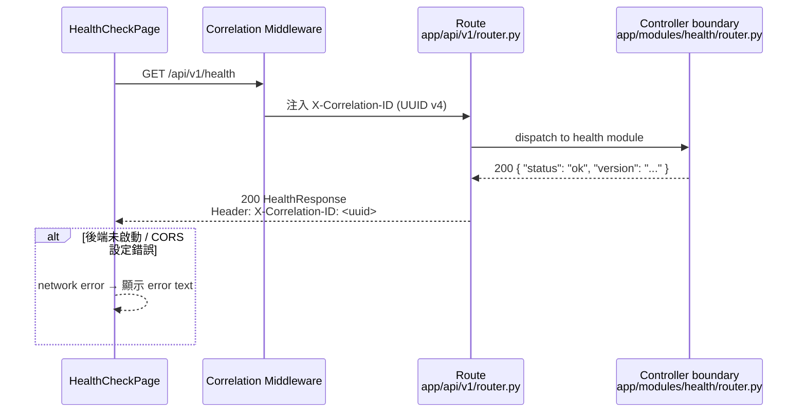
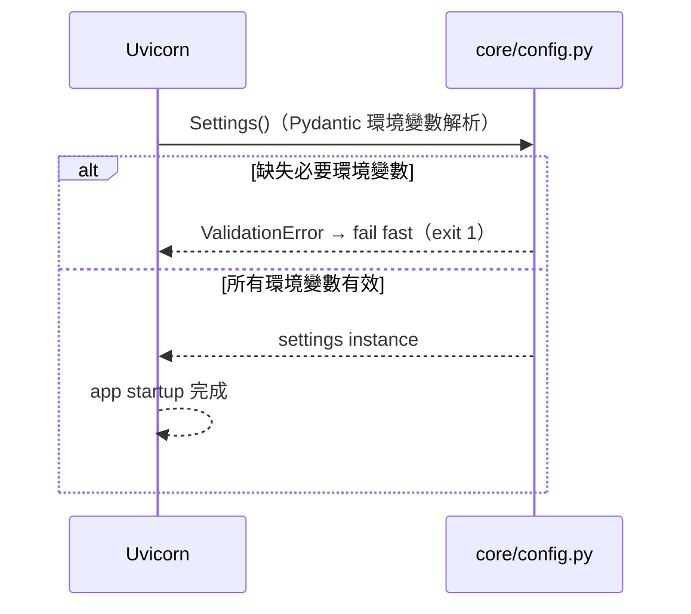

# 實作計畫：Foundation — Core Infrastructure

**規格**: [specs/foundation/000-foundation/spec.md](spec.md)

## 功能目標

建立 Label Suite 所有功能模組共享的工程骨架，使任何後續 feature PR 可直接落地實作，而不必自行建立基礎設施。

骨架包含：FastAPI 後端（module-first 目錄結構、`AppBaseModel`/`ErrorResponse`/`PaginatedResponse` 共用 schema、async SQLAlchemy DB session、Pydantic Settings 環境驗證、Correlation ID middleware、bcrypt security helper）、React 前端（TypeScript strict、shared API client 含 `X-Correlation-ID` 傳遞、TanStack Query `QueryClient` baseline、Zustand session store、shared constants）、Docker Compose 本地環境（backend / postgres / redis）、bootstrap contract（`.env.example`、seed data 策略（`scripts/seed.sh`）、OpenAPI export / frontend type-generation command（FR-071、SC-018）、`scripts/verify-bootstrap.sh`），以及前後端整合驗證端點（`GET /api/v1/health`）。

**範圍界定（Foundation-Core）**：本計畫涵蓋 Foundation Spec P0/P1 核心工程約束（F-01~F-10、F-13、F-16、F-18），不包含 Prometheus/Grafana/Sentry（F-17）、Celery（F-12）、bundle budget 監控（FR-126）。上述延後項目由後續 Foundation-Observability 計畫實作。

## 技術方向

同時觸及後端、前端與 DevOps 三層。後端採 FastAPI + async SQLAlchemy 2.0，以 module-first 目錄（`app/modules/[module]/`）組織 domain 程式碼，跨模組共用基礎設施放於 `app/core/`、`app/db/`、`app/schemas/`、`app/dependencies/`、`app/middleware/`；本地開發使用 SQLite（ADR-024 零摩擦啟動），CI integration tests 使用 PostgreSQL。前端採 React 18 + Vite + TypeScript strict，以 vertical feature slice（`features/[module]/`）組織，共用基礎設施放於 `shared/`；TanStack Query 管理 server state，Zustand 管理 client session state。`GET /api/v1/health` 作為前後端確實接通的最小可驗證契約。

## 技術脈絡

**效能目標**: health check API P95 < 500ms；無列表查詢，無 N+1 風險
**限制**:
- Config-driven，不得硬編碼任何 task-specific 邏輯（Foundation 骨架必須 task-agnostic）
- SQLite 用於本地快速開發（`aiosqlite` driver）；PostgreSQL 用於 CI tests 與 production（`asyncpg` driver）
- 所有後端 Python 命令透過 `uv run`；所有前端命令使用 `pnpm`
- Observability（Prometheus/Grafana/Sentry）與 Celery 延後至 Foundation-Observability

## 憲章檢查

- [x] 功能目標：本計畫的功能目標與 spec.md 一致（health check 驗證端點為使用者明確要求的工程驗證工具，不修改 spec domain 範圍）
- [x] I. Spec-First：Foundation spec v1.12.2 已完成並審查
- [x] II. Generalization-First：Foundation 骨架不含任何 task-specific 分支；所有 domain variation 透過 registry/config 擴展；`AppBaseModel` 為可繼承 base 而非特定 domain model
- [x] III. Data Fairness：本計畫不涉及 test set；health check 不回傳任何敏感資料
- [x] IV. Test-First：測試計畫已列出；所有 backend schema/config/health integration tests 必須先寫並確認失敗，再實作
- [x] V. Code Quality & Simplicity：骨架僅建立必要基礎設施；無 task-specific 假設；型別提示完整；無 debug 輸出；命名自說明；入口點（health router → `GET /api/v1/health`、api-client → feature service）兩層內可定位
- [x] VI. English-First：所有程式碼、注釋、commit message 使用英文
- [x] VII. Design Consistency：HealthCheckPage 為 Foundation-only 內部工程驗證工具，不屬於正式 UI；不使用 MASTER.md design tokens；無 Storybook story 要求（臨時驗證元件豁免）；A11y 無要求（非使用者介面）；設計系統 token 設定留至 Foundation 骨架完成後
- [x] VIII. Performance Baseline：health check 無列表端點；P95 < 500ms 目標已確認；HealthCheckPage 非正式頁面，FCP/bundle/code splitting 要求豁免
- [x] IX. No Silent Failure：Config 缺失環境變數時 fail fast（startup validation）；DB 連線失敗有結構化日誌；health check error path 有 inline error text
- [x] XI. Security & Privacy Baseline：health check 不需認證；不洩漏敏感資料；CORS origins 由環境變數注入；bcrypt cost ≥ 12

### 領域憲章載入（依觸及範圍勾選）

- [x] 後端（touches `backend/`）：已讀取 `.specify/memory/backend-constitution.md`；本 plan 符合所有適用規則（module-first 架構、async SQLAlchemy、pytest TDD、uv 命令、no hardcoded secrets）
- [x] 前端（touches `frontend/`）：已讀取 `.specify/memory/frontend-constitution.md`；本 plan 符合所有適用規則（TypeScript strict、vertical feature slice、TanStack Query、Zustand、pnpm 命令）
- [x] 測試（所有 task）：已讀取 `.specify/memory/testing-constitution.md`；本 plan 符合所有適用規則（Red-Green-Refactor、pytest + httpx、Vitest + MSW、每個 task 觸及一個檔案）

## 專案結構

### 文件（本功能）

```text
specs/foundation/000-foundation/
├── spec.md
├── plan.md          ← 本文件
├── tasks.md         ← 待生成（/speckit.tasks）
└── checklists/      ← 待生成（/speckit.checklist）
    ├── ac-checklist.md
    └── security-checklist.md
```

### 原始碼

> Foundation-Core 建立的是共用骨架；後續 feature module 的 `app/modules/[module]/` 與 `features/[module]/` 由各 feature PR 建立。`app/modules/health/` 為暫時驗證模組，可在系統穩定後整合至 ops endpoint。
>
> **拆分慣例（單檔超過 300 行時）：** 所有模組檔案均適用——超過 300 行時改為同名子目錄並按 feature 分檔，`__init__.py` 負責彙總對外介面，呼叫端 import 路徑不變。FR-131 路由異動偵測已擴展至涵蓋 `app/modules/*/router/` 目錄下所有子檔案。

```text
backend/
├── pyproject.toml                           # Python 專案設定（uv 管理）
├── uv.lock                                  # 依賴鎖定
├── alembic.ini                              # date + slug migration file template
├── alembic/
│   ├── env.py                               # async migration（run_sync 包裝）
│   └── versions/                            # empty；每個 feature PR 新增 migration
├── bruno/                                   # Bruno API collection (ADR-025)
│   ├── bruno.json
│   └── environments/
│       ├── local.bru
│       └── staging.bru
├── app/
│   ├── main.py                              # FastAPI app、middleware、router include
│   ├── api/
│   │   └── v1/
│   │       └── router.py                    # /api/v1 路由彙整；include health router
│   ├── middleware/
│   │   ├── correlation.py                   # X-Correlation-ID 生成與注入
│   │   └── logging.py                       # request/response 結構化日誌
│   ├── modules/
│   │   └── health/                          # 暫時驗證模組；最小化，僅含 router.py
│   │       └── router.py                    # GET /api/v1/health（無認證）
│   ├── schemas/
│   │   ├── base.py                          # AppBaseModel（model_config、datetime serialization）
│   │   └── common.py                        # ErrorResponse、ErrorDetail、PaginatedResponse[T]
│   ├── core/
│   │   ├── config.py                        # Pydantic Settings；startup validation；fail fast
│   │   ├── exceptions.py                    # 自定義例外與 ErrorResponse handler mapping
│   │   ├── security.py                      # bcrypt hash/verify（為 account/001 預備）
│   │   └── logging.py                       # structlog / logging 設定
│   ├── db/
│   │   ├── base.py                          # DeclarativeBase；SQLAlchemy naming convention
│   │   └── session.py                       # async session factory、get_db dependency
│   └── dependencies/
│       ├── auth.py                          # get_current_user 佔位（account/001 實作）
│       └── permissions.py                   # RoleChecker 佔位
└── tests/
    ├── conftest.py                          # async client、DB session（begin_nested SAVEPOINT）
    ├── factories/                           # empty；每個 feature PR 填入
    └── core/
        ├── test_config.py                   # startup validation（缺失/非法 env var fail fast）
        ├── test_schemas.py                  # AppBaseModel / ErrorResponse / PaginatedResponse
        ├── test_security.py                 # bcrypt hash / verify
        └── test_health.py                   # GET /api/v1/health integration test

frontend/
├── index.html
├── package.json
├── pnpm-lock.yaml
├── vite.config.ts
├── tsconfig.json
├── eslint.config.js                         # module boundary rules
└── src/
    ├── main.tsx                             # React 啟動、providers 掛載
    ├── App.tsx                              # QueryClientProvider、router outlet
    ├── routes/
    │   ├── index.tsx                        # 中央 route tree（lazy import feature pages）
    │   └── paths.ts                         # route path 常數
    ├── features/
    │   └── health/                          # Foundation-only 臨時基礎設施驗證模組（不在標準 module 列表內；系統穩定後移除）
    │       ├── pages/
    │       │   └── HealthCheckPage.tsx      # 呼叫 /api/v1/health 並顯示回應
    │       └── __tests__/
    │           └── HealthCheckPage.test.tsx
    ├── shared/
    │   ├── services/
    │   │   ├── api-client.ts               # fetch 封裝；base URL、credentials、ErrorResponse parsing、X-Correlation-ID
    │   │   └── auth.ts                     # 401 refresh 佔位
    │   ├── stores/
    │   │   ├── session.ts                  # Zustand session（不存 raw token）
    │   │   └── ui.ts                       # Zustand UI state（sidebar、modal）
    │   ├── constants/
    │   │   ├── breakpoints.ts              # MOBILE_BP = 767
    │   │   ├── storage-keys.ts             # LOCALSTORAGE_LANG_KEY
    │   │   └── query-keys.ts               # TanStack Query queryKey factory
    │   ├── types/
    │   │   └── api.ts                      # ErrorResponse、PaginatedResponse 前端 interface
    │   ├── api-types/                      # OpenAPI generated types（空；account/001 後填入）
    │   ├── i18n/
    │   │   └── index.ts                    # i18n 初始化
    │   └── styles/
    │       └── global.css                  # reset、design token imports
    └── testing/
        └── setup.ts                        # Vitest setup（jest-dom、MSW server）

# Root / DevOps
├── docker-compose.yml                      # CI/Docker 路徑：backend + postgres + redis（ADR-024 quick-start 使用 SQLite，無需 DATABASE_URL）
├── .env.example                            # 所有必要環境變數範例（無預設 secret）
└── scripts/
    ├── verify-bootstrap.sh                 # SC-045 one-command 本地驗證
    └── seed.sh                             # FR-130 seed data 策略（dev 環境初始資料）
```

## 系統流程與資料流

### Health Check 流程



> Health check 為公開端點，無 Auth Middleware 分支。無 Service / Repository / DB 層（無 domain 資料存取）。

| 層 | 元件 | 職責 |
|----|------|------|
| Frontend | `features/health/pages/HealthCheckPage` | 呼叫 health API、顯示 status / 錯誤訊息 |
| Middleware | `middleware/correlation.py` | 生成/傳遞 X-Correlation-ID |
| Route | `api/v1/router.py` | 路由彙整 |
| Controller boundary | `modules/health/router.py` | 回傳 `{ status, version }`，不需 DB |

### Startup Validation 流程



> **本功能無非同步任務需求**：Foundation-Core 不包含 background job；Celery 由 Foundation-Observability 引入。

---

## Phase 0：研究

> 無 NEEDS CLARIFICATION 項目，跳過此階段。

**已確認決策**：

| 決策點 | 選擇 | 理由 |
|--------|------|------|
| 本地 DB | SQLite (`aiosqlite`) | ADR-024 零摩擦啟動；`DATABASE_URL` env 切換至 PostgreSQL |
| CI integration tests DB | PostgreSQL via Docker Compose | FR-031：tests 必須使用真實 DB |
| 密碼 hash | bcrypt (cost=12) | FR-080 / SC-014 |
| Correlation ID | UUID v4 via `uuid.uuid4()` | FR-046；standard library，無額外依賴 |
| 結構化日誌 | Python `logging` + JSON formatter | 無需 structlog；保持最小依賴 |
| OpenAPI docs | dev 啟用，production 由 `ENABLE_OPENAPI_DOCS` 控制 | FR-070 |
| Observability | 延後（Foundation-Observability） | 使用者決定：Foundation-Core 優先 |

**Exception 設計**：

| 操作 | Error 情境 | Exception Class | HTTP Status | Response body |
|------|-----------|----------------|-------------|---------------|
| startup | 缺失環境變數 | pydantic `ValidationError` | fail fast（exit 1） | — |
| 任何 API | schema validation 失敗 | FastAPI `RequestValidationError` | 422 | `ErrorResponse` |
| 任何 API | 未認證（佔位） | `HTTPException(401)` | 401 | `ErrorResponse` |

---

## Phase 1：設計與契約

> 前置條件：research.md 已完成（Phase 0 無 NEEDS CLARIFICATION，跳過）

### 1. 共用 Schema 定義（取代 entity data model）

Foundation-Core 無 domain entity，僅建立共用 schema 基礎：

| Schema | 繼承自 | 用途 |
|--------|-------|------|
| `AppBaseModel` | `BaseModel` | 所有 module schema 的 base；集中 `model_config`、datetime alias |
| `ErrorDetail` | `AppBaseModel` | 單一錯誤項：`loc`、`msg`、`type`、`error_code` |
| `ErrorResponse` | `AppBaseModel` | API 錯誤回應：`detail: str \| list[ErrorDetail]` |
| `PaginatedResponse[T]` | `AppBaseModel` | 分頁列表：`items`、`total`、`limit`、`offset`、`next_offset`、`has_more`、`total_pages` |
| `HealthResponse` | `AppBaseModel` | health check 回應：`status: str`、`version: str` |

> `PaginatedResponse[T]` 的 `next_offset`、`has_more`、`total_pages` 由 `total`、`limit`、`offset` 計算（不需額外 DB 查詢）。TypeVar 泛型，不用 `Any`。

**DB Index 分析**：Foundation-Core 無 domain table；`alembic/versions/` 為空；本階段無 index 需求。

**狀態轉換**：本功能無多狀態實體。

### 2. API 端點清單

| Method | Path | System Role | Task Role | Auth Dependency | 說明 | Bruno 檔案 |
|--------|------|-------------|-----------|----------------|------|-----------|
| GET | `/api/v1/health` | public | N/A | None | 服務健康狀態，無認證 | `backend/bruno/foundation/000-foundation/get-health.bru` |

> health check 為 GET endpoint，冪等性天然滿足（FR-119 豁免）。

**事務邊界設計**：本端點無複合事務；health check 為 GET，無 DB write。

### 2b. Pydantic Schema 層次設計

| Schema | 繼承自 | 用途 | 需排除的敏感欄位 |
|--------|-------|------|----------------|
| `AppBaseModel` | `BaseModel` | 共用 base；集中 `model_config`、datetime serialization | — |
| `ErrorDetail` | `AppBaseModel` | validation / app rule / auth error 詳情；含 `loc`、`msg`、`type`、`error_code` | — |
| `ErrorResponse` | `AppBaseModel` | 統一錯誤回應；`detail: str \| list[ErrorDetail]` | — |
| `PaginatedResponse[T]` | `AppBaseModel` | 分頁列表 wrapper；TypeVar 泛型 | — |
| `HealthResponse` | `AppBaseModel` | health check 回應；`status: str`、`version: str` | — |

> 所有欄位均有明確型別；無需 `Field(...)` constraint 或 custom validator（Foundation schema 為 base，不含業務驗證）。

### 3. 前端切版分析

| 區塊 | 元件名稱 | 職責 | 資料來源 | Stories 狀態 | ARIA / 鍵盤需求 | 響應式行為 |
|------|---------|------|---------|------------|----------------|----------|
| 頁面容器 | `HealthCheckPage` | 呼叫 health API、顯示 status / error | TanStack Query | — (臨時驗證頁；豁免) | — (非正式 UI) | 無需響應式 |

> HealthCheckPage 為開發驗證工具，非正式 UI；無 Storybook story 要求，無 ARIA / 鍵盤需求，無響應式要求。

**元件層次**：
```
HealthCheckPage
└── 顯示 status / error（純 div + text）
```

**畫面狀態轉換**：

| 當前畫面狀態 | 觸發條件 | 下一狀態 | UI 呈現 |
|------------|---------|---------|--------|
| Loading | `useQuery` isLoading | Success 或 Error | "Checking..." text |
| Success | 200 回應 | 顯示 `{ status: "ok" }` | status 文字 |
| Error | network error / 非 200 | 顯示錯誤訊息 | error text |

**畫面 × API 對應**：

| 畫面 / 元件 | 觸發時機 | Method | Endpoint | TanStack Query key |
|------------|---------|--------|----------|--------------------|
| `HealthCheckPage` 掛載 | 頁面初始化 | GET | `/api/v1/health` | `QUERY_KEYS.health.status`（`shared/constants/query-keys.ts`） |

**前端技術決策**：

```
型別策略：
- [x] 手寫 interface（src/shared/types/api.ts）作為佔位
  注意：shared/api-types/ 暫留空，待 account/001 建立 OpenAPI export 後改由 CI codegen（FR-071 / SC-018）

表單策略：無表單（health check 只有 GET）

TanStack Query 策略：
- queryKey 格式：QUERY_KEYS.health.status（定義於 shared/constants/query-keys.ts，不得使用 inline string array — SC-019）
- 無 mutation，無 invalidate 需求
- 無 optimistic update

API 錯誤處理策略：
- network error → inline error text（不用 toast；驗證頁）
- 非 200   → inline error text
- QueryClient 的 retry callback 必須對 auth error 回傳 false（SC-020）

Loading 策略（對應 TanStack Query 狀態欄位）：
- isLoading && !data → "Checking..." text
- isFetching && data → 保留舊資料（stale-while-revalidate）
- isError && !data  → error message text
- mutation.isPending → 不適用（無 mutation）
```

**路由分析**：

| Path | 元件 | 是否需要 Route Guard | 重導向規則 | Guard 失敗行為 |
|------|------|-------------------|-----------|--------------|
| `/health-check` | `HealthCheckPage` | ❌ public | — | — |

**i18n Key 清單**：

> HealthCheckPage 為 Foundation-only 內部工程驗證工具，非正式使用者介面。其顯示字串（`status: "ok"`、error text）為技術識別符而非 UI copy，符合 frontend-constitution §IX「stable technical identifier」豁免條件。此元件在系統穩定後移除，無需建立 i18n namespace。
>
> **標記**：「本功能無前端 i18n 需求 — Foundation-only 工程驗證元件，適用技術識別符豁免」

**後端 i18n Key 清單**：

> health check 回應為固定英文字串（`status: "ok"`），不需 i18n。
>
> **標記**：「本功能無新增後端訊息」

### 4. 系統流程圖

詳見上方「系統流程與資料流」章節。

**無非同步任務需求**：Foundation-Core 不包含 background job；Celery 由 Foundation-Observability 引入。

### 5. 測試情境

| 情境 | 測試層 | 工具 | 路徑 |
|------|-------|------|------|
| `AppBaseModel` serialization、`model_config` 設定 | 單元測試 | pytest | `tests/core/test_schemas.py` |
| `ErrorResponse` / `ErrorDetail` schema 欄位驗證 | 單元測試 | pytest | `tests/core/test_schemas.py` |
| `PaginatedResponse[T]` `next_offset` / `has_more` / `total_pages` 計算 | 單元測試 | pytest | `tests/core/test_schemas.py` |
| Config 缺失必要環境變數時 fail fast | 單元測試 | pytest | `tests/core/test_config.py` |
| Config 非法值（如 ALLOWED_ORIGINS=*）被拒絕 | 單元測試 | pytest | `tests/core/test_config.py` |
| `bcrypt_hash` 產生可驗證的 hash；`bcrypt_verify` 正確比對 | 單元測試 | pytest | `tests/core/test_security.py` |
| `bcrypt_verify` 拒絕錯誤密碼（negative test） | 單元測試 | pytest | `tests/core/test_security.py` |
| `GET /api/v1/health` 回傳 200 + `HealthResponse` | 整合測試 | pytest + httpx | `tests/core/test_health.py` |
| health response 包含 `X-Correlation-ID` header | 整合測試 | pytest + httpx | `tests/core/test_health.py` |
| 驗證錯誤（422）回傳 `ErrorResponse` schema（SC-035） | 整合測試 | pytest + httpx | `tests/core/test_health.py` |
| 自定義例外 handler 回傳 `ErrorResponse` 而非 FastAPI 預設格式（SC-035） | 整合測試 | pytest + httpx | `tests/core/test_schemas.py` |
| `HealthCheckPage` 掛載後呼叫 health API 並渲染 status | 元件測試 | Vitest + Testing Library + MSW | `src/features/health/__tests__/HealthCheckPage.test.tsx` |
| `HealthCheckPage` 網路錯誤時顯示 error 訊息 | 元件測試 | Vitest + Testing Library + MSW | `src/features/health/__tests__/HealthCheckPage.test.tsx` |
| `api-client` 從 response header 讀取 `X-Correlation-ID` | 單元測試 | Vitest | `src/shared/__tests__/api-client.test.ts` |
| `QueryClient` 收到 HTTP 401 不觸發 retry（SC-020） | 單元測試 | Vitest | `src/shared/__tests__/query-client.test.ts` |

**產出**：API 清單（含 Bruno 路徑）、Pydantic schema 層次、路由分析、畫面狀態轉換、畫面 × API 對應、測試情境已概述

---

## Phase 2：任務規劃方式

*本節描述 `/speckit.tasks` 將執行的內容 — 不得在 `/speckit.plan` 期間執行*

**User Story 結構**：Foundation-Core 以「基礎設施里程碑」而非 domain flow 組織：

| Phase | 對應里程碑 | 核心產出 |
|-------|---------|---------|
| Phase BE-1 | Backend Core Schema & Config | AppBaseModel、ErrorResponse、PaginatedResponse、config validation |
| Phase BE-2 | Backend DB & Session | async session、get_db、DeclarativeBase、naming convention |
| Phase BE-3 | Backend Security & Middleware | bcrypt helper、correlation middleware、logging middleware |
| Phase BE-4 | Backend Health Endpoint | GET /api/v1/health、Bruno .bru skeleton |
| Phase FE-1 | Frontend Project Scaffold | package.json、vite.config.ts、tsconfig.json、eslint.config.js |
| Phase FE-2 | Frontend Shared Infrastructure | api-client、session store、constants、query-keys |
| Phase FE-3 | Frontend Health Check Page | HealthCheckPage + tests |
| Phase DevOps | Bootstrap & Verification | docker-compose.yml、.env.example、seed.sh、verify-bootstrap.sh（FR-130 全契約） |

**TDD 排序**：
- 每個 task 先寫 failing test（`[P]` 標記可平行）
- backend schema tests → schema 實作 → config tests → config 實作 → security tests → security 實作 → health tests → health 實作
- frontend：MSW handler + component test → HealthCheckPage 實作

**任務產生策略**：

- 以 `.specify/templates/tasks-template.md` 為基礎
- 每個 API 清單項目 → 單元測試任務 [P] + 實作任務 + Bruno `.bru` 更新任務（`PR-FOUND-BRUNO`，依 FR-131）
- 每個 schema → schema 測試任務 [P] + 實作任務
- 每個元件 → 元件測試任務 [P] + 實作任務（無 Storybook story，HealthCheckPage 豁免）
- DevOps 任務可與 backend Phase BE-1 平行執行

**排序策略**：

- TDD 順序：測試在實作前（必須先失敗）
- `app/schemas/` → `app/core/config.py` → `app/db/` → `app/core/security.py` → `app/middleware/` → `app/modules/health/` → `app/api/v1/router.py` → `app/main.py`
- frontend scaffold 可與 backend 平行執行

**預估產出**：`tasks.md` 中約 40–50 個有序任務

**重要**：此階段由 `/speckit.tasks` 執行，不由 `/speckit.plan` 執行

---

## 複雜度追蹤

| 偏差項目 | 需要原因 | 拒絕更簡單替代方案的理由 |
|---------|---------|----------------------|
| SQLite 本地開發 + PostgreSQL CI | ADR-024；零摩擦啟動 | 強迫本地使用 Docker PostgreSQL 增加啟動障礙；SQLite 透過 `DATABASE_URL` 切換，不影響 production 路徑 |
| Observability 延後 | 使用者確認 Foundation-Core 優先 | Prometheus/Grafana/Sentry 設定工作量大；Foundation-Core 驗證前後端接通是更緊迫目標 |
| health module 僅含 router.py | 最小化原則 | health check 無 domain 資料、無業務邏輯、無 DB 存取；service / repository / models 均不必要 |

---

## 進度追蹤

**階段狀態**：

- [x] Phase 0：研究完成（無 NEEDS CLARIFICATION）
- [x] Phase 1：設計完成（schema 定義、API 清單、Pydantic 層次、切版分析、測試情境）
- [x] Phase 2：任務規劃方式已描述（待 `/speckit.tasks` 執行）
- [ ] Phase 3：任務已產生（`/speckit.tasks`）
- [ ] Phase 4：實作完成
- [ ] Phase 5：驗證通過（`/speckit.analyze` 零發現）

**把關狀態**：

- [x] 初始憲章檢查：PASS
- [x] 設計後憲章檢查：PASS（v2.0.0 重新驗證）
- [x] 所有 NEEDS CLARIFICATION 已解決
- [x] 複雜度偏差已記錄（SQLite 分層 + Observability 延後 + health module 最小化）

---

## Changelog

| 版本 | 日期 | 變更摘要 |
|------|------|---------|
| 2.0.0 | 2026-06-09 | 對齊 plan-template v1.13.6（major structural update）：補齊 DB Index 分析、狀態轉換、事務邊界設計、Pydantic 2b 表格、前端切版分析表格（含 Stories/ARIA/響應式欄）、畫面狀態轉換表、畫面 × API 對應表、前端技術決策 checkbox 格式、後端 i18n key 清單、拆分慣例說明；更新 constitution 檢查至 v1.13.6 模板格式（含 VII Storybook / A11y / IX / XI 細化）；對應 spec.md v1.12.2 確認無功能異動；系統流程圖補齊 Route → Controller boundary 層 |
| 1.0.3 | 2026-06-05 | 補充 test_security.py 至測試情境表（bcrypt hash/verify + negative test） |
| 1.0.2 | 2026-06-05 | 文件目錄補齊 `checklists/`（ac-checklist.md、security-checklist.md），對齊 plan-template 非 optional 規範 |
| 1.0.1 | 2026-06-05 | Bruno API 檔案路徑改為 `backend/bruno/foundation/000-foundation/get-health.bru`，對齊模組 → 功能 → API 分層追蹤 |
| 1.0.0 | 2026-06-05 | 初版：Foundation-Core 計畫；範圍限定 F-01~F-10、F-13、F-16、F-18；Observability (F-17) 與 Celery (F-12) 延後至 Foundation-Observability；加入 health check 驗證端點（使用者確認）；採用 module-first 後端目錄結構（對齊 Foundation Spec 基準目錄，修正 plan-template 的 layer-first 錯誤）；SQLite 本地開發 / PostgreSQL CI（ADR-024） |
