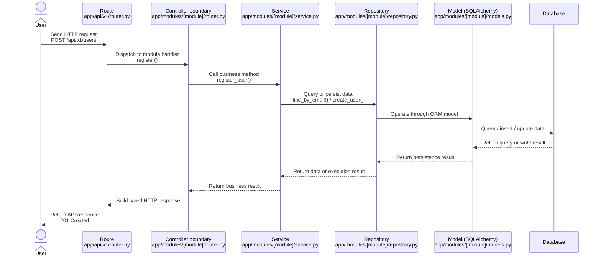

# 工程架構基準：Foundation — 跨模組共同約束

## 功能目標

本規格定義 Label Suite 所有功能模組必須遵守的工程架構基準。它服務 backend、frontend、QA 與 reviewer，使任何 feature spec 在進入實作前，都能依同一套 API、分層架構、型別、安全、測試與可觀測性規則設計。

本規格不定義單一 domain flow、頁面旅程、狀態節點、演算法選型或資料生命週期。這些內容必須由各 feature spec 或 ADR 定義，並只能依本規格提供的工程邊界實作。

**需求來源**：Information Architecture v1.4.3 §6.1 Foundation Spec 關係；Constitution v1.29.1；REST API design best practices（resource naming、versioning、filtering、pagination、cacheability、security、idempotence、input validation）；React design patterns and best practices（function components、custom hooks、Context boundary、type-safe components/hooks、Vite、utility-first styling、design systems）。

---

## 範圍界定

### 本規格負責

1. 前後端專案目錄與模組邊界。
2. REST API 合約、錯誤格式、版本與 HTTP 語意。
3. Backend domain package、route / service / repository / schema / migration 分層。
4. Frontend feature vertical slice、shared admission rule、型別、狀態管理、UI/UX、A11y、i18n、responsive、performance 與 motion 基準。
5. Auth、permission hook、CORS、secret、input validation、安全回應。
6. Config-driven extensibility 的工程契約。
7. 測試策略、CI quality gates、Prometheus / Grafana / Sentry 可觀測性與背景任務通用規則。

### 本規格不負責

1. 具體 domain state 節點與轉換。
2. 具體資料生命週期、保留政策或不可變規則。
3. 具體演算法、評估方式或執行策略選型。
4. 具體事件名稱、輸出流程步驟或頁面分派邏輯。
5. 單一頁面 UX、wireframe、prototype 或文案。

上述內容若需要規範，必須放在對應 module spec，例如 `task-management`、`annotation`、`dataset`、`admin` 或獨立 ADR。

---

## 輸入與產生規則

**產生 feature spec 時必須遵守**：

1. Feature spec 不得覆寫本規格的工程邊界；若有衝突，必須先更新 foundation 或 ADR。
2. Feature spec 可定義 domain flow，但必須以本規格的 route/service/schema/test/security 契約落地。
3. 每項工程約束均標記優先級（P0/P1/P2）與可驗證方式。
4. 所有 FR-* 以「系統必須」開頭；SC-* 必須可透過 pytest / mypy / tsc / ruff / ESLint / Playwright / CI script 或明確整合測試驗證。
5. 本規格與 Constitution 衝突時，Constitution 為最高準則。

---

## 編號與追蹤規則

FR 編號採追加制。後續版本新增需求時使用新的 FR 編號，不重新排序既有 FR，以維持 feature spec、tasks、tests、PR description 與歷史審查紀錄的 traceability。因此同一 section 內可能出現非連續 FR 編號；若未來需要統一重新排號，必須以 major version 更新並提供對照表。

---

## 架構背景：設計原則對應

本規格以工程約束而非口號描述架構原則；下列對應用於 onboarding、spec review 與 implementation review，協助 reviewer 將常見設計原則落到可驗證的 Foundation 約束。

| 原則 | Foundation 對應 | 實作判準 |
|------|-----------------|----------|
| SRP — 單一職責原則 | F-02 Backend 分層架構 | Router 只處理 HTTP 邊界；service 承接應用協調與 transaction boundary；repository helper 只處理單一 module 的資料存取。 |
| OCP — 開閉原則 | F-06 Config-driven Extensibility | 新增可變行為、UI variant、metric 或流程擴充點時，透過 config schema、registry、strategy map 或 plugin boundary 擴充；不得修改核心 route/service 分支。 |
| LSP — 里氏替換原則 | F-06 registry / strategy extension points | Registry 中的 calculator、widget、job handler 或 notifier 實作必須履行 base contract；替換實作不得改變呼叫端預期的輸入、輸出與錯誤語意。 |
| ISP — 介面隔離原則 | F-02 Schema 分離、F-09 Frontend 型別 | Request schema、response schema、create schema、update schema 與 component props 必須各自只暴露使用者需要的欄位；不得用單一寬介面逼迫呼叫端提供無關資料。 |
| DIP — 依賴反轉原則 | F-02 Backend 分層、F-04 Auth / Permission、`app/dependencies/` | Route 與 service 透過 FastAPI dependencies、session provider、permission dependency 或抽象協作者取得依賴；不得在高層應用協調中直接建立具體 DB session、notifier 或外部 client。 |
| CARP — 合成/聚合複用原則 | F-03 Frontend Vertical Slice、F-02 Schema 分離 | UI 行為以 component composition、props、hooks 與 feature-local helpers 組裝；共用 schema 欄位只以 base class 或 mixin 提取，避免深繼承鏈。 |
| LKP — 最少知識原則 | F-03 跨模組邊界、FR-012、shared admission rule | Feature module 只依賴自己的內部檔案、shared domain-neutral contract 或 API boundary；不得直接深入其他 feature 的 hooks、stores、types 或 component internals。 |
| Modern React composition | F-03 Frontend Vertical Slice、F-09 Frontend 型別 | UI 必須以 function components、custom hooks、typed props、generic reusable primitives 與 route-level composition 拆分；class components、render props / HOC chains 或巨型 page component 僅能在 feature spec 記錄相容性理由後使用。 |

---

## 基準目錄結構

本節描述前後端專案的目標目錄形狀。實際 feature 可新增 module-local 子資料夾，但不得破壞本規格定義的分層與 feature boundary。

### Backend

Backend 採用 FastAPI，並以 domain package-first 組織大型 monolith。每個 domain module 內 co-locate router、schema、model、dependency、service、repository、constants、exceptions 與 module-local config；跨模組基礎設施才放在 `core/`、`db/`、`middleware/`、`jobs/` 或 `shared/` 類 boundary。

本規格不採用 `app/routers/`、`app/services/`、`app/schemas/`、`app/models/` 這類純 layer-first 目錄作為主要結構。Layer-first 可用於小型服務，但在 Label Suite 這種多 domain monolith 中，會讓單一 feature 的 route、schema、model 與 service 分散於多個頂層資料夾，降低 module ownership 與 review locality。

對應關係如下：

| NestJS 概念 | FastAPI / Python 對應 | 基準位置 |
|-------------|------------------------|----------|
| `@Module()` | Domain package + `APIRouter` registration、prefix、tags | `app/modules/[module]/` + `app/api/v1/router.py` |
| `@Controller()` | Module-local router file；route handler 只處理 HTTP 邊界 | `app/modules/[module]/router.py` |
| `@Injectable()` service | class-based service；由 dependency factory 注入 DB/session 或協作者 | `app/modules/[module]/service.py` |
| `@Entity()` / TypeORM model | SQLAlchemy ORM model | `app/modules/[module]/models.py` 或 module-local `models/` package |
| DTO + `class-validator` | Pydantic request / response / config schema | `app/modules/[module]/schemas.py` 或 module-local `schemas/` package |
| `Repository<T>` | Resource-specific repository/query helper；共用 base helper 僅在移除真實重複時加入 | `app/modules/[module]/repository.py`、`app/repositories/base.py`（可選） |
| `@UseGuards()` | `Depends()` dependency；可用 class-based callable 實作 guard | `app/modules/[module]/dependencies.py`、`app/dependencies/permissions.py` |
| `@Interceptor()` | FastAPI middleware、exception handler 或 response hook | `app/middleware/`、`app/core/exceptions.py` |
| Bull Queue / processor | Celery worker function（ADR-007） | `app/jobs/[job_name].py`、`app/jobs/registry.py` |
| `@Schedule()` | APScheduler 或 ADR 指定 scheduler | `app/jobs/scheduler.py` |
| `ConfigModule` | Pydantic Settings 與 startup validation | `app/core/config.py` |

典型 request flow 必須維持下列方向；上層只協調下一層，不反向依賴，也不得把資料庫 CRUD、HTTP response 包裝或 ORM schema 定義混入錯誤層級：



```text
backend/
├── app/
│   ├── main.py                    # FastAPI 應用建立與啟動入口
│   ├── api/                       # API 版本組裝與路由註冊
│   │   └── v1/
│   │       └── router.py          # /api/v1 路由彙整入口；include_router([module].router)
│   ├── middleware/                # 跨模組 HTTP middleware；不得塞進 main.py
│   │   ├── correlation.py         # X-Correlation-ID 注入與傳遞
│   │   ├── logging.py             # Request/response 結構化日誌
│   │   ├── timing.py              # HTTP request 耗時統計
│   │   └── response.py            # 跨 route response hook；對應 interceptor 類職責
│   ├── modules/                   # Domain packages；backend feature boundary
│   │   ├── account/
│   │   │   ├── router.py          # 帳號模組路由；宣告 module APIRouter
│   │   │   ├── schemas.py         # Pydantic request / response / config schema
│   │   │   ├── models.py          # SQLAlchemy ORM model
│   │   │   ├── dependencies.py    # module-local Depends chain 與 permission hooks
│   │   │   ├── service.py         # 應用協調、transaction boundary、side effect dispatch
│   │   │   ├── repository.py      # module-local DB query/helper；不放權限或 workflow
│   │   │   ├── constants.py       # module-local constants 與 error codes
│   │   │   ├── exceptions.py      # module-specific exceptions
│   │   │   ├── config.py          # module-local settings（需要時）
│   │   │   └── utils.py           # module-local non-business helpers（需要時）
│   │   ├── dashboard/             # 結構同 account/
│   │   ├── task_management/       # 結構同 account/
│   │   ├── annotation/            # 結構同 account/
│   │   ├── dataset/               # 結構同 account/
│   │   └── admin/                 # 結構同 account/
│   ├── schemas/                   # 跨模組共用 Pydantic base/common schema；不得放 module DTO
│   │   ├── base.py                # AppBaseModel / BaseSchema；統一序列化與 model_config
│   │   └── common.py              # ErrorResponse、PaginatedResponse 等共用 schema
│   ├── repositories/              # 跨模組 repository helper；僅在 2+ modules 需要時加入
│   │   └── base.py                # 可選：分頁、soft-delete、typed query helper；不得強迫所有 module 繼承
│   ├── core/                      # 應用設定、安全、日誌、例外 mapping 與啟動驗證
│   │   ├── config.py              # Pydantic Settings；環境變數解析與設定驗證
│   │   ├── exceptions.py          # 自定義例外與 ErrorResponse mapping
│   │   ├── security.py            # 認證、密碼、token、cookie helper
│   │   └── logging.py             # 結構化日誌與 correlation context
│   ├── db/                        # DB session、metadata naming convention 與 model registration
│   │   ├── base.py                # Declarative base；集中 SQLAlchemy metadata naming convention
│   │   └── session.py             # Session factory 與 dependency
│   ├── dependencies/              # 跨多個 modules 共用的 FastAPI dependencies；對應 guards/providers
│   │   ├── auth.py                # current_user dependencies
│   │   ├── db.py                  # get_db / session dependencies re-export（可選）
│   │   └── permissions.py         # RoleChecker、resource permission dependencies
│   ├── metrics/                   # Registry-based metric 擴充點
│   │   └── registry.py            # metric key 到實作的對應表
│   ├── notifications/             # 通知傳輸與派送邊界
│   │   ├── dispatcher.py          # message / event 派送入口
│   │   └── channels/              # email、in-app、webhook 等 transport 實作
│   ├── jobs/                      # Celery 背景工作、worker registry、scheduled task 與 job status 整合
│   │   ├── registry.py            # job name 到 handler 的對應表
│   │   ├── scheduler.py           # APScheduler 或 ADR 指定 scheduler wiring
│   │   ├── worker.py              # Celery worker settings 與 shared context
│   │   └── [job_name].py          # 單一背景工作 handler；對應 Bull Processor method
│   └── utils/                     # 不依賴 domain 的 backend 工具
├── alembic/
│   ├── env.py                     # Alembic 執行環境設定
│   └── versions/                  # Migration 檔案；所有 schema 變更都在這裡
├── tests/
│   ├── conftest.py                # pytest fixtures：DB session、client、factory wiring
│   ├── core/                      # config validation、security helper、startup checks 測試
│   ├── factories/                 # 測試資料 factory
│   ├── account/                   # Backend 測試鏡射 module boundary
│   ├── dashboard/
│   ├── task_management/
│   ├── annotation/
│   ├── dataset/
│   └── admin/
├── pyproject.toml                 # Python 專案設定與依賴宣告
└── uv.lock                        # Python 依賴鎖定檔
```

Backend module 實作時必須維持下列基準：

1. `app/modules/[module]/router.py` 必須宣告 `router = APIRouter(prefix="/[resources]", tags=["[module]"])`，並透過 `Depends()` 取得 current user、permission guard 與 service。
2. `app/modules/[module]/service.py` 必須以 class-based service 承接應用協調；route 不得直接建立 repository、組合 SQL 或承載資料存取流程。
3. `app/modules/[module]/repository.py` 只放單一 module 的資料查詢與 persistence helper；不得包含權限、workflow、background job dispatch 或 side effect。
4. `app/repositories/base.py` 或等效共用 repository helper 為可選；只有當 2+ modules 出現相同且穩定的資料存取樣板時才可加入，不得為了套用 generic CRUD 而犧牲 query clarity。
5. `app/modules/[module]/dependencies.py` 應封裝 module-local dependency chain，例如 resource existence、membership、capability checks；跨多個 modules 共用的 guard 才放入 `app/dependencies/`。
6. `app/dependencies/permissions.py` 可用 class-based callable dependency 實作 NestJS guard 類角色，例如 `RoleChecker("admin")`。
7. Background job infrastructure 以 ADR-007 指定的 Celery 為 baseline；job handler 必須註冊於 `app/jobs/registry.py` 或等效 registry。若未來改用 ARQ、Dramatiq、RQ、Cloud Tasks 或其他 worker，必須先以 ADR 更新 Foundation 中的 worker/session/metrics 契約。

### Frontend

```text
frontend/
├── public/
│   └── index.html                 # Vite 提供的靜態 HTML 外殼
├── src/
│   ├── main.tsx                   # React 啟動與 root 掛載入口
│   ├── App.tsx                    # 應用層 providers 與 route outlet
│   ├── routes/                    # 路由定義與 lazy route composition
│   │   ├── index.tsx              # 中央 route tree；feature pages 以 lazy import 載入
│   │   └── paths.ts               # 集中 route path 常數，避免路徑散落在 Link 中
│   ├── features/                  # Vertical slices；feature modules 之間不得直接 import
│   │   ├── account/
│   │   │   ├── pages/             # Route-level page 組合層
│   │   │   ├── components/        # Feature 自有 UI components
│   │   │   ├── hooks/             # Feature 自有 React hooks
│   │   │   ├── services/          # Feature API 呼叫與 server-state adapters
│   │   │   ├── types/             # Feature 自有 TypeScript types
│   │   │   └── __tests__/         # 此 feature 的 unit/component tests
│   │   ├── dashboard/             # 結構同 account/
│   │   ├── task-management/       # 結構同 account/
│   │   ├── annotation/            # 結構同 account/
│   │   ├── dataset/               # 結構同 account/
│   │   └── admin/                 # 結構同 account/
│   ├── shared/                    # 被 2+ feature modules 使用、且不依賴 domain 的共用程式碼
│   │   ├── components/            # 共用 UI components，需搭配 Storybook stories
│   │   ├── hooks/                 # 不依賴 feature 的共用 hooks
│   │   ├── services/              # 共用 API client 與跨 feature 基礎設施
│   │   │   ├── api-client.ts      # fetch/axios instance、credentials、ErrorResponse parsing
│   │   │   └── auth.ts            # 401 refresh handling 與 session API helper
│   │   ├── stores/                # Zustand/Jotai 等全域 client state
│   │   │   ├── ui.ts              # sidebar、modal、layout 等 UI state
│   │   │   └── session.ts         # non-sensitive session state；不得存 raw token
│   │   ├── constants/             # Breakpoints、storage keys、route constants
│   │   ├── types/                 # 共用 TypeScript primitives
│   │   ├── api-types/             # OpenAPI generated API contract types；API boundary exception
│   │   ├── utils/                 # 不依賴 domain 的工具函式
│   │   ├── styles/                # Global CSS、reset、design token imports
│   │   └── i18n/                  # i18n 初始化與 common namespace
│   ├── assets/                    # 應用程式 import 的靜態資源
│   └── testing/                   # Frontend test setup、MSW handlers、test utilities
├── e2e/                           # 依 module 或 user journey 組織的 Playwright specs
├── components.json                # shadcn/ui registry 設定；啟用時才需要
├── package.json                   # Frontend scripts 與依賴宣告
├── pnpm-lock.yaml                 # Frontend 依賴鎖定檔
├── vite.config.ts                 # Vite 設定
├── tsconfig.json                  # TypeScript 專案設定
└── eslint.config.js               # ESLint 與 module-boundary rules
```

Frontend module 實作時必須維持下列基準：

1. Route-level page 必須只做 layout、provider 與 feature-local component composition；資料讀取、mutation、表單狀態與 derived state 必須拆入 feature-local hook 或 service。
2. React UI 必須使用 function components 與 hooks；不得新增 class component，除非第三方相容性限制已在 feature spec 或 ADR 記錄。
3. Reusable interaction logic 必須以 custom hook 封裝，並與 component rendering 分離；hook 必須有明確輸入、輸出與錯誤/載入狀態型別。
4. 可跨資料型別重用的 component（例如 selector、table、list、combobox）必須使用 TypeScript generics 或明確 union props 維持型別安全；不得以 `any` 或 loosely typed record 消除差異。
5. Context 只可承載 theme、session、i18n、feature flag、route layout 等 application-wide state；server state、resource-scoped permission 與 domain entity data 必須留在 TanStack Query 或 feature service boundary。
6. Styling 必須優先使用 design tokens、Tailwind utilities 或 design system component API；新增全域 CSS class 必須限於 reset、tokens、layout shell 或明確跨 feature pattern。

---

## 架構常數

- `API_VERSION_PREFIX: string = /api/v1`
- `PAGINATION_DEFAULT_LIMIT: integer = 20`
- `PAGINATION_MAX_LIMIT: integer = 100`
- `ACCESS_TOKEN_TTL: duration = 15 分鐘`
- `REFRESH_TOKEN_TTL: duration = 7 天（sliding）`
- `REFRESH_TOKEN_ABSOLUTE_MAX_TTL: duration = 90 天`
- `REFRESH_TOKEN_GRACE_PERIOD: duration = 30 秒（concurrent refresh 容忍視窗；若選擇 grace period 策略）`
- `MOBILE_BP: CSS px value = 767px`
- `LOCALSTORAGE_LANG_KEY: string = labelsuite.lang`
- `METRICS_ENABLED: boolean env = true in non-test runtime`
- `SENTRY_DSN: secret env | empty = empty disables Sentry outside production`
- `SENTRY_ENVIRONMENT: string env = local | test | staging | production`
- `SENTRY_RELEASE: string env = git SHA or semantic deployment identifier`

Domain 常數不得放入本節。狀態節點、演算法、執行類型、保留時間、事件名稱等，由 owning feature spec 或 ADR 定義。

---

## P0 — 阻擋所有功能實作的核心約束

### F-01：REST API 合約基準（P0）

**目標**：確保前後端所有 API 以一致、可版本化、可測試的 HTTP 契約溝通。

**約束情境 1 — Resource-based URI**：

1. **Given** 任何新 API 端點，**When** 命名路由，**Then** 系統必須使用 `{API_VERSION_PREFIX}/[module]/[resources]` 格式，resource 使用複數名詞。
2. **Given** 任何 API 端點，**When** route 表達狀態變更或操作意圖，**Then** 系統必須優先使用 HTTP method 和 resource state 表達，不得以動詞式 URI 取代資源設計，除非 feature spec 記錄理由。
3. **Given** API contract 需要 breaking change，**When** 舊 client 會被破壞，**Then** 系統必須新增 API version 或提供明確 migration path，不得 silently 改變既有 response shape。
4. **Given** API route 被加入 OpenAPI，**When** route 命名或 schema 生成，**Then** 系統必須提供穩定 `operationId`；breaking rename 必須記錄 migration note，避免 frontend generated client / types 無預警漂移。
5. **Given** workflow 需要表達 non-CRUD action，例如 submit、approve、assign、refresh 或 export，**When** 設計 URI，**Then** 系統必須優先使用 subresource、state-transition resource 或 command resource pattern，並在 feature spec / OpenAPI example 記錄語意；不得任意新增動詞式 URI。

**約束情境 2 — Request / Response**：

1. **Given** 任何 API 端點接收 request body，**When** 請求格式有誤，**Then** 系統必須回傳 `422 Unprocessable Entity`，body 符合 `ErrorResponse` schema。
2. **Given** 任何 create 端點成功，**When** 資源建立完成，**Then** 系統必須回傳 `201 Created` 並提供 `Location` header 指向新資源 URI。
3. **Given** 任何 delete 端點成功且不回傳 body，**When** 資源刪除或標記刪除完成，**Then** 系統必須回傳 `204 No Content`。
4. **Given** 權限不足的請求，**When** 回傳資源存在性會造成資料洩漏，**Then** 系統必須回傳 `404 Not Found`。
5. **Given** FastAPI exception handler、Pydantic validation error、auth error 或 application error 被回傳，**When** response 進入 client，**Then** 系統必須使用同一 `ErrorResponse` / `ErrorDetail` schema，不得讓不同錯誤來源輸出不同 shape。

**約束情境 3 — Collection 查詢**：

1. **Given** 任何 list 端點，**When** 回傳多筆資料，**Then** 系統必須使用 `PaginatedResponse[T]` wrapper，欄位包含 `items`、`total`、`limit`、`offset`、`next_offset`、`has_more`、`total_pages`；高變動或大資料集合可由 feature spec 採 cursor pagination，但必須定義 cursor response schema、stable sort key 與 pagination test。
2. **Given** list 端點支援排序，**When** client 傳入 `?sort=[field]&order=[asc|desc]`，**Then** 系統必須依指定欄位排序；不支援欄位回傳 `400 Bad Request`。
3. **Given** list 端點支援篩選，**When** client 傳入不支援的 filter key，**Then** 系統必須回傳 `400 Bad Request`，不得 silently ignore。
4. **Given** response 可被安全快取，**When** 系統回應，**Then** 系統必須明確設定 cache header；含個人資料或權限相關資料的 response 必須設定 `Cache-Control: no-store` 或等效限制。
5. **Given** POST endpoint 會建立資源、觸發 background job、發送通知或呼叫外部 side effect，**When** client 可能重送 request，**Then** 系統必須定義 idempotency strategy，例如 `Idempotency-Key` header、unique request key、natural unique constraint 或 feature spec 明確豁免。

### 功能需求

- **FR-001**：系統必須讓所有 API request body 以 Pydantic schema（`app/modules/[module]/schemas.py` 或 module-local `schemas/` package）驗證；跨模組共用 schema 只能放在 `app/schemas/`。
- **FR-002**：系統必須讓所有 API route 聲明 `response_model=`；不得直接回傳 ORM 物件。
- **FR-003**：系統必須讓一般 list 端點支援 `limit` 與 `offset`，預設值為 `PAGINATION_DEFAULT_LIMIT` 與 `0`，`limit` 上限為 `PAGINATION_MAX_LIMIT`；採 cursor pagination 的端點必須由 feature spec 記錄理由、response schema、stable sort key 與測試。
  > **待移轉（2026-06-04）：** `specs/task-management/010-task-list/spec.md` 與 `specs/dataset/016-dataset-analysis-list/spec.md` 目前仍使用 `page`/`page_size` 參數，視為暫時例外，必須在進入實作前完成移轉至 `limit`/`offset`。
- **FR-004**：系統必須透過 `APIRouter` 以 module prefix 與 tags 組織路由；不得在 `main.py` 直接定義資源路由。
- **FR-005**：系統必須以 `ALLOWED_SORT_FIELDS` / `ALLOWED_FILTER_FIELDS` 或等效 schema 明確宣告每個 list 端點允許的排序與篩選欄位。
- **FR-006**：系統必須在 API response 中使用正確 HTTP status code；`400` 表示 request 語意或應用規則錯誤，`401` 表示未認證，`403` 表示已認證但不可授權且不需隱藏資源存在，`404` 表示不存在或必須隱藏存在性，`422` 表示 schema validation 錯誤。
- **FR-068**：系統必須讓 `PaginatedResponse[T]` 包含 `has_more: bool`、`total_pages: int` 與 `next_offset: Optional[int]` 欄位，使 frontend 無需自行計算翻頁參數；欄位應從 `total`、`limit` 與 `offset` 衍生，不得要求 DB 額外查詢。
- **FR-069**：系統必須讓 list 端點的分頁參數在 Pydantic schema 層以 `limit: int = Field(ge=1, le=PAGINATION_MAX_LIMIT)` 與 `offset: int = Field(ge=0)` 限制；`offset` 大於或等於 `total` 時回傳空 `items` 陣列與 `has_more: false`，不得回傳 `404`。
- **FR-070**：系統必須讓開發環境啟用 FastAPI `/docs` 與 `/redoc`；production 環境必須透過環境變數（如 `ENABLE_OPENAPI_DOCS`）控制是否暴露，預設 disabled，以避免 API 文件對外洩漏。
- **FR-071**：系統必須讓 CI pipeline 在 backend test 後自動 export versioned OpenAPI artifact（例如 `openapi.v1.json`）；frontend 的 API response 相關型別（`shared/api-types/` 中）必須從 OpenAPI schema 自動生成（如 `openapi-typescript`）或透過 CI script 驗證與 OpenAPI artifact 一致，型別漂移必須在 CI 層阻擋。Generated API contract types 屬於 API boundary exception，不受 `shared/` domain-neutral admission rule 限制，但不得包含手寫 domain 邏輯。
- **FR-115**：系統必須讓所有 API 錯誤回應使用 `ErrorResponse` schema：`{ "detail": string | ErrorDetail[] }`；FastAPI exception handler、Pydantic validation error、auth error 與 application error 必須輸出同一 schema。
- **FR-116**：系統必須讓 `ErrorDetail` schema（定義於 `app/schemas/common.py`）包含以下欄位：`loc: list[str | int] | None`、`msg: str`、`type: str`、`error_code: str | None`；`type` 欄位語意定義（schema validation / application rule / auth / not_found）由 owning spec 統一宣告；frontend 行為詳見 FR-088。
- **FR-117**：系統必須讓所有 production cookie-auth protected `POST` / `PUT` / `PATCH` / `DELETE` endpoint 驗證 `Origin` / `Referer` 在 `ALLOWED_ORIGINS` 中，或使用 CSRF token；local/dev 例外必須由 settings 明確控制且不得套用到 production。FR-117 為通用強制基準；FR-078 為多 subdomain 部署時的補充評估要求，兩者並存而非互斥。
- **FR-118**：系統必須為每個 API major version 輸出獨立 OpenAPI artifact 與 generated type namespace；deprecated endpoint 必須回傳 deprecation header 或在 OpenAPI description / changelog 中標示 migration path，且 compatibility test 必須覆蓋仍支援的舊 version。
- **FR-119**：系統必須讓 create、job-triggering、notification 或 external side-effect endpoint 定義 idempotency strategy；若 feature spec 豁免 idempotency，必須記錄重送 request 的使用者影響與補償方式。
- **FR-120**：系統必須讓 route 提供穩定 `operationId`，OpenAPI generated client / types 不得因 handler rename 或 module refactor 無預警改名。FastAPI route 必須透過顯式 `operation_id=` 參數設定穩定名稱，不得依賴 function name 自動生成；operationId 變更必須視同 breaking change 並透過 OpenAPI artifact diff 或 snapshot 機制在 CI 偵測。
- **FR-128**：系統必須讓 non-CRUD workflow action 使用明確 REST pattern：subresource（如 `/tasks/{id}/assignments`）、state transition resource（如 `/submissions/{id}/status-changes`）或 command resource（如 `/exports`）；若採動詞式 path，feature spec 必須記錄不可用 resource pattern 的理由與 OpenAPI example。

---

### F-02：Backend 分層架構（P0）

**目標**：確保 backend 各層職責清晰分離，讓 route、service、repository helper、schema 均可獨立測試，並避免應用規則散落於 HTTP 層或 DB 操作層。

**約束情境 1 — 層次職責**：

1. **Given** 任何 API route handler，**When** 實作行為，**Then** 系統必須將 route handler 限定為：parse request → authorize dependency → call service → serialize response。
2. **Given** 任何 route handler，**When** 需要資料存取，**Then** 系統不得在 route handler 中直接呼叫 `db.execute()`、`db.get()`、`db.query()` 或組合 SQL。
3. **Given** 任何 repository helper，**When** 實作資料操作，**Then** 系統必須限制它只處理 owning module 的 DB query 與 persistence；不得包含權限判斷、跨資源 workflow、background job dispatch 或 side effect。
4. **Given** 任何跨資源規則、狀態變更或 side effect，**When** 實作位置被決定，**Then** 系統必須放在 `app/modules/[module]/service.py` 或 module-local service package。
5. **Given** 任何受保護 endpoint 查詢 resource-scoped 資料，**When** service 呼叫 repository，**Then** query 必須帶入已驗證的 organization/project/membership scope 或等效 scoped identifier；不得對受保護 endpoint 暴露未 scoped 的 broad fetch。

**約束情境 2 — Schema 分離**：

1. **Given** 任何資源的 create 或 update 操作，**When** 定義 Pydantic schema，**Then** 系統必須分離 input schema 與 output schema，不得共用同一 class。
2. **Given** ORM model 需要對外回傳，**When** route 指定 response model，**Then** 系統必須使用 response schema，不得以 ORM model class 作為 `response_model`。

### 功能需求

- **FR-007**：系統必須遵循 `app/modules/[module]/` 的 backend domain package-first 結構；module-local `router.py`、`service.py`、`repository.py`、`schemas.py`、`models.py`、`dependencies.py` 必須 co-locate 在 owning module 內，跨模組共用基礎設施才可放入 `app/core/`、`app/db/`、`app/dependencies/`、`app/schemas/` 或 `app/repositories/`。
- **FR-008**：系統必須讓 route handler 只負責 HTTP 邊界，不得承載應用規則或資料存取細節。
- **FR-009**：系統必須讓 service 層成為跨資源規則、權限協調、transaction boundary、side effect dispatch 的唯一入口。
- **FR-010**：系統必須讓 repository / query helper 不含應用判斷、權限判斷或 side effects；共用 repository base 僅可封裝穩定重複的低階資料存取樣板，不得取代 module-specific query clarity。
- **FR-011**：系統必須將 request schema 與 response schema 分開定義；共用欄位只能以 base class 或 mixin 提取。
- **FR-101**：系統必須禁止 backend module-to-module internal imports；`app/modules/A/` 不得直接 import `app/modules/B/service.py`、`repository.py`、`schemas.py`、`models.py` 或其他 internal path。跨模組互動必須透過公開 dependency/service interface、domain event、background job、API boundary 或明確 ADR 核准的 shared contract。
- **FR-102**：系統必須讓 module-local dependencies 使用 FastAPI `Depends()` chain 封裝 resource existence、membership 與 capability checks；可重用 dependency 應保持 `async`，並在 tests 透過 `app.dependency_overrides` 替換，不得 monkeypatch service internals。
- **FR-103**：系統必須提供 `AppBaseModel` 或等效 Pydantic base schema，集中 `model_config`、datetime serialization、alias / `from_attributes` 等全域 schema 行為；module schema 必須繼承此 base 或明確記錄豁免理由。
- **FR-072**：系統必須讓 service 層使用 `async with db.begin()` 顯式控制 transaction boundary，或由 `get_db` dependency 統一負責 begin / commit / rollback；同一 route handler 中呼叫多個 service 方法時，必須共享同一 DB transaction 以確保原子性。
- **FR-073**：系統必須讓 service 層在回傳資料前完成所有關聯屬性的 eager load（`selectinload`、`joinedload` 或等效 projection query）；route handler 或 response schema 序列化時不得依賴 SQLAlchemy lazy load，以避免 async context 下的 `MissingGreenlet` 或 `DetachedInstanceError`。
- **FR-074**：系統必須讓 `alembic/env.py` 的 `run_migrations_online` 使用 `connection.run_sync(do_run_migrations)` 模式以支援 async engine；不得在 async context 下直接執行 migration 而不透過 `run_sync` 包裝。
- **FR-121**：系統必須讓受保護 endpoint 使用的 repository query 接受 scope constraint 或 service 已驗證的 scoped identifier；repository 不得提供可被 route/service 誤用的未 scoped broad fetch helper，除非該 helper 僅供 admin/system job 且有明確命名與測試。

---

### F-03：Frontend Vertical Slice 與組件化架構（P0）

**目標**：強制前端以 feature module 為邊界隔離程式碼，讓每個 module 可獨立開發、測試與替換；同時要求 UI 以小型可組合元件實作，防止 `shared/` 成為無邊界依賴區。

**約束情境 1 — Module 目錄結構**：

1. **Given** 任何 feature module 新增檔案，**When** 決定放置路徑，**Then** 系統必須優先放在 `frontend/src/features/[module]/{components/,hooks/,pages/,services/,types/,__tests__/}`；若需要 feature-local `constants/`、`utils/`、`schemas/`、`fixtures/`、`styles/` 或其他 supporting folder，可留在 owning feature 內，但不得跨 feature import。
2. **Given** 單一 module 的內部 helper，**When** 尚未被兩個以上 module 使用，**Then** 系統必須保留在該 module 內，不得提前移入 `shared/`。

**約束情境 2 — 跨模組邊界**：

1. **Given** 任何 feature module 需要使用另一 feature module 的邏輯，**When** 決定 import 路徑，**Then** 系統不得直接 import `features/[otherModule]/` 內部路徑。
2. **Given** 候選 `shared/` 元件或 helper，**When** 評估是否移入 `shared/`，**Then** 系統必須確認它已被至少兩個不同 feature module 直接使用，且不依賴特定 domain。
3. **Given** `shared/`、`routes/` 或 generated API type 被 import，**When** module-boundary lint 執行，**Then** `shared/` 不得 import `features/*`，feature 不得透過 barrel export 間接 import 其他 feature internals，route tree 只能 lazy import feature page entry。

**約束情境 3 — Component Boundary**：

1. **Given** 任何 page component，**When** 它承載互動、資料讀取或複雜條件渲染，**Then** 系統必須拆分為 feature-local components、hooks、services 與 types；page 不得成為不可測的巨型元件。
2. **Given** component 需要在多個狀態下呈現，**When** 實作 UI，**Then** 系統必須明確處理 Default、Loading、Empty、Error、Disabled 等適用狀態。
3. **Given** component 接收資料或事件，**When** 定義 props，**Then** 系統必須使用明確型別描述資料流；不得透過隱式全域變數或跨 feature store 傳遞。
4. **Given** component 內出現可重用互動邏輯，**When** 相同邏輯被同一 feature 兩個以上 component 使用，**Then** 系統必須提取為 feature-local custom hook；只有被兩個以上 feature 使用且 domain-neutral 時才可移入 `shared/hooks/`。
5. **Given** component 只做資料型別不同但互動模式相同的選擇、列表、表格或輸入控制，**When** 抽出 reusable primitive，**Then** 系統必須使用 TypeScript generic props 或 discriminated union 保留輸入/輸出型別，不得退回 `any`。

### 功能需求

- **FR-012**：系統必須禁止 feature-to-feature direct imports。
- **FR-013**：系統必須讓 `shared/` 僅包含跨兩個以上 feature module 使用且 domain-neutral 的程式碼；`shared/api-types/` 中由 OpenAPI 生成的 API contract types 是唯一 domain-specific 例外，不得放入手寫 domain 邏輯。
- **FR-014**：系統必須以 ESLint rule、dependency-cruiser 或等效 CI check 驗證 frontend module boundary，至少阻擋 feature-to-feature import、`shared/` import `features/*`、透過 barrel export 繞過 feature boundary，以及 route tree 直接載入 feature internals。
- **FR-015**：系統必須讓 shared UI component 具備 Storybook story，至少涵蓋 Default 與適用的 Empty、Loading、Error、Disabled 狀態。
- **FR-056**：系統必須讓 page component 只負責 route-level composition；可重用 UI、資料轉換、事件處理與 server interaction 必須拆入 feature-local component、hook 或 service。
- **FR-057**：系統必須讓 component props、event handlers 與 derived state 具備明確 TypeScript 型別，不得以 loosely typed object 傳遞跨層資料。
- **FR-108**：系統必須使用 function components + hooks 作為 React component 基準；不得新增 class component，除非 feature spec 或 ADR 記錄第三方相容性理由與移除計畫。
- **FR-109**：系統必須將可重用 stateful UI logic 提取為 custom hook；hook 必須回傳 typed state、typed actions 與明確 loading/error branch，並可獨立於 component rendering 測試。
- **FR-110**：系統必須讓 reusable primitive component 使用 generic props、discriminated union 或明確 interface 維持型別安全；不得以 `Record<string, unknown>` 或 `unknown` 作為 component contract 取代 domain type，除非有 runtime schema validation。
- **FR-129**：系統必須讓 feature-critical complex UI component（例如 annotation workspace、task config builder、dataset quality review）具備 interaction story 或 component test；不得只依賴 shared UI Storybook coverage。

---

### F-04：Auth / Permission / Session 基準（P0）

**目標**：建立一致的認證與授權邊界，避免 token 洩漏、權限升級與跨資源資料洩漏。

**約束情境 1 — JWT 與 Refresh Token**：

1. **Given** 登入成功，**When** 系統核發 token，**Then** 系統必須以 `httpOnly; Secure; SameSite=Lax` cookie 傳送 access token 與 refresh token。
2. **Given** JWT payload 被建立，**When** 系統寫入 claims，**Then** payload 只能包含認證必要 claims，例如 `sub`、system-level `role`、`iat`、`exp`；不得包含 resource-scoped permission 或 module-specific role。
3. **Given** refresh token 使用一次，**When** `/auth/refresh` 成功，**Then** 系統必須旋轉 refresh token、立即作廢舊 token，並依 `REFRESH_TOKEN_TTL` 延長新 refresh token 的 `expires_at`。
4. **Given** refresh token reuse 被偵測，**When** 已作廢 token 再次被使用，**Then** 系統必須撤銷該使用者仍有效的 refresh tokens。
5. **Given** 系統需要立即撤銷尚未過期的 access token，**When** 發生強制登出、帳號停權、credential rotation 或高風險安全事件，**Then** 系統必須定義 `jti` deny list、token version 或等效 access-token invalidation mechanism；不得把 access token 在 `ACCESS_TOKEN_TTL` 內仍有效作為永久豁免。
6. **Given** 系統以 cookie 傳送 session credential，**When** production 環境處理 protected unsafe method，**Then** 系統必須執行 CSRF 防護，驗證 `Origin` / `Referer` 或使用 CSRF token。

**約束情境 2 — Permission Boundary**：

1. **Given** 任何受保護 API route，**When** request 進入，**Then** 系統必須透過 authentication dependency 注入 current user，不得繞過。
2. **Given** 任何 resource-scoped operation，**When** 後端執行授權，**Then** 系統必須在 route dependency 或 service 層驗證該 resource 的 membership / permission，不得只依賴 system role。
3. **Given** 前端需要判斷 resource-scoped permission，**When** 渲染功能入口，**Then** 系統必須透過 API 取得 permission，不得從 JWT 或 localStorage 推斷。
4. **Given** 前端需要依權限渲染功能入口，**When** 權限資訊具備 resource scope，**Then** 系統必須由 API 回傳可用 action 或 capability；不得從 JWT、localStorage 或全域 auth store 推導 resource-scoped 權限。

### 功能需求

- **FR-016**：系統必須維護 `refresh_tokens` 資料表或等效 persistence，欄位至少包含 `user_id`、`token_hash`、`expires_at`、`revoked_at`；每次 refresh 成功必須寫入新 token row，並以當下時間加上 `REFRESH_TOKEN_TTL` 計算新的 `expires_at`。
- **FR-017**：系統必須讓 frontend auth store 僅保存非敏感 session state；不得將 raw token 持久化至 localStorage。
- **FR-018**：系統必須讓 resource permission checks 位於 route dependency 或 service 層；repository / query helper 不得內嵌權限邏輯。
- **FR-019**：系統必須對 unauthorized、forbidden、resource-hidden 三種情境撰寫測試。
- **FR-075**：系統必須明確定義 refresh token concurrent refresh 的處理策略，擇一實作：（A）grace period 策略：已 revoke 但在 `REFRESH_TOKEN_GRACE_PERIOD` 內的 token 可視為有效並重新核發，不觸發全量撤銷；（B）mutex 策略：使用 `SELECT ... FOR UPDATE`（不加 `SKIP LOCKED`）鎖定 token row，確保 concurrent Transaction B 等待 Transaction A commit 後讀取已更新狀態（revoked/rotated），再安全回傳 `409 Conflict` 或觸發 reuse 偵測；不得使用 `SKIP LOCKED`，否則 concurrent request 將因 row 被跳過而得到空結果集，導致誤判為 401/404 而非 409。所選策略必須在 ADR-021 記錄，並補充 concurrent refresh 情境的測試。
- **FR-076**：系統必須讓 sliding refresh token 受 `REFRESH_TOKEN_ABSOLUTE_MAX_TTL` 約束；session 自首次登入起超過 absolute max 後必須強制重新登入，不得無限 sliding 延期；若安全策略允許不同上限，須在 ADR 明確說明理由。
- **FR-077**：系統必須讓高風險安全事件能立即作廢尚未過期的 access token，透過 jti deny list（儲存於 Redis，entry TTL 等於剩餘 `ACCESS_TOKEN_TTL`）或 token_version bump 實作；auth/security owning spec 必須指定 `app/core/security.py` 中的具體實作並補充測試。
- **FR-078**：若系統部署環境包含同一 eTLD+1 的多個 subdomain（如 `api.lab.edu` 與 `app.lab.edu`），系統必須把 `Origin` / `Referer` 驗證視為 `SameSite=Lax` 不覆蓋 same-site subdomain 的補充 CSRF 防護；feature spec 的 security review 必須顯式評估此風險並記錄豁免或啟用決定。（FR-078 為多 subdomain 部署的補充評估要求；FR-117 為所有 production endpoint 的通用強制基準，兩者並存。）

---

### F-05：Security Baseline（P0）

**目標**：為所有模組建立最低安全標準，消除與本系統相關的 OWASP Top 10 風險。

**約束情境**：

1. **Given** 任何來自使用者、檔案、外部服務或 query string 的輸入，**When** 傳入後端，**Then** 系統必須經過 schema validation 或明確 parser 驗證。
2. **Given** 任何 SQL 操作，**When** 需要查詢或更新資料，**Then** 系統必須使用 SQLAlchemy ORM、SQLAlchemy Core parameterized expression 或 parameterized query，不得 string-concatenate SQL。
3. **Given** 前端渲染使用者產生內容，**When** 輸出至 DOM，**Then** 系統不得使用 `dangerouslySetInnerHTML`，除非 feature spec 記錄 sanitization strategy 並有安全測試。
4. **Given** 後端 CORS 設定，**When** 設定 `allow_origins`，**Then** 系統不得使用 `["*"]`；允許清單必須由環境變數注入。
5. **Given** production 環境，**When** 系統處理 authentication 或 sensitive data，**Then** 系統必須要求 TLS termination，並不得透過非安全 cookie 傳送 session credential。

### 功能需求

- **FR-020**：系統必須透過 `.env` 或部署環境注入 DB URL、JWT secret、cookie secret、CORS origins；不得 hardcode secrets。
- **FR-021**：系統必須以 `ALLOWED_ORIGINS` 設定 CORS；`ALLOWED_ORIGINS=*` 在 production 視為 CI 或 startup failure。
- **FR-022**：系統必須在 startup validation 檢查必要環境變數；缺失或非法值必須 fail fast。
- **FR-023**：系統必須禁止 committed debug `print` / `console.log`。
- **FR-079**：系統必須對 `/auth/login`、`/auth/refresh` 等認證端點實施速率限制；超過限制必須回傳 `429 Too Many Requests`；具體閾值由 auth/security owning spec 或 ADR 定義，但不得為 unlimited；rate limiting 實作必須在 `app/middleware/` 或 route-level dependency 中集中管理。
- **FR-080**：系統必須使用 bcrypt（cost factor ≥ 12）或 argon2id 儲存密碼 hash；`app/core/security.py` 必須集中所有密碼 hash / verify 邏輯；不得使用 MD5、SHA-1 或未加鹽的 SHA-256 直接 hash 密碼。

---

### F-06：Config-driven Extensibility（P0）

**目標**：確保平台新增可變行為、UI variant、metric、workflow extension 或其他 domain variation 時，優先透過 config / registry 擴展，不修改核心流程分支。

**約束情境**：

1. **Given** feature spec 新增 domain variation，**When** 核心服務需要依 variation 決定行為，**Then** 系統必須使用 config schema、registry、strategy map 或 plugin boundary，不得在核心 route/service 寫入 `if [variation_type] == ...` 分支。
2. **Given** config 引用 registry key，**When** 建立或更新資源，**Then** 系統必須驗證該 key 存在；找不到則回傳 `422`。
3. **Given** frontend 需要依 config 渲染不同 UI，**When** 選擇 component，**Then** 系統必須使用 widget registry 或 mapping；不得以 feature-local `if/switch` 硬編碼 domain type。

### 功能需求

- **FR-024**：系統必須以 Pydantic schema 驗證 domain config，驗證通過後才可 persistence。
- **FR-025**：系統必須將 registry 定義放在 owning module 或 shared extension point，並由 tests 驗證未知 key 會失敗。
- **FR-026**：系統必須在 CI 或 `/speckit.analyze` 中掃描核心 route/service，阻擋對 domain config discriminator 的硬編碼分支，例如 `task_type`、`variation_type`、`metric_type`、`dataset_type`、`config.name`、enum switch 或 registry 外 strategy map；允許的分支必須位於 registry / strategy boundary 並有 analyzer allowlist。

---

### F-07：資料安全與 Restricted-client Contract（P0）

**目標**：把 Constitution 的敏感資料隔離要求轉為可驗證的 API 安全契約，但不在 foundation 定義具體流程。

**約束情境**：

1. **Given** API response 會被低權限或外部協作者 client 使用，**When** schema 被定義，**Then** 系統不得包含 ground truth、answer key、internal evaluation metadata 或可推導 restricted item identity 的欄位。
2. **Given** response schema 新增 sensitive 欄位，**When** 該 schema 可能被低權限或外部協作者 endpoint 使用，**Then** 系統必須在 owning feature spec 記錄 exclusion rule 並新增 regression test。

### 功能需求

- **FR-027**：系統必須提供 `RestrictedClientSafeBaseSchema` 或等效 schema boundary，供低權限或外部協作者 response model 使用。
- **FR-028**：系統必須以 tests 或 analyzer 掃描 restricted-client response schema，阻擋 `ground_truth`、`score_key`、`answer`、`*_key`、`*_truth`、`*_answer` 等敏感欄位。
- **FR-081**：系統必須讓 `RestrictedClientSafeBaseSchema` 採用 **allowlist** 設計：透過 Pydantic `model_config` 的欄位可見性控制或顯式宣告允許欄位集合；不得僅依賴欄位名稱 blocklist，以防止語意等價但命名不同的敏感欄位繞過掃描。
- **FR-082**：系統必須讓 restricted-client API router 使用明確 OpenAPI tag 或等效標示；使前端開發者能從 API 文件辨識 restricted-client-safe boundary，不得誤用高權限端點的 response schema。

---

## P1 — 跨模組品質與可維護性約束

### F-08：Persistence / Migration 基準（P1）

**目標**：確保資料一致性由 migration 與 DB constraint 支撐，不依賴分散的應用層假設。

**約束情境**：

1. **Given** 任何資料表變更，**When** schema 被修改，**Then** 系統必須透過 Alembic migration 管理；不得手動修改 DB schema。
2. **Given** 任何外鍵關係，**When** migration 被建立，**Then** 系統必須顯式聲明 foreign key、index 與 delete behavior。
3. **Given** 任何唯一性不變式，**When** 重複資料被寫入，**Then** 系統必須以 DB unique constraint 或 partial unique index 攔截，不只依賴 application check。
4. **Given** 欄位需要 nullable，**When** migration 與 model 被定義，**Then** feature spec 或 migration comment 必須說明原因。
5. **Given** 任一 table、index、constraint 或 foreign key 被新增，**When** migration 被建立，**Then** 系統必須遵循 SQLAlchemy metadata naming convention 與 DB naming rule，避免依賴資料庫或 SQLAlchemy 自動命名。
6. **Given** Alembic revision 被建立，**When** migration file 命名，**Then** 系統必須使用 human-readable date + slug file template；slug 必須描述 schema 變更，不得只使用自動產生的 opaque id。

### 功能需求

- **FR-029**：系統必須讓所有 DB schema changes 經 Alembic migration。
- **FR-030**：系統必須讓所有 foreign keys 在 migration 中顯式聲明。
- **FR-031**：系統必須讓測試環境使用真實 PostgreSQL 或與 production 行為一致的 DB 測試容器；不得以 mock 取代 ORM integration tests。
- **FR-083**：系統必須讓所有 background job 的 DB write 使用 PostgreSQL 層級的 atomic UPSERT，即 SQLAlchemy `insert().on_conflict_do_update()` 或 `on_conflict_do_nothing()`；不得以 SQLAlchemy ORM `session.merge()`（底層為 SELECT + INSERT/UPDATE 兩步驟，高並發下可引發 `IntegrityError`）或 check-then-act pattern（先 SELECT 再 INSERT）替代，以確保 Celery retry 在任何 crash point 後重新執行時不產生 race condition 或重複資料。
- **FR-104**：系統必須在 `app/db/base.py` 或等效 metadata 初始化處定義 SQLAlchemy naming convention，至少覆蓋 `ix`、`uq`、`ck`、`fk`、`pk`；migration 不得產生未命名 constraint。
- **FR-105**：系統必須讓 DB table 與 column 使用 `lower_case_snake`；table name 預設使用 singular form，join table 或 module-owned table 應以前綴表達 domain ownership，例如 `task_assignment`、`dataset_item`。
- **FR-106**：系統必須讓 datetime 欄位使用 `_at` suffix、date 欄位使用 `_date` suffix；外鍵欄位命名必須穩定一致，例如同一概念在各表使用相同 `{entity}_id`。
- **FR-107**：系統必須在 `alembic.ini` 設定 human-readable migration file template（例如 `%%(year)d-%%(month).2d-%%(day).2d_%%(slug)s`）；migration slug 必須可讀並描述變更。

---

### F-09：Frontend 型別、狀態與 API 交互基準（P1）

**目標**：確保 frontend 型別、local state、server state、HTTP request、API error 與 localStorage 有一致 source of truth，避免資料流分裂並提升擴展與除錯能力。

**約束情境**：

1. **Given** 前端需要共用 breakpoint，**When** 引入 `MOBILE_BP`，**Then** 系統必須從 `shared/constants/breakpoints.ts` 引入。
2. **Given** 前端需要讀寫 localStorage，**When** 操作 persisted preference，**Then** 系統必須透過 shared helper 封裝；不得在 feature code 直接散落 raw key。
3. **Given** 前端處理 server state，**When** 需要 cache、refetch、mutation，**Then** 系統必須使用 TanStack Query 或指定 data fetching boundary，不得以多個 feature-local stores 複製 server data。
4. **Given** TypeScript 型別被定義，**When** code review 或 CI 執行，**Then** 系統不得出現 `any`。
5. **Given** 前端需要發送 HTTP request，**When** 呼叫 API，**Then** 系統必須透過 feature service 或 shared API client；不得在 component 中散落 raw `fetch` / Axios 呼叫。
6. **Given** API request 失敗，**When** frontend 處理錯誤，**Then** 系統必須解析標準 `ErrorResponse`，並保留 retry、loading、empty 與 unauthorized 狀態的可測試分支。
7. **Given** state 只屬於單一互動元件，**When** 決定存放位置，**Then** 系統必須優先使用 component-local state；只有跨 route、跨 feature 或 session-level state 才可進入全域 store。
8. **Given** 前端需要跨 application scope 分享狀態，**When** 評估 Context、global store 或 TanStack Query，**Then** 系統必須只將 theme、session、i18n、feature flag 或 layout chrome 放入 Context；server state、domain entity 與 resource-scoped permission 不得放入 Context。
9. **Given** custom hook 或 shared hook 操作 localStorage、server state 或 browser API，**When** 定義 hook contract，**Then** 系統必須提供 generic 或明確型別回傳值，並處理 unavailable browser API、parse failure、loading 與 error 狀態。
10. **Given** frontend 建立 TanStack Query runtime，**When** app providers 初始化，**Then** 系統必須只建立單一 shared `QueryClient` baseline；feature 不得自行建立新的 QueryClient 來繞過全域 retry、error normalization 或 cache policy。
11. **Given** API response 包含 `X-Correlation-ID`，**When** frontend API client 產生 error object 或 Sentry redacted context，**Then** 系統必須保留 `correlationId` 供 support 與排錯使用。

### 功能需求

- **FR-032**：系統必須將 `MOBILE_BP = 767` 定義於 `frontend/src/shared/constants/breakpoints.ts`。
- **FR-033**：系統必須將 `LOCALSTORAGE_LANG_KEY` 定義於 `frontend/src/shared/constants/storage-keys.ts`，並透過 helper 使用。
- **FR-034**：系統必須開啟 TypeScript strict mode；不得使用 `any` 型別。
- **FR-035**：系統必須使用 `interface` 定義 component props，使用 `type` 定義 union / intersection。
- **FR-058**：系統必須集中 API client 設定，包括 base URL、credentials、headers、request timeout、401 refresh handling 與 `ErrorResponse` parsing。
- **FR-059**：系統必須以 TanStack Query 或等效 server-state boundary 管理 API cache、refetch、mutation、retry 與 invalidation；不得以全域 client store 複製 server state。
- **FR-060**：系統必須讓每個 mutation path 明確定義 optimistic update、pending state、success invalidation 與 failure rollback 或 failure display strategy。
- **FR-084**：系統必須在 `frontend/src/shared/constants/query-keys.ts` 定義統一的 TanStack Query queryKey factory，採 `[module, resource, id?, subresource?]` 階層格式；feature service 必須引用此 factory；不得在 component 或 hook 中使用 inline string array 作為 queryKey，以確保跨 feature 的 cache invalidation 可靠執行。
- **FR-085**：系統必須讓 `shared/services/api-client.ts` 的 401 interceptor 在 refresh token 過期或 refresh 本身失敗後，向上傳遞明確的 auth failure 標記；`QueryClient` 的 `retry` callback 必須對 auth error 回傳 `false`，防止 TanStack Query 預設 retry 與 refresh flow 產生競爭（最多 6 次冗餘請求）。
- **FR-086**：系統必須讓前端對涉及 background job 的 mutation 提供進度感知機制，透過 polling `GET /api/v1/jobs/{job_id}` 或 SSE 訂閱取得完成通知；不得在 mutation `onSuccess` 時直接顯示完成，而 job 實際仍在執行中。
- **FR-111**：系統必須將 Context 限定於 application-wide client state；不得將 server state、domain entity cache、resource-scoped permission 或 background job result 存入 Context。
- **FR-112**：系統必須讓 custom hook 的輸入、回傳值、action 與 error 型別可由 TypeScript 推導或明確宣告；hook 不得回傳未命名 tuple 或 loosely typed object 造成呼叫端誤用。
- **FR-122**：系統必須在 app provider 層建立唯一 `QueryClient` baseline，集中設定 auth error 不 retry、預設 retry / staleTime、error normalization、mutation default error handling 與 devtools 僅在 development 啟用；feature module 不得自行 new `QueryClient`。
- **FR-123**：系統必須讓 `shared/services/api-client.ts` 從 response header 讀取 `X-Correlation-ID`，並把 `correlationId` 附加到 normalized API error、frontend error boundary 可讀狀態與 Sentry redacted context。

---

### F-10：測試層次分工（P1）

**目標**：確保 unit / integration / E2E 各司其職，避免測試重複、過度 mock 或缺少核心路徑驗證。

**約束情境**：

1. **Given** 需要測試 backend service 或 API route，**When** 撰寫測試，**Then** 系統必須使用 pytest；API integration tests 必須走真實 DB transaction。
2. **Given** 需要測試 frontend component，**When** 撰寫測試，**Then** 系統必須使用 Vitest + Testing Library，並以 MSW mock API 邊界。
3. **Given** 需要測試完整使用者旅程，**When** 撰寫 E2E，**Then** 系統必須使用 Playwright；每個 spec 聚焦一條主要旅程。
4. **Given** Generator 準備實作任何 behavior，**When** 開始寫實作程式碼，**Then** 系統必須先寫失敗測試，確認失敗後才實作。

### 功能需求

- **FR-036**：系統必須讓測試檔案鏡射 source 結構：backend `tests/[module]/test_[file].py`；frontend `src/features/[module]/__tests__/[file].test.tsx`；E2E `e2e/[module]/[flow].spec.ts`。
- **FR-037**：系統必須禁止 frontend snapshot tests。
- **FR-038**：系統必須以 `@pytest.mark.integration` 標記 backend integration tests。
- **FR-039**：系統必須將 factory helpers 定義於 `tests/factories/` 或 feature-local test factory；不得在 test body 內大量手寫資料。
- **FR-087**：系統必須讓 backend integration test 的 DB session fixture 使用 `begin_nested()`（SAVEPOINT）並在每個 test 結束後 rollback，確保 test 之間完全隔離；不得使用 `TRUNCATE` 或重建 schema 作為清理手段，以維持 CI 執行效率。

---

### F-17：Observability / Metrics / Error Tracking Baseline（P1；FR-091~093 為 P0 data-safety gate）

**目標**：將 ADR-018 的 Prometheus / Grafana metrics baseline 與 ADR-020 的 Sentry error tracking baseline 轉為所有 feature 與 infrastructure task 必須遵守的可驗證工程契約。Metrics 用於 aggregate service health；Sentry 用於 exception triage；AI run lineage 與 audit record 仍由 ADR-019 與 F-13 定義。

**約束情境 1 — Prometheus metrics boundary**：

1. **Given** FastAPI 處理 HTTP request，**When** request 完成或失敗，**Then** 系統必須產生低基數、非敏感的 Prometheus metrics，至少涵蓋 request count、latency histogram、status-code count、unhandled exception count 與 readiness / health probe status。
2. **Given** Celery worker 執行 background job，**When** job 進入 queued / running / succeeded / failed / retried / timed out 狀態，**Then** 系統必須產生或匯出 task metrics，至少涵蓋 task count by state、task duration、retry count、failure count 與 queue depth。
3. **Given** 任一 metric 新增 label，**When** code review、test 或 analyzer 檢查，**Then** label 必須是低基數 allowlist 值；不得包含 user input、per-row identifier、annotation content、hidden answer 或 token 類敏感資料。

**約束情境 2 — Grafana dashboards and Prometheus alerts**：

1. **Given** deployment config 準備啟動 application stack，**When** 使用 Docker Compose 或等效 orchestration，**Then** 系統必須包含 Prometheus、Grafana、PostgreSQL exporter 與 Redis exporter，並為 backend、worker、database 與 Redis 提供 healthcheck 或 readiness probe。
2. **Given** monitoring artifact 被新增或修改，**When** PR 進入 review，**Then** Prometheus scrape config、alert rules 與 Grafana dashboard / provisioning files 必須以版本化檔案納入 repository。
3. **Given** alert rule 被定義，**When** rule 觸發，**Then** alert 必須代表可行動症狀；不得為單一 transient request failure 或非操作性資訊建立 paging alert。

**約束情境 3 — Sentry error tracking boundary**：

1. **Given** frontend、backend 或 worker 發生 unhandled exception，**When** runtime environment 啟用 Sentry，**Then** 系統必須捕捉 exception、stack trace、release、environment 與 service metadata，並避免 raw payload 洩漏。
2. **Given** Sentry event 即將送出，**When** event processor / `before_send` 執行，**Then** 系統必須 scrub sensitive payload，並停用或嚴格限制 request body、PII 與 payload-heavy breadcrumbs。
3. **Given** frontend production build 產生 source map，**When** source map 用於 Sentry release，**Then** source map 必須只上傳到 Sentry release artifact 或等效受控位置；部署後不得公開提供 `.js.map` 檔。

### 功能需求

- **FR-091**：系統必須依 ADR-018 使用 Prometheus 作為 metrics baseline；FastAPI 必須暴露 metrics endpoint，至少包含 request count、latency histogram、status-code count、unhandled exception count 與 readiness / health probe status。
- **FR-092**：系統必須讓 Celery worker 暴露或匯出 task metrics，至少包含 task count by state、task duration、retry count、failure count 與 queue depth。
- **FR-093**：系統必須禁止 Prometheus metric label 包含 annotation text、dataset rows、hidden answers、raw payload、access token、user ID、task ID、dataset ID、submission ID、`ai_run_id` 或任意使用者輸入；若需關聯個別事件，必須使用 structured logs、audit tables 或 Sentry redacted context，而不是 Prometheus label。
- **FR-094**：系統必須在 Docker Compose 或等效 deployment config 中定義 Prometheus、Grafana、PostgreSQL exporter 與 Redis exporter，並為 backend、worker、database 與 Redis 設定 healthcheck 或 readiness probe。
- **FR-095**：系統必須將 Prometheus scrape config、alert rules、Grafana dashboards 與 provisioning files 以版本化檔案納入 repository；alerts 至少覆蓋 API unavailable、5xx error spike、p95 latency regression、Celery backlog、Celery failure spike、PostgreSQL saturation / disk pressure、Redis memory pressure / eviction spike。
- **FR-096**：系統必須依 ADR-020 使用 Sentry 作為 frontend、backend 與 worker 的 application error tracking layer；三者必須設定 `environment`、`release` 與 `service` metadata。
- **FR-097**：系統必須在 Sentry `before_send` 或等效 event processor 中 scrub sensitive payload；不得送出 hidden answers、annotation text、dataset rows、user labels / free text、raw prompts、full AI model responses、tokens、cookies、auth headers、raw request / response bodies、database URLs 或 connection strings。
- **FR-098**：系統必須停用或嚴格限制 Sentry request body capture、PII capture 與 payload-heavy breadcrumbs；production 啟用前必須先在 staging 驗證 event payload。
- **FR-099**：frontend production source maps 必須只上傳至 Sentry release artifacts 或等效受控位置；部署後不得公開提供 `.js.map` 檔，除非 static server 明確 deny public access。
- **FR-100**：AI workflow exception 可在 Sentry context 中包含 redacted `ai_run_id` 以關聯 ADR-019 audit record，但不得把 prompt、tool output、hidden answers、annotation content 或 audit snapshot 寫入 Sentry。
- **FR-124**：系統必須定義 Prometheus metric naming convention，metric name 必須使用 `labelsuite_` prefix，HTTP route label 必須使用 route template 而非 raw path，histogram bucket policy 與 label allowlist 必須由 metrics registry 或 analyzer 驗證。

---

## P2 — 補充性工程約束

### F-11：統一錯誤與前端錯誤處理補充（P2）

### 功能需求

- **FR-040**：（`ErrorResponse` schema 定義職責已移至 FR-115（P0）；本條款補充 frontend 顯示與 internal logging 行為，schema 定義見 FR-115。）系統必須讓所有 API 錯誤回應符合 FR-115 定義的 `ErrorResponse` schema；本節補充 frontend 顯示與 internal logging 行為。
- **FR-041**：系統必須讓 frontend error boundary 或 TanStack Query error handler 解析 `ErrorResponse.detail`，不得顯示 raw stack trace、raw SQL error 或未處理的 HTTP client object。
- **FR-042**：系統必須記錄 internal error detail 至 server log，但 user-facing response 不得洩漏 secret、token、SQL、filesystem path 或 sensitive payload。
- **FR-088**：系統必須讓 frontend 的 error handler 使用 FR-116 定義的 `ErrorDetail.type` 區分 schema validation、application rule 與 auth 錯誤，並分別觸發欄位 highlight、Toast 或 redirect 行為。

---

### F-12：Background Job 合約（P2）

**邊界說明**：本規格以 ADR-007 指定的 Celery 作為 background job baseline。若未來改用 ARQ、Dramatiq、RQ、Cloud Tasks 或其他執行基礎設施，必須先更新 ADR 與本規格中的 worker session、retry、status、metrics 與 observability 契約。

### 功能需求

- **FR-043**：系統必須讓每個 background job 宣告 stable name、retry policy、timeout、idempotency key 與 failure handling strategy。
- **FR-044**：系統必須讓 background job 的 side effects 可重試或可恢復；重複執行不得產生重複資料或重複通知。
- **FR-045**：系統必須讓 background job status 可觀測，至少包含 `queued`、`running`、`succeeded`、`failed` 或 owning feature spec 定義的等效狀態。
- **FR-089**：系統必須讓 background job handler（Celery task）使用獨立的 sync SQLAlchemy engine 與 `Session`，不得複用 FastAPI 的 async session factory 或 `get_db` dependency；job handler 必須以 `with Session(sync_engine) as db:` 管理自身的 DB session lifecycle，確保 Celery sync worker 與 FastAPI async context 的 session 邊界完全分離。
- **FR-090**：系統必須提供 `GET /api/v1/jobs/{job_id}` 端點，response 格式為 `{ id: string, status: "queued"|"running"|"succeeded"|"failed", result: T | null, error: string | null, created_at: datetime, updated_at: datetime }`；background job 觸發後前端必須透過 polling 此端點或 SSE 訂閱取得完成通知，不得以 mutation response 作為 job 完成的依據。

---

### F-13：Logging / Correlation / Audit（P2）

### 功能需求

- **FR-046**：系統必須為每個 HTTP request 生成唯一 `correlation_id`（UUID v4），注入 response header `X-Correlation-ID` 和 log context。
- **FR-047**：系統必須使用結構化日誌格式，至少包含 `timestamp`、`level`、`correlation_id`、`user_id`（若已認證）、`message`。
- **FR-048**：系統必須讓 security-sensitive 或 state-changing action 產生 audit event；具體事件與欄位由 owning feature spec 定義。
- **FR-125**：系統必須將 `correlation_id` 傳遞到 background job enqueue payload、worker log context 與 outbound HTTP request header；若建立 child correlation，必須保留 parent correlation 以維持 request-to-job-to-outbound traceability。

---

### F-14：Performance Baseline（P2）

### 功能需求

- **FR-049**：系統必須讓所有 list API 使用資料庫層分頁（`LIMIT/OFFSET` 或 cursor-based），不得在應用層 fetch-all 後切片。
- **FR-050**：系統必須讓涉及外鍵關聯的查詢明確選擇 loading strategy，例如 `selectinload`、`joinedload` 或 projection query，避免 N+1。
- **FR-051**：系統必須讓 frontend 非關鍵 routes code split；initial bundle 不得載入所有 feature modules。
- **FR-052**：系統必須讓長時間操作在 100ms 內提供 loading / pending state。
- **FR-126**：系統必須為 frontend 定義 bundle budget 或 route chunk review 門檻；initial bundle、non-critical route chunk 與重資源載入策略必須在 build 或 bundle analyzer artifact 中可檢查。

---

### F-15：Cache Safety（P2）

### 功能需求

- **FR-053**：系統必須讓 Redis 或其他 cache key 使用命名空間格式：`{app}:{module}:{entity_id}:{field}` 或 owning service 定義的等效格式。
- **FR-054**：系統必須讓含個人資料、restricted domain result 或權限結果的 cache 設定短 TTL，且不得超過 access token TTL，除非 feature spec 提供安全理由。
- **FR-055**：系統必須讓 cache invalidation 位於 service 層或 background job boundary，不得依賴 frontend 觸發。

---

### F-16：Frontend Experience Baseline（P2）

**目標**：將 UI/UX、響應式、跨裝置兼容、A11y、i18n/l10n、前端效能、安全與動效納入共同工程品質基準，但具體畫面與互動仍由 owning feature spec、prototype 或 design system 定義。

**約束情境**：

1. **Given** feature 建立或修改使用者可見 UI，**When** 實作 layout、component 或 interaction，**Then** 系統必須遵循 `design/system/MASTER.md` 的 design tokens、component states 與 interaction pattern；不得 hardcode color、spacing、font size 或任意建立視覺語言。
2. **Given** UI 需要支援不同裝置，**When** 實作 layout，**Then** 系統必須以 responsive constraints、container-aware layout 或共用 breakpoint 處理 mobile / desktop；不得只針對單一 viewport 寫死尺寸。
3. **Given** component 可互動，**When** 使用鍵盤、screen reader 或 pointer 操作，**Then** 系統必須提供可見 focus state、語意化 HTML、ARIA 僅在必要時補強，並符合 WCAG 2.1 AA。
4. **Given** feature 顯示使用者可見文字、日期、數字或地區格式，**When** 實作 UI，**Then** 系統必須透過 i18n/l10n boundary 管理；不得在 component 中硬編碼可翻譯字串或 locale-specific formatting。
5. **Given** feature 使用圖片、重資源或非首屏 route，**When** 實作載入策略，**Then** 系統必須使用 lazy loading、code splitting 或合理 preload；不得讓非必要資源阻塞核心互動。
6. **Given** UI 使用 transition 或 animation，**When** 動效被加入，**Then** 系統必須保持可中斷、低延遲，並尊重 `prefers-reduced-motion`。
7. **Given** 前端處理使用者輸入或外部資料，**When** 渲染或送出資料，**Then** 系統必須保留 XSS、CSRF、敏感資料外洩與 client-side validation 的防護；client validation 不得取代 server validation。
8. **Given** feature 使用 Tailwind utility 或 design system component，**When** 實作視覺樣式，**Then** 系統必須透過 token、component variant 或 documented utility pattern 表達；不得新增與 design system 衝突的一次性視覺樣式。
9. **Given** feature route 非首屏必要內容，**When** 設計 route tree，**Then** 系統必須使用 Vite 支援的 dynamic import / lazy route composition，並提供 route-level loading fallback；不得讓單一 feature 使全部 feature code 進入 initial bundle。

### 功能需求

- **FR-061**：系統必須讓所有 user-facing UI 使用 design tokens 與既有 component pattern；新增 pattern 必須由 design system 或 feature spec 記錄。
- **FR-062**：系統必須讓每個 user-facing page 至少驗證 mobile、tablet 與 desktop viewport（baseline：`375x812`、`768x1024`、`1440x900`）；layout 不得出現文字重疊、截斷不可讀、互動元素不可達或水平溢出。
- **FR-063**：系統必須讓互動元件可鍵盤操作，並提供可見 focus state、accessible name 與必要的 ARIA state。
- **FR-064**：系統必須讓 user-facing text 透過 module i18n namespace 管理；日期、時間、數字與貨幣格式必須使用 locale-aware formatter。Module namespace、fallback language、missing key handling 與 hardcoded user-facing string scan 必須由 frontend review 或 CI 驗證。
- **FR-065**：系統必須讓 route-level code splitting、image lazy loading、bundle budget 與 loading state 納入 frontend review；不得為單一 feature 載入全部 modules。
- **FR-066**：系統必須讓 animation / transition 尊重 `prefers-reduced-motion`，且不得阻塞主要互動或造成 layout shift。
- **FR-067**：系統必須讓 frontend security review 覆蓋 XSS、CSRF-sensitive request、token handling、sensitive data in client state 與 unsafe DOM APIs。
- **FR-113**：系統必須讓 Tailwind utilities、CSS modules 或 global CSS 的使用受 design system token 約束；新增 utility pattern 或 component variant 必須在 design system、Storybook 或 owning feature spec 中記錄。
- **FR-114**：系統必須讓 Vite route-level lazy import 成為非首屏 route 的預設載入策略；shared provider、router shell 與 critical chrome 以外的 feature code 不得進入 initial bundle，除非 bundle review 記錄理由。
- **FR-127**：系統必須讓 accessibility verification 包含 Testing Library role/name assertions、Playwright keyboard path，以及 axe 或等效掃描無 serious / critical violations；「無明顯違規」不得作為唯一驗收標準。

---

### F-18：Developer Experience Baseline（P2）

### 功能需求

- **FR-130**：系統必須提供可重現的 local bootstrap contract，至少包含 `.env.example`、Docker Compose local profile 或等效服務啟動方式、seed data 策略、OpenAPI export / frontend type generation command，以及 one-command verification 或清楚列出的本機驗證命令。
- **FR-131**：任何修改 `backend/app/modules/*/router.py` 或 `backend/app/modules/*/router/` 下檔案的 PR，必須在同一 PR 中同步更新 `backend/bruno/[module]/[feature]/` 下對應的 `.bru` 請求檔案（含完整 request body、auth cookie 說明與 example response）；PR diff 中出現上述路徑的 route 變更但無對應 `bruno/` 變更，視為 pre-PR gate 不通過。**例外**：skeleton-only route PR（無實際業務邏輯的佔位 endpoint）可延後至後續 `PR-FOUND-BRUNO` 建立 `.bru` skeleton；**commit message 須包含** `FR-131-exempt: skeleton-only route`（pre-PR gate 以 `git log -1 --pretty=%B` 偵測，非 PR description）。Bruno collection 根目錄為 `backend/bruno/`，集合設定檔為 `backend/bruno/bruno.json`，環境設定檔為 `backend/bruno/environments/{local,staging}.bru`；API 請求檔案依模組 → 功能 → API 分層放置。（參見 ADR-025、ADR-021）

---

## 規格相依性

### 上游（本規格依賴的規格）

| 文件 | 說明 |
|------|------|
| [Constitution](../../_governance/constitution.md) | Generalization-First、Data Fairness、Security、Code Quality、CI/CD |
| [ADR-010](../../../docs/adr/010-config-driven-architecture.md) | Config-driven task architecture |
| [ADR-011](../../../docs/adr/011-frontend-source-structure.md) | Vertical feature slicing、shared/ admission rule |
| [ADR-018](../../../docs/adr/018-observability-prometheus-grafana.md) | Prometheus + Grafana observability baseline |
| [ADR-019](../../../docs/adr/019-ai-traceability-audit-logging.md) | AI traceability and audit logging boundary |
| [ADR-020](../../../docs/adr/020-application-error-tracking-sentry.md) | Sentry application error tracking baseline |
| [ADR-021](../../../docs/adr/021-jwt-refresh-token-auth.md) | JWT + Refresh Token 策略 |
| [ADR-022](../../../docs/adr/022-task-state-machine-location.md) | Task state machine 位置約束 |
| [ADR-024](../../../docs/adr/024-database-quickstart-sqlite-tiered.md) | Tiered database strategy — SQLite quick start、PostgreSQL production（FR-130、SC-045 bootstrap contract） |
| [ADR-025](../../../docs/adr/025-api-collection-bruno.md) | API collection tool — Bruno `.bru` files、git-friendly per-endpoint requests（FR-131） |
| [Design System Master](../../../design/system/MASTER.md) | Frontend design tokens、component states、interaction pattern |
| [IA v1.4.3](../../../docs/product/ia/information-architecture.md) | §6.1 Foundation Spec 關係 |
| [React Design Patterns and Best Practices for 2025](https://www.telerik.com/blogs/react-design-patterns-best-practices) | Function components、custom hooks、Context state boundary、type-safe props/hooks、Vite、utility-first styling、design system baseline |

### 下游（依賴本規格的規格）

| 規格類型 | 依賴的 Foundation 約束 |
|---------|----------------------|
| account | F-01 REST API、F-04 Auth、F-05 Security、F-09 Frontend 型別、F-17 Error Tracking |
| dashboard | F-03 Frontend Vertical Slice、F-04 Permission、F-09 Frontend state、F-17 Metrics |
| task-management | F-01 REST API、F-02 Backend 分層、F-06 Config-driven、F-08 Persistence、F-17 Worker Metrics |
| annotation | F-03 Frontend Vertical Slice、F-06 Config-driven、F-07 Data Safety、F-10 Testing、F-16 Frontend Experience、F-17 Metrics / Sentry data safety |
| dataset | F-01 REST API、F-08 Persistence、F-14 Performance、F-16 Frontend Experience、F-17 Metrics / Sentry data safety |
| admin | F-04 Permission、F-05 Security、F-13 Audit、F-16 Frontend Experience、F-17 Observability |

---

## 成功標準

- **SC-001**：`uv run pytest tests/ -q` exit 0，且 backend coverage 不低於 80% 或維持既有更高門檻；若 foundation bootstrap 階段尚未達 80%，正式 feature PR 不得再降低覆蓋率並須有提升計畫。
- **SC-002**：`uv run mypy .` exit 0；不得有非必要 `# type: ignore`。範圍為整個 `backend/` 樹（含 `tests/`），`strict = true` 由 `pyproject.toml` 全樹設定，因此不需再帶 `--strict` 旗標；僅檢查 `app/` 會漏掉測試檔的型別錯誤。
- **SC-003**：`uv run ruff check .` exit 0；無 debug `print`。
- **SC-004**：`pnpm tsc --noEmit` exit 0；`any` 型別為零。
- **SC-005**：`pnpm lint` exit 0；frontend module boundary 無違規。
- **SC-006**：所有 list API response 使用 `PaginatedResponse[T]` 或 feature spec 明確核准的 cursor response。
- **SC-007**：`app/modules/*/router.py` 及 `app/modules/*/router/` 下不得出現直接 `db.execute()`、`db.get()`、`db.query()` 呼叫（含拆分後的 split router 子檔案）。
- **SC-008**：核心 route/service 不得對 domain config discriminator 出現 hardcoded branch，例如 `task_type`、`variation_type`、`metric_type`、`dataset_type`、`config.name`、enum switch 或 registry 外 strategy map；允許分支必須位於 registry / strategy boundary allowlist。
- **SC-009**：restricted-client response schema 不得包含 `ground_truth`、`score_key`、`answer`、`*_key`、`*_truth`、`*_answer` 等敏感欄位。
- **SC-010**：`MOBILE_BP` 在 `frontend/src/shared/constants/breakpoints.ts` 外不得重新宣告數值 `767`。
- **SC-011**：frontend user-facing pages 必須通過 mobile / desktop viewport smoke test，且無水平溢出、主要文字重疊或不可操作的核心控制項。
- **SC-012**：frontend interactive components 必須通過 Testing Library role/name assertions、Playwright keyboard navigation 驗證，以及 axe 或等效掃描無 serious / critical violations。
- **SC-013**：frontend route-level bundle、lazy loading 與 loading state 必須由 `pnpm build`、bundle analyzer 或 feature review 驗證；非關鍵 route 不得進入 initial bundle，且 bundle review 必須記錄 initial bundle / route chunk budget 結果。
- **SC-014**：`app/core/security.py` 必須使用 bcrypt 或 argon2id 實作密碼 hash；CI 或 grep 驗證不得存在 `hashlib.md5`、`hashlib.sha1`、`hashlib.sha256` 用於密碼 hash 的呼叫。
- **SC-015**：`/auth/login` 與 `/auth/refresh` 端點必須有速率限制裝飾子或 middleware；可透過 `grep -r "limiter\|RateLimiter\|Throttle" backend/app/modules/ backend/app/middleware/` 驗證相關實作存在。
- **SC-016**：`RestrictedClientSafeBaseSchema` 的 allowlist 必須有對應測試：向 restricted-client response schema 新增欄位時，若未顯式加入 allowlist，測試必須失敗；此測試歸屬 `tests/core/` 或各 feature 的 schema test。
- **SC-017**：`tests/conftest.py` 的 DB session fixture 必須包含 `begin_nested()` + rollback 模式；不得出現 `TRUNCATE`、`DROP TABLE` 或 `CREATE TABLE` 作為 test 清理手段。
- **SC-018**：CI 必須執行 versioned OpenAPI schema export 並驗證 `openapi.v1.json` 可生成；frontend type codegen 或一致性驗證腳本必須在 CI 中通過，確保 `shared/api-types/` 中的 API 型別與 backend schema 一致，且 route `operationId` 穩定。`operationId` 穩定性以 OpenAPI artifact diff 或 snapshot 機制偵測（例如 `git diff openapi.v1.json`）；任何 operationId 變更必須觸發 CI review gate，不得 silent merge。
- **SC-019**：`frontend/src/shared/constants/query-keys.ts` 必須存在；feature service 中的 `useQuery` / `useMutation` / `useInfiniteQuery` 呼叫不得使用 inline string array 作為 queryKey（可透過 ESLint rule 或 grep 驗證）。
- **SC-020**：`QueryClient` 的 `retry` callback 必須有單元測試驗證 auth error（HTTP 401）不觸發 retry；`shared/services/api-client.ts` 的 401 interceptor 必須有 refresh 失敗情境的整合測試。
- **SC-021**：CI 或 backend integration test 必須驗證 metrics endpoint 可回傳 Prometheus text format，且包含 HTTP request counter 與 latency histogram。
- **SC-022**：CI analyzer 或 grep rule 必須檢查 Prometheus metric label allowlist 與 naming convention；metric name 必須使用 `labelsuite_` prefix，route label 必須使用 route template，不得出現 `user_id`、`task_id`、`dataset_id`、`submission_id`、`ai_run_id`、`sample_id`、`annotation_text`、`answer`、`ground_truth` 等高基數或敏感 label。Naming convention 可用 `grep -rn 'Counter\|Histogram\|Gauge' --include="*.py" backend/ | grep -v 'labelsuite_'` 初步偵測違規 metric；route template label 透過 prometheus-fastapi-instrumentator 的 `group_paths=True` 或等效 middleware 強制，不得讓動態 path segment（如 `/tasks/123`）進入 metric label。
- **SC-023**：Docker Compose 或等效 deployment config 必須包含 `prometheus`、`grafana`、`postgres-exporter`、`redis-exporter`，並為 backend、worker、database 與 Redis 定義 healthcheck 或 readiness probe。
- **SC-024**：Prometheus scrape config、alert rule 檔案與 Grafana dashboard / provisioning 檔案必須存在並通過格式檢查；alert rules 必須至少覆蓋 FR-095 定義的可行動症狀。
- **SC-025**：backend、frontend 與 worker 必須有 Sentry initialization test 或 config validation；production 缺少 `SENTRY_DSN` 時必須 fail fast，非 production 缺少 `SENTRY_DSN` 時必須明確停用並記錄結構化 warning。
- **SC-026**：Sentry scrubbing 測試必須覆蓋 token、cookie、authorization header、raw request body、annotation text、hidden answer、dataset row、prompt、model response 與 database URL 欄位。
- **SC-027**：frontend production build artifact 不得公開包含 `.js.map` 檔，除非 static server 明確 deny public access；CI 必須驗證 Sentry source map upload token 只從 secret storage 取得，且不得出現在 repository tracked files。
- **SC-028**：PR quality gate 必須在 pull request 上執行完整 lint、type check、backend/frontend tests、frontend build、Playwright core flows、OpenAPI、observability 與 Sentry validation；deploy workflow 不得繞過 protected branch 或直接以未審查 commit 發布 production。
- **SC-029**：backend module boundary check 必須阻擋 `app/modules/A/` 直接 import `app/modules/B/service.py`、`repository.py`、`schemas.py`、`models.py` 或其他 internal path；允許的跨模組 shared contract 必須有 ADR 或 owning spec 記錄。
- **SC-030**：`app/schemas/base.py` 必須存在並定義 `AppBaseModel` 或等效 base schema；module-local schemas 必須繼承此 base 或在測試/審查中列出豁免。
- **SC-031**：`app/db/base.py` 必須定義 SQLAlchemy metadata naming convention，`alembic.ini` 必須設定 date + slug migration file template；migration 檔案不得包含未命名 constraint。
- **SC-032**：frontend lint 或 code review checklist 必須阻擋新增 class component、untyped custom hook return、component-level raw API call、Context 承載 server state、feature 自建 `QueryClient`，以及 reusable component 使用 `any`。
- **SC-033**：frontend bundle review 必須驗證 non-critical feature routes 使用 lazy import，且 initial bundle 僅包含 router shell、shared providers、critical chrome 與當前首屏必要 code。
- **SC-034**：CI 必須執行 `pnpm build`、frontend unit/component test script（例如 `pnpm test` 或專案指定等效 script）與 `pnpm playwright test`；Playwright 至少覆蓋核心 journey，並在 mobile / tablet / desktop project 各跑一次（對應 SC-041 定義的 `375x812`、`768x1024`、`1440x900` 三個 viewport）。SC-034 具體化 SC-028 的 frontend CI 要求；SC-028 通過仍需滿足本條的三 project 覆蓋要求。
- **SC-035**：API integration tests 必須驗證 Pydantic validation error、auth error、application rule error 與 not-found/resource-hidden error 均符合 `ErrorResponse` / `ErrorDetail` schema；OpenAPI responses 必須宣告 400/401/403/404/422 的 `ErrorResponse`。
- **SC-036**：production cookie-auth protected unsafe methods 必須有 CSRF 防護測試，驗證缺少或不受信任 `Origin` / `Referer` 時拒絕請求；local/dev 豁免不得在 production settings 啟用。此 test 以 backend integration test（`TestClient`）搭配 settings 覆蓋（pytest `monkeypatch` 設定 `ENVIRONMENT="production"`，或 `app.dependency_overrides` 注入 production 設定）執行；Playwright E2E 不適合驗 Origin 缺失情境（瀏覽器自動帶 Origin），不得作為唯一 CSRF 驗收手段。
- **SC-037**：受保護 endpoint 的 repository query tests 必須覆蓋 resource scope constraint；不得讓低權限使用者透過 list/get broad fetch 取得其他 organization/project/resource scope 的資料。
- **SC-038**：OpenAPI generated API types 必須輸出到 `frontend/src/shared/api-types/` 或等效 API boundary path；`shared/types/` 不得混入 generated domain-specific contract types。
- **SC-039**：frontend API client 測試必須驗證 `X-Correlation-ID` 會被附加到 normalized API error；backend / worker tests 必須驗證 background job enqueue 或 worker log 保留 correlation context。`correlation_id` 以 Celery task headers dict 傳遞；backend test 透過 mock `apply_async` 並 assert `call_args.kwargs["headers"]["correlation_id"]` 或等效 Celery task inspector 驗證 enqueue payload 含 correlation context。
- **SC-040**：idempotent create/job-triggering endpoint 必須有 duplicate request 測試；若 feature spec 豁免 idempotency，PR description 必須連結該豁免理由。
- **SC-041**：responsive smoke test 必須至少覆蓋 `375x812`、`768x1024`、`1440x900`；critical page 不得有水平 overflow、文字重疊、核心控制不可達或焦點不可見。
- **SC-042**：i18n CI 或 review checklist 必須檢查 module namespace、fallback language、missing key 與 hardcoded user-facing strings；日期、時間、數字與貨幣格式不得手寫 locale-specific formatting。
- **SC-043**：non-CRUD workflow endpoint 必須在 feature spec 或 OpenAPI example 中標示使用 subresource、state-transition resource 或 command resource pattern；動詞式 URI 必須有明確豁免理由。
- **SC-044**：feature-critical complex UI 必須有 interaction story、component test 或 Playwright component-equivalent coverage；review checklist 必須確認 Default、Loading、Error、Disabled 與至少一條主要互動路徑。
- **SC-045**：local bootstrap verification 必須確認 `.env.example`、local service profile、seed data 策略、OpenAPI export / type generation command 與 one-command verification 或等效命令文件存在且可執行。CI 驗證以 `test -f .env.example && test -f docker-compose.yml` 或 `scripts/verify-bootstrap.sh` 等效 shell check 執行；bootstrap script 統一放於 `scripts/` 目錄，不得只依賴文件描述作為 CI 通過依據。

---

## 審查與驗收清單

### 內容品質

- [x] 功能目標已明確陳述為工程架構基準。
- [x] 已移除具體 domain flow、狀態節點、演算法、資料生命週期、事件名稱與輸出流程步驟。
- [x] 已保留 Constitution 要求的 config-driven extensibility 與 restricted-client data-safety contract。
- [x] 已納入 REST API resource naming、versioning、filtering、pagination、cacheability、security、idempotence、input validation 原則。
- [x] 已將 ADR-018 Prometheus / Grafana 與 ADR-020 Sentry 轉為可驗證的 Foundation FR / SC。
- [x] 所有 FR-* 與 SC-* 可測試且明確。

### Label Suite 合規性

- [x] feature module 邊界清楚，禁止跨 feature imports。
- [x] backend route/service/crud/schema 分層清楚。
- [x] domain variation 以 config / registry 擴展，禁止核心硬編碼。
- [x] restricted-client API 不得暴露敏感答案、評分鍵或內部評估資料。
- [x] frontend engineering baseline 覆蓋 UI/UX、狀態管理、API 交互、組件化、響應式、效能、A11y、安全、i18n/l10n、動效。
- [x] observability baseline 覆蓋 Prometheus metrics、Grafana dashboards、alert rules、Sentry event scrubbing 與 source map policy。
- [x] security、testing、CI gates 與 Constitution 一致。

---

## Changelog

| 版本 | 日期 | 變更摘要 |
|------|------|---------|
| 1.12.4 | 2026-08-25 | OpenSpec change `implement-foundation-core`（issue #356 Phase 4 pilot）歸檔回寫：Foundation-Core 範圍（plan.md v2.0.0 的 F-01–F-10、F-13、F-16、F-18）已由 9 個 stacked PR（#374、#378、#381、#379、#388、#389、#390、#391、#392）落地於 `backend/` 與 `frontend/`。**無 FR/SC 新增、移除或措辭變更**——本次為實作回寫，非需求變更。三項實作與正典文字的落差，依維護者裁決記錄於此而不改動需求原文：<br>(a) **FR-021 的實作比字面更嚴格**：原文僅要求「`ALLOWED_ORIGINS=*` 在 production 視為 CI 或 startup failure」，實作（`backend/app/core/config.py`）在**所有環境**無條件拒絕萬用字元。維護者裁決保留 FR-021 原文，因為更嚴格的實作不違反該需求，且與 CLAUDE.md Prohibitions 的 `allow_origins=["*"]` 禁令一致。<br>(b) **SC-020 僅完成第一子句**：`QueryClient` 的 401 不重試單元測試已落地（`frontend/src/shared/services/__tests__/query-client.test.ts`）；第二子句要求的「`api-client.ts` 的 401 interceptor 於 refresh 失敗情境的整合測試」尚無對應實作——Foundation-Core 沒有認證端點，refresh 流程隨 account/001 進場，該整合測試一併延後至 account/001。<br>(c) **SC-045 僅完成 bootstrap 契約部分**：`.env.example`、local service profile（`docker-compose.yml` 的 `ci` profile）、seed data 策略（`scripts/seed.sh`）、one-command verification（`scripts/verify-bootstrap.sh`）與 CI shell check 皆已落地；但 SC-045 同一條列出的「OpenAPI export / type generation command」**未實作**，該項實際歸屬 FR-071 與 SC-018，本變更範圍不含，目前全專案無對應任務。SC-045 不得被讀作已完全滿足。<br>另：F-17 Observability（FR-091–FR-100、SC-021–SC-028）與 Celery 相關需求依 plan.md 延後，不在本次實作範圍 |
| 1.12.3 | 2026-08-25 | SC-002 驗證指令由 `uv run mypy app/ --strict` 校準為 `uv run mypy .`，與 `.github/workflows/ci.yml` 及 testing-constitution XII/XIII 實際採用的指令一致；原措辭範圍較窄，`mypy app/` 會漏掉 `tests/` 的型別錯誤，已於 foundation-core BE2 群組造成一次 CI 紅燈。新指令為原指令的嚴格超集合（`strict = true` 由 `pyproject.toml` 全樹設定），驗收語意未放寬，無 FR/SC 新增或移除 |
| 1.12.2 | 2026-06-05 | FR-131 route gate 移除舊 `backend/app/api/routes/` 例外路徑，改為只追蹤 `backend/app/modules/*/router.py` 與 `backend/app/modules/*/router/` |
| 1.12.1 | 2026-06-05 | FR-131 Bruno API 請求檔案路徑改為 `backend/bruno/[module]/[feature]/<api>.bru`，對齊模組 → 功能 → API 分層追蹤 |
| 1.12.0 | 2026-06-04 | 將分頁參數由 `page`/`page_size` 改為 `limit`/`offset`；架構常數更名為 `PAGINATION_DEFAULT_LIMIT`/`PAGINATION_MAX_LIMIT`；`PaginatedResponse[T]` 新增 `next_offset: int \| None` 欄位（後端衍生，frontend 無需計算翻頁偏移量）；更新 FR-003、FR-068、FR-069；FR-069 邊界條件改為「大於或等於 total」；FR-003 標注 task-list 與 dataset-analysis-list spec 待移轉 |
| 1.11.7 | 2026-06-04 | FR-131 補充 skeleton-only route 例外條款：skeleton-only PR 可延後至 PR-FOUND-BRUNO 建立 .bru，PR description 須標記 FR-131-exempt: skeleton-only route |
| 1.11.6 | 2026-06-03 | 新增 F-18 FR-131（Bruno API collection gate）與 ADR-025 上游相依性；補充 Bruno collection 路徑約束與 PR gate 規則 |
| 1.11.5 | 2026-06-03 | 修正 SC-045 命名衝突：將 `docker-compose.local.yml` 改為 `docker-compose.yml`，對齊 ADR-024 zero-friction quick-start 決定 |
| 1.11.4 | 2026-06-03 | 補充上游相依性：新增 ADR-024（SQLite / PostgreSQL 分層資料庫策略），對應既有 FR-130 與 SC-045 bootstrap contract |
| 1.11.3 | 2026-06-02 | 依 PR review-resolve 修正：SC-036 移除 Django 固有的 `override_settings` 改為 FastAPI 適用的 pytest monkeypatch / dependency_overrides 說明；對齊分支命名慣例，STATUS.md 功能分支欄位改回 `feat/foundation/000-foundation` |
| 1.11.2 | 2026-06-02 | 依 PR code review 修正：FR-040 parenthetical 改為「schema 定義見 FR-115」移除自我矛盾措辭、補充 ADR-022 上游依賴、補記 SC-029~031 changelog 歸屬 |
| 1.11.1 | 2026-06-01 | 依 independent-review 一致性/可測試性雙向審查修正：FR-116 移除與 FR-088 重疊的 frontend 行為描述、FR-040 加 supersede 說明、FR-117/FR-078 補充 CSRF 並存關係、FR-120 補顯式 `operation_id=` 設定指引、SC-018 補 operationId diff 偵測機制、SC-022 補 metrics naming grep pattern 與 instrumentator 設定、SC-034 修正 mobile/tablet/desktop 三 project 與 SC-041 對齊、SC-036 補 backend integration test + production settings fixture 指引、SC-039 補 Celery headers dict assert pattern、SC-045 補 CI shell check 與 scripts/ 路徑約束 |
| 1.11.0 | 2026-06-01 | 依 senior-backend、senior-full-stack、senior-frontend 三方評估補強 Foundation：將 ErrorResponse / ErrorDetail contract 提升為 P0、明確 Celery 為 ADR-007 background job baseline、一般化 cookie-auth CSRF 防護、將 restricted-client data safety 升為 P0、補 API versioning / operationId / idempotency / cursor pagination 例外、non-CRUD REST pattern、resource-scoped repository query、frontend `shared/api-types/` 例外、module-boundary matrix、QueryClient baseline、correlation propagation、metrics naming convention、bundle budget、A11y 自動化、responsive/i18n gate、feature-critical UI coverage 與 local bootstrap contract；新增 FR-115~130 與 SC-034~045 |
| 1.10.1 | 2026-05-29 | 參考 Telerik React design patterns 補強 frontend foundation：新增 function components + hooks 基準、custom hook 提取與型別化 contract、Context state boundary、generic reusable component、Tailwind / design system styling 約束、Vite lazy route baseline；新增 FR-108~FR-114 與 SC-032~SC-033 |
| 1.10.0-補遺 | 2026-05-29 | 補記 SC-029/030/031 歸屬（backend module boundary check、AppBaseModel base schema、SQLAlchemy naming convention），原與 v1.10.0 同批引入但未列入 changelog |
| 1.10.0 | 2026-05-29 | 依 senior-devops 評估補強 Prometheus + Grafana + Sentry observability baseline：新增 F-17、FR-091~FR-100 與 SC-021~SC-028；明確 FastAPI / Celery metrics、low-cardinality label 與 sensitive-data 禁止規則、Docker Compose monitoring stack、Prometheus rules、Grafana dashboards、Sentry frontend/backend/worker 初始化、event scrubbing、PII/request body 限制、frontend source map policy、AI workflow exception 與 ADR-019 的 redacted context 邊界；補充 ADR-018/019/020 上游相依性與 Sentry / metrics 架構常數 |
| 1.9.0 | 2026-05-29 | 依 senior-backend + senior-full-stack 雙向評估結果補強：新增 FR-068~FR-090（23 項）與 SC-014~SC-020（7 項）；涵蓋 PaginatedResponse 欄位補全、分頁邊界驗證、OpenAPI CI gate、SQLAlchemy async transaction boundary + lazy load 防護、Alembic async env.py、refresh token race condition 策略、absolute max TTL、access token 強制失效 P1 化、CSRF subdomain 評估、rate limiting、password hash 演算法、restricted-client safe schema allowlist 設計、Celery UPSERT 冪等性、TanStack Query queryKey factory、401 retry 防競爭、job polling contract、test DB SAVEPOINT isolation、ErrorDetail schema 完整定義、Celery sync DB session 邊界分離；補充 resource-scoped permission 應由 API capability 回傳的約束情境；新增架構常數 REFRESH_TOKEN_ABSOLUTE_MAX_TTL 與 REFRESH_TOKEN_GRACE_PERIOD |
| 1.8.0 | 2026-05-29 | 依 NestJS 到 FastAPI 架構對應補強 backend 基準目錄結構：明確 module/router/service/schema/model/crud/dependency/middleware/jobs/scheduler/config 對應與實作基準 |
| 1.7.0 | 2026-05-29 | 新增架構背景：補充 SRP、OCP、LSP、ISP、DIP、CARP、LKP 與 Foundation 約束的對應關係，作為 onboarding 與 review 導覽 |
| 1.6.0 | 2026-05-29 | 補齊目錄結構缺口：backend middleware、core exceptions、tests conftest/core、notifications/jobs 內部結構、crud base；frontend shared stores、API client/auth services、routes paths、src/testing 命名與其他 feature 結構說明 |
| 1.5.0 | 2026-05-29 | 修正歷史 changelog 中失效的 section/FR 引用；新增 FR 追加制說明；補上 design/system/MASTER.md 上游依賴；明確 sliding refresh token 行為與 access token 強制失效邊界；為架構常數補型別；補充 background job 基礎設施選型由 ADR 或 owning feature spec 決定 |
| 1.4.0 | 2026-05-29 | 新增前後端基準目錄結構圖與各資料夾職責說明，作為 backend 分層與 frontend vertical slice 的共同參照 |
| 1.3.0 | 2026-05-29 | 補強 frontend engineering baseline：UI/UX、state management、HTTP/API interaction、componentization、responsive compatibility、performance、A11y、security、i18n/l10n、motion；新增 FR-056~067 與 SC-011~013 |
| 1.2.0 | 2026-05-29 | 將 foundation spec 重構為純工程架構基準；移除具體 domain flow、狀態節點、資料生命週期、輸出流程與事件名稱等 domain 規範；補強 REST API design principles、backend/frontend architecture、config-driven extensibility、data safety、testing、observability、performance、cache safety |
| 1.1.0 | 2026-05-29 | 補強 API filtering/sorting、backend 分層與 frontend vertical slice 相關約束；此版本的 section / FR 編號已在 v1.2.0 重構後重新映射，歷史實作追蹤以當時 commit diff 為準 |
| 1.0.0 | 2026-05-29 | Initial spec：將早期評估結果轉為工程需求；同步引用既有 ADR 決策 |
