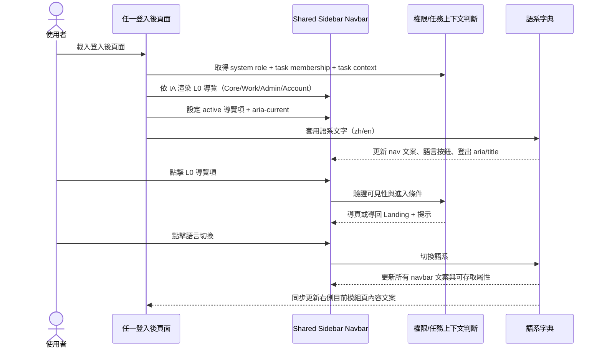
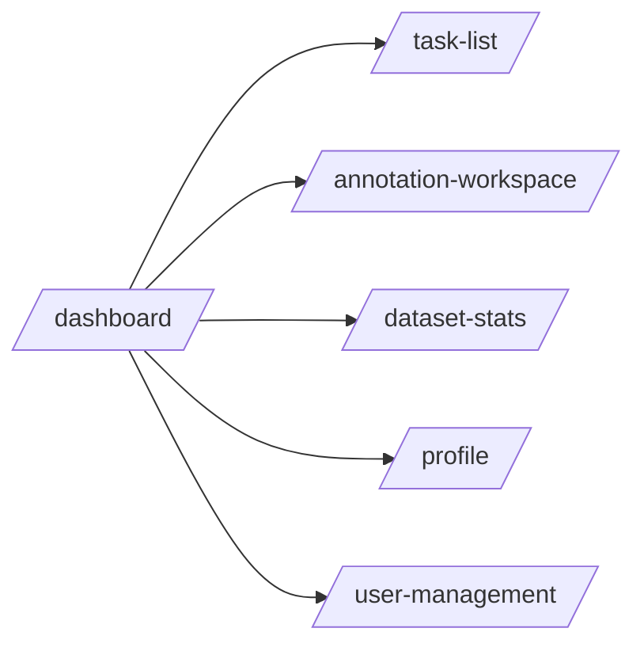

# 功能規格：Shared Sidebar Navbar（共用側欄導覽）

**功能分支**：`008-sidebar-navbar-shared`
**建立日期**：2026-04-16
**版本**：1.1.4
**狀態**：Clarified
**需求來源**：資訊架構 [`docs/product/ia/information-architecture.md`](../../../docs/product/ia/information-architecture.md) §2.1 Sidebar Navbar（跨模組共用）

## 規格常數

- `SIDEBAR_WIDTH = 240px`
- `MOBILE_BP = 767px`
- `MOBILE_TOP_HEIGHT = 64px`
- `MOBILE_BOTTOM_NAV_HEIGHT = 84px`
- `RWD_VIEWPORTS = 375px / 768px / 1440px`
- `SUPPORTED_PAGES = /dashboard, /task-list, /task-new, /task-detail, /annotation-workspace, /dataset-stats, /dataset-quality, /user-management, /role-settings, /profile`
- `ACTIVE_TASK_TYPE_STORAGE_KEY = labelsuite.activeTaskType`

## Process Flow

| 步驟 | 角色 | 動作 | 系統回應 |
|------|------|------|---------|
| 1 | 使用者 | 進入任一登入後頁面 | 載入共用 Sidebar Navbar |
| 2 | 系統 | 判斷目前頁與角色 | 套用 L0 可見項目、active 與 `aria-current="page"` |
| 3 | 使用者 | 點擊 L0 導覽項 | 符合權限則導頁；不符則導回 Landing 並顯示提示 |
| 4 | 使用者 | 點擊語言切換 | Sidebar 與右側目前模組頁文案、可存取屬性同步更新 |
| 5 | 使用者 | 點擊登出 | 導向 `../account/login.html`（原型導頁） |

---

## 使用者情境與測試 *(必填)*

### User Story 1 — L0 導覽需對齊 IA 模組（優先級：P1）

登入後使用者在任一模組頁面皆看到同一份 IA 定義的 L0 導覽骨架與順序。

**此優先級原因**：L0 導覽是跨模組一致性的核心，若不一致會造成導覽斷裂。

**獨立測試方式**：在 dashboard / task / annotation / dataset / admin / profile 頁比對 L0 項目、順序、命名。

**驗收情境**：

1. **Given** 進入 `/dashboard`，**When** 檢查 L0，**Then** 顯示 `儀表板、任務管理、標記作業、資料集分析、個人設定`。
2. **Given** 使用者 `system_role = super_admin`，**When** 檢查 L0，**Then** 額外顯示 `系統管理`。
3. **Given** 使用者 `system_role = user`，**When** 檢查 L0，**Then** 不顯示 `系統管理`。

**L0 群組與目標頁（IA Contract）**：

- Core：`儀表板` → `dashboard`
- Work：`任務管理` → `task-list`
- Work：`標記作業` → `annotation-workspace`
- Work：`資料集分析` → `dataset-stats`
- Admin：`系統管理` → `user-management`（僅 `super_admin` 可見）
- Account：`個人設定` → `profile`

**角色可見性與 L0 項目數（Desktop / Mobile 一致）**：

| 系統角色 | 可見 L0 項目 | 可見數量 |
|----------|--------------|----------|
| `user` | `儀表板 / 任務管理 / 標記作業 / 資料集分析 / 個人設定` | 5 |
| `super_admin` | `儀表板 / 任務管理 / 標記作業 / 資料集分析 / 系統管理 / 個人設定` | 6 |

> 備註：任務角色（`project_leader / reviewer / annotator`）只影響 `標記作業`、`資料集分析` 的進入 gating，不影響 L0 項目數；是否可見由系統角色決定。

---

### User Story 2 — Active 與模組內頁映射正確（優先級：P1）

使用者在模組 Landing 與次層頁切換時，active 項必須維持 IA 定義的 L0 映射。

**此優先級原因**：錯誤 active 會直接造成定位錯誤與模組歸屬混淆。

**獨立測試方式**：在 L1/L2 各頁驗證 active 狀態與 `aria-current`。

**驗收情境**：

1. **Given** 位於 `task-new` 或 `task-detail`，**When** 檢查 L0，**Then** `任務管理` 為 active。
2. **Given** 位於 `dataset-quality`，**When** 檢查 L0，**Then** `資料集分析` 為 active。
3. **Given** 位於 `role-settings`，**When** 檢查 L0，**Then** `系統管理` 為 active。

**L0 Active 映射規則**：

- `dashboard` → 儀表板
- `task-list` / `task-new` / `task-detail` → 任務管理
- `annotation-workspace` → 標記作業
- `dataset-stats` / `dataset-quality` → 資料集分析
- `user-management` / `role-settings` → 系統管理
- `profile` → 個人設定

---

### User Story 3 — 權限與任務上下文 gating 一致（優先級：P1）

使用者點擊具任務上下文需求的 L0 項目時，系統需一致處理授權與導回。

**此優先級原因**：權限導覽行為不一致將造成流程斷點與誤解。

**獨立測試方式**：使用不同 task role 及缺少 `task_id` 情境驗證導覽結果。

**驗收情境**：

1. **Given** 使用者無目前任務 `annotator/reviewer` 資格，**When** 點擊 `標記作業`，**Then** 導回 `dashboard` 並顯示提示。
2. **Given** 使用者無目前任務 `project_leader/reviewer` 資格，**When** 點擊 `資料集分析`，**Then** 導回 `task-list` 並顯示提示。
3. **Given** 進入 `task-detail` 但無任務成員資格，**When** 頁面初始化，**Then** 導回 `task-list`。

**gating 規則**：

- `系統管理`：僅 `super_admin` 可見（不渲染給 `user`）。
- `標記作業`：需當前任務 `annotator` 或 `reviewer`。
- `標記作業` 導頁時，若 `ACTIVE_TASK_TYPE_STORAGE_KEY` 有值，需附帶 `task_type` query 參數。
- `資料集分析`：需當前任務 `project_leader` 或 `reviewer`。
- 任務上下文頁缺 `task_id / membership`：導回模組 Landing（`dashboard` 或 `task-list`）並提示。

---

### User Story 4 — Desktop / Mobile 導覽可用性（優先級：P2）

在不同 viewport，使用者可保持同樣導覽能力與可存取語意。

**此優先級原因**：Sidebar 為全站主導覽，RWD 破版會直接影響任務操作效率。

**獨立測試方式**：在 `RWD_VIEWPORTS` 驗證版型、可點擊範圍與內容避讓。

**驗收情境**：

1. **Given** viewport `> MOBILE_BP`，**When** 載入頁面，**Then** 顯示左側固定 Sidebar（含品牌、L0、actions）。
2. **Given** viewport `<= MOBILE_BP`，**When** 載入頁面，**Then** 顯示上方品牌列 + 下方主導覽。
3. **Given** 行動版，**When** 操作 L0 導覽，**Then** 主要內容不被遮擋且導覽可點擊。

---

### 邊界情況

- zh/en 長度差異不得造成 L0 文字截斷到不可辨識。
- 行動版底部導覽不得遮擋頁面主要 CTA。
- i18n key 缺漏時需 fallback 文案，不得中斷導覽互動。
- 超長使用者姓名不得擠壓語言按鈕與登出按鈕可點擊區域。

---

## 需求規格 *(必填)*

### 功能需求

- **FR-001**：登入後頁面必須使用同一份 Sidebar Navbar contract。
- **FR-002**：L0 導覽項與順序必須符合 IA：`儀表板 / 任務管理 / 標記作業 / 資料集分析 / 系統管理(條件顯示) / 個人設定`。
- **FR-003**：`系統管理` 僅 `super_admin` 可見，不得渲染給 `user`。
- **FR-003A**：`user` 的 L0 可見項目數必須為 `5`；`super_admin` 的 L0 可見項目數必須為 `6`（多出 `系統管理`）。
- **FR-004**：`task-new`、`task-detail` 必須映射為 `任務管理` active。
- **FR-005**：`dataset-quality` 必須映射為 `資料集分析` active。
- **FR-006**：`role-settings` 必須映射為 `系統管理` active。
- **FR-007**：每頁僅允許一個 L0 active 項，且必須同時包含 active 樣式與 `aria-current="page"`。
- **FR-008**：`標記作業`、`資料集分析` 必須驗證任務角色與任務上下文，不符時導回 Landing 並提示。
- **FR-008A**：點擊 `標記作業` 時，若存在 `ACTIVE_TASK_TYPE_STORAGE_KEY`，導頁 URL 必須附帶 `task_type` query（避免覆蓋既有 query 參數）。
- **FR-009**：Navbar 必須支援 zh/en 切換，切換後同步更新文案、`aria-label`、`title`。
- **FR-009A**：使用者點擊語言切換後，右側內容區不論目前顯示 `dashboard / task-management / annotation / dataset / admin / account` 任一模組頁，皆必須同步切換為相同語系，不可僅更新 Sidebar。
- **FR-009B**：語言狀態必須跨頁持久化；導向任一 `SUPPORTED_PAGES` 後需維持同語系（建議實作：`localStorage`，key：`labelsuite.lang`）。
- **FR-010**：Navbar 必須提供桌面與行動版登出控制項。
- **FR-011**：`> MOBILE_BP` 使用左側固定 Sidebar；`<= MOBILE_BP` 使用上方品牌列 + 下方主導覽。
- **FR-012**：在 `RWD_VIEWPORTS` 下不得出現重疊、不可點擊、內容被導覽遮擋。

### User Flow & Navigation

| From | Trigger | To |
|------|---------|-----|
| 任一登入後頁 | 點擊「儀表板」 | `/dashboard` |
| 任一登入後頁 | 點擊「任務管理」 | `/task-list` |
| 任一登入後頁 | 點擊「標記作業」 | `/annotation-workspace`（需 task role/context） |
| 任一登入後頁 | 點擊「資料集分析」 | `/dataset-stats`（需 task role/context） |
| 任一登入後頁 | 點擊「系統管理」 | `/user-management`（僅 super_admin） |
| 任一登入後頁 | 點擊「個人設定」 | `/profile` |

### 關鍵實體

- `SharedNavbarContract`
  - `sections`: `brand-section`, `navbar-center`, `nav-actions`
  - `interactiveIds`: `langToggle`, `mobileLangToggle`, `logoutBtn`, `mobileLogoutBtn`
  - `userIds`: `userName`, `mobileUserName`, `roleIndicator`, `userAvatar`
  - `navIds`: `navDashboard`, `navTaskManagement`, `navAnnotation`, `navDataset`, `navAdmin`, `navProfile`
- `LanguageState`
  - `lang`: `zh` / `en`
  - `storage_key`: `labelsuite.lang`
- `ActiveTaskTypeState`
  - `task_type`: 值域需對齊 task registry（如 `single_sentence_classification`、`single_sentence_va_scoring`）
  - `storage_key`: `labelsuite.activeTaskType`

---

## 規格相依性

### 上游（本規格依賴）

| 規格編號 | 功能 | 本規格需要的內容 |
|---------|------|----------------|
| IA v7 | Information Architecture | L0/L1/L2 導覽模型、角色可見性、active 映射與 RWD 導覽定義 |
| 012 | Dashboard — 儀表板 | 既有 navbar 版型與 i18n 行為 |
| 005 | Profile Settings — 個人設定 | 既有 user chip 與 active 行為 |

### 下游（依賴本規格）

| 規格編號 | 功能 | 依賴本規格的內容 |
|---------|------|----------------|
| 012 | Dashboard — 儀表板 | 導入 IA 對齊後的 L0 導覽契約 |
| 005 | Profile Settings — 個人設定 | 導入 IA 對齊後的 L0 導覽契約 |
| 010/013/014 | Task Management | L0 `任務管理` + L2 active 映射規則 |
| 015 | Annotation Workspace | L0 `標記作業` + 任務角色 gating |
| 016/017 | Dataset | L0 `資料集分析` + `stats/quality` active 映射 |
| 006/007 | Admin | L0 `系統管理` 可見性與 active 映射 |

---

## 成功標準 *(必填)*

### 可量測成果

- **SC-001**：所有 `SUPPORTED_PAGES` 的 L0 導覽項與順序符合 IA 定義。
- **SC-002**：L1/L2 頁面的 L0 active 映射正確，且每頁僅一個 `aria-current="page"`。
- **SC-003**：`super_admin` 與 `user` 的 L0 可見性符合矩陣（僅 `super_admin` 可見 `系統管理`）。
- **SC-003A**：L0 可見項目數驗證通過：`user = 5`、`super_admin = 6`（Desktop / Mobile 皆一致）。
- **SC-004**：缺少任務角色或上下文時，`標記作業`/`資料集分析` 會導回 Landing 並顯示提示。
- **SC-004A**：點擊 `標記作業` 且存在 `labelsuite.activeTaskType` 時，導頁 URL 需包含 `task_type=<stored_value>`。
- **SC-005**：`RWD_VIEWPORTS` 下 navbar 無破版、無重疊、無不可點擊控制項。
- **SC-006**：在任一 `SUPPORTED_PAGES` 點擊語言切換後，Sidebar 與右側模組內容語系一致，且切頁後保持同一語系狀態。
- **SC-006A**：重新載入任一 `SUPPORTED_PAGES` 後，仍可恢復最後一次語言狀態（`zh` / `en`）。

### 驗證建議

- 建立 navbar contract 測試：逐頁驗證 L0 順序、active、`aria-current`、role visibility。
- 加入 gating smoke test：覆蓋無 task context 與無 membership 的導回行為。

---

## Changelog

| 版本 | 日期 | 變更摘要 |
|------|------|---------|
| 1.1.4 | 2026-04-23 | 同步 shared sidebar：新增 `labelsuite.activeTaskType` 導頁契約，點擊「標記作業」時附帶 `task_type` query |
| 1.1.3 | 2026-04-16 | 新增語言持久化機制規範（FR-009B / LanguageState / SC-006A），明確定義 `labelsuite.lang` 跨頁與重載一致性 |
| 1.1.2 | 2026-04-16 | 新增「角色可見性與 L0 項目數」矩陣，明確規範 `user=5`、`super_admin=6`，並補 FR/SC 可驗收條款 |
| 1.1.1 | 2026-04-16 | 新增全域語言切換規則：切換語言後 Sidebar 與右側任一模組頁需同步更新並保持一致 |
| 1.1.0 | 2026-04-16 | 依 IA v7 重新定義 L0 導覽項、角色可見性、L1/L2 active 映射、task context gating 與 `SUPPORTED_PAGES` |
| 1.0.2 | 2026-04-16 | 補上「規格相依性」與「Changelog」章節，對齊 dashboard spec 結構 |
| 1.0.1 | 2026-04-16 | 依 dashboard spec 風格重寫 shared navbar 規格（Process Flow、User Story、FR、SC） |
| 1.0.0 | 2026-04-16 | Shared sidebar navbar 初版規格建立 |
