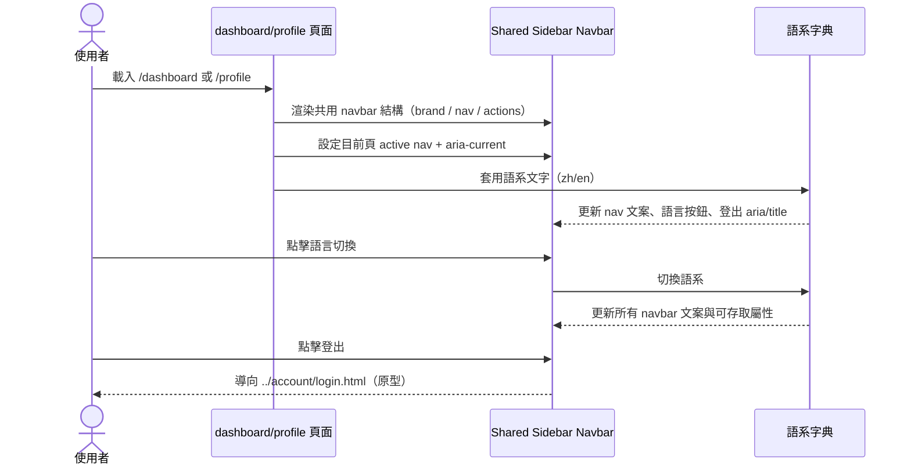
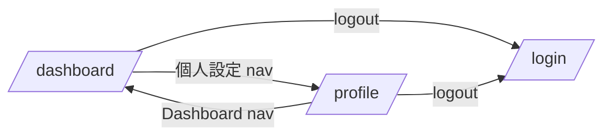

# 功能規格：Shared Sidebar Navbar（共用側欄導覽）

**功能分支**：`001-sidebar-navbar-shared`
**建立日期**：2026-04-16
**版本**：1.0.2
**狀態**：Clarified
**需求來源**：現行原型 [`design/prototype/pages/dashboard/dashboard.html`](../../../design/prototype/pages/dashboard/dashboard.html)、[`design/prototype/pages/account/profile.html`](../../../design/prototype/pages/account/profile.html) 的共用化需求

## 規格常數

- `SIDEBAR_WIDTH = 240px`
- `MOBILE_BP = 767px`
- `MOBILE_TOP_HEIGHT = 64px`
- `MOBILE_BOTTOM_NAV_HEIGHT = 84px`
- `RWD_VIEWPORTS = 375px / 768px / 1440px`
- `SUPPORTED_PAGES = /dashboard, /profile`

## Process Flow

| 步驟 | 角色 | 動作 | 系統回應 |
|------|------|------|---------|
| 1 | 使用者 | 進入 `/dashboard` 或 `/profile` | 頁面渲染共用 sidebar navbar |
| 2 | 系統 | 判斷當前頁 | 設定正確 active nav 與 `aria-current="page"` |
| 3 | 使用者 | 點擊語言切換 | navbar 文案與 `aria-label/title` 同步更新 |
| 4 | 使用者 | 點擊登出 | 導向 `../account/login.html`（原型導頁） |
| 5 | 系統 | 在行動版載入 | 切換為上方品牌列 + 下方主導覽，維持可操作性 |

---

## 使用者情境與測試 *(必填)*

### User Story 1 — 跨頁導覽外觀一致（優先級：P1）

使用者在 `/dashboard` 與 `/profile` 間切換時，navbar 結構、尺寸與主要互動元件位置需一致。

**此優先級原因**：導覽不一致會造成品牌與操作心智模型混亂，影響全站體驗。

**獨立測試方式**：桌面版比對兩頁 navbar 的品牌區、主選單、語言按鈕、user chip、登出按鈕。

**驗收情境**：

1. **Given** 位於 `/dashboard`，**When** 檢視側欄，**Then** 顯示品牌區、主選單與底部 user chip。
2. **Given** 位於 `/profile`，**When** 檢視側欄，**Then** 結構與 `/dashboard` 一致，僅 active 項目不同。
3. **Given** 兩頁同時比對，**When** 檢視語言按鈕與 user chip，**Then** 樣式規格一致（padding、字級、avatar、logout）。

**導覽區塊定義（需與原型一致）**：

- 區塊 A：`brand-section`
  - Logo + `Label Suite`
  - 語言按鈕（Desktop）
  - 行動版：使用者名稱 + 語言按鈕 + 登出按鈕
- 區塊 B：`navbar-center`
  - `Dashboard`
  - `Create Task / 建立任務`
  - `Annotation / 標記作業`
  - `Profile / 個人設定`
- 區塊 C：`nav-actions`（Desktop）
  - `user-chip`：頭像、姓名、角色
  - `logout-btn`

**導覽區塊行為規則**：

- `/dashboard` 與 `/profile` 必須使用同一份 navbar class contract。
- 同一語系下，兩頁 navbar 文字與控制項視覺必須一致。
- 僅 active nav 項目允許因頁面不同而改變。

---

### User Story 2 — Active 狀態與導頁語意正確（優先級：P1）

使用者所在頁的 nav item 必須正確標記 active，並符合可存取語意。

**此優先級原因**：active 錯誤會直接影響導航判讀與定位效率。

**獨立測試方式**：在 `/dashboard`、`/profile` 驗證 active 樣式、`aria-current="page"`、導頁行為。

**驗收情境**：

1. **Given** 位於 `/dashboard`，**When** 檢查 nav，**Then** `navDashboard` 為 active 且帶 `aria-current="page"`。
2. **Given** 位於 `/profile`，**When** 檢查 nav，**Then** `navProfile` 為 active 且帶 `aria-current="page"`。
3. **Given** 位於 `/profile`，**When** 點擊 `Dashboard`，**Then** 導頁至 `/dashboard` 並切換 active 狀態。

**導覽行為規則**：

- 每頁必須僅有一個主 nav item 具 active 狀態。
- active item 必須對應當前頁 URL。
- active 樣式與 `aria-current` 必須同步存在，不得只做其一。

---

### User Story 3 — 語言切換與行動版可用性（優先級：P2）

使用者在桌面/行動版切換語言與使用導覽時，navbar 需保持可操作且不破版。

**此優先級原因**：navbar 為高頻互動元件，RWD 與 i18n 問題會直接影響可用性。

**獨立測試方式**：在 `RWD_VIEWPORTS` 驗證 navbar 佈局、語言切換、登出按鈕與可存取屬性。

**驗收情境**：

1. **Given** viewport `<= MOBILE_BP`，**When** 載入頁面，**Then** 顯示上方品牌列與下方主導覽列。
2. **Given** 任一 viewport，**When** 點擊語言切換，**Then** `langLabel`、nav 文案、`aria-label/title` 同步更新。
3. **Given** viewport `<= MOBILE_BP`，**When** 操作導覽與主內容，**Then** 不發生遮擋、重疊或不可點擊。

**RWD 行為規則**：

- `> MOBILE_BP`：左側固定 sidebar（brand + nav + actions）。
- `<= MOBILE_BP`：上方固定品牌列 + 下方固定主導覽；內容區需預留上下空間。
- 行動版仍需保留語言切換與登出入口。

---

### 邊界情況

- `/dashboard` 與 `/profile` 預設使用者名稱不同時，不得造成 user chip 版型位移。
- zh/en 文案長度差異不得導致語言按鈕或 nav 文字溢出容器。
- 行動版底部導覽不得遮擋表單按鈕或主要 CTA。
- 某些 i18n key 缺漏時，頁面應維持可互動，不得中斷 navbar 事件。

---

## 需求規格 *(必填)*

### 功能需求

- **FR-001**：`/dashboard` 與 `/profile` 必須使用同一份 sidebar navbar 結構定義（`brand-section` / `navbar-center` / `nav-actions`）。
- **FR-002**：兩頁必須使用同一份 navbar 主要樣式 contract（語言按鈕、user chip、avatar、logout 規格一致）。
- **FR-003**：每頁必須正確設定唯一 active nav item，且該項目必須有 `aria-current="page"`。
- **FR-004**：navbar 必須支援 zh/en 切換，且切換後文字與可存取屬性（`aria-label`、`title`）同步更新。
- **FR-005**：navbar 必須提供語言切換控制項（Desktop: `langToggle`；Mobile: `mobileLangToggle`）。
- **FR-006**：navbar 必須提供登出控制項（Desktop: `logoutBtn`；Mobile: `mobileLogoutBtn`）。
- **FR-007**：`user-chip` 必須顯示頭像、姓名與角色資訊，並可在資料更新後同步反映名稱變更。
- **FR-008**：在 `> MOBILE_BP` 時，導覽必須維持左側固定 sidebar 呈現。
- **FR-009**：在 `<= MOBILE_BP` 時，導覽必須切換為上方品牌列 + 下方主導覽，並保留語言/登出可操作性。
- **FR-010**：在 `RWD_VIEWPORTS` 下，navbar 不得造成文字重疊、元件溢出、不可點擊或內容遮擋。

### User Flow & Navigation

| From | Trigger | To |
|------|---------|-----|
| `/dashboard` | 點擊「個人設定」 | `/profile` |
| `/profile` | 點擊「儀表板 / Dashboard」 | `/dashboard` |
| `/dashboard` | 點擊登出 | `/login` |
| `/profile` | 點擊登出 | `/login` |

### 關鍵實體

- `SharedNavbarContract`
  - `sections`: `brand-section`, `navbar-center`, `nav-actions`
  - `interactiveIds`: `langToggle`, `mobileLangToggle`, `logoutBtn`, `mobileLogoutBtn`
  - `userIds`: `userName`, `mobileUserName`, `roleIndicator`, `userAvatar`
  - `navIds`: `navDashboard`, `navCreateTask`, `navAnnotation`, `navProfile`

---

## 規格相依性 *(本功能依賴其他規格，或被其他規格依賴時填寫)*

### 上游（本規格依賴的規格）

| 規格編號 | 功能 | 本規格需要的內容 |
|---------|------|----------------|
| 012 | Dashboard — 儀表板 | 既有 sidebar navbar 結構、i18n key 與互動模式 |
| 005 | Profile Settings — 個人設定 | 既有 sidebar navbar 結構、active 狀態與 user chip 呈現規則 |
| 001 | Login — Email / Password | 登出導頁目標（原型為 `../account/login.html`） |

### 下游（依賴本規格的規格）

| 規格編號 | 功能 | 依賴本規格的內容 |
|---------|------|----------------|
| 012 | Dashboard — 儀表板 | 共用 navbar contract 與樣式一致性 |
| 005 | Profile Settings — 個人設定 | 共用 navbar contract 與樣式一致性 |
| TBC | 其他頁面（task/dataset/annotation） | 導入同一份 sidebar navbar 的結構、RWD、i18n 規範 |

---

## 成功標準 *(必填)*

### 可量測成果

- **SC-001**：`/dashboard` 與 `/profile` 的 navbar 主要元件視覺一致（語言按鈕、user chip、avatar、logout）。
- **SC-002**：兩頁 active nav 狀態正確且具備 `aria-current="page"`。
- **SC-003**：`RWD_VIEWPORTS` 下 navbar 無破版、無文字重疊、無不可點擊控制項。

### 驗證建議

- 以 screenshot diff 比對 `/dashboard` vs `/profile` 的 navbar 區域。
- 加入最小 UI smoke test：檢查 `langToggle` / `logoutBtn` 存在與可點擊、active nav 正確。

---

## Changelog

| 版本 | 日期 | 變更摘要 |
|------|------|---------|
| 1.0.2 | 2026-04-16 | 補上「規格相依性」與「Changelog」章節，對齊 dashboard spec 結構 |
| 1.0.1 | 2026-04-16 | 依 dashboard spec 風格重寫 shared navbar 規格（Process Flow、User Story、FR、SC） |
| 1.0.0 | 2026-04-16 | Shared sidebar navbar 初版規格建立 |
