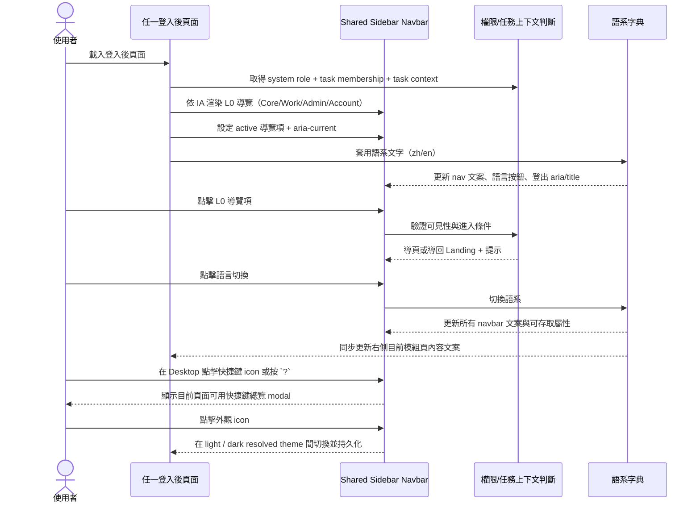
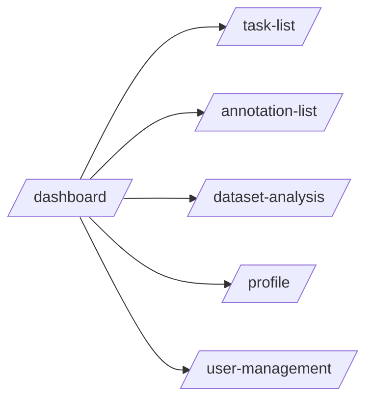

# 功能規格：Shared Sidebar Navbar（共用側欄導覽）

**需求來源**: 資訊架構 [docs/product/ia/information-architecture.md](../../../docs/product/ia/information-architecture.md) §2.1 Sidebar Navbar（跨模組共用）

## 輸入與生成規則

**輸入描述**：本規格需定義 Shared Sidebar Navbar 的跨頁共用 UI 契約、導覽/工具入口、狀態持久化、i18n、可存取屬性與 RWD 行為。

**產生規格時必須遵守**：

1. 先確認本規格範圍與需求來源一致：資訊架構 [docs/product/ia/information-architecture.md](../../../docs/product/ia/information-architecture.md) §2.1 Sidebar Navbar（跨模組共用）。
2. 若新增或改動角色權限、導頁、資料欄位、錯誤狀態、i18n、可存取屬性或響應式邊界，必須同步檢查使用者情境、功能需求、成功標準與規格相依性。
3. 若需求描述缺少角色、狀態、資料來源、權限、錯誤處理、導頁目標或量化門檻，需以待釐清標記記錄具體問題，不得自行假設。
4. 規格應描述使用者可觀察行為、業務規則與驗收條件；避免描述框架、檔案結構、API 實作或資料庫實作，除非該內容本身是已定義的產品契約。
5. 本規格若與 prototype、IA 或上游規格不一致，必須明確記錄差異、更新相依性，並新增 changelog。

**已釐清事項**：

- 本版以既有需求來源與本文件中的 流程圖、使用者情境、功能需求、成功標準 作為 scope baseline。
- 跨頁或跨模組共用行為需透過「規格相依性」追蹤，不在本文件中隱含建立未列出的依賴。
- 若後續新增實作層契約，需先確認是否構成行為變更；若是，必須依 SDD 流程更新 spec。

## Clarifications

### Session 2026-05-22

- Q: Mobile 版是否要顯示快捷鍵總覽入口？ → A: Mobile 完全不支援快捷鍵總覽入口與 `?`。
- Q: 使用者點擊 L0 `標記作業` / `資料集分析` 但缺少對應任務角色或 task context 時，應導回哪裡？ → A: `標記作業` 導回 `/dashboard`；`資料集分析` 導回 `/task-list`。
- Q: 通知 dropdown 的通知資料來源在本規格中應如何界定？ → A: 僅定義前端展示契約，通知資料由頁面或 prototype mock 提供。

## 規格常數

- `SIDEBAR_WIDTH = 240px`
- `SIDEBAR_COLLAPSED_WIDTH = 88px`
- `MOBILE_BP = 767px`
- `MOBILE_TOP_HEIGHT = 64px`
- `MOBILE_BOTTOM_NAV_HEIGHT = 84px`
- `RWD_VIEWPORTS = 375px / 768px / 1440px`
- `SUPPORTED_PAGES = /dashboard, /task-list, /task-new, /task-detail, /annotation-list, /annotation-workspace, /dataset-analysis, /dataset-analysis-detail/:task_id, /user-management, /role-settings, /profile`
- `ACTIVE_TASK_TYPE_STORAGE_KEY = labelsuite.activeTaskType`
- `SIDEBAR_COLLAPSED_STORAGE_KEY = labelsuite.sidebarCollapsed`
- `APPEARANCE_STORAGE_KEY = label-suite-theme`
- `APPEARANCE_MODES = light | dark | system`
- `APPEARANCE_DEFAULT_RESOLVED = light`（`system` 固定解析為 `light`，不跟隨 OS `prefers-color-scheme`）
- `SIDEBAR_UTILITY_ACTIONS = shortcut_help | appearance_toggle | notification_bell`
- `SHORTCUT_HELP_SCOPE = current_page_common_shortcuts`
- `NOTIFICATION_BADGE_MAX_DISPLAY = 9+`（未讀數超過 9 顯示 `9+`）
- `NOTIFICATION_DATA_SOURCE = page_or_prototype_mock`（本規格僅定義前端展示契約，不定義通知 API 或後端事件模型）

## 流程圖

```mermaid
sequenceDiagram
    actor 使用者
    participant 頁面 as 任一登入後頁面
    participant navbar as Shared Sidebar Navbar
    participant authz as 權限/任務上下文判斷
    participant i18n as 語系字典

    使用者->>頁面: 載入登入後頁面
    頁面->>authz: 取得 system role + task membership + task context
    頁面->>navbar: 依 IA 渲染 L0 導覽（Core/Work/Admin/Account）
    頁面->>navbar: 設定 active 導覽項 + aria-current
    頁面->>i18n: 套用語系文字（zh/en）
    i18n-->>navbar: 更新 nav 文案、語言按鈕、登出 aria/title

    使用者->>navbar: 點擊 L0 導覽項
    navbar->>authz: 驗證可見性與進入條件
    authz-->>navbar: 導頁或導回 Landing + 提示

    使用者->>navbar: 點擊語言切換
    navbar->>i18n: 切換語系
    i18n-->>navbar: 更新所有 navbar 文案與可存取屬性
    i18n-->>頁面: 同步更新右側目前模組頁內容文案

    使用者->>navbar: 在 Desktop 點擊快捷鍵 icon 或按 `?`
    navbar-->>使用者: 顯示目前頁面可用快捷鍵總覽 modal

    使用者->>navbar: 點擊外觀 icon
    navbar-->>頁面: 在 light / dark resolved theme 間切換並持久化
```

| 步驟 | 角色 | 動作 | 系統回應 |
|------|------|------|---------|
| 1 | 使用者 | 進入任一登入後頁面 | 載入共用 Sidebar Navbar |
| 2 | 系統 | 判斷目前頁與角色 | 套用 L0 可見項目、active 與 `aria-current="page"` |
| 3 | 使用者 | 點擊 L0 導覽項 | 符合權限則導頁；不符則導回 Landing 並顯示提示 |
| 4 | 使用者 | 點擊語言切換 | Sidebar 與右側目前模組頁文案、可存取屬性同步更新 |
| 5 | 使用者 | 點擊登出 | 導向 `../account/login.html`（原型導頁） |
| 6 | 使用者 | 點擊外觀切換（Appearance） | Sidebar 單鍵在 `light` / `dark` resolved theme 間切換，更新 `html[data-theme]`，持久化至 `APPEARANCE_STORAGE_KEY` |
| 7 | 使用者 | 在 Desktop 點擊快捷鍵 icon 或按 `?` | 開啟目前頁面可用快捷鍵總覽；不包含 task-specific 作答快捷鍵 |

---

## 使用者情境與測試 *(必填)*

### 使用者故事 1 — L0 導覽需對齊 IA 模組（優先級：P1）

登入後使用者在任一模組頁面皆看到同一份 IA 定義的 L0 導覽骨架與順序。

**此優先級原因**：L0 導覽是跨模組一致性的核心，若不一致會造成導覽斷裂。

**獨立測試方式**：在 dashboard / task / annotation / dataset / admin / profile 頁比對 L0 項目、順序、命名。

**驗收情境**：

1. **Given** 進入 `/dashboard`，**When** 檢查 L0，**Then** 顯示 `儀表板、任務管理、標記作業、資料集分析、個人設定`。
2. **Given** 使用者 `system_role = super_admin`，**When** 檢查 L0，**Then** 額外顯示 `系統管理`。
3. **Given** 使用者 `system_role = user`，**When** 檢查 L0，**Then** 不顯示 `系統管理`。

**L0 群組與目標頁（IA Contract）**：

- Core：`儀表板` → `dashboard`
- Work：`任務管理` → `task-list`
- Work：`標記作業` → `annotation-list`
- Work：`資料集分析` → `dataset-analysis-list`（產品路由 `/dataset-analysis`；prototype 檔案 `dataset-analysis-list.html`）
- Admin：`系統管理` → `user-management`（僅 `super_admin` 可見）
- Account：`個人設定` → `profile`

**角色可見性與 L0 項目數（Desktop / Mobile 一致）**：

| 系統角色 | 可見 L0 項目 | 可見數量 |
|----------|--------------|----------|
| `user` | `儀表板 / 任務管理 / 標記作業 / 資料集分析 / 個人設定` | 5 |
| `super_admin` | `儀表板 / 任務管理 / 標記作業 / 資料集分析 / 系統管理 / 個人設定` | 6 |

> 備註：任務角色（`project_leader / reviewer / annotator`）只影響 `標記作業`、`資料集分析` 的進入 gating，不影響 L0 項目數；是否可見由系統角色決定。

---

### 使用者故事 2 — Active 與模組內頁映射正確（優先級：P1）

使用者在模組 Landing 與次層頁切換時，active 項必須維持 IA 定義的 L0 映射。

**此優先級原因**：錯誤 active 會直接造成定位錯誤與模組歸屬混淆。

**獨立測試方式**：在 L1/L2 各頁驗證 active 狀態與 `aria-current`。

**驗收情境**：

1. **Given** 位於 `task-new` 或 `task-detail`，**When** 檢查 L0，**Then** `任務管理` 為 active。
2. **Given** 位於 `dataset-analysis-list` 或 `dataset-analysis-detail`，**When** 檢查 L0，**Then** `資料集分析` 為 active。
3. **Given** 位於 `role-settings`，**When** 檢查 L0，**Then** `系統管理` 為 active。

**L0 Active 映射規則**：

- `dashboard` → 儀表板
- `task-list` / `task-new` / `task-detail` → 任務管理
- `annotation-list` / `annotation-workspace` → 標記作業
- `dataset-analysis-list` / `dataset-analysis-detail` → 資料集分析
- `user-management` / `role-settings` → 系統管理
- `profile` → 個人設定

---

### 使用者故事 3 — 權限與任務上下文 gating 一致（優先級：P1）

使用者點擊具任務上下文需求的 L0 項目時，系統需一致處理授權與導回。

**此優先級原因**：權限導覽行為不一致將造成流程斷點與誤解。

**獨立測試方式**：使用不同 task role 及缺少 `task_id` 情境驗證導覽結果。

**驗收情境**：

1. **Given** 使用者無目前任務 `annotator/reviewer` 資格，**When** 點擊 `標記作業`，**Then** 導回 `dashboard` 並顯示提示。
2. **Given** 使用者無目前任務 `project_leader/reviewer` 資格，**When** 點擊 `資料集分析`，**Then** 導回 `task-list` 並顯示提示。
3. **Given** 進入 `task-detail` 但無任務成員資格，**When** 頁面初始化，**Then** 導回 `task-list`。

**gating 規則**：

- `系統管理`：僅 `super_admin` 可見（不渲染給 `user`）。
- `標記作業`：需當前任務 `annotator` 或 `reviewer`。
- `標記作業` 導頁時，若 `ACTIVE_TASK_TYPE_STORAGE_KEY` 有值，需附帶 `task_type` query 參數。
- `資料集分析`：需當前任務 `project_leader` 或 `reviewer`。
- 任務上下文頁缺 `task_id / membership`：`標記作業` 導回 `/dashboard`，`資料集分析` 導回 `/task-list`，並顯示提示。

---

### 使用者故事 4 — Desktop / Mobile 導覽可用性（優先級：P2）

在不同 viewport，使用者可保持同樣導覽能力與可存取語意。

**此優先級原因**：Sidebar 為全站主導覽，RWD 破版會直接影響任務操作效率。

**獨立測試方式**：在 `RWD_VIEWPORTS` 驗證版型、可點擊範圍與內容避讓。

**驗收情境**：

1. **Given** viewport `> MOBILE_BP`，**When** 載入頁面，**Then** 顯示左側固定 Sidebar（含品牌、L0、底部 utility actions、user chip）。
2. **Given** viewport `<= MOBILE_BP`，**When** 載入頁面，**Then** 顯示上方品牌列（含語言、外觀與登出控制，不顯示使用者姓名與快捷鍵入口）+ 下方主導覽。
3. **Given** 行動版，**When** 操作 L0 導覽，**Then** 主要內容不被遮擋且導覽可點擊。

### 使用者故事 5 — Desktop Sidebar Mini / Icon-only 可收合（優先級：P2）

Desktop 使用者可將左側 Sidebar 收合為 icon-only，以增加主內容寬度，且不影響導覽可用性。

**此優先級原因**：共享殼頁在資料密集頁（task-detail / annotation-workspace）需要更高可視區；收合行為須一致以避免跨頁心智切換。

**獨立測試方式**：在 `RWD_VIEWPORTS` 驗證桌機收合展開、空白區觸發、互動區排除、跨頁與重整狀態保持。

**驗收情境**：

1. **Given** viewport `> MOBILE_BP`，**When** 點擊 sidebar 非互動空白區，**Then** Sidebar 在 `SIDEBAR_WIDTH` 與 `SIDEBAR_COLLAPSED_WIDTH` 間切換。
2. **Given** viewport `> MOBILE_BP`，**When** 點擊 nav link / 語言切換 / 登出，**Then** 只執行原功能，不觸發 Sidebar 收合。
3. **Given** 先前已收合 Sidebar，**When** 重新整理或切換至其他 `SUPPORTED_PAGES`，**Then** 依 `SIDEBAR_COLLAPSED_STORAGE_KEY` 還原收合狀態。
4. **Given** viewport `<= MOBILE_BP`，**When** 點擊導覽區域，**Then** 不啟用 mini 收合，維持既有 mobile top+bottom nav 行為。

---

### 使用者故事 6 — Sidebar Utility 外觀模式切換（優先級：P2）

登入後使用者可透過 Sidebar 底部 utility icon 或 mobile top bar icon，在淺色（light）與深色（dark）resolved theme 間快速切換，切換後立即生效且跨頁保持一致。完整外觀偏好（包含 `system`）仍可在個人設定中呈現；Sidebar 僅提供單鍵快速切換。

**此優先級原因**：外觀偏好為全站橫切功能，Sidebar 是常駐快速操作入口；若切頁後狀態遺失或 FOUC 閃白，會明顯影響使用體驗。

**獨立測試方式**：透過 Sidebar utility icon 切換 light/dark，確認 `html[data-theme]` 即時更新；導向其他 `SUPPORTED_PAGES` 後重整，確認狀態從 `APPEARANCE_STORAGE_KEY` 恢復且無 FOUC。

**驗收情境**：

1. **Given** 使用者在任一登入後頁面且目前為 `light`，**When** 點擊 Sidebar Appearance icon（月亮），**Then** `html[data-theme="dark"]` 即時套用，全頁 CSS token 切換為深色，icon 改顯示太陽。
2. **Given** 使用者目前為 `dark`，**When** 點擊 Sidebar Appearance icon（太陽），**Then** `html[data-theme="light"]` 即時套用，icon 改顯示月亮。
3. **Given** 使用者選擇 `system`，**When** 任何 OS 設定，**Then** 頁面固定套用 `data-theme="light"`（`system` = app 預設 = light，不跟隨 OS）。
4. **Given** 重新整理或重開分頁，**When** 頁面載入，**Then** 從 `APPEARANCE_STORAGE_KEY` 恢復最後一次的 mode，且在首次繪製前完成 `data-theme` 設定。
5. **Given** `APPEARANCE_STORAGE_KEY` 不存在或值無效，**When** 頁面載入，**Then** 預設以 `system` mode 處理。
6. **Given** 使用者切換 zh/en，**When** 檢查 Appearance icon，**Then** `aria-label` / `title` 同步顯示「切換為深色/淺色模式」或 `Switch to dark/light mode`。

**Appearance 控制項行為規則**：

- 持久化 mode 仍允許三種值：`light`（固定淺色）、`dark`（固定深色）、`system`（app 預設淺色）。
- Sidebar utility Appearance 控制項為單一 icon button：目前 `light` 時顯示月亮（下一步切至 `dark`）；目前 `dark` 時顯示太陽（下一步切至 `light`）。不得同時顯示多個外觀 icon。
- 切換後立即更新 `html[data-theme]`（`light` 或 `dark`），不需重新整理。
- 狀態持久化至 `APPEARANCE_STORAGE_KEY`（`localStorage`）。
- 頁面 `<head>` 必須在 CSS 載入前執行同步 JS 讀取 `APPEARANCE_STORAGE_KEY` 並設定 `data-theme`，防止 FOUC（實作於 `design/prototype/assets/theme-fouc.js`）。
- `system` 模式解析為 `light`；Sidebar utility 第一次點擊時應切換並持久化為 `dark`。

---

### 使用者故事 7 — 快捷鍵總覽入口（優先級：P2）

登入後 Desktop 使用者可從 Sidebar utility icon 或 `?` 開啟快捷鍵總覽，查看目前頁面可用的跨任務共用快捷鍵；Mobile 不提供快捷鍵總覽入口，也不支援以 `?` 開啟。

**此優先級原因**：快捷鍵是輔助操作，不應成為主導覽項，但使用者在標記/審核作業中需能快速查詢。

**獨立測試方式**：在 desktop 開啟快捷鍵 modal，切換 zh/en，確認入口、modal 標題、section 與 keycap 顯示皆正確；在 mobile 驗證 keyboard 入口不存在且 `?` 不觸發 modal。

**驗收情境**：

1. **Given** viewport `> MOBILE_BP`，**When** 使用者查看 Sidebar 底部 utility row，**Then** 顯示 icon-only keyboard button，不顯示「快捷鍵」文字。
2. **Given** viewport `<= MOBILE_BP`，**When** 載入頁面，**Then** mobile top bar 不顯示 keyboard icon 入口，且按 `?` 不開啟快捷鍵總覽。
3. **Given** viewport `> MOBILE_BP`，**When** 使用者點擊 keyboard icon 或按 `?`，**Then** 開啟 modal 並顯示目前頁面可用快捷鍵總覽。
4. **Given** 快捷鍵含多個按鍵，**When** 顯示於 modal，**Then** 每個按鍵必須以獨立 keycap 呈現，不得以 `Ctrl / Cmd + S` 這類連續文字呈現。
5. **Given** 使用者切換 zh/en，**When** 檢查快捷鍵入口與 modal，**Then** `aria-label`、標題、說明與 section 文案同步切換。
6. **Given** 快捷鍵總覽列出多個方向或決策動作，**When** 使用者檢視清單，**Then** 每個 action 必須獨立成列；例如 `上一筆` 與 `下一筆` 不得合併成 `上一筆 / 下一筆`，`通過目前結果` 與 `退回目前結果（限正式標記）` 也不得合併。

**快捷鍵總覽行為規則**：

- `shortcut_help` 不屬於 L0 主導覽，不新增 sidebar nav item。
- Desktop 入口位於 Sidebar 底部 utility row；Mobile 不提供入口，且 `?` 不觸發快捷鍵總覽。
- Modal 只顯示跨任務共用快捷鍵；不得納入 task-specific 作答快捷鍵（例如 label `1-9`、NER entity type、relation type、VA scoring）。
- Keycap 使用獨立元素呈現，例如 `CTRL`、`CMD`、`S` 三個 keycap，而不是單一文字字串。
- 一個 shortcut action 必須對應一列；不得將兩個 action 合併為同一列，即使它們使用相近的 modifier key。
- `Esc` 可關閉快捷鍵 modal；點擊 backdrop 可關閉 modal。

---

### 邊界情況

- zh/en 長度差異不得造成 L0 文字截斷到不可辨識。
- 行動版底部導覽不得遮擋頁面主要 CTA。
- i18n key 缺漏時需 fallback 文案，不得中斷導覽互動。
- 行動版 top brand bar 不得呈現使用者姓名；最下方 icon-only sidebar footer 必須優先呈現登出按鈕，不得以使用者姓名或頭像取代登出控制。
- 各模組頁若有頁內或全域 anchor 樣式，仍不得讓 Shared Sidebar 的品牌連結或 L0 導覽連結出現文字底線。
- `APPEARANCE_STORAGE_KEY` 值無效（非 `light`/`dark`/`system`）時，fallback 為 `system`，不拋出例外。
- `prefers-color-scheme` 不支援的舊瀏覽器，`system` mode 應 fallback 為 `light`。
- Sidebar utility actions 為 icon-only 時，必須保留 `aria-label` 與 `title`，且 zh/en 切換後同步更新。
- Desktop 快捷鍵 modal 在較窄 viewport 不得讓 keycap 擠壓或覆蓋 action 名稱。

---

## 需求規格 *(必填)*

### 功能需求

- **FR-001**：登入後頁面必須使用同一份 Sidebar Navbar contract。
- **FR-002**：L0 導覽項與順序必須符合 IA：`儀表板 / 任務管理 / 標記作業 / 資料集分析 / 系統管理(條件顯示) / 個人設定`。
- **FR-003**：`系統管理` 僅 `super_admin` 可見，不得渲染給 `user`。
- **FR-003A**：`user` 的 L0 可見項目數必須為 `5`；`super_admin` 的 L0 可見項目數必須為 `6`（多出 `系統管理`）。
- **FR-004**：`task-new`、`task-detail` 必須映射為 `任務管理` active。
- **FR-005**：`dataset-analysis-list` 與 `dataset-analysis-detail` 必須映射為 `資料集分析` active。
- **FR-006**：`role-settings` 必須映射為 `系統管理` active。
- **FR-007**：每頁僅允許一個 L0 active 項，且必須同時包含 active 樣式與 `aria-current="page"`。
- **FR-008**：`標記作業`、`資料集分析` 必須驗證任務角色與任務上下文；不符時 `標記作業` 導回 `/dashboard`，`資料集分析` 導回 `/task-list`，並顯示提示。
- **FR-008A**：點擊 `標記作業` 時，若存在 `ACTIVE_TASK_TYPE_STORAGE_KEY`，導頁 URL 必須附帶 `task_type` query（避免覆蓋既有 query 參數）。
- **FR-009**：Navbar 必須支援 zh/en 切換，切換後同步更新文案、`aria-label`、`title`。
- **FR-009A**：使用者點擊語言切換後，右側內容區不論目前顯示 `dashboard / task-management / annotation / dataset / admin / account` 任一模組頁，皆必須同步切換為相同語系，不可僅更新 Sidebar。
- **FR-009B**：語言狀態必須跨頁持久化；導向任一 `SUPPORTED_PAGES` 後需維持同語系（建議實作：`localStorage`，key：`labelsuite.lang`）。
- **FR-010**：Navbar 必須提供桌面與行動版登出控制項。
- **FR-010A**：Mobile / icon-only sidebar footer 必須顯示登出按鈕；使用者姓名不得佔用該位置。
- **FR-011**：`> MOBILE_BP` 使用左側固定 Sidebar；`<= MOBILE_BP` 使用上方品牌列 + 下方主導覽。
- **FR-011A**：Mobile top brand bar 的右側工具列（語言、外觀、通知、登出）在 `dashboard / task-management / annotation / dataset / admin / account` 模組必須共用一致尺寸、間距、圓角與不可壓縮行為；品牌區需以 `flex: 1` 讓位，避免 icon button 被擠壓。
- **FR-012**：在 `RWD_VIEWPORTS` 下不得出現重疊、不可點擊、內容被導覽遮擋。
- **FR-013**：Shared Sidebar 樣式必須集中於 `design/prototype/pages/shared/sidebar.css`，使用共用 Sidebar 的頁面不得再頁內重複定義同一套 sidebar 規則。
- **FR-013A**：Shared Sidebar 範圍內的品牌連結與 L0 模組導覽連結在 default / hover / focus / active 狀態皆不得顯示文字底線；此規則不得影響頁面主要內容區的一般文字連結。
- **FR-014**：Desktop（`> MOBILE_BP`）必須支援 `Mini / Icon-only` 收合 Sidebar，收合寬度為 `SIDEBAR_COLLAPSED_WIDTH`。
- **FR-014A**：Desktop 收合觸發必須為 sidebar 非互動空白區；互動元素（`a`、`button`、`input/select/textarea`、含語意按鈕角色元素）不得觸發收合。
- **FR-014B**：Sidebar 收合狀態必須持久化於 `SIDEBAR_COLLAPSED_STORAGE_KEY`，並在 `SUPPORTED_PAGES` 間保持一致。
- **FR-014C**：Mobile（`<= MOBILE_BP`）不得啟用 mini/icon-only 收合互動，避免與 bottom nav 操作衝突。
- **FR-014D**：Desktop 收合狀態（`SIDEBAR_COLLAPSED_WIDTH`）下，`shortcut_help` 入口（`shortcutHelpBtn`）必須隱藏；`appearance_toggle`（`sidebarThemeToggleBtn`）與 `notification_bell`（`notificationBellBtn`）維持可見。
- **FR-015**：Sidebar 必須提供 icon-only Appearance 快速切換控制項，在 `light` / `dark` resolved theme 間切換。
- **FR-015A**：`light` → `html[data-theme="light"]`；`dark` → `html[data-theme="dark"]`；`system` → 固定解析為 `html[data-theme="light"]`（app 預設；不跟隨 OS `prefers-color-scheme`）。
- **FR-015B**：Appearance 選擇後必須立即套用，並持久化至 `APPEARANCE_STORAGE_KEY`，在所有 `SUPPORTED_PAGES` 間保持一致。
- **FR-015C**：每個 `SUPPORTED_PAGES` 的 `<head>` 必須在樣式表載入前執行同步 JS（`theme-fouc.js`），讀取 `APPEARANCE_STORAGE_KEY` 並設定 `html[data-theme]`，防止 FOUC。
- **FR-015D**：`APPEARANCE_STORAGE_KEY` 不存在或值無效時，預設 mode 為 `system`。
- **FR-015E**：Appearance icon 必須一次只顯示一個狀態提示 icon：`light` 顯示月亮（可切 dark）、`dark` 顯示太陽（可切 light）。
- **FR-015F**：Appearance icon 的 `aria-label` / `title` 必須支援 zh/en，並依下一步動作顯示「切換為深色/淺色模式」。
- **FR-016**：Sidebar 必須在 Desktop 提供 icon-only 快捷鍵總覽入口，位於 Sidebar 底部 utility row；Mobile 不得顯示快捷鍵總覽入口。
- **FR-016A**：Desktop 快捷鍵入口必須可由 `?` 開啟，並可由 `Esc` 或 backdrop 關閉；Mobile 按 `?` 不得開啟快捷鍵總覽。
- **FR-016B**：Desktop 快捷鍵總覽 modal 必須支援 zh/en，並同步更新 `aria-label`、標題、說明與 section 文案。
- **FR-016C**：Desktop 快捷鍵總覽 modal 中的快捷鍵按鍵必須以獨立 keycap 元素呈現，不得以合併字串呈現。
- **FR-016D**：快捷鍵總覽第一版僅顯示跨任務共用快捷鍵，不得納入 task-specific 作答快捷鍵。
- **FR-016E**：快捷鍵總覽中每個 action 必須獨立成列，不得將相反或相關 action 合併顯示（例如不得以 `上一筆 / 下一筆`、`通過 / 退回目前結果` 作為單一列）。
- **FR-016G**（v1.4.0 新增）：`審核` section 僅列出 `A`（`通過目前結果`）與 `R`（`退回目前結果（限正式標記）`，v1.4.1 起標籤註記退回僅限 official_run，見 annotation-015 AC-3.15／AC-6.4）兩列；批次快捷鍵 `Shift+A`（全部通過）與 `Shift+R`（全部退回）**不得**出現於總覽——annotation-015 v4.0.0 起審核單位為「樣本 × 標記員」，一次審核只涉及一位標記員，批次操作已無可批次的對象（其行為定義見 annotation-015 FR-054）。總覽只承諾實際存在的快捷鍵。
- **FR-016F**：Desktop 快捷鍵總覽 modal 採緊湊視覺密度：section 標題以小寫全大寫（uppercase、muted 色）呈現；每列 action 間距僅以 padding 分隔，列與列之間不加分隔線；按鍵標籤為緊湊尺寸（≤28px 高），複合按鍵間距 ≤6px。
- **FR-017**：登入後模組頁若包含最上層 `h1` 頁首標題與副標題，該 heading block 必須對齊 Dashboard baseline：`1440px` desktop viewport 下與 Dashboard 相同的左上位置、`28px` serif title、`14px / 1.8` subtitle、title/subtitle 間距 `4px`、heading block 下方留白 `24px`。
- **FR-018**：Sidebar 必須提供通知鈴鐺（`notification_bell`）入口；Desktop 位於 Sidebar 底部 utility row（`notificationBellBtn`），Mobile 位於 top brand bar（`mobileNotificationBellBtn`）。
- **FR-018A**：未讀通知數必須以紅色 badge 顯示於鈴鐺右上角；未讀數為 0 時不顯示 badge；超過 9 顯示 `NOTIFICATION_BADGE_MAX_DISPLAY`。
- **FR-018B**：Desktop `notificationBellBtn` 與 Mobile `mobileNotificationBellBtn` 的 badge 顯示與 `aria-expanded` 狀態必須同步。
- **FR-018C**：點擊鈴鐺開啟通知 dropdown（含通知列表與「全部標為已讀」操作）；再次點擊或點擊空白處關閉。
- **FR-018C1**：通知 dropdown 內容必須完整支援語系切換；標題、操作文案、通知事件句型、任務名稱、行為者顯示名稱與相對時間皆需依目前語系呈現，不得中英混用。
- **FR-018D**：通知 dropdown 定位規則：Desktop 展開時 `left: SIDEBAR_WIDTH`；Desktop 收合時 `left: SIDEBAR_COLLAPSED_WIDTH`；Mobile 時 `top: MOBILE_TOP_HEIGHT`，靠右對齊。
- **FR-018E**：通知 dropdown 不提供跳轉「通知設定」連結；通知偏好設定位於 `/profile` 通知設定區塊（見 spec 005 FR-013B）。
- **FR-018F**：通知資料來源由目前頁面或 prototype mock 提供；本規格僅定義 Shared Navbar 前端展示契約，不新增通知 API、後端事件模型或跨模組資料擁有權。

### 使用者流程與導頁

```mermaid
flowchart LR
    dashboard[/dashboard/]
    taskList[/task-list/]
    annotation[/annotation-list/]
    datasetList[/dataset-analysis/]
    adminUsers[/user-management/]
    profile[/profile/]

    dashboard --> taskList
    dashboard --> annotation
    dashboard --> datasetList
    dashboard --> profile
    dashboard --> adminUsers
```

| From | Trigger | To |
|------|---------|-----|
| 任一登入後頁 | 點擊「儀表板」 | `/dashboard` |
| 任一登入後頁 | 點擊「任務管理」 | `/task-list` |
| 任一登入後頁 | 點擊「標記作業」 | `/annotation-list`（prototype: `../annotation/annotation-list.html`；需 task role/context） |
| 任一登入後頁 | 點擊「資料集分析」 | `/dataset-analysis`（prototype: `../dataset/dataset-analysis-list.html`；需 task role/context） |
| 任一登入後頁 | 點擊「系統管理」 | `/user-management`（僅 super_admin） |
| 任一登入後頁 | 點擊「個人設定」 | `/profile` |
| 任一登入後頁（Desktop） | 點擊 keyboard icon / 按 `?` | 開啟快捷鍵總覽 modal |
| 任一登入後頁 | 點擊 Appearance icon | 切換 `html[data-theme]` light/dark，不導頁 |

### 關鍵實體

- `SharedNavbarContract`
  - `sections`: `brand-section`, `navbar-center`, `nav-actions`
  - `interactiveIds`: `langToggle`, `mobileLangToggle`, `shortcutHelpBtn`, `sidebarThemeToggleBtn`, `mobileThemeToggleBtn`, `notificationBellBtn`, `mobileNotificationBellBtn`, `logoutBtn`, `mobileLogoutBtn`
  - `userIds`: `userName`, `roleIndicator`, `userAvatar`
  - `navIds`: `navDashboard`, `navTaskManagement`, `navAnnotation`, `navDataset`, `navAdmin`, `navProfile`
- `LanguageState`
  - `lang`: `zh` / `en`
  - `storage_key`: `labelsuite.lang`
- `ActiveTaskTypeState`
  - `task_type`: 值域需對齊 task registry（如 `single_sentence_classification`、`single_sentence_va_scoring`）
  - `storage_key`: `labelsuite.activeTaskType`
- `SidebarCollapsedState`
  - `collapsed`: `true` / `false`
  - `storage_key`: `labelsuite.sidebarCollapsed`
  - `desktop_only`: 僅在 `> MOBILE_BP` 生效
- `AppearanceState`
  - `mode`: `light` | `dark` | `system`（使用者的選擇，持久化值）
  - `resolved_theme`: `light` | `dark`（實際套用至 `html[data-theme]` 的值；`mode=dark` → `dark`，其餘皆 → `light`）
  - `storage_key`: `label-suite-theme`
  - `sidebar_toggle`: 單鍵 light/dark 快速切換；目前 `light` 顯示 moon icon，下一步為 `dark`；目前 `dark` 顯示 sun icon，下一步為 `light`
- `ShortcutHelpState`
  - `is_open`: `true` / `false`
  - `scope`: `current_page_common_shortcuts`
  - `entry_points`: `shortcutHelpBtn` / `?`（Desktop only）
  - `excluded_shortcuts`: task-specific 作答快捷鍵（label hotkeys、NER/relation/aspect/score hotkeys）
- `NotificationDisplayState`
  - `unread_count`: `0` 或正整數；大於 `9` 時 badge 顯示 `9+`
  - `is_open`: `true` / `false`
  - `source`: `page_or_prototype_mock`
  - `contract_scope`: 前端展示狀態；不包含通知 API 或後端事件模型

---

## Prototype Traceability

| Artifact | Responsibility | Covered FR/SC | Verification | Status |
|----------|----------------|---------------|--------------|--------|
| [design/prototype/pages/shared/sidebar.js](../../../design/prototype/pages/shared/sidebar.js) [design/prototype/pages/shared/sidebar.css](../../../design/prototype/pages/shared/sidebar.css) | Shared sidebar/navbar component: navigation, role-based menu, language toggle, notification dropdown, keyboard shortcuts overview, and RWD only; not exclusive to any single page — reused as-is (`<script src="../shared/sidebar.js">`) by every module's shell page. Consumed by 14 pages across account (5), admin (2), annotation (2), dashboard (1), dataset (2), task-management (3). | All FR/SC in this spec | [design/prototype/tests/shared/](../../../design/prototype/tests/shared/) (`sidebar-*.spec.ts`, `mobile-top-actions.spec.ts`) | Active; shared component |
| [design/prototype/components-showcase.html](../../../design/prototype/components-showcase.html) | Living styleguide reference for shared component visual states; not a functional consumer page. | No additional FR/SC | [design/prototype/tests/shared/](../../../design/prototype/tests/shared/) (`components-showcase*.spec.ts`) | Active; reference only |

---

## 規格相依性

### 上游（本規格依賴）

| 規格編號 | 功能 | 本規格需要的內容 |
|---------|------|----------------|
| IA v7 | Information Architecture | L0/L1/L2 導覽模型、角色可見性、active 映射與 RWD 導覽定義 |
| 012 | Dashboard — 儀表板 | 既有 navbar 版型與 i18n 行為 |
| 005 | Profile Settings — 個人設定 | 既有 user chip 與 active 行為 |

### 下游（依賴本規格）

| 規格編號 | 功能 | 依賴本規格的內容 |
|---------|------|----------------|
| 012 | Dashboard — 儀表板 | 導入 IA 對齊後的 L0 導覽契約 |
| 005 | Profile Settings — 個人設定 | 導入 IA 對齊後的 L0 導覽契約 |
| 010/013/014 | Task Management | L0 `任務管理` + L2 active 映射規則 |
| 015 | Annotation Workspace | L0 `標記作業` + 任務角色 gating |
| 016/017 | Dataset | L0 `資料集分析` + `stats/quality` active 映射 |
| 006/007 | Admin | L0 `系統管理` 可見性與 active 映射 |

---

## 成功標準 *(必填)*

### 可量測成果

- **SC-001**：所有 `SUPPORTED_PAGES` 的 L0 導覽項與順序符合 IA 定義。
- **SC-002**：L1/L2 頁面的 L0 active 映射正確，且每頁僅一個 `aria-current="page"`。
- **SC-003**：`super_admin` 與 `user` 的 L0 可見性符合矩陣（僅 `super_admin` 可見 `系統管理`）。
- **SC-003A**：L0 可見項目數驗證通過：`user = 5`、`super_admin = 6`（Desktop / Mobile 皆一致）。
- **SC-004**：缺少任務角色或上下文時，`標記作業` 會導回 `/dashboard`，`資料集分析` 會導回 `/task-list`，並顯示提示。
- **SC-004A**：點擊 `標記作業` 且存在 `labelsuite.activeTaskType` 時，導頁 URL 需包含 `task_type=<stored_value>`。
- **SC-005**：`RWD_VIEWPORTS` 下 navbar 無破版、無重疊、無不可點擊控制項。
- **SC-005A**：在 `375px` mobile viewport 下，所有共用 Sidebar 模組頁的 top brand bar 工具列視覺尺寸必須與 Task Management baseline 一致，icon-only 按鈕不得被壓縮。
- **SC-005B**：在 `dashboard / task-management / annotation / dataset / admin / account` 共用 Sidebar 模組頁，`.navbar-brand` 與 `.navbar-center .nav-link` 的 computed `text-decoration-line` 必須為 `none`。
- **SC-006**：在任一 `SUPPORTED_PAGES` 點擊語言切換後，Sidebar 與右側模組內容語系一致，且切頁後保持同一語系狀態。
- **SC-006A**：重新載入任一 `SUPPORTED_PAGES` 後，仍可恢復最後一次語言狀態（`zh` / `en`）。
- **SC-007**：Desktop 可在 `SIDEBAR_WIDTH` / `SIDEBAR_COLLAPSED_WIDTH` 間切換，且收合後保留 icon 導覽可辨識與 active 狀態可見。
- **SC-007A**：點擊 sidebar 非互動空白區會觸發收合；點擊 nav link / 語言切換 / 登出不會觸發收合。
- **SC-007B**：`SIDEBAR_COLLAPSED_STORAGE_KEY` 在重整與跨頁後可還原最後收合狀態。
- **SC-007C**：Mobile viewport 下收合互動不生效，且 top+bottom nav 操作不受影響。
- **SC-007D**：icon-only sidebar footer 顯示 `logoutBtn` 並隱藏使用者姓名/頭像，使用者可直接登出。
- **SC-008**：Appearance 切換後，`html[data-theme]` 即時更新，全頁 CSS token（`tokens.css` dark override）正確套用。
- **SC-008A**：重新整理或切換至任一 `SUPPORTED_PAGES`，Appearance 從 `APPEARANCE_STORAGE_KEY` 恢復，首次繪製不出現 FOUC。
- **SC-008B**：`system` 模式下，無論 OS `prefers-color-scheme` 為何，`html[data-theme]` 固定為 `light`。
- **SC-008C**：`APPEARANCE_STORAGE_KEY` 不存在或無效時，系統預設為 `system` mode，且不拋出 JS 例外。
- **SC-008D**：Sidebar Appearance icon 在 `light` 時顯示月亮且點擊後切至 `dark`；在 `dark` 時顯示太陽且點擊後切至 `light`；同一時間不得同時顯示太陽與月亮。
- **SC-008E**：Sidebar Appearance icon 的 `aria-label` / `title` 隨 zh/en 與下一步動作同步更新。
- **SC-009**：Desktop Sidebar 底部 utility row 在展開狀態顯示 keyboard、appearance、notification bell 三個 icon-only 入口；收合時 keyboard 入口隱藏，appearance 與 notification bell 維持可見。Mobile top bar 顯示 appearance 與 notification bell 入口（keyboard 在 mobile 上不顯示）。
- **SC-009A**：Desktop 點擊 keyboard icon 或按 `?` 可開啟快捷鍵總覽 modal；按 `Esc` 或點擊 backdrop 可關閉。Mobile 不顯示 keyboard icon，且按 `?` 不開啟快捷鍵總覽。
- **SC-009B**：快捷鍵總覽 modal 的 zh/en 文案、section 與可存取屬性同步切換。
- **SC-009C**：快捷鍵總覽中的複合快捷鍵以獨立 keycap 呈現，例如 `CTRL`、`CMD`、`S` 為三個元素。
- **SC-009D**（v1.4.0 修訂）：快捷鍵總覽不得出現合併 action 列；`上一筆`、`下一筆`、`通過目前結果`、`退回目前結果（限正式標記）` 各自獨立顯示，且 `全部通過`、`全部退回` 兩列為 0 個 DOM 節點（見 FR-016G）。
- **SC-010**：在 `1440px` desktop viewport 下，`dashboard / task-management / annotation / dataset / admin / account` 主要模組頁的最上層 heading block 與 Dashboard baseline 的計算位置與 typography 相符。
- **SC-011**：Desktop `notificationBellBtn` 與 Mobile `mobileNotificationBellBtn` 的 badge 未讀數與 `aria-expanded` 在 dropdown 開關時同步一致。
- **SC-011A**：未讀數 = 0 時 badge 不顯示；1–9 顯示實際數字；>9 顯示 `9+`。
- **SC-011B**：Mobile 通知鈴鐺（`mobileNotificationBellBtn`）視覺樣式與 `mobileThemeToggleBtn` 一致（34×34、`border: 1px solid var(--color-border)`、白底、hover 切 primary）。
- **SC-011C**：通知 dropdown 不包含「通知設定」跳轉連結；通知偏好設定入口位於 `/profile`（spec 005）。
- **SC-011D**：語系為 `en` 時，通知 dropdown 不得顯示中文任務名稱或中文相對時間；語系為 `zh` 時，通知 dropdown 不得顯示英文事件句型。
- **SC-011E**：Shared Navbar 可使用頁面或 prototype mock 提供的通知資料渲染 badge 與 dropdown；驗收不得要求本規格提供通知 API 或後端事件模型。

### 驗證建議

- 建立 navbar contract 測試：逐頁驗證 L0 順序、active、`aria-current`、role visibility。
- 加入 gating smoke test：覆蓋無 task context 與無 membership 的導回行為。
- 加入 utility smoke test：驗證 Desktop keyboard icon、快捷鍵 modal i18n 與 keycap 呈現；驗證 Mobile 不顯示 keyboard icon 且 `?` 不觸發 modal；驗證 Appearance icon。
- 加入 sidebar link decoration smoke test：逐頁驗證品牌與 L0 模組導覽連結不被頁內 anchor 樣式套用底線。

---

## 審查與驗收清單

### 內容品質

- [x] 規格聚焦使用者可觀察行為、業務規則與驗收條件。
- [x] 所有必填章節已完成；不適用的內容已明確排除或未納入本版範圍。
- [x] 無未解決的待釐清標記殘留。
- [x] 需求、驗收情境與成功標準皆可測試。

### Label Suite 合規性

- [x] 功能分支格式符合 `feat/[module]/NNN-feature`。
- [x] 已檢查本規格未要求跨 feature import；跨模組共用行為需透過 shared contract 或規格相依性追蹤。
- [x] 本規格不新增 task type 邏輯；若後續接觸任務行為，需回到 config-driven task architecture 檢查。
- [x] 已檢查 annotator-facing API / UI 不得暴露 test-set answer、ground-truth 或等價特權資料。
- [x] Prototype / IA / 上游規格 source of truth 已列於需求來源或規格相依性。
- [x] 上下游規格相依性已列出；若本規格改版，需檢查 downstream 影響。

### 執行狀態

- [x] 輸入描述已解析。
- [x] 角色、互動、資料狀態與限制已萃取。
- [x] 模糊點已釐清或明確排除於本版範圍。
- [x] 使用者情境已定義。
- [x] 功能需求已定義。
- [x] 關鍵實體或狀態模型已定義。
- [x] Review checklist 已通過。

---

## Changelog

| 版本 | 日期 | 變更摘要 |
|------|------|---------|
| 1.4.2 | 2026-08-24 | Issue #261：新增 Prototype Traceability，明確對應共用 `sidebar.js`／`sidebar.css`（14 個消費頁面）與 living styleguide 參考頁的責任邊界；規格條文未變。 |
| 1.4.1 | 2026-08-19 | 快捷鍵總覽 `R` 列標籤改為「退回目前結果（限正式標記）」（zh）／「Return current result (formal runs only)」（en）：annotation-015 AC-3.15／AC-6.4 將退回通道收斂為 official_run 專屬，標籤補上適用範圍註記（issue #191）；`A` 列標籤不變。同步修訂 AC 6 例示、FR-016G 與 SC-009D 的標籤字面。 |
| 1.4.0 | 2026-08-17 | 移除快捷鍵總覽 `審核` section 的批次兩列（`Shift+A` 全部通過、`Shift+R` 全部退回）：annotation-015 v4.0.0 起審核單位為「樣本 × 標記員」，一次審核只涉及一位標記員，批次操作沒有可批次的對象；同版落地的 `A`／`R` 行為定義見 annotation-015 FR-054。新增 FR-016G，修訂 FR-016E 例示與 SC-009D 列舉。 |
| 1.3.10 | 2026-05-22 | 釐清 Mobile 不支援快捷鍵總覽入口與 `?` 開啟行為；將快捷鍵 modal 入口與驗收收斂為 Desktop-only；固定缺少任務角色或上下文時的 gating fallback：標記作業導回 `/dashboard`、資料集分析導回 `/task-list`；界定通知 dropdown 僅為前端展示契約，資料由頁面或 prototype mock 提供 |
| 1.3.9 | 2026-05-21 | 補充輸入與產生規則、已釐清事項、審查清單與執行狀態；同步功能分支格式 |
| 1.3.8 | 2026-05-19 | 補齊 notification dropdown i18n 規格：事件句型、行為者、任務名稱與相對時間皆依目前語系呈現；新增 SC-011D |
| 1.3.7 | 2026-05-19 | 新增 notification bell 規格：FR-014D（收合時 keyboard 隱藏、bell + appearance 保留）、FR-018 群（bell 入口、badge、dropdown 定位與無設定連結規則）、SC-011 群；更新 `SIDEBAR_UTILITY_ACTIONS`、`interactiveIds`、SC-009；明確通知設定入口移至 `/profile`（spec 005 FR-013B） |
| 1.3.6 | 2026-05-19 | 以最新 prototype 同步 supported pages 與 dataset 導覽：加入 `annotation-list`、`dataset-analysis`、`dataset-analysis-detail/:task_id`，移除舊 `dataset-stats` / `dataset-quality` 導覽命名 |
| 1.3.5 | 2026-05-19 | 快捷鍵 modal 視覺密度收斂：新增 FR-016F，規範 section 標題小寫全大寫、列間無分隔線、按鍵標籤緊湊尺寸 |
| 1.3.4 | 2026-05-15 | 同步 Shared Sidebar 連結樣式 contract：品牌與 L0 模組導覽連結在 default / hover / focus / active 狀態不得顯示文字底線，並補充跨模組驗收標準 |
| 1.3.3 | 2026-05-15 | 新增跨模組頁首 heading baseline：所有登入後主要頁面的最上層主標題、副標題位置與 typography 對齊 Dashboard |
| 1.3.2 | 2026-05-15 | 統一 mobile top brand bar 右側工具列樣式，將 Task Management 的手機版工具列尺寸與品牌區讓位規則收斂至 shared sidebar contract |
| 1.3.1 | 2026-05-13 | 調整 Mobile / icon-only sidebar footer：最下方呈現登出按鈕，不再以使用者姓名或頭像取代登出控制；移除 `mobileUserName` contract |
| 1.3.0 | 2026-05-12 | 同步 Sidebar utility：新增 icon-only 快捷鍵總覽入口、快捷鍵 modal i18n、獨立 keycap 與一 action 一列呈現；Sidebar Appearance 改為單鍵 light/dark icon toggle，Desktop/Mobile 入口同步，並更新 `APPEARANCE_STORAGE_KEY = label-suite-theme` |
| 1.2.0 | 2026-05-12 | 新增 Appearance 外觀模式切換規格：`APPEARANCE_STORAGE_KEY`、三態 mode（light/dark/system）、FOUC 防護（`theme-fouc.js`）、FR-015 群、AppearanceState 實體、SC-008 群 |
| 1.1.5 | 2026-04-23 | 補充 Shared Sidebar 收合規格：新增 Desktop `Mini / Icon-only`、空白區觸發排除互動元件、`labelsuite.sidebarCollapsed` 狀態持久化、Mobile 不啟用收合，並明確化共用 `shared/sidebar.css` 契約 |
| 1.1.4 | 2026-04-23 | 同步 shared sidebar：新增 `labelsuite.activeTaskType` 導頁契約，點擊「標記作業」時附帶 `task_type` query |
| 1.1.3 | 2026-04-16 | 新增語言持久化機制規範（FR-009B / LanguageState / SC-006A），明確定義 `labelsuite.lang` 跨頁與重載一致性 |
| 1.1.2 | 2026-04-16 | 新增「角色可見性與 L0 項目數」矩陣，明確規範 `user=5`、`super_admin=6`，並補 FR/SC 可驗收條款 |
| 1.1.1 | 2026-04-16 | 新增全域語言切換規則：切換語言後 Sidebar 與右側任一模組頁需同步更新並保持一致 |
| 1.1.0 | 2026-04-16 | 依 IA v7 重新定義 L0 導覽項、角色可見性、L1/L2 active 映射、task context gating 與 `SUPPORTED_PAGES` |
| 1.0.2 | 2026-04-16 | 補上「規格相依性」與「Changelog」章節，對齊 dashboard spec 結構 |
| 1.0.1 | 2026-04-16 | 依 dashboard spec 風格重寫 shared navbar 規格（Process Flow、User Story、FR、SC） |
| 1.0.0 | 2026-04-16 | Shared sidebar navbar 初版規格建立 |
