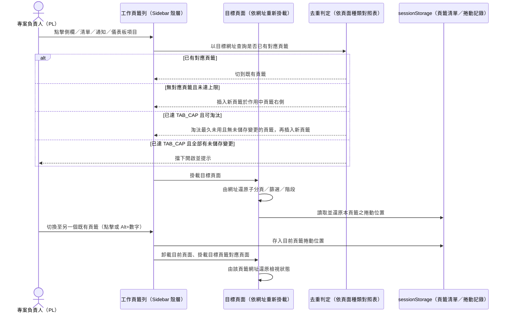
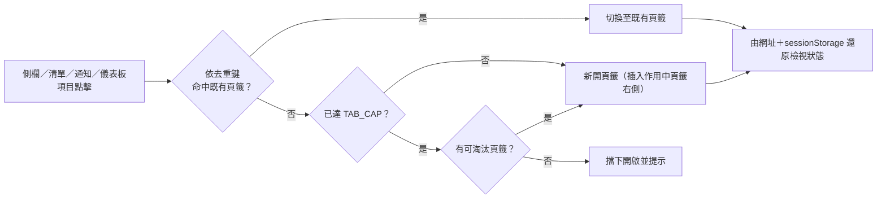

# 功能規格：Workspace Tabs（系統內建工作頁籤）

**需求來源**: issue #1075 — 系統內建工作頁籤（同時保留多頁檢視狀態並快速切換），Q1–Q24 經維護者逐條問答裁定

## 功能目標

為所有登入後有 Sidebar 殼層的頁面（含系統管理頁）在主內容區上方提供一列「工作頁籤」，讓專案負責人（PL）與其他登入使用者可以同時保留多個頁面的檢視狀態並快速切換，而不必靠瀏覽器分頁或重複操作重建篩選、子分頁、階段與捲動位置。

**支援的研究工作流程（Demo Paper 系統特色，issue #1075 需求目標 2）**：本功能的核心場景是試標（dry-run）與正式標記（official-run）進度的比對決策——PL 在試標達標、開始正式標記後若出現爭議，需要把同一任務的「試標 R{n}」與「正式標記」檢視各開一個頁籤來回切換比對（透過 `task-detail` 的 `ap_stage` 檢視狀態，見 FR-019 下游依賴 task-management-014 FR-019／issue #726），確認正式標記的爭議是否落在試標時就已分歧的標籤組合上，據此決定是否在剩餘樣本開始前補充標記指南範例。這是一項**研究方法論工具**，不只是 UX 便利性改善：它讓「比對試標 IAA 與正式標記進度以決定是否修訂指南」這個標註品質管控流程，從「反覆切換子分頁並重建篩選狀態」降為「兩個頁籤之間快速切換」。

本功能建立在既有的「網址即檢視狀態」慣例（UXC-11，延續 #726）之上：每個頁籤只記錄一個應用程式內網址，不另外保存頁面元件實例或額外狀態，切回頁籤時由網址（與捲動記錄）重新還原畫面。

## 輸入與生成規則

**輸入描述**：本規格依 issue #1075 之 Q1–Q24 裁定與實作細節，定義工作頁籤列的開啟、去重、容量、未儲存保護、快捷鍵、行動版、權限失效與無障礙契約。

**產生規格時必須遵守**：

1. 先確認本規格範圍與需求來源一致：issue #1075（Q1–Q24、實作細節、用語事實、驗收清單）。
2. 若新增或改動角色權限、導頁、資料欄位、錯誤狀態、i18n、可存取屬性或響應式邊界，必須同步檢查使用者情境、功能需求、成功標準與規格相依性。
3. 若需求描述缺少角色、狀態、資料來源、權限、錯誤處理、導頁目標或量化門檻，需以待釐清標記記錄具體問題，不得自行假設。
4. 規格應描述使用者可觀察行為、業務規則與驗收條件；避免描述框架、檔案結構、API 實作或資料庫實作，除非該內容本身是已定義的產品契約。
5. 本規格若與 prototype、IA 或上游規格不一致，必須明確記錄差異、更新相依性，並新增 changelog。

**已釐清事項**：

- Q1–Q20 已於 issue #1075 開立時經維護者逐條問答裁定；Q21–Q24 為開立後補問裁定。涉及具體行為規則者，本文件 FR/AC/SC 逐條對應，見各條文括註的 Q 編號；純文件性或已直接融入敘述段落的裁定（如 Q6 用語事實已落實於 `design/system/MASTER.md` 用語規則、Q15／Q17 之 Demo Paper 情境定位已融入「功能目標」與使用者故事 9 敘述）不另外括註 Q 編號，不代表遺漏。
- 論文成效量測方式（issue #1075 明示留待本階段討論）：本版先以「完成『比對試標與正式標記』情境所需的操作步驟數」作為可觀測指標（SC-016），**待維護者確認**；若日後裁定改用其他量測方式，需回頭更新 SC-016 並新增 changelog，不視為本版缺陷。
- 本版交付層為正典規格＋原型（`design/prototype`）；`frontend/**` 的 React 實作（TanStack Query 快取行為、真實 `sessionStorage` 整合）為後續階段，相關 AC 已於條文中標明「原型層僅能模擬，真實快取行為待 frontend 階段驗證」。

## Clarifications

### Session 2026-10-01（issue #1075 開立問答）

- Q1：要不要做系統內建頁籤？ → A：直接做，不只是保證 `<a href>` 能用瀏覽器開新分頁。
- Q2：狀態保存方式？ → A：方案 A——頁籤只記網址，切回時重新掛載頁面並從網址還原檢視狀態；資料靠 TanStack Query 快取，不保留元件實例。
- Q3：標記作業頁去重鍵？ → A：任務 id ＋ 模式（標記／審核），同一任務同一模式只能開一個頁籤。
- Q4：頁籤上限與淘汰？ → A：最多 8 個；超過時淘汰最久未用且無未儲存變更者；全部有未儲存變更則擋下並提示。
- Q5：持久化範圍？ → A：只用 `sessionStorage`，同瀏覽器分頁內還原；重新整理頁籤還在，新分頁從空白開始。
- Q6：用語？ → A：外層稱「頁籤」，頁面內子分頁仍稱「分頁」；補上 `design/system/MASTER.md` 用語規則。
- Q7：規格歸屬？ → A：另立 `specs/shared/019-workspace-tabs/`；`shared-008` 僅 MODIFIED 關閉作用中頁籤後的焦點移動規則。
- Q8：task-new 去重？ → A：僅能開一個頁籤，沿用既有未儲存確認。
- Q9：未儲存狀態回報？ → A：由各頁面自行回報；第一批為標記作業頁（標記／審核兩模式）與 task-new。
- Q10：快捷鍵？ → A：`Alt+1…8` 切換頁籤、`Alt+W` 關閉頁籤，列入 `shared-008` 快捷鍵總覽。
- Q11：行動版？ → A：≤767px 不顯示頁籤列，改為頂部「已開啟 N 頁」下拉選單。
- Q12：系統管理頁是否納入？ → A：納入，與其他登入後頁面一致可開成頁籤。
- Q13：從通知／儀表板開啟？ → A：規則與清單點擊相同——已開著就切過去，沒開就新開。
- Q14：權限失效？ → A：切回頁籤才擋——收到 403 顯示無權限畫面，由使用者自行關閉；不做即時推播。
- Q16：任務詳情頁去重？ → A：以完整網址去重（任務 id＋子分頁＋篩選＋階段），同一任務可多開頁籤。
- Q18：頁內切換撞到已開頁籤？ → A：切到已開的那個頁籤，原頁籤維持原狀，不合併、不允許重複。
- Q19：新頁籤位置？ → A：插在作用中頁籤右邊。
- Q20：試標／正式比對方式？ → A：各開一個頁籤來回切換；不做頁內對照模式，也不做分割畫面。

### Session 2026-10-01（issue #1075 開立後補問）

- Q21：一般點擊行為？ → A：點側欄／清單／通知／儀表板項目都走頁籤機制；`Ctrl`／`⌘`＋點擊與滑鼠中鍵維持瀏覽器原生開新分頁，不攔截。
- Q22：登出或換帳號？ → A：登出清空 `sessionStorage` 頁籤清單與捲動記錄，下一位登入者從空白開始。
- Q23：瀏覽器上一頁／下一頁？ → A：切換頁籤不記入瀏覽器歷程（`replaceState`）；上一頁只回到同頁籤內的上一個狀態。
- Q24：審核模式？ → A：審核員也使用 `annotation-workspace.html`；去重鍵是任務 id＋模式，標記與審核可各開一個頁籤；審核模式中尚未送出的決定也算未儲存。

## 規格常數

- `TAB_CAP = 8`（頁籤上限）
- `TAB_SWITCH_SHORTCUT_PREFIX = Alt`（搭配 `event.code: Digit1`…`Digit8`，切換至第 N 個頁籤）
- `TAB_CLOSE_SHORTCUT = Alt+W`（搭配 `event.code: KeyW`，關閉作用中頁籤）
- `TAB_STORAGE_KEY = labelsuite.workspaceTabs`（`sessionStorage`：頁籤清單＋作用中頁籤索引）
- `TAB_SCROLL_STORAGE_KEY = labelsuite.workspaceTabScroll`（`sessionStorage`：各頁籤捲動位置，不寫入網址）
- `TAB_REOPEN_STORAGE_KEY = labelsuite.workspaceTabReopenStack`（`sessionStorage`：重開剛關閉的頁籤堆疊，issue #1099）
- `TAB_REOPEN_CAP = 10`（重開堆疊上限，超過丟棄最舊一筆，issue #1099）
- `MOBILE_BP = 767px`（參照 `specs/_shared/constants.md`）
- `WORKSPACE_PAGE_MODES = annotate | review`（標記作業頁的模式，對應 annotation-015 `role: annotator | reviewer`）
- `TAB_STAGE_BADGE = dry_run（警示色，顯示「試標 R{n}」）| official_run（主色，顯示「正式」）`（用語事實：`R{n}` 僅代表試標回合；正式標記不編號）

### 頁面種類 → 去重鍵對照表（唯一來源，Q3／Q8／Q16）

| 頁面種類 | 去重鍵 | 裁定依據 |
|---------|--------|---------|
| 標記作業頁 `annotation-workspace`（`annotate` 與 `review` 兩種模式） | 任務 id ＋ 模式（`annotate` \| `review`） | Q3、Q24 |
| 建立任務精靈 `task-new` | 單例（固定最多一個頁籤） | Q8 |
| 任務詳情頁 `task-detail` | 完整正規化網址（任務 id ＋ `tab` ＋ 各頁籤篩選／頁碼參數，共 15 個查詢參數，見 task-management-014 FR-019） | Q16 |
| 其餘所有頁面種類（`dashboard`、`task-list`、`annotation-list`、`dataset-analysis-list`、`dataset-analysis-detail`、`user-management`、`role-settings`、`profile`） | 完整正規化網址（含 query） | Q16 之通則推論：未被 Q3／Q8 特例覆蓋的頁面種類，以完整網址作為預設去重鍵 |

> 本表為「頁面種類 → 去重鍵」的單一來源；任何頁面實作或測試新增去重規則，必須回到本表更新，不得散落在各頁面 Red/Green 任務中各自定義。

## 流程圖

| 步驟 | 角色 | 動作 | 系統回應 |
|------|------|------|---------|
| 1 | PL | 點擊側欄／清單／通知／儀表板項目 | 依去重鍵判定切至既有頁籤或新開頁籤 |
| 2 | 系統 | 新開頁籤 | 插入於作用中頁籤右側；若已達上限則先淘汰最久未用且無未儲存變更的頁籤 |
| 3 | 系統 | 掛載目標頁面 | 由網址還原子分頁、篩選、階段；由 `sessionStorage` 還原捲動位置 |
| 4 | PL | 切換頁籤（點擊或 `Alt+1…8`） | 存入目前頁籤捲動位置，卸載並改掛載目標頁籤頁面 |
| 5 | PL | 關閉作用中頁籤（點擊或 `Alt+W`） | 焦點依 `shared-008` MODIFIED 條文移至下一個頁籤 |

---

## 使用者情境與測試 *(必填)*

### 使用者故事 1 — 頁籤列基本行為與開啟規則（優先級：P1）

登入使用者在任一有 Sidebar 殼層的頁面（含系統管理頁）皆看到頁籤列；點擊側欄、清單、通知或儀表板項目時，系統依去重鍵切到既有頁籤或新開頁籤。

**此優先級原因**：頁籤列是本功能的可見骨架與主要互動入口，沒有它整個功能不成立。

**獨立測試方式**：在 desktop viewport 下，以側欄、任務清單列、通知、儀表板入口分別觸發導覽，驗證頁籤列顯示與新增/切換行為；以 `Ctrl`/`⌘`+點擊與滑鼠中鍵驗證不建立系統頁籤。

**驗收情境**：

1. **AC-1.1**：**Given** 已登入使用者進入任一有 Sidebar 殼層的頁面（含 `user-management`／`role-settings`），**When** 頁面載入完成，**Then** 主內容區上方顯示工作頁籤列，至少包含目前頁面對應的一個頁籤（Q1、Q12）。
2. **AC-1.2**：**Given** 作用中頁籤未達 `TAB_CAP`，**When** 點擊側欄、任務清單列、通知項目或儀表板項目，且目的網址依去重鍵判定未命中既有頁籤，**Then** 系統新開一個頁籤並插入於作用中頁籤的右側（Q13、Q19、Q21）。
3. **AC-1.3**：**Given** 已開啟某個頁籤且其去重鍵與目的網址相同，**When** 再次點擊會導向該網址的項目，**Then** 系統切換至既有頁籤，不建立新頁籤（Q13、Q21）。
4. **AC-1.4**：**Given** 任一可觸發導覽的項目，**When** 使用者以 `Ctrl`／`⌘`＋點擊，或以滑鼠中鍵點擊，**Then** 瀏覽器開啟新的瀏覽器分頁，系統不建立新的工作頁籤，亦不攔截此行為（Q21）。
5. **AC-1.5**：**Given** 關閉目前作用中的頁籤，**When** 關閉動作完成，**Then** 焦點依 `shared-008` MODIFIED 條文移至下一個頁籤。
6. **AC-1.6**：**Given** 一個 `task-detail` 頁籤處於 `ap_stage=r1`（試標）、另一個處於 `ap_stage=official`（正式），**When** 檢視兩個頁籤的標題，**Then** 試標頁籤以警示色顯示「試標 R1」、正式頁籤以主色顯示「正式」，且頁籤標題包含任務名稱以分辨對象（用語事實）。

---

### 使用者故事 2 — 狀態還原（方案 A，延續 #726）（優先級：P1）

使用者切換頁籤後，頁面的子分頁、篩選、階段與捲動位置皆由網址與捲動記錄還原，不需重新操作。

**此優先級原因**：狀態還原是本功能相對瀏覽器原生分頁的核心價值主張；若還原不正確，頁籤便失去存在意義。

**獨立測試方式**：在 `task-detail` 等已具備網址檢視狀態的頁面切換篩選/子分頁/捲動後切換頁籤再切回，驗證畫面與切換前一致；驗證重新整理與登出後的還原範圍。

**驗收情境**：

1. **AC-2.1**：**Given** 頁籤 A 停留在 `task-detail` 的 `annotation-results` 子分頁並已篩選、翻頁、捲動，**When** 切至頁籤 B 再切回頁籤 A，**Then** 頁籤 A 重新掛載後，子分頁、篩選、頁碼與捲動位置皆與切換前一致（方案 A：由網址＋`TAB_SCROLL_STORAGE_KEY` 還原，不保留元件實例）。
2. **AC-2.2**：**Given** 頁籤 A 先前已載入過且其 TanStack Query 快取仍有效，**When** 切回頁籤 A，**Then** 不顯示整頁載入狀態（此行為之真實快取驗證待 frontend 階段；原型層以「已載入過的頁籤重新渲染時不插入 skeleton/loading 區塊」模擬）。
3. **AC-2.3**：**Given** 使用者已開啟多個頁籤，**When** 重新整理瀏覽器分頁，**Then** 頁籤清單與作用中頁籤索引由 `TAB_STORAGE_KEY` 還原；**When** 於新的瀏覽器分頁開啟系統網址，**Then** 該新分頁的頁籤列從空白開始，不帶入其他分頁的頁籤（Q5）。
4. **AC-2.4**：**Given** 使用者登出，**When** 下一位使用者登入，**Then** 頁籤列為空白，不顯示前一位使用者開過的任務名稱或其他頁籤內容（Q22）；該使用者的總覽選單「重開剛關閉的」操作項呈停用狀態（堆疊為空），不顯示前一位使用者的任何頁籤紀錄（v1.2.0 修訂，`FR-018`）。
5. **AC-2.5**：**Given** 使用者在頁籤內切換子分頁或篩選，**When** 按下瀏覽器「上一頁」，**Then** 僅回到目前頁籤內的上一個檢視狀態，不跳到其他頁籤、不新增或移除頁籤（Q23：切換頁籤使用 `history.replaceState()`，不產生瀏覽歷程）。

---

### 使用者故事 3 — 依頁面種類去重（優先級：P1）

不同種類的頁面使用不同的去重鍵（見規格常數「頁面種類 → 去重鍵對照表」），避免重複頁籤或無法區分同任務不同檢視狀態。

**此優先級原因**：去重規則不一致會直接產生使用者困惑的重複頁籤或無法達成的多開需求（如同任務試標／正式比對）。

**獨立測試方式**：分別以標記作業頁（標記/審核模式）、task-new、task-detail（不同 `ap_stage`/子分頁）驗證開啟、切換與阻擋重複的行為。

**驗收情境**：

1. **AC-3.1**：**Given** 使用者已開啟任務 T-001 的標記作業頁籤（`annotate` 模式），**When** 再次由任何入口導向同一任務同一模式的標記作業頁，**Then** 系統切至既有頁籤，不新開第二個（Q3）。
2. **AC-3.2**：**Given** 使用者已開啟任務 T-001 的標記作業頁籤（`annotate` 模式），**When** 以 `reviewer` 身分導向同一任務的審核作業頁，**Then** 系統新開一個獨立頁籤（去重鍵為任務 id＋模式，兩模式視為不同頁籤）（Q24）。
3. **AC-3.3**：**Given** 已開啟 `task-new` 頁籤，**When** 再次由任何入口觸發建立任務精靈，**Then** 系統切至既有 `task-new` 頁籤，不新開第二個（Q8）。
4. **AC-3.4**：**Given** 使用者已開啟任務 T-001 的 `task-detail` 頁籤且 `ap_stage=r1`，**When** 開啟同一任務 `ap_stage=official` 的 `task-detail` 網址，**Then** 系統新開一個獨立頁籤（去重鍵為完整網址，兩個 `ap_stage` 值視為不同頁籤）（Q16，本規格 Why 所述之試標/正式比對情境）。
5. **AC-3.5**：**Given** 使用者在頁籤 A（`task-detail`，`tab=overview`）頁內切換子分頁至 `work-log` 並篩選成員，**When** 該操作後的新網址與既存頁籤 B 的去重鍵相同，**Then** 系統切至頁籤 B，頁籤 A 維持切換前的狀態不變，並顯示提示；不合併兩者，也不產生重複頁籤（Q18）。

---

### 使用者故事 4 — 上限淘汰與未儲存保護（優先級：P1）

頁籤數達上限時自動淘汰最久未用且無未儲存變更者；若全部頁籤皆有未儲存變更則擋下開啟並提示；標記作業頁與 task-new 需回報未儲存狀態。

**此優先級原因**：缺少容量與未儲存保護會導致使用者遺失正式標記/審核中的未送出資料，風險等級高於單純的 UX 便利性。

**獨立測試方式**：開滿 8 個頁籤後再開第 9 個，分別驗證「有可淘汰頁籤」與「全部有未儲存變更」兩種情境；在標記與審核模式下製造未儲存變更後嘗試關閉頁籤。

**驗收情境**：

1. **AC-4.1**：**Given** 已開啟 `TAB_CAP`（8）個頁籤，且至少一個頁籤最久未使用且無未儲存變更，**When** 開啟第 9 個頁籤，**Then** 系統自動淘汰該最久未使用且無未儲存變更的頁籤，再開啟新頁籤（Q4）；被淘汰的頁籤出現在重開堆疊中，可透過總覽選單的「重開剛關閉的」重新開啟（v1.2.0 修訂，`FR-024`）。
2. **AC-4.2**：**Given** 已開啟 8 個頁籤且全部都有未儲存變更，**When** 嘗試開啟第 9 個頁籤，**Then** 系統擋下開啟並提示使用者（Q4）。
3. **AC-4.3**：**Given** 使用者在標記作業頁（`annotate` 或 `review` 模式）或 `task-new` 有未送出的變更，**When** 該頁籤被嘗試關閉或被判定為上限淘汰候選，**Then** 系統依該頁面回報的未儲存狀態阻擋淘汰，並在使用者主動關閉時沿用既有未儲存確認對話（Q9）。
4. **AC-4.4**：**Given** 使用者在審核模式（`review`）的標記作業頁尚有未送出的審核決定，**When** 檢查該頁籤的未儲存狀態，**Then** 系統視為有未儲存變更，與標記模式的未送出作答同等對待（Q24）。

---

### 使用者故事 5 — 快捷鍵（優先級：P2）

Desktop 使用者可用 `Alt+1…8` 切換至對應位置的頁籤、`Alt+W` 關閉作用中頁籤；快捷鍵以按鍵位置判斷，輸入框聚焦時不攔截。

**此優先級原因**：快捷鍵是效率功能，不影響頁籤列基本可用性，但對本規格描述的研究情境（反覆比對切換）有明顯效率價值。

**獨立測試方式**：在 desktop viewport 下開啟多個頁籤，驗證 `Alt+數字`／`Alt+W` 行為；在 macOS 鍵盤配置下驗證輸入框聚焦時 `Option+數字` 仍能輸入特殊符號而不觸發頁籤切換。

**驗收情境**：

1. **AC-5.1**：**Given** 已開啟 N（1 ≤ N ≤ 8）個頁籤，**When** 使用者按下 `Alt+<數字 1…8>`，**Then** 系統切換至該數字對應位置的頁籤（若該位置無頁籤則不動作）。
2. **AC-5.2**：**Given** 任一頁籤為作用中頁籤，**When** 使用者按下 `Alt+W`，**Then** 系統關閉該作用中頁籤，並依使用者故事 1 的焦點移動規則切至下一個頁籤。
3. **AC-5.3**：**Given** 焦點位於輸入框、文字區或 `contenteditable` 元素，**When** 使用者按下 `Option+1`（macOS），**Then** 瀏覽器照常輸入對應特殊字元（如 `¡`），系統不攔截、不觸發頁籤切換。
4. **AC-5.4**：**Given** 快捷鍵處理程式接收到鍵盤事件，**When** 判斷是否為頁籤快捷鍵，**Then** 系統以 `event.code`（`Digit1`…`Digit8`、`KeyW`）判斷按鍵位置，而非 `event.key`，避免 macOS `Option` 修飾鍵改變字元值造成誤判（實作細節）。

---

### 使用者故事 6 — 行動版「已開啟 N 頁」下拉選單（優先級：P2）

`≤767px` 時頁籤列由頂部「已開啟 N 頁」下拉選單取代，避免窄螢幕下頁籤列擠壞版面。

**此優先級原因**：行動版頁籤列若直接等比例縮小會不可用；下拉選單是既有 Sidebar RWD 慣例的延伸。

**獨立測試方式**：在 375px viewport 下開啟多個頁籤，驗證下拉選單顯示、點擊切換與無水平捲動。

**驗收情境**：

1. **AC-6.1**：**Given** viewport `<= MOBILE_BP`，**When** 頁面載入，**Then** 頁籤列（`.workspace-tab-bar`）不顯示，改在頂部顯示 `FR-023` 定義之總覽選單觸發按鈕，顯示目前頁籤數 N（Q11；v1.2.0 修訂：由共用總覽選單取代舊版專屬下拉選單，原中文文案「已開啟 N 頁」保留為觸發按鈕之可見文字）。
2. **AC-6.2**：**Given** 行動版下拉選單已開啟，**When** 點擊清單中的某個頁籤項目，**Then** 系統切換至該頁籤並關閉下拉選單，行為與桌面版點擊頁籤一致。
3. **AC-6.3**：**Given** viewport 為 375px，**When** 開啟 8 個頁籤並展開下拉選單，**Then** 頁面與總覽選單皆不出現水平捲動（沿用 `FR-015`／`SC-012`；v1.2.0 修訂）。

---

### 使用者故事 7 — 權限與資源失效（403／404）（優先級：P2）

切回某個頁籤時才檢查權限或資源是否仍存在；收到 403 顯示無權限畫面，收到 404 顯示找不到畫面，兩者皆由使用者自行關閉頁籤。

**此優先級原因**：權限或資料在頁籤閒置期間失效是真實場景（如任務被刪除、權限被收回），但不需要即時推播，複雜度與價值不成比例。

**獨立測試方式**：開啟頁籤後於背景使被指向的資源失去權限或被刪除，切回該頁籤驗證對應的 fallback 畫面；驗證兩者皆不自動關閉頁籤。

**驗收情境**：

1. **AC-7.1**：**Given** 頁籤 A 指向的資源於閒置期間被收回存取權限，**When** 使用者切回頁籤 A，**Then** 該頁籤顯示無權限畫面（403），且不自動關閉；使用者可自行關閉該頁籤（Q14）。
2. **AC-7.2**：**Given** 頁籤 A 指向的任務於閒置期間被刪除，**When** 使用者切回頁籤 A，**Then** 該頁籤顯示找不到畫面（404），且不自動關閉；使用者可自行關閉該頁籤（實作細節）。
3. **AC-7.3**：**Given** 頁籤 A 正顯示 403 或 404 畫面，**When** 檢查系統是否有任何即時通知使該頁籤自動更新或關閉，**Then** 系統不做任何即時推播，狀態僅在使用者下次切回時重新檢查（Q14 排除範圍）。

---

### 使用者故事 8 — 無障礙（優先級：P2）

頁籤列使用正確的 ARIA 語意，支援鍵盤方向鍵移動焦點，關閉按鈕有可讀標籤。

**此優先級原因**：頁籤列是跨全站常駐導覽元件，無障礙缺陷影響面最廣。

**獨立測試方式**：以螢幕閱讀器語意檢查與鍵盤導覽驗證 `role`／`aria-*` 屬性與方向鍵行為。

**驗收情境**：

1. **AC-8.1**：**Given** 頁籤列已掛載，**When** 檢查其 DOM 結構，**Then** 容器具 `role="tablist"`，每個頁籤具 `role="tab"` 與 `aria-selected`（作用中頁籤為 `true`，其餘為 `false`）。
2. **AC-8.2**：**Given** 焦點位於某個頁籤，**When** 使用者按左右方向鍵，**Then** 焦點移至相鄰頁籤（不觸發切換，僅移動鍵盤焦點；Enter 或 Space 才觸發切換）。
3. **AC-8.3**：**Given** 任一頁籤的關閉按鈕，**When** 以螢幕閱讀器語意檢查，**Then** 該按鈕具可讀的 `aria-label`（含該頁籤代表的頁面或任務名稱）。

---

### 使用者故事 9 — 試標與正式標記比對（研究工作流程示範，優先級：P2）

PL 可各開一個頁籤分別檢視同一任務的「試標 R{n}」與「正式標記」進度，快速來回切換比對是否有相同的爭議標籤組合，而不需要在單一畫面內做並排對照。

**此優先級原因**：此為 Demo Paper 欲展示的研究情境（issue #1075 需求目標 2），價值在於驗證頁籤機制能支撐真實的標註品質管控流程，而非僅為一般 UX 功能；優先級訂為 P2 因其行為完全由使用者故事 1–3 的通用機制組合而成，不需要額外專屬實作。

**獨立測試方式**：開啟同一任務的 `ap_stage=r1` 與 `ap_stage=official` 兩個 `task-detail` 頁籤，量測完成「比對進度」操作所需的步驟數，並與不使用頁籤機制（反覆切換子分頁重建篩選）的步驟數比較。

**驗收情境**：

1. **AC-9.1**：**Given** 任務 T-001 試標 R1 已達 IAA 門檻並開始正式標記，**When** PL 分別開啟 `ap_stage=r1` 與 `ap_stage=official` 兩個 `task-detail` 頁籤並以 `Alt+1`／`Alt+2` 來回切換，**Then** 兩個頁籤各自保留獨立的篩選與捲動狀態，不互相覆蓋（承 AC-3.4、AC-2.1）。
2. **AC-9.2**：**Given** PL 已完成一次試標／正式標記比對（開啟兩頁籤、切換比對、關閉頁籤），**When** 記錄此過程的操作步驟數，**Then** 該步驟數為本規格的可觀測效能指標之一（見 SC-016，量測方式待維護者確認）。

---

### 使用者故事 10 — 頁籤總覽選單（優先級：P2）

頁籤列右端（行動版為頂部）提供「N ˅」總覽選單：篩選、逐列切換、重開剛關閉的、全部關閉，補足開了多個頁籤後的管理能力（issue #1099，參考 NoteCraft 分頁機制）。

**此優先級原因**：頁籤上限 8 個時，無法一眼總覽或快速定位特定頁籤；管理能力屬 UX 強化，不阻擋既有頁籤切換主流程。

**獨立測試方式**：開啟多個頁籤，開啟總覽選單驗證項目數、篩選、鍵盤操作與點擊切換；於桌面與 375px 兩種 viewport、zh／en 兩語系各驗一次。

**驗收情境**：

1. **AC-023.1**：**Given** 已開啟 N（1 ≤ N ≤ 8）個頁籤，**When** 使用者開啟總覽選單，**Then** 觸發按鈕與選單皆可觀察到數字 N，清單項目數等於 N，且作用中頁籤有獨立於其餘項目的視覺標示；每列為單行（圖示、標題、關閉按鈕），不含第二行次要說明。
2. **AC-023.2**：**Given** 桌面 viewport（`> MOBILE_BP`）且已開啟足夠多頁籤使頁籤列可橫向捲動，**When** 使用者捲動頁籤列，**Then** 總覽選單觸發按鈕之畫面位置不變，恆位於頁籤列最右端。
3. **AC-023.3**：**Given** 選單已開啟，清單中有一個頁籤標題包含「Task」字樣、另一個頁籤之頁面種類名稱為「資料集分析」，**When** 使用者於篩選輸入框輸入「task」（小寫），**Then** 僅標題或頁面種類名稱比對命中（不分大小寫）的頁籤列保留顯示，其餘隱藏；比對不包含網址參數。頁面種類名稱雖不再顯示於列內，仍為比對範圍（例如輸入「任務詳情」仍命中任務詳情頁籤）。
4. **AC-023.4**：**Given** 總覽選單觸發按鈕已取得焦點，**When** 使用者開啟選單，**Then** 焦點立即移至篩選輸入框。
5. **AC-023.5**：**Given** 選單已開啟，清單含 2 個以上項目，**When** 使用者按下方向鍵下（或上），**Then** 反白／焦點移至下一個（或上一個）清單項目，不觸發頁籤切換。
6. **AC-023.6**：**Given** 選單已開啟且某清單項目目前反白，**When** 使用者按下 `Enter`，**Then** 系統切換至該反白項目對應之頁籤，選單隨之關閉。
7. **AC-023.7**：**Given** 選單已開啟，**When** 使用者按下 `Esc`，**Then** 選單關閉，焦點回到總覽選單觸發按鈕。
8. **AC-023A.1**：**Given** 總覽選單已開啟且清單中含有一個非作用中頁籤項目，**When** 使用者點擊該項目，**Then** 系統切換至該頁籤（不產生瀏覽歷程記錄），且選單隨之關閉。

---

### 使用者故事 11 — 重開剛關閉的頁籤（優先級：P2）

手動關閉、全部關閉或被 `TAB_CAP` 自動淘汰的頁籤，可由總覽選單或 `Alt+Shift+T` 依後進先出順序重開。

**此優先級原因**：誤關或被自動淘汰的頁籤若無法救回，使用者必須重建篩選與檢視狀態；重開堆疊降低此成本，屬 UX 強化。

**獨立測試方式**：關閉單一或多個頁籤後使用「重開剛關閉的」與 `Alt+Shift+T`；累積超過 10 筆驗證丟棄最舊一筆；製造去重鍵衝突驗證不產生重複頁籤；登出後驗證堆疊清空。

**驗收情境**：

1. **AC-024.1**：**Given** 使用者手動關閉一個頁籤，**When** 使用者接著點擊總覽選單的「重開剛關閉的」，**Then** 該頁籤重新開啟，且其去重鍵與關閉前一致。
2. **AC-024.2**：**Given** 使用者依序關閉頁籤 A、頁籤 B（B 後關閉），**When** 使用者連續點擊「重開剛關閉的」兩次，**Then** 第一次重開頁籤 B，第二次重開頁籤 A。
3. **AC-024.3**：**Given** 已累積 `TAB_REOPEN_CAP`（10）筆關閉紀錄，**When** 再關閉第 11 個頁籤，**Then** 堆疊中最舊的一筆（第 1 筆）被丟棄，其餘 10 筆（含新關閉者）保留。
4. **AC-024.4**：**Given** 堆疊中某筆對應之去重鍵，目前已有另一個開啟中的頁籤命中同一去重鍵，**When** 使用者執行重開，**Then** 系統切換至該既有頁籤，不新開頁籤，且該筆從堆疊移除。
5. **AC-024.5**：**Given** 重開堆疊目前為空，**When** 使用者開啟總覽選單，**Then** 「重開剛關閉的」操作項呈停用狀態，不可點擊。
6. **AC-024A.1**：**Given** 重開堆疊非空，焦點不在任何可輸入元素，**When** 使用者按下 `Alt+Shift+T`，**Then** 系統執行與點擊「重開剛關閉的」相同的重開行為。
7. **AC-024A.2**：**Given** 焦點位於輸入框、文字區或 `contenteditable` 元素，**When** 使用者按下 `Alt+Shift+T`，**Then** 系統不執行重開，該元素原生輸入行為不受影響。
8. **AC-024B.1**：**Given** Desktop 使用者開啟快捷鍵總覽（`shared-008` 既有入口），**When** 檢視「頁籤」section，**Then** 必須存在對應重開快捷鍵的獨立一列，顯示 `Alt+Shift+T` 之獨立 keycap。

---

### 使用者故事 12 — 全部關閉（優先級：P2）

總覽選單提供「全部關閉」：一次關閉所有無未儲存變更的頁籤，跳過並提示有未儲存變更者。

**此優先級原因**：一次清空工作區是常見收尾動作，但必須維持未儲存保護語意，避免遺失標記或審核中未送出的資料。

**獨立測試方式**：開啟 5 個頁籤並讓其中 2 個有未儲存變更，執行「全部關閉」，驗證關閉結果、提示訊息、焦點落點與重開行為。

**驗收情境**：

1. **AC-025.1**：**Given** 已開啟 5 個頁籤，其中 2 個有未儲存變更，**When** 使用者點擊「全部關閉」，**Then** 3 個無未儲存變更的頁籤被關閉，2 個有未儲存變更的頁籤保留，且畫面顯示提示「2 個頁籤有未儲存變更，未關閉」。
2. **AC-025.2**：**Given** 承上一情境，作用中頁籤為被關閉的 3 個之一，**When** 全部關閉執行完成，**Then** 焦點（作用中頁籤）落在其中一個被跳過（仍保留）的頁籤，而非落在已不存在的頁籤上。
3. **AC-025.3**：**Given** 全部關閉已執行且有 N 個頁籤被關閉，**When** 使用者連續點擊「重開剛關閉的」N 次（N ≤ `TAB_REOPEN_CAP`），**Then** N 個被關閉的頁籤依關閉順序的反序逐一重開。

---

### 邊界情況

- 使用者在同一瀏覽器分頁內開啟兩個不同模組（例如 `task-detail` 與 `dataset-analysis-list`）的頁籤：兩者互不影響，各自依其去重鍵判定。
- `sessionStorage` 被瀏覽器清除或不可用（例如隱私模式部分限制）：頁籤列退回單頁籤狀態（僅顯示目前頁面），不得拋出例外或中斷頁面載入。
- 使用者在淘汰候選頁籤恰好於淘汰判定當下開始輸入造成未儲存：淘汰判定以「觸發開啟第 9 個頁籤的那一刻」為時間點做一次性判斷，不需要持續監聽競態；此為已知簡化（見 `design/prototype` 實作註記）。
- `task-detail` 以外、尚未盤點網址參數的頁面種類：依「其餘所有頁面種類」規則以完整網址去重；若該頁面本身尚未把某項檢視狀態寫入網址（依賴 #726 尚未覆蓋的頁面），切換頁籤後該項狀態無法還原，此為該頁面自身的網址狀態盤點缺口，不屬本規格待修範圍，但需在該頁面的下一次 OpenSpec change 中補齊。
- 多個頁籤同時顯示 403／404 畫面：互不影響，各自由使用者獨立關閉。

---

## 需求規格 *(必填)*

### 功能需求

- **FR-001**：登入後所有具 Sidebar 殼層的頁面，必須在主內容區上方顯示工作頁籤列，包含系統管理頁（Q1、Q12）。
- **FR-002**：viewport `> MOBILE_BP` 時顯示桌面版頁籤列；`<= MOBILE_BP` 時頁籤列必須由 `FR-023` 定義之共用總覽選單元件（行動版樣式）取代，而非舊版專屬之「已開啟 N 頁」下拉選單（Q11；v1.2.0 修訂：舊版行動下拉選單元件廢止）。既有 AC-6.1～AC-6.3 之核心行為必須保留：點擊清單項目切換頁籤並關閉選單、`375px` viewport 下頁面與選單皆不得出現水平捲動（`FR-015`）。
- **FR-003**：每個頁籤只記錄一個應用程式內網址（方案 A）；切換至該頁籤時必須重新掛載對應頁面並由網址還原檢視狀態，不得保留頁面元件實例（Q2）。此條之 TanStack Query 快取行為（切回仍有效快取時不顯示整頁載入）僅能由原型模擬觀察結果，真實快取驗證待 `frontend/**` 實作階段（見 AC-2.2）。
- **FR-004**：頁籤清單與目前作用中頁籤索引必須持久化於 `TAB_STORAGE_KEY`（`sessionStorage`），僅在同一瀏覽器分頁內還原；新的瀏覽器分頁或視窗必須從空白頁籤清單開始（Q5）。
- **FR-005**：點擊側欄、清單、通知或儀表板項目觸發的導覽，必須一律依「頁面種類 → 去重鍵對照表」判定：已有對應頁籤則切換過去，否則新開頁籤並插入於作用中頁籤的右側（Q13、Q19、Q21）。
- **FR-005A**：`Ctrl`／`⌘`＋點擊與滑鼠中鍵點擊必須維持瀏覽器原生開新分頁行為；系統不得攔截此類點擊事件、不得因此建立系統頁籤（Q21）。
- **FR-006**：「頁面種類 → 去重鍵」對照表（見規格常數）為唯一來源；標記作業頁以任務 id＋模式去重（Q3、Q24），`task-new` 為單例（Q8），`task-detail` 以完整正規化網址去重（Q16），其餘頁面種類亦以完整正規化網址去重。任何實作或測試新增去重規則，必須回到本表更新。
- **FR-007**：頁內切換子分頁、篩選或階段造成的新網址，若依去重鍵與另一個既有頁籤相同，系統必須切至該既有頁籤並顯示提示；原觸發切換的頁籤必須維持切換前狀態，不得合併兩者或產生重複頁籤（Q18）。
- **FR-008**：新開啟的頁籤必須插入於目前作用中頁籤的右側（Q19）。
- **FR-009**：關閉作用中頁籤後的焦點移動規則由 `shared-008` 之 MODIFIED 條文定義；本規格僅規定「關閉頁籤」此動作必須觸發該條文定義的焦點移動（Q7）。
- **FR-010**：頁籤標題必須能分辨頁面種類與對象（如任務名稱）；`task-detail` 頁籤必須依 `TAB_STAGE_BADGE` 標示階段——試標（`dry_run`）以警示色顯示「試標 R{n}」，正式（`official_run`）以主色顯示「正式」（用語事實）。
- **FR-011**：開啟頁籤已達 `TAB_CAP`（8）時，開啟第 9 個頁籤必須先自動淘汰「最久未使用且無未儲存變更」的既有頁籤；若全部 8 個頁籤皆有未儲存變更，必須擋下開啟並提示使用者（Q4）。被自動淘汰的頁籤必須依 `FR-024` 推入重開堆疊（v1.2.0 修訂，D5），使其可透過總覽選單重開；淘汰判定本身不變。
- **FR-012**：標記作業頁（`annotate` 與 `review` 兩種模式）與 `task-new` 必須各自回報未儲存狀態給頁籤殼層；審核模式中尚未送出的審核決定亦視為未儲存（Q9、Q24）。關閉具未儲存狀態的頁籤時，必須沿用該頁面既有的未儲存確認對話，不得新增第二套確認機制。
- **FR-013**：桌面版頁籤殼層必須支援 `Alt+1…8` 切換至對應位置的頁籤、`Alt+W` 關閉作用中頁籤；判斷必須使用 `event.code`（`Digit1`…`Digit8`、`KeyW`），且焦點位於可輸入元素（input、textarea、`contenteditable`）時不得攔截此類按鍵（Q10，macOS `Option+數字` 衝突之實作細節）。
- **FR-014**：上述兩個快捷鍵必須列入 `shared-008` 的快捷鍵總覽（由 `shared-008` MODIFIED 條文新增對應項目；本規格僅宣告該事實存在，不重複定義總覽的渲染契約）。
- **FR-015**：`<= MOBILE_BP` 時，`375px` viewport 下行動版總覽選單與整頁皆不得出現水平捲動（Q11；v1.2.0 起行動版選單為 `FR-023` 之共用總覽選單）。
- **FR-016**：切回某個頁籤時，若該頁籤所指向的資源回應 403，該頁籤必須顯示無權限畫面；回應 404（包含任務已被刪除的情況）必須顯示找不到畫面；兩種情況皆不得自動關閉頁籤，須由使用者自行關閉（Q14，實作細節：任務被刪除比照 404 處理）。
- **FR-017**：頁籤之間的切換不得寫入瀏覽器歷程，必須使用 `history.replaceState()`；瀏覽器「上一頁」／「下一頁」僅能在目前頁籤內的檢視狀態歷程之間移動，不得因此跳到其他頁籤（Q23）。
- **FR-018**：使用者登出時，系統必須清空 `TAB_STORAGE_KEY`、`TAB_SCROLL_STORAGE_KEY` 與 `TAB_REOPEN_STORAGE_KEY` 的內容；下一位登入者的頁籤列與重開堆疊皆必須從空白開始，不得顯示前一位使用者開過或關閉過的頁籤內容（Q22；v1.2.0 修訂：清空範圍擴大納入重開堆疊）。
- **FR-019**：每個頁籤的捲動位置必須個別存於 `TAB_SCROLL_STORAGE_KEY`，不得寫入網址（實作細節）。
- **FR-020**：頁籤列容器必須具 `role="tablist"`，每個頁籤必須具 `role="tab"` 與同步的 `aria-selected`；頁籤列必須支援方向鍵移動鍵盤焦點（不觸發切換）；每個頁籤的關閉按鈕必須具可讀的 `aria-label`。
- **FR-021**：本功能不支援跨瀏覽器分頁或跨裝置同步（Q5）、不支援分割畫面或並排顯示（同一時間僅顯示一個頁籤，Q20）、不提供頁內「試標／正式對照模式」（Q20 未採用）、不做權限變更的即時推播（Q14）。
- **FR-022**：既有表格翻頁慣例（`limit`／`offset`）與 `mdPaginationBar` 元件行為不受本功能影響，維持原樣。
- **FR-023**（issue #1099 新增）：共用頁籤殼層必須提供一個總覽選單元件，桌面版（`> MOBILE_BP`）與行動版（`<= MOBILE_BP`）共用同一個元件（D2）。(1) 觸發按鈕必須顯示目前頁籤數 N；桌面版必須位於頁籤列最右端，且不得隨頁籤列（`.workspace-tab-bar`）橫向捲動而移動。(2) 選單內容由上至下必須依序為：篩選輸入框（placeholder 顯示目前頁籤數 N）、頁籤清單（每列含頁面種類圖示、標題、關閉按鈕，單行、無第二行次要說明；作用中頁籤必須有視覺標示）、底部「重開剛關閉的」與「全部關閉」兩個操作項。(3) 篩選輸入框之比對範圍必須為頁籤標題與頁面種類名稱，不比對網址參數，比對不分大小寫。(4) 選單開啟時，焦點必須移至篩選輸入框；方向鍵上／下必須在頁籤清單項目間移動反白／焦點（不觸發切換）；`Enter` 必須切換至目前反白之頁籤並關閉選單；`Esc` 必須關閉選單並將焦點還給觸發按鈕（`FR-020` 無障礙延伸）。
- **FR-023A**（issue #1099 新增）：點擊總覽選單清單中的任一列必須依既有 `FR-017` 之 `history.replaceState()` 切換路徑切換至該頁籤，行為必須與點擊桌面頁籤列本身的對應頁籤一致；切換後選單必須關閉。
- **FR-024**（issue #1099 新增）：共用頁籤殼層必須維護一個重開堆疊（D3／D5）。(1) 手動關閉單一頁籤、執行「全部關閉」（`FR-025`）、`FR-011` 自動淘汰，三種情況皆必須將被關閉／淘汰的頁籤資訊推入堆疊。(2) 堆疊必須為後進先出（LIFO），上限 `TAB_REOPEN_CAP`（10）；超過上限時必須丟棄最舊的一筆。(3) 總覽選單「重開剛關閉的」操作必須彈出堆疊最新一筆並嘗試重開；依 `FR-006` 去重鍵對照表判定，若命中既有頁籤則僅切換至該頁籤並將該筆從堆疊移除，不得產生重複頁籤。(4) 重開動作本身必須仍受 `TAB_CAP` 與 `FR-011` 淘汰／阻擋規則約束。(5) 堆疊為空時，「重開剛關閉的」操作項必須停用。
- **FR-024A**（issue #1099 新增）：Desktop 頁籤殼層必須支援 `Alt+Shift+T` 快捷鍵觸發「重開剛關閉的」（`FR-024`）。(1) 判斷必須使用 `event.code`（`KeyT`，搭配 `altKey`／`shiftKey`），且焦點位於可輸入元素（input、textarea、`contenteditable`）時不得攔截此按鍵。(2) 本快捷鍵不得攔截或覆寫瀏覽器原生 `Ctrl/⌘+Shift+T`（不同按鍵組合，功能互不相關，本條不要求、也不得嘗試攔截瀏覽器原生開新分頁快捷鍵）。(3) 觸發後行為必須與點擊總覽選單的「重開剛關閉的」完全一致，包含堆疊為空時不動作。
- **FR-024B**（issue #1099 新增）：`FR-024A` 定義之重開快捷鍵必須列入 `shared-008` 之快捷鍵總覽（比照既有 `FR-013`／`FR-014` 分工模式：本規格僅宣告此事實存在，總覽本身之顯示格式、section 歸屬與語言切換由 `shared-008` `FR-016H` 定義，本條不重複定義）。
- **FR-025**（issue #1099 新增）：總覽選單必須提供「全部關閉」操作（D4）。(1) 執行時必須關閉所有目前無未儲存變更的頁籤，並跳過有未儲存變更的頁籤。(2) 若有頁籤被跳過，必須顯示提示訊息告知跳過的頁籤數量。(3) 不得另立第二套確認機制；此行為與既有 `FR-012` 之未儲存保護語意一致（全部關閉本身不彈出確認對話，僅跳過並提示，區別於使用者個別點擊單一頁籤關閉鈕時既有的未儲存確認對話）。(4) 所有被關閉的頁籤必須依 `FR-024` 推入重開堆疊。(5) 若作用中頁籤被本操作關閉，焦點移動規則比照 `shared-008` `FR-022`（優先右鄰、否則左鄰）；若關閉後仍有被跳過（未儲存）的頁籤存在，焦點必須落在其中一個被跳過的頁籤；若關閉後無任何頁籤殘留，頁籤列呈現空狀態。

### User Flow & Navigation

| From | Trigger | To |
|------|---------|-----|
| 側欄／清單／通知／儀表板項目 | 點擊，去重鍵命中既有頁籤 | 切換至既有頁籤 |
| 側欄／清單／通知／儀表板項目 | 點擊，未命中且未達上限 | 新開頁籤 |
| 側欄／清單／通知／儀表板項目 | 點擊，未命中且已達上限但有可淘汰頁籤 | 淘汰後新開頁籤 |
| 側欄／清單／通知／儀表板項目 | 點擊，未命中且已達上限且全數未儲存 | 擋下並提示 |
| 任一頁籤 | `Alt+1…8` | 切換至對應位置頁籤 |
| 作用中頁籤 | `Alt+W` 或點擊關閉按鈕 | 關閉並依 `shared-008` 焦點規則移動 |

### 關鍵實體

- **WorkspaceTab**
  - `url`：應用程式內完整網址（含 query），作為方案 A 的唯一持久狀態
  - `dedupeKey`：依「頁面種類 → 去重鍵對照表」推導，不另外持久化
  - `pageKind`：頁面種類（用於推導 `dedupeKey` 與頁籤標題）
  - `title`：頁籤顯示標題（含頁面種類與對象，`task-detail` 另含 `TAB_STAGE_BADGE`）
  - `lastActiveAt`：最近一次成為作用中頁籤的時間，供 `TAB_CAP` 淘汰判斷使用
  - `hasUnsavedChanges`：由頁面回報的未儲存旗標（僅標記作業頁與 `task-new` 回報；其餘頁面種類固定為 `false`）
  - `scrollPosition`：持久化於 `TAB_SCROLL_STORAGE_KEY`，不寫入網址
- **WorkspaceTabListState**
  - `tabs: WorkspaceTab[]`、`activeTabIndex: number`
  - `storage_key = TAB_STORAGE_KEY`（`sessionStorage`，同瀏覽器分頁內還原，新分頁與登出後清空）
- **WorkspaceTabReopenStack**（issue #1099）
  - `entries: { url, pageKind, title }[]`，LIFO，上限 `TAB_REOPEN_CAP`（10），超過丟棄最舊一筆
  - `storage_key = TAB_REOPEN_STORAGE_KEY`（`sessionStorage`，登出後清空）

---

## Prototype Traceability

| Artifact | Responsibility | Covered FR/SC | Verification | Status |
|----------|----------------|---------------|--------------|--------|
| [design/prototype/pages/shared/sidebar.js](../../../design/prototype/pages/shared/sidebar.js) [design/prototype/pages/shared/sidebar.css](../../../design/prototype/pages/shared/sidebar.css) | 工作頁籤列的掛載、去重、容量淘汰、未儲存保護、快捷鍵、共用總覽選單（桌面與行動版）、重開堆疊與全部關閉，整合進既有共用 Sidebar 殼層。 | FR-001–FR-025（含 FR-023A／FR-024A／FR-024B）；SC-001–SC-022 | [design/prototype/tests/shared/](../../../design/prototype/tests/shared/)（`workspace-tabs-*.spec.ts`） | 已實作（issue #1075、#1099） |

---

## 規格相依性 *(本功能依賴其他規格，或被其他規格依賴時填寫)*

### 上游（本規格依賴的規格）

| 規格編號 | 功能 | 本規格需要的內容 |
|---------|------|----------------|
| 008 | Shared Sidebar Navbar | 共用 Sidebar 殼層、快捷鍵總覽入口與渲染契約（本規格之頁籤列掛載於此殼層內；關閉作用中頁籤的焦點移動規則與快捷鍵總覽項由 `shared-008` MODIFIED 承接） |
| task-management-014 | Task Detail | FR-019（issue #726）之「網址即檢視狀態」慣例與 15 個查詢參數，是 `task-detail` 以完整網址去重、以及本規格 Why 所述試標/正式比對情境的直接基礎 |
| annotation-015 | Annotation Workspace | `ANNOTATION_WORKSPACE_ROUTE_QUERY`（`task_id`／`sample_id`／`role`／`run_type`）與標記/審核未儲存狀態的既有定義，是標記作業頁去重鍵（任務 id＋模式）與未儲存回報（Q9、Q24）的基礎 |
| dataset-016／017、admin-006／007 | Dataset／Admin | 既有頁面之網址 query 契約，作為「其餘頁面種類以完整網址去重」規則下各頁面檢視狀態完整性的既有基線 |

### 下游（依賴本規格的規格）

| 規格編號 | 功能 | 依賴本規格的內容 |
|---------|------|----------------|
| 008 | Shared Sidebar Navbar | MODIFIED：關閉作用中頁籤後的焦點移動規則、快捷鍵總覽新增 `Alt+1…8`／`Alt+W` 兩項（`FR-016H`）；v1.2.0 起 `FR-016H` 新增第三列 `Alt+Shift+T`（重開剛關閉的頁籤，`FR-024B`） |

---

## 成功標準 *(必填)*

- **SC-001**：所有具 Sidebar 殼層的頁面（含系統管理頁）載入後，主內容區上方皆可觀察到工作頁籤列或（`<=MOBILE_BP`）頂部總覽選單觸發按鈕，兩者恰有一個可見（FR-001、FR-002）。
- **SC-002**：依「頁面種類 → 去重鍵對照表」觸發的導覽，100% 依該表判定切換或新開頁籤，不出現違反對照表的重複或遺漏頁籤（FR-005、FR-006）。
- **SC-003**：`Ctrl`／`⌘`＋點擊與滑鼠中鍵點擊 100% 不建立系統頁籤（FR-005A）。
- **SC-004**：切換頁籤後，頁面的子分頁、篩選、階段與捲動位置與切換前一致（FR-003、FR-019）；此為方案 A 之核心可觀測結果。
- **SC-005**：已開啟頁籤已載入過的情況下切回，原型層可觀察到不插入整頁載入狀態；真實 TanStack Query 快取行為待 frontend 階段驗證（FR-003）。
- **SC-006**：重新整理瀏覽器分頁後頁籤清單與作用中頁籤從 `TAB_STORAGE_KEY` 還原；新的瀏覽器分頁不帶入任何頁籤（FR-004）。
- **SC-007**：登出後下一位登入者的頁籤列為空白，不顯示前一位使用者的任務名稱或其他頁籤內容（FR-018）。
- **SC-008**：切換頁籤不產生瀏覽歷程記錄；按「上一頁」僅在目前頁籤內的狀態間移動（FR-017）。
- **SC-009**：開啟第 9 個頁籤時，100% 依 FR-011 規則淘汰或擋下，不出現超過 `TAB_CAP` 個頁籤的情況（FR-011）。
- **SC-010**：標記作業頁（兩種模式）與 `task-new` 的未儲存變更 100% 正確回報，關閉時沿用既有未儲存確認（FR-012）。
- **SC-011**：`Alt+1…8`／`Alt+W` 在焦點非可輸入元素時正確切換／關閉頁籤；焦點在可輸入元素時，macOS `Option+數字` 仍正常輸入字元，不觸發頁籤切換（FR-013）。
- **SC-012**：`375px` viewport 下行動版總覽選單與整頁皆不出現水平捲動（FR-015）。
- **SC-013**：切回頁籤時，403 顯示無權限畫面、404 顯示找不到畫面，兩者皆不自動關閉頁籤（FR-016）。
- **SC-014**：頁籤列與每個頁籤之 `role`／`aria-*` 屬性符合 FR-020；方向鍵可在不觸發切換的前提下移動焦點。
- **SC-015**：`task-detail` 頁籤之階段標示（試標 R{n} 警示色／正式主色）在同任務多頁籤情境下可一眼分辨（FR-010）。
- **SC-016**（待維護者確認量測方式）：完成「開啟並比對同一任務試標與正式標記進度」情境所需的操作步驟數，在使用頁籤機制時可觀察並記錄；本版僅建立可觀測性，不設定目標門檻值，待 Demo Paper 實際量測後回填。
- **SC-017**：總覽選單之觸發按鈕與選單皆顯示目前頁籤數 N、清單項目數等於 N、作用中頁籤有獨立視覺標示，且每列為單行（圖示、標題、關閉按鈕），桌面與 375px、zh 與 en 皆無第二行（FR-023、AC-023.1）。
- **SC-018**：總覽選單篩選僅比對頁籤標題與頁面種類名稱、不分大小寫、不比對網址參數，頁面種類名稱不顯示於列內仍可命中（FR-023、AC-023.3）。
- **SC-019**：總覽選單開啟時焦點進篩選框，方向鍵移動反白但不切換，`Enter` 切換並關閉選單，`Esc` 關閉並還焦點給觸發按鈕；點擊清單列依 `FR-017` 切換且不產生瀏覽歷程（FR-023、FR-023A，AC-023.4～AC-023.7、AC-023A.1）。
- **SC-020**：手動關閉、全部關閉與自動淘汰的頁籤 100% 推入重開堆疊；重開依 LIFO、上限 `TAB_REOPEN_CAP` 丟棄最舊、命中去重鍵不產生重複頁籤、堆疊為空時操作項停用、登出後堆疊清空（FR-024、FR-011、FR-018，AC-024.1～AC-024.5）。
- **SC-021**：`Alt+Shift+T` 在焦點非可輸入元素時觸發重開、在可輸入元素內不攔截，且不覆寫瀏覽器原生 `Ctrl/⌘+Shift+T`；該快捷鍵列入 `shared-008` 快捷鍵總覽（FR-024A、FR-024B，AC-024A.1、AC-024A.2、AC-024B.1）。
- **SC-022**：「全部關閉」100% 跳過有未儲存變更的頁籤並顯示跳過數量，被關閉者皆可重開，作用中頁籤被關閉時焦點落在被跳過的頁籤（無則依 `shared-008` `FR-022`）（FR-025，AC-025.1～AC-025.3）。

---

## 審查與驗收清單

### 內容品質

- [x] 規格聚焦使用者可觀察行為、業務規則與驗收條件。
- [x] 所有必填章節已完成；不適用的內容已明確排除或未納入本版範圍。
- [ ] 無未解決的待釐清標記殘留。（SC-016 量測方式待維護者確認，已於 Clarifications 與規格常數段落明示，不視為阻斷項）
- [x] 需求、驗收情境與成功標準皆可測試。

### Label Suite 合規性

- [x] 功能分支格式符合 `feat/[module]/NNN-feature`（例外：本次沿用 issue 分支 `feat/1075-workspace-tabs`，見 brief 固定參數；下次改版時回歸標準格式）。
- [x] 已檢查本規格未要求跨 feature import；跨模組共用行為（Sidebar 殼層、快捷鍵總覽）已透過規格相依性追蹤。
- [x] 本規格不新增 task type 邏輯；不涉及 config-driven task architecture。
- [x] 已檢查頁籤標題與任何展示內容不暴露 test-set answer、ground-truth 或等價特權資料——頁籤標題僅顯示任務名稱、頁面種類與階段標記，與既有頁面導覽文字同源。
- [x] Prototype / IA / 上游規格 source of truth 已列於需求來源或規格相依性。
- [x] 上下游規格相依性已列出；`shared-008` 之 MODIFIED 影響已標明。

### 執行狀態

- [x] 輸入描述已解析。
- [x] 角色、互動、資料狀態與限制已萃取。
- [x] 模糊點已釐清或明確排除於本版範圍（SC-016 量測方式為已知待裁事項，非模糊）。
- [x] 使用者情境已定義。
- [x] 功能需求已定義。
- [x] 關鍵實體或狀態模型已定義。
- [x] Review checklist 已通過。（獨立 `senior-code-reviewer` 審查 G1 diff，裁定 APPROVE WITH NITS；唯一 nit——「已釐清事項」段落 Q1–Q24 逐條對應敘述過度宣稱——已於本版修正）

---

## Changelog

| 版本 | 日期 | 變更摘要 |
|------|------|---------|
| 1.2.0 | 2026-10-05 | 管理能力與視覺對齊（issue #1099，OpenSpec change `1099-workspace-tabs-overview-menu`，MINOR，G1～G4（G4 含 G4a／G4b）堆疊 PR 群組，PR #1124／#1131／#1132／#1136／#1137／#1139＋本次最終群組；僅新增與澄清，FR-002 之行動版專屬下拉選單依維護者裁定（D2）改以共用總覽選單實作，其核心行為與條文意圖保留，未刪除任何既有 FR/AC）：參考 NoteCraft 分頁機制新增 **FR-023／FR-023A**（總覽選單：觸發按鈕顯示頁籤數 N、篩選輸入框、單行清單列、鍵盤操作模型、點擊切換）、**FR-024／FR-024A／FR-024B**（重開剛關閉的頁籤堆疊 LIFO 上限 `TAB_REOPEN_CAP`＝10、`Alt+Shift+T` 重開快捷鍵、列入 `shared-008` 快捷鍵總覽）、**FR-025**（全部關閉，跳過未儲存並提示）；新增使用者故事 10～12、AC-023.1～AC-023.7、AC-023A.1、AC-024.1～AC-024.5、AC-024A.1／AC-024A.2、AC-024B.1、AC-025.1～AC-025.3、SC-017～SC-022（SC 依 SC-014 前例於回寫時手寫，未透過 delta Requirement 宣告）；新增規格常數 `TAB_REOPEN_STORAGE_KEY`、`TAB_REOPEN_CAP`、關鍵實體 WorkspaceTabReopenStack。**修訂既有條文**：FR-002（行動版頁籤列改由共用總覽選單取代舊版「已開啟 N 頁」專屬下拉，既有 AC-6.1～AC-6.3 核心行為保留，AC-6.1／AC-6.3 文字同步修訂）、FR-011（自動淘汰頁籤推入重開堆疊，淘汰判定本身不變，AC-4.1 同步）、FR-018（登出清空範圍納入 `TAB_REOPEN_STORAGE_KEY`，AC-2.4 同步）、FR-015／SC-001／SC-012 之「下拉選單」措辭同步為總覽選單；Prototype Traceability 狀態與涵蓋範圍同步更新。**2026-10-05 維護者裁定（G4）**：(a) 工作頁籤貼齊視窗頂端並改為直角（純樣式調整，不新增 FR，比照 G1 視覺對齊慣例）；(b) 總覽選單每列移除第二行次要說明，`FR-023`(2) 清單列僅含圖示、標題、關閉按鈕——因 FR-023 於本版才新增，此屬新增條文本身之措辭修訂，非推翻既有 FR/AC（非 MAJOR），`FR-023`(3)／AC-023.3 之篩選比對頁面種類名稱不變。G1 視覺對齊（固定寬度、標題截斷、頁面種類圖示、低彩度中性色作用中表面）不新增 FR，token 定案於 `design/system/MASTER.md`。OpenSpec 衍生檢視首次收錄 `openspec/specs/shared/019-workspace-tabs/`（因工具限制，FR-002／FR-011／FR-018 修訂後全文以 ADDED 收錄，詳見該 change 之 delta 流程註記）；`shared-008` 同步回寫 v2.3.0（`FR-016H` 新增第三列）。 |
| 1.1.0 | 2026-10-02 | 原型階段收尾（issue #1075，G1～G3 共 10 個堆疊 PR 群組，對應 PR #1078／#1080／#1083／#1086／#1090／#1091／#1093／#1094／#1095／#1096 ＋ 本次 G3）：全部 9 個使用者故事、FR-001～022、SC-001～016 皆已於原型層（`design/prototype/pages/shared/sidebar.js`／`sidebar.css`、`task-detail.html`）實作完成。FR-009／Q7 明文委由 `shared-008` 定義之關閉作用中頁籤焦點移動規則（AC-1.5），已由 `openspec/changes/1075-workspace-tabs-shared-008/`（`shared-008` MODIFIED change，新增 FR-022）正式承接確認，規則本身（優先右鄰、否則左鄰）逐字不變，行為已於 G2a-2（PR #1080）落地。快捷鍵總覽新增 `Alt+1…8`／`Alt+W` 條目一事（FR-013、AC-5.1 至 AC-5.4 既有之觸發/抑制行為不變），同步由 `shared-008` 之該次 delta 承接確認（新增 FR-016H），總覽顯示內容已於同一群組落地。狀態由 `Draft` 更新為 `Clarified`（比照 `shared-008` 既有慣例，表示已經維護者 Q&A 逐條裁定且原型已交付、真實後端/frontend 實作待後續階段）。**原型僅能模擬、`frontend/**` 階段需另行驗證之 AC 清單**（8 項）：AC-2.2（TanStack Query 真實快取行為，FR-003 本就明文此限制，原型僅模擬「已載入頁籤重新渲染不插入 skeleton」之觀察結果）；issue #1084 已知落差（非碰撞頁內 `history.replaceState()` 變動後重新整理可能還原過時子狀態，已於 G2b 嘗試修正但會破壞已鎖定之 AC-3.5 契約，刻意保留不修，另案追蹤）；AC-4.1／FR-011（`TAB_CAP` 淘汰候選判定為開啟第 9 頁籤當下一次性同步檢查，非持續競態監聽，`sidebar.js` 內已有 ponytail 已知簡化註記）；AC-5.3（macOS `Option+數字` 作業系統層級字元替換行為無法由 Playwright 直接驅動測試，僅測試可觀察之一半）；AC-6.1（行動版 toggle 英文文案「N tabs open」為實作判斷，本規格僅給定中文原文「已開啟 N 頁」）；AC-7.1／AC-7.2（403 以僅供原型測試用之 `sim_403=1` query 旗標模擬，原型無真實權限後端；404／「任務閒置期間被刪除」以無法解析之 `task_id` 作為替代訊號模擬，非真實閒置刪除事件）；AC-8.2（方向鍵於頁籤列頭尾之循環行為依 ARIA Authoring Practices Guide tabs pattern 慣例實作，非逐字規格文字；現行 `tabindex` 策略維持扁平，未實作對應之 roving tabindex 模式）。使用者故事 9（AC-9.1／AC-9.2，試標與正式標記比對）為既有機制之組合展示，不需額外專屬實作；AC-9.2 之 SC-016 論文成效量測方式仍待維護者確認，原樣保留。 |
| 1.0.0 | 2026-10-01 | 初版建立（issue #1075）：依 Q1–Q24 裁定建立工作頁籤列規格——9 個使用者故事、FR-001~022、SC-001~016；建立「頁面種類 → 去重鍵」單一對照表（Q3／Q8／Q16）；Why 段落說明支援的研究工作流程（比對試標 IAA 與正式標記進度以決定是否修訂指南）；SC-016 之論文成效量測方式標記為待維護者確認。獨立審查（G1）建議後，釐清「已釐清事項」段落原「FR/AC/SC 逐條對應」之敘述：純文件性或已融入敘述段落的裁定（Q6／Q15／Q17）不另外括註 Q 編號，不代表遺漏。 |
