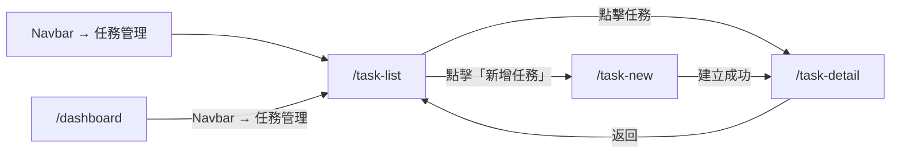

# 功能規格：任務列表（搜尋、篩選、空狀態）

**功能分支**：`010-task-list`
**建立日期**：2026-04-05
**狀態**：Clarified
**需求來源**：IA v7 Spec 清單 #010 — 任務列表（搜尋、篩選、空狀態）

## 使用者情境與測試 *(必填)*

### User Story 1 — 查看有成員資格的任務列表（優先級：P1）

已登入使用者在 `/task-list` 查看自己具有任務成員資格的所有任務，每筆任務顯示名稱、任務類型、當前狀態與整體進度。

**此優先級原因**：任務列表是任務管理模組的入口，使用者需要從這裡進入個別任務的詳情頁。

**獨立測試方式**：以有任務成員資格的使用者登入，確認只顯示自己有成員資格的任務；確認無成員資格的任務��顯示。

**驗收情境**：

1. **Given** 已登入使用者在 `/task-list`，**When** 頁面載入，**Then** 只顯示使用者在 `task_membership` 中有記錄的任務列表。
2. **Given** 使用者在 `/task-list`，**When** 查看任務列表，**Then** 每筆任務顯示：任務名稱、任務類型（Classification / Scoring / Sentence Pair / NER / Relation Extraction）、狀態 badge（草稿 / Dry Run 進行中 / 等待 IAA 確認 / Official Run 進行中 / 已完成）、整體完成率。
3. **Given** 使用者在 `/task-list`，**When** 點擊任一任務，**Then** 導向該任務的 `/task-detail`。
4. **Given** 使用者在 `/task-list`，**When** 點擊「新增任務」按鈕，**Then** 導向 `/task-new`。

---

### User Story 2 — 搜尋與篩選任務（優先級：P2）

使用者可依任務名稱搜尋，或依任務類型、狀態篩選任務列表。

**此優先級原因**：隨著任務數量增加，搜尋與篩選是提升操作效率的基本功能。

**獨立測試方式**：建立多個不同類型與狀態的任務後，驗證搜尋與篩選結果正確。

**驗收情境**：

1. **Given** 使用者在 `/task-list`，**When** 輸入任務名稱關鍵字，**Then** 列表即時篩選顯示名稱包含該關鍵字的任務。
2. **Given** 使用者在 `/task-list`，**When** 選擇任務類型篩選（例如：Classification），**Then** 只顯示該類型的任務。
3. **Given** 使用者在 `/task-list`，**When** 選擇狀態篩選（例如：進行中），**Then** 只顯示符合狀態的任務。
4. **Given** 使用者在 `/task-list`，**When** 同時使用名稱搜尋與類型篩選，**Then** 顯示同時符合兩個條件的任務。

---

### User Story 3 — 空狀態（優先級：P2）

使用者尚未有任何任務成員資格時，頁面顯示空狀態說明文字與引導 CTA。

**此優先級原因**：明確的空狀態指引，讓新使用者知道下一步要做什麼。

**獨立測試方式**：以新建立且尚未加入任何任務的帳號登入，確認空狀態畫面正確顯示。

**驗收情境**：

1. **Given** 使用者尚未有任何任務成員資格，**When** 進入 `/task-list`，**Then** 顯示空狀態說明文字與「建立第一個任務」按鈕（導向 `/task-new`）。

---

### 邊界情況

- `super_admin` 是否看到所有任務？→ 否；`super_admin` 也需要有 `task_membership` 記錄才能看到任務，平台層級的管理與任務層級的成員資格是獨立的。
- 任務狀態如何排序？→ 預設依建立時間倒序（最新任務在前）；使用者可依狀態篩選。

---

## 需求規格 *(必填)*

### 功能需求

- **FR-001**：`/task-list` 只有已登入使用者可存取；只顯示使用者在 `task_membership` 中有記錄的任務。
- **FR-002**：每筆任務列表項目必須顯示：任務名稱、任務類型、狀態 badge、整體完成率。
- **FR-003**：頁面預設依任務建立時間倒序排列。
- **FR-004**：頁面必須支援依任務名稱的即時搜尋篩選。
- **FR-005**：頁面必須支援依任務類型（5 種 `task_type`）與任務狀態的篩選。
- **FR-006**：點擊任務列表項目導向 `/task-detail`。
- **FR-007**：頁面右上角必須提供「新增任務」按鈕導向 `/task-new`。
- **FR-008**：空狀態（使用者無任何任務成員資格）顯示說明文字與「建立第一個任務」按鈕（→ `/task-new`）。

### User Flow & Navigation

| From | Trigger | To |
|------|---------|-----|
| Navbar → 任務管理 | 點擊 | `/task-list` |
| `/task-list` | 點擊任務 | `/task-detail` |
| `/task-list` | 點擊「新增任務」 | `/task-new` |
| `/task-new` | 建立成功 | `/task-detail` |
| `/task-detail` | 返回 | `/task-list` |

**Entry points**：Navbar → 任務管理；Dashboard Project Leader 視角的任務總覽區「查看全部」連結，以及 Annotator 視角的任務列表「查看全部」連結（待 Dashboard spec 與 Task Detail spec 建立後補充）。
**Exit points**：點擊任務 → `/task-detail`；新增任務 → `/task-new`。

> **設計差異說明**：`/task-list` 以任務（task）為單位顯示，每個任務只有一列，不按 run_type 分類。Dashboard Annotator 視角將任務依「Dry Run」與「Official Run」分兩區顯示，是為了讓標記員快速進入標記；`/task-list` 的目的是任務總攬與管理入口，兩者視角不同，設計差異屬預期行為。

### 關鍵實體

- **Task（任務）**：顯示欄位：`id`、`name`、`task_type`（`classification` | `scoring` | `sentence_pair` | `ner` | `relation_extraction`）、`status`（`draft` | `dry_run` | `waiting_iaa` | `official_run` | `completed`）、整體完成率（已完成筆數 / 總筆數）。
- **TaskMembership（任務成員）**：決定使用者可看到哪些任務的依據：`task_id`、`user_id`、`task_role`。

---

## 成功標準 *(必填)*

- **SC-001**：頁面只顯示使用者有 `task_membership` 記錄的任務，不洩漏其他任務資訊。
- **SC-002**：搜尋與篩選結果即時反映，不需重新載入頁面。
- **SC-003**：任務狀態 badge 顏色與文字正確反映當前任務狀態。
- **SC-004**：空狀態顯示正確且引導按鈕功能正常（導向 `/task-new`）。
