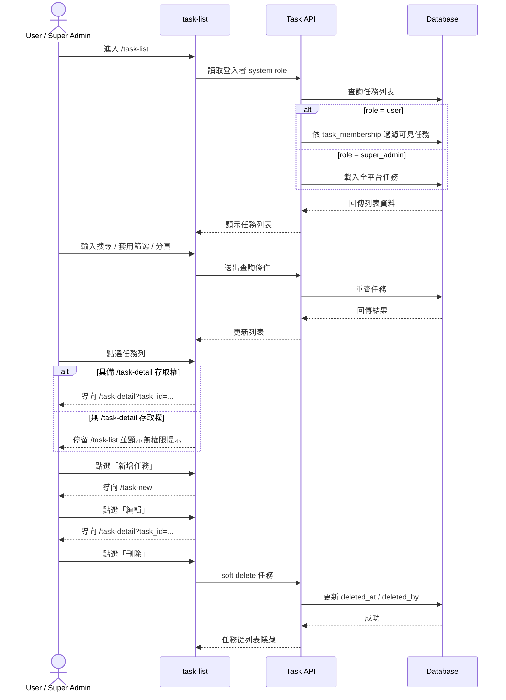
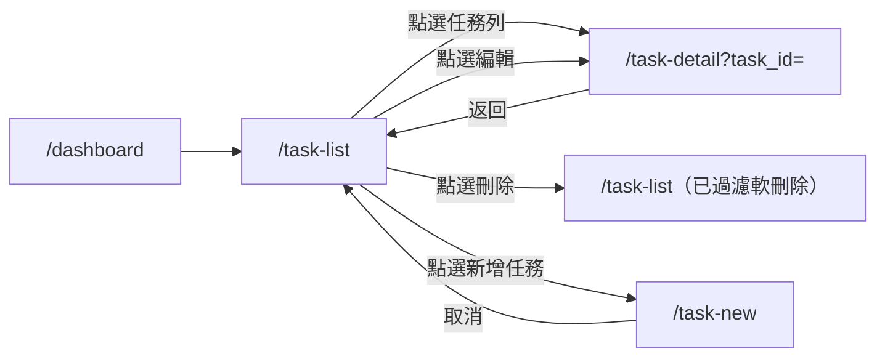

# 功能規格：Task List — 任務列表

**功能分支**：`010-task-list`
**建立日期**：2026-04-20
**版本**：1.3.6
**狀態**：Draft
**需求來源**：IA Spec 清單 #010 — 任務列表（搜尋、篩選、空狀態）（`task-list`）

## 規格常數

- `SYSTEM_ROLES = user | super_admin`
- `TASK_ROLES = project_leader | reviewer | annotator`
- `PAGE_SIZE_DEFAULT = 20`
- `PAGE_SIZE_OPTIONS = 20 | 50 | 100`
- `DEFAULT_SORT = updated_at desc`
- `TASK_STATUS_ENUM = draft | dry_run_in_progress | waiting_iaa_confirmation | official_run_in_progress | completed`
- `TASK_TYPE_ENUM = single_sentence_classification | single_sentence_scoring_regression | sequence_labeling | relation_extraction | sentence_pairs`
- `TASK_TYPE_SOURCE = task_type_registry`（回傳值需對齊 `TASK_TYPE_ENUM`）
- `RUN_STAGE_ENUM = dry_run | official_run`
- `TASK_DELETE_MODE = soft_delete`
- `MOBILE_BP = 767px`
- `RWD_VIEWPORTS = 375px / 768px / 1440px`

## Process Flow

| 步驟 | 角色 | 動作 | 系統回應 |
|------|------|------|---------|
| 1 | `user` / `super_admin` | 進入 `/task-list` | 顯示對應權限可見的任務列表 |
| 2 | `user` | 檢視任務列表 | 僅顯示自己有 `task_membership` 的任務 |
| 3 | `super_admin` | 進入任務列表 | 預設載入全平台任務，不顯示檢視切換 |
| 4 | `user` / `super_admin` | 搜尋、篩選、分頁 | 列表即時更新，保留查詢條件 |
| 5 | `user` / `super_admin` | 點選任務 | 有權限則導向 `/task-detail`；無權限則停留並提示 |
| 6 | `user` / `super_admin` | 點選新增任務 | 導向 `/task-new` |
| 7 | `user` / `super_admin` | 點選編輯 | 導向 `/task-detail` 並帶入目標 `task_id` |
| 8 | `user` / `super_admin` | 點選刪除 | 對任務執行 `soft_delete`，列表隱藏該任務 |

---

## 使用者情境與測試 *(必填)*

### User Story 1 — 檢視任務列表與搜尋篩選（優先級：P1）

登入使用者可在任務列表頁快速找到自己要處理的任務，並透過搜尋與篩選定位目標。

**此優先級原因**：任務管理模組入口能力，後續建立任務與任務詳情都依賴此頁。  
**獨立測試方式**：以 `user` 與 `super_admin` 各自登入，驗證列表資料範圍、搜尋、篩選與分頁正確性。

**驗收情境**：

1. **Given** `system role = user`，**When** 進入 `/task-list`，**Then** 僅顯示該使用者有成員資格的任務。
2. **Given** `system role = super_admin`，**When** 進入 `/task-list`，**Then** 預設顯示全平台任務，且不提供檢視切換。
3. **Given** 位於 `/task-list`，**When** 輸入關鍵字並套用任務類型 / 標記階段 / 狀態篩選，**Then** 列表僅顯示符合條件的任務。
4. **Given** 搜尋結果超過單頁，**When** 切換分頁，**Then** 顯示對應頁資料且保留現有篩選條件。
5. **Given** 位於任務列表，**When** 點選列內 `編輯`，**Then** 導向 `/task-detail?task_id=...`。
6. **Given** 位於任務列表，**When** 點選列內 `刪除` 並確認，**Then** 任務被軟刪除，列表不再顯示該任務。

**介面定義（需與 IA 導覽語意一致）**：

- 區塊 A：`任務列表`
  - 必要元素：
    - 搜尋輸入框（`搜尋`，作用於列表所有欄位）
    - 任務類型篩選器（顯示文案對應 `TASK_TYPE_ENUM`）
    - 標記階段篩選器（顯示文案對應 `RUN_STAGE_ENUM`）
    - 狀態篩選器（顯示文案對應 `TASK_STATUS_ENUM`）
    - 空資料時保留表頭（`thead`）與欄位語意
    - 空資料 / 空結果內容以 `tbody` 單列 empty row 呈現（`colspan` 全欄）
    - 分頁控制
    - 任務列欄位（任務名稱、任務類型、標記階段（Annotation stage）、狀態、更新時間、操作）
    - 操作欄位：`刪除`、`編輯`（由左至右）
- 區塊 B：`頁面操作`
  - 必要元素：
    - `新增任務` CTA

**行為規則**：

- `user` 不可查看沒有 membership 的任務。
- 搜尋輸入框需配置於篩選器列最右側。
- 任務類型篩選器查詢值必須使用 `TASK_TYPE_ENUM`；顯示文案由 i18n 映射，不可作為 API 契約值。
- 任務類型選項來源需為 `TASK_TYPE_SOURCE`（registry），且回傳值需對齊 `TASK_TYPE_ENUM`。
- 標記階段篩選器查詢值必須使用 `RUN_STAGE_ENUM`；顯示文案由 i18n 映射，不可作為 API 契約值。
- 狀態篩選器查詢值必須使用 `TASK_STATUS_ENUM`；顯示文案由 i18n 映射，不可作為 API 契約值。
- `super_admin` 進入 `/task-list` 預設即為全平台任務視角，且不提供「我的任務 / 全平台任務」切換。
- 搜尋條件採 `contains`，不分大小寫，作用於任務列表所有欄位（任務名稱、任務類型、標記階段、狀態、更新時間）。
- 列表預設排序 `DEFAULT_SORT`，分頁預設 `PAGE_SIZE_DEFAULT`。
- 查詢條件（`keyword`、`task_type`、`run_stage`、`status`、`page`、`page_size`）需同步到 URL query，於同頁分頁切換、重新整理與返回 `/task-list` 時保留。
- 任務列點擊時若使用者無 `/task-detail` 存取權，系統需顯示「無權限檢視任務詳情」提示，且不得導頁。
- `編輯` 操作需與點擊任務列同語意，導向 `/task-detail?task_id=...`。
- `刪除` 操作必須為軟刪除（`TASK_DELETE_MODE`），不得物理刪除資料。
- `刪除` 操作需先經刪除確認彈窗；彈窗樣式需沿用 task-management 既有共用 modal（`modal-backdrop` / `modal` / `modal-actions`）。
- 軟刪除後任務不應出現在預設任務列表；資料保留供審計與復原。
- 任務類型 badge 需依 `task_type` 類型套用不同色彩樣式（不可全部同色）。
- 語系為中文時，任務類型 badge 文案需顯示中文映射（例如：`single_sentence_classification` → `單句分類（含多標籤）`）。
- 標記階段 `official_run` 的中文顯示文案需為 `正式標記`。
- 「尚無任務」狀態不顯示第二顆 `新增任務` 按鈕；新增入口維持頁面主操作區（搜尋列同列）單一 `新增任務` CTA。
- 「空結果（篩選後）」需顯示清除篩選操作（例如 `清除所有篩選`）。
- 語言切換時，列表欄位、篩選器與按鈕文字需即時更新。

---

### User Story 2 — 從任務列表進入核心流程（優先級：P1）

使用者可從任務列表直接進入任務詳情或新增任務流程，且導覽 active 狀態維持在任務管理模組。

**此優先級原因**：是 task-management 模組的主導航起點。  
**獨立測試方式**：驗證任務列點擊導向 `/task-detail`、新增任務導向 `/task-new`，並檢查 L0 active 狀態。

**驗收情境**：

1. **Given** 位於 `/task-list`，**When** 點選任務列，**Then** 導向 `/task-detail` 並帶入目標 `task_id`。
2. **Given** 位於 `/task-list`，**When** 點選 `新增任務`，**Then** 導向 `/task-new`。
3. **Given** 位於 `/task-list` 或其子頁（`/task-new`、`/task-detail`），**When** 檢視 Sidebar，**Then** L0 active 皆顯示在「任務管理」。
4. **Given** 位於 `/task-list`，**When** 點選列內 `編輯`，**Then** 導向 `/task-detail?task_id=...`。
5. **Given** 位於 `/task-list`，**When** 點選列內 `刪除` 並確認，**Then** 任務執行軟刪除且從列表隱藏。

**行為規則**：

- `/task-list` 為 task-management 模組 Landing。
- 進入 `/task-detail` 時若缺少有效 task context，導回 `/task-list` 並顯示提示。
- 任務列表空狀態需維持表格骨架（保留表頭）與單一路徑主操作（頁面主 `新增任務` CTA）。

---

### Edge Cases

- 使用者沒有任何任務 membership：顯示表格內空狀態（保留表頭），不顯示錯誤頁。
- `super_admin` 在全平台任務無資料：顯示表格內空狀態（保留表頭），不顯示錯誤頁。
- 以失效 `task_id` 嘗試進入 `/task-detail`：導回 `/task-list` 並顯示「任務不存在或無存取權限」。
- 高篩選條件組合導致無結果：顯示空結果狀態，保留一鍵清除篩選。
- 任務可見但無 `/task-detail` 存取權（如 `annotator`）：點擊任務列後停留原頁並顯示無權限提示。
- 任務已被軟刪除：不顯示於預設列表；以舊連結直連時需回應「任務不存在或無存取權限」。
- 行動版欄位不足時：可採橫向捲動或卡片化，但不得資訊重疊。

---

## 需求規格 *(必填)*

### 功能需求

- **FR-001**：系統必須提供 `/task-list` 作為 task-management 模組 Landing。
- **FR-002**：`user` 在 `/task-list` 只可看見自己有 `task_membership` 的任務。
- **FR-003**：`super_admin` 在 `/task-list` 必須預設載入全平台任務，且不得提供「我的任務 / 全平台任務」切換。
- **FR-004**：系統必須支援任務列表搜尋（所有欄位）、任務類型篩選、標記階段篩選、狀態篩選與分頁。
- **FR-004a**：搜尋需為 `contains` 且不分大小寫，作用於列表所有欄位。
- **FR-004aa**：任務類型篩選查詢值必須使用 `TASK_TYPE_ENUM`，且與顯示文案分離。
- **FR-004aaa**：任務類型選項來源必須來自 `TASK_TYPE_SOURCE`（registry），且回傳值需對齊 `TASK_TYPE_ENUM`。
- **FR-004ab**：標記階段篩選查詢值必須使用 `RUN_STAGE_ENUM`，且與顯示文案分離。
- **FR-004ac**：狀態篩選查詢值必須使用 `TASK_STATUS_ENUM`，且與顯示文案分離。
- **FR-004b**：列表預設排序必須為 `DEFAULT_SORT`。
- **FR-004c**：分頁預設為 `PAGE_SIZE_DEFAULT`，可切換 `PAGE_SIZE_OPTIONS`。
- **FR-004d**：查詢條件（`keyword`、`task_type`、`run_stage`、`status`、`page`、`page_size`）必須序列化於 URL query，並於重整與返回頁面時還原。
- **FR-005**：列表每列必須包含 `task_id` 導航資訊，供導向 `/task-detail`。
- **FR-005a**：當點擊任務列但無 `/task-detail` 存取權時，系統必須停留 `/task-list` 並顯示無權限提示。
- **FR-006**：頁面必須提供 `新增任務` CTA 並導向 `/task-new`。
- **FR-007**：L0 active 狀態必須在 `task-list`、`task-new`、`task-detail` 都維持「任務管理」。
- **FR-008**：任務列表在無資料與空結果時，必須保留表頭並以 `tbody` empty row 呈現狀態內容。
- **FR-008a**：`尚無任務` empty row 不得顯示第二顆 `新增任務` 按鈕；新增入口以頁面主 `新增任務` CTA 為唯一主路徑。
- **FR-008b**：`空結果（篩選後）` empty row 必須提供清除篩選操作，且清除後返回無篩選列表狀態。
- **FR-009**：頁面必須支援 `RWD_VIEWPORTS`，在 `<= MOBILE_BP` 仍可完成搜尋、篩選、導頁操作。
- **FR-009a**：在 `375px`、`768px`、`1440px` 三個 viewport，必須可完成操作：搜尋、狀態篩選、分頁切換、點擊任務列、點擊 `新增任務`，且不得發生資訊重疊。
- **FR-010**：任務列表每列必須提供操作欄，至少包含 `刪除` 與 `編輯`，且順序為左 `刪除`、右 `編輯`。
- **FR-010a**：點擊 `編輯` 時，系統必須導向 `/task-detail?task_id=...`。
- **FR-010b**：點擊 `刪除` 時，系統必須執行軟刪除（設定 `deleted_at` 與刪除操作者），且不得物理刪除資料。
- **FR-010c**：軟刪除任務不得出現在預設 `/task-list` 結果中。
- **FR-010d**：刪除確認流程必須使用 task-management 共用 modal 樣式，不得使用瀏覽器原生 `confirm`。
- **FR-011**：任務類型 badge 必須依 `task_type` 使用不同視覺色彩，不得全部使用同一 badge 色彩。
- **FR-011a**：當語系為 `zh` 時，任務類型 badge 文案必須顯示中文映射；語系為 `en` 時顯示英文文案。
- **FR-011b**：標記階段 `official_run` 在中文文案必須顯示為 `正式標記`。

### User Flow & Navigation

| From | Trigger | To |
|------|---------|-----|
| `/dashboard` | 點擊 Sidebar「任務管理」 | `/task-list` |
| `/task-list` | 點擊任務列（有權限） | `/task-detail?task_id=...` |
| `/task-list` | 點擊任務列（無權限） | 停留 `/task-list` 並顯示提示 |
| `/task-list` | 點擊 `編輯` | `/task-detail?task_id=...` |
| `/task-list` | 點擊 `刪除`（確認） | 停留 `/task-list` 並隱藏該任務（soft delete） |
| `/task-list` | 點擊 `新增任務` | `/task-new` |
| `/task-detail` | 點擊返回 | `/task-list` |
| `/task-new` | 點擊取消 | `/task-list` |

**Entry points**：Sidebar「任務管理」。  
**Exit points**：`/task-new`、`/task-detail`、其他 L0 模組導覽。

### 關鍵實體

- **TaskSummary**：任務列表列項。關鍵欄位：`task_id`、`task_name`、`task_type`、`run_stage`、`status`、`updated_at`、`deleted_at`、`deleted_by`。
- **TaskMembership**：任務成員關係。關鍵欄位：`task_id`、`user_id`、`task_role`、`membership_status`。
- **TaskListQuery**：列表查詢條件。欄位：`keyword`、`task_type`（`TASK_TYPE_ENUM`）、`run_stage`（`RUN_STAGE_ENUM`）、`status`（`TASK_STATUS_ENUM`）、`page`、`page_size`。

---

## 規格相依性 *(本功能依賴其他規格，或被其他規格依賴時填寫)*

### 上游（本規格依賴的規格）

| 規格編號 | 功能 | 本規格需要的內容 |
|---------|------|----------------|
| 001 | Login — Email / Password | 已登入狀態與路由守門 |
| 008 | Shared Sidebar Navbar | L0 導覽、active 狀態與 RWD 導覽規範 |
| 012 | Dashboard | 從 dashboard 進入 task-management 的入口語意 |

### 下游（依賴本規格的規格）

| 規格編號 | 功能 | 依賴本規格的內容 |
|---------|------|----------------|
| 013 | New Task | 從任務列表進入新增任務流程 |
| 014 | Task Detail | 從任務列表進入任務詳情 |
| 015 | Annotation Workspace | 任務清單入口與 task context 導入 |
| 016 | Dataset Stats | 任務清單入口與 task context 導入 |
| 017 | Dataset Quality | 任務清單入口與 task context 導入 |

---

## 成功標準 *(必填)*

- **SC-001**：`user` 進入 `/task-list` 時，只會看到有 membership 的任務。
- **SC-002**：`super_admin` 進入 `/task-list` 時，預設顯示全平台任務，且頁面不出現檢視切換控制。
- **SC-003**：搜尋（所有欄位）、任務類型 / 標記階段 / 狀態篩選、分頁可獨立與組合運作，並於同頁更新結果。
- **SC-004**：點擊任務列時，有權限者可導向 `/task-detail`，無權限者停留 `/task-list` 並收到提示。
- **SC-005**：在 `375px`、`768px`、`1440px` 下皆可完成搜尋、任務類型篩選、標記階段篩選、狀態篩選、分頁、點擊任務列、點擊 `新增任務`，且無資訊重疊。
- **SC-006**：查詢條件經由 URL query 保留，重新整理與返回 `/task-list` 時可正確還原。
- **SC-007**：無資料與空結果時，`task-list` 皆保留表頭，並於 `tbody` 顯示對應 empty row 內容。
- **SC-008**：`尚無任務` 狀態僅保留頁面主 `新增任務` CTA；`空結果` 狀態可直接清除篩選返回列表。
- **SC-009**：點擊任務列 `編輯` 可導向 `/task-detail`；點擊 `刪除` 後任務會軟刪除並從列表隱藏。

---

## Changelog

| 版本 | 日期 | 變更摘要 |
|------|------|---------|
| 1.3.6 | 2026-04-22 | 任務類型對齊 `task-new` 下拉實際選項：`TASK_TYPE_ENUM` 改為 `single_sentence_classification / single_sentence_scoring_regression / sequence_labeling / relation_extraction / sentence_pairs`（不含生成式標記） |
| 1.3.5 | 2026-04-22 | 與 `013-task-new` 對齊：兩份 spec 共同定義 `TASK_TYPE_ENUM = Single Sentence | Sequence Labeling | Sentence Pairs | Generative Labeling`，並保留 registry 來源約束 |
| 1.3.4 | 2026-04-22 | 對齊 `013-task-new`：任務類型改為 registry-driven，`TASK_TYPE_ENUM` 改為 `TASK_TYPE_SOURCE = task_type_registry`，相關篩選與查詢契約同步更新 |
| 1.3.3 | 2026-04-22 | 搜尋輸入框文案改為「搜尋」並擴充為全欄位搜尋；新增篩選器 `任務類型`、`標記階段`；搜尋框位置調整為篩選器列最右側 |
| 1.3.2 | 2026-04-22 | 任務類型 badge 改為依類型不同色彩，且中文語系顯示中文任務類型名稱；標記階段 `official_run` 中文文案統一為 `正式標記` |
| 1.3.1 | 2026-04-22 | 操作欄位按鈕左右對調為左 `刪除`、右 `編輯`；刪除確認改為 task-management 共用 modal 樣式（取代原生 confirm） |
| 1.3.0 | 2026-04-22 | 任務列表新增「操作」欄位（`編輯` / `刪除`）：`編輯` 導向 `task-detail`，`刪除` 改為 `soft_delete` 並從列表隱藏 |
| 1.2.1 | 2026-04-22 | 介面詞彙統一：任務列表欄位統一為「標記階段（Annotation stage）」；欄位命名同步為 `run_stage` |
| 1.2.0 | 2026-04-20 | 對齊 task-list 最新 empty state 呈現：保留表頭並改為表格內 empty row；移除「尚無任務」內嵌新增按鈕，空結果保留清除篩選操作 |
| 1.1.0 | 2026-04-20 | 調整 task-list 可見性規則：`super_admin` 改為預設全平台任務且移除「我的任務 / 全平台任務」切換；URL query 與資料模型移除 `scope` 欄位 |
| 1.0.0 | 2026-04-20 | 初版建立：依 IA 重建 `task-list` 規格（可見性、搜尋篩選、導覽與空狀態） |
