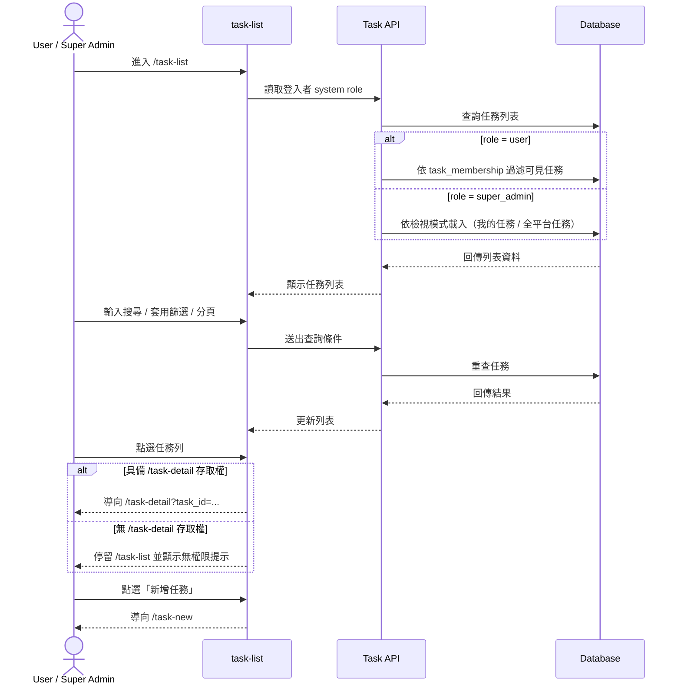
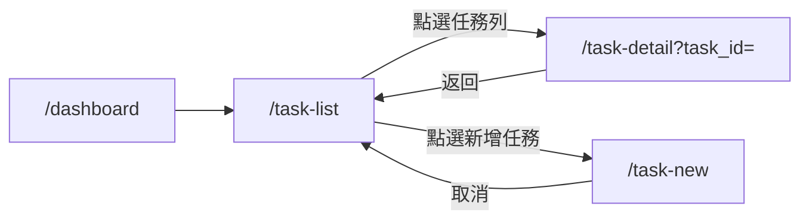

# 功能規格：Task List — 任務列表

**功能分支**：`010-task-list`
**建立日期**：2026-04-20
**版本**：1.0.0
**狀態**：Draft
**需求來源**：IA Spec 清單 #010 — 任務列表（搜尋、篩選、空狀態）（`task-list`）

## 規格常數

- `SYSTEM_ROLES = user | super_admin`
- `TASK_ROLES = project_leader | reviewer | annotator`
- `PAGE_SIZE_DEFAULT = 20`
- `PAGE_SIZE_OPTIONS = 20 | 50 | 100`
- `DEFAULT_SORT = updated_at desc`
- `TASK_STATUS_ENUM = draft | dry_run_in_progress | waiting_iaa_confirmation | official_run_in_progress | completed`
- `SUPER_ADMIN_SCOPE = my | all`（`my` = 以 `task_membership` 判定）
- `MOBILE_BP = 767px`
- `RWD_VIEWPORTS = 375px / 768px / 1440px`

## Process Flow

| 步驟 | 角色 | 動作 | 系統回應 |
|------|------|------|---------|
| 1 | `user` / `super_admin` | 進入 `/task-list` | 顯示對應權限可見的任務列表 |
| 2 | `user` | 檢視任務列表 | 僅顯示自己有 `task_membership` 的任務 |
| 3 | `super_admin` | 切換檢視模式 | 可於「我的任務 / 全平台任務」間切換 |
| 4 | `user` / `super_admin` | 搜尋、篩選、分頁 | 列表即時更新，保留查詢條件 |
| 5 | `user` / `super_admin` | 點選任務 | 有權限則導向 `/task-detail`；無權限則停留並提示 |
| 6 | `user` / `super_admin` | 點選新增任務 | 導向 `/task-new` |

---

## 使用者情境與測試 *(必填)*

### User Story 1 — 檢視任務列表與搜尋篩選（優先級：P1）

登入使用者可在任務列表頁快速找到自己要處理的任務，並透過搜尋與篩選定位目標。

**此優先級原因**：任務管理模組入口能力，後續建立任務與任務詳情都依賴此頁。  
**獨立測試方式**：以 `user` 與 `super_admin` 各自登入，驗證列表資料範圍、搜尋、篩選與分頁正確性。

**驗收情境**：

1. **Given** `system role = user`，**When** 進入 `/task-list`，**Then** 僅顯示該使用者有成員資格的任務。
2. **Given** `system role = super_admin`，**When** 進入 `/task-list`，**Then** 可切換檢視「我的任務 / 全平台任務」。
3. **Given** 位於 `/task-list`，**When** 輸入關鍵字並套用狀態篩選，**Then** 列表僅顯示符合條件的任務。
4. **Given** 搜尋結果超過單頁，**When** 切換分頁，**Then** 顯示對應頁資料且保留現有篩選條件。

**介面定義（需與 IA 導覽語意一致）**：

- 區塊 A：`任務列表`
  - 必要元素：
    - 搜尋輸入框（任務名稱）
    - 狀態篩選器（顯示文案對應 `TASK_STATUS_ENUM`）
    - 分頁控制
    - 任務列欄位（任務名稱、Task Type、Run Type、Status、更新時間）
- 區塊 B：`頁面操作`
  - 必要元素：
    - `新增任務` CTA
    - `super_admin` 專用檢視模式切換（我的任務 / 全平台任務）

**行為規則**：

- `user` 不可查看沒有 membership 的任務。
- 狀態篩選器查詢值必須使用 `TASK_STATUS_ENUM`；顯示文案由 i18n 映射，不可作為 API 契約值。
- `super_admin` 在「全平台任務」模式可查看所有任務，但仍遵守任務細節頁角色 gating。
- `super_admin` 的「我的任務」範圍以 `task_membership` 判定，不以 `creator_id` 判定。
- 搜尋條件採 `contains`，不分大小寫，作用於任務名稱。
- 列表預設排序 `DEFAULT_SORT`，分頁預設 `PAGE_SIZE_DEFAULT`。
- 查詢條件（`keyword`、`status`、`page`、`page_size`、`scope`）需同步到 URL query，於同頁分頁切換、重新整理與返回 `/task-list` 時保留。
- 任務列點擊時若使用者無 `/task-detail` 存取權，系統需顯示「無權限檢視任務詳情」提示，且不得導頁。
- 語言切換時，列表欄位、篩選器與按鈕文字需即時更新。

---

### User Story 2 — 從任務列表進入核心流程（優先級：P1）

使用者可從任務列表直接進入任務詳情或新增任務流程，且導覽 active 狀態維持在任務管理模組。

**此優先級原因**：是 task-management 模組的主導航起點。  
**獨立測試方式**：驗證任務列點擊導向 `/task-detail`、新增任務導向 `/task-new`，並檢查 L0 active 狀態。

**驗收情境**：

1. **Given** 位於 `/task-list`，**When** 點選任務列，**Then** 導向 `/task-detail` 並帶入目標 `task_id`。
2. **Given** 位於 `/task-list`，**When** 點選 `新增任務`，**Then** 導向 `/task-new`。
3. **Given** 位於 `/task-list` 或其子頁（`/task-new`、`/task-detail`），**When** 檢視 Sidebar，**Then** L0 active 皆顯示在「任務管理」。

**行為規則**：

- `/task-list` 為 task-management 模組 Landing。
- 進入 `/task-detail` 時若缺少有效 task context，導回 `/task-list` 並顯示提示。
- 任務列表空狀態需提供明確下一步（建立任務）入口。

---

### Edge Cases

- 使用者沒有任何任務 membership：顯示空狀態與 `新增任務` CTA，不顯示錯誤頁。
- `super_admin` 在「我的任務」模式無資料：顯示空狀態，允許切至「全平台任務」。
- 以失效 `task_id` 嘗試進入 `/task-detail`：導回 `/task-list` 並顯示「任務不存在或無存取權限」。
- 高篩選條件組合導致無結果：顯示空結果狀態，保留一鍵清除篩選。
- 任務可見但無 `/task-detail` 存取權（如 `annotator`）：點擊任務列後停留原頁並顯示無權限提示。
- 行動版欄位不足時：可採橫向捲動或卡片化，但不得資訊重疊。

---

## 需求規格 *(必填)*

### 功能需求

- **FR-001**：系統必須提供 `/task-list` 作為 task-management 模組 Landing。
- **FR-002**：`user` 在 `/task-list` 只可看見自己有 `task_membership` 的任務。
- **FR-003**：`super_admin` 在 `/task-list` 必須可切換「我的任務 / 全平台任務」。
- **FR-004**：系統必須支援任務名稱搜尋、狀態篩選與分頁。
- **FR-004a**：搜尋需為 `contains` 且不分大小寫。
- **FR-004aa**：狀態篩選查詢值必須使用 `TASK_STATUS_ENUM`，且與顯示文案分離。
- **FR-004b**：列表預設排序必須為 `DEFAULT_SORT`。
- **FR-004c**：分頁預設為 `PAGE_SIZE_DEFAULT`，可切換 `PAGE_SIZE_OPTIONS`。
- **FR-004d**：查詢條件（`keyword`、`status`、`page`、`page_size`、`scope`）必須序列化於 URL query，並於重整與返回頁面時還原。
- **FR-004e**：`super_admin` 的 `scope=my` 必須以 `task_membership` 作為過濾條件。
- **FR-005**：列表每列必須包含 `task_id` 導航資訊，供導向 `/task-detail`。
- **FR-005a**：當點擊任務列但無 `/task-detail` 存取權時，系統必須停留 `/task-list` 並顯示無權限提示。
- **FR-006**：頁面必須提供 `新增任務` CTA 並導向 `/task-new`。
- **FR-007**：L0 active 狀態必須在 `task-list`、`task-new`、`task-detail` 都維持「任務管理」。
- **FR-008**：任務列表空狀態必須提供可操作的下一步 CTA。
- **FR-009**：頁面必須支援 `RWD_VIEWPORTS`，在 `<= MOBILE_BP` 仍可完成搜尋、篩選、導頁操作。
- **FR-009a**：在 `375px`、`768px`、`1440px` 三個 viewport，必須可完成操作：搜尋、狀態篩選、分頁切換、點擊任務列、點擊 `新增任務`，且不得發生資訊重疊。

### User Flow & Navigation

| From | Trigger | To |
|------|---------|-----|
| `/dashboard` | 點擊 Sidebar「任務管理」 | `/task-list` |
| `/task-list` | 點擊任務列（有權限） | `/task-detail?task_id=...` |
| `/task-list` | 點擊任務列（無權限） | 停留 `/task-list` 並顯示提示 |
| `/task-list` | 點擊 `新增任務` | `/task-new` |
| `/task-detail` | 點擊返回 | `/task-list` |
| `/task-new` | 點擊取消 | `/task-list` |

**Entry points**：Sidebar「任務管理」。  
**Exit points**：`/task-new`、`/task-detail`、其他 L0 模組導覽。

### 關鍵實體

- **TaskSummary**：任務列表列項。關鍵欄位：`task_id`、`task_name`、`task_type`、`run_type`、`status`、`updated_at`。
- **TaskMembership**：任務成員關係。關鍵欄位：`task_id`、`user_id`、`task_role`、`membership_status`。
- **TaskListQuery**：列表查詢條件。欄位：`keyword`、`status`（`TASK_STATUS_ENUM`）、`page`、`page_size`、`scope`（`my`/`all`；`my` 依 `task_membership` 判定）。

---

## 規格相依性 *(本功能依賴其他規格，或被其他規格依賴時填寫)*

### 上游（本規格依賴的規格）

| 規格編號 | 功能 | 本規格需要的內容 |
|---------|------|----------------|
| 001 | Login — Email / Password | 已登入狀態與路由守門 |
| 008 | Shared Sidebar Navbar | L0 導覽、active 狀態與 RWD 導覽規範 |
| 012 | Dashboard | 從 dashboard 進入 task-management 的入口語意 |

### 下游（依賴本規格的規格）

| 規格編號 | 功能 | 依賴本規格的內容 |
|---------|------|----------------|
| 013 | New Task | 從任務列表進入新增任務流程 |
| 014 | Task Detail | 從任務列表進入任務詳情 |
| 015 | Annotation Workspace | 任務清單入口與 task context 導入 |
| 016 | Dataset Stats | 任務清單入口與 task context 導入 |
| 017 | Dataset Quality | 任務清單入口與 task context 導入 |

---

## 成功標準 *(必填)*

- **SC-001**：`user` 進入 `/task-list` 時，只會看到有 membership 的任務。
- **SC-002**：`super_admin` 可在「我的任務 / 全平台任務」間切換且結果正確。
- **SC-003**：搜尋、篩選、分頁可獨立與組合運作，並於同頁更新結果。
- **SC-004**：點擊任務列時，有權限者可導向 `/task-detail`，無權限者停留 `/task-list` 並收到提示。
- **SC-005**：在 `375px`、`768px`、`1440px` 下皆可完成搜尋、狀態篩選、分頁、點擊任務列、點擊 `新增任務`，且無資訊重疊。
- **SC-006**：查詢條件經由 URL query 保留，重新整理與返回 `/task-list` 時可正確還原。

---

## Changelog

| 版本 | 日期 | 變更摘要 |
|------|------|---------|
| 1.0.0 | 2026-04-20 | 初版建立：依 IA 重建 `task-list` 規格（可見性、搜尋篩選、導覽與空狀態） |
