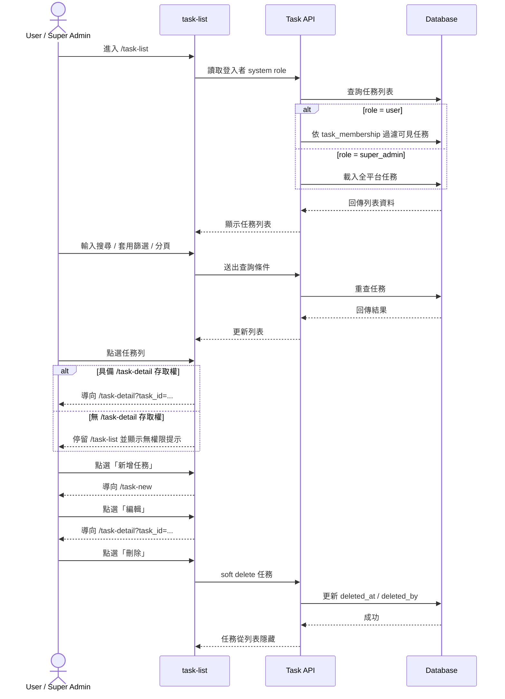
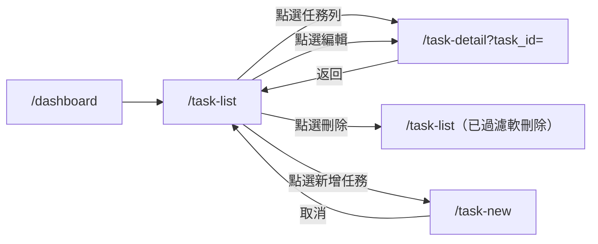

# 功能規格：Task List — 任務列表

**需求來源**: IA Spec 清單 #010 — 任務列表（搜尋、篩選、空狀態）（`task-list`）

## 功能目標

讓使用者以 config-driven 的輸出類型快速辨識、搜尋與篩選任務；任務列表直接消費 `outputs[].type`，並以一至多個唯讀標籤呈現組合，不將任務壓縮回單一固定類型。Prototype 以 `docs/product/example-data/` 的 13 份任務作為可驗收示例資料，但系統能力不得被限制為這 13 筆、既有組合或固定任務名稱。

## 輸入與生成規則

**輸入描述**：本規格需定義 Task List 的任務管理流程、task config 契約、成員/執行狀態、導頁、i18n 與 RWD 行為。

**產生規格時必須遵守**：

1. 先確認本規格範圍與需求來源一致：IA Spec 清單 #010 — 任務列表（搜尋、篩選、空狀態）（task-list）。
2. 若新增或改動角色權限、導頁、資料欄位、錯誤狀態、i18n、可存取屬性或響應式邊界，必須同步檢查使用者情境、功能需求、成功標準與規格相依性。
3. 若需求描述缺少角色、狀態、資料來源、權限、錯誤處理、導頁目標或量化門檻，需以待釐清標記記錄具體問題，不得自行假設。
4. 規格應描述使用者可觀察行為、業務規則與驗收條件；避免描述框架、檔案結構、API 實作或資料庫實作，除非該內容本身是已定義的產品契約。
5. 本規格若與 prototype、IA 或上游規格不一致，必須明確記錄差異、更新相依性，並新增 changelog。

**已釐清事項**：

- 本版以既有需求來源與本文件中的 流程圖、使用者情境、功能需求、成功標準 作為 scope baseline。
- 跨頁或跨模組共用行為需透過「規格相依性」追蹤，不在本文件中隱含建立未列出的依賴。
- 若後續新增實作層契約，需先確認是否構成行為變更；若是，必須依 SDD 流程更新 spec。

## Clarifications

### Session 2026-05-22

- Q: 刪除任務的權限應該限定給哪些角色？ → A: 僅 `project_leader` 與 `super_admin` 可刪除。
- Q: 搜尋「所有欄位」時，enum 欄位應該比對哪一種文字？ → A: 同時比對 raw enum 值與目前語系顯示文案。
- Q: URL query 出現無效的 `limit`、`offset` 或 enum 值時應如何處理？ → A: 忽略無效值，使用預設值並更新 URL。
- Q: 任務列表資料載入失敗時，畫面應如何呈現？ → A: 保留表頭，在 `tbody` 顯示錯誤列與重試操作。
- Q: 刪除任務是否應受任務狀態限制？ → A: 僅 `draft` 可刪除。

## 規格常數

- `SYSTEM_ROLES = user | super_admin`
- `TASK_ROLES = project_leader | reviewer | annotator`
- `LIST_LIMIT_DEFAULT = 20`
- `LIST_LIMIT_OPTIONS = 20 | 50 | 100`
- `LIST_OFFSET_DEFAULT = 0`
- `DEFAULT_SORT = updated_at desc`
- `TASK_STATUS_ENUM = draft | dry_run_in_progress | waiting_iaa_confirmation | official_run_in_progress | completed`
- `OUTPUT_TYPE_KEYS = single_label | multi_label | single_dim | multi_dim | sequence_tagging | entity_recognition | relation_identification | free_text`
- `OUTPUT_TYPE_SOURCE = OUTPUT_TYPE_REGISTRY`（唯一合法 key 與 zh/en 顯示文案來源）
- `RUN_STAGE_ENUM = dry_run | official_run`
- `TASK_DELETE_MODE = soft_delete`
- `MOBILE_BP = 767px`
- `RWD_VIEWPORTS = 375px / 768px / 1440px`

## 流程圖

```mermaid
sequenceDiagram
    actor U as User / Super Admin
    participant UI as task-list
    participant API as Task API
    participant DB as Database

    U->>UI: 進入 /task-list
    UI->>API: 讀取登入者 system role
    API->>DB: 查詢任務列表
    alt role = user
        API->>DB: 依 task_membership 過濾可見任務
    else role = super_admin
        API->>DB: 載入全平台任務
    end
    DB-->>API: 回傳列表資料
    API-->>UI: 顯示任務列表

    U->>UI: 輸入搜尋 / 套用篩選 / 分頁
    UI->>API: 送出查詢條件
    API->>DB: 重查任務
    DB-->>API: 回傳結果
    API-->>UI: 更新列表

    U->>UI: 點選任務列
    alt 具備 /task-detail 存取權
        UI-->>U: 導向 /task-detail?task_id=...
    else 無 /task-detail 存取權
        UI-->>U: 停留 /task-list 並顯示無權限提示
    end

    U->>UI: 點選「新增任務」
    UI-->>U: 導向 /task-new

    U->>UI: 點選「編輯」
    UI-->>U: 導向 /task-detail?task_id=...

    U->>UI: 點選「刪除」
    UI->>API: soft delete 任務
    API->>DB: 更新 deleted_at / deleted_by
    DB-->>API: 成功
    API-->>UI: 任務從列表隱藏
```

| 步驟 | 角色 | 動作 | 系統回應 |
|------|------|------|---------|
| 1 | `user` / `super_admin` | 進入 `/task-list` | 顯示對應權限可見的任務列表 |
| 2 | `user` | 檢視任務列表 | 僅顯示自己有 `task_membership` 的任務 |
| 3 | `super_admin` | 進入任務列表 | 預設載入全平台任務，不顯示檢視切換 |
| 4 | `user` / `super_admin` | 搜尋、篩選、分頁 | 列表即時更新，保留查詢條件 |
| 5 | `user` / `super_admin` | 點選任務 | 有權限則導向 `/task-detail`；無權限則停留並提示 |
| 6 | `user` / `super_admin` | 點選新增任務 | 導向 `/task-new` |
| 7 | `user` / `super_admin` | 點選編輯 | 導向 `/task-detail` 並帶入目標 `task_id` |
| 8 | `user` / `super_admin` | 點選刪除 | 對任務執行 `soft_delete`，列表隱藏該任務 |

---

## 使用者情境與測試 *(必填)*

### 使用者故事 1 — 檢視任務列表與搜尋篩選（優先級：P1）

登入使用者可在任務列表頁快速找到自己要處理的任務，並透過搜尋與篩選定位目標。

**此優先級原因**：任務管理模組入口能力，後續建立任務與任務詳情都依賴此頁。
**獨立測試方式**：以 `user` 與 `super_admin` 各自登入，驗證列表資料範圍、搜尋、篩選與分頁正確性。

**驗收情境**：

1. **Given** `system role = user`，**When** 進入 `/task-list`，**Then** 僅顯示該使用者有成員資格的任務。
2. **Given** `system role = super_admin`，**When** 進入 `/task-list`，**Then** 預設顯示全平台任務，且不提供檢視切換。
3. **Given** 位於 `/task-list`，**When** 輸入關鍵字並套用輸出類型 / 標記階段 / 狀態篩選，**Then** 列表僅顯示符合條件的任務。
4. **Given** 搜尋結果超過單頁，**When** 切換分頁，**Then** 顯示對應頁資料且保留現有篩選條件。
5. **Given** 位於任務列表，**When** 點選列內 `編輯`，**Then** 導向 `/task-detail?task_id=...`。
6. **Given** 位於任務列表，**When** 點選列內 `刪除` 並確認，**Then** 任務被軟刪除，列表不再顯示該任務。

**介面定義（需與 IA 導覽語意一致）**：

- 區塊 A：`任務列表`
  - 必要元素：
    - 搜尋輸入框（`搜尋`，作用於列表所有欄位）
    - 輸出類型篩選器（`全部輸出類型` 加上 `OUTPUT_TYPE_KEYS` 的 8 個選項）
    - 標記階段篩選器（顯示文案對應 `RUN_STAGE_ENUM`）
    - 狀態篩選器（顯示文案對應 `TASK_STATUS_ENUM`）
    - 空資料時保留表頭（`thead`）與欄位語意
    - 空資料 / 空結果內容以 `tbody` 單列 empty row 呈現（`colspan` 全欄）
    - 載入失敗時保留表頭，並以 `tbody` 單列 error row 呈現錯誤訊息與重試操作（`colspan` 全欄）
    - 分頁控制
    - 任務列欄位（任務名稱、輸出類型、標記階段（Annotation stage）、狀態、更新時間、操作）
    - 操作欄位：`刪除`、`編輯`（由左至右）
- 區塊 B：`頁面操作`
  - 必要元素：
    - `新增任務` CTA

**行為規則**：

- `user` 不可查看沒有 membership 的任務。
- 搜尋輸入框需配置於篩選器列最右側。
- 輸出類型篩選器必須顯示 `全部輸出類型` 與正好 8 個 `OUTPUT_TYPE_KEYS` 選項；查詢值使用 raw output key，顯示文案由 `OUTPUT_TYPE_REGISTRY` 的 i18n metadata 映射，不可作為 API 契約值。
- 選定單一 `output_type` 時，只要任務的 `outputs[]` 任一項滿足 `output.type === selectedOutputType` 即符合篩選；複合任務可同時出現在多個輸出類型篩選結果中。
- 標記階段篩選器查詢值必須使用 `RUN_STAGE_ENUM`；顯示文案由 i18n 映射，不可作為 API 契約值。
- 狀態篩選器查詢值必須使用 `TASK_STATUS_ENUM`；顯示文案由 i18n 映射，不可作為 API 契約值。
- `super_admin` 進入 `/task-list` 預設即為全平台任務視角，且不提供「我的任務 / 全平台任務」切換。
- 搜尋條件採 `contains`，不分大小寫，作用於任務列表所有欄位（任務名稱、每個輸出類型、標記階段、狀態、更新時間）。
- 搜尋輸出類型、標記階段、狀態等 enum 欄位時，必須同時比對每個 raw enum 值與目前語系的 i18n 顯示文案。
- 列表預設排序 `DEFAULT_SORT`，分頁預設 `limit = LIST_LIMIT_DEFAULT`、`offset = LIST_OFFSET_DEFAULT`。
- 查詢條件（`keyword`、`output_type`、`run_stage`、`status`、`limit`、`offset`）需同步到 URL query，於同頁分頁切換、重新整理與返回 `/task-list` 時保留。
- 套用、切換或清除任一搜尋／篩選條件時，`offset` 必須重設為 `0`；切換每頁筆數時也必須以新 `limit` 與 `offset = 0` 重查。
- URL query 中的無效 `limit`、`offset` 或 enum 值必須忽略，改用對應預設值或無篩選狀態，並以正規化後的 query 更新 URL。
- 任務列點擊時若使用者無 `/task-detail` 存取權，系統需顯示「無權限檢視任務詳情」提示，且不得導頁。
- `編輯` 操作需與點擊任務列同語意，導向 `/task-detail?task_id=...`。
- 任務列點擊（含 `編輯`）只以 `task_id` 建立 task context；不得把複合任務壓縮為第一個輸出類型，也不得寫入舊 `labelsuite.activeTaskType` 單值快取。
- `刪除` 操作必須為軟刪除（`TASK_DELETE_MODE`），不得物理刪除資料。
- `刪除` 操作僅允許 `project_leader` 與 `super_admin` 執行；其他角色不得看到可用刪除操作，若直接呼叫刪除動作需收到無權限提示且不得變更任務。
- `刪除` 操作僅允許套用於 `status = draft` 的任務；非 `draft` 任務不得顯示可用刪除操作，若直接觸發刪除需被拒絕且不得變更任務。
- `刪除` 操作需先經刪除確認彈窗；彈窗樣式需沿用 task-management 既有共用 modal（`modal-backdrop` / `modal` / `modal-actions`）。
- 軟刪除後任務不應出現在預設任務列表；資料保留供審計與復原。
- 輸出類型欄必須依 `outputs[]` 順序，為每個 `output.type` 各呈現一個唯讀 tag；複合任務不得合併成自訂的固定類型 badge。
- 輸出類型 tag 的 zh/en 文案必須來自 `OUTPUT_TYPE_REGISTRY`；顏色只能作為輔助，tag 必須保留可見文字，且 tag 群組需具有可存取名稱，使螢幕閱讀器可讀出完整輸出類型清單。
- 多個 tag 在欄寬不足時必須於儲存格內換行，不得截斷標籤文字、互相重疊或造成整頁水平 overflow。
- 標記階段 `official_run` 的中文顯示文案需為 `正式標記`。
- 「尚無任務」狀態不顯示第二顆 `新增任務` 按鈕；新增入口維持頁面主操作區（搜尋列同列）單一 `新增任務` CTA。
- 「空結果（篩選後）」需顯示清除篩選操作（例如 `清除所有篩選`）。
- 任務列表載入失敗時不得顯示為空資料；需保留表頭並在 `tbody` 顯示錯誤列與重試操作。
- 語言切換時，列表欄位、篩選器與按鈕文字需即時更新。

---

### 使用者故事 2 — 從任務列表進入核心流程（優先級：P1）

使用者可從任務列表直接進入任務詳情或新增任務流程，且導覽 active 狀態維持在任務管理模組。

**此優先級原因**：是 task-management 模組的主導航起點。
**獨立測試方式**：驗證任務列點擊導向 `/task-detail`、新增任務導向 `/task-new`，並檢查 L0 active 狀態。

**驗收情境**：

1. **Given** 位於 `/task-list`，**When** 點選任務列，**Then** 導向 `/task-detail` 並帶入目標 `task_id`。
2. **Given** 位於 `/task-list`，**When** 點選 `新增任務`，**Then** 導向 `/task-new`。
3. **Given** 位於 `/task-list` 或其子頁（`/task-new`、`/task-detail`），**When** 檢視 Sidebar，**Then** L0 active 皆顯示在「任務管理」。
4. **Given** 位於 `/task-list`，**When** 點選列內 `編輯`，**Then** 導向 `/task-detail?task_id=...`。
5. **Given** 位於 `/task-list`，**When** 點選列內 `刪除` 並確認，**Then** 任務執行軟刪除且從列表隱藏。

**行為規則**：

- `/task-list` 為 task-management 模組 Landing。
- 進入 `/task-detail` 時若缺少有效 task context，導回 `/task-list` 並顯示提示。
- 任務列表空狀態需維持表格骨架（保留表頭）與單一路徑主操作（頁面主 `新增任務` CTA）。

---

### 邊界情況

- 使用者沒有任何任務 membership：顯示表格內空狀態（保留表頭），不顯示錯誤頁。
- `super_admin` 在全平台任務無資料：顯示表格內空狀態（保留表頭），不顯示錯誤頁。
- 以失效 `task_id` 嘗試進入 `/task-detail`：導回 `/task-list` 並顯示「任務不存在或無存取權限」。
- 高篩選條件組合導致無結果：顯示空結果狀態，保留一鍵清除篩選。
- URL query 含無效 `limit`、`offset` 或 enum 值：使用預設值或無篩選狀態載入列表，並更新為正規化後的 URL query。
- 任務列表資料載入失敗：保留表格表頭，於 `tbody` error row 顯示錯誤訊息與重試操作。
- 任務可見但無 `/task-detail` 存取權（如 `annotator`）：點擊任務列後停留原頁並顯示無權限提示。
- 任務已被軟刪除：不顯示於預設列表；以舊連結直連時需回應「任務不存在或無存取權限」。
- 無刪除權限的角色（非 `project_leader` 且非 `super_admin`）嘗試刪除任務：不得變更任務，並顯示無權限提示。
- 非 `draft` 狀態任務嘗試刪除：不得變更任務，並顯示狀態不允許刪除的提示。
- 行動版欄位不足時：可採橫向捲動或卡片化，但不得資訊重疊。

---

## 需求規格 *(必填)*

### 功能需求

- **FR-001**：系統必須提供 `/task-list` 作為 task-management 模組 Landing。
- **FR-002**：`user` 在 `/task-list` 只可看見自己有 `task_membership` 的任務。
- **FR-003**：`super_admin` 在 `/task-list` 必須預設載入全平台任務，且不得提供「我的任務 / 全平台任務」切換。
- **FR-004**：系統必須支援任務列表搜尋（所有欄位）、輸出類型篩選、標記階段篩選、狀態篩選與分頁。
- **FR-004a**：搜尋需為 `contains` 且不分大小寫，作用於列表所有欄位。
- **FR-004ad**：搜尋輸出類型時，系統必須逐一比對 `outputs[].type` 的 raw key 與目前語系顯示文案；其他 enum 欄位亦同。
- **FR-004aa**：輸出類型篩選查詢值必須使用 `OUTPUT_TYPE_KEYS`，且與顯示文案分離；預設選項為不帶值的 `全部輸出類型`。
- **FR-004aaa**：輸出類型選項與 zh/en 文案必須來自 `OUTPUT_TYPE_REGISTRY`，且篩選器必須正好列出 8 個 `OUTPUT_TYPE_KEYS`。
- **FR-004aae**：`output_type` 採 membership 語意；任務的 `outputs[]` 任一項符合選定 key 即納入結果，不得只比較第一項或要求輸出組合完全相等。
- **FR-004ab**：標記階段篩選查詢值必須使用 `RUN_STAGE_ENUM`，且與顯示文案分離。
- **FR-004ac**：狀態篩選查詢值必須使用 `TASK_STATUS_ENUM`，且與顯示文案分離。
- **FR-004b**：列表預設排序必須為 `DEFAULT_SORT`。
- **FR-004c**：分頁契約必須使用 `limit` / `offset`；預設為 `LIST_LIMIT_DEFAULT` / `LIST_OFFSET_DEFAULT`，並可切換 `LIST_LIMIT_OPTIONS`。
- **FR-004d**：查詢條件（`keyword`、`output_type`、`run_stage`、`status`、`limit`、`offset`）必須序列化於 URL query，並於重整與返回頁面時還原。
- **FR-004e**：URL query 中的無效 `limit`、`offset` 或 enum 值必須被正規化為預設值或無篩選狀態，且 URL 必須更新為正規化後的 query。
- **FR-004f**：任何搜尋或篩選條件改變，以及 `limit` 改變時，必須將 `offset` 重設為 `0`。
- **FR-005**：列表每列必須包含 `task_id` 導航資訊，供導向 `/task-detail`。
- **FR-005a**：當點擊任務列但無 `/task-detail` 存取權時，系統必須停留 `/task-list` 並顯示無權限提示。
- **FR-006**：頁面必須提供 `新增任務` CTA 並導向 `/task-new`。
- **FR-007**：L0 active 狀態必須在 `task-list`、`task-new`、`task-detail` 都維持「任務管理」。
- **FR-008**：任務列表在無資料與空結果時，必須保留表頭並以 `tbody` empty row 呈現狀態內容。
- **FR-008a**：`尚無任務` empty row 不得顯示第二顆 `新增任務` 按鈕；新增入口以頁面主 `新增任務` CTA 為唯一主路徑。
- **FR-008b**：`空結果（篩選後）` empty row 必須提供清除篩選操作，且清除後返回無篩選列表狀態。
- **FR-008c**：任務列表資料載入失敗時，必須保留表頭並以 `tbody` error row 顯示錯誤訊息與重試操作，不得顯示為空資料。
- **FR-009**：頁面必須支援 `RWD_VIEWPORTS`，在 `<= MOBILE_BP` 仍可完成搜尋、篩選、導頁操作。
- **FR-009a**：在 `375px`、`768px`、`1440px` 三個 viewport，必須可完成操作：搜尋、狀態篩選、分頁切換、點擊任務列、點擊 `新增任務`，且不得發生資訊重疊。
- **FR-010**：任務列表每列必須提供操作欄，至少包含 `刪除` 與 `編輯`，且順序為左 `刪除`、右 `編輯`。
- **FR-010a**：點擊 `編輯` 時，系統必須導向 `/task-detail?task_id=...`。
- **FR-010b**：點擊 `刪除` 時，系統必須執行軟刪除（設定 `deleted_at` 與刪除操作者），且不得物理刪除資料。
- **FR-010c**：軟刪除任務不得出現在預設 `/task-list` 結果中。
- **FR-010d**：刪除確認流程必須使用 task-management 共用 modal 樣式，不得使用瀏覽器原生 `confirm`。
- **FR-010e**：刪除任務僅允許 `project_leader` 與 `super_admin`；其他角色不得看到可用刪除操作，且直接觸發刪除時必須被拒絕並顯示無權限提示。
- **FR-010f**：刪除任務僅允許 `status = draft`；非 `draft` 任務不得看到可用刪除操作，且直接觸發刪除時必須被拒絕並顯示狀態不允許刪除的提示。
- **FR-011**：任務列表必須將每筆任務的 `outputs[].type` 逐項呈現為唯讀 tag；複合任務顯示多個 tag，且不得硬編固定組合名稱或渲染分支。
- **FR-011a**：輸出類型 tag 必須依 `OUTPUT_TYPE_REGISTRY` 顯示 zh/en 文案，並以可見文字與可存取名稱傳達類型，不得只依賴顏色。
- **FR-011c**：多個輸出類型 tag 必須支援儲存格內換行；在 `RWD_VIEWPORTS` 均不得截斷文字、互相重疊或造成頁面水平 overflow。
- **FR-011b**：標記階段 `official_run` 在中文文案必須顯示為 `正式標記`。
- **FR-012**：點擊任務列或 `編輯` 時只以 `task_id` 導入 task context；系統不得持久化單一 `task_type`，亦不得將 `outputs[]` 壓縮成第一個輸出類型。

### 使用者流程與導頁

```mermaid
flowchart LR
    dashboard["/dashboard"] --> tasklist["/task-list"]
    tasklist -->|點選任務列| taskdetail["/task-detail?task_id="]
    tasklist -->|點選編輯| taskdetail
    tasklist -->|點選刪除| tasklist_filtered["/task-list（已過濾軟刪除）"]
    tasklist -->|點選新增任務| tasknew["/task-new"]
    taskdetail -->|返回| tasklist
    tasknew -->|取消| tasklist
```

| From | Trigger | To |
|------|---------|-----|
| `/dashboard` | 點擊 Sidebar「任務管理」 | `/task-list` |
| `/task-list` | 點擊任務列（有權限） | `/task-detail?task_id=...` |
| `/task-list` | 點擊任務列（無權限） | 停留 `/task-list` 並顯示提示 |
| `/task-list` | 點擊 `編輯` | `/task-detail?task_id=...` |
| `/task-list` | 點擊 `刪除`（確認） | 停留 `/task-list` 並隱藏該任務（soft delete） |
| `/task-list` | 點擊 `新增任務` | `/task-new` |
| `/task-detail` | 點擊返回 | `/task-list` |
| `/task-new` | 點擊取消 | `/task-list` |

**Entry points**：Sidebar「任務管理」。
**Exit points**：`/task-new`、`/task-detail`、其他 L0 模組導覽。

### 關鍵實體

- **TaskSummary**：任務列表列項。關鍵欄位：`task_id`、`task_name`、`outputs: { type: OUTPUT_TYPE_KEYS }[]`、`run_stage`、`status`、`updated_at`、`deleted_at`、`deleted_by`。
- **TaskMembership**：任務成員關係。關鍵欄位：`task_id`、`user_id`、`task_role`、`membership_status`。
- **TaskListQuery**：列表查詢條件。欄位：`keyword`、`output_type`（`OUTPUT_TYPE_KEYS`）、`run_stage`（`RUN_STAGE_ENUM`）、`status`（`TASK_STATUS_ENUM`）、`limit`、`offset`。

### Prototype 示例資料基線

下表是 prototype 的靜態示例資料對照，用於驗收 8 種合法輸出類型與複合標籤呈現；它不是 API、任務數量、輸出組合或未來產品能力的上限。Prototype 只讀取每份 fixture 的任務展示 metadata，不得顯示或序列化資料中的 gold、reference、answer、ground truth 或其他答案內容。

| `docs/product/example-data/` fixture | `outputs[].type` 標籤 |
|------|------|
| `single-label.json` | `single_label` |
| `nli.json` | `single_label` |
| `multi-label.json` | `multi_label` |
| `multi-label-hierarchical.json` | `multi_label` |
| `single-dim.json` | `single_dim` |
| `multi-dim.json` | `multi_dim` |
| `sequence-tagging.json` | `sequence_tagging` |
| `entity-recognition.json` | `entity_recognition` |
| `relation-identification.json` | `relation_identification` |
| `medical-ner-re.json` | `entity_recognition`、`relation_identification` |
| `absa-va.json` | `entity_recognition`、`relation_identification`、`multi_dim` |
| `free-text.json` | `free_text` |
| `mrc.json` | `free_text` |

依 membership 語意套用單一輸出類型篩選時，這 13 筆示例的命中數必須為：`single_label = 2`、`multi_label = 2`、`single_dim = 1`、`multi_dim = 2`、`sequence_tagging = 1`、`entity_recognition = 3`、`relation_identification = 3`、`free_text = 2`。

---

## 規格相依性 *(本功能依賴其他規格，或被其他規格依賴時填寫)*

### 上游（本規格依賴的規格）

| 規格編號 | 功能 | 本規格需要的內容 |
|---------|------|----------------|
| 001 | Login — Email / Password | 已登入狀態與路由守門 |
| 008 | Shared Sidebar Navbar | L0 導覽、active 狀態與 RWD 導覽規範 |
| 012 | Dashboard | 從 dashboard 進入 task-management 的入口語意 |
| 013 | New Task | `OUTPUT_TYPE_REGISTRY`、8 個 `OUTPUT_TYPE_KEYS` 與 `outputs[]` producer contract |

### 下游（依賴本規格的規格）

| 規格編號 | 功能 | 依賴本規格的內容 |
|---------|------|----------------|
| 013 | New Task | 從任務列表進入新增任務流程 |
| 014 | Task Detail | 從任務列表進入任務詳情 |
| 015 | Annotation Workspace | 任務清單入口與 task context 導入 |
| 016 | Dataset Stats | 任務清單入口與 task context 導入 |
| 017 | Dataset Quality | 任務清單入口與 task context 導入 |

> **v2.0.0 下游同步界線**：本版只定義 010 Task List 對 `outputs[].type` 的展示、搜尋與篩選契約。014／015／016／017 仍有舊固定任務類型或未完成的 consumer contract，依既有產品決策延後同步；本版不得宣稱這些 consumer 已與 `outputs[]` 相容。

---

## 成功標準 *(必填)*

- **SC-001**：`user` 進入 `/task-list` 時，只會看到有 membership 的任務。
- **SC-002**：`super_admin` 進入 `/task-list` 時，預設顯示全平台任務，且頁面不出現檢視切換控制。
- **SC-003**：搜尋（所有欄位）、輸出類型 / 標記階段 / 狀態篩選、`limit` / `offset` 分頁可獨立與組合運作，並於同頁更新結果。
- **SC-004**：點擊任務列時，有權限者可導向 `/task-detail`，無權限者停留 `/task-list` 並收到提示。
- **SC-005**：在 `375px`、`768px`、`1440px` 下皆可完成搜尋、輸出類型篩選、標記階段篩選、狀態篩選、分頁、點擊任務列、點擊 `新增任務`，且多 tag 可換行、無截斷或資訊重疊。
- **SC-006**：查詢條件經由 URL query 保留，重新整理與返回 `/task-list` 時可正確還原。
- **SC-007**：無資料與空結果時，`task-list` 皆保留表頭，並於 `tbody` 顯示對應 empty row 內容。
- **SC-008**：`尚無任務` 狀態僅保留頁面主 `新增任務` CTA；`空結果` 狀態可直接清除篩選返回列表。
- **SC-009**：點擊任務列 `編輯` 可導向 `/task-detail`；點擊 `刪除` 後任務會軟刪除並從列表隱藏。
- **SC-010**：Prototype 預設資料顯示上表 13 筆不同任務；`全部輸出類型` 不遺漏任一筆，且 8 個單一篩選結果命中數完全符合示例基線。
- **SC-011**：任務列表載入失敗時，頁面保留表頭並顯示錯誤列與重試操作，不得誤呈現為無資料或空結果。
- **SC-012**：`medical-ner-re.json` 顯示 2 個輸出類型 tag，`absa-va.json` 顯示 3 個；tag 文字、順序、可存取名稱與換行行為均由 `outputs[]` 與 registry metadata 驅動。
- **SC-013**：新增第 14 筆具有任意合法 `outputs[]` 組合的任務後，列表與對應 `output_type` 篩選可直接呈現該任務，不需新增任務名稱、輸出組合或 renderer/filter 分支。
- **SC-014**：任務列表及其可供 annotator 存取的資料不得出現任何示例 fixture 的 gold、reference、answer、ground truth 或等價答案內容。
- **SC-015**：本版新增或修改的 prototype 驗收情境皆有對應 Playwright 測試，涵蓋 13 筆基線、8 個篩選器選項與命中數、複合 tag、14th-task 泛化及三個 `RWD_VIEWPORTS`。

---

## 審查與驗收清單

### 內容品質

- [x] 規格聚焦使用者可觀察行為、業務規則與驗收條件。
- [x] 所有必填章節已完成；不適用的內容已明確排除或未納入本版範圍。
- [x] 無未解決的待釐清標記殘留。
- [x] 需求、驗收情境與成功標準皆可測試。

### Label Suite 合規性

- [x] 本次實作分支已記錄為 `feat/task-output-type-list`，並與 `STATUS.md` 一致。
- [x] 已檢查本規格未要求跨 feature import；跨模組共用行為需透過 shared contract 或規格相依性追蹤。
- [x] 涉及 output type / task config 的行為皆要求由 registry、schema 或凍結 config 驅動，不以硬編任務邏輯定義。
- [x] 已檢查 annotator-facing API / UI 不得暴露 test-set answer、ground-truth 或等價特權資料。
- [x] Prototype / IA / 上游規格 source of truth 已列於需求來源或規格相依性。
- [x] 上下游規格相依性已列出；若本規格改版，需檢查 downstream 影響。

### 執行狀態

- [x] 輸入描述已解析。
- [x] 角色、互動、資料狀態與限制已萃取。
- [x] 模糊點已釐清或明確排除於本版範圍。
- [x] 使用者情境已定義。
- [x] 功能需求已定義。
- [x] 關鍵實體或狀態模型已定義。
- [x] Review checklist 已通過。

---

## Changelog

| 版本 | 日期 | 變更摘要 |
|------|------|---------|
| 2.0.0 | 2026-07-29 | **任務列表遷移至可組合輸出類型**：移除固定 `TASK_TYPE_ENUM`、`task_type` 篩選與 `labelsuite.activeTaskType` 單值快取契約；列表改以 `outputs[].type` 逐項呈現可換行、具文字與可存取名稱的 tag，篩選器由 `OUTPUT_TYPE_REGISTRY` 列出 8 個合法 key 並以 membership 語意比對。URL query 與分頁改為 `output_type`、`limit`、`offset`。加入 13 份 prototype 示例 fixture 的 mapping／命中數基線、複合 tag、14th-task 泛化與答案資料不外露驗收；13 筆僅為示例，不構成系統上限。014／015／016／017 consumer 同步維持延後。 |
| 1.3.9 | 2026-05-22 | 釐清並同步 task-list 原型：刪除權限限 `project_leader` / `super_admin` 且僅 `draft` 可刪；搜尋 enum 比對 raw value 與目前語系文案；無效 URL query 正規化；載入失敗以表格 error row 與重試操作呈現 |
| 1.3.8 | 2026-05-21 | 補充輸入與產生規則、已釐清事項、審查清單與執行狀態；同步功能分支格式 |
| 1.3.7 | 2026-04-23 | 同步原型：`TASK_TYPE_ENUM` 以 `single_sentence_va_scoring` 取代 `single_sentence_scoring_regression`，並新增 `labelsuite.activeTaskType` 持久化契約供 annotation-workspace 啟動 fallback |
| 1.3.6 | 2026-04-22 | 任務類型對齊 `task-new` 下拉實際選項：`TASK_TYPE_ENUM` 改為 `single_sentence_classification / single_sentence_scoring_regression / sequence_labeling / relation_extraction / sentence_pairs`（不含生成式標記） |
| 1.3.5 | 2026-04-22 | 與 `013-task-new` 對齊：兩份 spec 共同定義 `TASK_TYPE_ENUM = Single Sentence | Sequence Labeling | Sentence Pairs | Generative Labeling`，並保留 registry 來源約束 |
| 1.3.4 | 2026-04-22 | 對齊 `013-task-new`：任務類型改為 registry-driven，`TASK_TYPE_ENUM` 改為 `TASK_TYPE_SOURCE = task_type_registry`，相關篩選與查詢契約同步更新 |
| 1.3.3 | 2026-04-22 | 搜尋輸入框文案改為「搜尋」並擴充為全欄位搜尋；新增篩選器 `任務類型`、`標記階段`；搜尋框位置調整為篩選器列最右側 |
| 1.3.2 | 2026-04-22 | 任務類型 badge 改為依類型不同色彩，且中文語系顯示中文任務類型名稱；標記階段 `official_run` 中文文案統一為 `正式標記` |
| 1.3.1 | 2026-04-22 | 操作欄位按鈕左右對調為左 `刪除`、右 `編輯`；刪除確認改為 task-management 共用 modal 樣式（取代原生 confirm） |
| 1.3.0 | 2026-04-22 | 任務列表新增「操作」欄位（`編輯` / `刪除`）：`編輯` 導向 `task-detail`，`刪除` 改為 `soft_delete` 並從列表隱藏 |
| 1.2.1 | 2026-04-22 | 介面詞彙統一：任務列表欄位統一為「標記階段（Annotation stage）」；欄位命名同步為 `run_stage` |
| 1.2.0 | 2026-04-20 | 對齊 task-list 最新 empty state 呈現：保留表頭並改為表格內 empty row；移除「尚無任務」內嵌新增按鈕，空結果保留清除篩選操作 |
| 1.1.0 | 2026-04-20 | 調整 task-list 可見性規則：`super_admin` 改為預設全平台任務且移除「我的任務 / 全平台任務」切換；URL query 與資料模型移除 `scope` 欄位 |
| 1.0.0 | 2026-04-20 | 初版建立：依 IA 重建 `task-list` 規格（可見性、搜尋篩選、導覽與空狀態） |
