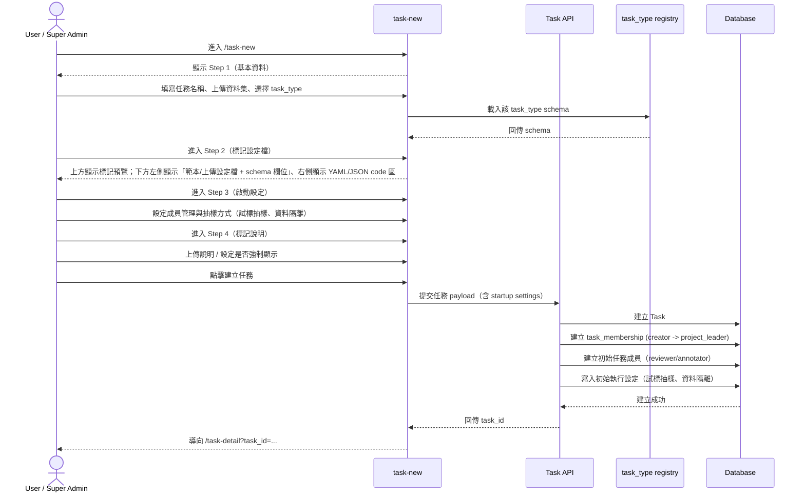
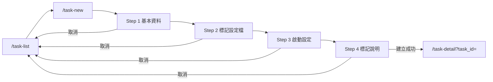

# 功能規格：New Task — 新增任務（Step 1–4 + 啟動設定 + 標記設定檔）

**功能分支**：`013-task-new`
**建立日期**：2026-04-20
**版本**：1.9.4
**狀態**：Draft
**需求來源**：IA Spec 清單 #013 — 新增任務（Step 1–4 + 啟動設定 + 標記設定檔 全任務類型）（`task-new`）

## 規格常數

- `SYSTEM_ROLES = user | super_admin`
- `TASK_ROLES = project_leader | reviewer | annotator`
- `TASK_CREATION_STEPS = step-1-basic | step-2-config-builder | step-3-startup-settings | step-4-guideline`
- `TASK_TYPE_ENUM = single_sentence_classification | single_sentence_va_scoring | sequence_labeling | relation_extraction | sentence_pairs`
- `SEQUENCE_LABELING_SUBTYPES = ner | aspect_list`
- `TASK_CONFIG_MODES = visual | code`
- `CONFIG_FORMATS = yaml | json`
- `CONFIG_UPLOAD_FORMATS = yaml | yml | json`
- `TASK_CREATOR_SYSTEM_ROLES = user | super_admin`
- `DATASET_UPLOAD_FORMATS = txt | csv | tsv | json`
- `DATASET_MAX_FILE_SIZE_MB = 200`
- `DATASET_MAX_ROWS = 1000000`
- `DATASET_ENCODING = utf-8`
- `GUIDELINE_FORMATS = pdf | image | markdown`
- `GUIDELINE_IMAGE_FORMATS = png | jpg | jpeg | webp`
- `RUN_INIT_SAMPLING_MODES = by_count | by_percentage`
- `RUN_INIT_PERCENT_RANGE = 1..99`
- `RUN_INIT_COUNT_MIN = 1`
- `RUN_ISOLATION_DEFAULT = enabled`
- `SAMPLING_DEFAULTS_BY_TYPE` — 各任務類型的試標預設參數表（見下方）

| 任務類型 | 建議 IAA | Std 上限 | 最少標記者數 | 試標抽樣比例 |
| --- | --- | --- | --- | --- |
| `single_sentence_classification` | 0.75 | — | 3 | 12% |
| `single_sentence_va_scoring` | 0.75 | 0.10 | 5 | 15% |
| `sequence_labeling` | 0.82 | — | 3 | 15% |
| `relation_extraction` | 0.78 | — | 3 | 18% |
| `sentence_pairs` | 0.76 | 0.15 | 3 | 12% |

- `INITIAL_MEMBER_SOURCES = platform-users | email-invite`
- `PLATFORM_MEMBER_ROLE_FILTER = system_role == user`
- `IDEMPOTENCY_WINDOW_HOURS = 24`
- `MOBILE_BP = 767px`
- `RWD_VIEWPORTS = 375px / 768px / 1440px`

## Process Flow

| 步驟 | 角色 | 動作 | 系統回應 |
|------|------|------|---------|
| 1 | `user` / `super_admin` | 進入 `/task-new` | 顯示 Step 1 基本資料 |
| 2 | `user` / `super_admin` | 選擇 `task_type` | 載入對應 schema 與 Step 2 設定介面 |
| 3 | `user` / `super_admin` | 完成 Step 2 標記設定檔 | 產生可提交的 config |
| 4 | `user` / `super_admin` | 完成 Step 3 啟動設定 | 記錄初始成員與抽樣方式設定 |
| 5 | `user` / `super_admin` | 完成 Step 4 標記說明設定（可略過） | 記錄說明資產與強制顯示設定 |
| 6 | `user` / `super_admin` | 建立任務 | 建立 task、creator 的 `project_leader` membership、初始成員、初始執行設定 |
| 7 | `user` / `super_admin` | 取消建立流程 | 導回 `/task-list` |

---

## 使用者情境與測試 *(必填)*

### User Story 1 — 完成 4 步驟任務建立流程（優先級：P1）

使用者可透過 Step 1 → Step 2 → Step 3 → Step 4 完成任務建立，並在成功後進入任務詳情頁。

**此優先級原因**：建立任務是整個任務生命週期的起點。  
**獨立測試方式**：依序填完四步驟並提交，驗證建立成功、導頁、membership 建立。

**驗收情境**：

1. **Given** 已登入且可使用任務管理模組，**When** 完成 Step 1~4 並提交，**Then** 成功建立任務且導向 `/task-detail?task_id=...`。
2. **Given** 建立成功，**When** 檢查任務成員資料，**Then** 建立者自動有一筆 `project_leader` 的 `task_membership`。
3. **Given** 正在建立流程中，**When** 點擊取消，**Then** 導回 `/task-list` 且不建立任務。

**介面定義（需與 IA 導覽語意一致）**：

- Step 1：`基本資料`
  - 必要欄位：`task_name`、`dataset_file`、`task_type`
  - 畫面元素：`task_name` 單行輸入、`dataset_file` 上傳區（顯示檔名/大小/格式）、`task_type` 下拉選單
- Step 2：`標記設定檔`
  - 必要元素：task-type 模板入口、設定檔上傳入口、schema 驅動設定面板、YAML/JSON 切換與 code 編輯區、實際標記預覽區
  - 畫面元素：上方預覽區、下方左側「範本/上傳設定檔」區塊 + schema 設定區、下方右側 code 區、欄位級錯誤訊息
  - 研究情境必備任務型別（第一層）：
    - `single_sentence_classification`（含多標籤）
    - `single_sentence_va_scoring`（VA 雙維度評分：Valence + Arousal）
    - `sequence_labeling`（含 `ner` 與 `aspect_list` 子模式）
    - `relation_extraction`（Entity + Relation + Triple，可擴充五元組）
  - 延伸任務型別（第二層）：`sentence_pairs`（相似度 / 蘊含）
- Step 3：`啟動設定`
  - 必要元素：成員管理（至少可加入 `reviewer` / `annotator`）、抽樣方式（試標抽樣 + 資料隔離）
  - 畫面元素：成員來源切換 tabs（`平台使用者` / `Email 邀請`）、目前成員清單、可加入成員名單、角色指派控制、抽樣模式切換（筆數/百分比）、抽樣數值輸入、資料隔離開關與說明
  - 成員來源 A（`平台使用者`）：下拉選單只顯示可加入使用者（`PLATFORM_MEMBER_ROLE_FILTER`），placeholder 為「選擇使用者」
  - 成員來源 B（`Email 邀請`）：輸入 email 並寄送邀請連結，邀請成功後加入初始成員清單（待啟用）
- Step 4：`標記說明`
  - 必要元素：可直接編輯之說明內容區塊、上傳檔案區塊（PDF/圖片/Markdown）、`開始標記前強制顯示` 開關
  - 畫面元素：說明內容 textarea、上傳列表（可移除）、強制顯示 toggle
- 操作列：`上一步`、`下一步`、`取消`、`建立任務`

**行為規則**：

- 僅 `TASK_CREATOR_SYSTEM_ROLES` 可進入 `/task-new` 並提交建立任務。
- 未完成當前步驟必要欄位不得進入下一步。
- Step 3 必須完成首次啟動設定（成員管理、抽樣方式）才可進入 Step 4。
- 建立成功前不得寫入正式任務資料。
- 建立成功後導向 `task-detail`，L0 active 保持「任務管理」。

**Prototype 互動規格（本版必做）**：

- Step 1 `下一步` 按鈕預設 disabled；當且僅當 `task_name` 非空、已選 `task_type`、dataset 檔案通過格式/大小/編碼檢查後 enabled。
- Step 2 `下一步` 按鈕預設 disabled；schema 必填欄位通過且無 parser/schema error 才 enabled。
- Step 2 在 code 有未儲存變更時，`下一步` 必須維持 disabled 並提示先儲存；不得自動覆寫/自動儲存 code。
- Step 3 `下一步` 按鈕預設 disabled；至少需有 1 位 `annotator` 且試標初始化設定通過驗證才 enabled。
- Step 3 成員管理需支援 `INITIAL_MEMBER_SOURCES` 兩種來源，且來源切換不應清空已加入成員。
- Step 3 成員管理需阻擋重複加入（同一 email 不得重複出現在初始成員清單）。
- Step 4 的 `建立任務` 按鈕永遠可見；Step 4 為選填，未上傳說明也可提交。
- 任一步驟點擊 `取消` 或離開頁面（側欄跳轉、重新整理、關閉分頁）時，若已有變更需顯示「離開將遺失未儲存內容」確認視窗。
- 驗證錯誤顯示採欄位下方 inline message + 頁首 toast；訊息需指出欄位名稱與修正方向。
- 在 `375px` viewport 下，Step 3 成員輸入列需採垂直堆疊（欄位與按鈕滿寬）以避免擁擠。

---

### User Story 2 — 標記設定檔以 registry/schema 驅動（優先級：P1）

Step 2 必須由 `task_type registry` 與 schema 驅動，不得把任務類型寫死在核心流程。

**此優先級原因**：符合架構要求「新增 task type 不需修改核心流程」。  
**獨立測試方式**：切換不同 `task_type`，驗證 UI 與校驗規則由 schema 自動生成；左側 schema 與右側 code 內容一致。

**驗收情境**：

1. **Given** 在 Step 2 且已選擇 `task_type`，**When** 載入頁面，**Then** 以對應 schema 產生設定欄位。
2. **Given** 在 Step 2，**When** 調整 schema 欄位，**Then** 右側 code 區需即時呈現等價 YAML/JSON config。
3. **Given** 在右側 code 區手動修改設定，**When** 點擊 `儲存`，**Then** 能映射欄位需同步更新；無效設定需顯示錯誤。
4. **Given** 平台新增一種 task type 到 registry，**When** 使用者進入 Step 1/Step 2，**Then** 可選到新型別並看到對應設定，無需變更核心流程。
5. **Given** 使用者在 Step 2 上傳 `.yaml/.yml/.json` 設定檔，**When** 讀取成功，**Then** code 區應載入檔案內容、切換對應格式並要求使用者按儲存套用。
6. **Given** 使用者切換語言（zh/en），**When** 當前 labels 仍為預設模板值，**Then** Step 2 預覽、schema 標籤與 code labels 應同步切換為對應語系文案。

**介面定義**：

- 區塊 A：`標記預覽（上方）`
  - 必要元素：示例文本、可選標記/實體預覽（非 YAML 純文字）
- 區塊 B：`設定區（下方左側）`
  - 必要元素：`從範本開始或者上傳設定檔` 區塊、schema 驅動欄位、即時校驗訊息
  - 當 `sequence_labeling.subtype = aspect_list` 時，schema 設定區需將欄位以三個視覺群組呈現：
    - `欄位對應`：包含 `input_field` 與 `aspect_list_field` 兩個文字輸入欄位；桌面可雙欄並排，mobile 需改為單欄。
    - `Aspect 編輯規則`：包含 `allow_sentence_edit`、`allow_aspect_add`、`allow_aspect_delete`、`require_exact_match_in_sentence`、`require_sentiment_context_check`；每一項需以 toggle card 呈現，並清楚顯示啟用 / 停用狀態。
    - `數量限制`：包含 `min_aspects` 與 `max_aspects` number input；桌面可雙欄並排，mobile 需改為單欄。
  - 必要預設模板：
    - 多標籤分類模板（對應 MultiLabel 實務）
    - 單句 VA 雙維度評分模板（Valence / Arousal）
    - 序列標記模板（至少包含 NER 與 Aspect List 抽取 / 校正兩種子模板）
    - 關係抽取模板（對應 Entity + Relation + Triple 實務）
- 區塊 C：`Code 區（下方右側）`
  - 必要元素：YAML/JSON 切換、可編輯區、`儲存` 按鈕、格式與 schema 驗證結果

**行為規則**：

- `task_type` 選項來源必須為 registry，而非前端硬編碼清單。
- 左側 schema 欄位與右側 code 區需共享同一份結構化 config source-of-truth。
- 提交前需通過 schema 驗證；失敗不得進入任務建立 API。
- schema 欄位變更時，右側 code 區需輸出最新 YAML/JSON（由同一 source-of-truth 產生）。
- 上方預覽需呈現「可操作的標記樣式」（示例文本 + 可選標籤/實體），並隨 schema 欄位變更即時更新。
- 上方預覽之「可選標記」checkbox 必須可實際勾選；單選任務（評分、句對、單句分類且不允許多選）應限制一次一個選項。
- `sequence_labeling` 必須提供 `subtype` 設定，以區分標準 `ner` span 標註與 `aspect_list` 抽取 / 校正流程；不同 subtype 的 schema 欄位、預覽與驗證規則必須由 registry/config 驅動。
- `sequence_labeling.subtype = aspect_list` 的 Step 2 schema 必須可設定：輸入欄位名稱（預設 `sentence`）、輸出欄位名稱（預設 `aspects`）、是否允許修改原句、是否允許新增 aspect、是否允許刪除 aspect、是否要求 aspect 必須完全出現在句子中、最少 / 最多 aspect 數量、是否檢查 aspect 前後文情緒描述。
- `sequence_labeling.subtype = aspect_list` 的 Step 2 schema 欄位仍需共享同一份 config source-of-truth；視覺上的分組與 toggle card 僅改變呈現方式，不得改變 config key、code 輸出或驗證語意。
- `sequence_labeling.subtype = aspect_list` 的 Step 2 預覽必須呈現「句子 + 可編輯 Aspect List rows」的實際標記樣式，至少包含新增、刪除與文字編輯狀態；不得只顯示 NER entity type 選項。
- `single_sentence_va_scoring` 必須為雙維度設定：`valence` 與 `arousal` 皆為必填，且需可各自配置分數範圍與步進（例如 `1..9`、`0.5`）。
- `single_sentence_va_scoring` 上方預覽必須同時呈現兩列可操作評分元件（Valence 一列、Arousal 一列）。
- code 內容儲存成功後，左側 schema 欄位需即時重建並顯示更新結果；儲存失敗需顯示可定位錯誤且保留使用者輸入。
- 預覽示例文本需依任務型別切換（分類/VA 雙維度評分/序列標記/關係抽取/句對）。
- 研究生目前實際任務需可直接對應至既有模板：
  - MultiLabel 勾選分類 -> `single_sentence_classification`
  - VA 分數標記 -> `single_sentence_va_scoring`
  - Aspect 抽取 / 校正 -> `sequence_labeling` + `subtype = aspect_list`
  - Entity + Relation + Triple（五元組流程）-> `relation_extraction`

---

### User Story 3 — 啟動設定前置於任務建立（優先級：P1）

Project Leader 在建立任務時必須先完成啟動設定，包含成員管理與抽樣方式，確保任務建立後可直接進入可執行狀態。

**此優先級原因**：避免建立完成後仍缺關鍵啟動條件，造成任務狀態與操作入口割裂。  
**獨立測試方式**：於 Step 3 完成成員與抽樣方式後建立任務，驗證任務詳情可直接讀取初始設定。

**驗收情境**：

1. **Given** 位於 Step 3，**When** 加入成員並指定任務角色，**Then** 建立後可在 task-detail member-management 看到相同初始成員。
2. **Given** 位於 Step 3，**When** 設定試標抽樣（筆數或百分比）與資料隔離，**Then** 建立後可在 task-detail overview 看到一致的抽樣方式設定。
3. **Given** 位於 Step 3，**When** 未指派任何 `annotator` 或抽樣設定無效，**Then** 不可進入 Step 4 並顯示可修正錯誤訊息。

**行為規則**：

- Step 3 必須提供任務內成員指派功能（可加入 `reviewer`、`annotator`）。
- 成員來源需支援：
  - `platform-users`：來源為「使用者管理」名單，且僅限 `PLATFORM_MEMBER_ROLE_FILTER`。
  - `email-invite`：輸入有效 email 後可寄送邀請連結，並加入初始成員清單。
- `platform-users` 來源的「選擇使用者」下拉選單不得顯示 system role 文案（僅顯示使用者資訊）。
- 已加入成員必須從 `platform-users` 可選名單中排除；移除成員後需重新可選。
- `email-invite` 必須驗證 email 格式，格式錯誤需阻擋加入並顯示可修正訊息。
- 任一來源皆需阻擋重複成員（同 email）。
- Step 3 完成條件至少包含 1 位 `annotator` 為 `active`。
- Step 3 必須提供試標初始化：
  - 抽樣模式：`by_count` 或 `by_percentage`
  - 抽樣驗證：百分比僅允許 `RUN_INIT_PERCENT_RANGE`；筆數需 `>= RUN_INIT_COUNT_MIN` 且 `< 資料集總筆數`
  - 百分比換算筆數採 `floor(total * percent / 100)`；若結果 `< 1` 必須阻擋前進
- Step 3 資料隔離開關預設 `RUN_ISOLATION_DEFAULT`。
- Step 3 僅做首次初始化；後續調整由 `task-detail` 負責。

---

### User Story 4 — 標記說明與強制顯示設定（優先級：P2）

Project Leader 在建立任務時可設定標記說明資產，並決定 annotator 進入作業前是否強制顯示。

**此優先級原因**：可降低任務啟動時的學習成本與操作錯誤。  
**獨立測試方式**：上傳說明資產並啟用強制顯示，驗證設定儲存到任務並可供 annotation 模組使用。

**驗收情境**：

1. **Given** 位於 Step 4，**When** 上傳說明文件並完成建立，**Then** 任務保存對應說明資產。
2. **Given** 位於 Step 4，**When** 啟用 `開始標記前強制顯示`，**Then** 任務設定需紀錄此旗標供 annotation-workspace 讀取。

**行為規則**：

- Step 4 應提供可直接編輯的說明內容文字區塊（textarea），並可與上傳檔案並行使用。
- 支援 `GUIDELINE_FORMATS`，其中 `image` 僅允許 `GUIDELINE_IMAGE_FORMATS`；超出格式需阻擋並提示。
- Step 4 為選填，不填仍可建立任務。
- 強制顯示設定預設為關閉。
- 當任務啟用 `開始標記前強制顯示` 時，annotation-workspace 應在「同一使用者首次進入該任務標記介面」時顯示任務說明彈窗；後續同任務 page reload 或再次進入不應重複彈出（除非已讀狀態被重置）。
- annotation-workspace 的「說明與檔案」面板中，點擊圖片檔案之 `預覽` 後，應在檔案列表下方的預覽區塊顯示該圖片內容。
- 在 mobile viewport 下，annotation-workspace 若右側「說明與檔案」區塊為收合狀態，主內容區仍須維持單欄滿寬，不得出現欄寬被壓縮或版面位移。

---

### Edge Cases

- 非 `TASK_CREATOR_SYSTEM_ROLES` 造訪 `/task-new`：導回允許入口並顯示無權限提示。
- 上傳資料集格式不在 `DATASET_UPLOAD_FORMATS`：阻擋進下一步並顯示錯誤。
- 上傳資料集超過 `DATASET_MAX_FILE_SIZE_MB`、非 `DATASET_ENCODING` 或超過 `DATASET_MAX_ROWS`：阻擋進下一步並顯示可定位錯誤。
- 切換 `task_type` 後已填 Step 2 設定不相容：提示重置或轉換失敗欄位。
- Code 區輸入非有效 YAML/JSON：保留輸入內容並顯示可定位錯誤。
- Step 3 未加入任何 `annotator`：阻擋進入 Step 4。
- Step 3 `platform-users` 未選擇任何使用者即點擊加入：顯示錯誤並維持原狀。
- Step 3 `email-invite` 輸入無效 email：阻擋寄送邀請連結並提示有效格式。
- Step 3 嘗試加入已存在成員（同 email）：阻擋加入並顯示重複提示。
- Step 3 抽樣輸入為 `0%`、`100%`、`0 筆`、或 `>= 資料集總筆數`：阻擋進入 Step 4 並顯示修正提示。
- `sequence_labeling.subtype = aspect_list` 且未設定必要欄位名稱、Aspect List 輸出欄位或驗證規則：阻擋進入 Step 3 並顯示可定位錯誤。
- `sequence_labeling.subtype = aspect_list` 設定 `require_exact_match_in_sentence = true`，但預覽或 code 範例中的 aspect 無法在句子中找到完全一致片段：顯示 schema/preview 驗證提示，不得視為有效設定。
- 使用者在 Step 1~4 有變更後直接離頁：需先跳確認視窗，選擇「離開」才可導頁。
- 建立中（submit pending）重複點擊 `建立任務`：按鈕進入 loading 並禁止重複提交。
- 建立任務 API 成功但 membership 建立失敗：整體交易需回滾，避免孤兒任務。
- 網路中斷導致重送：同一 `Idempotency-Key` 於 `IDEMPOTENCY_WINDOW_HOURS` 內必須回傳同一 `task_id`，不得重複建立任務。

---

## 需求規格 *(必填)*

### 功能需求

- **FR-001**：系統必須提供 `/task-new` 四步驟建立流程（Step 1/2/3/4）。
- **FR-001a**：僅 `TASK_CREATOR_SYSTEM_ROLES` 可進入 `/task-new` 與呼叫建立任務 API。
- **FR-002**：Step 1 必須要求任務名稱、資料集、`task_type`。
- **FR-002a**：資料集上傳必須限制於 `DATASET_UPLOAD_FORMATS`，且符合 `DATASET_MAX_FILE_SIZE_MB`、`DATASET_MAX_ROWS`、`DATASET_ENCODING`。
- **FR-003**：Step 2 標記設定檔必須由 `task_type registry` 與 schema 驅動。
- **FR-003a**：Step 2 必須採單頁佈局：上方標記預覽、下方左側 schema 設定區、下方右側 code 區。
- **FR-003a-1**：Step 2 左側必須先顯示「從範本開始或者上傳設定檔」區塊，再顯示 schema 欄位。
- **FR-003a-2**：當 `sequence_labeling.subtype = aspect_list` 時，Step 2 左側 schema 欄位必須依序分為 `欄位對應`、`Aspect 編輯規則`、`數量限制` 三個視覺群組；boolean 規則需以 toggle card 呈現並顯示啟用 / 停用狀態；欄位與數量群組在 desktop 可雙欄並排，在 mobile viewport 必須單欄排列且不得水平 overflow。
- **FR-003b**：schema 設定區與 code 區必須同步同一份 config，並在提交前通過 schema 驗證。
- **FR-003c**：新增 task type 應可透過 registry/schema 擴充，不修改核心流程（Step 1–4）。
- **FR-003d**：系統預設必須至少提供研究情境第一層任務型別：`single_sentence_classification`、`single_sentence_va_scoring`、`sequence_labeling`、`relation_extraction`。
- **FR-003d-1**：`single_sentence_va_scoring` 的 schema 必須包含兩個必填維度 `valence`、`arousal`，且可分別設定 `min/max/step`。
- **FR-003d-2**：`single_sentence_va_scoring` 的標記結果 payload 必須同時包含兩個分數欄位：`valence`、`arousal`。
- **FR-003d-3**：`sequence_labeling` 的 schema 必須包含 `subtype`，值域為 `SEQUENCE_LABELING_SUBTYPES`；當 `subtype = ner` 時，需支援實體類型、span scheme 與重疊 span 設定。
- **FR-003d-4**：當 `sequence_labeling.subtype = aspect_list` 時，schema 必須支援 Aspect List 抽取 / 校正設定，至少包含 `input_field`、`aspect_list_field`、`allow_sentence_edit`、`allow_aspect_add`、`allow_aspect_delete`、`require_exact_match_in_sentence`、`min_aspects`、`max_aspects`、`require_sentiment_context_check`。`require_sentiment_context_check = true` 時，annotation-workspace 應於每個 aspect row 旁顯示情緒描述提示文字，供標記者自行判斷；此為**軟性指引**（不觸發系統硬性攔截），與 `require_exact_match_in_sentence` 的硬性阻擋行為不同。
- **FR-003d-5**：當 `sequence_labeling.subtype = aspect_list` 時，Step 2 預覽必須呈現可編輯句子與 Aspect List rows，且新增、刪除、修改 aspect 的狀態需反映到同一份 config/preview source-of-truth。Aspect List rows 的輸入機制為**自由文字輸入框（text input）**，每列代表一個 aspect 文字片段；不採用 NER 式的句子 span 拖拉選取。
- **FR-003d-6**：當 `sequence_labeling.subtype = aspect_list` 且 `require_exact_match_in_sentence = true` 時，系統必須提供 aspect 完全出現在句子中的驗證規則；驗證失敗時不得允許進入下一步。
- **FR-003d-7**：當 `sequence_labeling.subtype = aspect_list` 且 `allow_sentence_edit = true` 時，標記結果 payload 必須能區分原始句子、修正後句子與 Aspect List，避免覆寫資料集原文。
- **FR-003d-8**：當 `sequence_labeling.subtype = aspect_list` 任務進入 reviewer 審核流程時，annotation-workspace 必須可使用同一份 task config / Aspect List schema 產生 reviewer-corrected result；Reviewer 可新增、刪除、修改 aspect，且系統必須保留 annotator 原始提交與 reviewer 修正 diff。
- **FR-003e**：code 區必須支援可編輯 YAML/JSON，並提供 `儲存` 操作以套用回 schema 設定欄位。
- **FR-003f**：當 code 區有未儲存變更且使用者嘗試進入下一步時，系統必須阻擋前進並提示先儲存；不得自動儲存。
- **FR-003g**：Step 2 上方必須提供實際標記預覽區，顯示示例文本與可標記選項，且在設定變更時即時同步更新。
- **FR-003h**：Step 2 必須支援上傳 `CONFIG_UPLOAD_FORMATS` 設定檔，載入至 code 區並由使用者手動儲存套用。
- **FR-003i**：Step 2 預設模板需支援 i18n（至少 zh/en）；切換語言時，若使用中為預設 labels，需同步轉換為對應語言 labels。
- **FR-004**：Step 3 必須支援啟動設定，包含成員管理與抽樣方式。
- **FR-004a**：Step 3 必須允許加入任務成員並指派 `reviewer` 或 `annotator`。
- **FR-004a-1**：Step 3 成員管理必須支援 `INITIAL_MEMBER_SOURCES` 兩種來源：`platform-users` 與 `email-invite`。
- **FR-004a-2**：`platform-users` 來源必須只顯示符合 `PLATFORM_MEMBER_ROLE_FILTER` 的使用者，且已加入成員不可再次被選取。
- **FR-004a-3**：`email-invite` 來源必須支援 email 格式驗證、寄送邀請連結與加入初始成員清單。
- **FR-004a-4**：成員加入必須以 email 作為唯一鍵，阻擋重複成員。
- **FR-004b**：Step 3 完成條件至少需包含 1 位 `active annotator`。
- **FR-004c**：Step 3 必須提供試標初始化，支援 `RUN_INIT_SAMPLING_MODES`；初始值應依 `SAMPLING_DEFAULTS_BY_TYPE` 對應任務類型自動帶入。
- **FR-004c-1**：選擇任務類型後，Step 3 的試標抽樣值必須自動預填為該類型的 `trialPercent`（百分比模式）、目標 IAA 與最少標記者數。
- **FR-004d**：試標抽樣驗證必須明確：百分比 `RUN_INIT_PERCENT_RANGE`；筆數 `>= RUN_INIT_COUNT_MIN` 且 `< 資料集總筆數`。
- **FR-004e**：Step 3 必須提供資料隔離開關，預設值為 `RUN_ISOLATION_DEFAULT`。
- **FR-005**：Step 4 必須支援標記說明資產上傳與強制顯示設定。
- **FR-005a**：Step 4 指南格式必須支援 `GUIDELINE_FORMATS`，其中 `image` 受限於 `GUIDELINE_IMAGE_FORMATS`。
- **FR-005b**：Step 4 必須提供可直接編輯的說明內容欄位，且此欄位應可獨立於上傳檔案存在。
- **FR-005c**：當 `force_guideline = true` 時，annotation-workspace 僅在同一使用者首次進入該任務時顯示說明彈窗；已確認閱讀後不得於每次 page load 重複顯示。
- **FR-005d**：annotation-workspace 的「說明與檔案」面板中，點擊圖片檔案之 `預覽` 後，系統必須在檔案列表下方預覽區塊顯示該圖片。
- **FR-006**：提交成功後，系統必須建立任務並導向 `/task-detail`。
- **FR-006a**：任務建立成功時，系統必須自動建立一筆 `task_membership`，並將建立者設為 `project_leader`。
- **FR-006b**：若 Step 3 已設定初始成員，系統必須一併建立對應 `task_membership`。
- **FR-006c**：若 Step 3 已設定抽樣方式，系統必須於任務建立時一併保存。
- **FR-006d**：建立任務 API 必須支援 `Idempotency-Key`；同一 key 在 `IDEMPOTENCY_WINDOW_HOURS` 內重送時回傳同一 `task_id`。
- **FR-007**：取消建立流程時，系統必須導回 `/task-list` 且不寫入任務。
- **FR-007a**：使用者在任一步驟已有未儲存變更時，離頁前必須顯示確認視窗（含取消建立、側欄跳頁、重新整理、關閉分頁）。
- **FR-008**：頁面必須支援 `RWD_VIEWPORTS`，在 `<= MOBILE_BP` 仍可完成四步流程。
- **FR-008a**：在 `375px`、`768px`、`1440px` 三個 viewport，必須可完成：Step 1 填寫與驗證、Step 2 預覽/設定/code 編輯與驗證、Step 3 成員與抽樣方式、Step 4 上傳或略過、建立成功導頁、取消返回。
- **FR-008b**：在 `375px` 下，Step 3 成員輸入列必須採垂直堆疊與滿寬控制項，避免輸入框與按鈕擁擠或截斷。
- **FR-008c**：在 mobile viewport 下，annotation-workspace 右側說明區塊收合後，主內容區必須維持單欄滿寬佈局，不得因收合狀態套用桌面欄位寬度造成跑版。
- **FR-009**：任務型別模板需覆蓋研究生現行任務情境（MultiLabel、VA 雙維度評分、Aspect List 抽取 / 校正、Entity/Relation/Triple）。

### User Flow & Navigation

| From | Trigger | To |
|------|---------|-----|
| `/task-list` | 點擊 `新增任務` | `/task-new` |
| Step 1 | 點擊 `下一步`（驗證通過） | Step 2 |
| Step 2 | 點擊 `下一步`（驗證通過） | Step 3 |
| Step 3 | 點擊 `下一步`（驗證通過） | Step 4 |
| Step 4 | 點擊 `建立任務`（提交成功） | `/task-detail?task_id=...` |
| 任一步驟 | 點擊 `取消` | `/task-list` |

**Entry points**：`/task-list` 的 `新增任務` CTA。  
**Exit points**：建立成功進 `/task-detail`、取消返回 `/task-list`。

---

### 關鍵實體

- **TaskDraftInput**：建立任務輸入草稿。欄位：`task_name`、`dataset`、`task_type`、`config`、`initial_members`、`run_init`、`guideline_assets`、`force_guideline`。
- **TaskTypeRegistryItem**：任務類型定義。欄位：`task_type`、`display_name`、`schema`、`default_templates`。
- **TaskConfig**：schema 驗證後設定內容（供 annotation/dataset 模組使用）。
- **SequenceLabelingTaskConfig**：`sequence_labeling` 專用設定。欄位：`subtype`（`ner` / `aspect_list`）、`schema`、`validation_rules`、`preview_sample`。
- **AspectListTaskConfig**：`sequence_labeling.subtype = aspect_list` 專用設定。欄位：`input_field`、`aspect_list_field`、`allow_sentence_edit`、`allow_aspect_add`、`allow_aspect_delete`、`require_exact_match_in_sentence`、`min_aspects`、`max_aspects`、`require_sentiment_context_check`。
- **TaskMembership**：建立者自動加入的任務角色關係，及 Step 3 指派的初始成員關係。
- **RunInitConfig**：首次啟動設定。欄位：`sampling_mode`、`sampling_value`、`isolation_enabled`。

---

## 規格相依性 *(本功能依賴其他規格，或被其他規格依賴時填寫)*

### 上游（本規格依賴的規格）

| 規格編號 | 功能 | 本規格需要的內容 |
|---------|------|----------------|
| 010 | Task List | 新增任務入口與導覽關係 |
| 001 | Login — Email / Password | 已登入狀態與身份識別 |
| 008 | Shared Sidebar Navbar | L0 active 與跨頁導覽一致性 |

### 下游（依賴本規格的規格）

| 規格編號 | 功能 | 依賴本規格的內容 |
|---------|------|----------------|
| 014 | Task Detail | 建立成功後導向與初始任務資料（含成員與抽樣方式），並以初始成員作為 Dry Run 完成條件基準（所有 `active annotator` 完成各自全部試標樣本後才可進入 `waiting_iaa_confirmation`） |
| 015 | Annotation Workspace | 讀取 task config 與標記說明設定；`sequence_labeling.subtype = aspect_list` 時需呈現句子校正、Aspect List 編輯控制項與 reviewer 直接修正 / diff 追溯 |
| 016 | Dataset Stats | 依 `task_type` 與 config 呈現統計 |
| 017 | Dataset Quality | 依 `task_type` 與 config 計算品質指標 |

---

## 成功標準 *(必填)*

- **SC-001**：使用者可在同一流程完成 Step 1~4 並成功建立任務。
- **SC-002**：任務建立成功後，自動建立 creator 的 `project_leader` membership。
- **SC-002a**：Step 3 設定的初始成員可於建立後在 task-detail member-management 正確呈現。
- **SC-002b**：Step 3 設定的抽樣方式可於建立後在 task-detail overview 正確呈現。
- **SC-002c**：Step 3 可透過 `platform-users` 或 `email-invite` 兩種來源新增成員，建立後皆可在 task-detail 正確呈現。
- **SC-003**：Step 2 可依 registry/schema 產生設定介面，且 schema 設定區與 code 區內容一致。
- **SC-003a**：Step 2 上方預覽可呈現接近實際標記介面，並可反映當前 labels/entities/scoring 設定。
- **SC-003b**：Step 2 預覽可勾選標記選項；單選情境一次僅可勾選一個。
- **SC-003c**：Step 2 預覽示例文字會依任務型別切換，不同任務看到對應語意情境。
- **SC-003d**：`single_sentence_va_scoring` 在 Step 2 可同時完成 Valence 與 Arousal 兩軸設定，且預覽同頁呈現兩列評分元件。
- **SC-003e**：`sequence_labeling.subtype = aspect_list` 在 Step 2 可完成 Aspect List 專用設定，且預覽同頁呈現句子與可編輯 Aspect List rows。
- **SC-003e-1**：`sequence_labeling.subtype = aspect_list` 在 Step 2 的 schema 設定區會顯示 `欄位對應`、`Aspect 編輯規則`、`數量限制` 三個群組；五個 boolean 規則以 toggle card 呈現，切換後 code 區與預覽同步更新。
- **SC-003f**：`sequence_labeling.subtype = aspect_list` 啟用 exact match 驗證時，不存在於句子中的 aspect 會被標示為錯誤並阻擋進入下一步。
- **SC-004**：新增 task type 到 registry 後，可直接在流程中使用，不需改核心流程程式碼。
- **SC-004a**：研究生現行四種任務情境（MultiLabel、VA 雙維度評分、Aspect List 抽取 / 校正、Entity/Relation/Triple）可在 `task-new` 以預設模板完成設定。
- **SC-004b**：在 code 區編輯 YAML/JSON 後，點擊 `儲存` 可立即回填並反映於 schema 欄位；格式錯誤時不覆蓋既有設定。
- **SC-004c**：上傳 `.yaml/.yml/.json` 設定檔後，code 區可載入內容並等待使用者手動儲存套用。
- **SC-004d**：切換 zh/en 時，新增任務頁 sidebar 與 Step 2 預設模板 labels 皆可正確切換語系。
- **SC-005**：在 `375px`、`768px`、`1440px` 下皆可完成：Step 1 填寫與驗證、Step 2 預覽/設定/code 驗證、Step 3 成員與抽樣方式、Step 4 上傳或略過、建立成功導頁、取消返回，且驗證錯誤可被清楚定位。
- **SC-005a**：在 `375px` 下，Step 3 的 `email-invite` 成員輸入區不擁擠（欄位垂直排列且控制項可完整輸入/點擊）。
- **SC-005b**：在 mobile viewport 中，即使 annotation-workspace 右側說明區塊為收合狀態，主內容區仍維持單欄滿寬顯示，且無水平擠壓或異常留白。
- **SC-006**：非 `TASK_CREATOR_SYSTEM_ROLES` 不可建立任務；同一 `Idempotency-Key` 於 `IDEMPOTENCY_WINDOW_HOURS` 內重送不會重複建立任務。
- **SC-006a**：啟用 `開始標記前強制顯示` 的任務中，同一使用者首次進入 annotation-workspace 會看到任務說明彈窗；完成確認後重新整理或再次進入不會重複彈出。
- **SC-006b**：annotation-workspace 於「說明與檔案」點擊圖片檔案 `預覽` 後，可在檔案列表下方預覽區塊看到對應圖片。

---

## Changelog

| 版本 | 日期 | 變更摘要 |
|------|------|---------|
| 1.9.4 | 2026-04-28 | 同步 Aspect List reviewer 直接修正需求：Reviewer 可新增、刪除、修改標記員提交的 aspect，並保留原始提交與 correction diff |
| 1.9.3 | 2026-04-28 | 同步 Aspect List Step 2 視覺排版：schema 設定區分為欄位對應、Aspect 編輯規則、數量限制；boolean 規則改以 toggle card 呈現並補充 mobile 單欄要求 |
| 1.9.2 | 2026-04-28 | 補強 FR-003d-4/5：明確 `require_sentiment_context_check` 為軟性指引（非硬性攔截）；明確 Aspect List rows 採自由文字輸入框，非 NER 式 span 選取 |
| 1.9.1 | 2026-04-28 | 補強 `sequence_labeling` 規格：新增 `SEQUENCE_LABELING_SUBTYPES = ner | aspect_list`；定義 Aspect List 抽取 / 校正的 schema 欄位、預覽、驗證規則、payload 原則與下游 annotation-workspace 相依 |
| 1.9.0 | 2026-04-28 | 新增 `SAMPLING_DEFAULTS_BY_TYPE`：各任務類型的試標預設參數（IAA、Std 上限、最少標記者數、試標比例）；Step 3 選定任務類型後自動帶入預設值；task-detail 抽樣設定區塊依任務類型動態顯示；`targetStd: null` 明確代表不適用（新增 FR-004c-1） |
| 1.8.9 | 2026-04-23 | 補充跨規格相依說明：Task Detail 的 Dry Run 轉態門檻為所有 `active annotator` 完成各自全部試標樣本後，方可由 `dry_run_in_progress` 進入 `waiting_iaa_confirmation` |
| 1.8.8 | 2026-04-23 | 同步 annotation-workspace mobile 收合行為：右側說明區塊收合後，主內容區仍維持單欄滿寬，避免跑版（新增 FR-008c、SC-005b） |
| 1.8.7 | 2026-04-23 | 同步 annotation-workspace 圖片檔案預覽行為：在「說明與檔案」點擊圖片 `預覽` 後，於檔案列表下方顯示圖片預覽區塊（新增 FR-005d、SC-006b） |
| 1.8.6 | 2026-04-23 | 同步 annotation-workspace 行為：`開始標記前強制顯示` 改為同一使用者首次進入任務時顯示一次；確認閱讀後不會在每次 page load 重複彈窗（新增 FR-005c、SC-006a） |
| 1.8.5 | 2026-04-22 | VA 任務型別調整：以 `single_sentence_va_scoring` 取代 `single_sentence_scoring_regression` 作為研究情境預設；新增 Valence/Arousal 雙維度必填、雙列預覽與 payload 欄位要求（FR-003d-1/2、SC-003d） |
| 1.8.4 | 2026-04-22 | Step 3 用詞同步：將「執行初始化」統一改為「抽樣方式」（含流程、介面定義、FR/SC 與跨規格依賴描述） |
| 1.8.3 | 2026-04-22 | 同步 prototype 建立成功導向：Step 4 點擊 `建立任務` 成功後，改為導向 `task-detail?task_id=...`（不再返回 task-list） |
| 1.8.2 | 2026-04-22 | `TASK_TYPE_ENUM` 改為與 Step 1 任務類型下拉實際 value 完全一致：`single_sentence_classification / single_sentence_va_scoring / sequence_labeling / relation_extraction / sentence_pairs`（不含生成式標記） |
| 1.8.1 | 2026-04-22 | 補充共用常數：`TASK_TYPE_ENUM = Single Sentence | Sequence Labeling | Sentence Pairs | Generative Labeling`，與 `010-task-list` 對齊 |
| 1.0.0 | 2026-04-20 | 初版建立：依 IA 重建 `task-new` 規格（三步流程、registry-driven 標記設定檔、說明設定） |
| 1.1.0 | 2026-04-20 | 補強 prototype 導向規格：步驟按鈕啟用條件、離頁確認、Visual/Code 同步策略、空/有資料狀態與錯誤呈現規則 |
| 1.2.0 | 2026-04-20 | 同步 IA：新增研究情境任務型別覆蓋（MultiLabel/VA/Aspect/Relation）；將 FR-008 改為任務覆蓋要求 |
| 1.3.0 | 2026-04-20 | 同步 Code 編輯需求：新增 `儲存到 Visual` 行為、Code->Visual 儲存失敗停留規則、對應 FR/SC |
| 1.4.0 | 2026-04-20 | Step 2 Visual 預覽由 YAML 改為實際標記介面預覽（示例文本 + 可選標記），並新增對應 FR/SC |
| 1.5.0 | 2026-04-20 | Step 2 版面重排：移除 Visual/Code 切頁，改為上方預覽 + 下方左設定右 code，並將範本區移至任務說明下方 |
| 1.6.0 | 2026-04-21 | 同步 prototype 最新行為：範本/上傳設定檔移回 Step 2 左側；新增 config 檔上傳（YAML/YML/JSON）；code 未儲存阻擋下一步；預覽可勾選與任務別示例文本；Step 3 改為說明內容可編輯 + 上傳檔案分離；新增任務頁 sidebar i18n 補齊 |
| 1.7.0 | 2026-04-21 | 流程改為四步：新增 Step 3 啟動設定（成員管理 + Run 初始化），原標記說明改為 Step 4；同步更新流程圖、FR、SC、關鍵實體與導覽 |
| 1.7.1 | 2026-04-21 | 同步用詞本地化：將 Step 3 相關描述由 Run/Draft/dataset_total/Dry Run/Official Run 改為「執行初始化／試標抽樣／資料集總筆數／試標與正式標記」 |
| 1.8.0 | 2026-04-21 | 同步 Step 3 成員管理雙來源：新增 `platform-users`（僅 system role=user）與 `email-invite`（寄送邀請連結）規格；補充重複成員阻擋、email 驗證、mobile（375px）輸入列堆疊規則與對應 FR/SC |
