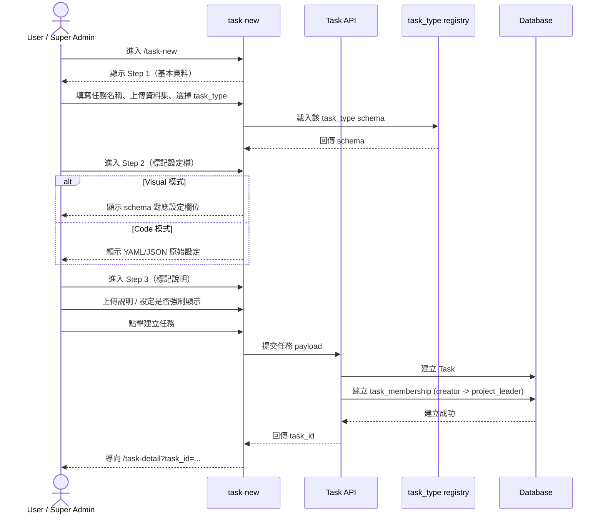
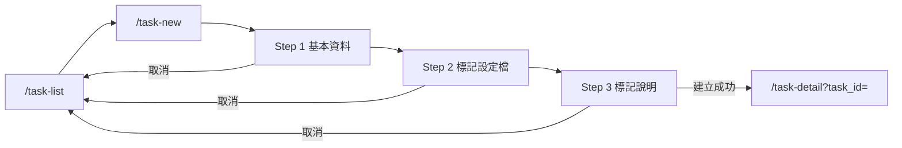

# 功能規格：New Task — 新增任務（Step 1–3 + 標記設定檔）

**功能分支**：`013-task-new`
**建立日期**：2026-04-20
**版本**：1.2.0
**狀態**：Draft
**需求來源**：IA Spec 清單 #013 — 新增任務（Step 1–3 + 標記設定檔 全任務類型）（`task-new`）

## 規格常數

- `SYSTEM_ROLES = user | super_admin`
- `TASK_ROLES = project_leader | reviewer | annotator`
- `TASK_CREATION_STEPS = step-1-basic | step-2-config-builder | step-3-guideline`
- `TASK_CONFIG_MODES = visual | code`
- `CONFIG_FORMATS = yaml | json`
- `TASK_CREATOR_SYSTEM_ROLES = user | super_admin`
- `DATASET_UPLOAD_FORMATS = txt | csv | tsv | json`
- `DATASET_MAX_FILE_SIZE_MB = 200`
- `DATASET_MAX_ROWS = 1000000`
- `DATASET_ENCODING = utf-8`
- `GUIDELINE_FORMATS = pdf | image | markdown`
- `GUIDELINE_IMAGE_FORMATS = png | jpg | jpeg | webp`
- `IDEMPOTENCY_WINDOW_HOURS = 24`
- `MOBILE_BP = 767px`
- `RWD_VIEWPORTS = 375px / 768px / 1440px`

## Process Flow

| 步驟 | 角色 | 動作 | 系統回應 |
|------|------|------|---------|
| 1 | `user` / `super_admin` | 進入 `/task-new` | 顯示 Step 1 基本資料 |
| 2 | `user` / `super_admin` | 選擇 `task_type` | 載入對應 schema 與 Step 2 設定介面 |
| 3 | `user` / `super_admin` | 完成 Step 2 標記設定檔 | 產生可提交的 config |
| 4 | `user` / `super_admin` | 完成 Step 3 標記說明設定 | 記錄說明資產與強制顯示設定 |
| 5 | `user` / `super_admin` | 建立任務 | 建立 task 與 creator 的 `project_leader` membership |
| 6 | `user` / `super_admin` | 取消建立流程 | 導回 `/task-list` |

---

## 使用者情境與測試 *(必填)*

### User Story 1 — 完成 3 步驟任務建立流程（優先級：P1）

使用者可透過 Step 1 → Step 2 → Step 3 完成任務建立，並在成功後進入任務詳情頁。

**此優先級原因**：建立任務是整個任務生命週期的起點。  
**獨立測試方式**：依序填完三步驟並提交，驗證建立成功、導頁、membership 建立。

**驗收情境**：

1. **Given** 已登入且可使用任務管理模組，**When** 完成 Step 1~3 並提交，**Then** 成功建立任務且導向 `/task-detail?task_id=...`。
2. **Given** 建立成功，**When** 檢查任務成員資料，**Then** 建立者自動有一筆 `project_leader` 的 `task_membership`。
3. **Given** 正在建立流程中，**When** 點擊取消，**Then** 導回 `/task-list` 且不建立任務。

**介面定義（需與 IA 導覽語意一致）**：

- Step 1：`基本資料`
  - 必要欄位：`task_name`、`dataset_file`、`task_type`
  - 畫面元素：`task_name` 單行輸入、`dataset_file` 上傳區（顯示檔名/大小/格式）、`task_type` 下拉選單
- Step 2：`標記設定檔`
  - 必要元素：`Visual / Code` 模式切換、task-type 模板入口、schema 驅動設定面板
  - 畫面元素：左側設定區、右側預覽區（或同頁預覽區）、欄位級錯誤訊息
  - 研究情境必備任務型別（第一層）：
    - `single_sentence_classification`（含多標籤）
    - `single_sentence_scoring_regression`（VA 評分 / 回歸）
    - `sequence_labeling`（含 Aspect 抽取 / NER）
    - `relation_extraction`（Entity + Relation + Triple，可擴充五元組）
  - 延伸任務型別（第二層）：`sentence_pairs`（相似度 / 蘊含）
- Step 3：`標記說明`
  - 必要元素：說明資產上傳（PDF/圖片/文字）、`開始標記前強制顯示` 開關
  - 畫面元素：上傳列表（可移除）、Markdown 編輯區、強制顯示 toggle
- 操作列：`上一步`、`下一步`、`取消`、`建立任務`

**行為規則**：

- 僅 `TASK_CREATOR_SYSTEM_ROLES` 可進入 `/task-new` 並提交建立任務。
- 未完成當前步驟必要欄位不得進入下一步。
- 建立成功前不得寫入正式任務資料。
- 建立成功後導向 `task-detail`，L0 active 保持「任務管理」。

**Prototype 互動規格（本版必做）**：

- Step 1 `下一步` 按鈕預設 disabled；當且僅當 `task_name` 非空、已選 `task_type`、dataset 檔案通過格式/大小/編碼檢查後 enabled。
- Step 2 `下一步` 按鈕預設 disabled；schema 必填欄位通過且無 parser/schema error 才 enabled。
- Step 3 的 `建立任務` 按鈕永遠可見；Step 3 為選填，未上傳說明也可提交。
- 任一步驟點擊 `取消` 或離開頁面（側欄跳轉、重新整理、關閉分頁）時，若已有變更需顯示「離開將遺失未儲存內容」確認視窗。
- 驗證錯誤顯示採欄位下方 inline message + 頁首 toast；訊息需指出欄位名稱與修正方向。

---

### User Story 2 — 標記設定檔 以 registry/schema 驅動（優先級：P1）

Step 2 必須由 `task_type registry` 與 schema 驅動，不得把任務類型寫死在核心流程。

**此優先級原因**：符合架構要求「新增 task type 不需修改核心流程」。  
**獨立測試方式**：切換不同 `task_type`，驗證 UI 與校驗規則由 schema 自動生成；切換 Visual/Code 內容一致。

**驗收情境**：

1. **Given** 在 Step 2 且已選擇 `task_type`，**When** 載入頁面，**Then** 以對應 schema 產生設定欄位。
2. **Given** 在 Step 2，**When** 從 Visual 切到 Code 模式，**Then** 顯示等價的 YAML/JSON config。
3. **Given** 在 Code 模式手動修改設定，**When** 切回 Visual，**Then** 能映射的欄位需同步更新；無效設定需顯示錯誤。
4. **Given** 平台新增一種 task type 到 registry，**When** 使用者進入 Step 1/Step 2，**Then** 可選到新型別並看到對應設定，無需變更核心流程。

**介面定義**：

- 區塊 A：`從範本開始`
  - 必要元素：預設模板列表、套用按鈕
- 區塊 B：`Visual 模式`
  - 必要元素：schema 驅動欄位、即時校驗訊息
  - 必要預設模板：
    - 多標籤分類模板（對應 MultiLabel 實務）
    - 單句評分 / 回歸模板（對應 VA 實務）
    - 序列標記模板（對應 Aspect / NER 實務）
    - 關係抽取模板（對應 Entity + Relation + Triple 實務）
- 區塊 C：`Code 模式`
  - 必要元素：YAML/JSON 編輯區、格式與 schema 驗證結果

**行為規則**：

- `task_type` 選項來源必須為 registry，而非前端硬編碼清單。
- Visual 與 Code 需共享同一份結構化 config source-of-truth。
- 提交前需通過 schema 驗證；失敗不得進入任務建立 API。
- Visual -> Code：每次切換都重新輸出最新 config（YAML/JSON 由同一 source-of-truth 產生）。
- Code -> Visual：可映射欄位回填到 UI；不可映射欄位保留於 code 並顯示「僅可於 Code 編輯」提示，不可直接遺失。
- Code 解析失敗時維持在 Code 模式，保留使用者原始輸入，不自動覆蓋。
- 研究生目前實際任務需可直接對應至既有模板：
  - MultiLabel 勾選分類 -> `single_sentence_classification`
  - VA 分數標註 -> `single_sentence_scoring_regression`
  - Aspect 抽取 / 校正 -> `sequence_labeling`
  - Entity + Relation + Triple（五元組流程）-> `relation_extraction`

---

### User Story 3 — 標記說明與強制顯示設定（優先級：P2）

Project Leader 在建立任務時可設定標記說明資產，並決定 annotator 進入作業前是否強制顯示。

**此優先級原因**：可降低任務啟動時的學習成本與操作錯誤。  
**獨立測試方式**：上傳說明資產並啟用強制顯示，驗證設定儲存到任務並可供 annotation 模組使用。

**驗收情境**：

1. **Given** 位於 Step 3，**When** 上傳說明文件並完成建立，**Then** 任務保存對應說明資產。
2. **Given** 位於 Step 3，**When** 啟用 `開始標記前強制顯示`，**Then** 任務設定需紀錄此旗標供 annotation-workspace 讀取。

**行為規則**：

- 支援 `GUIDELINE_FORMATS`，其中 `image` 僅允許 `GUIDELINE_IMAGE_FORMATS`，`text` 以 `markdown` 儲存；超出格式需阻擋並提示。
- Step 3 為選填，不填仍可建立任務。
- 強制顯示設定預設為關閉。

---

### Edge Cases

- 非 `TASK_CREATOR_SYSTEM_ROLES` 造訪 `/task-new`：導回允許入口並顯示無權限提示。
- 上傳資料集格式不在 `DATASET_UPLOAD_FORMATS`：阻擋進下一步並顯示錯誤。
- 上傳資料集超過 `DATASET_MAX_FILE_SIZE_MB`、非 `DATASET_ENCODING` 或超過 `DATASET_MAX_ROWS`：阻擋進下一步並顯示可定位錯誤。
- 切換 `task_type` 後已填 Step 2 設定不相容：提示重置或轉換失敗欄位。
- Code 模式輸入非有效 YAML/JSON：保留輸入內容並顯示可定位錯誤。
- 使用者在 Step 1~3 有變更後直接離頁：需先跳確認視窗，選擇「離開」才可導頁。
- 建立中（submit pending）重複點擊 `建立任務`：按鈕進入 loading 並禁止重複提交。
- 建立任務 API 成功但 membership 建立失敗：整體交易需回滾，避免孤兒任務。
- 網路中斷導致重送：同一 `Idempotency-Key` 於 `IDEMPOTENCY_WINDOW_HOURS` 內必須回傳同一 `task_id`，不得重複建立任務。

---

## 需求規格 *(必填)*

### 功能需求

- **FR-001**：系統必須提供 `/task-new` 三步驟建立流程（Step 1/2/3）。
- **FR-001a**：僅 `TASK_CREATOR_SYSTEM_ROLES` 可進入 `/task-new` 與呼叫建立任務 API。
- **FR-002**：Step 1 必須要求任務名稱、資料集、`task_type`。
- **FR-002a**：資料集上傳必須限制於 `DATASET_UPLOAD_FORMATS`，且符合 `DATASET_MAX_FILE_SIZE_MB`、`DATASET_MAX_ROWS`、`DATASET_ENCODING`。
- **FR-003**：Step 2 標記設定檔 必須由 `task_type registry` 與 schema 驅動。
- **FR-003a**：系統必須支援 `Visual` 與 `Code` 兩種設定模式。
- **FR-003b**：Visual 與 Code 必須同步同一份 config，並在提交前通過 schema 驗證。
- **FR-003c**：新增 task type 應可透過 registry/schema 擴充，不修改核心流程（Step 1–3）。
- **FR-003d**：系統預設必須至少提供研究情境第一層任務型別：`single_sentence_classification`、`single_sentence_scoring_regression`、`sequence_labeling`、`relation_extraction`。
- **FR-004**：Step 3 必須支援標記說明資產上傳與強制顯示設定。
- **FR-004a**：Step 3 指南格式必須支援 `GUIDELINE_FORMATS`，其中 `image` 受限於 `GUIDELINE_IMAGE_FORMATS`，文字內容以 `markdown` 儲存。
- **FR-005**：提交成功後，系統必須建立任務並導向 `/task-detail`。
- **FR-005a**：任務建立成功時，系統必須自動建立一筆 `task_membership`，並將建立者設為 `project_leader`。
- **FR-005b**：建立任務 API 必須支援 `Idempotency-Key`；同一 key 在 `IDEMPOTENCY_WINDOW_HOURS` 內重送時回傳同一 `task_id`。
- **FR-006**：取消建立流程時，系統必須導回 `/task-list` 且不寫入任務。
- **FR-006a**：使用者在任一步驟已有未儲存變更時，離頁前必須顯示確認視窗（含取消建立、側欄跳頁、重新整理、關閉分頁）。
- **FR-007**：頁面必須支援 `RWD_VIEWPORTS`，在 `<= MOBILE_BP` 仍可完成三步流程。
- **FR-007a**：在 `375px`、`768px`、`1440px` 三個 viewport，必須可完成：Step 1 填寫與驗證、Step 2 Visual/Code 切換與驗證、Step 3 上傳或略過、建立成功導頁、取消返回。
- **FR-008**：任務型別模板需覆蓋研究生現行任務情境（MultiLabel、VA 評分、Aspect 抽取、Entity/Relation/Triple）。

### User Flow & Navigation

| From | Trigger | To |
|------|---------|-----|
| `/task-list` | 點擊 `新增任務` | `/task-new` |
| Step 1 | 點擊 `下一步`（驗證通過） | Step 2 |
| Step 2 | 點擊 `下一步`（驗證通過） | Step 3 |
| Step 3 | 點擊 `建立任務`（提交成功） | `/task-detail?task_id=...` |
| 任一步驟 | 點擊 `取消` | `/task-list` |

**Entry points**：`/task-list` 的 `新增任務` CTA。  
**Exit points**：建立成功進 `/task-detail`、取消返回 `/task-list`。

### 關鍵實體

- **TaskDraftInput**：建立任務輸入草稿。欄位：`task_name`、`dataset`、`task_type`、`config`、`guideline_assets`、`force_guideline`。
- **TaskTypeRegistryItem**：任務類型定義。欄位：`task_type`、`display_name`、`schema`、`default_templates`。
- **TaskConfig**：schema 驗證後設定內容（供 annotation/dataset 模組使用）。
- **TaskMembership**：建立者自動加入的任務角色關係。

---

## 規格相依性 *(本功能依賴其他規格，或被其他規格依賴時填寫)*

### 上游（本規格依賴的規格）

| 規格編號 | 功能 | 本規格需要的內容 |
|---------|------|----------------|
| 010 | Task List | 新增任務入口與導覽關係 |
| 001 | Login — Email / Password | 已登入狀態與身份識別 |
| 008 | Shared Sidebar Navbar | L0 active 與跨頁導覽一致性 |

### 下游（依賴本規格的規格）

| 規格編號 | 功能 | 依賴本規格的內容 |
|---------|------|----------------|
| 014 | Task Detail | 建立成功後導向與初始任務資料 |
| 015 | Annotation Workspace | 讀取 task config 與標記說明設定 |
| 016 | Dataset Stats | 依 `task_type` 與 config 呈現統計 |
| 017 | Dataset Quality | 依 `task_type` 與 config 計算品質指標 |

---

## 成功標準 *(必填)*

- **SC-001**：使用者可在同一流程完成 Step 1~3 並成功建立任務。
- **SC-002**：任務建立成功後，自動建立 creator 的 `project_leader` membership。
- **SC-003**：Step 2 可依 registry/schema 產生設定介面，且 Visual/Code 雙模式一致。
- **SC-004**：新增 task type 到 registry 後，可直接在流程中使用，不需改核心流程程式碼。
- **SC-004a**：研究生現行四種任務情境（MultiLabel、VA 評分、Aspect 抽取、Entity/Relation/Triple）可在 `task-new` 以預設模板完成設定。
- **SC-005**：在 `375px`、`768px`、`1440px` 下皆可完成：Step 1 填寫與驗證、Step 2 模式切換與驗證、Step 3 上傳或略過、建立成功導頁、取消返回，且驗證錯誤可被清楚定位。
- **SC-006**：非 `TASK_CREATOR_SYSTEM_ROLES` 不可建立任務；同一 `Idempotency-Key` 於 `IDEMPOTENCY_WINDOW_HOURS` 內重送不會重複建立任務。

---

## Changelog

| 版本 | 日期 | 變更摘要 |
|------|------|---------|
| 1.0.0 | 2026-04-20 | 初版建立：依 IA 重建 `task-new` 規格（三步流程、registry-driven 標記設定檔、說明設定） |
| 1.1.0 | 2026-04-20 | 補強 prototype 導向規格：步驟按鈕啟用條件、離頁確認、Visual/Code 同步策略、空/有資料狀態與錯誤呈現規則 |
| 1.2.0 | 2026-04-20 | 同步 IA：新增研究情境任務型別覆蓋（MultiLabel/VA/Aspect/Relation）；將 FR-008 改為任務覆蓋要求 |
