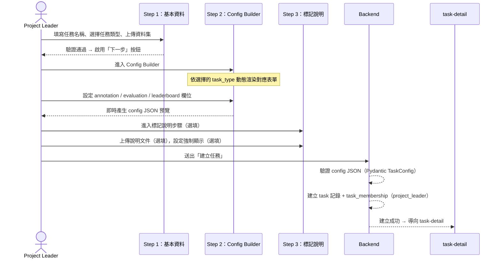
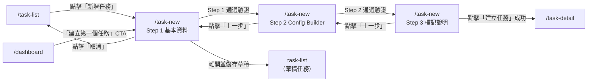

# 功能規格：新增任務頁（含 Config Builder）

**功能分支**：`013-task-new`
**建立日期**：2026-04-05
**狀態**：Draft
**需求來源**：IA v7 Spec 清單 #018–022 合併 — 新增任務三步驟流程

---

## Process Flow

新增任務採三步驟精靈（Wizard）流程，每步驟完成後方可進入下一步。建立完成後系統自動將建立者設為任務的 `project_leader`。

| 步驟 | 角色 | 操作 | 系統回應 |
|------|------|------|---------|
| 1 | Project Leader | 填寫任務名稱（必填）、撰寫任務描述（選填）、選擇任務類型（5 選 1，必填）、上傳資料集（txt / csv / tsv / json，必填） | 即時驗證欄位格式；上傳後顯示資料集預覽（筆數、欄位名稱）；所有必填欄位通過後啟用「下一步」|
| 2 | Project Leader | 在 Config Builder 設定 annotation 欄位（依任務類型）、evaluation 指標、leaderboard 設定；可切換 Visual / Code 模式；可套用預設範本 | Visual 模式即時更新 Code 模式的 JSON 預覽；欄位驗證錯誤即時顯示；必填欄位未填完時「下一步」維持停用 |
| 3 | Project Leader | （選填）上傳標記說明文件（PDF / 圖片 / 文字）；設定「開始標記前強制顯示」開關 | 顯示已上傳檔案清單；開關狀態即時儲存至 config |
| 4 | 系統 | 使用者點擊「建立任務」 | 後端以 Pydantic TaskConfig 驗證 config JSON；驗證通過後建立 task 及 task_membership 記錄；導向 task-detail；驗證失敗顯示錯誤 toast |

---

## 使用者情境與測試（必填）

### User Story 1 — Project Leader 完成三步驟建立任務（優先級：P1）

已登入且系統角色為 `user` 的使用者，透過三步驟精靈完整填寫基本資料、Config Builder 設定、標記說明後建立任務，系統自動將其設為該任務的 `project_leader`。

**此優先級原因**：新增任務是整個標記流程的起點；無法建立任務則所有後續功能（Dry Run、標記作業、統計分析）皆無從發生。

**獨立測試方式**：以 `user` 系統角色使用者登入，完成三步驟表單送出，確認 task-detail 正確顯示任務資訊，且使用者在 `task_membership` 中具有 `project_leader` 角色。

**驗收情境**：

1. **Given** 已登入使用者（系統角色 `user`）在 `/task-new`，**When** 完成 Step 1（填寫任務名稱、選擇任務類型 `classification`、上傳合法 CSV 資料集），**Then** 系統顯示資料集預覽（筆數與欄位名稱）並啟用「下一步」按鈕。
2. **Given** 使用者進入 Step 2，**When** 在 Visual 模式新增兩個以上標籤（LabelItem）並選定 `f1_macro` 評估指標，**Then** Code 模式同步顯示對應 config JSON；所有必填欄位通過驗證後啟用「下一步」。
3. **Given** 使用者完成 Step 3 並點擊「建立任務」，**When** 後端 Pydantic 驗證通過，**Then** 頁面導向新建任務的 `/task-detail`，且任務狀態顯示為「草稿」；使用者的 `task_membership` 記錄中 `task_role = project_leader`。

---

### User Story 2 — 套用範本快速建立任務（優先級：P2）

Project Leader 在 Step 2 點擊「從範本開始」，選擇預設範本（如「情感三分類」、「中文醫療 NER」），系統套用完整 config 供微調，降低設定門檻。

**此優先級原因**：範本功能減少重複工作並提供最佳實踐示範，提升易用性，但不影響核心建立流程。

**獨立測試方式**：在 Step 2 選擇任一預設範本，確認 Visual 模式欄位與 Code 模式 JSON 均被範本值填充，且使用者可在套用後繼續編輯。

**驗收情境**：

1. **Given** 使用者在 Step 2（任務類型 `classification`），**When** 點擊「從範本開始」並選擇「情感三分類（正面 / 負面 / 中立）」，**Then** labels 欄位自動填入三個預設標籤（含 id、display、color），`allow_multiple` 設為 `false`，評估指標設為 `f1_macro`。
2. **Given** 使用者套用範本後，**When** 修改任一標籤的 display 文字，**Then** Code 模式 JSON 即時反映修改，範本中其他未修改欄位維持不變。
3. **Given** 使用者套用 `ner` 類型範本（如「中文醫療 NER」），**When** 查看 Visual 模式，**Then** entity_types 清單顯示範本預設實體（疾病 / 症狀 / 藥物 / 解剖部位），顏色均已帶入 HEX 色碼。

---

### User Story 3 — 儲存草稿與離開提示（優先級：P2）

使用者在未完成三步驟時離開頁面（關閉分頁、點擊 Navbar 連結或瀏覽器返回），系統詢問是否儲存草稿，避免已輸入的內容遺失。

**此優先級原因**：Config Builder 設定可能耗費大量時間；離開提示與草稿功能防止意外資料遺失，提升操作安全性。

**獨立測試方式**：在 Step 2 填入部分欄位後嘗試離開頁面，確認出現離開確認 modal；選擇「儲存草稿」後重新進入 `/task-new`，確認資料復原。

**驗收情境**：

1. **Given** 使用者在 Step 1 填寫任務名稱後點擊 Navbar 其他連結，**When** 表單有任何已輸入內容，**Then** 系統顯示「離開前是否儲存草稿？」確認 modal，提供「儲存草稿」「不儲存離開」「繼續編輯」三個選項。
2. **Given** 使用者選擇「儲存草稿」，**When** 後端儲存成功，**Then** 任務以 `status = draft` 建立並存入資料庫；使用者導向原定頁面；任務出現在 `/task-list`（狀態：草稿）。
3. **Given** 使用者重新進入 `/task-new` 且系統偵測到草稿存在，**When** 頁面載入，**Then** 顯示「您有一份未完成的草稿，是否繼續編輯？」，選擇繼續時恢復至離開時的步驟與所有已填欄位。

---

### 邊界情況

- **上傳格式錯誤**：上傳非 txt / csv / tsv / json 的檔案時，系統即時顯示「不支援的檔案格式」錯誤提示，不允許進入下一步。
- **資料集欄位不符**：上傳的 CSV / TSV 缺少任務類型所需的欄位時（例如句對任務需要 sentence1、sentence2），系統在預覽區顯示警告說明缺失欄位，允許使用者更換檔案後繼續。
- **Config Builder 必填欄位缺失**：`classification` 的 labels 數量少於 2、`ner` 的 entity_types 為空，或 `relation` 的 relation_types 為空時，「下一步」按鈕維持停用並顯示對應錯誤說明。
- **Code 模式語法錯誤**：使用者在 Code 模式直接編輯 JSON 時，若 JSON 語法不合法（parse 失敗）或欄位值不符合 Pydantic 約束，頁面顯示行號與錯誤說明；Visual 模式顯示「目前設定包含錯誤，請修正後再切換」提示。
- **scoring `step` 不整除**：當 `(max - min) % step ≠ 0` 時，Config Builder 即時顯示欄位錯誤「刻度單位無法整除評分範圍」。
- **`entity_types[].color` 未填（NER / Relation）**：因 span highlight 需要顏色，系統在使用者未填色碼時顯示欄位錯誤，不允許進入下一步。
- **資料集超出大小限制**：若上傳檔案超過系統上限（如 50 MB），立即顯示「檔案大小超過限制（最大 50 MB）」提示並取消上傳。
- **`metric` 與 `task_type` 不匹配**：例如 `classification` 選用 `krippendorff_alpha` 時，Config Builder 顯示警告「此指標不建議用於分類任務」；後端 Pydantic 僅驗證 metric 是否存在於 Registry，不強制拒絕，但前端需有引導。

---

## 需求規格（必填）

### 功能需求

- **FR-001**：`/task-new` 僅限系統角色 `user` 或 `super_admin` 的已登入使用者存取 — 透過 RoleGuard 強制。
- **FR-002**：建立任務流程分三步驟（Step 1 基本資料 → Step 2 Config Builder → Step 3 標記說明），步驟指示器顯示目前進度；前一步未通過驗證時不得跳至後續步驟。
- **FR-003**：Step 1 必填欄位：任務名稱（最長 100 字元）、任務類型（`classification` | `scoring` | `sentence_pair` | `ner` | `relation`）、資料集檔案（txt / csv / tsv / json）；任務描述為選填。
- **FR-004**：資料集上傳後，系統必須在 Step 1 顯示預覽資訊（筆數、欄位名稱），讓使用者確認格式正確。
- **FR-005**：Step 2 Config Builder 依 Step 1 所選的 `task_type` 動態渲染對應欄位，不同任務類型之間的 UI 與欄位設定互不干擾，符合「Generalization-First，no hardcoded task logic」原則。
- **FR-006**：Config Builder 提供 Visual 模式（預設）與 Code 模式，兩種模式可即時切換且資料同步；Visual 模式修改立即反映在 Code 模式的 JSON 預覽；Code 模式合法修改立即更新 Visual 模式欄位。
- **FR-007**：Config Builder 提供「從範本開始」入口，至少提供以下預設範本（依 task_type 分組）：
  - `classification`：情感三分類（正 / 負 / 中立）
  - `ner`：中文醫療 NER（疾病 / 症狀 / 藥物 / 解剖部位）
  - 其他類型範本由實作時依實際需求補充。
- **FR-008**：`classification` 與 `sentence_pair`（分類模式）的 Config Builder 必須支援標籤清單的新增、編輯（id / display / color）與刪除；labels 數量不得少於 2。
- **FR-009**：`scoring` 與 `sentence_pair`（評分模式）的 Config Builder 必須提供 `min`、`max`、`step`、`widget_type` 四個欄位，並即時驗證 `(max - min) % step == 0`。
- **FR-010**：`ner` 的 Config Builder 必須支援 entity_types 清單的新增、編輯（id / display / color）與刪除；`color` 為必填 HEX 色碼；entity_types 不得為空。
- **FR-011**：`relation` 的 Config Builder 在 `ner` 基礎上另需支援 relation_types 清單的新增、編輯（id / display / description）與刪除；relation_types 不得為空。
- **FR-012**：`sentence_pair` 的 Config Builder 必須先讓使用者選擇 `annotation.mode`（`classification` | `scoring`），再渲染對應子欄位。
- **FR-013**：`evaluation.metric` 欄位必須只列出對應 task_type 的建議指標（來自 config-schema.md § 5 Registry），防止不相容組合。
- **FR-014**：`leaderboard` 區塊（`visible` 開關、`submission_limit_per_day`、`show_scores_after_deadline`）必須在 Step 2 提供設定入口。
- **FR-015**：Step 3 允許上傳標記說明文件（PDF / 圖片 / 純文字），可上傳多份；提供「開始標記前強制顯示」開關（預設關閉）。
- **FR-016**：任何步驟中使用者嘗試離開頁面（Navbar 連結、瀏覽器返回、關閉分頁），若表單有已輸入內容，系統必須顯示「儲存草稿 / 不儲存離開 / 繼續編輯」確認 modal。
- **FR-017**：任務建立成功後，後端必須同步在 `task_membership` 中建立一筆記錄（`user_id = 建立者`, `task_role = project_leader`）。
- **FR-018**：任務建立成功後系統必須導向 `/task-detail/{task_id}`。
- **FR-019**：後端必須以 Pydantic `TaskConfig` 驗證 config JSON；驗證失敗時回傳欄位層級錯誤訊息，前端顯示於對應欄位旁。
- **FR-020**：`super_admin` 在建立任務後，同樣自動成為該任務的 `project_leader`；`super_admin` 的任務建立能力等同 `user`，不另行擴充。

### User Flow & Navigation

| From | Trigger | To |
|------|---------|-----|
| `/task-list` | 點擊「新增任務」按鈕 | `/task-new`（Step 1）|
| `/dashboard` | 空狀態 CTA「建立第一個任務」 | `/task-new`（Step 1）|
| `/task-new` Step 1 | Step 1 驗證通過，點擊「下一步」 | `/task-new`（Step 2）|
| `/task-new` Step 2 | Step 2 驗證通過，點擊「下一步」 | `/task-new`（Step 3）|
| `/task-new` Step 3 | 點擊「建立任務」且後端驗證通過 | `/task-detail/{task_id}` |
| `/task-new` 任一步驟 | 點擊「取消」或「上一步」至 Step 1 再取消 | `/task-list` |
| `/task-new` 任一步驟 | 離開時選擇「儲存草稿」 | 原定導向頁面（草稿留在 task-list）|

**Entry points**：`/task-list` 右上角「新增任務」按鈕；`/dashboard`（空狀態）「建立第一個任務」CTA。
**Exit points**：建立成功 → `/task-detail`；取消 → `/task-list`；儲存草稿 → 草稿出現於 `/task-list`。

### 關鍵實體

- **Task（任務）**：`id`（UUID）、`name`（string，≤ 100 字元）、`description`（string，選填）、`task_type`（enum：`classification` | `scoring` | `sentence_pair` | `ner` | `relation`）、`config`（JSONB，符合 config-schema.md 頂層結構）、`status`（`draft` | `dry_run` | `waiting_iaa` | `official_run` | `completed`，建立時預設 `draft`）、`created_by`（user_id FK）、`created_at`（timestamp）、`updated_at`（timestamp）。
- **TaskMembership（任務成員資格）**：`task_id`（FK）、`user_id`（FK）、`task_role`（`project_leader` | `reviewer` | `annotator`）；任務建立時由後端自動插入一筆 `project_leader` 記錄。
- **Dataset（資料集）**：`task_id`（FK）、`file_name`、`file_type`（txt / csv / tsv / json）、`row_count`、`columns`（JSON 陣列）、`uploaded_at`（timestamp）；與 Task 1 對 1。
- **TaskConfig（config JSON 子結構）**：頂層欄位為 `task`、`annotation`（依 task_type 而異）、`evaluation`（`metric`、`primary_metric`、`higher_is_better`、`decimal_places`）、`leaderboard`（`visible`、`submission_limit_per_day`、`show_scores_after_deadline`）。完整欄位規則見 `docs/schema/config-schema.md`。

---

## 成功標準（必填）

- **SC-001**：Project Leader 可在 5 分鐘內完成三步驟建立一個 `classification` 任務（含上傳資料集、設定 3 個標籤）。
- **SC-002**：Config Builder 的 Visual 模式與 Code 模式切換延遲不超過 300 ms，資料完全同步無遺失。
- **SC-003**：非法 config（如 labels < 2、entity_types 為空、step 不整除）在前端 Config Builder 即時攔截，後端 Pydantic 驗證作為最後防線，兩層驗證均通過才建立任務。
- **SC-004**：任務建立後，使用者在 `/task-detail` 所見的任務類型、config 內容與上傳時設定完全一致（無資料遺失或錯誤序列化）。
- **SC-005**：草稿儲存與恢復功能正確：儲存草稿後離開，再次進入 `/task-new` 可恢復至離開時的步驟與欄位值。
